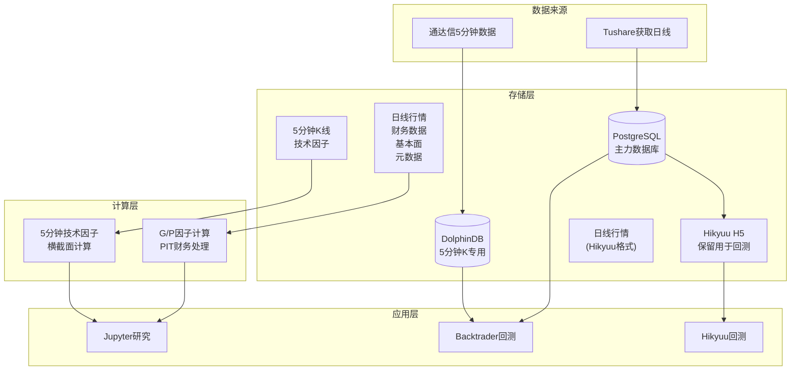

# DolphinDB轻量级集成方案

## 1. 背景与目标

### 1.1 现状分析

作为个人量化投资者,当前AlphaHome系统存在以下特点:

**现有架构特点**
- PostgreSQL作为核心数据存储,承载Tushare数据
- 基于Hikyuu+TDX的5分钟K线数据,存储在H5文件中
- 使用PostgreSQL物化视图进行PIT财务数据处理
- G因子/P因子计算框架基于PostgreSQL
- 回测主要依赖Backtrader或Hikyuu

**个人投资者的实际需求**
- 数据规模:全A股约5000只股票,历史数据10年左右
- 数据频率:日线为主,5分钟K线为辅,无高频逐笔需求
- 使用场景:因子研究、策略回测、少量实盘信号生成
- 资源约束:个人PC/服务器,成本敏感

**潜在优化点识别**
- 5分钟K线数据查询:H5文件灵活性不足,难以进行复杂筛选
- 因子计算效率:大规模多因子计算时PostgreSQL窗口函数性能一般
- 数据分散问题:日线在PG,5分钟在H5,查询时需要切换
- 回测性能:Backtrader在大规模回测时速度较慢

### 1.2 务实的集成目标

**核心目标:补齐短板,而非重构全部**
- 将5分钟K线数据迁移到DolphinDB,提升查询灵活性
- 建立轻量级的因子计算加速层,针对计算密集型因子
- 保持现有PostgreSQL和Hikyuu体系不变,增量扩展

**非目标(避免过度设计)**
- ❌ 不迁移日线数据(PostgreSQL足够用)
- ❌ 不迁移财务数据(PIT体系已成熟)
- ❌ 不建立复杂的实时计算链路(个人无实时交易需求)
- ❌ 不做多机部署(单机版足够)

## 2. DolphinDB个人版评估

### 2.1 为什么考虑DolphinDB?

**针对个人投资者的优势**
- 单机版社区版可满足个人规模使用,无License成本
- 向量化计算,5分钟K线多股票聚合查询通常显著快于H5/Pandas路径
- 内置丰富的时间序列/技术指标函数,减少重复造轮子

**与现有工具的对比**

| 对比维度 | H5文件 | PostgreSQL | DolphinDB单机版 |
|---------|-------|-----------|----------------|
| 5分钟K查询速度 | 快(单股票) | 慢 | 非常快 |
| 复杂筛选能力 | 差 | 好 | 很好 |
| 多股票聚合 | 慢 | 中等 | 快 |
| 窗口函数计算 | 需Pandas | SQL窗口函数 | 向量化内置函数 |
| 因子计算便利性 | 差 | 中等 | 好 |
| 学习成本 | 低 | 低 | 中 |
| 额外成本 | 无 | 无 | 低(仅学习/运维) |

### 2.2 适合个人投资者的使用场景

**推荐使用DolphinDB的场景**
- 5分钟K线数据存储与查询(替代H5做研究/选股/回测数据源)
- 计算密集型技术因子(均线/动量/波动率/滚动回归等)
- 多股票横截面因子计算(如动量排名、市值分组)

**继续使用PostgreSQL的场景**
- 日线行情数据(现有体系稳定)
- PIT财务数据和G/P因子(已投入大量开发)
- 元数据管理(任务日志、配置等)
- 基本面数据(财报、分类等)

**继续使用Hikyuu+H5的场景**
- 已有Hikyuu回测脚本可继续使用
- H5短期可作为兼容缓存/回滚路径

## 3. 轻量级集成架构

### 3.1 整体思路

**设计原则:最小化改动,增量扩展**
- PostgreSQL:继续作为主力数据库
- DolphinDB:仅存储5分钟K线和部分计算密集型因子
- Hikyuu+H5:保留现有回测流程

### 3.2 简化架构图



### 3.3 数据存储分工

| 数据类型 | 存储位置 | 理由 |
|---------|---------|------|
| 股票日线行情 | PostgreSQL | 已有完善的采集和处理流程 |
| 股票5分钟K线 | DolphinDB | 查询灵活,计算高效 |
| 财务报表数据 | PostgreSQL | PIT体系已成熟 |
| 指数成分权重 | PostgreSQL | 低频数据,PG足够 |
| 行业分类数据 | PostgreSQL | 低频数据,PG足够 |
| G因子/P因子结果 | PostgreSQL | 主存储,按需镜像到DDB |
| 技术因子结果 | DolphinDB | 计算在DDB,结果也存DDB |
| Hikyuu回测数据 | H5文件 | 保留现有流程 |

## 4. 核心功能设计

### 4.1 DolphinDB连接管理器(简化版)

参考现有DBManager设计,提供一个轻量级的DolphinDB连接管理器。

**接口设计(概念)**

```python
class DolphinDBManager:
    """DolphinDB连接管理器(个人版精简实现)"""

    def __init__(self, host="localhost", port=8848):
        """初始化连接"""

    def connect(self) -> bool:
        """建立连接"""

    def append_dataframe(self, df, table_name: str, db_name: str) -> bool:
        """追加DataFrame到分区表"""

    def query(self, sql: str):
        """执行查询返回DataFrame"""

    def run_script(self, script: str):
        """执行DolphinDB脚本"""

    def close(self):
        """关闭连接"""
```

### 4.2 5分钟K线数据导入器（Hikyuu HDF5）

导入器负责将 Hikyuu(hikyuutdx) 从通达信服务器下载的 5分钟K线（HDF5）导入到 DolphinDB 分区表。

**数据目录与文件约定**
- 数据目录：优先从配置 `backtesting.hikyuu_data_dir` 获取；如缺失可通过环境变量 `HIKYUU_DATA_DIR` 回退（常见为 `E:/stock`）
- 5分钟文件名：`sh_5min.h5` / `sz_5min.h5` / `bj_5min.h5`
- 数据集路径：`/data/{MKT}{CODE}`（如 `/data/SZ000001`）

**分区方案设计(建议)**

```
数据库: dfs://kline_5min
表名: kline_5min
分区方案: VALUE(月份) + HASH(股票代码, 10)
排序字段: [ts_code, trade_time]
去重策略: LAST (保留最新数据)
```

说明:
- 建议显式增加 month 列(形如 202401)，作为VALUE分区字段,避免在分区字段上频繁做函数计算。
- trade_time 统一使用交易所本地时间(无时区)并保持格式一致。

**字段定义**

| 字段名 | 类型 | 说明 |
|-------|------|------|
| ts_code | SYMBOL | 股票代码 |
| trade_time | TIMESTAMP | 交易时间 |
| open | DOUBLE | 开盘价 |
| high | DOUBLE | 最高价 |
| low | DOUBLE | 最低价 |
| close | DOUBLE | 收盘价 |
| vol | LONG | 成交量 |
| amount | DOUBLE | 成交额 |

**导入流程**

| 步骤 | 操作内容 | 预期结果 |
|-----|---------|----------|
| 1 | 读取Hikyuu H5数据集 | DataFrame格式 |
| 2 | 数据验证 | 字段/类型通过验证 |
| 3 | 格式转换 | 时间戳与代码映射正确 |
| 4 | 批量写入DolphinDB | 成功写入 |
| 5 | 可选:同步H5 | 双份存储/兼容回测 |

### 4.3 技术因子计算示例

**DolphinDB脚本示例(概念)**

```
// 查询某只股票近100天的5分钟K线
data = select * from loadTable("dfs://kline_5min", "kline_5min")
       where ts_code = "000001.SZ"
       and trade_time >= 2024.01.01
       order by trade_time

// 计算移动平均线
data["ma5"] = mavg(data["close"], 5)
data["ma10"] = mavg(data["close"], 10)
data["ma20"] = mavg(data["close"], 20)

return data
```

## 5. 实施路线图

### 5.1 三阶段实施计划

**阶段一:环境搭建与数据导入(1-2周)**

| 任务 | 工作量 | 验收标准 |
|-----|-------|----------|
| DolphinDB单机安装 | 0.5天 | 服务启动,WebUI可访问 |
| 创建5分钟K线库表 | 0.5天 | 库表创建成功,分区方案正确 |
| 开发TDX数据导入脚本 | 2天 | 能批量导入历史数据 |
| 历史数据导入(10年) | 1天 | 全部数据导入成功 |
| 查询性能测试 | 1天 | 验证查询比H5快 |

**阶段二:因子计算迁移(1-2周)**

| 任务 | 工作量 | 验收标准 |
|-----|-------|----------|
| DolphinDBManager开发 | 2天 | 能连通/查询/写入 |
| 移植3-5个典型因子 | 3天 | 均线、动量、波动率等 |
| 性能对比测试 | 1天 | 计算速度提升显著 |
| Backtrader集成 | 2天 | 能从DDB读数据回测 |

**阶段三:日常使用与优化(持续)**

| 任务 | 工作量 | 说明 |
|-----|-------|------|
| 增量数据更新脚本 | 1天 | 每日盘后自动更新 |
| 常用因子函数封装 | 按需 | 积累因子函数库 |
| 监控告警 | 1天 | 数据更新失败告警 |

### 5.2 成本与收益评估

**成本估算**

| 成本项 | 金额/时间 | 说明 |
|-------|---------|------|
| DolphinDB许可 | 以官方说明为准 | 社区版可满足个人单机场景 |
| 服务器资源 | 0元 | 个人PC即可(8GB内存起) |
| 学习时间 | 3-5天 | 学习DolphinDB基础 |
| 开发时间 | 1-2周 | 按上述路线图 |
| 运维成本 | 极低 | 单机版基本无需运维 |

## 6. 关键技术要点

### 6.1 分区设计

按月分区 + 股票代码哈希分片是个人场景下的均衡方案:
- 按月分区:便于管理/归档/分区剪枝
- HASH分片:分散热点,提升并行度

### 6.2 常用查询模式

```sql
// 单股票时间序列查询
select * from loadTable("dfs://kline_5min", "kline_5min")
where ts_code = "000001.SZ" and trade_time >= 2024.09.01
order by trade_time
```

### 6.3 性能优化提示

- where条件尽量包含分区字段(如month或日期范围),触发分区剪枝
- 尽量避免对分区字段做函数包裹(把 month 列作为分区键)
- 写入使用批量(攒够一定行数再写)

## 7. 运维与监控

### 7.1 日常维护任务(个人极简)

| 任务 | 频率 | 操作 |
|-----|------|------|
| 数据更新 | 每日盘后 | 运行增量导入脚本 |
| 性能检查 | 每月 | 抽样查询耗时 |
| 备份 | 每周 | 备份DolphinDB数据目录 |

## 8. 学习路径建议

### 8.1 DolphinDB快速上手

| 阶段 | 学习内容 | 时间 |
|-----|---------|------|
| 第1天 | 安装与WebUI使用 | 2小时 |
| 第2天 | SQL查询基础、分区表概念 | 4小时 |
| 第3天 | 向量化函数、窗口计算 | 4小时 |
| 第4天 | Python API使用 | 3小时 |
| 第5天 | 实战:导入数据并查询 | 4小时 |

### 8.2 常见问题FAQ

**Q1: DolphinDB社区版有哪些限制?**

A: 以官方说明为准。一般可满足个人单机场景,不支持多机能力；如后续规模增长或需要高级特性再评估升级。

## 9. 总结与建议

### 9.1 核心价值

- 只迁移最有价值的5分钟K线数据,保留现有PG/Hikyuu体系
- 提升5分钟K线多股票查询与技术因子计算效率
- 成本可控,实施可渐进

### 9.2 实施建议

- 先做小范围POC(1-2只股票/少量日期),验证查询与计算收益
- 再做全量导入 + 每日增量更新
- 后续按需迁移技术因子,逐步沉淀脚本与工具

### 9.3 不推荐做的事

- 不迁移日线/财务/PIT体系
- 不做多机部署/不做实时计算链路
- 不删除H5(保留兼容与回滚)

### 9.4 成功的关键

- 分区设计与写入批量策略
- 增量更新稳定性与数据校验
- 从小范围验证开始,确保收益可见

---

**本轻量级集成方案专为个人量化投资者设计,在最小化改动的前提下,针对性解决5分钟K线数据查询和因子计算的性能瓶颈,是一个务实、高效、低成本的优化路径。**
