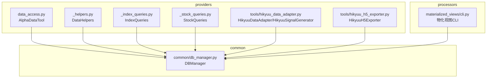
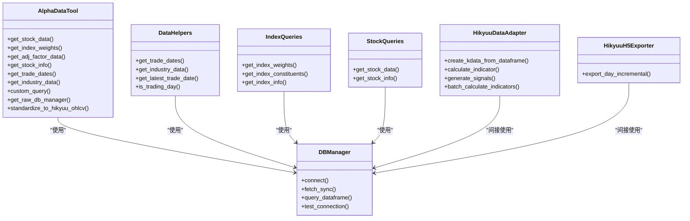
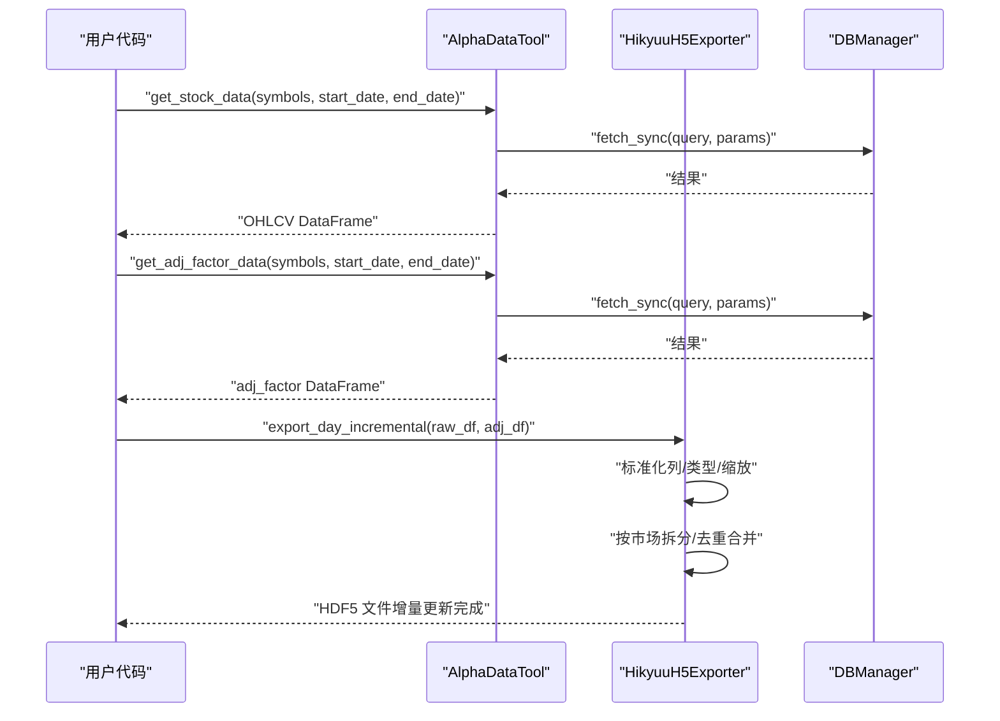
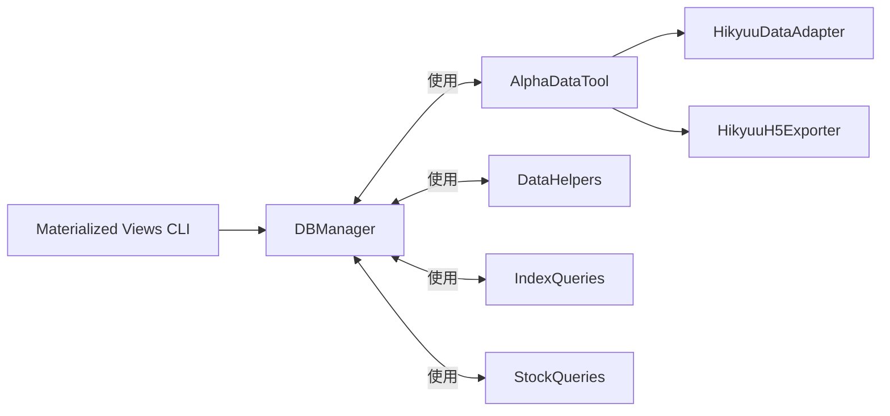

# API参考

<cite>
**本文引用的文件**
- [pyproject.toml](file://pyproject.toml)
- [alphahome/providers/data_access.py](file://alphahome/providers/data_access.py)
- [alphahome/providers/_helpers.py](file://alphahome/providers/_helpers.py)
- [alphahome/providers/_index_queries.py](file://alphahome/providers/_index_queries.py)
- [alphahome/providers/_stock_queries.py](file://alphahome/providers/_stock_queries.py)
- [alphahome/providers/tools/hikyuu_data_adapter.py](file://alphahome/providers/tools/hikyuu_data_adapter.py)
- [alphahome/providers/tools/hikyuu_h5_exporter.py](file://alphahome/providers/tools/hikyuu_h5_exporter.py)
- [alphahome/processors/materialized_views/cli.py](file://alphahome/processors/materialized_views/cli.py)
- [alphahome/common/db_manager.py](file://alphahome/common/db_manager.py)
</cite>

## 目录
1. [简介](#简介)
2. [项目结构](#项目结构)
3. [核心组件](#核心组件)
4. [架构总览](#架构总览)
5. [详细组件分析](#详细组件分析)
6. [依赖关系分析](#依赖关系分析)
7. [性能考量](#性能考量)
8. [故障排查指南](#故障排查指南)
9. [结论](#结论)
10. [附录](#附录)

## 简介
本文件为 AlphaHome 项目的 API 参考文档，覆盖以下内容：
- CLI 命令：基于 pyproject.toml 中的入口点，详细说明 alphahome 与 refresh-materialized-view 的语法、参数、选项与使用示例。
- Python API：重点文档化 providers/data_access.py 中面向外部系统（如 Hikyuu）的数据查询与导出能力，包括函数签名、参数说明、返回值类型与调用示例；同时区分内部实现与公共 API。

## 项目结构
本项目采用“功能域+分层”的组织方式：
- providers：对外数据访问与适配工具（数据查询、Hikyuu 适配与导出）
- processors：数据处理流水线与物化视图任务
- common：通用组件（数据库管理器、配置管理、日志等）

图表来源
- [alphahome/providers/data_access.py](file://alphahome/providers/data_access.py#L1-L629)
- [alphahome/providers/_helpers.py](file://alphahome/providers/_helpers.py#L1-L449)
- [alphahome/providers/_index_queries.py](file://alphahome/providers/_index_queries.py#L1-L380)
- [alphahome/providers/_stock_queries.py](file://alphahome/providers/_stock_queries.py#L1-L323)
- [alphahome/providers/tools/hikyuu_data_adapter.py](file://alphahome/providers/tools/hikyuu_data_adapter.py#L1-L653)
- [alphahome/providers/tools/hikyuu_h5_exporter.py](file://alphahome/providers/tools/hikyuu_h5_exporter.py#L1-L237)
- [alphahome/processors/materialized_views/cli.py](file://alphahome/processors/materialized_views/cli.py#L1-L654)
- [alphahome/common/db_manager.py](file://alphahome/common/db_manager.py#L1-L145)

章节来源
- [pyproject.toml](file://pyproject.toml#L44-L47)

## 核心组件
- AlphaDataTool：统一的数据访问工具，提供股票行情、指数权重、复权因子、股票基本信息、交易日历、行业分类等查询，以及自定义查询与原始数据库管理器访问。
- DataHelpers：提供交易日历、行业分类等辅助查询，具备表名智能检测与缓存机制。
- IndexQueries/StockQueries：分别封装指数与股票相关查询逻辑，具备表名检测与参数化查询。
- HikyuuDataAdapter/HikyuuSignalGenerator：将 OHLCV 数据适配为 Hikyuu 对象或直接基于 DataFrame 计算指标与生成信号。
- HikyuuH5Exporter：将标准化日频 OHLCV 数据增量写入 Hikyuu HDF5 文件，支持前复权。
- DBManager：统一的数据库连接与操作管理器，支持异步/同步模式。
- 物化视图 CLI：提供刷新单个/全部物化视图、查看状态与历史的命令行接口。

章节来源
- [alphahome/providers/data_access.py](file://alphahome/providers/data_access.py#L52-L629)
- [alphahome/providers/_helpers.py](file://alphahome/providers/_helpers.py#L1-L449)
- [alphahome/providers/_index_queries.py](file://alphahome/providers/_index_queries.py#L1-L380)
- [alphahome/providers/_stock_queries.py](file://alphahome/providers/_stock_queries.py#L1-L323)
- [alphahome/providers/tools/hikyuu_data_adapter.py](file://alphahome/providers/tools/hikyuu_data_adapter.py#L1-L653)
- [alphahome/providers/tools/hikyuu_h5_exporter.py](file://alphahome/providers/tools/hikyuu_h5_exporter.py#L1-L237)
- [alphahome/common/db_manager.py](file://alphahome/common/db_manager.py#L1-L145)

## 架构总览
AlphaDataTool 作为对外公共 API 的统一入口，内部依赖 DBManager 进行数据库访问；DataHelpers/IndexQueries/StockQueries 提供更细粒度的查询封装；HikyuuDataAdapter/HikyuuH5Exporter 为外部系统（如 Hikyuu）提供数据适配与导出能力。

图表来源
- [alphahome/common/db_manager.py](file://alphahome/common/db_manager.py#L23-L107)
- [alphahome/providers/data_access.py](file://alphahome/providers/data_access.py#L75-L629)
- [alphahome/providers/_helpers.py](file://alphahome/providers/_helpers.py#L1-L449)
- [alphahome/providers/_index_queries.py](file://alphahome/providers/_index_queries.py#L1-L380)
- [alphahome/providers/_stock_queries.py](file://alphahome/providers/_stock_queries.py#L1-L323)
- [alphahome/providers/tools/hikyuu_data_adapter.py](file://alphahome/providers/tools/hikyuu_data_adapter.py#L1-L653)
- [alphahome/providers/tools/hikyuu_h5_exporter.py](file://alphahome/providers/tools/hikyuu_h5_exporter.py#L1-L237)

## 详细组件分析

### CLI 参考：refresh-materialized-view
- 入口点（历史）：console_scripts 曾包含 refresh-materialized-view → processors.materialized_views.cli:main_sync（已删除）
- 支持命令：
  - refresh：刷新单个物化视图
  - refresh-all：刷新全部物化视图
  - status：查询单个物化视图状态
  - status-all：查询全部物化视图状态
  - history：查询单个物化视图刷新历史
- 通用选项：
  - --db-url：数据库连接 URL（优先级：显式参数 > 环境变量 DATABASE_URL > 配置文件）
  - --log-level：日志级别（DEBUG/INFO/WARNING/ERROR）
- 子命令选项：
  - refresh/refresh-all
    - --strategy：full 或 concurrent（默认 full）
    - --format：text 或 json（默认 text）
  - status/status-all：--format
  - history：--limit（默认 10）、--format
- 输出：
  - 成功：根据 --format 输出文本或 JSON
  - 失败：输出错误信息并返回非零退出码

章节来源
- [pyproject.toml](file://pyproject.toml#L44-L47)
- [alphahome/processors/materialized_views/cli.py](file://alphahome/processors/materialized_views/cli.py#L451-L654)

### Python API 参考：providers/data_access.py（对外公共 API）
- AlphaDataTool
  - 初始化
    - 参数：db_manager（DBManager 实例），cache_manager（可选，兼容性保留）
    - 作用：持有 DBManager 并提供统一数据访问接口
  - 核心查询方法
    - get_stock_data(symbols, start_date, end_date, fields=None, adjust=True) -> pd.DataFrame
      - 功能：获取股票日线 OHLCV 数据
      - 参数：symbols 支持单个或列表；日期支持字符串或 date；fields/adjust 为兼容性参数
      - 返回：包含 ts_code、trade_date、open、high、low、close、pre_close、change、pct_chg、vol、amount 的 DataFrame
      - 处理：自动表名检测、参数化查询、数据类型转换、空结果告警
    - get_index_weights(index_code, start_date, end_date, symbols=None, monthly=False) -> pd.DataFrame
      - 功能：获取指数权重数据
      - 参数：monthly 控制是否仅返回月末权重
      - 返回：包含 index_code、con_code、trade_date、weight 的 DataFrame
    - get_adj_factor_data(symbols=None, start_date=None, end_date=None) -> pd.DataFrame
      - 功能：获取复权因子数据
      - 返回：包含 ts_code、trade_date、adj_factor 的 DataFrame
    - get_stock_info(symbols=None, fields=None, active_only=False) -> pd.DataFrame
      - 功能：获取股票基本信息
      - 参数：active_only=True 时仅返回上市股票（list_status='L'）
      - 返回：包含 ts_code、symbol、name、area、industry、market、list_date、list_status 等的 DataFrame
    - get_trade_dates(start_date, end_date, market='SSE') -> pd.DataFrame
      - 功能：获取交易日历
      - 返回：包含 cal_date、is_open、pretrade_date 的 DataFrame
    - get_industry_data(symbols=None, industry_type='SW2021', active_only=False) -> pd.DataFrame
      - 功能：获取行业分类数据
      - 返回：包含 ts_code、industry_name、industry_code 的 DataFrame
  - 扩展方法
    - custom_query(query, params=None, as_dict=False) -> pd.DataFrame 或 List[Dict]
      - 功能：执行自定义 SQL 查询
      - 参数：as_dict=True 返回字典列表，否则返回 DataFrame
    - get_raw_db_manager() -> DBManager
      - 功能：返回底层 DBManager 实例，便于高级用例
  - 辅助与工具
    - standardize_to_hikyuu_ohlcv(df) -> pd.DataFrame
      - 功能：将 OHLCV 数据标准化为 Hikyuu 期望列顺序与类型
      - 期望列：['ts_code','trade_date','open','high','low','close','vol','amount']
    - is_connected -> bool
      - 功能：检查数据库连接状态
    - __repr__() -> str
      - 功能：返回连接状态字符串表示
  - 异常
    - DataAccessError：数据访问异常
    - ValidationError：数据验证异常（向后兼容）
    - CacheError：缓存相关异常（向后兼容）

章节来源
- [alphahome/providers/data_access.py](file://alphahome/providers/data_access.py#L52-L629)
- [alphahome/common/db_manager.py](file://alphahome/common/db_manager.py#L23-L107)

### Python API 参考：providers/_helpers.py（对外公共 API）
- DataHelpers
  - get_trade_dates(start_date, end_date, exchange='SSE') -> pd.DataFrame
    - 功能：获取交易日历（含 is_open、pretrade_date 等）
    - 处理：智能表名检测、缓存、类型转换
  - get_industry_data(symbols=None, level='sw_l1') -> pd.DataFrame
    - 功能：从 stock_basic 获取行业信息（当前实现忽略 level）
    - 处理：智能表名检测、缓存（全量时）
  - get_latest_trade_date(exchange='SSE') -> Optional[str]
    - 功能：获取最新交易日期（YYYY-MM-DD）
  - is_trading_day(check_date, exchange='SSE') -> bool
    - 功能：判断某日是否为交易日
  - map_ts_code_to_hikyuu(ts_code: str) -> str
    - 功能：将 Tushare 风格 ts_code 映射为 Hikyuu 符号（如 '000001.SZ' -> 'sz000001'）

章节来源
- [alphahome/providers/_helpers.py](file://alphahome/providers/_helpers.py#L1-L449)

### Python API 参考：providers/_index_queries.py（对外公共 API）
- IndexQueries
  - get_index_weights(index_code, start_date, end_date, monthly=False) -> pd.DataFrame
    - 功能：获取指数权重（支持月末去重）
  - get_index_constituents(index_code, trade_date=None) -> pd.DataFrame
    - 功能：获取指数成分股（最新或指定日期）
  - get_index_info(index_codes=None) -> pd.DataFrame
    - 功能：获取指数基本信息

章节来源
- [alphahome/providers/_index_queries.py](file://alphahome/providers/_index_queries.py#L1-L380)

### Python API 参考：providers/_stock_queries.py（对外公共 API）
- StockQueries
  - get_stock_data(symbols, start_date, end_date, adjust=True) -> pd.DataFrame
    - 功能：获取股票日线 OHLCV 数据（当前数据库不含复权字段，返回原始价格）
  - get_stock_info(symbols=None, list_status='L') -> pd.DataFrame
    - 功能：获取股票基本信息（list_status 过滤）

章节来源
- [alphahome/providers/_stock_queries.py](file://alphahome/providers/_stock_queries.py#L1-L323)

### Python API 参考：Hikyuu 适配与导出（对外公共 API）
- HikyuuDataAdapter
  - create_kdata_from_dataframe(df, stock_code, ktype='DAY') -> Any
    - 功能：从 OHLCV DataFrame 创建 Hikyuu KData 对象（若未安装 Hikyuu 则返回模拟对象或 DataFrame）
  - calculate_indicator(kdata, indicator_name, params=None) -> np.ndarray 或 List[float]
    - 功能：计算技术指标（MA、EMA、RSI、MACD、KDJ、BOLL、ATR、VOL 等）
  - generate_signals(kdata, signal_type, params=None) -> pd.DataFrame
    - 功能：生成交易信号（MA_CROSS、RSI_OVERBOUGHT、MACD_CROSS 等）
  - batch_calculate_indicators(df_dict, indicators) -> Dict[str, Dict[str, np.ndarray]]
    - 功能：批量计算多股票多指标
- HikyuuH5Exporter
  - export_day_incremental(df, adj_factor_df=None) -> None
    - 功能：将标准化日频 OHLCV 数据增量写入 Hikyuu HDF5 文件，支持前复权
    - 约定：数据集路径 /data/{MKT}{CODE}，字段顺序与类型严格遵循 Hikyuu 结构
- map_ts_code_to_hikyuu(ts_code: str) -> str
  - 功能：将 ts_code 转换为 Hikyuu 符号

章节来源
- [alphahome/providers/tools/hikyuu_data_adapter.py](file://alphahome/providers/tools/hikyuu_data_adapter.py#L1-L653)
- [alphahome/providers/tools/hikyuu_h5_exporter.py](file://alphahome/providers/tools/hikyuu_h5_exporter.py#L1-L237)
- [alphahome/providers/_helpers.py](file://alphahome/providers/_helpers.py#L433-L449)

### 调用序列示例：Hikyuu 导出流程

图表来源
- [alphahome/providers/data_access.py](file://alphahome/providers/data_access.py#L93-L163)
- [alphahome/providers/data_access.py](file://alphahome/providers/data_access.py#L233-L290)
- [alphahome/providers/tools/hikyuu_h5_exporter.py](file://alphahome/providers/tools/hikyuu_h5_exporter.py#L59-L236)
- [alphahome/common/db_manager.py](file://alphahome/common/db_manager.py#L23-L107)

## 依赖关系分析
- AlphaDataTool 依赖 DBManager 进行数据库访问；DataHelpers/IndexQueries/StockQueries 也依赖 DBManager。
- HikyuuDataAdapter/HikyuuH5Exporter 通过 AlphaDataTool 获取数据，再进行适配或导出。
- 物化视图 CLI 通过 DBManager 连接数据库，调用刷新/监控逻辑。

图表来源
- [alphahome/common/db_manager.py](file://alphahome/common/db_manager.py#L23-L107)
- [alphahome/providers/data_access.py](file://alphahome/providers/data_access.py#L75-L163)
- [alphahome/providers/_helpers.py](file://alphahome/providers/_helpers.py#L1-L120)
- [alphahome/providers/_index_queries.py](file://alphahome/providers/_index_queries.py#L1-L120)
- [alphahome/providers/_stock_queries.py](file://alphahome/providers/_stock_queries.py#L1-L120)
- [alphahome/providers/tools/hikyuu_data_adapter.py](file://alphahome/providers/tools/hikyuu_data_adapter.py#L1-L120)
- [alphahome/providers/tools/hikyuu_h5_exporter.py](file://alphahome/providers/tools/hikyuu_h5_exporter.py#L1-L120)
- [alphahome/processors/materialized_views/cli.py](file://alphahome/processors/materialized_views/cli.py#L1-L120)

## 性能考量
- AlphaDataTool/Helpers/IndexQueries/StockQueries 均采用参数化查询与类型转换，减少 SQL 注入风险并提升解析效率。
- DataHelpers/StockQueries/IndexQueries 内置表名智能检测与缓存（交易日历、行业数据等），降低重复查询成本。
- HikyuuH5Exporter 在写入前进行去重与排序，避免重复与乱序，提升后续读取性能。
- DBManager 支持异步/同步两种模式，可根据场景选择以平衡吞吐与延迟。

## 故障排查指南
- 数据访问异常
  - 现象：调用 AlphaDataTool 方法抛出 DataAccessError
  - 排查：确认数据库连接字符串、网络连通性、表结构是否存在；查看日志输出
- 表名检测失败
  - 现象：get_stock_data/get_index_weights 等返回空结果或警告
  - 排查：确认数据库中是否存在 tushare.stock_daily/tushare.index_weight 等表；DataHelpers/IndexQueries/StockQueries 会自动检测可用表名
- Hikyuu 未安装
  - 现象：HikyuuDataAdapter 无法创建 KData/Stock 对象
  - 排查：安装 Hikyuu 或使用 DataFrame 直算模式（适配器会自动回退）
- HDF5 导出失败
  - 现象：HikyuuH5Exporter 报错或数据未更新
  - 排查：确认数据目录权限、H5 文件存在性、字段顺序与类型是否符合 Hikyuu 约定；检查 adj_factor 数据是否匹配

章节来源
- [alphahome/providers/data_access.py](file://alphahome/providers/data_access.py#L160-L163)
- [alphahome/providers/_helpers.py](file://alphahome/providers/_helpers.py#L170-L230)
- [alphahome/providers/tools/hikyuu_data_adapter.py](file://alphahome/providers/tools/hikyuu_data_adapter.py#L50-L120)
- [alphahome/providers/tools/hikyuu_h5_exporter.py](file://alphahome/providers/tools/hikyuu_h5_exporter.py#L194-L236)

## 结论
本参考文档梳理了 AlphaHome 的 CLI 与 Python API，明确了对外公共接口与内部实现边界。AlphaDataTool 作为统一入口，结合 DataHelpers/IndexQueries/StockQueries 提供稳健的数据查询能力；HikyuuDataAdapter/HikyuuH5Exporter 则为外部系统（如 Hikyuu）提供了高效的数据适配与导出方案。建议在生产环境中优先使用 AlphaDataTool 的标准化方法，并通过 DBManager 的异步/同步模式满足不同场景的性能需求。

## 附录
- CLI 使用示例（基于 refresh-materialized-view）
  - 刷新单个物化视图（full 策略，JSON 输出）
    - refresh-materialized-view --db-url "postgresql://..." refresh pit_financial_indicators_mv --strategy full --format json
  - 刷新全部物化视图（concurrent 策略，text 输出）
    - refresh-materialized-view --db-url "postgresql://..." refresh-all --strategy concurrent
  - 查看单个物化视图状态
    - refresh-materialized-view --db-url "postgresql://..." status pit_industry_classification_mv
  - 查看全部物化视图状态
    - refresh-materialized-view --db-url "postgresql://..." status-all
  - 查看刷新历史（限制最近 5 条）
    - refresh-materialized-view --db-url "postgresql://..." history sector_aggregation_mv --limit 5
- Python API 使用示例（基于 AlphaDataTool）
  - 获取股票行情与复权因子并导出至 Hikyuu HDF5
    - data_tool = AlphaDataTool(DBManager(...))
    - df = data_tool.get_stock_data(["000001.SZ","600519.SH"],"2020-01-01","2024-12-31")
    - adj = data_tool.get_adj_factor_data(["000001.SZ","600519.SH"],"2020-01-01","2024-12-31")
    - exporter = HikyuuH5Exporter("E://stock")
    - exporter.export_day_incremental(df, adj)
  - 标准化 OHLCV 数据以适配 Hikyuu
    - standardized_df = AlphaDataTool.standardize_to_hikyuu_ohlcv(df)

章节来源
- [pyproject.toml](file://pyproject.toml#L44-L47)
- [alphahome/processors/materialized_views/cli.py](file://alphahome/processors/materialized_views/cli.py#L451-L654)
- [alphahome/providers/data_access.py](file://alphahome/providers/data_access.py#L52-L163)
- [alphahome/providers/tools/hikyuu_h5_exporter.py](file://alphahome/providers/tools/hikyuu_h5_exporter.py#L59-L120)