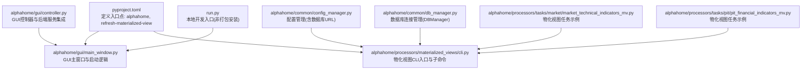
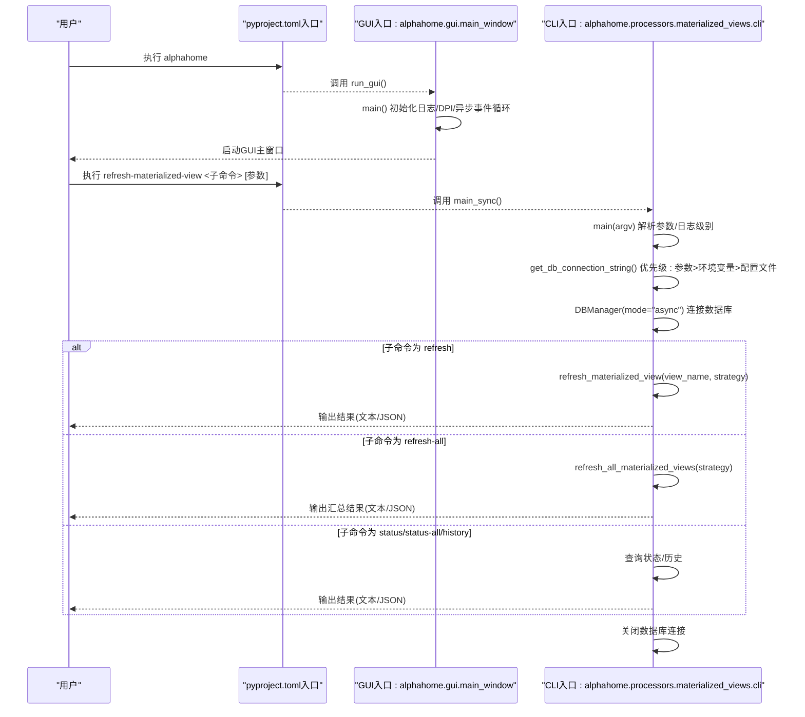
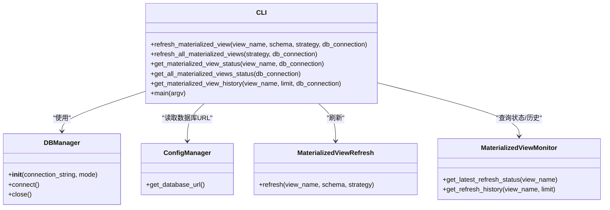
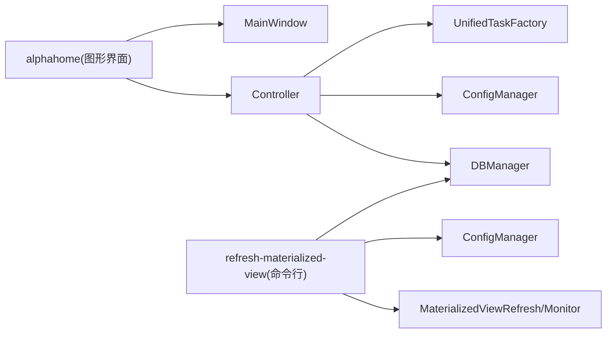

# CLI API参考

<cite>
**本文引用的文件**
- [pyproject.toml](file://pyproject.toml)
- [run.py](file://run.py)
- [alphahome/gui/main_window.py](file://alphahome/gui/main_window.py)
- [alphahome/gui/controller.py](file://alphahome/gui/controller.py)
- [alphahome/gui/__init__.py](file://alphahome/gui/__init__.py)
- [alphahome/processors/materialized_views/cli.py](file://alphahome/processors/materialized_views/cli.py)
- [alphahome/common/config_manager.py](file://alphahome/common/config_manager.py)
- [alphahome/common/db_manager.py](file://alphahome/common/db_manager.py)
- [alphahome/processors/tasks/market/market_technical_indicators_mv.py](file://alphahome/processors/tasks/market/market_technical_indicators_mv.py)
- [alphahome/processors/tasks/pit/pit_financial_indicators_mv.py](file://alphahome/processors/tasks/pit/pit_financial_indicators_mv.py)
- [alphahome/processors/tests/test_materialized_views/test_cli.py](file://alphahome/processors/tests/test_materialized_views/test_cli.py)
</cite>

## 目录
1. [简介](#简介)
2. [项目结构](#项目结构)
3. [核心组件](#核心组件)
4. [架构总览](#架构总览)
5. [详细组件分析](#详细组件分析)
6. [依赖分析](#依赖分析)
7. [性能考虑](#性能考虑)
8. [故障排查指南](#故障排查指南)
9. [结论](#结论)
10. [附录](#附录)

## 简介
本参考文档面向在项目中通过命令行接口进行操作的用户，聚焦于在 pyproject.toml 中定义的两个命令行入口：
- alphahome：GUI 启动入口，直接执行 alphahome 即可启动图形界面。
- refresh-materialized-view：物化视图刷新与查询命令，支持单个/全部刷新、状态查询、历史查询，并可指定刷新策略与输出格式。

文档将说明命令的语法、参数、执行效果、适用场景，并提供实际使用示例与最佳实践，帮助用户准确理解与使用这两个 CLI 工具。

## 项目结构
以下图示展示了与 CLI 相关的关键文件与模块关系，以及它们在项目中的角色定位。

图表来源
- [pyproject.toml](file://pyproject.toml#L43-L47)
- [alphahome/gui/main_window.py](file://alphahome/gui/main_window.py#L363-L412)
- [alphahome/processors/materialized_views/cli.py](file://alphahome/processors/materialized_views/cli.py#L451-L654)
- [alphahome/gui/controller.py](file://alphahome/gui/controller.py#L79-L121)
- [alphahome/common/config_manager.py](file://alphahome/common/config_manager.py#L168-L171)
- [alphahome/common/db_manager.py](file://alphahome/common/db_manager.py#L23-L47)
- [alphahome/processors/tasks/market/market_technical_indicators_mv.py](file://alphahome/processors/tasks/market/market_technical_indicators_mv.py#L18-L30)
- [alphahome/processors/tasks/pit/pit_financial_indicators_mv.py](file://alphahome/processors/tasks/pit/pit_financial_indicators_mv.py#L21-L30)
- [run.py](file://run.py#L1-L28)

章节来源
- [pyproject.toml](file://pyproject.toml#L43-L47)
- [alphahome/gui/main_window.py](file://alphahome/gui/main_window.py#L363-L412)
- [alphahome/processors/materialized_views/cli.py](file://alphahome/processors/materialized_views/cli.py#L451-L654)

## 核心组件
- alphahome（GUI启动）
  - 作用：通过命令 alphahome 直接启动图形界面，无需参数。
  - 入口映射：在 pyproject.toml 的 [project.scripts] 中定义为 alphahome = "alphahome.gui.main_window:run_gui"。
  - 启动流程：run_gui() 调用 main()，初始化日志、DPI感知、异步事件循环，最终启动 MainWindow 并进入事件循环。
- refresh-materialized-view（物化视图CLI）
  - 作用：提供物化视图的刷新、状态查询、历史查询能力，支持全量刷新与并发刷新策略。
  - 入口映射：在 pyproject.toml 的 [project.scripts] 中定义为 refresh-materialized-view = "alphahome.processors.materialized_views.cli:main_sync"。
  - 子命令：
    - refresh <view_name> [--strategy full|concurrent] [--format text|json]
    - refresh-all [--strategy full|concurrent] [--format text|json]
    - status <view_name> [--format text|json]
    - status-all [--format text|json]
    - history <view_name> [--limit N] [--format text|json]
  - 数据库连接：支持通过 --db-url 显式传入，否则从环境变量 DATABASE_URL 或用户配置 ~/.alphahome/config.json 的 database.url 读取。

章节来源
- [pyproject.toml](file://pyproject.toml#L43-L47)
- [alphahome/gui/main_window.py](file://alphahome/gui/main_window.py#L363-L412)
- [alphahome/processors/materialized_views/cli.py](file://alphahome/processors/materialized_views/cli.py#L451-L654)
- [alphahome/common/config_manager.py](file://alphahome/common/config_manager.py#L168-L171)
- [alphahome/common/db_manager.py](file://alphahome/common/db_manager.py#L23-L47)

## 架构总览
下图展示了 alphahome 与 refresh-materialized-view 两条路径的调用关系与数据流。

图表来源
- [pyproject.toml](file://pyproject.toml#L43-L47)
- [alphahome/gui/main_window.py](file://alphahome/gui/main_window.py#L363-L412)
- [alphahome/processors/materialized_views/cli.py](file://alphahome/processors/materialized_views/cli.py#L451-L654)

## 详细组件分析

### alphahome 命令（GUI启动入口）
- 语法
  - alphahome（无参数）
- 适用场景
  - 需要通过图形界面进行数据采集、处理、任务执行与配置管理时。
- 执行效果
  - 初始化日志与DPI感知，异步初始化后端控制器与任务工厂，创建主窗口并进入事件循环。
- 使用示例
  - 在终端直接输入 alphahome，即可启动图形界面。
- 注意事项
  - 若需在本地开发时直接运行，可使用 run.py 作为入口，它会初始化研究环境并调用 run_gui()。

章节来源
- [pyproject.toml](file://pyproject.toml#L43-L47)
- [alphahome/gui/main_window.py](file://alphahome/gui/main_window.py#L363-L412)
- [run.py](file://run.py#L1-L28)

### refresh-materialized-view 命令（物化视图管理）
- 语法
  - refresh-materialized-view <子命令> [参数]
- 子命令与参数
  - refresh <view_name> [--strategy full|concurrent] [--format text|json]
  - refresh-all [--strategy full|concurrent] [--format text|json]
  - status <view_name> [--format text|json]
  - status-all [--format text|json]
  - history <view_name> [--limit N] [--format text|json]
- 数据库连接
  - --db-url：显式提供数据库连接URL
  - 若未提供，优先从环境变量 DATABASE_URL 读取；若仍无，则从用户配置文件 ~/.alphahome/config.json 的 database.url 读取。
- 刷新策略
  - full：全量刷新（默认）
  - concurrent：并发刷新（部分视图支持）
- 输出格式
  - text：人类可读文本
  - json：结构化JSON（包含时间字段会转为ISO字符串）

- 适用场景
  - 需要定时或按需刷新物化视图，或查询其状态与历史记录。
  - 适合在CI/CD流水线、运维脚本或批处理任务中使用。

- 使用示例
  - 刷新单个视图（默认全量）：refresh-materialized-view refresh pit_financial_indicators_mv
  - 并发刷新单个视图：refresh-materialized-view refresh market_technical_indicators_mv --strategy concurrent
  - 刷新全部视图：refresh-materialized-view refresh-all
  - 查看单个视图状态：refresh-materialized-view status pit_financial_indicators_mv
  - 查看全部视图状态：refresh-materialized-view status-all
  - 查看历史记录（限制最近10条）：refresh-materialized-view history market_technical_indicators_mv --limit 10
  - 输出JSON：refresh-materialized-view refresh-all --format json

- 可用视图名称
  - pit_financial_indicators_mv
  - pit_industry_classification_mv
  - market_technical_indicators_mv
  - sector_aggregation_mv

章节来源
- [pyproject.toml](file://pyproject.toml#L43-L47)
- [alphahome/processors/materialized_views/cli.py](file://alphahome/processors/materialized_views/cli.py#L451-L654)
- [alphahome/common/config_manager.py](file://alphahome/common/config_manager.py#L168-L171)
- [alphahome/processors/tasks/market/market_technical_indicators_mv.py](file://alphahome/processors/tasks/market/market_technical_indicators_mv.py#L18-L30)
- [alphahome/processors/tasks/pit/pit_financial_indicators_mv.py](file://alphahome/processors/tasks/pit/pit_financial_indicators_mv.py#L21-L30)

### 类关系与职责（CLI侧）

图表来源
- [alphahome/common/db_manager.py](file://alphahome/common/db_manager.py#L23-L47)
- [alphahome/common/config_manager.py](file://alphahome/common/config_manager.py#L168-L171)
- [alphahome/processors/materialized_views/cli.py](file://alphahome/processors/materialized_views/cli.py#L74-L211)
- [alphahome/processors/materialized_views/cli.py](file://alphahome/processors/materialized_views/cli.py#L213-L348)
- [alphahome/processors/materialized_views/cli.py](file://alphahome/processors/materialized_views/cli.py#L451-L654)

## 依赖分析
- alphahome
  - 依赖 GUI 主窗口与控制器，控制器进一步依赖任务工厂、配置服务与数据库管理器。
- refresh-materialized-view
  - 依赖 DBManager 进行数据库连接，依赖 ConfigManager 读取配置，依赖 MaterializedViewRefresh/MaterializedViewMonitor 执行刷新与查询。

图表来源
- [alphahome/gui/main_window.py](file://alphahome/gui/main_window.py#L195-L220)
- [alphahome/gui/controller.py](file://alphahome/gui/controller.py#L79-L121)
- [alphahome/common/config_manager.py](file://alphahome/common/config_manager.py#L168-L171)
- [alphahome/common/db_manager.py](file://alphahome/common/db_manager.py#L23-L47)
- [alphahome/processors/materialized_views/cli.py](file://alphahome/processors/materialized_views/cli.py#L451-L654)

章节来源
- [alphahome/gui/main_window.py](file://alphahome/gui/main_window.py#L195-L220)
- [alphahome/gui/controller.py](file://alphahome/gui/controller.py#L79-L121)
- [alphahome/common/config_manager.py](file://alphahome/common/config_manager.py#L168-L171)
- [alphahome/common/db_manager.py](file://alphahome/common/db_manager.py#L23-L47)
- [alphahome/processors/materialized_views/cli.py](file://alphahome/processors/materialized_views/cli.py#L451-L654)

## 性能考虑
- 刷新策略
  - full：全量重建，保证一致性但耗时较长。
  - concurrent：并发刷新（视具体视图支持），可缩短刷新时间，但需确保数据库与视图定义支持并发。
- 输出格式
  - json 便于自动化处理，text 更易读。
- 日志级别
  - 可通过 --log-level 调整，生产环境建议使用 INFO 或 WARNING 以减少冗余日志。

[本节为通用指导，不直接分析具体文件]

## 故障排查指南
- 数据库连接失败
  - 确认 DATABASE_URL 环境变量或 ~/.alphahome/config.json 的 database.url 是否正确。
  - 使用 --db-url 显式传入连接字符串进行验证。
- 视图不存在或名称错误
  - 确认视图名称与可用视图一致（见“可用视图名称”）。
- 刷新失败
  - 查看输出中的错误信息，确认数据库权限、网络连通性与视图定义。
- CLI退出码
  - 成功：0；部分成功：0；失败：非0。可用于CI/CD判断。

章节来源
- [alphahome/processors/materialized_views/cli.py](file://alphahome/processors/materialized_views/cli.py#L578-L645)
- [alphahome/common/config_manager.py](file://alphahome/common/config_manager.py#L168-L171)
- [alphahome/processors/tests/test_materialized_views/test_cli.py](file://alphahome/processors/tests/test_materialized_views/test_cli.py#L630-L666)

## 结论
- alphahome 命令用于快速启动图形界面，适合交互式使用。
- refresh-materialized-view 命令提供了完整的物化视图生命周期管理能力，包括刷新、状态查询与历史查询，支持灵活的数据库连接与输出格式，适合自动化与运维场景。
- 建议在生产环境中通过 --db-url 或配置文件集中管理数据库连接，并根据业务需求选择合适的刷新策略与日志级别。

[本节为总结性内容，不直接分析具体文件]

## 附录

### 常用命令速查
- 启动GUI：alphahome
- 刷新单个视图：refresh-materialized-view refresh <view_name>
- 并发刷新单个视图：refresh-materialized-view refresh <view_name> --strategy concurrent
- 刷新全部视图：refresh-materialized-view refresh-all
- 查看单个视图状态：refresh-materialized-view status <view_name>
- 查看全部视图状态：refresh-materialized-view status-all
- 查看历史记录：refresh-materialized-view history <view_name> --limit N
- 输出JSON：在任意子命令后追加 --format json

### 可用视图名称
- pit_financial_indicators_mv
- pit_industry_classification_mv
- market_technical_indicators_mv
- sector_aggregation_mv

章节来源
- [alphahome/processors/materialized_views/cli.py](file://alphahome/processors/materialized_views/cli.py#L40-L47)
- [alphahome/processors/tasks/market/market_technical_indicators_mv.py](file://alphahome/processors/tasks/market/market_technical_indicators_mv.py#L18-L30)
- [alphahome/processors/tasks/pit/pit_financial_indicators_mv.py](file://alphahome/processors/tasks/pit/pit_financial_indicators_mv.py#L21-L30)