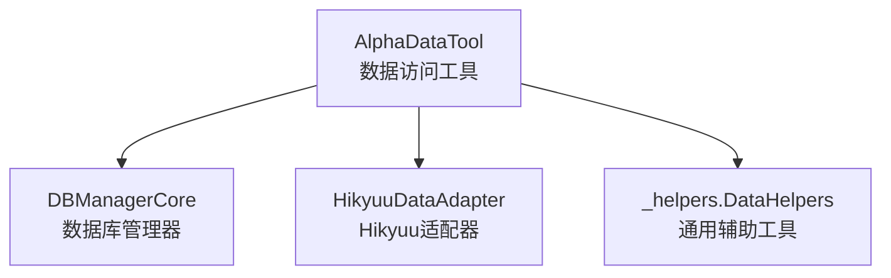
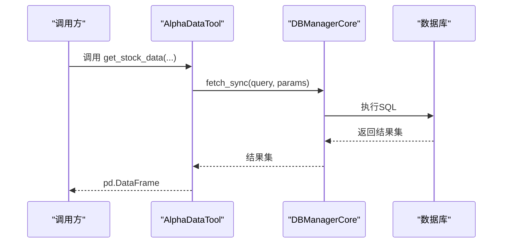
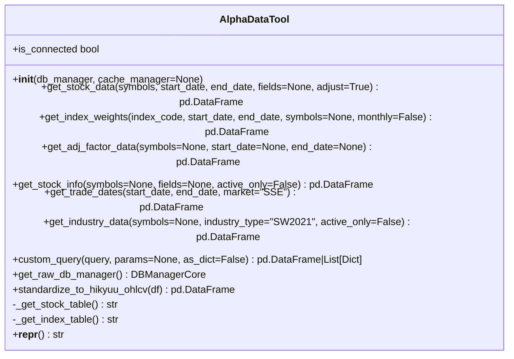
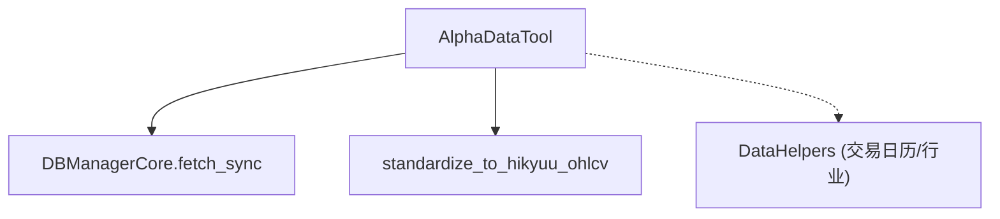

# Python API参考

<cite>
**本文引用的文件**
- [alphahome/providers/data_access.py](file://alphahome/providers/data_access.py)
- [alphahome/providers/_helpers.py](file://alphahome/providers/_helpers.py)
- [alphahome/common/db_components/db_manager_core.py](file://alphahome/common/db_components/db_manager_core.py)
- [alphahome/providers/examples/usage_example.py](file://alphahome/providers/examples/usage_example.py)
- [alphahome/providers/tools/hikyuu_data_adapter.py](file://alphahome/providers/tools/hikyuu_data_adapter.py)
</cite>

## 目录
1. [简介](#简介)
2. [项目结构](#项目结构)
3. [核心组件](#核心组件)
4. [架构总览](#架构总览)
5. [详细组件分析](#详细组件分析)
6. [依赖分析](#依赖分析)
7. [性能考虑](#性能考虑)
8. [故障排查指南](#故障排查指南)
9. [结论](#结论)
10. [附录](#附录)

## 简介
本文件为 `alphahome/providers/data_access.py` 中 `AlphaDataTool` 类的Python API参考文档。内容覆盖以下方面：
- 核心数据访问接口：get_stock_data、get_index_weights、get_adj_factor_data、get_stock_info、get_trade_dates、get_industry_data
- 扩展能力接口：custom_query、get_raw_db_manager
- 辅助方法：standardize_to_hikyuu_ohlcv
- 初始化要求与异常说明
- 使用示例与最佳实践
- 与数据库管理器、Hikyuu集成的关系

## 项目结构
- AlphaDataTool位于 providers 层，提供统一的数据访问入口，屏蔽底层数据库细节。
- 与数据库管理器（DBManagerCore）协作，通过其同步/异步接口执行查询。
- 与 Hikyuu 适配器配合，将OHLCV数据标准化为Hikyuu期望格式。

图表来源
- [alphahome/providers/data_access.py](file://alphahome/providers/data_access.py#L52-L629)
- [alphahome/common/db_components/db_manager_core.py](file://alphahome/common/db_components/db_manager_core.py#L16-L120)
- [alphahome/providers/tools/hikyuu_data_adapter.py](file://alphahome/providers/tools/hikyuu_data_adapter.py#L1-L120)
- [alphahome/providers/_helpers.py](file://alphahome/providers/_helpers.py#L1-L120)

章节来源
- [alphahome/providers/data_access.py](file://alphahome/providers/data_access.py#L52-L120)
- [alphahome/common/db_components/db_manager_core.py](file://alphahome/common/db_components/db_manager_core.py#L16-L120)

## 核心组件
- AlphaDataTool：单一职责的数据访问工具，提供6个核心方法与2个扩展方法，统一同步API，内联查询逻辑，移除中间抽象层。
- DBManagerCore：数据库连接管理器，支持同步/异步双模式，提供fetch_sync等查询接口。
- HikyuuDataAdapter：将OHLCV数据标准化为Hikyuu期望格式，便于后续指标与信号计算。

章节来源
- [alphahome/providers/data_access.py](file://alphahome/providers/data_access.py#L52-L120)
- [alphahome/common/db_components/db_manager_core.py](file://alphahome/common/db_components/db_manager_core.py#L16-L120)
- [alphahome/providers/tools/hikyuu_data_adapter.py](file://alphahome/providers/tools/hikyuu_data_adapter.py#L1-L120)

## 架构总览
AlphaDataTool通过DBManagerCore执行查询，返回pandas DataFrame；对于Hikyuu集成场景，可使用standardize_to_hikyuu_ohlcv进行列标准化。

图表来源
- [alphahome/providers/data_access.py](file://alphahome/providers/data_access.py#L93-L163)
- [alphahome/common/db_components/db_manager_core.py](file://alphahome/common/db_components/db_manager_core.py#L560-L591)

章节来源
- [alphahome/providers/data_access.py](file://alphahome/providers/data_access.py#L93-L163)
- [alphahome/common/db_components/db_manager_core.py](file://alphahome/common/db_components/db_manager_core.py#L560-L591)

## 详细组件分析

### AlphaDataTool 类
- 单一职责：所有查询逻辑内聚在一个类中，统一同步API，移除中间抽象层。
- 设计特点：智能表名检测、数据类型转换、日志记录、最小化验证与错误处理。
- 初始化要求：必须传入DBManager实例（db_manager），可选缓存管理器（暂未使用）。

章节来源
- [alphahome/providers/data_access.py](file://alphahome/providers/data_access.py#L52-L120)

#### 核心方法

##### get_stock_data
- 函数签名
  - get_stock_data(symbols: Union[str, List[str]], start_date: Union[str, date], end_date: Union[str, date], fields: Optional[List[str]] = None, adjust: bool = True) -> pd.DataFrame
- 参数
  - symbols：股票代码或代码列表，如 '000001.SZ' 或 ['000001.SZ', '000002.SZ']
  - start_date：开始日期，如 '2024-01-01'
  - end_date：结束日期，如 '2024-12-31'
  - fields：字段列表（保持兼容性，实际忽略）
  - adjust：是否使用复权价格（当前数据库不支持，保持兼容性）
- 返回值
  - 包含股票行情数据的 DataFrame，列通常包括 ts_code、trade_date、open、high、low、close、pre_close、change、pct_chg、vol、amount
- 使用示例
  - 参考示例脚本中的调用方式
- 可能抛出的异常
  - DataAccessError：数据库查询失败时抛出
- 处理流程要点
  - 输入标准化（字符串转列表）
  - 智能表名检测（_get_stock_table）
  - 参数化查询（IN子句、日期范围）
  - 数据类型转换（trade_date转datetime，数值列转numeric）

章节来源
- [alphahome/providers/data_access.py](file://alphahome/providers/data_access.py#L93-L163)
- [alphahome/providers/examples/usage_example.py](file://alphahome/providers/examples/usage_example.py#L31-L47)

##### get_index_weights
- 函数签名
  - get_index_weights(index_code: str, start_date: Union[str, date], end_date: Union[str, date], symbols: Optional[List[str]] = None, monthly: bool = False) -> pd.DataFrame
- 参数
  - index_code：指数代码，如 '000300.SH'
  - start_date：开始日期
  - end_date：结束日期
  - symbols：成分股代码列表（保持兼容性）
  - monthly：是否只获取月末数据
- 返回值
  - 包含指数权重数据的 DataFrame，列通常包括 index_code、con_code、trade_date、weight
- 使用示例
  - 参考示例脚本中的调用方式
- 可能抛出的异常
  - DataAccessError：数据库查询失败时抛出
- 处理流程要点
  - 智能表名检测（_get_index_table）
  - 月末数据查询（通过day+1=1的逻辑筛选）
  - 数据类型转换（trade_date转datetime，weight转numeric）

章节来源
- [alphahome/providers/data_access.py](file://alphahome/providers/data_access.py#L168-L228)
- [alphahome/providers/examples/usage_example.py](file://alphahome/providers/examples/usage_example.py#L51-L64)

##### get_adj_factor_data
- 函数签名
  - get_adj_factor_data(symbols: Optional[Union[str, List[str]]] = None, start_date: Optional[str] = None, end_date: Optional[str] = None) -> pd.DataFrame
- 参数
  - symbols：股票代码或代码列表，为空则获取所有股票
  - start_date：开始日期，格式 YYYY-MM-DD
  - end_date：结束日期，格式 YYYY-MM-DD
- 返回值
  - 包含复权因子数据的 DataFrame，列通常包括 ts_code、trade_date、adj_factor
- 使用示例
  - 参考示例脚本中的调用方式
- 可能抛出的异常
  - DataAccessError：数据库查询失败时抛出
- 处理流程要点
  - 动态拼接WHERE条件（ts_code IN、日期范围）
  - 数据类型转换（trade_date转datetime，adj_factor转numeric）

章节来源
- [alphahome/providers/data_access.py](file://alphahome/providers/data_access.py#L233-L291)
- [alphahome/providers/examples/usage_example.py](file://alphahome/providers/examples/usage_example.py#L123-L155)

##### get_stock_info
- 函数签名
  - get_stock_info(symbols: Optional[Union[str, List[str]]] = None, fields: Optional[List[str]] = None, active_only: bool = False) -> pd.DataFrame
- 参数
  - symbols：股票代码或代码列表，为空则获取所有股票
  - fields：字段列表（保持兼容性，实际忽略）
  - active_only：是否只获取上市股票（list_status='L'），默认False获取所有股票
- 返回值
  - 包含股票基本信息的 DataFrame，列通常包括 ts_code、symbol、name、area、industry、market、list_date、list_status
- 使用示例
  - 参考示例脚本中的调用方式
- 可能抛出的异常
  - DataAccessError：数据库查询失败时抛出
- 处理流程要点
  - 可选WHERE条件（list_status='L'）
  - 可选IN条件（ts_code IN）
  - list_date类型转换（datetime）

章节来源
- [alphahome/providers/data_access.py](file://alphahome/providers/data_access.py#L296-L350)
- [alphahome/providers/examples/usage_example.py](file://alphahome/providers/examples/usage_example.py#L65-L79)

##### get_trade_dates
- 函数签名
  - get_trade_dates(start_date: Union[str, date], end_date: Union[str, date], market: str = 'SSE') -> pd.DataFrame
- 参数
  - start_date：开始日期
  - end_date：结束日期
  - market：市场代码，默认 'SSE'
- 返回值
  - 包含交易日历的 DataFrame，列通常包括 cal_date、is_open、pretrade_date
- 使用示例
  - 参考示例脚本中的调用方式
- 可能抛出的异常
  - DataAccessError：数据库查询失败时抛出
- 处理流程要点
  - 参数化查询（exchange、日期范围）
  - 数据类型转换（cal_date、pretrade_date、is_open）

章节来源
- [alphahome/providers/data_access.py](file://alphahome/providers/data_access.py#L355-L397)
- [alphahome/providers/examples/usage_example.py](file://alphahome/providers/examples/usage_example.py#L80-L97)

##### get_industry_data
- 函数签名
  - get_industry_data(symbols: Optional[Union[str, List[str]]] = None, industry_type: str = 'SW2021', active_only: bool = False) -> pd.DataFrame
- 参数
  - symbols：股票代码或代码列表，为空则获取所有股票
  - industry_type：行业分类标准（保持兼容性）
  - active_only：是否只获取上市股票（list_status='L'），默认False获取所有股票
- 返回值
  - 包含行业分类数据的 DataFrame，列通常包括 ts_code、industry_name、industry_code
- 使用示例
  - 参考示例脚本中的调用方式
- 可能抛出的异常
  - DataAccessError：数据库查询失败时抛出
- 处理流程要点
  - 可选WHERE条件（list_status='L'）
  - 可选IN条件（ts_code IN）
  - 返回列映射（industry -> industry_name/industry_code）

章节来源
- [alphahome/providers/data_access.py](file://alphahome/providers/data_access.py#L402-L453)
- [alphahome/providers/examples/usage_example.py](file://alphahome/providers/examples/usage_example.py#L98-L112)

#### 扩展方法

##### custom_query
- 函数签名
  - custom_query(query: str, params: Optional[Union[tuple, list]] = None, as_dict: bool = False) -> Union[pd.DataFrame, List[Dict]]
- 参数
  - query：SQL查询语句
  - params：查询参数（元组或列表）
  - as_dict：是否返回字典列表，默认返回DataFrame
- 返回值
  - DataFrame或字典列表
- 使用示例
  - 参考示例脚本中的复杂联表查询与参数化查询
- 可能抛出的异常
  - DataAccessError：数据库查询失败时抛出
- 处理流程要点
  - 直接委托DBManagerCore.fetch_sync执行
  - 支持字典与DataFrame两种返回形式

章节来源
- [alphahome/providers/data_access.py](file://alphahome/providers/data_access.py#L458-L495)
- [alphahome/providers/examples/usage_example.py](file://alphahome/providers/examples/usage_example.py#L123-L189)

##### get_raw_db_manager
- 函数签名
  - get_raw_db_manager() -> DBManagerCore
- 参数
  - 无
- 返回值
  - DBManagerCore实例
- 使用示例
  - 参考示例脚本中获取原始数据库管理器进行高级操作
- 可能抛出的异常
  - 无显式抛出
- 处理流程要点
  - 直接返回db_manager引用，便于直接使用底层数据库功能

章节来源
- [alphahome/providers/data_access.py](file://alphahome/providers/data_access.py#L486-L495)
- [alphahome/providers/examples/usage_example.py](file://alphahome/providers/examples/usage_example.py#L190-L208)

#### 辅助方法

##### standardize_to_hikyuu_ohlcv
- 函数签名
  - standardize_to_hikyuu_ohlcv(df: pd.DataFrame) -> pd.DataFrame
- 参数
  - df：原始OHLCV DataFrame
- 返回值
  - 标准化后的DataFrame，列顺序为 ['ts_code','trade_date','open','high','low','close','vol','amount']，trade_date为datetime
- 使用示例
  - 参考Hikyuu适配器中对OHLCV列的期望
- 可能抛出的异常
  - 无显式抛出
- 处理流程要点
  - 仅保留存在的列，按期望顺序重排
  - 确保trade_date为datetime类型

章节来源
- [alphahome/providers/data_access.py](file://alphahome/providers/data_access.py#L531-L553)
- [alphahome/providers/tools/hikyuu_data_adapter.py](file://alphahome/providers/tools/hikyuu_data_adapter.py#L35-L60)

#### 私有辅助方法
- _get_stock_table：智能检测股票数据表名，优先使用可用表，缓存检测结果
- _get_index_table：智能检测指数权重表名，优先使用可用表，缓存检测结果

章节来源
- [alphahome/providers/data_access.py](file://alphahome/providers/data_access.py#L500-L577)

#### 兼容性与工具方法
- is_connected：检查数据库连接状态
- __repr__：字符串表示，包含连接状态

章节来源
- [alphahome/providers/data_access.py](file://alphahome/providers/data_access.py#L583-L595)

### 类关系图

图表来源
- [alphahome/providers/data_access.py](file://alphahome/providers/data_access.py#L52-L629)

## 依赖分析
- AlphaDataTool依赖DBManagerCore的fetch_sync接口执行查询。
- AlphaDataTool内部使用表名缓存与智能检测，减少重复检测成本。
- HikyuuDataAdapter依赖OHLCV列标准化，AlphaDataTool提供standardize_to_hikyuu_ohlcv辅助方法。
- _helpers.DataHelpers提供交易日历与行业分类的辅助查询，与AlphaDataTool互补。

图表来源
- [alphahome/providers/data_access.py](file://alphahome/providers/data_access.py#L93-L163)
- [alphahome/common/db_components/db_manager_core.py](file://alphahome/common/db_components/db_manager_core.py#L560-L591)
- [alphahome/providers/_helpers.py](file://alphahome/providers/_helpers.py#L158-L230)

章节来源
- [alphahome/providers/data_access.py](file://alphahome/providers/data_access.py#L93-L163)
- [alphahome/common/db_components/db_manager_core.py](file://alphahome/common/db_components/db_manager_core.py#L560-L591)
- [alphahome/providers/_helpers.py](file://alphahome/providers/_helpers.py#L158-L230)

## 性能考虑
- 表名缓存：_table_cache减少重复检测开销。
- 参数化查询：避免SQL注入，提升执行效率与安全性。
- 数据类型转换：在返回前进行类型转换，减少下游处理成本。
- 日志记录：关键路径记录info/warning/error，便于定位性能瓶颈与异常。

[本节为通用建议，无需特定文件来源]

## 故障排查指南
- 常见异常
  - DataAccessError：数据库查询失败时抛出，检查SQL语法、表名、日期范围、参数绑定。
  - 连接问题：is_connected为False时，检查DBManagerCore连接字符串与网络。
- 排查步骤
  - 确认DBManagerCore已正确初始化且处于可用模式（async/sync）。
  - 使用custom_query执行最小化查询，逐步定位问题。
  - 检查表名智能检测是否命中预期表（_get_stock_table/_get_index_table）。
  - 查看日志输出，定位具体失败点。

章节来源
- [alphahome/providers/data_access.py](file://alphahome/providers/data_access.py#L35-L63)
- [alphahome/providers/data_access.py](file://alphahome/providers/data_access.py#L583-L595)

## 结论
AlphaDataTool以“80/20”原则设计，提供简洁统一的同步数据访问接口，覆盖日常研究场景的80%需求；同时保留custom_query与get_raw_db_manager等扩展能力，满足20%的特殊需求。结合standardize_to_hikyuu_ohlcv，可无缝对接Hikyuu生态，实现从数据到信号的高效闭环。

[本节为总结，无需特定文件来源]

## 附录

### 使用示例与最佳实践
- 基础用法
  - 参考示例脚本中的核心方法与灵活接口演示
- Hikyuu集成
  - 使用standardize_to_hikyuu_ohlcv将OHLCV列标准化，再交给HikyuuDataAdapter进行KData创建与指标计算
- 安全与健壮性
  - 优先使用参数化查询（custom_query支持元组/字典参数）
  - 对日期范围与股票列表进行边界检查
  - 捕获DataAccessError并记录详细日志

章节来源
- [alphahome/providers/examples/usage_example.py](file://alphahome/providers/examples/usage_example.py#L1-L319)
- [alphahome/providers/tools/hikyuu_data_adapter.py](file://alphahome/providers/tools/hikyuu_data_adapter.py#L1-L120)