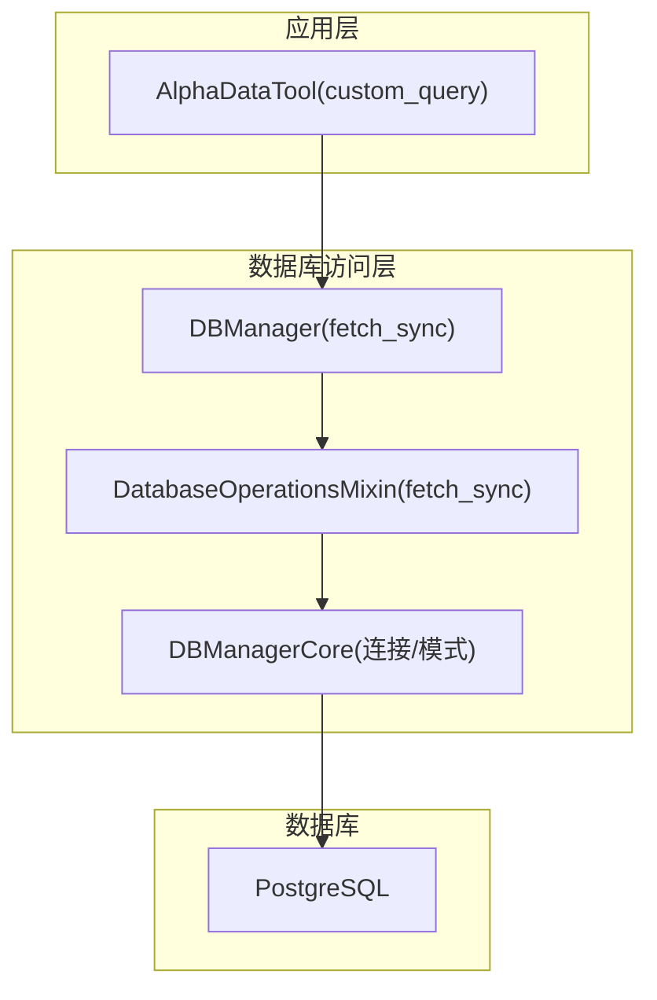
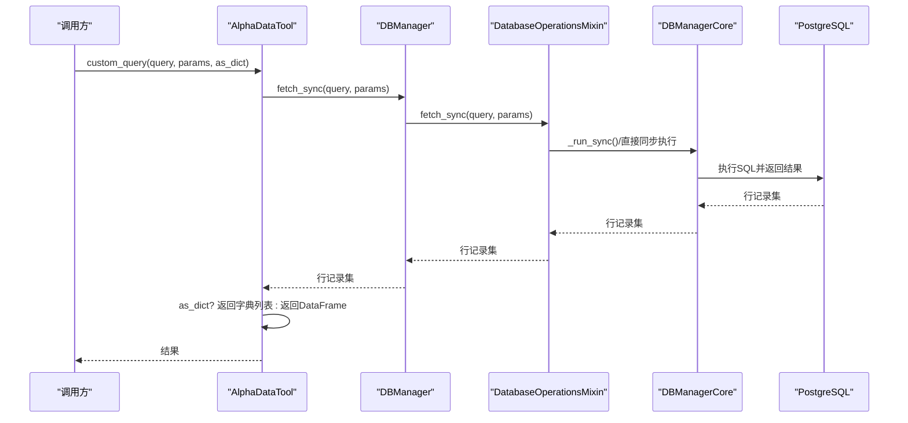
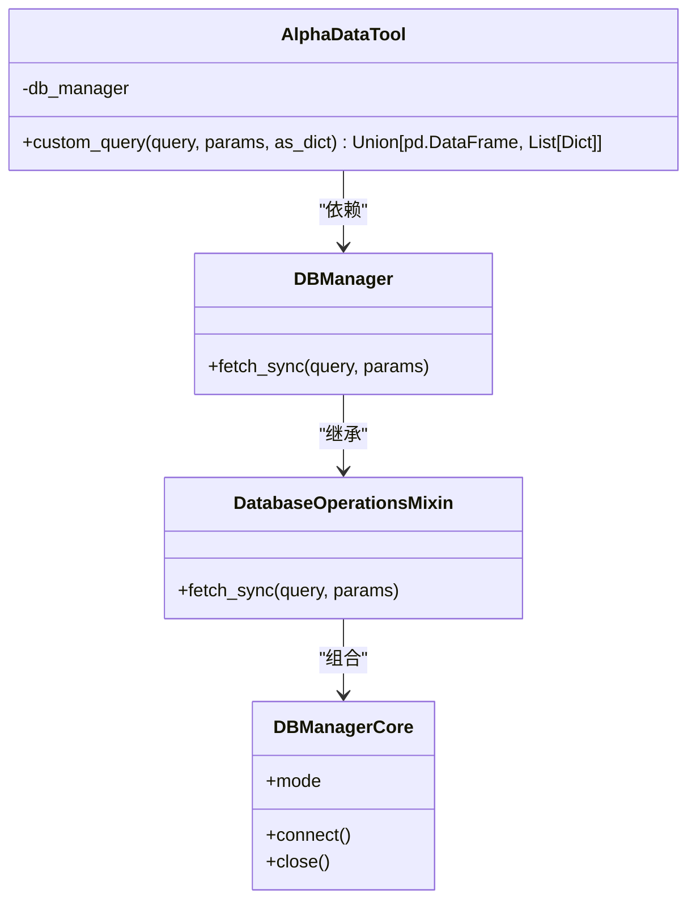

# 自定义SQL查询

<cite>
**本文引用的文件**
- [data_access.py](file://alphahome/providers/data_access.py)
- [db_manager.py](file://alphahome/common/db_manager.py)
- [db_manager_core.py](file://alphahome/common/db_components/db_manager_core.py)
- [database_operations_mixin.py](file://alphahome/common/db_components/database_operations_mixin.py)
- [usage_example.py](file://alphahome/providers/examples/usage_example.py)
</cite>

## 目录
1. [简介](#简介)
2. [项目结构](#项目结构)
3. [核心组件](#核心组件)
4. [架构总览](#架构总览)
5. [详细组件分析](#详细组件分析)
6. [依赖分析](#依赖分析)
7. [性能考虑](#性能考虑)
8. [故障排查指南](#故障排查指南)
9. [结论](#结论)
10. [附录](#附录)

## 简介
本文档围绕扩展功能 custom_query 方法展开，帮助用户理解其参数与行为，掌握如何通过该方法执行任意 SQL 查询，并在需要时返回字典列表或 pandas DataFrame。该方法直接委托给 db_manager.fetch_sync 执行查询，具备最大的灵活性，适用于 80% 核心方法无法覆盖的特殊需求。文档还提供复杂 JOIN 查询示例、参数化查询最佳实践、SQL 注入防护与性能注意事项。

## 项目结构
- 自定义查询入口位于 providers 层的 AlphaDataTool 类中，对外暴露 custom_query 方法。
- 数据库访问由 common 层的 DBManager 统一管理，内部通过 DatabaseOperationsMixin 提供 fetch_sync 等同步查询能力。
- 示例文件展示了如何使用 custom_query 执行复杂联表查询与参数化查询。

图表来源
- [data_access.py](file://alphahome/providers/data_access.py#L458-L484)
- [db_manager.py](file://alphahome/common/db_manager.py#L23-L46)
- [database_operations_mixin.py](file://alphahome/common/db_components/database_operations_mixin.py#L315-L360)
- [db_manager_core.py](file://alphahome/common/db_components/db_manager_core.py#L74-L115)

章节来源
- [data_access.py](file://alphahome/providers/data_access.py#L458-L484)
- [db_manager.py](file://alphahome/common/db_manager.py#L23-L46)

## 核心组件
- AlphaDataTool.custom_query
  - 参数
    - query: str，SQL 查询语句
    - params: 可选，传入查询参数（元组/列表或字典）
    - as_dict: bool，默认 False，控制返回类型
  - 行为
    - 直接调用 self.db_manager.fetch_sync 执行查询
    - as_dict=True 时返回字典列表；否则返回 pandas DataFrame
  - 异常
    - 捕获并记录错误，抛出自定义 DataAccessError

章节来源
- [data_access.py](file://alphahome/providers/data_access.py#L458-L484)

## 架构总览
custom_query 的调用链路如下：

图表来源
- [data_access.py](file://alphahome/providers/data_access.py#L458-L484)
- [database_operations_mixin.py](file://alphahome/common/db_components/database_operations_mixin.py#L315-L360)
- [db_manager_core.py](file://alphahome/common/db_components/db_manager_core.py#L547-L591)

## 详细组件分析

### custom_query 方法详解
- 方法签名与职责
  - 签名：custom_query(query: str, params: Optional[Union[tuple, list]], as_dict: bool = False) -> Union[pd.DataFrame, List[Dict]]
  - 职责：提供“80% 特殊需求”的自定义 SQL 查询能力，直接委托给 DBManager.fetch_sync
- 参数说明
  - query：SQL 语句，支持任意复杂查询（如 JOIN、聚合、子查询）
  - params：参数化查询的参数，支持元组/列表或字典（取决于底层驱动）
  - as_dict：是否返回字典列表（便于与某些框架集成）；False 则返回 pandas DataFrame
- 返回值
  - as_dict=True：返回字典列表
  - as_dict=False：返回 pandas DataFrame
- 错误处理
  - 捕获异常并记录日志，抛出 DataAccessError

章节来源
- [data_access.py](file://alphahome/providers/data_access.py#L458-L484)

### DBManager.fetch_sync 实现要点
- 同步查询接口
  - 支持两种模式：async 与 sync
  - async 模式通过 _run_sync 包装异步 fetch
  - sync 模式使用 psycopg2.extras.RealDictCursor 返回字典列表
- 返回形态
  - fetch_sync 返回行记录集（字典列表）
  - custom_query 将其封装为 DataFrame 或直接返回字典列表

章节来源
- [database_operations_mixin.py](file://alphahome/common/db_components/database_operations_mixin.py#L315-L360)
- [db_manager_core.py](file://alphahome/common/db_components/db_manager_core.py#L547-L591)

### AlphaDataTool 的数据库管理器注入
- AlphaDataTool 构造时接收 db_manager 实例，后续所有数据库操作均由该实例承载
- DBManager 通过整合架构提供统一的数据库访问能力

章节来源
- [data_access.py](file://alphahome/providers/data_access.py#L75-L84)
- [db_manager.py](file://alphahome/common/db_manager.py#L23-L46)

### 复杂 JOIN 查询示例
- 示例场景：联表查询获取指数成分股行情、权重与行业信息
- 示例路径
  - 复杂联表查询示例：[usage_example.py](file://alphahome/providers/examples/usage_example.py#L123-L149)
  - 参数化查询示例：[usage_example.py](file://alphahome/providers/examples/usage_example.py#L156-L188)

章节来源
- [usage_example.py](file://alphahome/providers/examples/usage_example.py#L123-L188)

### 参数化查询与 SQL 注入防护
- 推荐做法
  - 使用参数化查询（位置参数或命名参数），避免拼接字符串
  - 严格限定输入范围，配合白名单校验
- 示例路径
  - 参数化查询示例：[usage_example.py](file://alphahome/providers/examples/usage_example.py#L156-L188)

章节来源
- [usage_example.py](file://alphahome/providers/examples/usage_example.py#L156-L188)

### 返回类型选择：as_dict vs DataFrame
- as_dict=True
  - 返回字典列表，适合与某些框架或序列化流程集成
  - 由 DBManager.fetch_sync 返回字典列表
- as_dict=False
  - 返回 pandas DataFrame，便于后续数据分析与处理
  - custom_query 内部构造 DataFrame

章节来源
- [data_access.py](file://alphahome/providers/data_access.py#L474-L484)
- [database_operations_mixin.py](file://alphahome/common/db_components/database_operations_mixin.py#L315-L360)

## 依赖分析
- 组件耦合
  - AlphaDataTool 依赖 DBManager（通过注入）
  - DBManager 由整合架构组成，核心能力来自 DatabaseOperationsMixin
  - DBManagerCore 负责连接管理与模式切换
- 外部依赖
  - PostgreSQL（asyncpg/psycopg2）
  - pandas（DataFrame 构造）

图表来源
- [data_access.py](file://alphahome/providers/data_access.py#L458-L484)
- [db_manager.py](file://alphahome/common/db_manager.py#L23-L46)
- [database_operations_mixin.py](file://alphahome/common/db_components/database_operations_mixin.py#L131-L174)
- [db_manager_core.py](file://alphahome/common/db_components/db_manager_core.py#L74-L115)

章节来源
- [data_access.py](file://alphahome/providers/data_access.py#L458-L484)
- [db_manager.py](file://alphahome/common/db_manager.py#L23-L46)
- [database_operations_mixin.py](file://alphahome/common/db_components/database_operations_mixin.py#L131-L174)
- [db_manager_core.py](file://alphahome/common/db_components/db_manager_core.py#L74-L115)

## 性能考虑
- fetch_sync 的性能特征
  - async 模式：通过连接池并发执行，适合高并发场景
  - sync 模式：基于线程本地连接，适合同步框架（如回测）
- 复杂查询的性能建议
  - 为常用过滤列与连接列建立索引
  - 控制返回列与行数，避免全表扫描
  - 对大数据量查询使用 LIMIT、分页或分批处理
- DataFrame 构造成本
  - as_dict=False 时，custom_query 会将字典列表转换为 DataFrame，注意内存与构造开销

[本节为通用指导，无需列出具体文件来源]

## 故障排查指南
- 常见问题
  - SQL 语法错误：检查 query 与 params 的格式
  - 参数绑定错误：确认参数类型与占位符匹配
  - 权限不足：确认数据库用户权限
  - 连接异常：检查 DBManager 的连接状态与模式
- 日志与异常
  - custom_query 捕获异常并记录日志，抛出 DataAccessError
  - 可通过日志定位具体 SQL 与参数

章节来源
- [data_access.py](file://alphahome/providers/data_access.py#L474-L484)

## 结论
custom_query 提供了强大的自定义 SQL 查询能力，直接委托给 DBManager.fetch_sync，既灵活又可控。通过参数化查询与 as_dict 返回类型，既能满足复杂业务需求，也能与多种上层框架无缝对接。建议在使用时遵循参数化查询与索引优化的最佳实践，以获得更安全、更高效的查询体验。

[本节为总结性内容，无需列出具体文件来源]

## 附录

### 使用示例路径
- 复杂 JOIN 查询示例
  - [usage_example.py](file://alphahome/providers/examples/usage_example.py#L123-L149)
- 参数化查询示例
  - [usage_example.py](file://alphahome/providers/examples/usage_example.py#L156-L188)

### 关键实现路径
- custom_query 方法
  - [data_access.py](file://alphahome/providers/data_access.py#L458-L484)
- DBManager.fetch_sync
  - [database_operations_mixin.py](file://alphahome/common/db_components/database_operations_mixin.py#L315-L360)
- DBManager 构造与模式
  - [db_manager.py](file://alphahome/common/db_manager.py#L23-L46)
- 连接与模式切换
  - [db_manager_core.py](file://alphahome/common/db_components/db_manager_core.py#L74-L115)