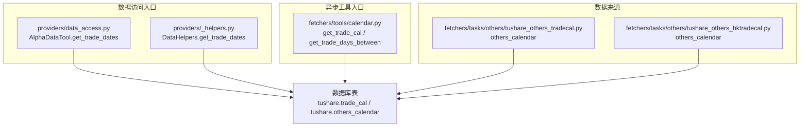
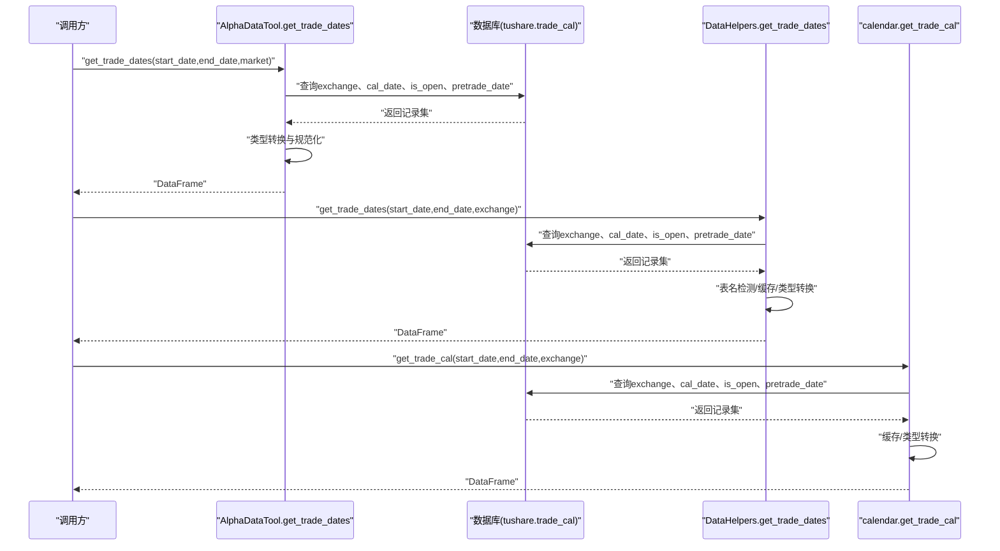
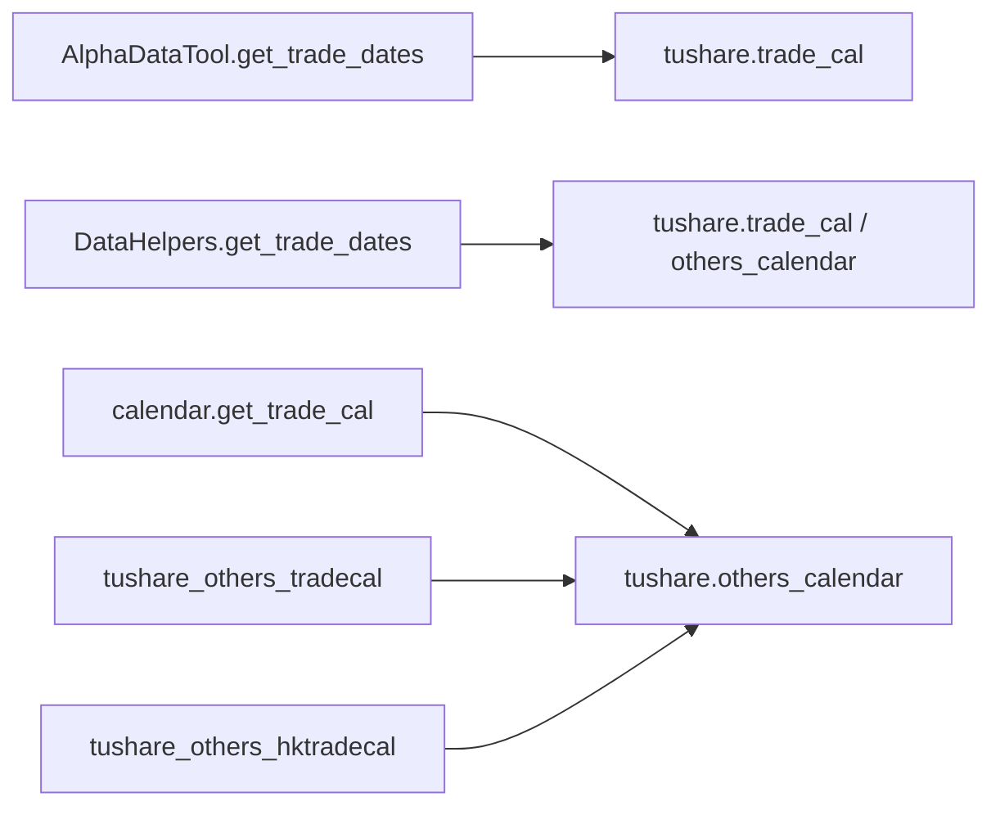

# 获取交易日历

<cite>
**本文引用的文件**
- [providers/data_access.py](file://alphahome/providers/data_access.py)
- [providers/_helpers.py](file://alphahome/providers/_helpers.py)
- [fetchers/tools/calendar.py](file://alphahome/fetchers/tools/calendar.py)
- [fetchers/tasks/others/tushare_others_tradecal.py](file://alphahome/fetchers/tasks/others/tushare_others_tradecal.py)
- [fetchers/tasks/others/tushare_others_hktradecal.py](file://alphahome/fetchers/tasks/others/tushare_others_hktradecal.py)
</cite>

## 目录
1. [简介](#简介)
2. [项目结构](#项目结构)
3. [核心组件](#核心组件)
4. [架构总览](#架构总览)
5. [详细组件分析](#详细组件分析)
6. [依赖关系分析](#依赖关系分析)
7. [性能考量](#性能考量)
8. [故障排查指南](#故障排查指南)
9. [结论](#结论)
10. [附录](#附录)

## 简介
本文件围绕“获取交易日历”能力展开，重点说明如何通过不同入口查询指定市场在特定时间段内的交易日历。文档将解释参数含义、返回数据结构、数据类型、查询实现细节，并给出查询某个月份交易日的实际用法建议。同时，文档阐明了is_open字段被转换为整数类型的原因及其在回测时间对齐中的重要性。

## 项目结构
围绕交易日历的实现涉及两条主要路径：
- 同步数据访问入口：通过统一的数据访问类直接查询数据库表tushare.trade_cal。
- 异步工具入口：通过fetchers/tools/calendar.py提供的异步函数从数据库表tushare.others_calendar读取并缓存交易日历。

此外，数据来源由任务系统负责，将tushare的trade_cal等API拉取到数据库表中，供上述入口使用。

图表来源
- [providers/data_access.py](file://alphahome/providers/data_access.py#L355-L396)
- [providers/_helpers.py](file://alphahome/providers/_helpers.py#L158-L229)
- [fetchers/tools/calendar.py](file://alphahome/fetchers/tools/calendar.py#L184-L305)
- [fetchers/tasks/others/tushare_others_tradecal.py](file://alphahome/fetchers/tasks/others/tushare_others_tradecal.py#L21-L42)
- [fetchers/tasks/others/tushare_others_hktradecal.py](file://alphahome/fetchers/tasks/others/tushare_others_hktradecal.py#L23-L43)

章节来源
- [providers/data_access.py](file://alphahome/providers/data_access.py#L355-L396)
- [providers/_helpers.py](file://alphahome/providers/_helpers.py#L158-L229)
- [fetchers/tools/calendar.py](file://alphahome/fetchers/tools/calendar.py#L184-L305)
- [fetchers/tasks/others/tushare_others_tradecal.py](file://alphahome/fetchers/tasks/others/tushare_others_tradecal.py#L21-L42)
- [fetchers/tasks/others/tushare_others_hktradecal.py](file://alphahome/fetchers/tasks/others/tushare_others_hktradecal.py#L23-L43)

## 核心组件
- AlphaDataTool.get_trade_dates：面向同步场景的统一数据访问方法，查询tushare.trade_cal表，按exchange过滤，返回DataFrame。
- DataHelpers.get_trade_dates：提供交易日历查询的辅助实现，具备表名检测、缓存、类型转换等能力。
- fetchers/tools/calendar.get_trade_cal：异步工具函数，查询tushare.others_calendar表，支持缓存与日期标准化，返回DataFrame。
- tushare_others_tradecal任务：将tushare的trade_cal拉取到数据库表others_calendar，字段包含exchange、cal_date、is_open、pretrade_date。
- tushare_others_hktradecal任务：将tushare的hk_tradecal拉取到数据库表others_calendar，字段同上。

章节来源
- [providers/data_access.py](file://alphahome/providers/data_access.py#L355-L396)
- [providers/_helpers.py](file://alphahome/providers/_helpers.py#L158-L229)
- [fetchers/tools/calendar.py](file://alphahome/fetchers/tools/calendar.py#L184-L305)
- [fetchers/tasks/others/tushare_others_tradecal.py](file://alphahome/fetchers/tasks/others/tushare_others_tradecal.py#L21-L42)
- [fetchers/tasks/others/tushare_others_hktradecal.py](file://alphahome/fetchers/tasks/others/tushare_others_hktradecal.py#L23-L43)

## 架构总览
下图展示了“获取交易日历”的端到端流程，包括参数校验、查询执行、类型转换与缓存策略。

图表来源
- [providers/data_access.py](file://alphahome/providers/data_access.py#L355-L396)
- [providers/_helpers.py](file://alphahome/providers/_helpers.py#L158-L229)
- [fetchers/tools/calendar.py](file://alphahome/fetchers/tools/calendar.py#L184-L305)

## 详细组件分析

### AlphaDataTool.get_trade_dates（同步入口）
- 功能：查询指定市场的交易日历，返回包含cal_date、is_open、pretrade_date的DataFrame。
- 参数：
  - start_date：开始日期，格式YYYY-MM-DD。
  - end_date：结束日期，格式YYYY-MM-DD。
  - market：市场代码，默认"SSE"（上交所）。
- 查询逻辑：
  - 直接查询tushare.trade_cal表，按exchange过滤。
  - 使用参数化查询防止SQL注入。
- 数据类型转换：
  - cal_date：转换为datetime。
  - pretrade_date：转换为datetime（若存在）。
  - is_open：转换为整数类型，便于数值计算与布尔判断。
- 返回值：DataFrame，列名与类型如下：
  - cal_date：datetime64[ns]
  - is_open：int64
  - pretrade_date：datetime64[ns]（若存在）

章节来源
- [providers/data_access.py](file://alphahome/providers/data_access.py#L355-L396)

### DataHelpers.get_trade_dates（辅助入口）
- 功能：提供交易日历查询的通用实现，具备表名检测、缓存、类型转换等能力。
- 参数：
  - start_date：开始日期，格式YYYY-MM-DD。
  - end_date：结束日期，格式YYYY-MM-DD。
  - exchange：交易所代码，默认"SSE"。
- 查询逻辑：
  - 自动检测可用的交易日历表（优先级包含tushare.trade_cal、tushare.others_calendar等）。
  - 查询字段：cal_date、exchange、is_open、pretrade_date。
  - 使用参数化查询并按cal_date排序。
- 缓存策略：
  - 以(start_date,end_date,exchange)为键缓存最近10条结果，减少重复查询。
- 类型转换：
  - cal_date：转换为datetime。
  - pretrade_date：转换为datetime（若存在）。
  - is_open：转换为整数类型。

章节来源
- [providers/_helpers.py](file://alphahome/providers/_helpers.py#L158-L229)

### fetchers/tools/calendar.get_trade_cal（异步入口）
- 功能：异步获取交易日历，查询tushare.others_calendar表，支持缓存与日期标准化。
- 参数：
  - start_date：开始日期，格式YYYYMMDD（默认"20000101"）。
  - end_date：结束日期，格式YYYYMMDD（默认当前日期+1年）。
  - exchange：交易所代码，默认"SSE"；支持"HK"/"HKEX"映射为"HKEX"。
- 查询逻辑：
  - 查询字段：exchange、cal_date、is_open、pretrade_date。
  - 使用asyncpg连接池执行查询。
- 缓存策略：
  - 以(start_date,end_date,exchange)为键的全局内存缓存。
- 类型转换：
  - cal_date/pretrade_date：统一为YYYYMMDD字符串（若为日期对象）。
  - is_open：转换为Int64（支持NA），便于后续计算。

章节来源
- [fetchers/tools/calendar.py](file://alphahome/fetchers/tools/calendar.py#L184-L305)

### 数据来源：tushare_others_tradecal与tushare_others_hktradecal
- 任务目标表：tushare.others_calendar（共享表）。
- 字段定义：exchange、cal_date、is_open、pretrade_date。
- 数据类型：exchange为VARCHAR(10)、cal_date为DATE、is_open为INTEGER、pretrade_date为DATE。
- 验证规则：is_open非空且仅允许0/1。
- 任务差异：
  - tushare_others_tradecal：中国大陆交易所（SSE、SZSE、CFFEX、SHFE、CZCE、DCE、INE）。
  - tushare_others_hktradecal：港股（HKEX），支持自然日分块批量拉取。

章节来源
- [fetchers/tasks/others/tushare_others_tradecal.py](file://alphahome/fetchers/tasks/others/tushare_others_tradecal.py#L21-L42)
- [fetchers/tasks/others/tushare_others_hktradecal.py](file://alphahome/fetchers/tasks/others/tushare_others_hktradecal.py#L23-L43)

### is_open转换为整数类型的意义
- 计算友好：is_open为整数后，可直接参与布尔比较与数值运算，便于筛选交易日、构建交易信号等。
- 回测对齐：在回测引擎中，交易日序列通常以整数标记，is_open为整数可直接与日期序列对齐，避免类型不匹配导致的错位。
- 兼容性：异步工具中is_open采用Int64（支持NA），在同步工具中转换为int64，确保跨模块一致性。

章节来源
- [providers/data_access.py](file://alphahome/providers/data_access.py#L386-L389)
- [providers/_helpers.py](file://alphahome/providers/_helpers.py#L216-L219)
- [fetchers/tools/calendar.py](file://alphahome/fetchers/tools/calendar.py#L284-L287)

### 查询某个月份交易日的示例思路
- 同步入口（推荐）：使用AlphaDataTool.get_trade_dates，传入月份首尾日期，得到DataFrame后筛选is_open==1的记录。
- 异步入口：使用calendar.get_trade_days_between，传入月份首尾日期，返回YYYYMMDD格式的交易日列表。
- 注意：若需前一交易日pretrade_date，可在同步入口中使用DataHelpers.get_trade_dates或AlphaDataTool.get_trade_dates（两者均返回pretrade_date）。

章节来源
- [providers/data_access.py](file://alphahome/providers/data_access.py#L355-L396)
- [fetchers/tools/calendar.py](file://alphahome/fetchers/tools/calendar.py#L449-L482)

## 依赖关系分析
- AlphaDataTool.get_trade_dates依赖tushare.trade_cal表。
- DataHelpers.get_trade_dates通过表名检测机制适配多个候选表（包括tushare.trade_cal、tushare.others_calendar等）。
- fetchers/tools/calendar.get_trade_cal依赖tushare.others_calendar表。
- 任务系统将tushare的trade_cal/hk_tradecal拉取至others_calendar，供上述入口使用。

图表来源
- [providers/data_access.py](file://alphahome/providers/data_access.py#L355-L396)
- [providers/_helpers.py](file://alphahome/providers/_helpers.py#L53-L104)
- [fetchers/tools/calendar.py](file://alphahome/fetchers/tools/calendar.py#L184-L305)
- [fetchers/tasks/others/tushare_others_tradecal.py](file://alphahome/fetchers/tasks/others/tushare_others_tradecal.py#L21-L42)
- [fetchers/tasks/others/tushare_others_hktradecal.py](file://alphahome/fetchers/tasks/others/tushare_others_hktradecal.py#L23-L43)

## 性能考量
- 缓存策略：
  - DataHelpers.get_trade_dates：内存缓存最近10组(start_date,end_date,exchange)的结果，减少重复查询。
  - calendar.get_trade_cal：全局内存缓存，按(start_date,end_date,exchange)键缓存DataFrame副本。
- 查询优化：
  - 使用参数化查询，避免SQL注入风险。
  - 在数据库侧按exchange与日期范围过滤，减少网络传输与内存占用。
- 类型转换：
  - 仅在必要时进行类型转换，避免重复转换带来的额外开销。

[本节为通用性能讨论，不直接分析具体文件]

## 故障排查指南
- 无数据返回：
  - 检查market/exchange参数是否正确（如"SSE"、"SZSE"、"HKEX"）。
  - 确认日期范围是否合理（start_date<=end_date）。
  - 确认数据库中是否存在对应表（tushare.trade_cal或tushare.others_calendar）。
- 类型异常：
  - 若is_open为字符串或浮点数，需确认是否经过类型转换（同步入口已转换为int64，异步入口已转换为Int64）。
- 缓存问题：
  - 若缓存命中导致数据陈旧，可等待缓存失效或调整缓存策略。
- 异步连接失败：
  - 检查数据库连接池初始化与URL配置（calendar模块内部会加载配置文件）。

章节来源
- [providers/data_access.py](file://alphahome/providers/data_access.py#L386-L396)
- [providers/_helpers.py](file://alphahome/providers/_helpers.py#L216-L229)
- [fetchers/tools/calendar.py](file://alphahome/fetchers/tools/calendar.py#L184-L305)

## 结论
- AlphaDataTool.get_trade_dates与DataHelpers.get_trade_dates提供了同步场景下的交易日历查询能力，前者直接查询tushare.trade_cal，后者具备更强的表名检测与缓存能力。
- fetchers/tools/calendar.get_trade_cal提供了异步入口，查询tushare.others_calendar，具备全局缓存与日期标准化。
- is_open转换为整数类型是实现数值计算与回测对齐的关键步骤。
- 建议在需要前一交易日pretrade_date时，优先使用同步入口；在需要异步与缓存时，使用calendar.get_trade_cal。

[本节为总结性内容，不直接分析具体文件]

## 附录

### 返回DataFrame字段说明
- cal_date：日历日期（datetime64[ns]或YYYYMMDD字符串）
- is_open：是否为交易日（int64或Int64）
- pretrade_date：前一交易日（datetime64[ns]或YYYYMMDD字符串，若存在）

章节来源
- [providers/data_access.py](file://alphahome/providers/data_access.py#L386-L389)
- [providers/_helpers.py](file://alphahome/providers/_helpers.py#L216-L219)
- [fetchers/tools/calendar.py](file://alphahome/fetchers/tools/calendar.py#L274-L287)