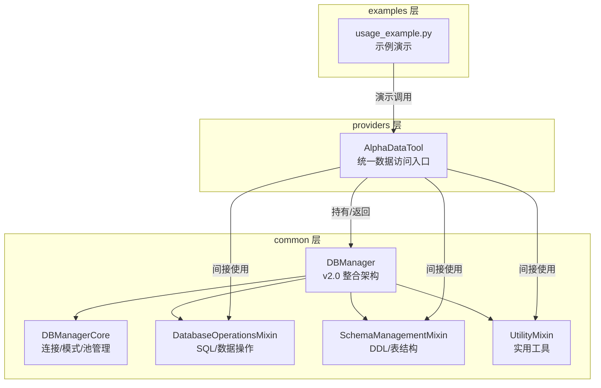
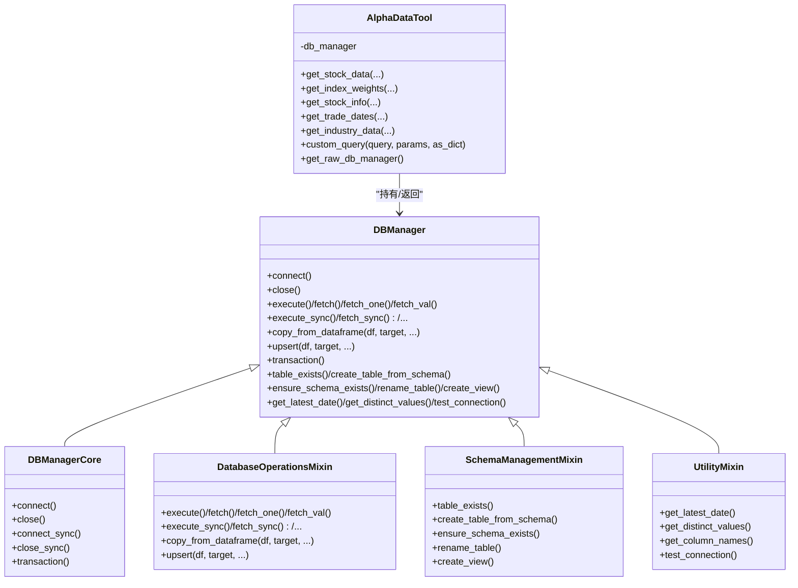
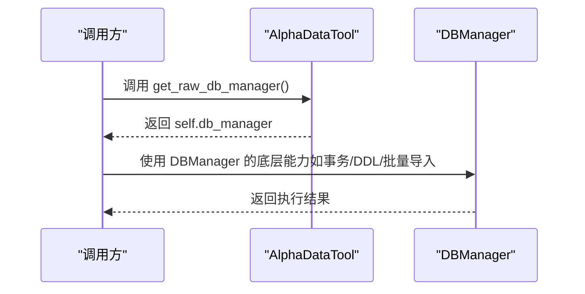
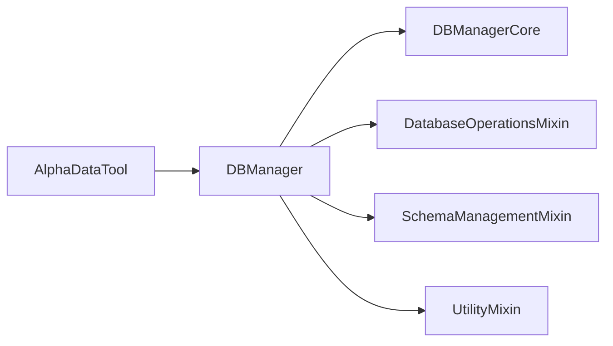

# 获取原始数据库管理器

<cite>
**本文引用的文件**
- [data_access.py](file://alphahome/providers/data_access.py)
- [db_manager.py](file://alphahome/common/db_manager.py)
- [db_manager_core.py](file://alphahome/common/db_components/db_manager_core.py)
- [database_operations_mixin.py](file://alphahome/common/db_components/database_operations_mixin.py)
- [schema_management_mixin.py](file://alphahome/common/db_components/schema_management_mixin.py)
- [utility_mixin.py](file://alphahome/common/db_components/utility_mixin.py)
- [usage_example.py](file://alphahome/providers/examples/usage_example.py)
</cite>

## 目录
1. [简介](#简介)
2. [项目结构](#项目结构)
3. [核心组件](#核心组件)
4. [架构总览](#架构总览)
5. [详细组件分析](#详细组件分析)
6. [依赖分析](#依赖分析)
7. [性能考量](#性能考量)
8. [故障排查指南](#故障排查指南)
9. [结论](#结论)
10. [附录](#附录)

## 简介
本篇文档围绕 AlphaHome 提供的“获取原始数据库管理器”能力展开，重点说明 get_raw_db_manager 方法的作用、返回值、使用场景与注意事项。该方法属于 AlphaDataTool 的高级扩展功能，用于在极少数情况下绕过高层封装，直接访问底层 DBManager 实例，从而获得更广泛的数据库操作能力（如 DDL、事务、批量导入、连接池管理、异步/同步模式切换等）。文档将帮助你理解何时使用该方法、如何安全使用以及如何结合 DBManager 的能力完成复杂任务。

## 项目结构
- AlphaDataTool 位于 providers 层，提供统一的数据访问入口；其内部持有 DBManager 实例。
- DBManager 由多个 Mixin 组成，形成 v2.0 整合架构，覆盖连接管理、SQL/数据操作、DDL/表结构管理、实用工具等功能。
- 示例文件展示了如何通过 get_raw_db_manager 获取底层 DBManager 并执行高级操作。

图表来源
- [data_access.py](file://alphahome/providers/data_access.py#L51-L120)
- [db_manager.py](file://alphahome/common/db_manager.py#L23-L69)
- [db_manager_core.py](file://alphahome/common/db_components/db_manager_core.py#L16-L67)
- [database_operations_mixin.py](file://alphahome/common/db_components/database_operations_mixin.py#L131-L174)
- [schema_management_mixin.py](file://alphahome/common/db_components/schema_management_mixin.py#L6-L33)
- [utility_mixin.py](file://alphahome/common/db_components/utility_mixin.py#L14-L41)
- [usage_example.py](file://alphahome/providers/examples/usage_example.py#L190-L208)

章节来源
- [data_access.py](file://alphahome/providers/data_access.py#L51-L120)
- [db_manager.py](file://alphahome/common/db_manager.py#L23-L69)

## 核心组件
- AlphaDataTool：统一数据访问入口，提供 5 个核心方法与 2 个扩展方法（含 get_raw_db_manager）。其内部保存 db_manager 引用，get_raw_db_manager 直接返回该实例。
- DBManager：v2.0 整合架构，由 DBManagerCore、DatabaseOperationsMixin、SchemaManagementMixin、UtilityMixin 组合而成，支持 async/sync 两种模式，提供连接池、事务、SQL/数据操作、DDL、实用工具等能力。
- 示例：usage_example.py 展示了如何通过 get_raw_db_manager 获取底层 DBManager，并说明其可使用的高级能力（如批量导入、事务、连接池管理等）。

章节来源
- [data_access.py](file://alphahome/providers/data_access.py#L51-L120)
- [db_manager.py](file://alphahome/common/db_manager.py#L23-L69)
- [usage_example.py](file://alphahome/providers/examples/usage_example.py#L190-L208)

## 架构总览
下面的类图展示了 AlphaDataTool 与 DBManager 的关系，以及 DBManager 的组成。

图表来源
- [data_access.py](file://alphahome/providers/data_access.py#L51-L120)
- [db_manager.py](file://alphahome/common/db_manager.py#L23-L69)
- [db_manager_core.py](file://alphahome/common/db_components/db_manager_core.py#L16-L67)
- [database_operations_mixin.py](file://alphahome/common/db_components/database_operations_mixin.py#L131-L174)
- [schema_management_mixin.py](file://alphahome/common/db_components/schema_management_mixin.py#L6-L33)
- [utility_mixin.py](file://alphahome/common/db_components/utility_mixin.py#L14-L41)

## 详细组件分析

### get_raw_db_manager 方法详解
- 方法定位：位于 providers/data_access.py 中，AlphaDataTool 类的扩展方法之一。
- 返回值：直接返回初始化 AlphaDataTool 时传入的 db_manager 实例。
- 设计意图：为需要直接访问数据库底层能力的高级用户提供“后门”，在核心方法与 custom_query 无法满足需求时使用。
- 使用前提：调用方需了解 DBManager 的 API 与行为边界，尤其是 async/sync 模式差异、连接池管理、事务语义、DDL/数据导入等。

图表来源
- [data_access.py](file://alphahome/providers/data_access.py#L485-L494)

章节来源
- [data_access.py](file://alphahome/providers/data_access.py#L485-L494)

### DBManager 能力概览（与 get_raw_db_manager 的关系）
- 连接与模式
  - 支持 async 与 sync 两种模式，分别使用 asyncpg/psycopg2。
  - 提供 connect/close（异步）与 connect_sync/close_sync（同步）。
- 事务
  - 提供 transaction 上下文管理器（仅 async 模式）。
- SQL/数据操作
  - fetch/fetch_one/fetch_val（异步）与 fetch_sync/fetch_one_sync/fetch_val_sync（同步）。
  - copy_from_dataframe：基于 PostgreSQL COPY 的高性能批量导入，支持 upsert。
  - upsert：基于冲突列的智能插入/更新。
- DDL/表结构管理
  - table_exists/get_table_schema/create_table_from_schema/rename_table/create_view 等。
  - ensure_schema_exists：确保 schema 存在。
- 实用工具
  - get_latest_date/get_distinct_values/get_column_names/test_connection 等。

章节来源
- [db_manager.py](file://alphahome/common/db_manager.py#L23-L69)
- [db_manager_core.py](file://alphahome/common/db_components/db_manager_core.py#L116-L145)
- [db_manager_core.py](file://alphahome/common/db_components/db_manager_core.py#L337-L409)
- [db_manager_core.py](file://alphahome/common/db_components/db_manager_core.py#L446-L479)
- [db_manager_core.py](file://alphahome/common/db_components/db_manager_core.py#L561-L591)
- [database_operations_mixin.py](file://alphahome/common/db_components/database_operations_mixin.py#L193-L289)
- [database_operations_mixin.py](file://alphahome/common/db_components/database_operations_mixin.py#L293-L380)
- [database_operations_mixin.py](file://alphahome/common/db_components/database_operations_mixin.py#L480-L710)
- [database_operations_mixin.py](file://alphahome/common/db_components/database_operations_mixin.py#L720-L758)
- [schema_management_mixin.py](file://alphahome/common/db_components/schema_management_mixin.py#L64-L91)
- [schema_management_mixin.py](file://alphahome/common/db_components/schema_management_mixin.py#L115-L159)
- [schema_management_mixin.py](file://alphahome/common/db_components/schema_management_mixin.py#L160-L331)
- [schema_management_mixin.py](file://alphahome/common/db_components/schema_management_mixin.py#L331-L348)
- [schema_management_mixin.py](file://alphahome/common/db_components/schema_management_mixin.py#L349-L381)
- [utility_mixin.py](file://alphahome/common/db_components/utility_mixin.py#L56-L93)
- [utility_mixin.py](file://alphahome/common/db_components/utility_mixin.py#L115-L174)
- [utility_mixin.py](file://alphahome/common/db_components/utility_mixin.py#L175-L216)

### 使用示例与最佳实践
- 示例文件展示了如何通过 get_raw_db_manager 获取 DBManager，并说明其可使用的高级能力（如批量导入、事务、连接池管理等）。
- 建议在以下场景考虑使用 get_raw_db_manager：
  - 需要执行 DDL（建表、重命名、创建视图等）。
  - 需要使用事务上下文管理器（仅 async 模式）。
  - 需要进行大规模数据导入（copy_from_dataframe/upsert）。
  - 需要直接管理连接池或进行连接状态检查。
- 注意事项：
  - 该方法“打破封装”，请仅在核心方法与 custom_query 无法满足需求时使用。
  - 必须了解 DBManager 的 API 与行为边界，尤其是 async/sync 模式差异。
  - 在同步环境中使用异步方法时，DBManager 提供了桥接机制（_run_sync），但调用方仍需谨慎处理事件循环与阻塞。

章节来源
- [usage_example.py](file://alphahome/providers/examples/usage_example.py#L190-L208)

## 依赖分析
- AlphaDataTool 依赖 DBManager（持有/返回）。
- DBManager 由多个 Mixin 组合而成，彼此解耦、职责清晰：
  - DBManagerCore：连接/模式/池管理与事务。
  - DatabaseOperationsMixin：SQL/数据操作与批量导入。
  - SchemaManagementMixin：DDL/表结构管理。
  - UtilityMixin：实用工具。
- providers/data_access.py 通过 DBManager 的 fetch_sync 接口完成 AlphaDataTool 的核心查询逻辑，而 get_raw_db_manager 则暴露 DBManager 的全部能力。

图表来源
- [data_access.py](file://alphahome/providers/data_access.py#L51-L120)
- [db_manager.py](file://alphahome/common/db_manager.py#L23-L69)

章节来源
- [data_access.py](file://alphahome/providers/data_access.py#L51-L120)
- [db_manager.py](file://alphahome/common/db_manager.py#L23-L69)

## 性能考量
- 批量导入：copy_from_dataframe 基于 PostgreSQL COPY，远优于逐条 INSERT，适合大规模数据入库。
- 连接池：async 模式下使用 asyncpg 连接池，支持并发与连接复用；sync 模式下使用线程本地连接，避免并发冲突。
- 事务：在 async 模式下使用 transaction 上下文管理器，确保 DDL/批量写入的原子性。
- 性能监控：DatabaseOperationsMixin 内置批量性能监控，可输出吞吐量与建议批次大小，便于优化。

章节来源
- [database_operations_mixin.py](file://alphahome/common/db_components/database_operations_mixin.py#L480-L710)
- [db_manager_core.py](file://alphahome/common/db_components/db_manager_core.py#L337-L409)
- [db_manager_core.py](file://alphahome/common/db_components/db_manager_core.py#L116-L145)

## 故障排查指南
- 连接问题
  - 使用 test_connection 检查连接状态。
  - async 模式下确保已调用 connect；sync 模式下 connect_sync。
- 事务异常
  - async 模式下 transaction 上下文管理器会在异常时自动回滚，请检查异常日志。
- 批量导入失败
  - 检查 DataFrame 列名与目标表结构是否匹配；确认冲突列与更新列配置正确。
- 模式不匹配
  - 在 sync 环境中调用 async 方法会触发桥接（_run_sync），若出现阻塞或事件循环冲突，需调整调用方式。

章节来源
- [utility_mixin.py](file://alphahome/common/db_components/utility_mixin.py#L175-L216)
- [db_manager_core.py](file://alphahome/common/db_components/db_manager_core.py#L337-L409)
- [db_manager_core.py](file://alphahome/common/db_components/db_manager_core.py#L116-L145)
- [database_operations_mixin.py](file://alphahome/common/db_components/database_operations_mixin.py#L480-L710)

## 结论
get_raw_db_manager 是 AlphaDataTool 的高级扩展入口，用于在极少数情况下直接访问底层 DBManager，从而获得 DDL、事务、批量导入、连接池管理等高级能力。该方法“打破封装”，仅应在核心方法与 custom_query 无法满足需求时谨慎使用，并要求调用方充分理解 DBManager 的 API 与行为边界（尤其是 async/sync 模式差异）。通过合理使用该方法与 DBManager 的能力，可以在保证数据访问简洁性的同时，满足复杂场景下的数据库操作需求。

## 附录
- 方法定义与返回值
  - 定位：providers/data_access.py 中 AlphaDataTool.get_raw_db_manager
  - 返回：self.db_manager（即初始化时传入的 DBManager 实例）
- 相关能力参考
  - DBManager：连接/事务/SQL/数据操作/DDL/实用工具
  - 示例：providers/examples/usage_example.py 中的演示片段

章节来源
- [data_access.py](file://alphahome/providers/data_access.py#L485-L494)
- [db_manager.py](file://alphahome/common/db_manager.py#L23-L69)
- [usage_example.py](file://alphahome/providers/examples/usage_example.py#L190-L208)