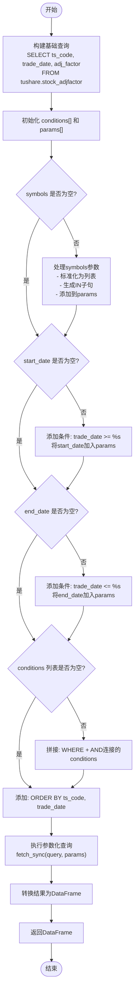

# 获取复权因子数据

<cite>
**本文档引用的文件**   
- [data_access.py](file://alphahome/providers/data_access.py#L233-L290)
- [tushare_stock_adjfactor.py](file://alphahome/fetchers/tasks/stock/tushare_stock_adjfactor.py#L1-L122)
- [data_sources.md](file://docs/business/data_sources.md#L95-L106)
- [hikyuu_integration_guide.md](file://docs/hikyuu_integration_guide.md#L255-L258)
</cite>

## 目录
1. [方法概述](#方法概述)
2. [参数详解](#参数详解)
3. [返回值说明](#返回值说明)
4. [SQL查询实现](#sql查询实现)
5. [数据源与表结构](#数据源与表结构)
6. [代码示例](#代码示例)
7. [错误处理与数据验证](#错误处理与数据验证)

## 方法概述

`get_adj_factor_data` 方法是用于获取股票复权因子的核心接口。复权因子是进行历史行情复权计算的基础，当股票发生分红、送股等除权除息事件时，会产生新的复权因子，用于调整历史价格以保持连续性。

该方法通过 `AlphaDataTool` 类提供，是数据访问层的一部分，旨在为研究和分析提供简洁、高效的数据获取方式。

**Section sources**
- [data_access.py](file://alphahome/providers/data_access.py#L233-L290)

## 参数详解

`get_adj_factor_data` 方法接受三个可选参数，用于灵活地过滤所需数据：

- **`symbols`**: 股票代码或代码列表。可以是单个字符串（如 `'000001.SZ'`）或字符串列表（如 `['000001.SZ', '000002.SZ']`）。当此参数为空时，方法将获取所有股票的复权因子数据。
- **`start_date`**: 开始日期，格式为 `YYYY-MM-DD`。当此参数为空时，不设置开始日期限制。
- **`end_date`**: 结束日期，格式为 `YYYY-MM-DD`。当此参数为空时，不设置结束日期限制。

通过组合这些参数，用户可以精确地获取特定股票在特定时间段内的复权因子，或者获取全市场的完整数据集。

**Section sources**
- [data_access.py](file://alphahome/providers/data_access.py#L235-L245)

## 返回值说明

该方法返回一个 `pandas.DataFrame` 对象，包含以下三列：

- **`ts_code`**: Tushare股票代码，例如 `'000001.SZ'`。
- **`trade_date`**: 交易日期，为 `pandas.Timestamp` 类型。
- **`adj_factor`**: 复权因子，为数值类型。

返回的DataFrame会按照 `ts_code` 和 `trade_date` 进行排序，确保数据的有序性。当查询结果为空时，会返回一个空的DataFrame，并记录相应的警告日志。

**Section sources**
- [data_access.py](file://alphahome/providers/data_access.py#L250-L251)
- [data_sources.md](file://docs/business/data_sources.md#L103-L105)

## SQL查询实现

`get_adj_factor_data` 方法的核心在于其动态构建SQL WHERE子句的实现方式。其逻辑如下：

1.  **基础查询**: 固定的SELECT语句，从 `tushare.stock_adjfactor` 表中选择 `ts_code`、`trade_date` 和 `adj_factor` 三列。
2.  **条件构建**: 创建一个空的 `conditions` 列表和一个空的 `params` 列表。
3.  **参数化过滤**:
    *   如果 `symbols` 参数不为空，则将其标准化为列表，生成相应的 `IN` 子句（如 `ts_code IN (%s, %s)`），并将股票代码添加到 `params` 中。
    *   如果 `start_date` 参数不为空，则添加 `trade_date >= %s` 条件，并将开始日期添加到 `params` 中。
    *   如果 `end_date` 参数不为空，则添加 `trade_date <= %s` 条件，并将结束日期添加到 `params` 中。
4.  **拼接查询**: 如果 `conditions` 列表不为空，则将所有条件用 `AND` 连接，并拼接到基础查询的 `WHERE` 子句后。
5.  **执行查询**: 使用 `db_manager.fetch_sync` 执行最终的参数化查询，并将结果转换为DataFrame。

这种实现方式既保证了查询的灵活性，又通过参数化查询有效防止了SQL注入攻击。



**Diagram sources **
- [data_access.py](file://alphahome/providers/data_access.py#L249-L276)

**Section sources**
- [data_access.py](file://alphahome/providers/data_access.py#L253-L276)

## 数据源与表结构

`get_adj_factor_data` 方法直接查询 `tushare.stock_adjfactor` 数据表。该表的数据来源于Tushare Pro的 `adj_factor` API。

表结构定义如下：
| 列名 | 数据类型 | 约束 | 注释 |
| :--- | :--- | :--- | :--- |
| `ts_code` | VARCHAR(15) | NOT NULL | Tushare股票代码 |
| `trade_date` | DATE | NOT NULL | 交易日期 |
| `adj_factor` | NUMERIC(12,8) | | 复权因子 |

根据文档，该数据表用于计算前复权（Forward Adjustment）价格。

**Section sources**
- [data_sources.md](file://docs/business/data_sources.md#L95-L106)
- [hikyuu_integration_guide.md](file://docs/hikyuu_integration_guide.md#L255-L258)
- [tushare_stock_adjfactor.py](file://alphahome/fetchers/tasks/stock/tushare_stock_adjfactor.py#L50-L54)

## 代码示例

以下是使用 `get_adj_factor_data` 方法的代码示例：

### 获取单只股票某段时间的复权因子

```python
# 假设 data_tool 是已初始化的 AlphaDataTool 实例
adj_factor = data_tool.get_adj_factor_data(
    symbols='000001.SZ',
    start_date='2024-01-01',
    end_date='2024-01-31'
)
print(adj_factor)
```

### 获取全市场数据

```python
# 获取所有股票的复权因子（不指定symbols）
all_adj_factor = data_tool.get_adj_factor_data()
print(f"共获取 {len(all_adj_factor)} 条全市场复权因子数据")
```

**Section sources**
- [hikyuu_integration_guide.md](file://docs/hikyuu_integration_guide.md#L249-L251)
- [hikyuu_faq.md](file://docs/hikyuu_faq.md#L33)

## 错误处理与数据验证

该方法在实现中包含了完善的错误处理和数据类型转换机制：

1.  **错误处理**: 整个查询过程被包裹在 `try-except` 块中。如果查询失败，会捕获异常，记录错误日志，并抛出一个 `DataAccessError`，确保调用方能感知到错误。
2.  **数据类型转换**: 查询成功后，会对返回的DataFrame进行处理：
    *   将 `trade_date` 列转换为 `pandas.Timestamp` 类型。
    *   将 `adj_factor` 列转换为数值类型（`float`），并使用 `errors='coerce'` 策略，将无法转换的值设为 `NaN`，保证了数据的健壮性。
3.  **空值处理**: 如果查询结果为空，会记录一条警告日志，然后返回一个空的DataFrame。

这些措施确保了方法的稳定性和返回数据的可用性。

**Section sources**
- [data_access.py](file://alphahome/providers/data_access.py#L277-L286)
- [tushare_stock_adjfactor.py](file://alphahome/fetchers/tasks/stock/tushare_stock_adjfactor.py#L57-L61)