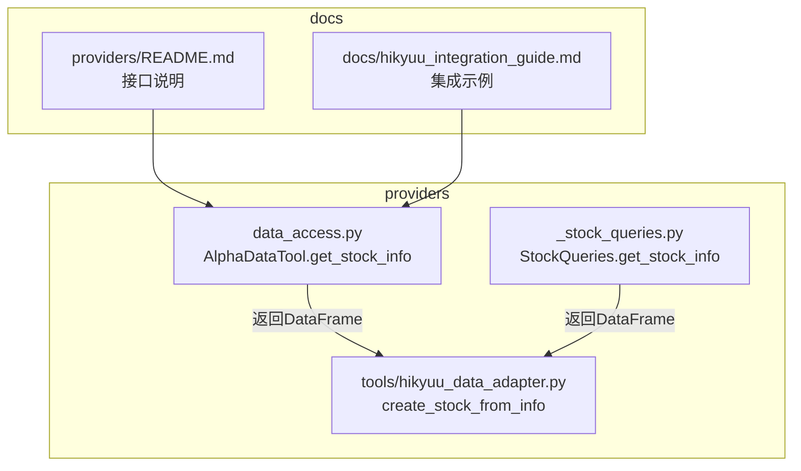
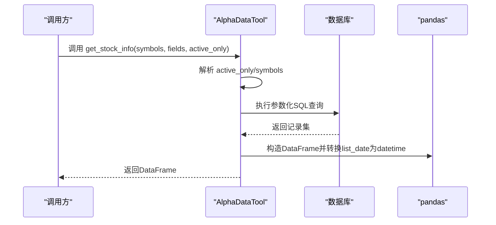
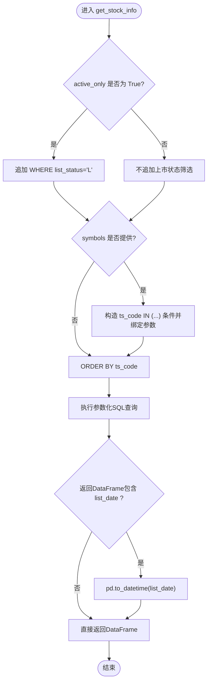
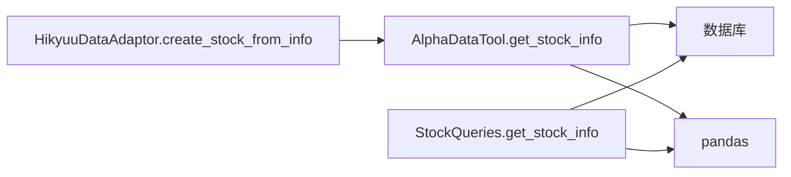

# 获取股票基本信息

<cite>
**本文引用的文件**
- [data_access.py](file://alphahome/providers/data_access.py)
- [_stock_queries.py](file://alphahome/providers/_stock_queries.py)
- [hikyuu_data_adapter.py](file://alphahome/providers/tools/hikyuu_data_adapter.py)
- [README.md](file://alphahome/providers/README.md)
- [hikyuu_integration_guide.md](file://docs/hikyuu_integration_guide.md)
</cite>

## 目录
1. [简介](#简介)
2. [项目结构](#项目结构)
3. [核心组件](#核心组件)
4. [架构概览](#架构概览)
5. [详细组件分析](#详细组件分析)
6. [依赖关系分析](#依赖关系分析)
7. [性能考量](#性能考量)
8. [故障排查指南](#故障排查指南)
9. [结论](#结论)

## 简介
本文件围绕“获取股票基本信息”的方法进行深入文档化，重点说明以下内容：
- 方法签名与参数语义：symbols（可选，用于筛选特定股票）、fields（兼容性保留，当前忽略）、active_only（是否仅返回上市状态的股票）。
- 返回的DataFrame字段：ts_code、symbol、name、area、industry、market、list_date、list_status 等。
- 内部SQL查询构建逻辑：根据 active_only 与 symbols 动态拼接 WHERE 条件与参数。
- 数据类型处理：list_date 字段被转换为 pandas datetime 类型。
- 典型使用场景：策略初始化时加载股票池（仅上市股票）。

## 项目结构
与“获取股票基本信息”直接相关的代码位于 providers 子模块中，核心实现集中在 data_access.py 的 AlphaDataTool 类中；同时，_stock_queries.py 提供了另一套查询能力（包含更丰富的字段与 list_status 筛选）。此外，Hikyuu 集成适配器对 list_date 的使用也体现了该字段在外部系统中的重要性。

图表来源
- [data_access.py](file://alphahome/providers/data_access.py#L296-L350)
- [_stock_queries.py](file://alphahome/providers/_stock_queries.py#L250-L323)
- [hikyuu_data_adapter.py](file://alphahome/providers/tools/hikyuu_data_adapter.py#L112-L139)
- [README.md](file://alphahome/providers/README.md#L117-L132)
- [hikyuu_integration_guide.md](file://docs/hikyuu_integration_guide.md#L274-L274)

章节来源
- [data_access.py](file://alphahome/providers/data_access.py#L296-L350)
- [_stock_queries.py](file://alphahome/providers/_stock_queries.py#L250-L323)
- [hikyuu_data_adapter.py](file://alphahome/providers/tools/hikyuu_data_adapter.py#L112-L139)
- [README.md](file://alphahome/providers/README.md#L117-L132)
- [hikyuu_integration_guide.md](file://docs/hikyuu_integration_guide.md#L274-L274)

## 核心组件
- AlphaDataTool.get_stock_info：面向用户的一站式数据访问入口，提供 active_only 与 symbols 筛选，返回 ts_code、symbol、name、area、industry、market、list_date、list_status 等字段。
- StockQueries.get_stock_info：内部查询类，支持 list_status 精细化筛选（L/D/P），并具备表名智能检测与参数化查询能力。
- HikyuuDataAdaptor.create_stock_from_info：消费股票基本信息，要求包含 ts_code、symbol、name、market、list_date 等字段，体现 list_date 的重要性。

章节来源
- [data_access.py](file://alphahome/providers/data_access.py#L296-L350)
- [_stock_queries.py](file://alphahome/providers/_stock_queries.py#L250-L323)
- [hikyuu_data_adapter.py](file://alphahome/providers/tools/hikyuu_data_adapter.py#L112-L139)

## 架构概览
下图展示了“获取股票基本信息”的调用链与数据流，从 AlphaDataTool 到数据库，再到返回 DataFrame 并进行 list_date 类型转换。

图表来源
- [data_access.py](file://alphahome/providers/data_access.py#L296-L350)

## 详细组件分析

### AlphaDataTool.get_stock_info 方法详解
- 方法签名与参数
  - symbols：可选，支持单个字符串或字符串列表；若提供，则在 WHERE 子句中以 IN 条件过滤 ts_code。
  - fields：兼容性保留，当前实现忽略该参数。
  - active_only：布尔开关，True 时仅返回 list_status='L' 的股票；False 时返回全部状态。
- 返回字段
  - ts_code、symbol、name、area、industry、market、list_date、list_status。
- SQL 查询构建逻辑
  - 若 active_only=True：追加 WHERE list_status='L'。
  - 若 symbols 存在：追加 WHERE ts_code IN (...)，并绑定参数。
  - 最终 ORDER BY ts_code。
- 数据类型处理
  - 若返回的 DataFrame 包含 list_date 列，则将其转换为 pandas datetime 类型。
- 典型使用场景
  - 策略初始化时加载股票池：通常传入 active_only=True，确保仅加载上市股票，避免无效或已退市标的参与回测/实盘。

图表来源
- [data_access.py](file://alphahome/providers/data_access.py#L296-L350)

章节来源
- [data_access.py](file://alphahome/providers/data_access.py#L296-L350)

### StockQueries.get_stock_info 方法对比
- 该类同样提供 get_stock_info，但其 list_status 参数为字符串枚举（'L'/'D'/'P'），并内置表名智能检测与参数化查询。
- 返回字段更丰富，包含 fullname、enname、cnspell、exchange、curr_type、is_hs、delist_date 等。
- 与 AlphaDataTool 的差异点在于：前者面向内部查询复用，后者面向外部用户 API。

章节来源
- [_stock_queries.py](file://alphahome/providers/_stock_queries.py#L250-L323)

### Hikyuu 集成中的 list_date 使用
- HikyuuDataAdaptor.create_stock_from_info 明确要求股票信息字典包含 ts_code、symbol、name、market、list_date 等字段，用于创建 Hikyuu Stock 对象。
- 这进一步印证了 list_date 字段在外部系统中的关键作用，便于后续基于上市日期进行筛选或排序。

章节来源
- [hikyuu_data_adapter.py](file://alphahome/providers/tools/hikyuu_data_adapter.py#L112-L139)

## 依赖关系分析
- AlphaDataTool.get_stock_info 依赖数据库连接（db_manager）执行参数化查询，并依赖 pandas 进行数据类型转换。
- StockQueries.get_stock_info 同样依赖数据库连接，但额外具备表名智能检测与更复杂的字段选择。
- HikyuuDataAdaptor.create_stock_from_info 依赖 AlphaDataTool 返回的 DataFrame 字段（尤其是 list_date）进行外部系统集成。

图表来源
- [data_access.py](file://alphahome/providers/data_access.py#L296-L350)
- [_stock_queries.py](file://alphahome/providers/_stock_queries.py#L250-L323)
- [hikyuu_data_adapter.py](file://alphahome/providers/tools/hikyuu_data_adapter.py#L112-L139)

章节来源
- [data_access.py](file://alphahome/providers/data_access.py#L296-L350)
- [_stock_queries.py](file://alphahome/providers/_stock_queries.py#L250-L323)
- [hikyuu_data_adapter.py](file://alphahome/providers/tools/hikyuu_data_adapter.py#L112-L139)

## 性能考量
- 参数化查询：两种实现均采用参数化 SQL，有效防止 SQL 注入并提升执行计划复用率。
- 表名智能检测：StockQueries 在同步/异步模式下分别处理，减少不必要的表探测成本。
- 数据类型转换：仅在必要时对 list_date 进行转换，避免无谓的类型转换开销。
- 建议
  - 当 symbols 为大量股票时，建议分批查询以控制内存与网络压力。
  - 若仅需上市股票，优先使用 active_only=True，缩小数据集后再做二次筛选。

[本节为通用指导，无需列出具体文件来源]

## 故障排查指南
- 查询无结果
  - 检查 active_only 与 symbols 的组合是否导致过滤过严。
  - 确认数据库中是否存在 tushare.stock_basic 表或对应 schema。
- list_date 仍为字符串
  - 确认返回的 DataFrame 中确实包含 list_date 列，且非空。
  - 检查数据库中该列是否为 DATE/CHAR 类型，必要时在上游任务中修正。
- 异常与日志
  - AlphaDataTool 在查询失败时抛出 DataAccessError 并记录错误日志，便于定位问题。
  - StockQueries 同样记录失败信息，便于排查 SQL 与表名问题。

章节来源
- [data_access.py](file://alphahome/providers/data_access.py#L337-L349)
- [_stock_queries.py](file://alphahome/providers/_stock_queries.py#L297-L323)

## 结论
- AlphaDataTool.get_stock_info 提供简洁易用的 API，支持 active_only 与 symbols 筛选，并对 list_date 进行 datetime 类型转换，适合策略初始化加载股票池等场景。
- StockQueries.get_stock_info 更偏向内部查询复用，支持更丰富的字段与表名智能检测。
- HikyuuDataAdaptor.create_stock_from_info 强调 list_date 的重要性，提示在外部系统中应妥善处理该字段。