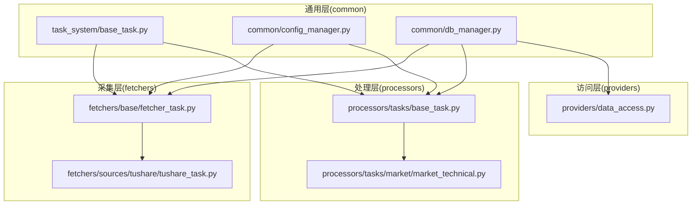
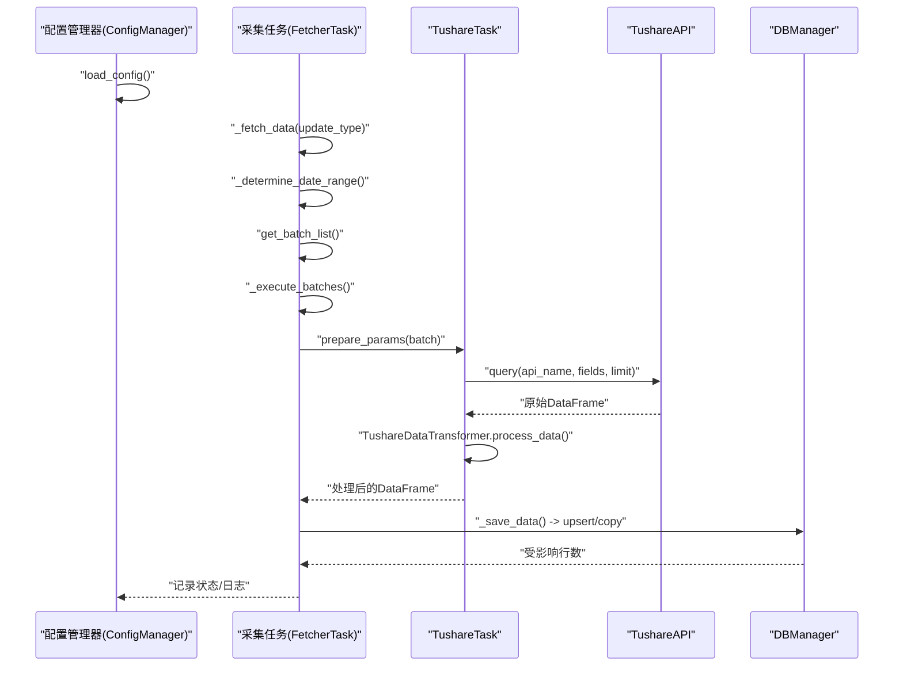
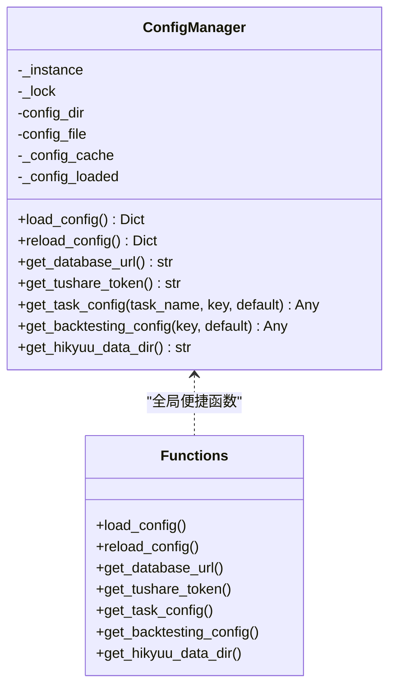
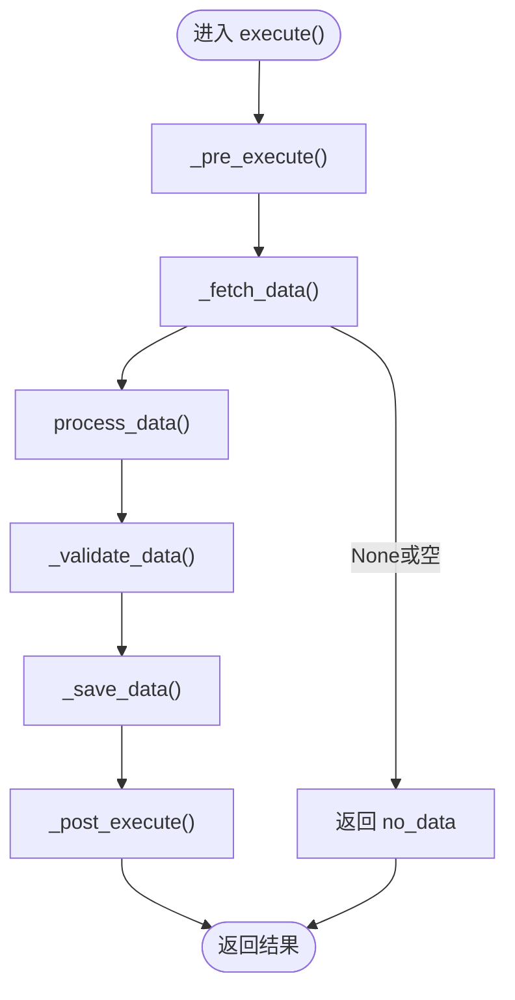
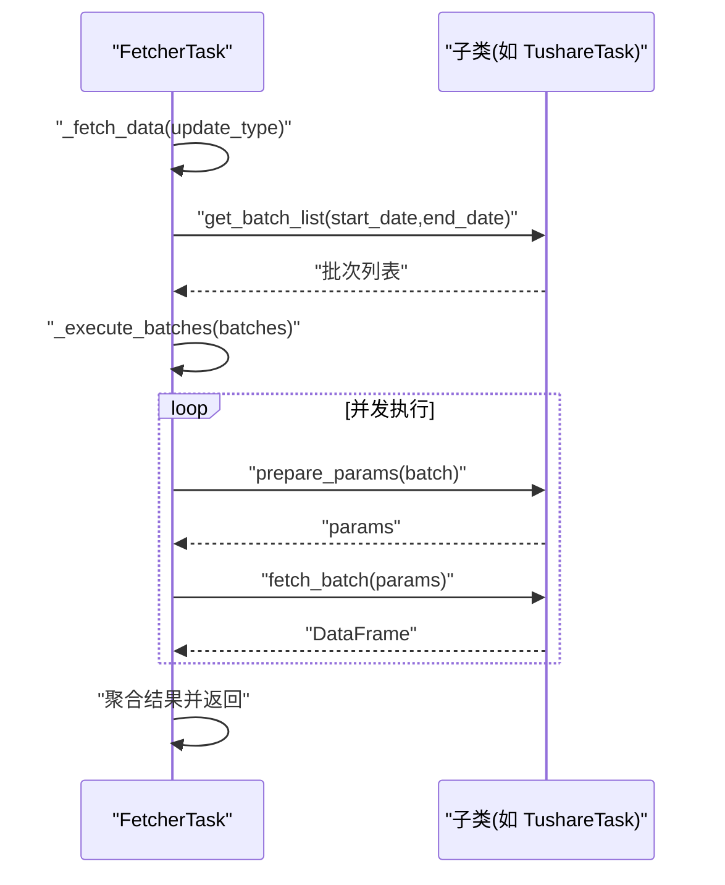
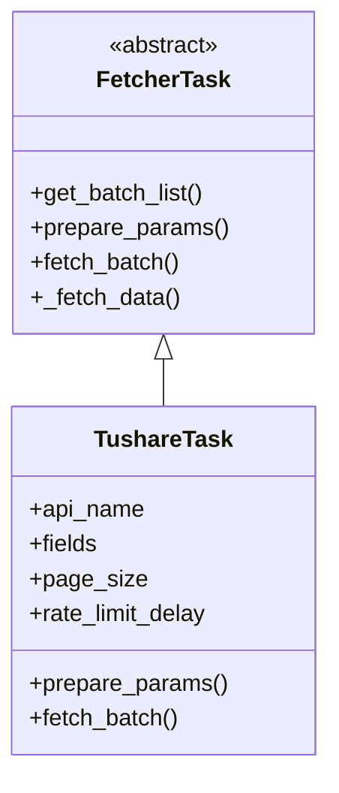
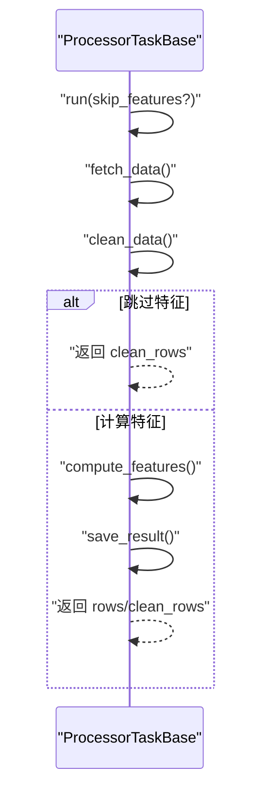
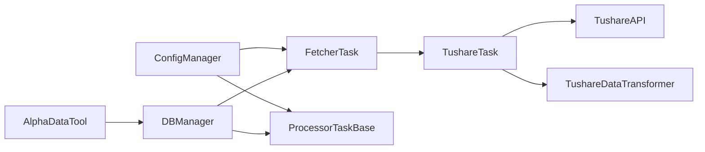

# 开发人员指南

<cite>
**本文引用的文件**
- [alphahome/common/config_manager.py](file://alphahome/common/config_manager.py)
- [alphahome/common/task_system/base_task.py](file://alphahome/common/task_system/base_task.py)
- [alphahome/fetchers/base/fetcher_task.py](file://alphahome/fetchers/base/fetcher_task.py)
- [alphahome/fetchers/sources/tushare/tushare_task.py](file://alphahome/fetchers/sources/tushare/tushare_task.py)
- [alphahome/processors/tasks/base_task.py](file://alphahome/processors/tasks/base_task.py)
- [alphahome/processors/tasks/market/market_technical.py](file://alphahome/processors/tasks/market/market_technical.py)
- [alphahome/providers/data_access.py](file://alphahome/providers/data_access.py)
- [alphahome/common/db_manager.py](file://alphahome/common/db_manager.py)
- [pyproject.toml](file://pyproject.toml)
- [pytest.ini](file://pytest.ini)
- [docs/development/contributing.md](file://docs/development/contributing.md)
- [docs/new_task_development_guide.md](file://docs/new_task_development_guide.md)
</cite>

## 目录
1. [简介](#简介)
2. [项目结构](#项目结构)
3. [核心组件](#核心组件)
4. [架构总览](#架构总览)
5. [详细组件分析](#详细组件分析)
6. [依赖关系分析](#依赖关系分析)
7. [性能考量](#性能考量)
8. [故障排查指南](#故障排查指南)
9. [结论](#结论)
10. [附录](#附录)

## 简介
本指南面向贡献者，帮助你理解并扩展 AlphaHome 的数据采集与处理体系。内容涵盖：
- 开发环境搭建与工具链（依赖管理、代码格式化 black/isort、类型检查 mypy）
- 如何添加新的数据源（继承 FetcherTask）
- 如何开发新的数据处理任务（在 processors/tasks 下新增）
- 如何扩展数据访问接口（providers/data_access.py）
- 配置管理器的单例模式与配置加载机制
- 代码贡献流程、测试策略（pytest）与代码审查标准

## 项目结构
项目采用分层架构，围绕“任务系统”组织代码：
- common：通用基础设施（任务基类、配置管理、数据库管理、计划器等）
- fetchers：数据采集层（基于不同数据源的采集任务）
- processors：数据处理层（清洗、特征工程、物化视图等）
- providers：对外数据访问接口（简化查询）
- gui：图形界面服务与控制器
- scripts：生产脚本与工具
- tests：单元与集成测试

图表来源
- [alphahome/common/task_system/base_task.py](file://alphahome/common/task_system/base_task.py#L1-L120)
- [alphahome/common/config_manager.py](file://alphahome/common/config_manager.py#L1-L120)
- [alphahome/common/db_manager.py](file://alphahome/common/db_manager.py#L1-L120)
- [alphahome/fetchers/base/fetcher_task.py](file://alphahome/fetchers/base/fetcher_task.py#L1-L120)
- [alphahome/fetchers/sources/tushare/tushare_task.py](file://alphahome/fetchers/sources/tushare/tushare_task.py#L1-L120)
- [alphahome/processors/tasks/base_task.py](file://alphahome/processors/tasks/base_task.py#L1-L120)
- [alphahome/processors/tasks/market/market_technical.py](file://alphahome/processors/tasks/market/market_technical.py#L1-L120)
- [alphahome/providers/data_access.py](file://alphahome/providers/data_access.py#L1-L120)

章节来源
- [pyproject.toml](file://pyproject.toml#L1-L120)

## 核心组件
- 任务基类与生命周期：统一的执行流程（获取数据 → 处理 → 验证 → 保存），支持 fetch 与 processor 两类任务。
- 配置管理器：单例模式，支持配置文件与环境变量回退、缓存与迁移。
- 数据库管理器：整合架构，支持 async/sync 模式，提供 upsert、copy 等能力。
- 数据访问接口：提供股票行情、指数权重、复权因子、交易日历、行业分类等常用查询。
- 批处理与增量更新：采集任务内置智能增量策略与并发控制。

章节来源
- [alphahome/common/task_system/base_task.py](file://alphahome/common/task_system/base_task.py#L1-L260)
- [alphahome/common/config_manager.py](file://alphahome/common/config_manager.py#L1-L120)
- [alphahome/common/db_manager.py](file://alphahome/common/db_manager.py#L1-L120)
- [alphahome/providers/data_access.py](file://alphahome/providers/data_access.py#L1-L120)

## 架构总览
下面的时序图展示了典型采集任务的执行流程，从配置加载到数据入库的关键步骤。

图表来源
- [alphahome/common/config_manager.py](file://alphahome/common/config_manager.py#L45-L120)
- [alphahome/fetchers/base/fetcher_task.py](file://alphahome/fetchers/base/fetcher_task.py#L211-L315)
- [alphahome/fetchers/sources/tushare/tushare_task.py](file://alphahome/fetchers/sources/tushare/tushare_task.py#L98-L169)
- [alphahome/common/db_manager.py](file://alphahome/common/db_manager.py#L1-L120)

## 详细组件分析

### 配置管理器（单例模式与配置加载）
- 单例模式：通过类变量与线程锁确保全局唯一实例，避免重复初始化。
- 配置来源优先级：配置文件 → 环境变量 → 默认值；支持缓存与重新加载。
- 迁移逻辑：自动从旧路径迁移配置文件，兼容历史用户目录。
- 便捷函数：提供 load_config、get_database_url、get_tushare_token、get_task_config、get_backtesting_config 等。

图表来源
- [alphahome/common/config_manager.py](file://alphahome/common/config_manager.py#L1-L265)

章节来源
- [alphahome/common/config_manager.py](file://alphahome/common/config_manager.py#L1-L265)

### 任务系统（BaseTask 生命周期）
- 统一的执行模板方法：_fetch_data → process_data → _validate_data → _save_data。
- 支持 fetch 与 processor 两类任务，后者通过 ProcessorTaskBase 实现。
- 数据验证：支持 report/filter 模式，可对 DataFrame 或非 DataFrame 数据进行验证。
- 保存策略：支持 UPSERT（基于主键）与 INSERT 模式；自动去重与空值过滤。
- 增量更新：通过 get_latest_date_for_task 与 _determine_date_range 实现智能增量。

图表来源
- [alphahome/common/task_system/base_task.py](file://alphahome/common/task_system/base_task.py#L138-L239)
- [alphahome/common/task_system/base_task.py](file://alphahome/common/task_system/base_task.py#L374-L554)
- [alphahome/common/task_system/base_task.py](file://alphahome/common/task_system/base_task.py#L555-L784)

章节来源
- [alphahome/common/task_system/base_task.py](file://alphahome/common/task_system/base_task.py#L1-L825)

### 采集任务基类（FetcherTask）
- 支持三种更新类型：MANUAL、SMART、FULL；智能增量通过 _determine_date_range 计算日期范围。
- 批处理：_execute_batches 使用信号量控制并发，支持重试与进度条。
- 数据获取：子类需实现 get_batch_list、prepare_params、fetch_batch。
- 通用配置：concurrent_limit、max_retries、retry_delay、save_batch_size、smart_lookback_days 等。

图表来源
- [alphahome/fetchers/base/fetcher_task.py](file://alphahome/fetchers/base/fetcher_task.py#L118-L210)
- [alphahome/fetchers/base/fetcher_task.py](file://alphahome/fetchers/base/fetcher_task.py#L211-L315)

章节来源
- [alphahome/fetchers/base/fetcher_task.py](file://alphahome/fetchers/base/fetcher_task.py#L1-L315)

### Tushare 采集任务（TushareTask）
- 统一封装 Tushare API 调用与数据转换，子类只需定义 api_name 与 fields。
- 支持 page_size 与速率限制延迟配置；默认使用 TUSHARE_TOKEN 环境变量。
- fetch_batch 中调用 TushareAPI.query 并经由 TushareDataTransformer.process_data 标准化。

图表来源
- [alphahome/fetchers/base/fetcher_task.py](file://alphahome/fetchers/base/fetcher_task.py#L1-L120)
- [alphahome/fetchers/sources/tushare/tushare_task.py](file://alphahome/fetchers/sources/tushare/tushare_task.py#L1-L184)

章节来源
- [alphahome/fetchers/sources/tushare/tushare_task.py](file://alphahome/fetchers/sources/tushare/tushare_task.py#L1-L184)

### 处理任务基类（ProcessorTaskBase）
- 任务层负责 fetch → clean → feature → save 的完整流程。
- 提供 clean_data（校验、对齐、标准化、血缘追踪）、compute_features、save_result 等扩展点。
- 支持 skip_features 控制是否跳过特征计算；支持 feature_dependencies 校验。

图表来源
- [alphahome/processors/tasks/base_task.py](file://alphahome/processors/tasks/base_task.py#L1-L120)
- [alphahome/processors/tasks/base_task.py](file://alphahome/processors/tasks/base_task.py#L494-L621)

章节来源
- [alphahome/processors/tasks/base_task.py](file://alphahome/processors/tasks/base_task.py#L1-L686)

### 示例：市场技术特征任务（MarketTechnicalTask）
- 从 tushare_stock_factor_pro 源表计算横截面技术特征，再进行滚动标准化与百分位计算。
- 通过 save_result 将结果 upsert 到目标表。

章节来源
- [alphahome/processors/tasks/market/market_technical.py](file://alphahome/processors/tasks/market/market_technical.py#L1-L384)

### 数据访问接口（AlphaDataTool）
- 提供 get_stock_data、get_index_weights、get_adj_factor_data、get_stock_info、get_trade_dates、get_industry_data 等常用查询。
- 支持自定义 SQL 与直接获取 DBManager 实例。
- 内置表名智能检测与 Hikyuu 标准化输出。

章节来源
- [alphahome/providers/data_access.py](file://alphahome/providers/data_access.py#L1-L629)

## 依赖关系分析
- 任务系统依赖 DBManager 进行数据库操作；FetcherTask/ProcessorTaskBase 通过 db 属性调用。
- 配置管理器为全局单例，任务与访问层均可通过便捷函数获取配置。
- TushareTask 依赖 TushareAPI 与 TushareDataTransformer 完成 API 调用与数据转换。

图表来源
- [alphahome/common/config_manager.py](file://alphahome/common/config_manager.py#L1-L120)
- [alphahome/common/task_system/base_task.py](file://alphahome/common/task_system/base_task.py#L1-L120)
- [alphahome/common/db_manager.py](file://alphahome/common/db_manager.py#L1-L120)
- [alphahome/fetchers/sources/tushare/tushare_task.py](file://alphahome/fetchers/sources/tushare/tushare_task.py#L1-L120)
- [alphahome/providers/data_access.py](file://alphahome/providers/data_access.py#L1-L120)

章节来源
- [alphahome/common/db_manager.py](file://alphahome/common/db_manager.py#L1-L120)
- [alphahome/fetchers/sources/tushare/tushare_task.py](file://alphahome/fetchers/sources/tushare/tushare_task.py#L1-L120)

## 性能考量
- 并发与重试：FetcherTask 使用信号量控制并发，支持指数退避重试，避免 API 限流。
- 批量保存：BaseTask 支持 save_batch_size 分批保存，减少单次写入压力。
- 增量更新：智能增量通过最近日期 + 回溯天数计算，避免全量重跑。
- 数据去重与空值过滤：保存前自动去重与空值过滤，减少脏数据入库。
- 异步与同步：DBManager 支持 async/sync 模式，按场景选择以获得最佳吞吐。

章节来源
- [alphahome/fetchers/base/fetcher_task.py](file://alphahome/fetchers/base/fetcher_task.py#L154-L210)
- [alphahome/common/task_system/base_task.py](file://alphahome/common/task_system/base_task.py#L555-L784)
- [alphahome/common/db_manager.py](file://alphahome/common/db_manager.py#L1-L120)

## 故障排查指南
- 配置问题
  - 确认配置文件路径与权限，必要时使用 reload_config() 刷新缓存。
  - 检查环境变量 DATABASE_URL、TUSHARE_TOKEN、HIKYUU_DATA_DIR 是否正确设置。
- 采集任务失败
  - 查看 _execute_batches 的重试日志，定位网络/限流/参数错误。
  - 检查 get_batch_list 生成的批次是否为空或参数非法。
- 处理任务失败
  - clean_data 阶段的 ValidationError/AlignmentError 会中断流程，检查数据校验与对齐配置。
  - compute_features 依赖的 transforms 函数需在 transforms 模块中存在。
- 数据保存失败
  - 检查主键定义与 primary_keys 是否匹配；UPSERT 冲突列与更新列是否正确。
  - 关注 NaN/inf 值处理与列类型转换。

章节来源
- [alphahome/common/config_manager.py](file://alphahome/common/config_manager.py#L45-L120)
- [alphahome/fetchers/base/fetcher_task.py](file://alphahome/fetchers/base/fetcher_task.py#L154-L210)
- [alphahome/processors/tasks/base_task.py](file://alphahome/processors/tasks/base_task.py#L494-L621)
- [alphahome/common/task_system/base_task.py](file://alphahome/common/task_system/base_task.py#L555-L784)

## 结论
通过统一的任务基类、完善的配置与数据库管理、以及清晰的采集/处理分层，AlphaHome 提供了可扩展、可维护的数据管线。贡献者可按本文指引快速添加新数据源与处理任务，并遵循测试与代码审查标准，确保质量与一致性。

## 附录

### 开发环境搭建与工具链
- 依赖管理
  - 使用 pyproject.toml 管理依赖与可选依赖；安装命令参考贡献指南。
- 代码格式化与导入排序
  - black：统一代码风格，行宽 88。
  - isort：按 profile=black 排序导入，保持一致性。
- 类型检查
  - mypy：启用严格选项，忽略第三方库缺失类型标注的影响。
- 测试运行
  - pytest：按 pytest.ini 配置运行，支持标记（unit/integration/e2e/slow/requires_db/requires_api）。

章节来源
- [pyproject.toml](file://pyproject.toml#L55-L154)
- [pytest.ini](file://pytest.ini#L1-L19)
- [docs/development/contributing.md](file://docs/development/contributing.md#L70-L120)

### 如何添加新的数据源（继承 FetcherTask）
- 选择基类
  - 若对接 Tushare：继承 TushareTask，定义 api_name 与 fields。
  - 若对接其他 API：继承 FetcherTask，实现 get_batch_list、prepare_params、fetch_batch。
- 批处理策略
  - 参考新任务开发指南，选择 SmartBatchMixin、ExtendedBatchPlanner 或自定义策略。
- 配置与并发
  - 在任务配置中设置 concurrent_limit、max_retries、retry_delay、page_size 等。
- 增量更新
  - 使用 SMART 模式与 _determine_date_range，结合 get_latest_date_for_task 实现智能增量。

章节来源
- [docs/new_task_development_guide.md](file://docs/new_task_development_guide.md#L1-L120)
- [alphahome/fetchers/base/fetcher_task.py](file://alphahome/fetchers/base/fetcher_task.py#L118-L210)
- [alphahome/fetchers/sources/tushare/tushare_task.py](file://alphahome/fetchers/sources/tushare/tushare_task.py#L98-L169)

### 如何开发新的数据处理任务（processors/tasks/）
- 选择基类
  - 处理器任务：继承 ProcessorTaskBase，实现 fetch_data、process_data、save_result。
- 数据清洗与特征
  - 使用 clean_data 的校验、对齐、标准化与血缘追踪；通过 feature_dependencies 声明依赖。
- 保存策略
  - 通过 save_result 将结果 upsert 到目标表；注意主键与列映射。

章节来源
- [alphahome/processors/tasks/base_task.py](file://alphahome/processors/tasks/base_task.py#L1-L120)
- [alphahome/processors/tasks/market/market_technical.py](file://alphahome/processors/tasks/market/market_technical.py#L1-L120)

### 如何扩展数据访问接口（providers/data_access.py）
- 新增查询方法
  - 在 AlphaDataTool 中添加同步方法，使用 db_manager.fetch_sync 执行 SQL。
- 表名智能检测
  - 使用 _get_stock_table/_get_index_table 等方法检测可用表，避免硬编码。
- 向后兼容
  - 保持方法签名与返回结构一致，必要时提供自定义查询与原始 DBManager 访问。

章节来源
- [alphahome/providers/data_access.py](file://alphahome/providers/data_access.py#L1-L200)

### 配置管理器单例模式与加载机制
- 单例实现要点
  - __new__ 中双重检查与锁，确保线程安全；首次初始化后复用实例。
- 加载流程
  - 优先读取配置文件，UTF-8 失败回退 GBK；随后从环境变量补全；最后缓存。
- 便捷函数
  - 提供 load_config、get_database_url、get_tushare_token、get_task_config、get_backtesting_config 等。

章节来源
- [alphahome/common/config_manager.py](file://alphahome/common/config_manager.py#L1-L120)

### 代码贡献流程、测试策略与代码审查标准
- 贡献流程
  - Fork → 同步上游 → 新建分支 → 开发 → 测试与静态检查 → 提交 → PR。
- 测试策略
  - pytest 标记：unit、integration、e2e、slow、requires_db、requires_api。
  - 建议使用 TDD：先写测试，再实现功能，最后重构。
- 代码审查
  - 审查清单覆盖功能性、代码质量、测试、性能与安全性。

章节来源
- [docs/development/contributing.md](file://docs/development/contributing.md#L1-L120)
- [pytest.ini](file://pytest.ini#L1-L19)