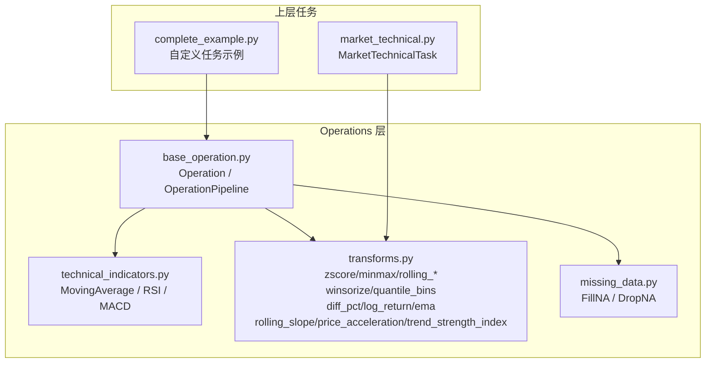
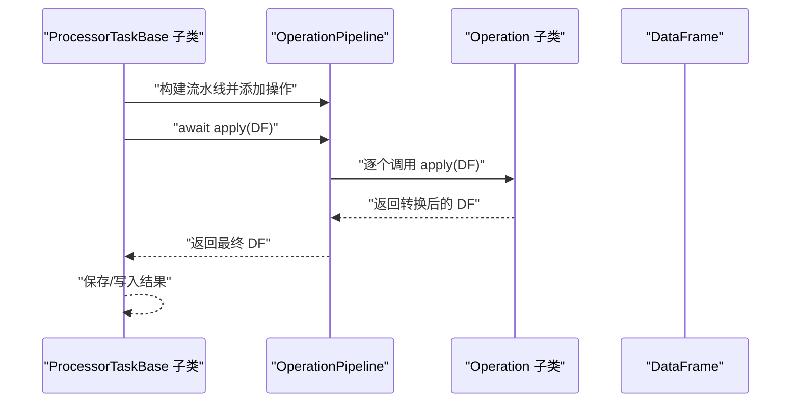
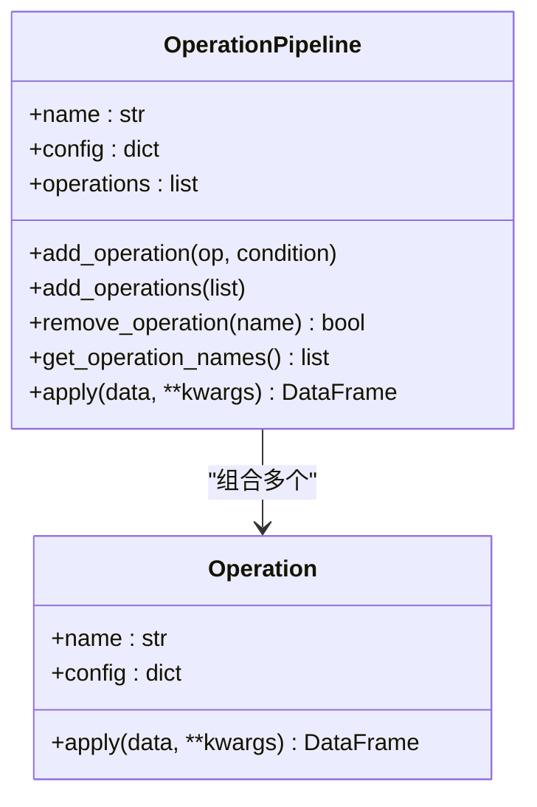
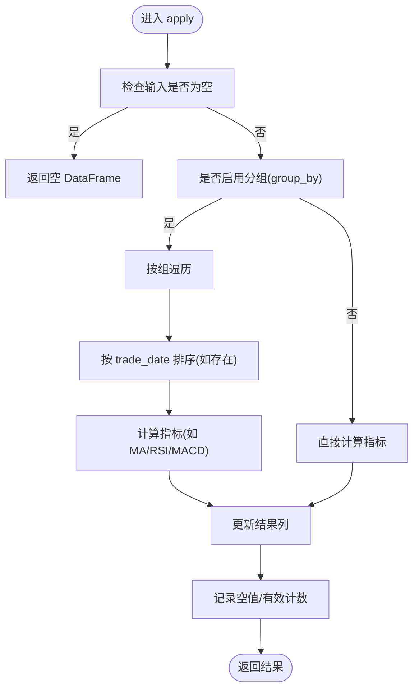
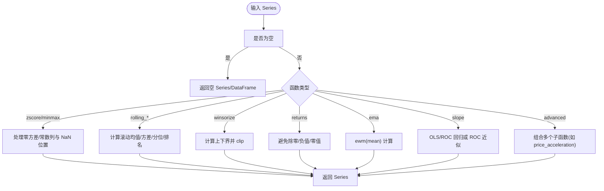
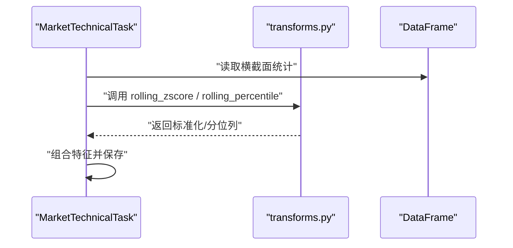
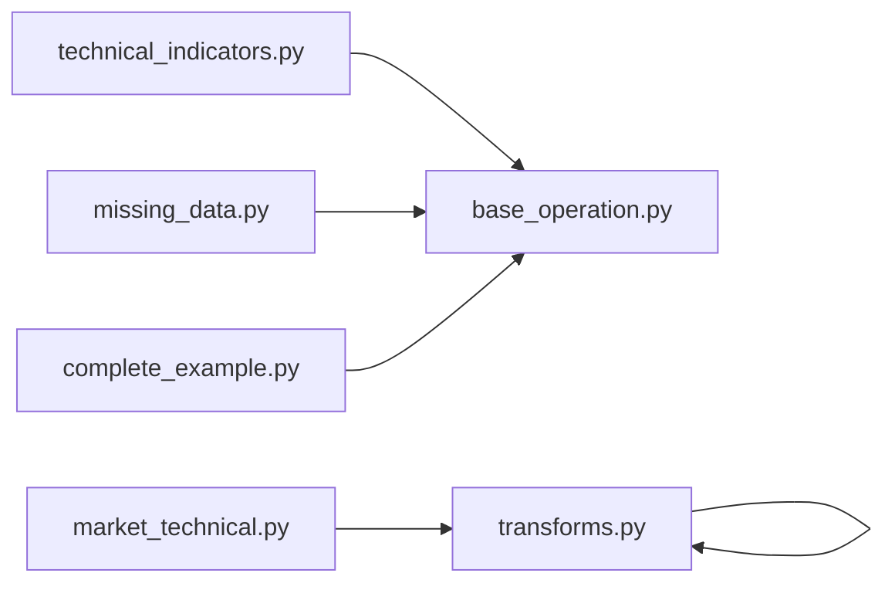

# 原子操作 (Operations)

<cite>
**本文引用的文件**
- [base_operation.py](file://alphahome/processors/operations/base_operation.py)
- [technical_indicators.py](file://alphahome/processors/operations/technical_indicators.py)
- [transforms.py](file://alphahome/processors/operations/transforms.py)
- [missing_data.py](file://alphahome/processors/operations/missing_data.py)
- [test_operation_pipeline.py](file://alphahome/processors/tests/test_operation_pipeline.py)
- [test_transforms_properties.py](file://alphahome/processors/tests/test_transforms_properties.py)
- [market_technical.py](file://alphahome/processors/tasks/market/market_technical.py)
- [complete_example.py](file://alphahome/processors/examples/complete_example.py)
</cite>

## 目录
1. [简介](#简介)
2. [项目结构](#项目结构)
3. [核心组件](#核心组件)
4. [架构总览](#架构总览)
5. [详细组件分析](#详细组件分析)
6. [依赖关系分析](#依赖关系分析)
7. [性能考量](#性能考量)
8. [故障排查指南](#故障排查指南)
9. [结论](#结论)
10. [附录](#附录)

## 简介
Operations 层是数据处理流水线的“原子操作”集合，定位为无状态、可复用、可组合的纯数据转换函数。它向上游任务提供稳定的特征计算能力，向下屏蔽底层数据源差异，确保特征计算逻辑的纯净性与可维护性。本章节重点阐述：
- 技术指标计算（移动平均、RSI、MACD）在 Operations 中的实现与使用
- 通用数据变换函数（标准化、去极值、滚动统计、收益率、斜率等）的设计与契约
- 基类 Operation 与 OperationPipeline 如何保证幂等性与可组合性
- Processor Tasks 如何调用这些操作构建复杂的数据处理流水线
- 如何通过测试与契约约束保障特征层的稳定性

## 项目结构
Operations 模块位于 processors/operations 下，包含：
- 基类与流水线：base_operation.py
- 技术指标：technical_indicators.py
- 通用变换：transforms.py
- 缺失值处理：missing_data.py
- 测试与示例：test_operation_pipeline.py、test_transforms_properties.py、market_technical.py、complete_example.py

图表来源
- [base_operation.py](file://alphahome/processors/operations/base_operation.py#L1-L212)
- [technical_indicators.py](file://alphahome/processors/operations/technical_indicators.py#L1-L361)
- [transforms.py](file://alphahome/processors/operations/transforms.py#L1-L830)
- [missing_data.py](file://alphahome/processors/operations/missing_data.py#L1-L247)
- [market_technical.py](file://alphahome/processors/tasks/market/market_technical.py#L1-L384)
- [complete_example.py](file://alphahome/processors/examples/complete_example.py#L1-L221)

章节来源
- [base_operation.py](file://alphahome/processors/operations/base_operation.py#L1-L212)
- [technical_indicators.py](file://alphahome/processors/operations/technical_indicators.py#L1-L361)
- [transforms.py](file://alphahome/processors/operations/transforms.py#L1-L830)
- [missing_data.py](file://alphahome/processors/operations/missing_data.py#L1-L247)
- [market_technical.py](file://alphahome/processors/tasks/market/market_technical.py#L1-L384)
- [complete_example.py](file://alphahome/processors/examples/complete_example.py#L1-L221)

## 核心组件
- Operation 基类：定义统一的异步 apply 接口，确保所有操作无状态、可复用、可组合。
- OperationPipeline：可选的流水线工具，支持顺序执行、条件执行、错误处理策略。
- 技术指标操作：MovingAverageOperation、RSIOperation、MACDOperation，提供移动平均、RSI、MACD 的计算。
- 通用变换函数：zscore、minmax_scale、rolling_zscore、rolling_percentile、winsorize、quantile_bins、diff_pct、log_return、ema、rolling_slope、price_acceleration、trend_strength_index 等。
- 缺失值处理：FillNAOperation、DropNAOperation，提供多种填充与删除策略。

章节来源
- [base_operation.py](file://alphahome/processors/operations/base_operation.py#L1-L212)
- [technical_indicators.py](file://alphahome/processors/operations/technical_indicators.py#L1-L361)
- [transforms.py](file://alphahome/processors/operations/transforms.py#L1-L830)
- [missing_data.py](file://alphahome/processors/operations/missing_data.py#L1-L247)

## 架构总览
Operations 作为“纯函数式”的数据转换层，向上提供稳定的特征计算能力；向下通过 Task 层编排，形成可扩展的流水线。典型调用链路如下：

图表来源
- [base_operation.py](file://alphahome/processors/operations/base_operation.py#L61-L212)
- [complete_example.py](file://alphahome/processors/examples/complete_example.py#L70-L118)

## 详细组件分析

### 基类与流水线：幂等性与可组合性
- 幂等性：Operation.apply 是纯函数式接口，不保存跨次调用状态；输入为空或 None 时返回空 DataFrame，避免副作用。
- 可组合性：OperationPipeline 支持顺序添加、条件执行、批量添加、移除操作；提供 stop_on_error 控制错误传播。
- 防御性：对返回值进行类型校验，若操作返回 None 或非 DataFrame，按配置选择抛错或返回空 DataFrame，保证流水线稳定。

图表来源
- [base_operation.py](file://alphahome/processors/operations/base_operation.py#L19-L212)

章节来源
- [base_operation.py](file://alphahome/processors/operations/base_operation.py#L19-L212)
- [test_operation_pipeline.py](file://alphahome/processors/tests/test_operation_pipeline.py#L1-L47)

### 技术指标：MovingAverage / RSI / MACD
- MovingAverageOperation：支持按组（group_by）滚动计算 SMA，支持 min_periods、center 等参数，自动记录空值与有效计数。
- RSIOperation：按组计算 RSI，先按时间排序再计算，避免时序错乱导致的偏差。
- MACDOperation：计算 EMA 快线、慢线、信号线与柱状图，支持按组与时间排序。

图表来源
- [technical_indicators.py](file://alphahome/processors/operations/technical_indicators.py#L18-L361)

章节来源
- [technical_indicators.py](file://alphahome/processors/operations/technical_indicators.py#L18-L361)

### 通用变换：标准化、滚动统计、去极值、收益与斜率
- 标准化：zscore、minmax_scale，处理零方差/常数列与 NaN 位置，返回安全结果。
- 滚动统计：rolling_zscore、rolling_percentile、rolling_sum、rolling_rank，遵循 min_periods 契约，早期窗口保持 NaN。
- 去极值与分箱：winsorize（滚动截断）、quantile_bins（分位数边界分箱）。
- 收益率：diff_pct（百分比变化）、log_return（对数收益率，避免除零与 inf）。
- 指数平滑：ema（EMA 计算，adjust=False）。
- 斜率与趋势：rolling_slope（OLS/ROC 两种方法）、price_acceleration（加速度与波动率调整斜率）、trend_strength_index（多周期趋势强度与一致性）。

图表来源
- [transforms.py](file://alphahome/processors/operations/transforms.py#L1-L830)

章节来源
- [transforms.py](file://alphahome/processors/operations/transforms.py#L1-L830)
- [test_transforms_properties.py](file://alphahome/processors/tests/test_transforms_properties.py#L1-L772)

### 缺失值处理：FillNA / DropNA
- FillNAOperation：支持 value、mean、median、mode、ffill、bfill、interpolate 等策略，支持按组与 limit 控制。
- DropNAOperation：支持按轴删除、how/all、subset 与 thresh 阈值。

章节来源
- [missing_data.py](file://alphahome/processors/operations/missing_data.py#L1-L247)

### 上层任务如何调用 Operations
- MarketTechnicalTask：在 process_data 中直接调用 transforms 模块函数（如 rolling_zscore、rolling_percentile）进行衍生特征计算。
- 自定义任务示例：complete_example.py 展示了通过 OperationPipeline 组合 DataCleaningOperation 与 FeatureEngineeringOperation 的方式。

图表来源
- [market_technical.py](file://alphahome/processors/tasks/market/market_technical.py#L229-L330)
- [transforms.py](file://alphahome/processors/operations/transforms.py#L1-L830)

章节来源
- [market_technical.py](file://alphahome/processors/tasks/market/market_technical.py#L1-L384)
- [complete_example.py](file://alphahome/processors/examples/complete_example.py#L70-L118)

## 依赖关系分析
- 技术指标依赖基类 Operation，通过 apply 统一接口接入流水线。
- 通用变换函数为纯函数，不依赖基类，但可被 Task 与 Pipeline 直接使用。
- 缺失值处理同样依赖基类，便于统一的日志与错误处理。
- 测试文件覆盖了流水线的防御性行为与变换函数的契约属性（如零方差、边界值、输出形状等）。

图表来源
- [technical_indicators.py](file://alphahome/processors/operations/technical_indicators.py#L1-L361)
- [transforms.py](file://alphahome/processors/operations/transforms.py#L1-L830)
- [missing_data.py](file://alphahome/processors/operations/missing_data.py#L1-L247)
- [base_operation.py](file://alphahome/processors/operations/base_operation.py#L1-L212)
- [market_technical.py](file://alphahome/processors/tasks/market/market_technical.py#L1-L384)
- [complete_example.py](file://alphahome/processors/examples/complete_example.py#L1-L221)

章节来源
- [test_operation_pipeline.py](file://alphahome/processors/tests/test_operation_pipeline.py#L1-L47)
- [test_transforms_properties.py](file://alphahome/processors/tests/test_transforms_properties.py#L1-L772)

## 性能考量
- 无状态与纯函数：减少内存占用与锁竞争，便于并行与缓存。
- 滚动计算：合理设置 min_periods，避免早期窗口产生伪信号；对常数列与零方差进行快速路径优化。
- 分组计算：在大表场景下优先按主键分组，减少重复计算。
- I/O 与数据库：Task 层负责数据拉取与落库，Operations 仅做纯计算，降低耦合。

## 故障排查指南
- 流水线返回空或报错：检查 stop_on_error 配置；确认操作返回类型为 DataFrame；核对列名与分组列是否存在。
- 变换函数异常：关注零方差、除零、inf/NaN 的边界处理；使用测试用例验证行为。
- 技术指标异常：确认 trade_date 排序、窗口大小与 min_periods 设置；检查 group_by 列是否正确。

章节来源
- [test_operation_pipeline.py](file://alphahome/processors/tests/test_operation_pipeline.py#L1-L47)
- [test_transforms_properties.py](file://alphahome/processors/tests/test_transforms_properties.py#L1-L772)
- [base_operation.py](file://alphahome/processors/operations/base_operation.py#L131-L201)

## 结论
Operations 层通过 Operation 基类与 OperationPipeline，实现了无状态、可复用、可组合的纯数据转换能力。技术指标与通用变换函数遵循严格的契约，确保在边界条件下输出安全、可预测的结果。上层任务通过 Task 层编排这些操作，构建稳健的特征计算流水线，从而保持特征计算逻辑的纯净性与可维护性。

## 附录
- 设计原则与最佳实践
  - 单一职责：每个 Operation 只做一件事
  - 无状态：不保存执行间状态
  - 异步友好：支持 async/await
  - 错误处理：优雅处理异常与空数据
  - 配置驱动：支持灵活配置与分组计算
- 常用模式
  - 使用 OperationPipeline 组合多个操作
  - 在 Task 中直接调用 transforms 函数进行衍生特征计算
  - 对关键列使用分组与时间排序，确保时序与分组一致性