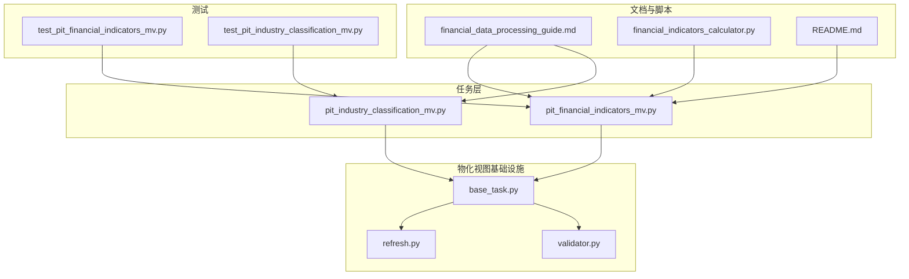
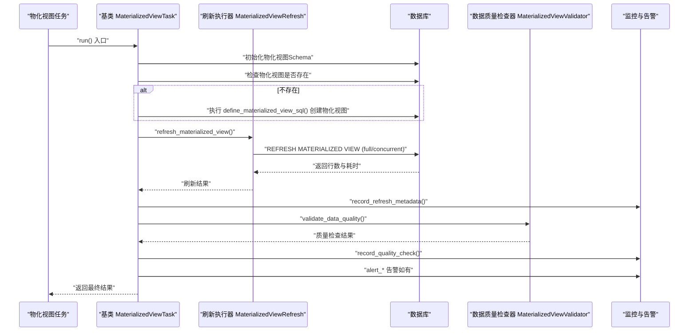
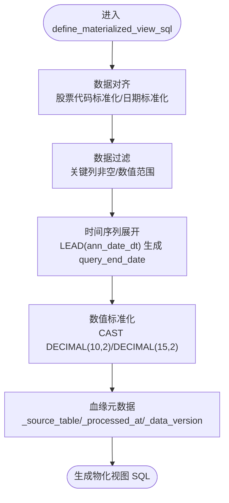
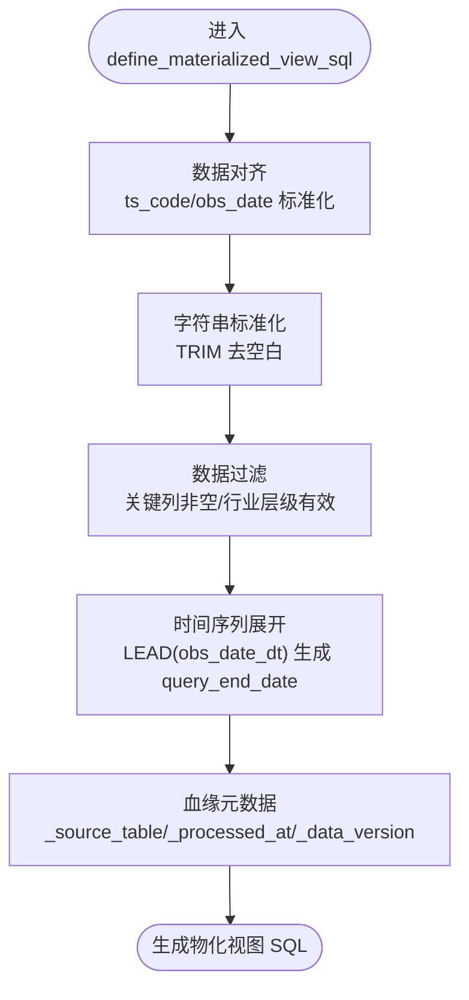
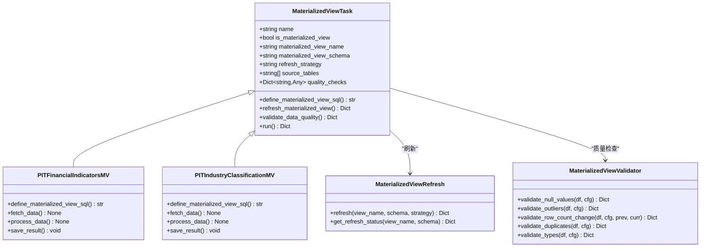
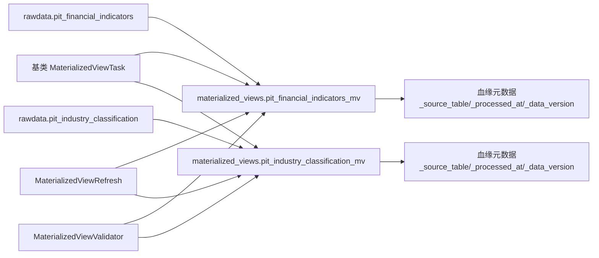

# PIT财务指标处理任务

<cite>
**本文引用的文件**
- [pit_financial_indicators_mv.py](file://alphahome/processors/tasks/pit/pit_financial_indicators_mv.py)
- [pit_industry_classification_mv.py](file://alphahome/processors/tasks/pit/pit_industry_classification_mv.py)
- [base_task.py](file://alphahome/processors/materialized_views/base_task.py)
- [refresh.py](file://alphahome/processors/materialized_views/refresh.py)
- [validator.py](file://alphahome/processors/materialized_views/validator.py)
- [test_pit_financial_indicators_mv.py](file://alphahome/processors/tests/test_materialized_views/test_pit_financial_indicators_mv.py)
- [test_pit_industry_classification_mv.py](file://alphahome/processors/tests/test_materialized_views/test_pit_industry_classification_mv.py)
- [financial_data_processing_guide.md](file://docs/development/financial_data_processing_guide.md)
- [financial_indicators_calculator.py](file://scripts/production/data_updaters/pit/calculators/financial_indicators_calculator.py)
- [README.md](file://archive/research_pit_data_backup/README.md)
</cite>

## 目录
1. [简介](#简介)
2. [项目结构](#项目结构)
3. [核心组件](#核心组件)
4. [架构总览](#架构总览)
5. [详细组件分析](#详细组件分析)
6. [依赖关系分析](#依赖关系分析)
7. [性能与扩展性考虑](#性能与扩展性考虑)
8. [故障排查指南](#故障排查指南)
9. [结论](#结论)
10. [附录](#附录)

## 简介
本文件围绕PIT财务指标处理任务，系统阐述以下内容：
- pit_financial_indicators_mv如何基于raw层财务指标数据（如PE、PB、PS、股息率、总市值等）进行季度化、标准化与时间序列展开，最终生成物化视图；
- pit_industry_classification_mv如何从raw层行业分类数据构建动态行业分类体系，并进行时间序列展开与标准化；
- 两个物化视图任务的依赖关系、数据刷新机制（基于refresh.py）、数据验证流程（通过validator.py）；
- 结合实际应用场景，说明PIT指标在基本面量化策略中的核心作用。

## 项目结构
与PIT财务指标处理直接相关的模块组织如下：
- 任务层：位于 processors/tasks/pit，包含两个物化视图任务类；
- 物化视图基础设施：位于 processors/materialized_views，包含基类、刷新执行器、数据质量检查器、监控与告警等；
- 测试：位于 processors/tests/test_materialized_views，包含针对两个MV的属性与行为测试；
- 文档与脚本：docs/development 提供财务数据处理指南；scripts/production/data_updaters/pit/calculators 提供PIT财务指标计算逻辑参考。

图表来源
- [pit_financial_indicators_mv.py](file://alphahome/processors/tasks/pit/pit_financial_indicators_mv.py#L1-L140)
- [pit_industry_classification_mv.py](file://alphahome/processors/tasks/pit/pit_industry_classification_mv.py#L1-L157)
- [base_task.py](file://alphahome/processors/materialized_views/base_task.py#L1-L377)
- [refresh.py](file://alphahome/processors/materialized_views/refresh.py#L1-L364)
- [validator.py](file://alphahome/processors/materialized_views/validator.py#L1-L513)
- [test_pit_financial_indicators_mv.py](file://alphahome/processors/tests/test_materialized_views/test_pit_financial_indicators_mv.py#L1-L439)
- [test_pit_industry_classification_mv.py](file://alphahome/processors/tests/test_materialized_views/test_pit_industry_classification_mv.py#L1-L442)
- [financial_data_processing_guide.md](file://docs/development/financial_data_processing_guide.md#L466-L527)
- [financial_indicators_calculator.py](file://scripts/production/data_updaters/pit/calculators/financial_indicators_calculator.py#L545-L578)
- [README.md](file://archive/research_pit_data_backup/README.md#L80-L120)

章节来源
- [pit_financial_indicators_mv.py](file://alphahome/processors/tasks/pit/pit_financial_indicators_mv.py#L1-L140)
- [pit_industry_classification_mv.py](file://alphahome/processors/tasks/pit/pit_industry_classification_mv.py#L1-L157)
- [base_task.py](file://alphahome/processors/materialized_views/base_task.py#L1-L377)

## 核心组件
- 物化视图基类：统一定义物化视图SQL、刷新、质量检查、元数据记录与告警流程；
- 刷新执行器：封装 REFRESH MATERIALIZED VIEW 的执行、并发/全量策略、行数统计与状态记录；
- 数据质量检查器：提供缺失值、异常值、行数变化、重复值、类型检查等非破坏性检查；
- 两个具体任务：
  - pit_financial_indicators_mv：面向PE、PB、PS、股息率、总市值等财务比率的季度化与时间序列展开；
  - pit_industry_classification_mv：面向行业分类的标准化与时间序列展开。

章节来源
- [base_task.py](file://alphahome/processors/materialized_views/base_task.py#L17-L115)
- [refresh.py](file://alphahome/processors/materialized_views/refresh.py#L62-L199)
- [validator.py](file://alphahome/processors/materialized_views/validator.py#L24-L115)

## 架构总览
下图展示PIT财务指标物化视图任务的端到端执行链路：任务定义SQL -> 创建/刷新物化视图 -> 记录刷新元数据 -> 质量检查 -> 告警。

图表来源
- [base_task.py](file://alphahome/processors/materialized_views/base_task.py#L198-L327)
- [refresh.py](file://alphahome/processors/materialized_views/refresh.py#L62-L199)
- [validator.py](file://alphahome/processors/materialized_views/validator.py#L24-L115)

## 详细组件分析

### pit_financial_indicators_mv 分析
该任务负责将raw层的财务指标数据转换为季度化、标准化且具备时间序列展开能力的物化视图，便于后续因子计算与回测。

- 数据对齐与标准化
  - 股票代码标准化：根据前缀添加交易所后缀，保证统一格式；
  - 日期标准化：兼容整数YYYYMMDD、字符串与date类型，统一转换为日期；
  - 数值标准化：将PE、PB、PS、股息率、总市值等数值列转换为固定精度的数值类型。
- 时间序列展开（PIT特性）
  - 基于公告日期ann_date_dt进行排序与窗口函数LEAD，生成query_start_date与query_end_date；
  - 无下一公告日期时以固定未来日期作为结束边界，确保查询期内的闭区间覆盖。
- 数据质量控制
  - 关键列NOT NULL约束；
  - 数值范围过滤（如PE、PB的合理范围）；
  - 质量检查配置：缺失值阈值、异常值（IQR）检测、行数变化阈值。
- 输出字段
  - ts_code、query_start_date、query_end_date、end_date；
  - 标准化后的财务比率与市值；
  - 血缘元数据：来源表、处理时间、数据版本。

图表来源
- [pit_financial_indicators_mv.py](file://alphahome/processors/tasks/pit/pit_financial_indicators_mv.py#L58-L131)

章节来源
- [pit_financial_indicators_mv.py](file://alphahome/processors/tasks/pit/pit_financial_indicators_mv.py#L1-L140)
- [test_pit_financial_indicators_mv.py](file://alphahome/processors/tests/test_materialized_views/test_pit_financial_indicators_mv.py#L70-L184)
- [test_pit_financial_indicators_mv.py](file://alphahome/processors/tests/test_materialized_views/test_pit_financial_indicators_mv.py#L236-L374)

### pit_industry_classification_mv 分析
该任务负责将raw层的行业分类数据标准化并进行时间序列展开，形成动态行业分类体系。

- 数据对齐与标准化
  - 股票代码标准化；
  - 观察日期标准化；
  - 行业分类字段与数据源字段去空白、统一大小写；
  - 特殊处理标识与数据质量标识保留。
- 时间序列展开（PIT特性）
  - 基于obs_date_dt与数据源进行分区排序，使用LEAD生成query_end_date；
  - 无下一观察日期时以固定未来日期作为结束边界。
- 数据质量控制
  - 关键列NOT NULL约束；
  - 行业层级字段非空且非空字符串；
  - 质量检查配置：缺失值阈值、行数变化阈值（异常值在此任务中禁用）。
- 输出字段
  - ts_code、query_start_date、query_end_date、obs_date；
  - 行业分类层级与编码、数据源；
  - 特殊处理标识与数据质量标识；
  - 血缘元数据。

图表来源
- [pit_industry_classification_mv.py](file://alphahome/processors/tasks/pit/pit_industry_classification_mv.py#L58-L148)

章节来源
- [pit_industry_classification_mv.py](file://alphahome/processors/tasks/pit/pit_industry_classification_mv.py#L1-L157)
- [test_pit_industry_classification_mv.py](file://alphahome/processors/tests/test_materialized_views/test_pit_industry_classification_mv.py#L66-L206)
- [test_pit_industry_classification_mv.py](file://alphahome/processors/tests/test_materialized_views/test_pit_industry_classification_mv.py#L229-L369)

### 依赖关系与控制流
- 任务类继承自基类，复用统一的运行流程：创建/刷新物化视图、记录元数据、执行质量检查、触发告警；
- 刷新执行器负责安全执行 REFRESH 命令，支持并发刷新回退到全量刷新；
- 数据质量检查器提供多维检查，不修改数据，仅暴露问题；
- 测试用例覆盖属性、SQL片段、时间序列展开正确性与对齐一致性。

图表来源
- [base_task.py](file://alphahome/processors/materialized_views/base_task.py#L17-L115)
- [pit_financial_indicators_mv.py](file://alphahome/processors/tasks/pit/pit_financial_indicators_mv.py#L21-L140)
- [pit_industry_classification_mv.py](file://alphahome/processors/tasks/pit/pit_industry_classification_mv.py#L21-L157)
- [refresh.py](file://alphahome/processors/materialized_views/refresh.py#L62-L199)
- [validator.py](file://alphahome/processors/materialized_views/validator.py#L24-L115)

章节来源
- [base_task.py](file://alphahome/processors/materialized_views/base_task.py#L83-L197)
- [refresh.py](file://alphahome/processors/materialized_views/refresh.py#L62-L199)
- [validator.py](file://alphahome/processors/materialized_views/validator.py#L116-L293)

## 依赖关系分析
- 任务与基础设施
  - 两个任务均依赖基类提供的统一生命周期：创建物化视图、刷新、质量检查、记录与告警；
  - 刷新执行器与质量检查器通过组合方式注入，职责清晰、耦合度低；
- 数据来源与输出
  - 两个任务均从rawdata模式下的对应表读取，输出至materialized_views模式；
  - 通过血缘元数据保留来源表、处理时间与数据版本，便于追踪与审计；
- 测试与验证
  - 单元测试覆盖属性、SQL片段、时间序列展开正确性与对齐一致性；
  - 属性测试（Hypothesis）验证对不同输入格式的鲁棒性。

图表来源
- [pit_financial_indicators_mv.py](file://alphahome/processors/tasks/pit/pit_financial_indicators_mv.py#L33-L48)
- [pit_industry_classification_mv.py](file://alphahome/processors/tasks/pit/pit_industry_classification_mv.py#L33-L48)
- [base_task.py](file://alphahome/processors/materialized_views/base_task.py#L198-L327)
- [refresh.py](file://alphahome/processors/materialized_views/refresh.py#L62-L199)
- [validator.py](file://alphahome/processors/materialized_views/validator.py#L24-L115)

章节来源
- [pit_financial_indicators_mv.py](file://alphahome/processors/tasks/pit/pit_financial_indicators_mv.py#L1-L140)
- [pit_industry_classification_mv.py](file://alphahome/processors/tasks/pit/pit_industry_classification_mv.py#L1-L157)
- [base_task.py](file://alphahome/processors/materialized_views/base_task.py#L198-L327)

## 性能与扩展性考虑
- 刷新策略
  - 默认采用全量刷新（full），在并发刷新失败时自动回退到全量刷新，确保一致性；
  - 对于大规模数据，建议在维护窗口执行全量刷新，避免影响在线查询；
- 行数统计与状态缓存
  - 刷新完成后统计行数并记录状态，便于监控与告警；
- 质量检查采样
  - 质量检查对物化视图进行有限采样，避免全表扫描带来的开销；
- SQL层面优化
  - 在物化视图SQL中提前完成数据对齐、标准化与过滤，减少下游查询成本；
  - 时间序列展开使用窗口函数，避免复杂JOIN与多次扫描。

章节来源
- [refresh.py](file://alphahome/processors/materialized_views/refresh.py#L286-L308)
- [base_task.py](file://alphahome/processors/materialized_views/base_task.py#L146-L197)

## 故障排查指南
- 刷新失败
  - 检查物化视图是否存在、数据库连接可用、刷新策略是否合法；
  - 若并发刷新失败，系统会自动回退到全量刷新；若仍失败，查看错误信息并重试；
- 质量检查告警
  - 缺失值过多、异常值较多、行数大幅波动、重复主键、类型不符等；
  - 根据告警详情定位问题列与阈值，必要时调整数据源或修正数据；
- 常见问题定位
  - SQL片段缺失：确认时间序列展开、对齐与标准化逻辑是否存在于SQL；
  - 血缘元数据缺失：确认SQL中是否包含来源表、处理时间与数据版本字段；
  - 行数变化异常：对比上一次刷新的行数，评估是否为预期变更。

章节来源
- [refresh.py](file://alphahome/processors/materialized_views/refresh.py#L111-L199)
- [validator.py](file://alphahome/processors/materialized_views/validator.py#L116-L293)
- [base_task.py](file://alphahome/processors/materialized_views/base_task.py#L228-L327)

## 结论
- pit_financial_indicators_mv与pit_industry_classification_mv通过标准化、时间序列展开与质量检查，将raw层数据转化为高质量、可追溯、可维护的物化视图；
- 基于统一的刷新与验证框架，任务具备良好的可观测性与可维护性；
- 在基本面量化策略中，这两个物化视图为因子计算与回测提供了稳定、一致的数据基础。

## 附录

### PIT财务比率与因子应用要点
- 财务比率
  - PE、PB、PS、股息率、总市值等为常用估值与规模指标；
  - 在物化视图中完成标准化与时间序列展开，便于跨时点比较与回测；
- 行业分类
  - 动态行业分类支持按数据源（如SW、CI）进行时间序列覆盖；
  - 为行业轮动、风格切换与跨行业比较提供统一口径；
- 实际应用
  - 与财务数据处理指南中的季度化视图配合，支撑TTM计算与盈利因子构建；
  - 与PIT财务指标计算脚本协同，形成从原始披露到因子产出的完整链路。

章节来源
- [pit_financial_indicators_mv.py](file://alphahome/processors/tasks/pit/pit_financial_indicators_mv.py#L58-L131)
- [pit_industry_classification_mv.py](file://alphahome/processors/tasks/pit/pit_industry_classification_mv.py#L58-L148)
- [financial_data_processing_guide.md](file://docs/development/financial_data_processing_guide.md#L466-L527)
- [financial_indicators_calculator.py](file://scripts/production/data_updaters/pit/calculators/financial_indicators_calculator.py#L545-L578)
- [README.md](file://archive/research_pit_data_backup/README.md#L80-L120)