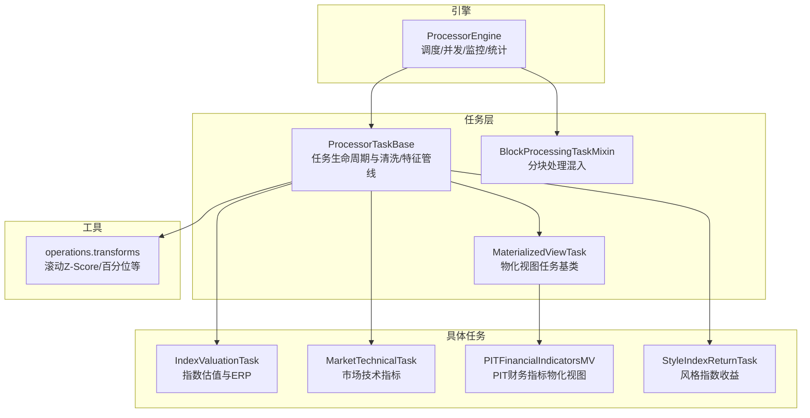
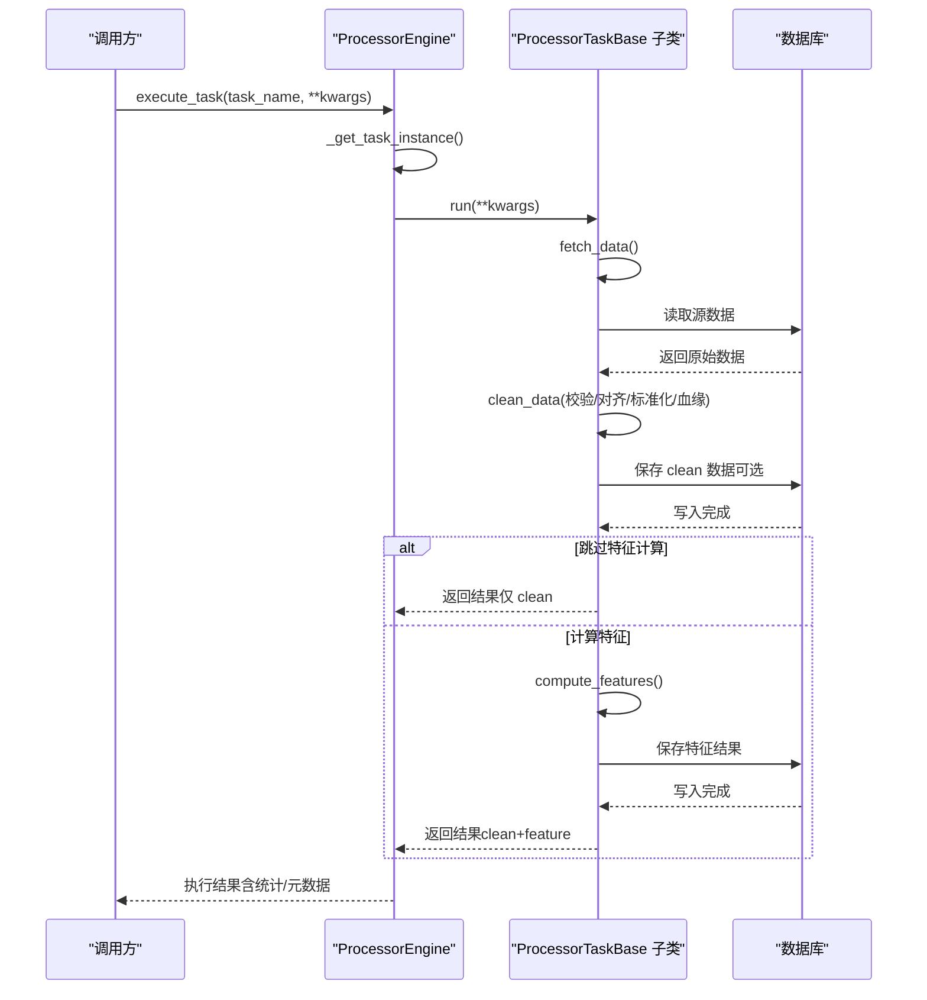
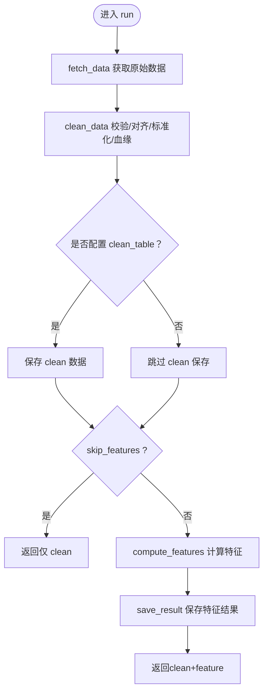
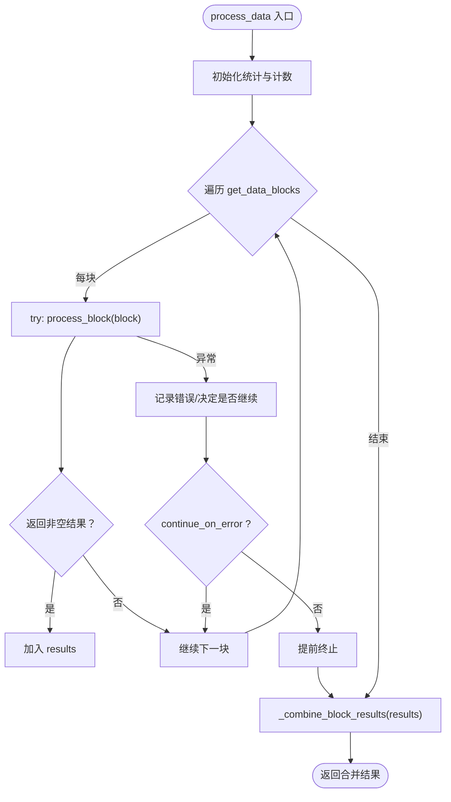
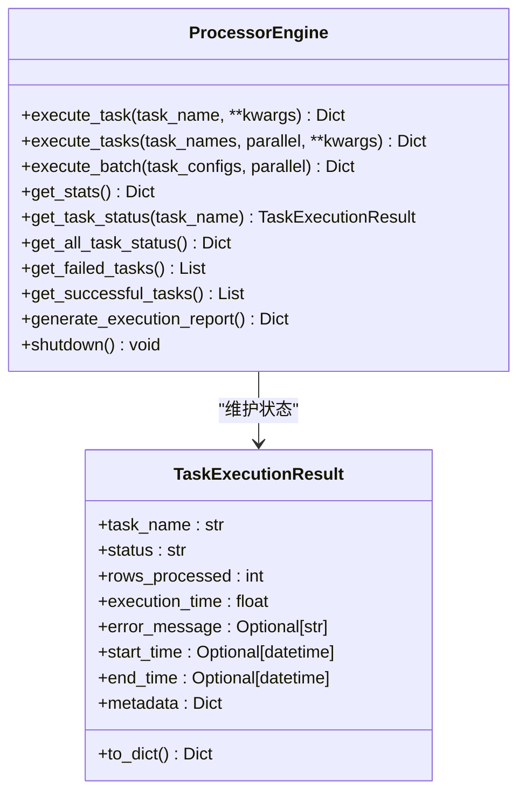
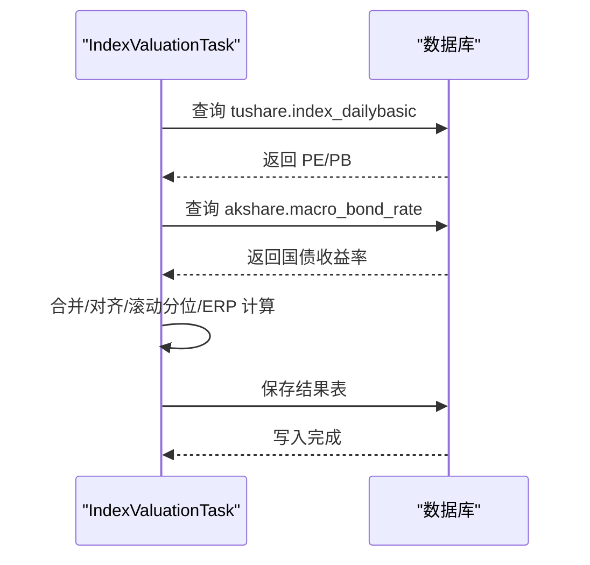
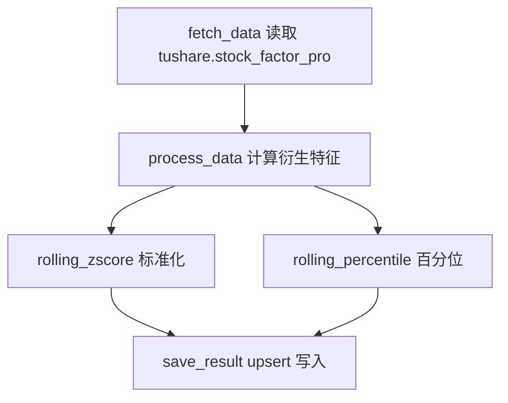
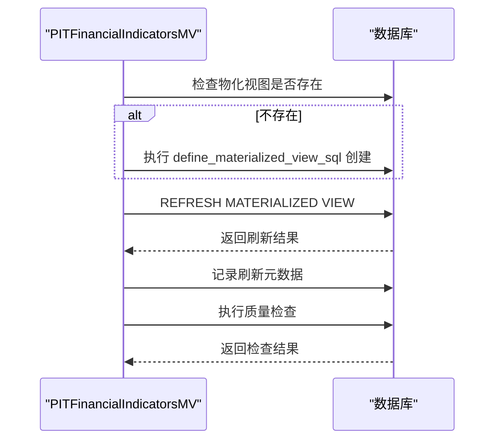
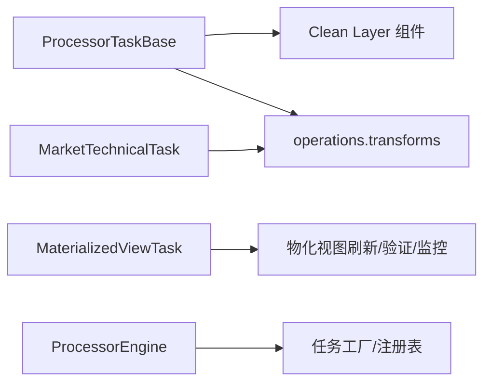

# 处理任务（Processor Tasks）

<cite>
**本文引用的文件**
- [alphahome/processors/tasks/base_task.py](file://alphahome/processors/tasks/base_task.py)
- [alphahome/processors/tasks/block_processing_mixin.py](file://alphahome/processors/tasks/block_processing_mixin.py)
- [alphahome/processors/engine/processor_engine.py](file://alphahome/processors/engine/processor_engine.py)
- [alphahome/processors/tasks/index/index_valuation.py](file://alphahome/processors/tasks/index/index_valuation.py)
- [alphahome/processors/tasks/market/market_technical.py](file://alphahome/processors/tasks/market/market_technical.py)
- [alphahome/processors/tasks/pit/pit_financial_indicators_mv.py](file://alphahome/processors/tasks/pit/pit_financial_indicators_mv.py)
- [alphahome/processors/tasks/style/style_index.py](file://alphahome/processors/tasks/style/style_index.py)
- [alphahome/processors/operations/transforms.py](file://alphahome/processors/operations/transforms.py)
- [alphahome/processors/materialized_views/base_task.py](file://alphahome/processors/materialized_views/base_task.py)
- [alphahome/processors/examples/complete_example.py](file://alphahome/processors/examples/complete_example.py)
</cite>

## 目录
1. [简介](#简介)
2. [项目结构](#项目结构)
3. [核心组件](#核心组件)
4. [架构总览](#架构总览)
5. [详细组件分析](#详细组件分析)
6. [依赖关系分析](#依赖关系分析)
7. [性能考量](#性能考量)
8. [故障排查指南](#故障排查指南)
9. [结论](#结论)
10. [附录：开发新处理任务指南](#附录开发新处理任务指南)

## 简介
本篇文档围绕“处理器任务（Processor Tasks）”展开，系统阐述 ProcessorTaskBase 如何定义数据处理任务的生命周期（fetch → clean → feature → save），并作为 ProcessorEngine 的执行单元；详解 index、market、pit、style 等任务子模块的功能与实现要点；说明 BlockProcessingMixin 如何通过分块处理优化内存使用；最后结合 complete_example.py 提供开发新处理任务的完整实践指南，包括任务依赖声明、异步处理方法实现与数据库交互。

## 项目结构
处理器任务体系位于 processors 子模块，主要由以下层次构成：
- 任务基类与混入：ProcessorTaskBase、BlockProcessingTaskMixin、MaterializedViewTask
- 任务实现：index、market、pit、style 等子模块中的具体任务
- 引擎：ProcessorEngine 负责任务调度、并发控制、执行监控与统计
- 操作与变换：operations.transforms 提供通用特征计算函数
- 示例：complete_example.py 展示端到端开发与执行流程

图表来源
- [alphahome/processors/tasks/base_task.py](file://alphahome/processors/tasks/base_task.py#L1-L686)
- [alphahome/processors/tasks/block_processing_mixin.py](file://alphahome/processors/tasks/block_processing_mixin.py#L1-L165)
- [alphahome/processors/materialized_views/base_task.py](file://alphahome/processors/materialized_views/base_task.py#L1-L377)
- [alphahome/processors/tasks/index/index_valuation.py](file://alphahome/processors/tasks/index/index_valuation.py#L1-L177)
- [alphahome/processors/tasks/market/market_technical.py](file://alphahome/processors/tasks/market/market_technical.py#L1-L384)
- [alphahome/processors/tasks/pit/pit_financial_indicators_mv.py](file://alphahome/processors/tasks/pit/pit_financial_indicators_mv.py#L1-L140)
- [alphahome/processors/tasks/style/style_index.py](file://alphahome/processors/tasks/style/style_index.py#L1-L103)
- [alphahome/processors/operations/transforms.py](file://alphahome/processors/operations/transforms.py#L1-L830)
- [alphahome/processors/engine/processor_engine.py](file://alphahome/processors/engine/processor_engine.py#L1-L597)

章节来源
- [alphahome/processors/tasks/base_task.py](file://alphahome/processors/tasks/base_task.py#L1-L686)
- [alphahome/processors/engine/processor_engine.py](file://alphahome/processors/engine/processor_engine.py#L1-L597)

## 核心组件
- ProcessorTaskBase：定义 fetch_data、process_data、save_result 三段式生命周期；内置 clean_data（校验、对齐、标准化、血缘）、compute_features（特征计算入口）、run（统一执行流程）；支持 skip_features 与 feature_dependencies。
- BlockProcessingTaskMixin：为任务提供分块处理能力，重写 process_data 驱动 get_data_blocks/process_block 流程，支持 overlap_size、block_size、continue_on_error 等配置。
- ProcessorEngine：统一调度与执行任务，支持并行/顺序执行、超时控制、依赖检查扩展点、执行统计与报告生成。
- MaterializedViewTask：面向物化视图的任务基类，封装 SQL 定义、刷新、质量检查与监控告警。
- operations.transforms：提供滚动 Z-Score、滚动百分位、EMA、斜率、趋势强度等通用特征函数，供任务 compute_features 复用。

章节来源
- [alphahome/processors/tasks/base_task.py](file://alphahome/processors/tasks/base_task.py#L1-L686)
- [alphahome/processors/tasks/block_processing_mixin.py](file://alphahome/processors/tasks/block_processing_mixin.py#L1-L165)
- [alphahome/processors/engine/processor_engine.py](file://alphahome/processors/engine/processor_engine.py#L1-L597)
- [alphahome/processors/materialized_views/base_task.py](file://alphahome/processors/materialized_views/base_task.py#L1-L377)
- [alphahome/processors/operations/transforms.py](file://alphahome/processors/operations/transforms.py#L1-L830)

## 架构总览
下图展示 ProcessorEngine 如何协调 ProcessorTaskBase 及其子类完成 fetch → clean → feature → save 的完整流程，并说明与数据库交互与日志记录的关键节点。

图表来源
- [alphahome/processors/engine/processor_engine.py](file://alphahome/processors/engine/processor_engine.py#L141-L377)
- [alphahome/processors/tasks/base_task.py](file://alphahome/processors/tasks/base_task.py#L494-L621)

## 详细组件分析

### ProcessorTaskBase 生命周期与数据分层
- 生命周期三段式：fetch_data → clean_data → compute_features（可选）→ save_result
- 数据分层职责：
  - clean 层：校验（DataValidator）、对齐（DataAligner）、标准化（DataStandardizer）、血缘（LineageTracker）
  - feature 层：通过 feature_dependencies 声明依赖的 transforms 函数，compute_features 调用这些函数生成特征
- 关键行为：
  - run 方法统一编排流程，支持 skip_features、lookback_days 等参数
  - _save_to_clean 为占位实现，生产环境需覆盖为真实写入
  - get_task_info 汇总任务元信息

图表来源
- [alphahome/processors/tasks/base_task.py](file://alphahome/processors/tasks/base_task.py#L494-L621)

章节来源
- [alphahome/processors/tasks/base_task.py](file://alphahome/processors/tasks/base_task.py#L1-L686)

### BlockProcessingTaskMixin 分块处理
- 通过 get_data_blocks 生成数据块迭代器，process_block 处理单块，最终合并结果
- 支持 block_size、overlap_size、continue_on_error 等配置
- 提供 _split_data_into_blocks 辅助将 DataFrame 分块；_combine_block_results 合并结果

图表来源
- [alphahome/processors/tasks/block_processing_mixin.py](file://alphahome/processors/tasks/block_processing_mixin.py#L70-L165)

章节来源
- [alphahome/processors/tasks/block_processing_mixin.py](file://alphahome/processors/tasks/block_processing_mixin.py#L1-L165)

### ProcessorEngine 调度与并发
- 支持单任务执行、多任务并行/顺序执行、批量执行
- 使用 asyncio.Semaphore 控制并发数，return_exceptions=True 保证失败不影响其他任务
- 提供任务状态追踪、统计、报告生成、失败/成功任务查询、重置统计等能力
- 依赖检查为扩展点（当前仅记录日志，预留实现空间）

图表来源
- [alphahome/processors/engine/processor_engine.py](file://alphahome/processors/engine/processor_engine.py#L1-L597)

章节来源
- [alphahome/processors/engine/processor_engine.py](file://alphahome/processors/engine/processor_engine.py#L1-L597)

### 具体任务子模块

#### IndexValuationTask（指数估值与ERP）
- 功能：从 tushare.index_dailybasic 与 akshare.macro_bond_rate 获取 PE/PB 与 10 年国债收益率，计算滚动分位与 ERP（1/PE - 国债收益率）
- 数据血缘：source_tables 指向 tushare.index_dailybasic 与 akshare.macro_bond_rate
- 保存：将结果按 trade_date 主键 upsert 写入数据库

图表来源
- [alphahome/processors/tasks/index/index_valuation.py](file://alphahome/processors/tasks/index/index_valuation.py#L1-L177)

章节来源
- [alphahome/processors/tasks/index/index_valuation.py](file://alphahome/processors/tasks/index/index_valuation.py#L1-L177)

#### MarketTechnicalTask（市场技术指标）
- 功能：基于 tushare.stock_factor_pro 计算横截面技术指标，包括动量、波动、成交活跃度、价量背离等
- 特征计算：使用 transforms.rolling_zscore 与 rolling_percentile 进行标准化与历史分位
- 保存：按 trade_date 主键 upsert 写入 processor_market_technical

图表来源
- [alphahome/processors/tasks/market/market_technical.py](file://alphahome/processors/tasks/market/market_technical.py#L1-L384)
- [alphahome/processors/operations/transforms.py](file://alphahome/processors/operations/transforms.py#L145-L217)

章节来源
- [alphahome/processors/tasks/market/market_technical.py](file://alphahome/processors/tasks/market/market_technical.py#L1-L384)
- [alphahome/processors/operations/transforms.py](file://alphahome/processors/operations/transforms.py#L145-L217)

#### PITFinancialIndicatorsMV（PIT财务指标物化视图）
- 功能：定义并刷新 materialized_views.pit_financial_indicators_mv，包含数据对齐、时间序列展开、标准化与血缘元数据
- 质量检查：null_check、outlier_check、row_count_change 等
- 执行：继承 MaterializedViewTask，重写 define_materialized_view_sql，run 中完成创建/刷新/质量检查/监控记录

图表来源
- [alphahome/processors/tasks/pit/pit_financial_indicators_mv.py](file://alphahome/processors/tasks/pit/pit_financial_indicators_mv.py#L1-L140)
- [alphahome/processors/materialized_views/base_task.py](file://alphahome/processors/materialized_views/base_task.py#L198-L327)

章节来源
- [alphahome/processors/tasks/pit/pit_financial_indicators_mv.py](file://alphahome/processors/tasks/pit/pit_financial_indicators_mv.py#L1-L140)
- [alphahome/processors/materialized_views/base_task.py](file://alphahome/processors/materialized_views/base_task.py#L1-L377)

#### StyleIndexReturnTask（风格指数收益）
- 功能：从 tushare.index_factor_pro 读取风格指数收盘价，计算多窗口收益率序列
- 保存：按 trade_date 主键 upsert 写入 processor_style_index_return

章节来源
- [alphahome/processors/tasks/style/style_index.py](file://alphahome/processors/tasks/style/style_index.py#L1-L103)

## 依赖关系分析
- ProcessorTaskBase 依赖 clean 层组件（DataValidator、DataAligner、DataStandardizer、LineageTracker）与 operations.transforms
- MarketTechnicalTask 依赖 transforms.rolling_zscore 与 rolling_percentile
- PITFinancialIndicatorsMV 继承 MaterializedViewTask，依赖物化视图刷新/验证/监控组件
- ProcessorEngine 依赖任务工厂与统一任务注册机制，支持任务发现与信息查询

图表来源
- [alphahome/processors/tasks/base_task.py](file://alphahome/processors/tasks/base_task.py#L1-L686)
- [alphahome/processors/tasks/market/market_technical.py](file://alphahome/processors/tasks/market/market_technical.py#L1-L384)
- [alphahome/processors/materialized_views/base_task.py](file://alphahome/processors/materialized_views/base_task.py#L1-L377)
- [alphahome/processors/engine/processor_engine.py](file://alphahome/processors/engine/processor_engine.py#L511-L542)

章节来源
- [alphahome/processors/tasks/base_task.py](file://alphahome/processors/tasks/base_task.py#L1-L686)
- [alphahome/processors/tasks/market/market_technical.py](file://alphahome/processors/tasks/market/market_technical.py#L1-L384)
- [alphahome/processors/materialized_views/base_task.py](file://alphahome/processors/materialized_views/base_task.py#L1-L377)
- [alphahome/processors/engine/processor_engine.py](file://alphahome/processors/engine/processor_engine.py#L511-L542)

## 性能考量
- 分块处理：BlockProcessingTaskMixin 通过 block_size 与 overlap_size 控制内存占用与窗口回溯；overlap_size 有助于滚动指标的连续性
- 并发控制：ProcessorEngine 使用 asyncio.Semaphore 控制最大并发，避免资源争用；return_exceptions=True 提升整体吞吐
- 特征计算：使用 rolling_zscore、rolling_percentile 等向量化函数，减少 Python 循环开销
- 数据保存：upsert 模式避免重复写入，提高稳定性与效率

[本节为通用指导，不直接分析具体文件]

## 故障排查指南
- 数据清洗失败：关注 ValidationError、AlignmentError；检查 schema、date_col、identifier_col、primary_keys 等参数
- 特征依赖缺失：若 feature_dependencies 中函数不存在，将触发依赖校验错误；确认 transforms 模块中函数名拼写与可见性
- 任务被取消：stop_event 设置后会提前返回 cancelled；检查外部取消信号
- 物化视图刷新失败：检查 define_materialized_view_sql 语法与权限；查看刷新元数据与质量检查结果
- 并行任务异常：ProcessorEngine 使用 return_exceptions=True，单任务异常不会影响其他任务；可在报告中定位失败任务

章节来源
- [alphahome/processors/tasks/base_task.py](file://alphahome/processors/tasks/base_task.py#L536-L621)
- [alphahome/processors/materialized_views/base_task.py](file://alphahome/processors/materialized_views/base_task.py#L235-L327)
- [alphahome/processors/engine/processor_engine.py](file://alphahome/processors/engine/processor_engine.py#L378-L424)

## 结论
ProcessorTaskBase 以 fetch → clean → feature → save 的清晰生命周期，结合 clean 层与 transforms 的标准化能力，为复杂数据处理提供了可复用的执行框架。BlockProcessingTaskMixin 通过分块处理进一步优化内存与性能。ProcessorEngine 则提供了强大的调度与并发控制能力。index、market、pit、style 等任务模块展示了不同业务领域的典型应用。结合 complete_example.py，开发者可以快速上手并扩展新的处理任务。

[本节为总结，不直接分析具体文件]

## 附录：开发新处理任务指南
以下指南基于 complete_example.py 的端到端示例，帮助你从零开发一个新处理任务。

- 步骤一：定义任务类
  - 继承 ProcessorTaskBase 或需要物化视图的场景继承 MaterializedViewTask
  - 设置 name、table_name、description、source_tables、primary_keys 等元信息
  - 若为物化视图任务，重写 define_materialized_view_sql

- 步骤二：实现 fetch_data
  - 从数据库读取原始数据，返回 DataFrame；注意日期列与主键列的命名规范
  - 可通过 kwargs 传入 start_date/end_date 等参数

- 步骤三：实现 process_data
  - 若使用分块处理，实现 get_data_blocks 与 process_block，并让 mixin 重写的 process_data 驱动流程
  - 否则直接在 process_data 中组织 OperationPipeline 或调用 transforms 函数

- 步骤四：实现 compute_features（可选）
  - 通过 feature_dependencies 声明依赖的 transforms 函数
  - 在 compute_features 中调用这些函数生成特征列

- 步骤五：实现 save_result
  - 将处理后的数据按主键 upsert 写入数据库
  - 注意日期格式转换与主键设置

- 步骤六：注册与执行
  - 使用 @task_register() 注册任务
  - 通过 ProcessorEngine.execute_task 或 execute_tasks 执行任务
  - 可在 execute_batch 中传入不同参数批量执行

- 异步与停止信号
  - 所有 fetch/process/save 方法均为 async
  - 在关键步骤检查 stop_event，必要时优雅退出

- 数据库交互
  - 使用 db.fetch、db.save_dataframe 等接口；确保连接可用
  - 物化视图任务通过 define_materialized_view_sql 与刷新流程完成写入

- 示例参考
  - complete_example.py 展示了自定义 Operation 与 Pipeline 的使用方式，以及端到端执行流程

章节来源
- [alphahome/processors/examples/complete_example.py](file://alphahome/processors/examples/complete_example.py#L1-L221)
- [alphahome/processors/tasks/base_task.py](file://alphahome/processors/tasks/base_task.py#L123-L184)
- [alphahome/processors/tasks/block_processing_mixin.py](file://alphahome/processors/tasks/block_processing_mixin.py#L40-L118)
- [alphahome/processors/engine/processor_engine.py](file://alphahome/processors/engine/processor_engine.py#L141-L216)