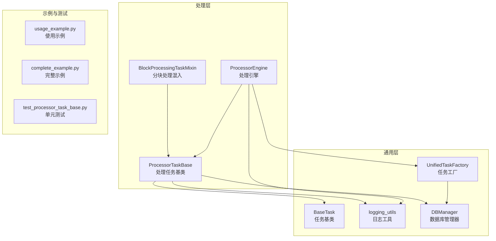
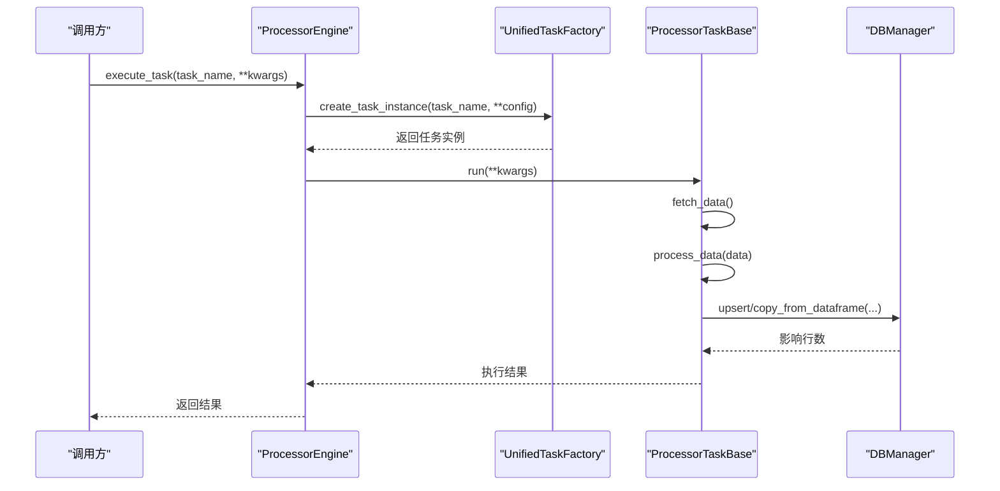
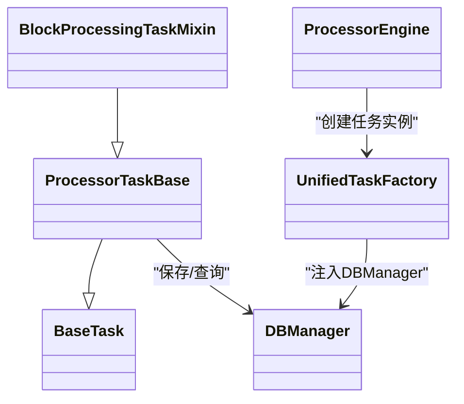

# 处理任务基础组件

<cite>
**本文引用的文件**
- [alphahome/common/task_system/base_task.py](file://alphahome/common/task_system/base_task.py)
- [alphahome/processors/tasks/base_task.py](file://alphahome/processors/tasks/base_task.py)
- [alphahome/processors/tasks/block_processing_mixin.py](file://alphahome/processors/tasks/block_processing_mixin.py)
- [alphahome/processors/engine/processor_engine.py](file://alphahome/processors/engine/processor_engine.py)
- [alphahome/common/task_system/task_factory.py](file://alphahome/common/task_system/task_factory.py)
- [alphahome/common/logging_utils.py](file://alphahome/common/logging_utils.py)
- [alphahome/common/db_manager.py](file://alphahome/common/db_manager.py)
- [alphahome/processors/examples/usage_example.py](file://alphahome/processors/examples/usage_example.py)
- [alphahome/processors/examples/complete_example.py](file://alphahome/processors/examples/complete_example.py)
- [alphahome/processors/tests/test_processor_task_base.py](file://alphahome/processors/tests/test_processor_task_base.py)
</cite>

## 目录
1. [简介](#简介)
2. [项目结构](#项目结构)
3. [核心组件](#核心组件)
4. [架构总览](#架构总览)
5. [详细组件分析](#详细组件分析)
6. [依赖关系分析](#依赖关系分析)
7. [性能考量](#性能考量)
8. [故障排查指南](#故障排查指南)
9. [结论](#结论)
10. [附录：继承BaseProcessorTask开发新任务示例](#附录继承baseprocessortask开发新任务示例)

## 简介
本文件围绕“处理任务基础组件”展开，系统阐述以下内容：
- BaseProcessorTask基类的设计与生命周期方法（fetch_data、process_data、save_result），以及与通用层BaseTask的继承与协作关系
- 配置管理、日志记录与错误处理机制
- 分块处理能力BlockProcessingTaskMixin如何实现大规模数据的内存友好处理，包括分块策略、状态管理与异常恢复
- ProcessorEngine如何加载与调度任务，以及任务工厂与数据库连接的集成
- 提供继承BaseProcessorTask开发新任务的完整示例路径

## 项目结构
处理任务基础组件位于以下模块：
- 通用任务系统：BaseTask、任务工厂、日志工具、数据库管理器
- 处理任务层：ProcessorTaskBase、BlockProcessingTaskMixin、ProcessorEngine
- 示例与测试：使用示例、完整示例、单元测试

图表来源
- [alphahome/common/task_system/base_task.py](file://alphahome/common/task_system/base_task.py#L1-L120)
- [alphahome/processors/tasks/base_task.py](file://alphahome/processors/tasks/base_task.py#L1-L120)
- [alphahome/processors/tasks/block_processing_mixin.py](file://alphahome/processors/tasks/block_processing_mixin.py#L1-L60)
- [alphahome/processors/engine/processor_engine.py](file://alphahome/processors/engine/processor_engine.py#L1-L120)
- [alphahome/common/task_system/task_factory.py](file://alphahome/common/task_system/task_factory.py#L1-L120)
- [alphahome/common/logging_utils.py](file://alphahome/common/logging_utils.py#L1-L80)
- [alphahome/common/db_manager.py](file://alphahome/common/db_manager.py#L1-L80)
- [alphahome/processors/examples/usage_example.py](file://alphahome/processors/examples/usage_example.py#L1-L60)
- [alphahome/processors/examples/complete_example.py](file://alphahome/processors/examples/complete_example.py#L1-L60)
- [alphahome/processors/tests/test_processor_task_base.py](file://alphahome/processors/tests/test_processor_task_base.py#L1-L60)

章节来源
- [alphahome/common/task_system/base_task.py](file://alphahome/common/task_system/base_task.py#L1-L120)
- [alphahome/processors/tasks/base_task.py](file://alphahome/processors/tasks/base_task.py#L1-L120)
- [alphahome/processors/tasks/block_processing_mixin.py](file://alphahome/processors/tasks/block_processing_mixin.py#L1-L60)
- [alphahome/processors/engine/processor_engine.py](file://alphahome/processors/engine/processor_engine.py#L1-L120)
- [alphahome/common/task_system/task_factory.py](file://alphahome/common/task_system/task_factory.py#L1-L120)
- [alphahome/common/logging_utils.py](file://alphahome/common/logging_utils.py#L1-L80)
- [alphahome/common/db_manager.py](file://alphahome/common/db_manager.py#L1-L80)
- [alphahome/processors/examples/usage_example.py](file://alphahome/processors/examples/usage_example.py#L1-L60)
- [alphahome/processors/examples/complete_example.py](file://alphahome/processors/examples/complete_example.py#L1-L60)
- [alphahome/processors/tests/test_processor_task_base.py](file://alphahome/processors/tests/test_processor_task_base.py#L1-L60)

## 核心组件
- BaseTask（通用任务基类）：定义统一的任务生命周期（fetch_data、process_data、save_data），提供数据验证、去重、主键空值过滤、分批保存、UPSERT/COPY写入、rawdata视图创建等通用能力；支持任务配置注入、日志记录、错误处理与取消。
- ProcessorTaskBase（处理任务基类）：在BaseTask之上，面向“数据处理任务”的完整业务流程，定义fetch_data、process_data、save_result三个抽象方法；提供clean_data、compute_features、run等高层流程编排；支持数据分层（clean/feature）与血缘追踪。
- BlockProcessingTaskMixin（分块处理混入）：为任务提供分块处理能力，重写process_data以驱动分块生成、逐块处理、结果合并与错误统计；支持块大小、重叠、错误继续等策略。
- ProcessorEngine（处理引擎）：负责任务加载（通过任务工厂）、依赖检查（预留）、并发控制（信号量）、执行监控与统计、批量执行、超时控制、结果聚合与报告生成。
- UnifiedTaskFactory（任务工厂）：统一管理任务注册、实例创建、数据库连接注入、任务配置合并与任务信息查询。
- logging_utils（日志工具）：提供统一日志初始化与获取，确保各组件日志风格一致。
- DBManager（数据库管理器）：提供异步/同步数据库操作、UPSER/COPY写入、表/视图管理等能力。

章节来源
- [alphahome/common/task_system/base_task.py](file://alphahome/common/task_system/base_task.py#L1-L200)
- [alphahome/processors/tasks/base_task.py](file://alphahome/processors/tasks/base_task.py#L1-L120)
- [alphahome/processors/tasks/block_processing_mixin.py](file://alphahome/processors/tasks/block_processing_mixin.py#L1-L120)
- [alphahome/processors/engine/processor_engine.py](file://alphahome/processors/engine/processor_engine.py#L1-L160)
- [alphahome/common/task_system/task_factory.py](file://alphahome/common/task_system/task_factory.py#L1-L120)
- [alphahome/common/logging_utils.py](file://alphahome/common/logging_utils.py#L1-L120)
- [alphahome/common/db_manager.py](file://alphahome/common/db_manager.py#L1-L80)

## 架构总览
处理任务基础组件遵循“通用层-处理层-引擎层”的分层架构，通过任务工厂与数据库管理器解耦，保证可扩展性与可维护性。

图表来源
- [alphahome/processors/engine/processor_engine.py](file://alphahome/processors/engine/processor_engine.py#L140-L220)
- [alphahome/common/task_system/task_factory.py](file://alphahome/common/task_system/task_factory.py#L220-L272)
- [alphahome/processors/tasks/base_task.py](file://alphahome/processors/tasks/base_task.py#L494-L621)
- [alphahome/common/db_manager.py](file://alphahome/common/db_manager.py#L1-L80)

## 详细组件分析

### BaseTask（通用任务基类）
- 生命周期方法
  - fetch_data：子类实现获取原始数据；BaseTask提供统一的生命周期模板方法execute，贯穿fetch/process/validate/save/cleanup。
  - process_data：默认应用transformations；子类可重写以实现自定义处理逻辑。
  - save_data：统一保存入口，支持去重、主键空值过滤、NaN处理、分批保存、UPSERT/COPY写入、rawdata视图创建。
- 配置管理
  - 通过task_config注入任务特定配置；支持save_batch_size、use_insert_mode等参数。
- 日志记录
  - 使用logging_utils获取logger，按阶段输出INFO/WARNING/ERROR日志，便于可观测性。
- 错误处理
  - 统一捕获异常并返回结构化结果；支持取消（CancelledError）与错误分类。
- 数据验证
  - 支持report/filter两种模式，可对DataFrame或非DataFrame进行验证，记录失败详情。
- 保存策略
  - 若定义primary_keys，使用upsert；否则COPY插入；支持分批保存与去重。

章节来源
- [alphahome/common/task_system/base_task.py](file://alphahome/common/task_system/base_task.py#L138-L239)
- [alphahome/common/task_system/base_task.py](file://alphahome/common/task_system/base_task.py#L264-L373)
- [alphahome/common/task_system/base_task.py](file://alphahome/common/task_system/base_task.py#L374-L554)
- [alphahome/common/task_system/base_task.py](file://alphahome/common/task_system/base_task.py#L555-L784)
- [alphahome/common/task_system/base_task.py](file://alphahome/common/task_system/base_task.py#L785-L825)

### ProcessorTaskBase（处理任务基类）
- 继承关系
  - ProcessorTaskBase继承BaseTask，扩展处理任务特有的属性（source_tables、table_name、clean_table、feature_dependencies、skip_features）与流程（run、clean_data、compute_features）。
- 生命周期与流程
  - run方法实现fetch_data → clean_data → compute_features（可选）→ save_result的完整流程；支持skip_features与增量回溯参数。
  - clean_data组合DataValidator、DataAligner、DataStandardizer、LineageTracker，实现数据校验、对齐、标准化与血缘追踪。
- 与BaseTask协作
  - 通过覆写_fetch_data/_save_data，将fetch_data/process_data/save_result映射到通用生命周期；沿用BaseTask的验证、保存、日志与错误处理能力。

章节来源
- [alphahome/processors/tasks/base_task.py](file://alphahome/processors/tasks/base_task.py#L41-L120)
- [alphahome/processors/tasks/base_task.py](file://alphahome/processors/tasks/base_task.py#L123-L185)
- [alphahome/processors/tasks/base_task.py](file://alphahome/processors/tasks/base_task.py#L190-L471)
- [alphahome/processors/tasks/base_task.py](file://alphahome/processors/tasks/base_task.py#L494-L686)

### BlockProcessingTaskMixin（分块处理混入）
- 设计要点
  - 重写process_data，驱动get_data_blocks生成数据块，逐块调用process_block，收集结果并合并。
  - 提供block_size、overlap_size、continue_on_error等配置；统计块总数、成功数、失败数。
- 分块策略
  - 提供_split_data_into_blocks辅助生成器，支持overlap重叠策略；合并策略默认concat，可重写_combine_block_results。
- 异常恢复
  - 支持continue_on_error=false时在错误处提前终止；记录每个失败块号与错误信息；最终汇总统计。

章节来源
- [alphahome/processors/tasks/block_processing_mixin.py](file://alphahome/processors/tasks/block_processing_mixin.py#L1-L120)
- [alphahome/processors/tasks/block_processing_mixin.py](file://alphahome/processors/tasks/block_processing_mixin.py#L124-L165)

### ProcessorEngine（处理引擎）
- 加载与调度
  - 通过UnifiedTaskFactory.create_task_instance动态创建任务实例，注入DBManager与任务配置；支持按名称执行与批量执行。
- 并发控制
  - 使用asyncio.Semaphore限制并发数；使用asyncio.gather(return_exceptions=True)保证单个任务失败不影响其他任务。
- 依赖检查
  - 当前为预留扩展点，记录日志；中长期可接入任务状态表与依赖超时/重试策略。
- 统计与报告
  - 维护执行统计、任务状态追踪、失败/成功任务列表、执行报告生成；支持重置统计与获取引擎元数据。

章节来源
- [alphahome/processors/engine/processor_engine.py](file://alphahome/processors/engine/processor_engine.py#L141-L242)
- [alphahome/processors/engine/processor_engine.py](file://alphahome/processors/engine/processor_engine.py#L243-L311)
- [alphahome/processors/engine/processor_engine.py](file://alphahome/processors/engine/processor_engine.py#L312-L377)
- [alphahome/processors/engine/processor_engine.py](file://alphahome/processors/engine/processor_engine.py#L378-L424)
- [alphahome/processors/engine/processor_engine.py](file://alphahome/processors/engine/processor_engine.py#L425-L597)

### 任务工厂与数据库连接
- UnifiedTaskFactory
  - 注册任务类、按类型筛选、获取任务信息；创建任务实例时注入DBManager与任务配置；支持重新加载配置与关闭。
- DBManager
  - 提供upsert、copy_from_dataframe、表/视图管理等能力，支撑BaseTask的保存与视图创建。

章节来源
- [alphahome/common/task_system/task_factory.py](file://alphahome/common/task_system/task_factory.py#L1-L120)
- [alphahome/common/task_system/task_factory.py](file://alphahome/common/task_system/task_factory.py#L220-L354)
- [alphahome/common/db_manager.py](file://alphahome/common/db_manager.py#L1-L80)

### 日志与错误处理
- 日志
  - 通过logging_utils统一获取logger，各组件在关键节点输出INFO/WARNING/ERROR日志，便于定位问题。
- 错误处理
  - BaseTask/ProcessorTaskBase在生命周期中捕获异常并返回结构化结果；ProcessorEngine对超时与异常进行包装与记录；测试覆盖了错误场景与取消场景。

章节来源
- [alphahome/common/logging_utils.py](file://alphahome/common/logging_utils.py#L1-L120)
- [alphahome/common/task_system/base_task.py](file://alphahome/common/task_system/base_task.py#L240-L278)
- [alphahome/processors/tasks/base_task.py](file://alphahome/processors/tasks/base_task.py#L612-L621)
- [alphahome/processors/tests/test_processor_task_base.py](file://alphahome/processors/tests/test_processor_task_base.py#L204-L246)

## 依赖关系分析
- 继承关系
  - ProcessorTaskBase ← BaseTask
  - BlockProcessingTaskMixin ← ProcessorTaskBase（通过多重继承）
- 引擎与工厂
  - ProcessorEngine → UnifiedTaskFactory（创建任务实例）
  - UnifiedTaskFactory → DBManager（注入数据库连接）
- 任务与数据库
  - ProcessorTaskBase/BaseTask → DBManager（upsert/copy_from_dataframe、表/视图管理）

图表来源
- [alphahome/processors/tasks/base_task.py](file://alphahome/processors/tasks/base_task.py#L41-L120)
- [alphahome/processors/tasks/block_processing_mixin.py](file://alphahome/processors/tasks/block_processing_mixin.py#L1-L40)
- [alphahome/processors/engine/processor_engine.py](file://alphahome/processors/engine/processor_engine.py#L141-L220)
- [alphahome/common/task_system/task_factory.py](file://alphahome/common/task_system/task_factory.py#L220-L272)
- [alphahome/common/db_manager.py](file://alphahome/common/db_manager.py#L1-L80)

## 性能考量
- 分批保存与UPSERT
  - BaseTask在保存阶段支持分批与去重/空值过滤，减少单次写入压力，提升整体吞吐。
- 并发控制
  - ProcessorEngine使用信号量限制并发，避免资源争用；gather(return_exceptions=True)保证失败隔离。
- 分块处理
  - BlockProcessingTaskMixin将大DataFrame拆分为小块，降低内存峰值；overlap支持跨块上下文连续性；continue_on_error提升鲁棒性。
- I/O与网络
  - fetch_data通常涉及外部API或数据库查询，建议结合超时与重试策略；ProcessorEngine支持timeout与错误包装。

[本节为通用指导，不直接分析具体文件]

## 故障排查指南
- 常见问题
  - 任务未注册：检查UnifiedTaskFactory.register_task与任务名称是否匹配。
  - 数据库连接失败：确认DBManager初始化与连接字符串；工厂支持重新加载配置。
  - 保存失败：检查primary_keys、schema_def、upsert参数；查看BaseTask保存日志。
  - 取消任务：stop_event触发后返回cancelled状态；检查调用方是否正确设置事件。
- 日志定位
  - 使用logging_utils.setup_logging初始化日志；在BaseTask/ProcessorTaskBase/ProcessorEngine关键节点均有日志输出。
- 单元测试参考
  - 测试覆盖执行顺序、错误处理、空数据、取消等场景，可对照定位问题。

章节来源
- [alphahome/processors/tests/test_processor_task_base.py](file://alphahome/processors/tests/test_processor_task_base.py#L160-L246)
- [alphahome/common/task_system/task_factory.py](file://alphahome/common/task_system/task_factory.py#L68-L120)
- [alphahome/common/logging_utils.py](file://alphahome/common/logging_utils.py#L48-L120)

## 结论
处理任务基础组件通过清晰的分层与职责划分，提供了可扩展、可观测、可恢复的数据处理能力：
- BaseTask提供通用生命周期与数据处理基础设施
- ProcessorTaskBase聚焦处理任务的业务流程与数据分层
- BlockProcessingTaskMixin解决大规模数据的内存瓶颈
- ProcessorEngine负责任务加载、并发与执行监控
- UnifiedTaskFactory与DBManager保障配置与数据访问的一致性

[本节为总结，不直接分析具体文件]

## 附录：继承BaseProcessorTask开发新任务示例
以下示例展示了如何继承ProcessorTaskBase开发新任务，涵盖fetch_data、process_data、save_result的实现要点与运行流程。

- 基础使用示例
  - 示例展示了如何定义自定义操作（Operation）、通过Pipeline编排操作、注册任务并通过ProcessorEngine执行。
  - 参考路径：[alphahome/processors/examples/usage_example.py](file://alphahome/processors/examples/usage_example.py#L1-L177)

- 完整端到端示例
  - 示例展示了从创建自定义操作、定义自定义任务、初始化数据库连接与任务工厂、创建引擎并执行任务的完整流程。
  - 参考路径：[alphahome/processors/examples/complete_example.py](file://alphahome/processors/examples/complete_example.py#L1-L221)

- 单元测试参考
  - 测试覆盖了执行顺序、错误处理、空数据、取消等场景，可作为开发新任务时的行为验证依据。
  - 参考路径：[alphahome/processors/tests/test_processor_task_base.py](file://alphahome/processors/tests/test_processor_task_base.py#L160-L356)

章节来源
- [alphahome/processors/examples/usage_example.py](file://alphahome/processors/examples/usage_example.py#L1-L177)
- [alphahome/processors/examples/complete_example.py](file://alphahome/processors/examples/complete_example.py#L1-L221)
- [alphahome/processors/tests/test_processor_task_base.py](file://alphahome/processors/tests/test_processor_task_base.py#L160-L356)