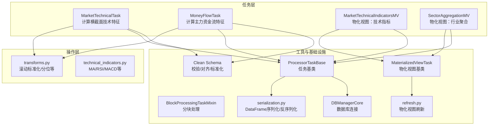
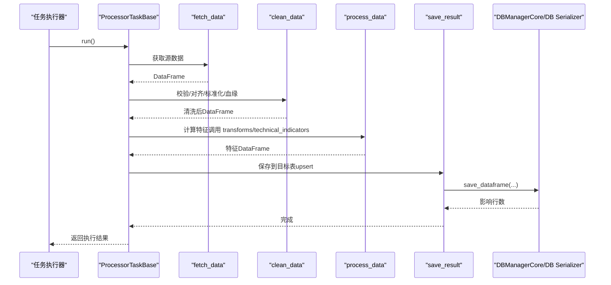
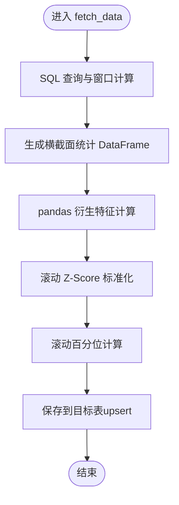
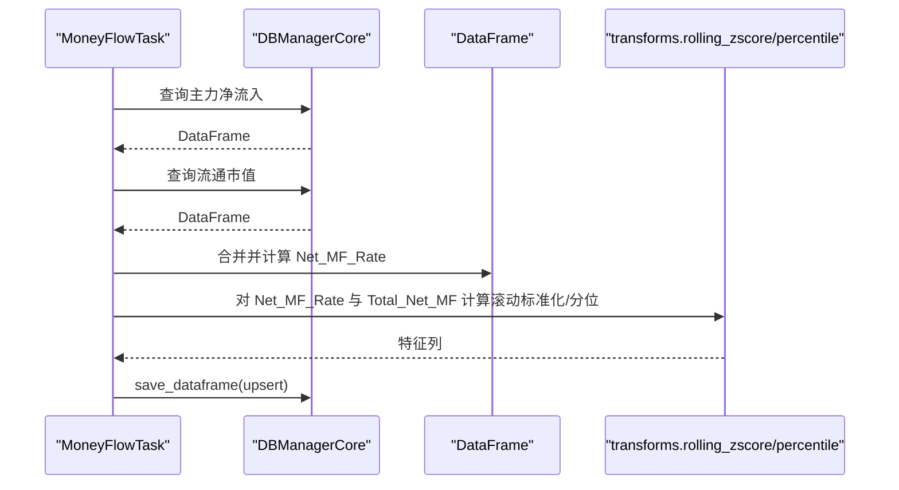
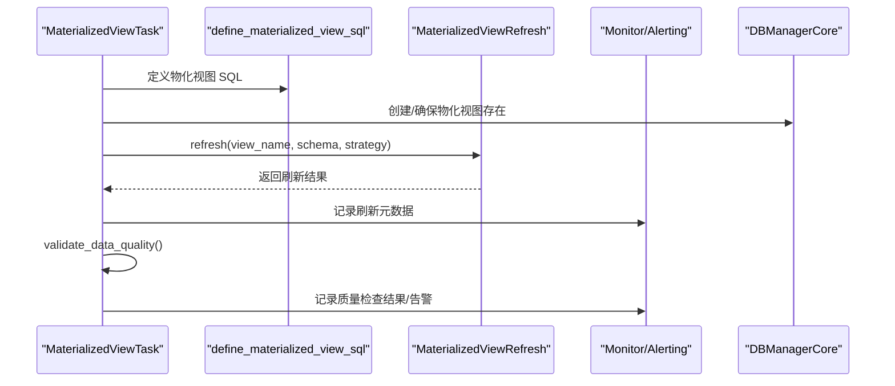
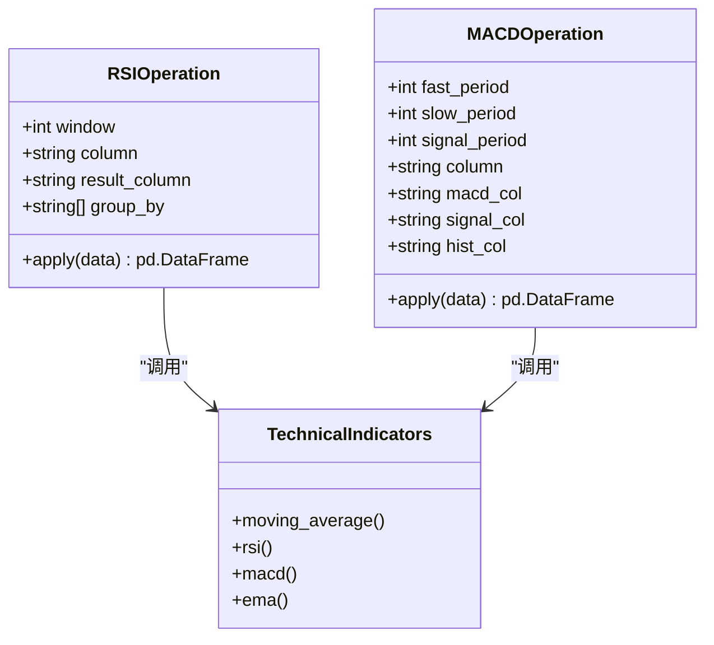
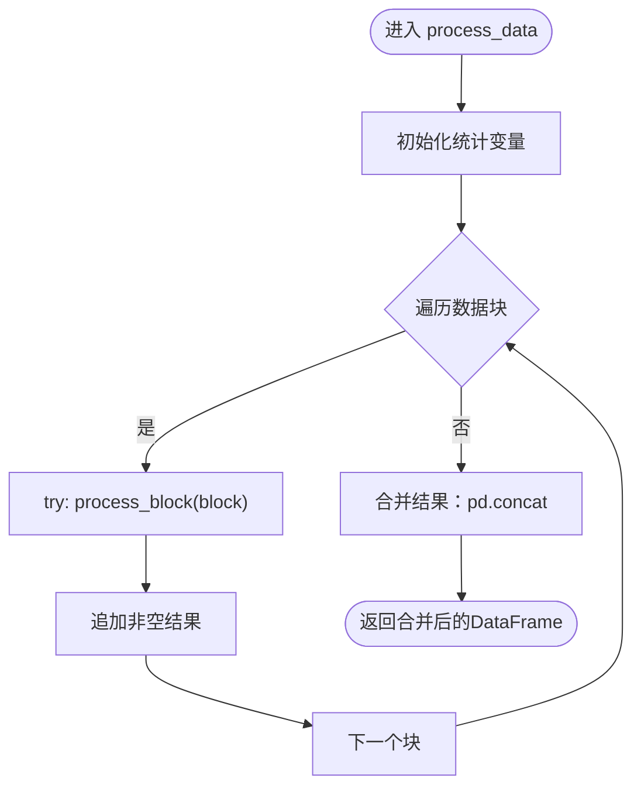
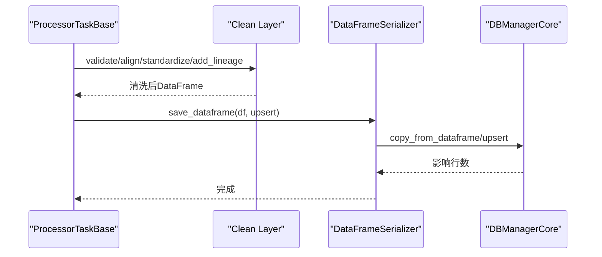
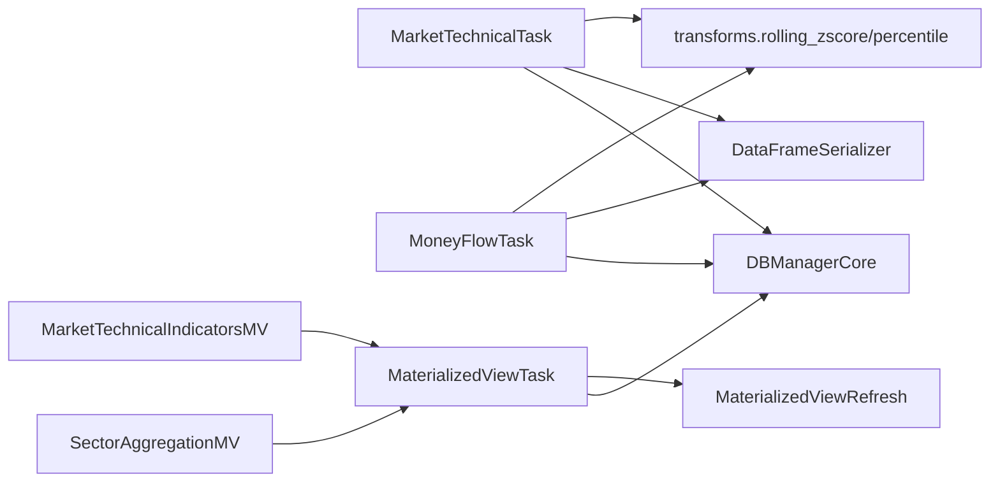

# 市场特征处理任务

<cite>
**本文引用的文件**
- [market_technical.py](file://alphahome/processors/tasks/market/market_technical.py)
- [money_flow.py](file://alphahome/processors/tasks/market/money_flow.py)
- [market_technical_indicators_mv.py](file://alphahome/processors/tasks/market/market_technical_indicators_mv.py)
- [sector_aggregation_mv.py](file://alphahome/processors/tasks/market/sector_aggregation_mv.py)
- [block_processing_mixin.py](file://alphahome/processors/tasks/block_processing_mixin.py)
- [base_task.py](file://alphahome/processors/tasks/base_task.py)
- [base_task.py（通用任务系统）](file://alphahome/common/task_system/base_task.py)
- [transforms.py](file://alphahome/processors/operations/transforms.py)
- [technical_indicators.py](file://alphahome/processors/operations/technical_indicators.py)
- [serialization.py](file://alphahome/processors/utils/serialization.py)
- [db_manager_core.py](file://alphahome/common/db_components/db_manager_core.py)
- [base_task.py（物化视图）](file://alphahome/processors/materialized_views/base_task.py)
- [refresh.py](file://alphahome/processors/materialized_views/refresh.py)
- [schema.py](file://alphahome/processors/clean/schema.py)
</cite>

## 目录
1. [简介](#简介)
2. [项目结构](#项目结构)
3. [核心组件](#核心组件)
4. [架构总览](#架构总览)
5. [详细组件分析](#详细组件分析)
6. [依赖关系分析](#依赖关系分析)
7. [性能考量](#性能考量)
8. [故障排查指南](#故障排查指南)
9. [结论](#结论)

## 简介
本文件围绕“市场特征处理任务”展开，系统性解析以下主题：
- 如何在 market_technical 中计算横截面动量、波动、成交活跃度与价量背离等基础技术特征，并通过 pandas 向量化实现；
- 如何在 money_flow 中处理资金流数据并生成主力净流入率及其滚动标准化/分位特征；
- market_technical_indicators_mv 与 sector_aggregation_mv 作为物化视图任务的特殊性、质量检查与刷新机制；
- 任务如何利用 pandas 进行向量化计算，如何通过 BlockProcessingMixin 优化内存使用，以及如何与 clean 层数据表进行高效交互。

## 项目结构
本项目采用“任务层-操作层-工具层-基础设施”的分层架构。市场特征处理相关代码主要位于 processors/tasks/market 与 processors/operations 下，配合通用的任务系统、数据库连接与序列化工具。

图表来源
- [market_technical.py](file://alphahome/processors/tasks/market/market_technical.py#L1-L384)
- [money_flow.py](file://alphahome/processors/tasks/market/money_flow.py#L1-L130)
- [market_technical_indicators_mv.py](file://alphahome/processors/tasks/market/market_technical_indicators_mv.py#L1-L210)
- [sector_aggregation_mv.py](file://alphahome/processors/tasks/market/sector_aggregation_mv.py#L1-L255)
- [transforms.py](file://alphahome/processors/operations/transforms.py#L1-L830)
- [technical_indicators.py](file://alphahome/processors/operations/technical_indicators.py#L80-L360)
- [base_task.py](file://alphahome/processors/tasks/base_task.py#L1-L686)
- [block_processing_mixin.py](file://alphahome/processors/tasks/block_processing_mixin.py#L1-L165)
- [serialization.py](file://alphahome/processors/utils/serialization.py#L251-L337)
- [db_manager_core.py](file://alphahome/common/db_components/db_manager_core.py#L75-L385)
- [base_task.py（物化视图）](file://alphahome/processors/materialized_views/base_task.py#L1-L377)
- [refresh.py](file://alphahome/processors/materialized_views/refresh.py#L63-L200)
- [schema.py](file://alphahome/processors/clean/schema.py#L1-L229)

章节来源
- [market_technical.py](file://alphahome/processors/tasks/market/market_technical.py#L1-L384)
- [money_flow.py](file://alphahome/processors/tasks/market/money_flow.py#L1-L130)
- [market_technical_indicators_mv.py](file://alphahome/processors/tasks/market/market_technical_indicators_mv.py#L1-L210)
- [sector_aggregation_mv.py](file://alphahome/processors/tasks/market/sector_aggregation_mv.py#L1-L255)
- [base_task.py](file://alphahome/processors/tasks/base_task.py#L1-L686)
- [base_task.py（通用任务系统）](file://alphahome/common/task_system/base_task.py#L1-L200)

## 核心组件
- MarketTechnicalTask：从 tushare.stock_factor_pro 计算横截面技术特征，包含动量、波动、成交活跃度与价量背离，并进行滚动标准化与分位计算，最终保存到 processor_market_technical。
- MoneyFlowTask：从 tushare.stock_moneyflow 与 tushare.stock_dailybasic 汇总主力净流入与流通市值，计算净流入率并进行滚动标准化/分位，保存到 processor_market_money_flow。
- MarketTechnicalIndicatorsMV 与 SectorAggregationMV：物化视图任务，负责在 materialized_views schema 中创建与刷新物化视图，内置质量检查与监控告警。
- transforms：提供滚动标准化、滚动百分位、滚动斜率、EMA 等通用变换，支撑特征计算。
- BlockProcessingTaskMixin：为任务提供分块处理能力，优化内存使用与长序列处理。
- ProcessorTaskBase：统一的任务编排入口，定义 fetch → clean → feature → save 流程。
- DBManagerCore：统一的数据库连接管理，支持 async/sync 模式与连接池。
- serialization：DataFrame 与数据库表之间的序列化/反序列化，支持 upsert/append/replace 等策略。

章节来源
- [market_technical.py](file://alphahome/processors/tasks/market/market_technical.py#L1-L384)
- [money_flow.py](file://alphahome/processors/tasks/market/money_flow.py#L1-L130)
- [transforms.py](file://alphahome/processors/operations/transforms.py#L145-L217)
- [block_processing_mixin.py](file://alphahome/processors/tasks/block_processing_mixin.py#L1-L165)
- [base_task.py](file://alphahome/processors/tasks/base_task.py#L494-L686)
- [db_manager_core.py](file://alphahome/common/db_components/db_manager_core.py#L75-L385)
- [serialization.py](file://alphahome/processors/utils/serialization.py#L251-L337)

## 架构总览
市场特征处理任务遵循“任务层-操作层-工具层-基础设施”的分层设计。任务层负责业务编排，操作层提供可复用的特征计算函数，工具层提供数据库与序列化能力，基础设施提供统一的连接与刷新机制。

图表来源
- [base_task.py](file://alphahome/processors/tasks/base_task.py#L494-L686)
- [serialization.py](file://alphahome/processors/utils/serialization.py#L251-L337)
- [db_manager_core.py](file://alphahome/common/db_components/db_manager_core.py#L75-L385)

## 详细组件分析

### MarketTechnicalTask：横截面技术特征计算
- 数据来源与范围：从 tushare.stock_factor_pro 读取，支持 start_date/end_date 过滤。
- SQL 计算：通过 CTE 分层计算，使用窗口函数计算动量、成交量比率、波动率等，随后按 trade_date 聚合得到横截面统计。
- pandas 衍生特征：基于横截面统计进一步计算 IQR、动量强度/分化、高/低波动比例、放量/缩量比例、价量背离比例等。
- 标准化与分位：对关键指标应用滚动 Z-Score 与滚动百分位，窗口大小可配置。
- 保存策略：重置索引、转换日期格式、upsert 写入目标表。

图表来源
- [market_technical.py](file://alphahome/processors/tasks/market/market_technical.py#L100-L223)
- [market_technical.py](file://alphahome/processors/tasks/market/market_technical.py#L229-L330)
- [transforms.py](file://alphahome/processors/operations/transforms.py#L145-L217)

章节来源
- [market_technical.py](file://alphahome/processors/tasks/market/market_technical.py#L1-L384)
- [transforms.py](file://alphahome/processors/operations/transforms.py#L145-L217)

### MoneyFlowTask：主力资金流特征
- 数据来源：tushare.stock_moneyflow（主力净流入）与 tushare.stock_dailybasic（流通市值）。
- 计算逻辑：按日期汇总主力净流入与总流通市值，计算净流入率；对净流入与净流入率分别进行滚动标准化与滚动分位。
- 保存策略：日期格式转换后 upsert 写入目标表。

图表来源
- [money_flow.py](file://alphahome/processors/tasks/market/money_flow.py#L41-L129)
- [transforms.py](file://alphahome/processors/operations/transforms.py#L145-L217)
- [serialization.py](file://alphahome/processors/utils/serialization.py#L251-L337)

章节来源
- [money_flow.py](file://alphahome/processors/tasks/market/money_flow.py#L1-L130)
- [transforms.py](file://alphahome/processors/operations/transforms.py#L145-L217)
- [serialization.py](file://alphahome/processors/utils/serialization.py#L251-L337)

### 物化视图任务：MarketTechnicalIndicatorsMV 与 SectorAggregationMV
- 特殊性：不走 fetch/process/save 流程，而是通过 define_materialized_view_sql 定义 SQL，由 MaterializedViewTask 统一管理刷新、质量检查与监控告警。
- 刷新策略：默认 full，支持 concurrent（若失败则回退至 full）。
- 质量检查：缺失值、异常值、行数变化、重复值、类型检查等。
- 数据对齐与标准化：在 SQL 中完成 ts_code 格式标准化、数值列 DECIMAL 转换、缺失过滤等。
- 血缘元数据：记录 _source_table/_processed_at/_data_version 等。

图表来源
- [base_task.py（物化视图）](file://alphahome/processors/materialized_views/base_task.py#L83-L197)
- [refresh.py](file://alphahome/processors/materialized_views/refresh.py#L63-L200)
- [market_technical_indicators_mv.py](file://alphahome/processors/tasks/market/market_technical_indicators_mv.py#L55-L201)
- [sector_aggregation_mv.py](file://alphahome/processors/tasks/market/sector_aggregation_mv.py#L58-L246)

章节来源
- [base_task.py（物化视图）](file://alphahome/processors/materialized_views/base_task.py#L1-L377)
- [refresh.py](file://alphahome/processors/materialized_views/refresh.py#L63-L200)
- [market_technical_indicators_mv.py](file://alphahome/processors/tasks/market/market_technical_indicators_mv.py#L1-L210)
- [sector_aggregation_mv.py](file://alphahome/processors/tasks/market/sector_aggregation_mv.py#L1-L255)

### 技术指标计算：MA/RSI/MACD
- MA：通过 rolling + mean 实现，支持分组与 min_periods。
- RSI：计算上涨/下跌平均值，得到 RS 与 RSI，支持分组与排序。
- MACD：计算快慢 EMA、差值与信号线，支持分组与排序。
- EMA：使用 pandas ewm(span, adjust=False) 实现。

图表来源
- [technical_indicators.py](file://alphahome/processors/operations/technical_indicators.py#L80-L360)
- [transforms.py](file://alphahome/processors/operations/transforms.py#L455-L489)

章节来源
- [technical_indicators.py](file://alphahome/processors/operations/technical_indicators.py#L80-L360)
- [transforms.py](file://alphahome/processors/operations/transforms.py#L455-L489)

### 分块处理与内存优化：BlockProcessingTaskMixin
- 作用：为大数据集提供分块处理能力，避免一次性加载导致内存溢出。
- 关键点：get_data_blocks 与 process_block 由子类实现；支持 overlap_size、continue_on_error；内部统计块数量、成功/失败计数；合并结果时使用 pd.concat。
- 适用场景：当任务需要对长序列或大规模 DataFrame 进行向量化处理时，可继承该 Mixin 并实现分块逻辑。

图表来源
- [block_processing_mixin.py](file://alphahome/processors/tasks/block_processing_mixin.py#L70-L165)

章节来源
- [block_processing_mixin.py](file://alphahome/processors/tasks/block_processing_mixin.py#L1-L165)

### 与 clean 层数据表的高效交互
- 清洗流程：校验（TableSchema）、对齐（日期/标的）、标准化（货币/成交量/价格）、添加血缘。
- 保存策略：通过 DataFrameSerializer.save_dataframe 支持 upsert/append/replace，自动处理索引与类型恢复。
- 任务基类：ProcessorTaskBase.run() 统一编排 fetch → clean → feature → save，并支持 skip_features 与增量回溯。

图表来源
- [base_task.py](file://alphahome/processors/tasks/base_task.py#L190-L249)
- [schema.py](file://alphahome/processors/clean/schema.py#L1-L229)
- [serialization.py](file://alphahome/processors/utils/serialization.py#L251-L337)

章节来源
- [base_task.py](file://alphahome/processors/tasks/base_task.py#L190-L249)
- [schema.py](file://alphahome/processors/clean/schema.py#L1-L229)
- [serialization.py](file://alphahome/processors/utils/serialization.py#L251-L337)

## 依赖关系分析
- MarketTechnicalTask 依赖 transforms 中的滚动标准化与分位函数，依赖数据库连接与 DataFrame 序列化。
- MoneyFlowTask 依赖 transforms 的滚动标准化与分位函数，依赖数据库连接与 DataFrame 序列化。
- 物化视图任务依赖 MaterializedViewTask 基类与刷新执行器，内置质量检查与监控告警。
- 任务基类依赖 Clean Layer 的校验/对齐/标准化/血缘组件，以及数据库连接与序列化工具。

图表来源
- [market_technical.py](file://alphahome/processors/tasks/market/market_technical.py#L1-L384)
- [money_flow.py](file://alphahome/processors/tasks/market/money_flow.py#L1-L130)
- [market_technical_indicators_mv.py](file://alphahome/processors/tasks/market/market_technical_indicators_mv.py#L1-L210)
- [sector_aggregation_mv.py](file://alphahome/processors/tasks/market/sector_aggregation_mv.py#L1-L255)
- [base_task.py（物化视图）](file://alphahome/processors/materialized_views/base_task.py#L1-L377)
- [refresh.py](file://alphahome/processors/materialized_views/refresh.py#L63-L200)
- [serialization.py](file://alphahome/processors/utils/serialization.py#L251-L337)
- [db_manager_core.py](file://alphahome/common/db_components/db_manager_core.py#L75-L385)

章节来源
- [market_technical.py](file://alphahome/processors/tasks/market/market_technical.py#L1-L384)
- [money_flow.py](file://alphahome/processors/tasks/market/money_flow.py#L1-L130)
- [base_task.py（物化视图）](file://alphahome/processors/materialized_views/base_task.py#L1-L377)
- [refresh.py](file://alphahome/processors/materialized_views/refresh.py#L63-L200)
- [serialization.py](file://alphahome/processors/utils/serialization.py#L251-L337)
- [db_manager_core.py](file://alphahome/common/db_components/db_manager_core.py#L75-L385)

## 性能考量
- 向量化优先：在 SQL 中完成窗口函数与聚合，减少 Python 层循环；pandas 层使用 rolling、ewm、rank 等向量化函数。
- 分块处理：对长序列或大规模 DataFrame，使用 BlockProcessingTaskMixin 分块，降低峰值内存占用。
- 刷新策略：物化视图默认 full，若无唯一索引可并发刷新失败则回退至 full；合理选择策略以平衡可用性与性能。
- 数据类型与索引：在保存前统一转换类型与索引，避免后续查询与连接成本。
- 连接池：DBManagerCore 提供 async 连接池，支持高并发写入与查询。

[本节为通用指导，无需特定文件引用]

## 故障排查指南
- 数据为空：检查 fetch_data 返回是否为空，确认日期范围与源表是否存在。
- 标准化异常：滚动标准化在零方差时返回 0，注意观察结果中出现的 0 值是否符合预期。
- 物化视图刷新失败：查看刷新执行器返回的错误信息，必要时回退到 full 刷新；检查物化视图是否存在与权限。
- 数据质量告警：质量检查失败会触发告警，关注缺失值、异常值、行数变化等指标。
- 数据库连接：确认连接字符串与模式（async/sync），检查连接池配置与超时设置。

章节来源
- [market_technical.py](file://alphahome/processors/tasks/market/market_technical.py#L202-L227)
- [money_flow.py](file://alphahome/processors/tasks/market/money_flow.py#L114-L129)
- [refresh.py](file://alphahome/processors/materialized_views/refresh.py#L141-L199)
- [base_task.py（物化视图）](file://alphahome/processors/materialized_views/base_task.py#L116-L197)

## 结论
本文件系统性梳理了市场特征处理任务的实现路径：MarketTechnicalTask 与 MoneyFlowTask 通过 SQL 与 pandas 的向量化计算生成横截面技术特征与资金流特征；物化视图任务通过统一的刷新与质量检查机制保障产出稳定性；BlockProcessingTaskMixin 为长序列与大规模数据提供内存优化方案；ProcessorTaskBase 与 Clean Layer 组件确保数据质量与血缘可追溯。上述设计共同实现了高性能、可维护、可观测的市场特征处理流水线。