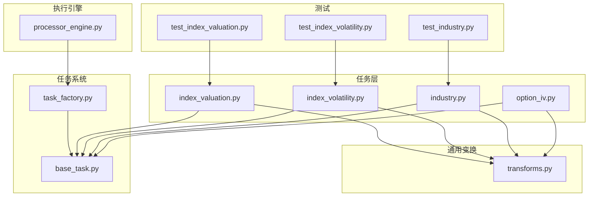
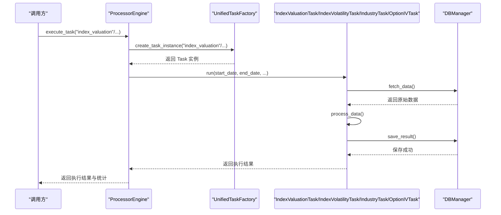
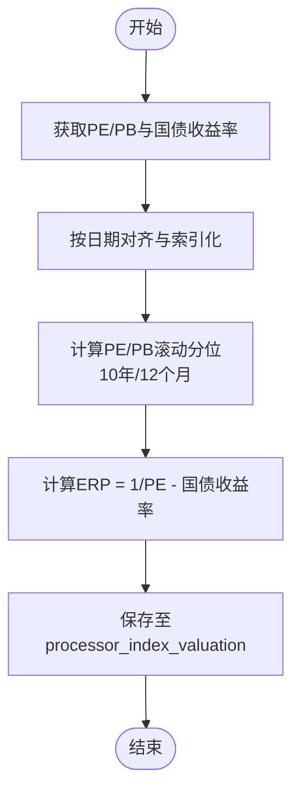
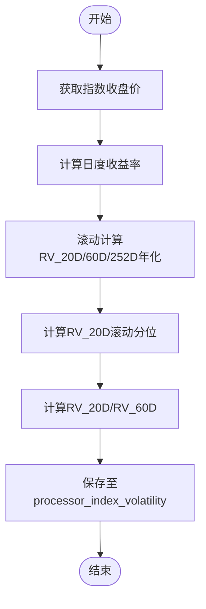
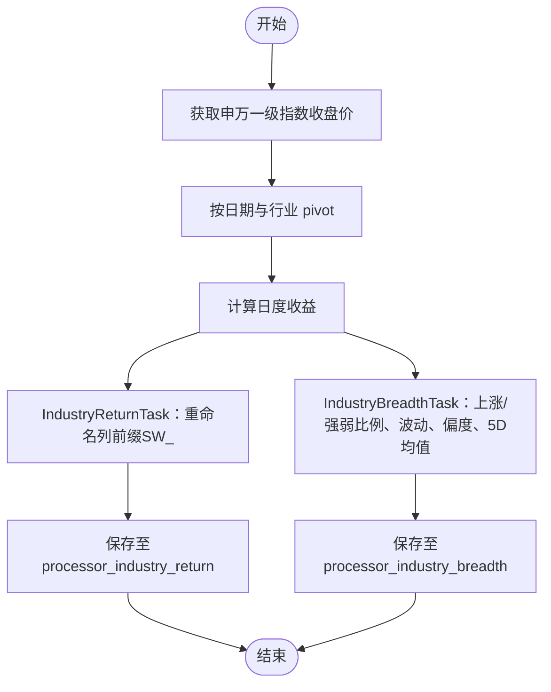
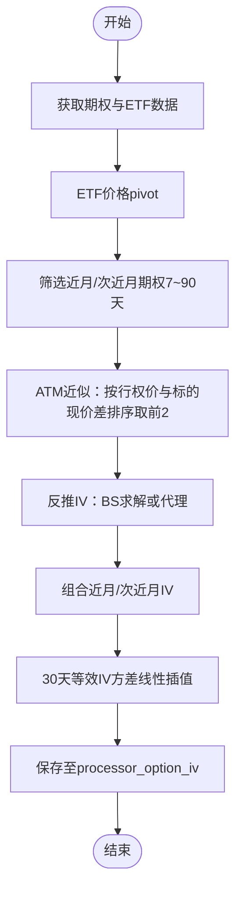
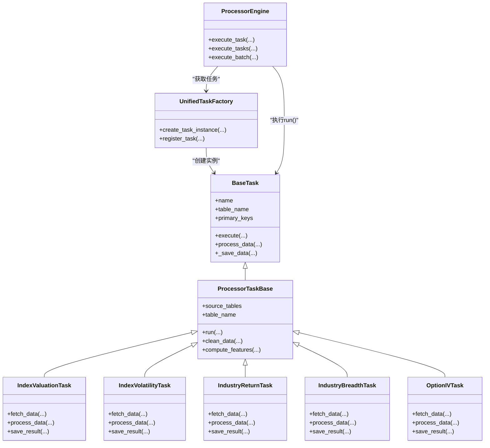

# 指数处理任务

<cite>
**本文引用的文件**
- [index_valuation.py](file://alphahome/processors/tasks/index/index_valuation.py)
- [index_volatility.py](file://alphahome/processors/tasks/index/index_volatility.py)
- [industry.py](file://alphahome/processors/tasks/index/industry.py)
- [option_iv.py](file://alphahome/processors/tasks/index/option_iv.py)
- [processor_engine.py](file://alphahome/processors/engine/processor_engine.py)
- [base_task.py](file://alphahome/common/task_system/base_task.py)
- [task_factory.py](file://alphahome/common/task_system/task_factory.py)
- [transforms.py](file://alphahome/processors/operations/transforms.py)
- [test_index_valuation.py](file://alphahome/processors/tests/test_index_valuation.py)
- [test_index_volatility.py](file://alphahome/processors/tests/test_index_volatility.py)
- [test_industry.py](file://alphahome/processors/tests/test_industry.py)
</cite>

## 目录
1. [简介](#简介)
2. [项目结构](#项目结构)
3. [核心组件](#核心组件)
4. [架构总览](#架构总览)
5. [详细组件分析](#详细组件分析)
6. [依赖关系分析](#依赖关系分析)
7. [性能考量](#性能考量)
8. [故障排查指南](#故障排查指南)
9. [结论](#结论)
10. [附录](#附录)

## 简介
本文件围绕指数处理任务展开，重点说明以下四类任务的实现与应用：
- index_valuation：计算核心指数的市盈率（PE）、市净率（PB）、滚动分位与 ERP，并写入 feature 层。
- index_volatility：基于指数收盘价计算历史波动率（RV）与滚动分位、长短比率等特征。
- industry：构建行业分类收益与宽度特征（申万一级）。
- option_iv：在衍生品特征中计算近月/次近月 ATM 隐含波动率（IV）及简化 VIX 类指标。

文档还将展示这些任务如何通过 ProcessorEngine 调度执行、如何定义输入输出表依赖、如何配置更新策略（全量/增量），以及它们在指数投资策略开发中的典型应用场景。

## 项目结构
指数处理任务位于 processors/tasks/index 下，分别对应四个任务模块；执行引擎位于 processors/engine；任务系统与工厂位于 common/task_system；通用变换函数位于 processors/operations；测试位于 processors/tests。

图表来源
- [index_valuation.py](file://alphahome/processors/tasks/index/index_valuation.py#L1-L177)
- [index_volatility.py](file://alphahome/processors/tasks/index/index_volatility.py#L1-L123)
- [industry.py](file://alphahome/processors/tasks/index/industry.py#L1-L144)
- [option_iv.py](file://alphahome/processors/tasks/index/option_iv.py#L1-L243)
- [processor_engine.py](file://alphahome/processors/engine/processor_engine.py#L1-L597)
- [base_task.py](file://alphahome/common/task_system/base_task.py#L1-L800)
- [task_factory.py](file://alphahome/common/task_system/task_factory.py#L1-L354)
- [transforms.py](file://alphahome/processors/operations/transforms.py#L1-L200)
- [test_index_valuation.py](file://alphahome/processors/tests/test_index_valuation.py#L1-L62)
- [test_index_volatility.py](file://alphahome/processors/tests/test_index_volatility.py#L1-L44)
- [test_industry.py](file://alphahome/processors/tests/test_industry.py#L1-L68)

章节来源
- [index_valuation.py](file://alphahome/processors/tasks/index/index_valuation.py#L1-L177)
- [index_volatility.py](file://alphahome/processors/tasks/index/index_volatility.py#L1-L123)
- [industry.py](file://alphahome/processors/tasks/index/industry.py#L1-L144)
- [option_iv.py](file://alphahome/processors/tasks/index/option_iv.py#L1-L243)
- [processor_engine.py](file://alphahome/processors/engine/processor_engine.py#L1-L597)
- [base_task.py](file://alphahome/common/task_system/base_task.py#L1-L800)
- [task_factory.py](file://alphahome/common/task_system/task_factory.py#L1-L354)
- [transforms.py](file://alphahome/processors/operations/transforms.py#L1-L200)
- [test_index_valuation.py](file://alphahome/processors/tests/test_index_valuation.py#L1-L62)
- [test_index_volatility.py](file://alphahome/processors/tests/test_index_volatility.py#L1-L44)
- [test_industry.py](file://alphahome/processors/tests/test_industry.py#L1-L68)

## 核心组件
- index_valuation：从 tushare.index_dailybasic 与 akshare.macro_bond_rate 获取 PE/PB 与国债收益率，计算滚动分位与 ERP，并写入 processor_index_valuation。
- index_volatility：从 tushare.index_factor_pro 获取指数收盘价，计算 RV_20D/60D/252D、滚动分位与长短比率，并写入 processor_index_volatility。
- industry：从 tushare.index_swdaily 与 tushare.index_swmember 获取申万一级指数收益与宽度指标，并写入 processor_industry_return 与 processor_industry_breadth。
- option_iv：从 tushare.option_daily/option_basic 与 tushare.fund_daily 获取期权与 ETF 价格，计算近月/次近月 ATM IV 与简化 VIX 类指标，并写入 processor_option_iv。

章节来源
- [index_valuation.py](file://alphahome/processors/tasks/index/index_valuation.py#L1-L177)
- [index_volatility.py](file://alphahome/processors/tasks/index/index_volatility.py#L1-L123)
- [industry.py](file://alphahome/processors/tasks/index/industry.py#L1-L144)
- [option_iv.py](file://alphahome/processors/tasks/index/option_iv.py#L1-L243)

## 架构总览
ProcessorEngine 负责任务调度、并发控制、依赖检查（预留）、执行监控与统计、错误处理与恢复、资源管理。任务通过 UnifiedTaskFactory 创建实例，注入 DBManager 与任务配置，然后由 Engine 统一执行。

图表来源
- [processor_engine.py](file://alphahome/processors/engine/processor_engine.py#L141-L242)
- [task_factory.py](file://alphahome/common/task_system/task_factory.py#L221-L272)
- [base_task.py](file://alphahome/common/task_system/base_task.py#L138-L239)
- [index_valuation.py](file://alphahome/processors/tasks/index/index_valuation.py#L50-L177)
- [index_volatility.py](file://alphahome/processors/tasks/index/index_volatility.py#L52-L123)
- [industry.py](file://alphahome/processors/tasks/index/industry.py#L34-L144)
- [option_iv.py](file://alphahome/processors/tasks/index/option_iv.py#L63-L243)

## 详细组件分析

### index_valuation：市盈率、市净率与 ERP
- 输入输出与依赖
  - 输入：tushare.index_dailybasic（pe_ttm/pb）、akshare.macro_bond_rate（10年期国债收益率）
  - 输出：processor_index_valuation（按 trade_date 主键）
  - 依赖：source_tables = ["tushare.index_dailybasic","akshare.macro_bond_rate"]，primary_keys = ["trade_date"]
- 计算逻辑
  - 逐指数对齐 PE/PB，计算 10 年与 12 个月滚动分位（使用 rolling_percentile）
  - 计算 ERP = 1/PE - 国债收益率（收益率转换为小数）
- 保存策略
  - 使用 save_result 将结果按 trade_date 主键写入目标表，use_insert_mode=False（默认 UPSERT）

图表来源
- [index_valuation.py](file://alphahome/processors/tasks/index/index_valuation.py#L50-L177)
- [transforms.py](file://alphahome/processors/operations/transforms.py#L188-L200)

章节来源
- [index_valuation.py](file://alphahome/processors/tasks/index/index_valuation.py#L1-L177)
- [transforms.py](file://alphahome/processors/operations/transforms.py#L188-L200)
- [test_index_valuation.py](file://alphahome/processors/tests/test_index_valuation.py#L1-L62)

### index_volatility：历史波动率与滚动分位
- 输入输出与依赖
  - 输入：tushare.index_factor_pro（close）
  - 输出：processor_index_volatility（按 trade_date 主键）
  - 依赖：source_tables = ["tushare.index_factor_pro"]，primary_keys = ["trade_date"]
- 计算逻辑
  - 对每个指数计算日度收益率，滚动计算 RV_20D/60D/252D（年化因子 252）
  - 计算 RV_20D 滚动分位与长短比率（RV_20D / RV_60D）
- 保存策略
  - 使用 save_result 将结果按 trade_date 主键写入目标表，use_insert_mode=False（默认 UPSERT）

图表来源
- [index_volatility.py](file://alphahome/processors/tasks/index/index_volatility.py#L52-L123)
- [transforms.py](file://alphahome/processors/operations/transforms.py#L188-L200)

章节来源
- [index_volatility.py](file://alphahome/processors/tasks/index/index_volatility.py#L1-L123)
- [test_index_volatility.py](file://alphahome/processors/tests/test_index_volatility.py#L1-L44)

### industry：行业收益与宽度
- 行业收益（IndustryReturnTask）
  - 输入：tushare.index_swdaily（close），限定 ts_code 来源于 tushare.index_swmember 的 L1 代码
  - 输出：processor_industry_return（按 trade_date 主键）
  - 计算：pivot 到日期×行业，计算日度收益并重命名列前缀 SW_
- 行业宽度（IndustryBreadthTask）
  - 输入：同上
  - 输出：processor_industry_breadth（按 trade_date 主键）
  - 计算：基于日度收益计算上涨比例、强弱比例、收益波动与偏度，以及 5 日上涨比例移动平均

图表来源
- [industry.py](file://alphahome/processors/tasks/index/industry.py#L34-L144)

章节来源
- [industry.py](file://alphahome/processors/tasks/index/industry.py#L1-L144)
- [test_industry.py](file://alphahome/processors/tests/test_industry.py#L1-L68)

### option_iv：衍生品特征（期权隐含波动率）
- 输入输出与依赖
  - 输入：tushare.option_daily/option_basic（期权价格、行权价、到期日）、tushare.fund_daily（ETF 价格）
  - 输出：processor_option_iv（按 trade_date 主键）
  - 依赖：source_tables = ["tushare.option_daily","tushare.option_basic","tushare.fund_daily"]，primary_keys = ["trade_date"]
- 计算逻辑
  - 基于标的映射（期权代码→聚合标的+ETF），筛选近月/次近月期权（到期日 7~90 天）
  - ATM 近似：按交易日对行权价与 ETF 现价差值排序取前 2 个，计算 IV
  - 若 scipy 可用则用 Brentq 求解 Black-Scholes；否则使用价格/行权价比代理
  - 计算 30 天等效 IV（基于方差线性插值）与简化 VIX（近月/次近月平均）
- 保存策略
  - 使用 save_result 将结果按 trade_date 主键写入目标表，use_insert_mode=False（默认 UPSERT）

图表来源
- [option_iv.py](file://alphahome/processors/tasks/index/option_iv.py#L63-L243)

章节来源
- [option_iv.py](file://alphahome/processors/tasks/index/option_iv.py#L1-L243)

## 依赖关系分析
- 任务注册与工厂
  - 任务通过装饰器自动注册到 UnifiedTaskFactory，Engine 通过工厂创建任务实例并注入 DBManager 与任务配置。
- 任务基类
  - BaseTask 定义了统一的执行生命周期（fetch/process/validate/save），支持多源数据获取、验证、分批保存、UPSERT/INSERT 策略。
- 通用变换
  - rolling_percentile 等变换函数在多个任务中复用，保证输出形状与数值范围符合预期。

图表来源
- [base_task.py](file://alphahome/common/task_system/base_task.py#L1-L800)
- [index_valuation.py](file://alphahome/processors/tasks/index/index_valuation.py#L1-L177)
- [index_volatility.py](file://alphahome/processors/tasks/index/index_volatility.py#L1-L123)
- [industry.py](file://alphahome/processors/tasks/index/industry.py#L1-L144)
- [option_iv.py](file://alphahome/processors/tasks/index/option_iv.py#L1-L243)
- [processor_engine.py](file://alphahome/processors/engine/processor_engine.py#L1-L597)
- [task_factory.py](file://alphahome/common/task_system/task_factory.py#L1-L354)

章节来源
- [base_task.py](file://alphahome/common/task_system/base_task.py#L1-L800)
- [task_factory.py](file://alphahome/common/task_system/task_factory.py#L1-L354)
- [processor_engine.py](file://alphahome/processors/engine/processor_engine.py#L1-L597)

## 性能考量
- 并发与超时
  - ProcessorEngine 使用 asyncio.Semaphore 控制并发数，支持超时保护，避免长时间阻塞。
- 分批保存
  - BaseTask 默认分批保存（默认批次大小），减少内存占用与数据库压力。
- 滚动窗口与回溯
  - 增量计算时应考虑滚动窗口回溯（如 lookback_days），确保滚动统计正确。
- 数据对齐与清洗
  - 通过 DataAligner/Standardizer/LineageTracker 等组件进行最佳努力对齐与标准化，降低异常数据影响。

章节来源
- [processor_engine.py](file://alphahome/processors/engine/processor_engine.py#L378-L424)
- [base_task.py](file://alphahome/common/task_system/base_task.py#L555-L784)

## 故障排查指南
- 依赖检查未实现
  - ProcessorEngine 的依赖检查目前为预留扩展点，尚未实现实际依赖验证，需在任务层面自行保证数据依赖顺序。
- 数据为空
  - 各任务在 fetch_data 返回空时会返回空结果，save_result 会记录警告；检查源表是否存在、SQL 条件是否过严。
- 保存策略
  - 若未定义 primary_keys，将使用简单 COPY 插入，可能产生重复；建议在任务中设置 primary_keys 并使用 UPSERT。
- 期权 IV 求解
  - 若 scipy 不可用或反推失败，将回退为代理 IV；可检查期权数据质量与到期日筛选条件。

章节来源
- [processor_engine.py](file://alphahome/processors/engine/processor_engine.py#L325-L362)
- [base_task.py](file://alphahome/common/task_system/base_task.py#L555-L784)
- [option_iv.py](file://alphahome/processors/tasks/index/option_iv.py#L194-L243)

## 结论
上述四个指数处理任务覆盖了估值、波动率、行业与衍生品特征的关键维度，具备清晰的输入输出依赖与可配置的保存策略。通过 ProcessorEngine 与 UnifiedTaskFactory，任务可被灵活调度与并发执行。在指数投资策略开发中，index_valuation 的 ERP 与分位、index_volatility 的 RV 与长短比率、industry 的收益与宽度、option_iv 的 IV 与简化 VIX，均可作为择时、风格轮动与风险对冲的重要信号源。

## 附录

### 任务调度与执行示例（路径引用）
- 执行单个任务
  - [engine.execute_task](file://alphahome/processors/engine/processor_engine.py#L141-L242)
- 批量执行多个任务
  - [engine.execute_tasks](file://alphahome/processors/engine/processor_engine.py#L243-L311)
- 通过工厂创建任务实例
  - [factory.create_task_instance](file://alphahome/common/task_system/task_factory.py#L221-L272)
- 任务生命周期（fetch/process/validate/save）
  - [base_task.execute](file://alphahome/common/task_system/base_task.py#L138-L239)

### 更新策略与增量回溯
- 增量计算约定
  - 增量计算时应回溯 max(window) 天以确保滚动计算正确；可在 run 时传入 lookback_days。
- 保存策略
  - 未定义 primary_keys 时使用 INSERT 模式；定义 primary_keys 时使用 UPSERT 模式。
- 保存批次
  - 默认批次大小为 10000，可通过任务配置覆盖。

章节来源
- [base_task.py](file://alphahome/common/task_system/base_task.py#L494-L621)
- [base_task.py](file://alphahome/common/task_system/base_task.py#L555-L784)