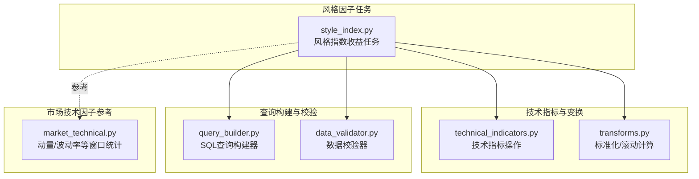
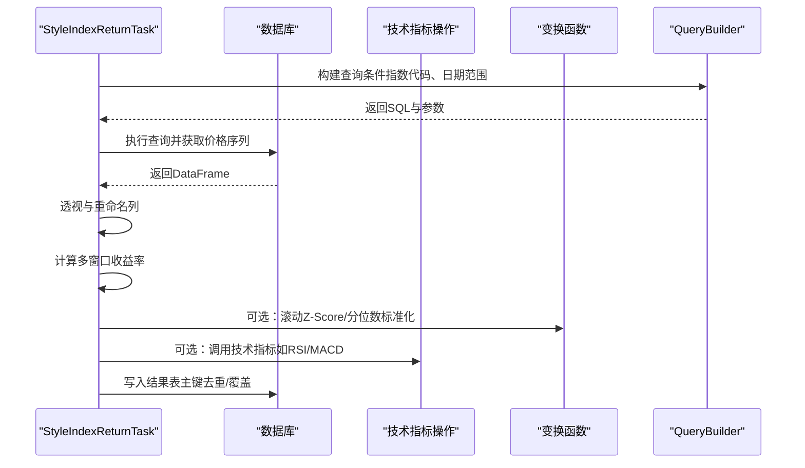
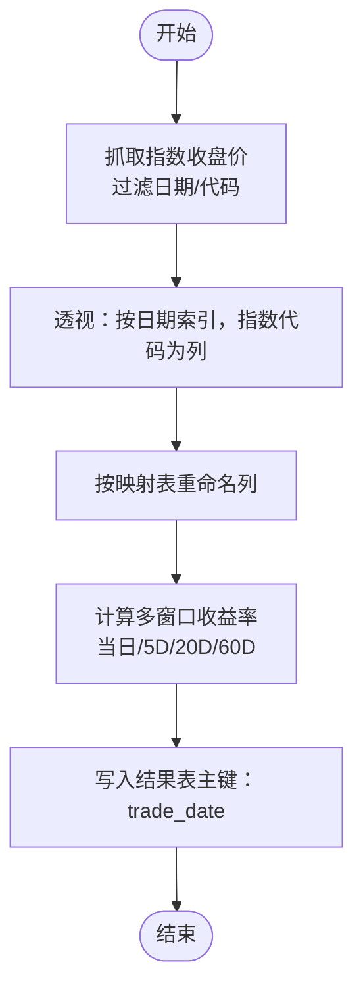
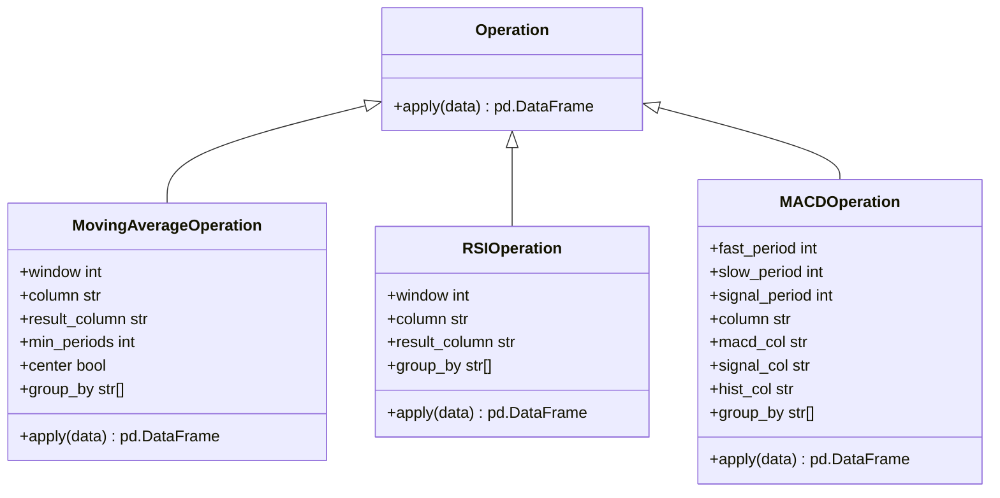
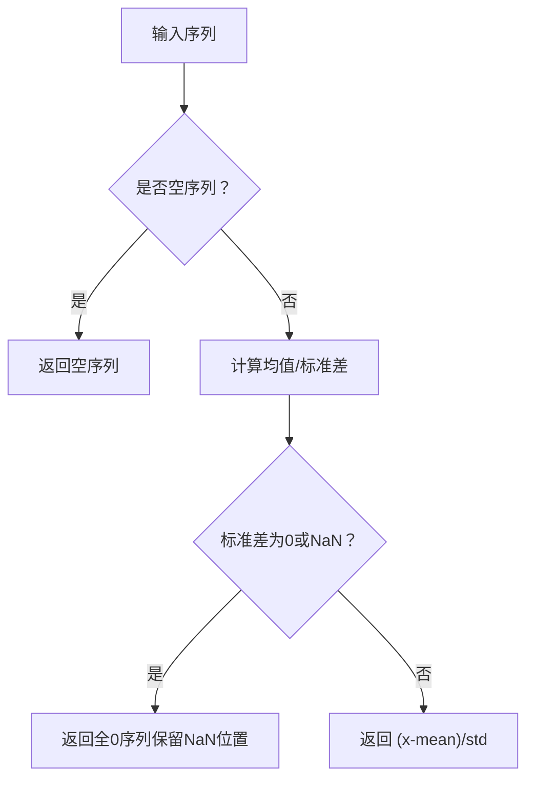
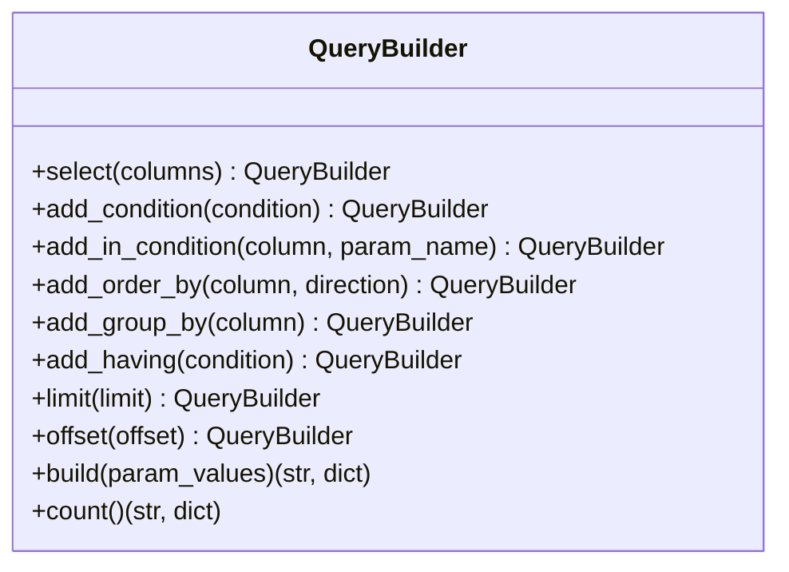
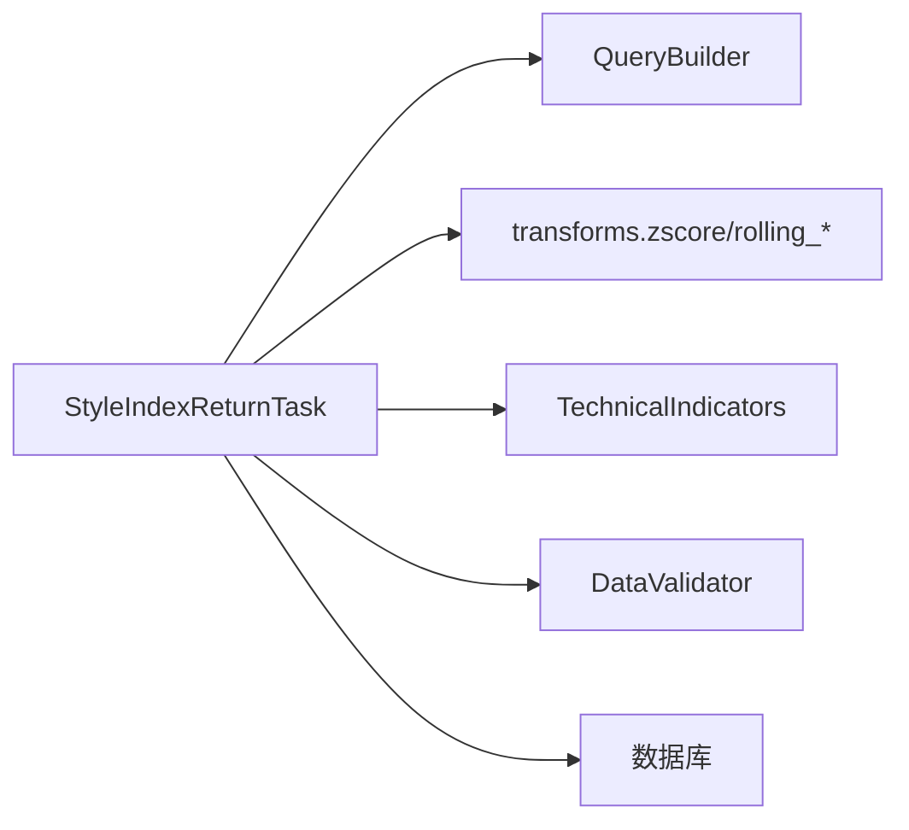

# 风格因子处理任务

<cite>
**本文引用的文件**
- [style_index.py](file://alphahome/processors/tasks/style/style_index.py)
- [technical_indicators.py](file://alphahome/processors/operations/technical_indicators.py)
- [query_builder.py](file://alphahome/processors/utils/query_builder.py)
- [transforms.py](file://alphahome/processors/operations/transforms.py)
- [data_validator.py](file://alphahome/processors/utils/data_validator.py)
- [market_technical.py](file://alphahome/processors/taks/market/market_technical.py)
- [test_style_index.py](file://alphahome/processors/tests/test_style_index.py)
</cite>

## 目录
1. [简介](#简介)
2. [项目结构](#项目结构)
3. [核心组件](#核心组件)
4. [架构总览](#架构总览)
5. [详细组件分析](#详细组件分析)
6. [依赖关系分析](#依赖关系分析)
7. [性能考量](#性能考量)
8. [故障排查指南](#故障排查指南)
9. [结论](#结论)

## 简介
本文件围绕“风格因子处理任务”展开，重点解析 style_index.py 如何实现 Barra 等风格因子（如市值、动量、波动率）的计算流程，涵盖数据预处理、去极值、标准化（Z-Score）等关键步骤；说明该任务如何调用 technical_indicators.py 中的基础计算函数，以及如何使用 query_builder.py 构建复杂 SQL 查询；阐述风格因子在多因子模型中的应用，并给出确保因子计算的时效性和一致性的实践建议。

## 项目结构
风格因子处理位于处理器层（processors），具体分布在 tasks/style 与 operations/technical_indicators、utils/query_builder、operations/transforms、utils/data_validator 等模块之间形成协作关系。测试用例位于 processors/tests 下，验证风格指数收益任务的行为。

图表来源
- [style_index.py](file://alphahome/processors/tasks/style/style_index.py#L1-L103)
- [technical_indicators.py](file://alphahome/processors/operations/technical_indicators.py#L1-L361)
- [transforms.py](file://alphahome/processors/operations/transforms.py#L1-L200)
- [query_builder.py](file://alphahome/processors/utils/query_builder.py#L1-L229)
- [data_validator.py](file://alphahome/processors/utils/data_validator.py#L1-L379)
- [market_technical.py](file://alphahome/processors/taks/market/market_technical.py#L137-L320)

章节来源
- [style_index.py](file://alphahome/processors/tasks/style/style_index.py#L1-L103)
- [technical_indicators.py](file://alphahome/processors/operations/technical_indicators.py#L1-L361)
- [transforms.py](file://alphahome/processors/operations/transforms.py#L1-L200)
- [query_builder.py](file://alphahome/processors/utils/query_builder.py#L1-L229)
- [data_validator.py](file://alphahome/processors/utils/data_validator.py#L1-L379)
- [market_technical.py](file://alphahome/processors/taks/market/market_technical.py#L137-L320)

## 核心组件
- 风格指数收益任务（StyleIndexReturnTask）
  - 负责从指定源表读取风格指数的日线收盘价，按交易日透视并计算多窗口收益率（当日、5日、20日、60日），并将结果写回目标表。
  - 关键职责：数据抓取、数据清洗与重排、多窗口收益计算、结果持久化。
- 技术指标操作（MovingAverageOperation、RSIOperation、MACDOperation）
  - 提供移动平均、RSI、MACD 等技术指标的计算能力，支持按分组（如 ts_code）滚动计算，便于在更高层的任务中复用。
- 标准化与滚动变换（zscore、rolling_zscore、rolling_percentile）
  - 提供 Z-Score 标准化、滚动 Z-Score、滚动百分位等通用变换，具备零方差保护与索引对齐等稳健性设计。
- SQL 查询构建器（QueryBuilder）
  - 提供链式构建 WHERE、IN、ORDER BY、GROUP BY、LIMIT/OFFSET 等子句的能力，支持参数化查询，便于在任务中构造复杂查询。
- 数据校验器（DataValidator）
  - 在清洗层对 DataFrame 进行列类型、必填字段、取值范围等校验，保证数据质量，减少下游异常传播。
- 市场技术因子参考（动量/波动率窗口统计）
  - 展示了在 SQL 层通过窗口函数计算动量与波动率的实现方式，为风格因子标准化与去极值提供参考。

章节来源
- [style_index.py](file://alphahome/processors/tasks/style/style_index.py#L1-L103)
- [technical_indicators.py](file://alphahome/processors/operations/technical_indicators.py#L1-L361)
- [transforms.py](file://alphahome/processors/operations/transforms.py#L1-L200)
- [query_builder.py](file://alphahome/processors/utils/query_builder.py#L1-L229)
- [data_validator.py](file://alphahome/processors/utils/data_validator.py#L1-L379)
- [market_technical.py](file://alphahome/processors/taks/market/market_technical.py#L137-L320)

## 架构总览
风格因子处理任务的端到端流程如下：
- 数据抓取：根据配置的指数代码集合，使用 SQL 查询构建器或直接拼接 SQL 获取历史价格序列。
- 数据清洗：将时间维度透视、重命名列、统一数值类型，确保后续计算稳定。
- 因子计算：基于收盘价计算多窗口收益率；若需进一步风格因子（如动量、波动率、市值等），可在更高层任务中引入技术指标与窗口统计。
- 标准化与去极值：对因子进行 Z-Score 标准化与滚动 Z-Score，必要时采用分位数截断或 IQR 方法去除极端值。
- 结果落库：将结果写入目标表，主键约束确保幂等更新。

图表来源
- [style_index.py](file://alphahome/processors/tasks/style/style_index.py#L46-L103)
- [technical_indicators.py](file://alphahome/processors/operations/technical_indicators.py#L1-L361)
- [transforms.py](file://alphahome/processors/operations/transforms.py#L1-L200)
- [query_builder.py](file://alphahome/processors/utils/query_builder.py#L1-L229)

## 详细组件分析

### 风格指数收益任务（StyleIndexReturnTask）
- 数据抓取
  - 通过配置的指数映射表获取目标指数代码集合，构造 IN 条件并限定日期范围，查询收盘价序列。
  - 返回的 DataFrame 统一日期与数值类型，便于后续处理。
- 数据处理
  - 将 ts_code 作为列名，trade_date 作为索引进行透视，按映射表重命名列名。
  - 对每个指数序列分别计算当日、5日、20日、60日的百分比变化作为多窗口收益率。
- 结果保存
  - 将 trade_date 转为字符串格式，按主键（trade_date）执行非插入模式写入，确保幂等性。

图表来源
- [style_index.py](file://alphahome/processors/tasks/style/style_index.py#L46-L103)

章节来源
- [style_index.py](file://alphahome/processors/tasks/style/style_index.py#L1-L103)
- [test_style_index.py](file://alphahome/processors/tests/test_style_index.py#L1-L44)

### 技术指标操作（MovingAverageOperation、RSIOperation、MACDOperation）
- 设计要点
  - 支持按分组（如 ts_code）滚动计算，保证跨分组独立性。
  - 自动检查输入列存在性与分组列合法性，失败时记录错误并返回原数据。
  - 对时间序列进行排序（若存在日期列），确保滚动计算顺序正确。
- 适用场景
  - 在更高层的风格因子任务中，可复用这些操作生成动量、趋势强度等中间变量，再进行标准化与合成。

图表来源
- [technical_indicators.py](file://alphahome/processors/operations/technical_indicators.py#L1-L361)

章节来源
- [technical_indicators.py](file://alphahome/processors/operations/technical_indicators.py#L1-L361)

### 标准化与滚动变换（zscore、rolling_zscore、rolling_percentile）
- Z-Score 标准化
  - 处理零方差与近零方差的边界情况，返回全零序列而非 NaN/inf，同时保留原始 NaN 位置。
- 滚动 Z-Score
  - 使用滚动均值与滚动标准差，零方差位置返回 0，避免早期窗口产生伪信号。
- 滚动百分位
  - 提供滚动窗口内的百分位排名，输出范围在 [0,1]，便于跨时间窗口比较。

图表来源
- [transforms.py](file://alphahome/processors/operations/transforms.py#L1-L200)

章节来源
- [transforms.py](file://alphahome/processors/operations/transforms.py#L1-L200)

### SQL 查询构建器（QueryBuilder）
- 能力概述
  - 支持 select、add_condition、add_in_condition、add_order_by、add_group_by、add_having、limit、offset 等子句链式构建。
  - 支持参数化查询，自动移除参数名前缀以适配驱动。
  - 提供 count 查询生成器，便于统计结果集规模。
- 实践建议
  - 在任务中优先使用该构建器，避免手写 SQL 导致的注入风险与维护成本。
  - 对 IN 条件使用 add_in_condition，传入参数数组，提升可读性与安全性。

图表来源
- [query_builder.py](file://alphahome/processors/utils/query_builder.py#L1-L229)

章节来源
- [query_builder.py](file://alphahome/processors/utils/query_builder.py#L1-L229)

### 数据校验器（DataValidator）
- 能力概述
  - 校验列类型、必填字段、取值范围，检测重复记录，支持添加校验标志列。
  - 不会静默丢弃列，保证数据血缘清晰。
- 实践建议
  - 在清洗层对输入 DataFrame 进行严格校验，提前暴露异常，降低下游处理风险。

章节来源
- [data_validator.py](file://alphahome/processors/utils/data_validator.py#L1-L379)

### 市场技术因子参考（动量/波动率窗口统计）
- 参考实现展示了在 SQL 层通过窗口函数计算动量与波动率的方式，包括：
  - 多窗口动量（5日、10日、20日、60日）与动量强度（正动量比例）、强/弱动量股票比例。
  - 年化波动率（20日、60日）与高/低波动股票比例。
  - 量比分布与价量背离强度等。
- 对风格因子的意义
  - 为风格因子标准化与合成提供窗口统计基础，便于在更高层任务中进行 Z-Score 或滚动 Z-Score 处理。

章节来源
- [market_technical.py](file://alphahome/processors/taks/market/market_technical.py#L137-L320)

## 依赖关系分析
- 组件耦合
  - StyleIndexReturnTask 与技术指标操作、变换函数、查询构建器、数据校验器之间为松耦合的工具函数调用关系。
  - 技术指标操作与变换函数彼此独立，便于在不同任务中复用。
- 外部依赖
  - 数据库访问通过任务基类提供的 db 接口完成，SQL 查询通过 QueryBuilder 生成。
  - 测试用例通过 DummyDB 验证任务行为，确保空数据与正常数据路径均能正确处理。

图表来源
- [style_index.py](file://alphahome/processors/tasks/style/style_index.py#L1-L103)
- [query_builder.py](file://alphahome/processors/utils/query_builder.py#L1-L229)
- [transforms.py](file://alphahome/processors/operations/transforms.py#L1-L200)
- [technical_indicators.py](file://alphahome/processors/operations/technical_indicators.py#L1-L361)
- [data_validator.py](file://alphahome/processors/utils/data_validator.py#L1-L379)

章节来源
- [style_index.py](file://alphahome/processors/tasks/style/style_index.py#L1-L103)
- [test_style_index.py](file://alphahome/processors/tests/test_style_index.py#L1-L44)

## 性能考量
- 数据抓取
  - 使用 IN 条件批量拉取指数序列，避免多次往返；合理设置日期范围，减少无关数据传输。
- 计算路径
  - 优先使用向量化与滚动函数，避免显式循环；对空序列快速返回，减少无效计算。
- 标准化与滚动
  - 滚动 Z-Score 设置合理的 min_periods，避免早期窗口产生伪信号；对零方差位置进行特殊处理，确保稳定性。
- 写入策略
  - 使用主键约束进行幂等写入，避免重复数据；批量写入可结合数据库事务优化吞吐。

## 故障排查指南
- 常见问题
  - 空数据：任务对空数据有明确分支，返回空 DataFrame 并记录警告；确认查询条件与日期范围是否正确。
  - 列缺失：技术指标操作在列不存在时会记录错误并返回原数据；检查输入列名与分组列是否一致。
  - 异常值：可使用滚动百分位或 IQR 方法进行去极值；或在清洗层使用 DataValidator 的范围检查。
  - 标准化异常：零方差导致的 inf/NaN 已在 zscore/rolling_zscore 中处理为 0；若仍出现异常，检查输入序列是否全部相同或存在 NaN。
- 定位手段
  - 单元测试覆盖了多窗口收益列的存在性与无穷值检查，可作为回归验证的依据。
  - 在任务中增加日志级别，关注每一步的计算结果数量与空值占比。

章节来源
- [test_style_index.py](file://alphahome/processors/tests/test_style_index.py#L1-L44)
- [technical_indicators.py](file://alphahome/processors/operations/technical_indicators.py#L1-L361)
- [data_validator.py](file://alphahome/processors/utils/data_validator.py#L1-L379)
- [transforms.py](file://alphahome/processors/operations/transforms.py#L1-L200)

## 结论
风格因子处理任务通过“数据抓取—清洗—多窗口收益计算—标准化—落库”的流水线，实现了对风格指数收益的高效产出。借助技术指标与变换函数，可进一步拓展至动量、波动率、市值等风格因子；通过 QueryBuilder 构建安全、可维护的 SQL，配合 DataValidator 的数据质量保障，确保因子计算的时效性与一致性。在多因子模型中，标准化与滚动标准化是风格因子合成的关键步骤，应结合业务需求选择合适的窗口与阈值，持续监控与回归测试以维持稳定性。