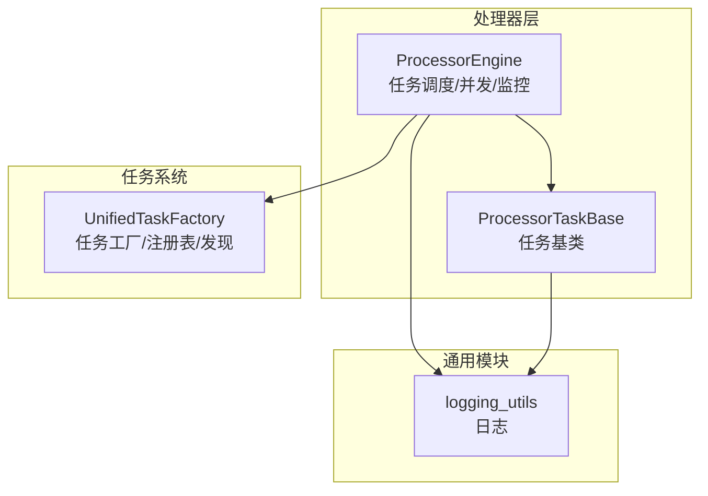
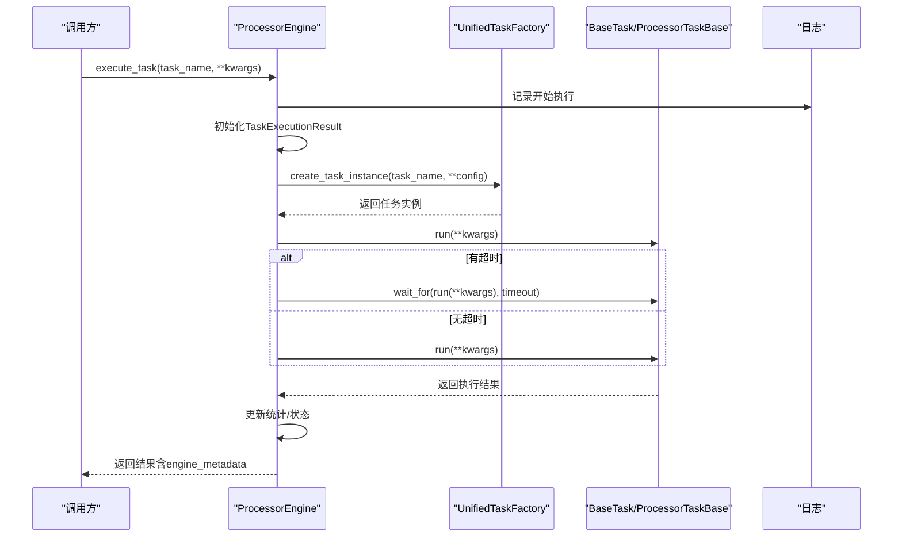
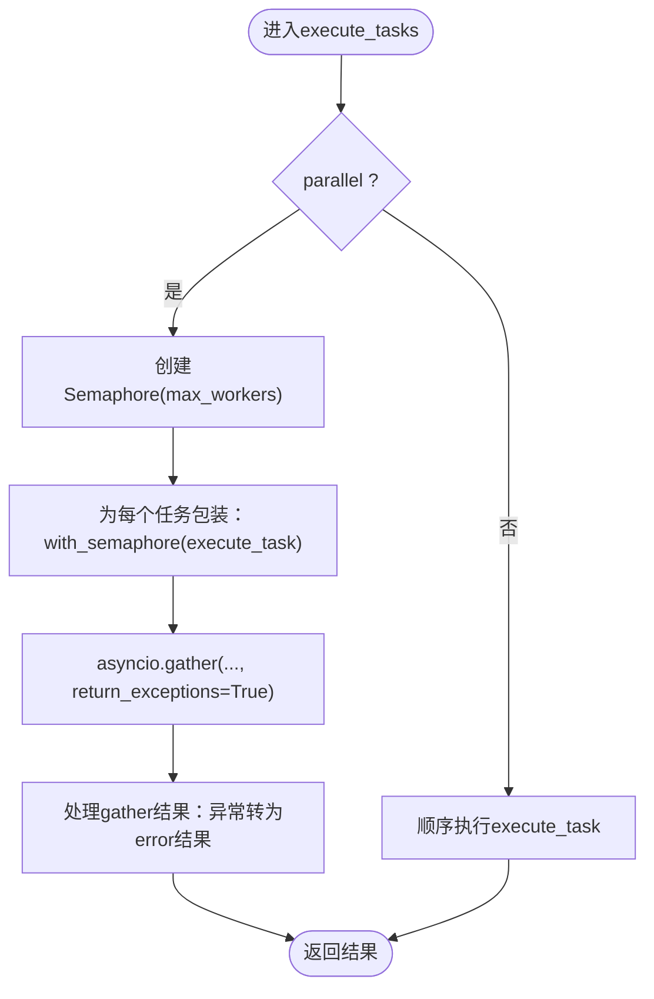
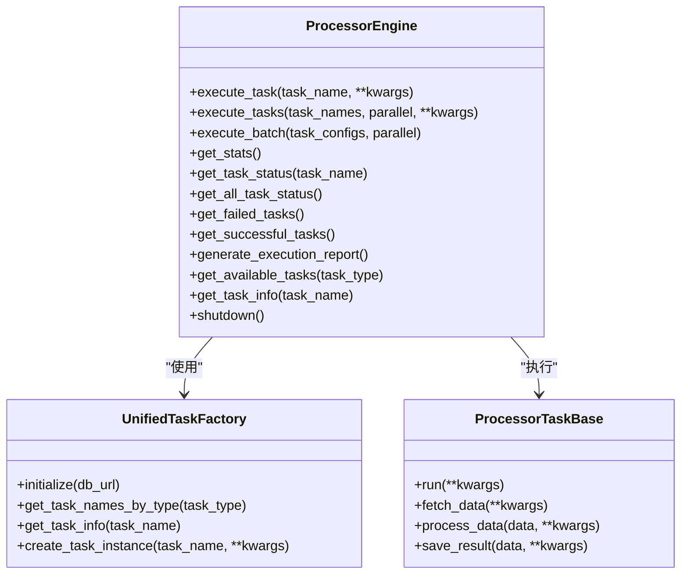

# 处理引擎（Processor Engine）

<cite>
**本文引用的文件**
- [processor_engine.py](file://alphahome/processors/engine/processor_engine.py)
- [task_factory.py](file://alphahome/common/task_system/task_factory.py)
- [base_task.py](file://alphahome/processors/tasks/base_task.py)
- [test_processor_engine.py](file://alphahome/processors/tests/test_processor_engine.py)
- [usage_example.py](file://alphahome/processors/examples/usage_example.py)
</cite>

## 目录
1. [简介](#简介)
2. [项目结构](#项目结构)
3. [核心组件](#核心组件)
4. [架构总览](#架构总览)
5. [详细组件分析](#详细组件分析)
6. [依赖关系分析](#依赖关系分析)
7. [性能考量](#性能考量)
8. [故障排查指南](#故障排查指南)
9. [结论](#结论)
10. [附录](#附录)

## 简介
本文件面向ProcessorEngine（处理引擎）的架构文档，聚焦其作为数据处理任务调度中枢的设计与实现。内容涵盖：
- 任务调度与执行流程
- 并发控制（通过asyncio.Semaphore）
- 执行监控与统计
- 与UnifiedTaskFactory的集成及任务发现
- 核心方法execute_task、execute_tasks、execute_batch的实现细节与异常/超时处理
- TaskExecutionResult数据类与任务状态追踪机制（_task_status）
- 执行报告生成
- 初始化与使用示例
- 线程池兼容性设计

## 项目结构
ProcessorEngine位于处理器层，负责任务的编排、并发控制、监控与统计；其与任务系统（UnifiedTaskFactory）协作，通过任务注册表发现可用任务；任务实现继承自ProcessorTaskBase，遵循fetch/clean/feature/save的流水线。

图表来源
- [processor_engine.py](file://alphahome/processors/engine/processor_engine.py#L141-L597)
- [task_factory.py](file://alphahome/common/task_system/task_factory.py#L1-L354)
- [base_task.py](file://alphahome/processors/tasks/base_task.py#L1-L686)

章节来源
- [processor_engine.py](file://alphahome/processors/engine/processor_engine.py#L141-L597)
- [task_factory.py](file://alphahome/common/task_system/task_factory.py#L1-L354)
- [base_task.py](file://alphahome/processors/tasks/base_task.py#L1-L686)

## 核心组件
- ProcessorEngine：处理引擎，负责任务调度、并发控制、执行监控、统计与报告生成。
- TaskExecutionResult：任务执行结果数据类，承载任务状态、耗时、行数、错误信息等。
- UnifiedTaskFactory：统一任务工厂，维护任务注册表、任务发现、任务实例创建。
- ProcessorTaskBase：任务基类，定义fetch/clean/feature/save流水线与run入口。

章节来源
- [processor_engine.py](file://alphahome/processors/engine/processor_engine.py#L24-L140)
- [task_factory.py](file://alphahome/common/task_system/task_factory.py#L1-L120)
- [base_task.py](file://alphahome/processors/tasks/base_task.py#L41-L120)

## 架构总览
ProcessorEngine通过UnifiedTaskFactory进行任务发现与实例化，任务实例由ProcessorTaskBase定义的run方法驱动执行。引擎内部使用asyncio.Semaphore控制并发，使用ThreadPoolExecutor保留线程池兼容性，并提供统计与状态追踪能力。

图表来源
- [processor_engine.py](file://alphahome/processors/engine/processor_engine.py#L141-L242)
- [task_factory.py](file://alphahome/common/task_system/task_factory.py#L221-L272)
- [base_task.py](file://alphahome/processors/tasks/base_task.py#L494-L621)

## 详细组件分析

### ProcessorEngine 类与生命周期
- 初始化：接收DBManager、max_workers、timeout、config；初始化统计、任务状态追踪、日志；保留ThreadPoolExecutor用于兼容性。
- 关闭：shutdown调用ThreadPoolExecutor的shutdown。
- 上下文管理：__enter__/__exit__自动关闭。

章节来源
- [processor_engine.py](file://alphahome/processors/engine/processor_engine.py#L107-L140)
- [processor_engine.py](file://alphahome/processors/engine/processor_engine.py#L587-L597)

### TaskExecutionResult 数据类
- 字段：task_name、status、rows_processed、execution_time、error_message、start_time、end_time、metadata。
- 方法：to_dict用于序列化。

章节来源
- [processor_engine.py](file://alphahome/processors/engine/processor_engine.py#L33-L57)

### 任务发现与工厂集成
- get_available_tasks：通过UnifiedTaskFactory.get_task_names_by_type按类型发现任务。
- get_task_info：通过UnifiedTaskFactory.get_task_info获取任务详细信息。
- _get_task_instance：通过UnifiedTaskFactory.create_task_instance创建一次性任务实例，注入db_connection、api_token、任务配置等。

章节来源
- [processor_engine.py](file://alphahome/processors/engine/processor_engine.py#L511-L542)
- [processor_engine.py](file://alphahome/processors/engine/processor_engine.py#L312-L323)
- [task_factory.py](file://alphahome/common/task_system/task_factory.py#L169-L183)
- [task_factory.py](file://alphahome/common/task_system/task_factory.py#L201-L218)
- [task_factory.py](file://alphahome/common/task_system/task_factory.py#L221-L272)

### 执行流程与并发控制
- execute_task：单任务执行入口，负责初始化TaskExecutionResult、依赖检查（预留）、调用任务run、更新统计与状态、返回结果（含engine_metadata）。
- execute_tasks：支持并行/顺序两种模式；并行模式使用asyncio.Semaphore控制max_workers；使用asyncio.gather(return_exceptions=True)保证单个任务失败不影响其他任务。
- execute_batch：批量执行，支持为每个任务传参；并行/顺序由parallel参数控制。

图表来源
- [processor_engine.py](file://alphahome/processors/engine/processor_engine.py#L243-L311)
- [processor_engine.py](file://alphahome/processors/engine/processor_engine.py#L378-L424)

章节来源
- [processor_engine.py](file://alphahome/processors/engine/processor_engine.py#L141-L242)
- [processor_engine.py](file://alphahome/processors/engine/processor_engine.py#L243-L311)
- [processor_engine.py](file://alphahome/processors/engine/processor_engine.py#L378-L424)

### 超时与异常处理
- 超时：_execute_single_task中使用asyncio.wait_for(task.run(**kwargs), timeout=self.timeout)；超时抛出异常。
- 异常：execute_task捕获异常，更新TaskExecutionResult.error_message，返回包含error字段的结果；execute_tasks中使用return_exceptions=True，避免单个任务异常影响整体gather。
- 依赖检查：当前为预留扩展点，记录日志，未实现实际依赖验证。

章节来源
- [processor_engine.py](file://alphahome/processors/engine/processor_engine.py#L363-L377)
- [processor_engine.py](file://alphahome/processors/engine/processor_engine.py#L218-L242)
- [processor_engine.py](file://alphahome/processors/engine/processor_engine.py#L325-L362)

### 执行监控与统计
- 统计字段：total_tasks、successful_tasks、failed_tasks、total_execution_time、start_time、last_execution；get_stats计算success_rate与average_execution_time。
- 状态追踪：_task_status字典维护TaskExecutionResult；提供get_task_status/get_all_task_status/get_failed_tasks/get_successful_tasks。
- 报告生成：generate_execution_report汇总摘要、失败任务列表、成功任务列表。

章节来源
- [processor_engine.py](file://alphahome/processors/engine/processor_engine.py#L120-L139)
- [processor_engine.py](file://alphahome/processors/engine/processor_engine.py#L440-L497)
- [processor_engine.py](file://alphahome/processors/engine/processor_engine.py#L547-L586)

### 线程池兼容性设计
- 内部保留ThreadPoolExecutor，提供_run_async_in_thread在同步场景中运行协程；shutdown方法关闭线程池；__exit__自动关闭。
- 该设计确保在需要同步调用异步逻辑的场景下仍可兼容。

章节来源
- [processor_engine.py](file://alphahome/processors/engine/processor_engine.py#L436-L440)
- [processor_engine.py](file://alphahome/processors/engine/processor_engine.py#L587-L597)

### 与任务系统的集成与任务流水线
- 任务基类ProcessorTaskBase定义run入口，实现fetch/clean/feature/save流水线；支持skip_features、feature_dependencies等约束。
- ProcessorEngine通过UnifiedTaskFactory创建任务实例，注入db_connection、api_token、任务配置等。

章节来源
- [base_task.py](file://alphahome/processors/tasks/base_task.py#L494-L621)
- [base_task.py](file://alphahome/processors/tasks/base_task.py#L1-L120)
- [task_factory.py](file://alphahome/common/task_system/task_factory.py#L221-L272)

## 依赖关系分析
- ProcessorEngine依赖：
  - UnifiedTaskFactory：任务发现与实例化
  - ProcessorTaskBase：任务run入口
  - logging_utils：日志
- ProcessorTaskBase依赖：
  - Clean/Align/Standardize/Lineage等Clean Layer组件（在基类中组合使用）
  - BaseTask（来自common.task_system）

图表来源
- [processor_engine.py](file://alphahome/processors/engine/processor_engine.py#L141-L597)
- [task_factory.py](file://alphahome/common/task_system/task_factory.py#L1-L354)
- [base_task.py](file://alphahome/processors/tasks/base_task.py#L494-L621)

章节来源
- [processor_engine.py](file://alphahome/processors/engine/processor_engine.py#L141-L597)
- [task_factory.py](file://alphahome/common/task_system/task_factory.py#L1-L354)
- [base_task.py](file://alphahome/processors/tasks/base_task.py#L494-L621)

## 性能考量
- 并发控制：通过asyncio.Semaphore限制最大并发数，避免过度竞争；execute_tasks并行模式下使用return_exceptions=True，提升鲁棒性。
- 统计与报告：get_stats计算平均耗时与成功率，便于性能评估；generate_execution_report便于快速定位失败任务。
- 超时控制：通过asyncio.wait_for在任务层面设置超时，防止长时间阻塞。
- 线程池：保留ThreadPoolExecutor，便于在需要同步包装异步逻辑时使用。

[本节为通用性能讨论，不直接分析具体文件]

## 故障排查指南
- 初始化问题：若未提供DBManager，初始化会抛出异常；确认DBManager已连接且UnifiedTaskFactory已初始化。
- 任务发现失败：get_available_tasks依赖UnifiedTaskFactory，若未初始化会返回空列表；检查factory初始化与注册。
- 任务执行失败：execute_task返回包含error字段的结果；get_failed_tasks可快速定位失败任务；generate_execution_report提供失败明细。
- 并行执行异常：execute_tasks使用return_exceptions=True，单个任务异常不会影响其他任务；如需严格一致性，可在上层逻辑中自行处理。
- 依赖检查：当前为预留扩展点，如需强依赖控制，可在_check_dependencies中实现依赖查询与验证。

章节来源
- [processor_engine.py](file://alphahome/processors/engine/processor_engine.py#L107-L140)
- [processor_engine.py](file://alphahome/processors/engine/processor_engine.py#L511-L542)
- [processor_engine.py](file://alphahome/processors/engine/processor_engine.py#L325-L362)
- [test_processor_engine.py](file://alphahome/processors/tests/test_processor_engine.py#L146-L175)
- [test_processor_engine.py](file://alphahome/processors/tests/test_processor_engine.py#L191-L201)

## 结论
ProcessorEngine以“任务调度中枢”为核心，围绕asyncio并发模型与统计/状态追踪机制，提供了高可靠的任务执行与监控能力。通过与UnifiedTaskFactory的紧密集成，实现了任务发现与实例化；通过ProcessorTaskBase的流水线设计，确保任务执行的一致性与可扩展性。其线程池兼容性设计进一步提升了在复杂运行环境下的适用性。

[本节为总结性内容，不直接分析具体文件]

## 附录

### 初始化与使用示例
- 初始化顺序建议：先创建DBManager并连接，再初始化UnifiedTaskFactory，最后创建ProcessorEngine。
- 单任务执行：通过execute_task传入任务名称与参数。
- 多任务执行：execute_tasks支持并行/顺序两种模式。
- 批量执行：execute_batch为每个任务提供独立参数。
- 生成报告：generate_execution_report汇总统计与失败明细。

章节来源
- [usage_example.py](file://alphahome/processors/examples/usage_example.py#L125-L177)
- [test_processor_engine.py](file://alphahome/processors/tests/test_processor_engine.py#L176-L214)
- [test_processor_engine.py](file://alphahome/processors/tests/test_processor_engine.py#L393-L414)
- [test_processor_engine.py](file://alphahome/processors/tests/test_processor_engine.py#L590-L630)