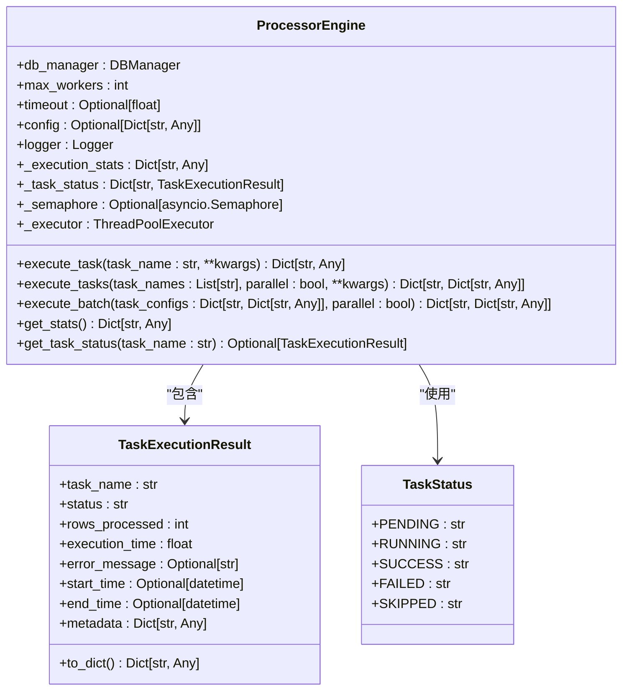
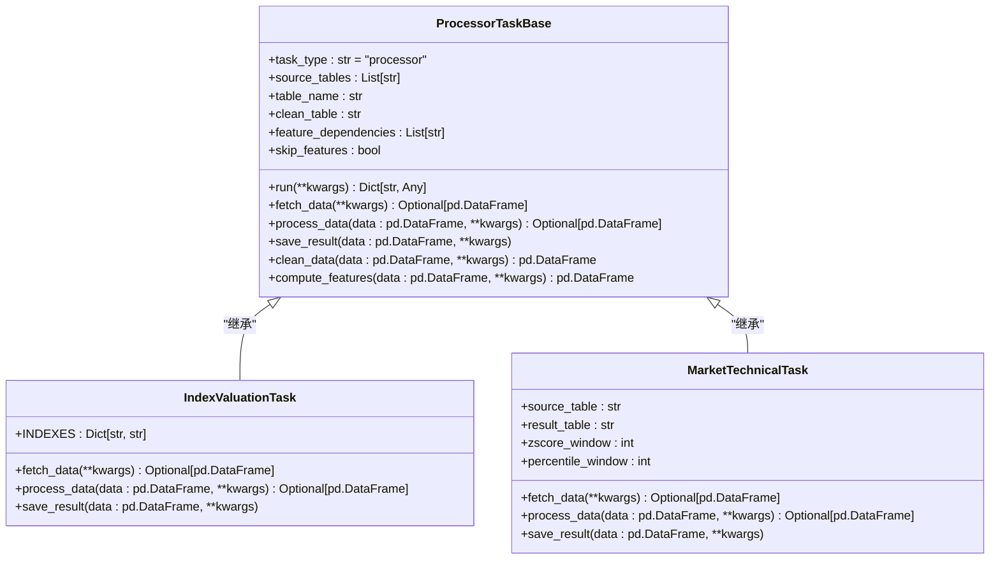
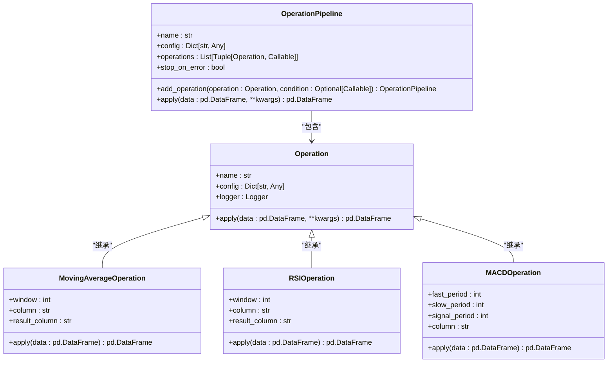
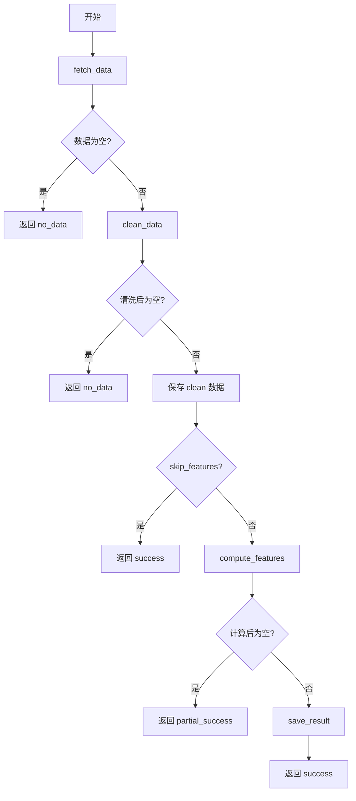
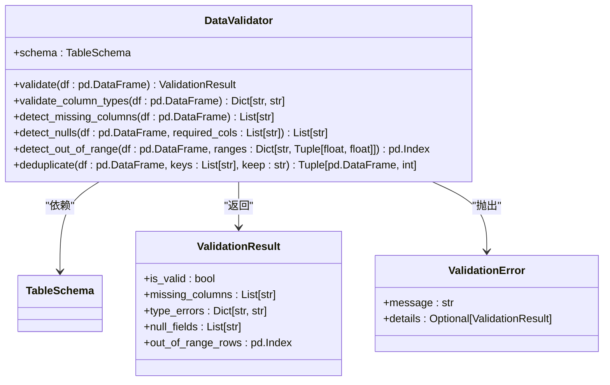
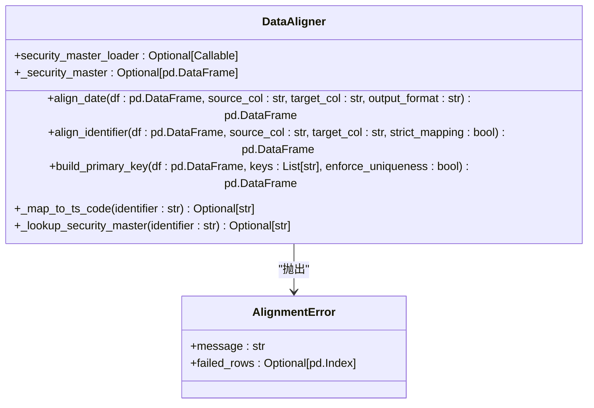
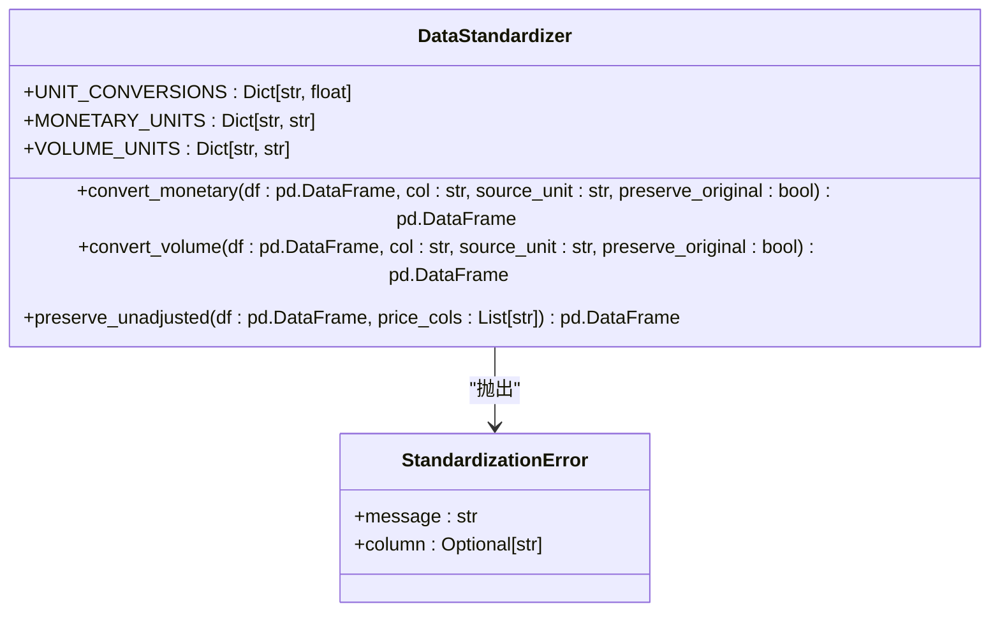
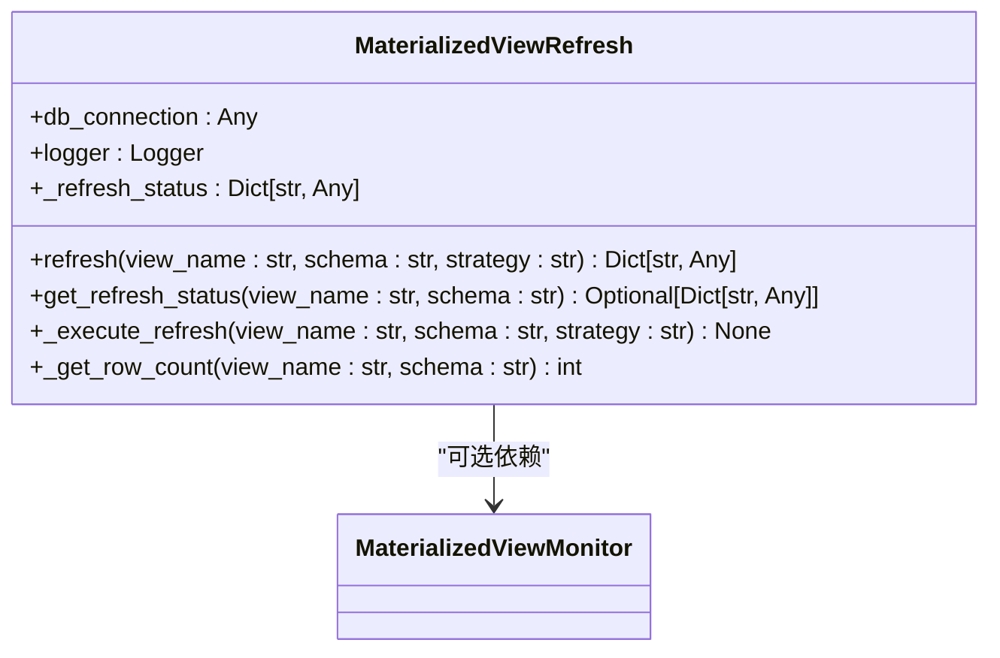
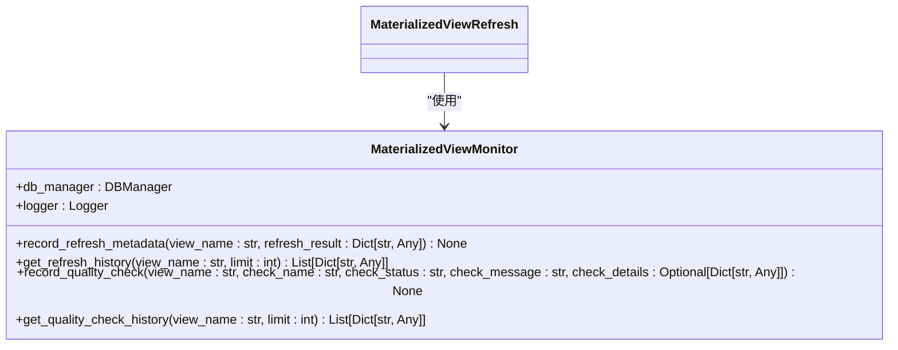
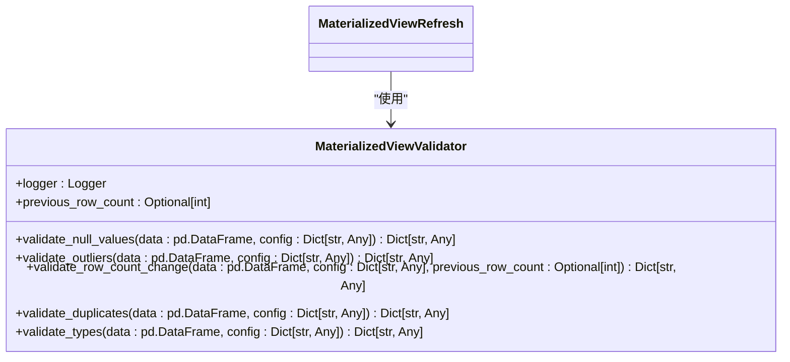

# 数据处理模块 (Processors)

<cite>
**本文档引用的文件**   
- [processor_engine.py](file://alphahome/processors/engine/processor_engine.py)
- [base_task.py](file://alphahome/processors/tasks/base_task.py)
- [block_processing_mixin.py](file://alphahome/processors/tasks/block_processing_mixin.py)
- [base_operation.py](file://alphahome/processors/operations/base_operation.py)
- [validator.py](file://alphahome/processors/clean/validator.py)
- [aligner.py](file://alphahome/processors/clean/aligner.py)
- [standardizer.py](file://alphahome/processors/clean/standardizer.py)
- [refresh.py](file://alphahome/processors/materialized_views/refresh.py)
- [monitor.py](file://alphahome/processors/materialized_views/monitor.py)
- [validator.py](file://alphahome/processors/materialized_views/validator.py)
- [complete_example.py](file://alphahome/processors/examples/complete_example.py)
- [index_valuation.py](file://alphahome/processors/tasks/index/index_valuation.py)
- [market_technical.py](file://alphahome/processors/tasks/market/market_technical.py)
- [technical_indicators.py](file://alphahome/processors/operations/technical_indicators.py)
- [transforms.py](file://alphahome/processors/operations/transforms.py)
</cite>

## 目录
1. [引言](#引言)
2. [三层架构设计](#三层架构设计)
3. [数据分层与流转机制](#数据分层与流转机制)
4. [Clean Layer 核心组件](#clean-layer-核心组件)
5. [物化视图子系统](#物化视图子系统)
6. [开发新处理任务指南](#开发新处理任务指南)
7. [结论](#结论)

## 引言

AlphaHome的Processors模块是整个系统数据清洗、标准化和特征工程的核心引擎。该模块采用清晰的三层架构设计，将复杂的处理逻辑分解为独立的层次，确保了系统的可维护性和可扩展性。本指南将深入解析其架构设计、核心组件的工作原理，并提供开发新处理任务的完整指南。

## 三层架构设计

Processors模块的核心是其清晰的三层架构，分别对应`Engine`层、`Task`层和`Operation`层。这种分层设计实现了关注点分离，使得每个层次的职责明确，便于开发和维护。

### Engine层：任务调度与并发控制

`ProcessorEngine`类是整个数据处理流程的指挥中心，负责任务的调度、执行监控和资源管理。它提供了统一的接口来执行单个或多个处理任务，并支持并发执行以提高效率。

**核心功能**：
- **任务调度**：通过`execute_task`和`execute_tasks`方法，可以同步或异步地执行一个或多个任务。
- **并发控制**：利用`asyncio.Semaphore`来限制最大并发工作线程数，防止系统资源被耗尽。
- **执行监控**：记录每个任务的执行状态、执行时间、处理行数等统计信息，并提供`get_stats`和`get_task_status`等方法来查询执行情况。
- **错误处理**：捕获任务执行过程中的异常，记录错误信息，并生成执行报告。



**代码片段路径**
- [processor_engine.py](file://alphahome/processors/engine/processor_engine.py#L58-L597)

### Task层：业务流程封装

`Task`层是业务逻辑的载体，封装了完整的数据处理流程。每个`ProcessorTaskBase`的子类都代表一个具体的业务任务，如`index_valuation`（指数估值）或`market_technical`（市场技术指标）。该层负责数据的IO操作和处理流程的编排。

**核心职责**：
- **数据获取** (`fetch_data`)：从数据库或其他数据源获取原始数据。
- **数据处理** (`process_data`)：调用`Operation`层的原子操作来处理数据。
- **结果保存** (`save_result`)：将处理后的结果保存到目标表。
- **流程编排**：实现`run`方法，协调`fetch_data`、`clean_data`、`compute_features`和`save_result`等步骤。



**代码片段路径**
- [base_task.py](file://alphahome/processors/tasks/base_task.py#L41-L686)
- [index_valuation.py](file://alphahome/processors/tasks/index/index_valuation.py#L22-L177)
- [market_technical.py](file://alphahome/processors/tasks/market/market_technical.py#L26-L384)

### Operation层：原子化数据转换

`Operation`层提供了最基础的、无状态的数据转换操作。这些操作是纯粹的函数，只负责对输入的`DataFrame`进行特定的转换，如计算移动平均线或标准化数据。`OperationPipeline`类可以将多个`Operation`组合成一个流水线。

**核心特点**：
- **原子化**：每个操作只完成一个单一的功能。
- **无状态**：操作本身不存储任何状态，其行为完全由输入数据和配置决定。
- **可复用**：操作可以在不同的`Task`中被重复使用。



**代码片段路径**
- [base_operation.py](file://alphahome/processors/operations/base_operation.py#L19-L212)
- [technical_indicators.py](file://alphahome/processors/operations/technical_indicators.py#L18-L361)

## 数据分层与流转机制

Processors模块遵循清晰的数据分层原则，数据在`Raw`、`Clean`和`Feature`三个层级之间流转。`ProcessorTaskBase`的`run`方法定义了这一标准流程。

### 数据流转流程

1.  **获取数据 (fetch_data)**：从`source_tables`（如`tushare.stock_factor_pro`）中读取原始数据。
2.  **清洗数据 (clean_data)**：调用`Clean Layer`的组件对数据进行校验、对齐和标准化。
3.  **计算特征 (compute_features)**：在清洗后的数据上应用特征计算函数。
4.  **保存结果 (save_result)**：将最终结果保存到`table_name`指定的特征表中。



**代码片段路径**
- [base_task.py](file://alphahome/processors/tasks/base_task.py#L494-L621)

## Clean Layer 核心组件

`Clean Layer`是确保数据质量的关键环节，它由`Validator`、`Aligner`和`Standardizer`三个核心组件构成，共同完成数据的清洗和标准化。

### Validator：数据校验

`DataValidator`负责根据预定义的`TableSchema`对数据进行校验，确保数据的完整性和正确性。

**校验内容**：
- **列存在性**：检查是否缺少`required_columns`中定义的必要列。
- **数据类型**：验证各列的数据类型是否符合`column_types`的定义。
- **空值检查**：检测`nullable_columns`之外的列是否存在空值。
- **值范围**：检查数值是否在`value_ranges`定义的有效范围内。

如果校验失败，会抛出`ValidationError`异常，并提供详细的错误信息。



**代码片段路径**
- [validator.py](file://alphahome/processors/clean/validator.py#L39-L379)

### Aligner：数据对齐

`DataAligner`负责将不同来源的数据格式统一到标准格式，确保数据的一致性。

**对齐内容**：
- **日期对齐** (`align_date`)：将各种格式的日期（如`YYYY-MM-DD`、`YYYYMMDD`）统一转换为`trade_date`（YYYYMMDD整数或datetime）。
- **标的对齐** (`align_identifier`)：将各种格式的证券代码（如`sh600000`、`000001`）统一转换为`ts_code`格式（如`600000.SH`）。
- **主键构建** (`build_primary_key`)：根据指定的列（如`['trade_date', 'ts_code']`）构建复合主键，并确保其唯一性。



**代码片段路径**
- [aligner.py](file://alphahome/processors/clean/aligner.py#L48-L526)

### Standardizer：数据标准化

`DataStandardizer`负责将数据的单位统一到标准单位，消除因单位不同带来的计算偏差。

**标准化内容**：
- **货币单位** (`convert_monetary`)：将`万元`、`亿元`等单位统一转换为`元`（CNY）。
- **成交量单位** (`convert_volume`)：将`手`等单位统一转换为`股`。
- **价格保留** (`preserve_unadjusted`)：在对价格进行复权等调整前，保留原始的未复权价格（如`close_unadj`），以便后续分析。



**代码片段路径**
- [standardizer.py](file://alphahome/processors/clean/standardizer.py#L46-L333)

## 物化视图子系统

物化视图（Materialized Views）子系统负责管理数据库中的物化视图，包括刷新、监控和验证，确保其数据的时效性和质量。

### Refresh模块：视图刷新

`MaterializedViewRefresh`类负责执行`REFRESH MATERIALIZED VIEW`命令，支持`FULL`和`CONCURRENT`两种刷新策略。

**核心功能**：
- **策略选择**：`FULL`刷新会阻塞查询，而`CONCURRENT`刷新则不会，但要求视图有唯一索引。
- **状态记录**：记录每次刷新的开始时间、持续时间、行数和状态。
- **回退机制**：当`CONCURRENT`刷新失败时，自动回退到`FULL`刷新。



**代码片段路径**
- [refresh.py](file://alphahome/processors/materialized_views/refresh.py#L22-L364)

### Monitor模块：状态监控

`MaterializedViewMonitor`类负责记录和查询物化视图的元数据和质量检查结果。

**监控内容**：
- **刷新元数据**：通过`record_refresh_metadata`记录刷新时间、状态、行数等。
- **质量检查历史**：通过`record_quality_check`记录数据质量检查的结果。
- **历史查询**：提供`get_refresh_history`和`get_quality_check_history`方法来查询历史记录。



**代码片段路径**
- [monitor.py](file://alphahome/processors/materialized_views/monitor.py#L14-L407)

### Validator模块：质量验证

`MaterializedViewValidator`类实现了一套最小化的数据质量检查机制，用于在刷新后对数据进行验证。

**检查类型**：
- **缺失值检查** (`validate_null_values`)：检查关键列的缺失值比例是否超过阈值。
- **异常值检查** (`validate_outliers`)：使用IQR、Z-Score等方法检测异常值。
- **行数变化检查** (`validate_row_count_change`)：检查本次刷新的行数与上次相比是否发生剧烈变化。
- **重复值检查** (`validate_duplicates`)：检查主键列是否存在重复记录。
- **类型检查** (`validate_types`)：检查各列的数据类型是否符合预期。



**代码片段路径**
- [validator.py](file://alphahome/processors/materialized_views/validator.py#L24-L513)

## 开发新处理任务指南

本指南结合`complete_example.py`，详细说明如何开发一个新的处理任务。

### 1. 创建自定义操作 (Operation)

首先，创建一个继承自`Operation`的自定义操作类。该类应实现`apply`方法，定义具体的转换逻辑。

```python
from alphahome.processors import Operation

class MyCustomOperation(Operation):
    def __init__(self, param1: str = "default"):
        super().__init__(name="MyCustomOperation")
        self.param1 = param1
    
    async def apply(self, data: pd.DataFrame, **kwargs) -> pd.DataFrame:
        # 在这里实现你的数据转换逻辑
        result = data.copy()
        # ... 你的代码 ...
        return result
```

**代码片段路径**
- [complete_example.py](file://alphahome/processors/examples/complete_example.py#L25-L47)

### 2. 创建自定义任务 (Task)

然后，创建一个继承自`ProcessorTaskBase`的自定义任务类。使用`@task_register()`装饰器将其注册到任务系统中。

```python
from alphahome.processors import ProcessorTaskBase, task_register

@task_register()
class MyNewTask(ProcessorTaskBase):
    name = "my_new_task"
    table_name = "my_result_table"
    source_tables = ["source_table_1", "source_table_2"]
    clean_table = "clean.my_clean_table"
    
    async def fetch_data(self, **kwargs) -> pd.DataFrame:
        # 实现数据获取逻辑
        pass
    
    async def process_data(self, data: pd.DataFrame, **kwargs) -> pd.DataFrame:
        # 实现数据处理逻辑，可以编排多个Operation
        pipeline = OperationPipeline("MyPipeline")
        pipeline.add_operation(MyCustomOperation())
        processed_data = await pipeline.apply(data)
        return processed_data
    
    async def save_result(self, data: pd.DataFrame, **kwargs):
        # 实现结果保存逻辑
        pass
```

**代码片段路径**
- [complete_example.py](file://alphahome/processors/examples/complete_example.py#L71-L127)

### 3. 实现异步方法

所有核心方法（`fetch_data`, `process_data`, `save_result`）都必须是异步的（`async def`），以支持`ProcessorEngine`的并发执行。

### 4. 使用分块处理 (BlockProcessingMixin)

对于处理大数据集的任务，可以继承`BlockProcessingTaskMixin`来实现分块处理。

```python
from alphahome.processors.tasks.block_processing_mixin import BlockProcessingTaskMixin

@task_register()
class MyLargeDataTask(ProcessorTaskBase, BlockProcessingTaskMixin):
    # ... 其他配置 ...
    
    def get_data_blocks(self, data: pd.DataFrame, **kwargs) -> Iterator[pd.DataFrame]:
        # 将大任务分解为小块
        yield from self._split_data_into_blocks(data)
    
    async def process_block(self, block: pd.DataFrame, **kwargs) -> pd.DataFrame:
        # 处理单个数据块
        # ... 你的代码 ...
        return result
```

**代码片段路径**
- [block_processing_mixin.py](file://alphahome/processors/tasks/block_processing_mixin.py#L17-L165)

### 5. 任务注册与执行

最后，通过`ProcessorEngine`来执行你的新任务。

```python
from alphahome.processors import ProcessorEngine
from alphahome.common.db_manager import DBManager

# 初始化
db_manager = DBManager("your_database_url")
engine = ProcessorEngine(db_manager=db_manager)

# 执行任务
result = await engine.execute_task("my_new_task")
```

**代码片段路径**
- [complete_example.py](file://alphahome/processors/examples/complete_example.py#L130-L221)

## 结论

AlphaHome的Processors模块通过其精心设计的三层架构，为数据处理提供了一个强大、灵活且可靠的框架。`Engine`层的并发控制、`Task`层的业务流程封装以及`Operation`层的原子化操作，共同构成了一个高效的数据处理流水线。`Clean Layer`确保了数据的高质量，而物化视图子系统则保证了衍生数据的时效性和可靠性。通过遵循本指南，开发者可以快速、规范地开发新的数据处理任务，为上层应用提供坚实的数据基础。