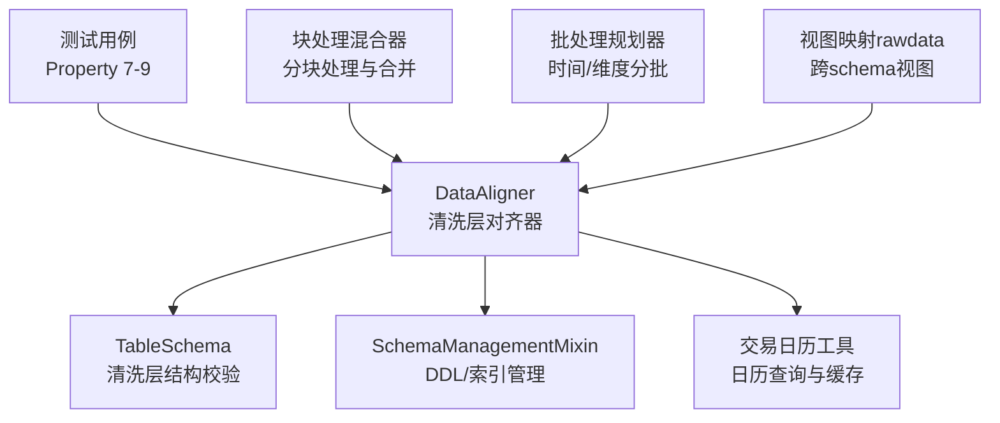
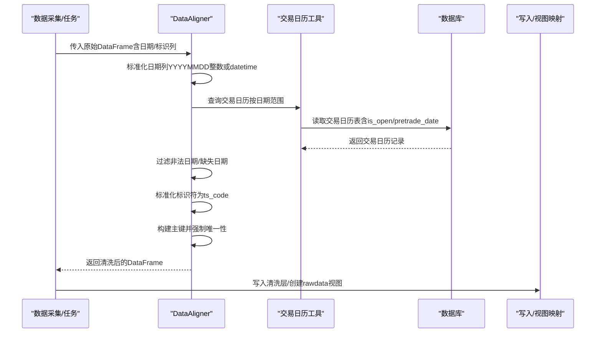
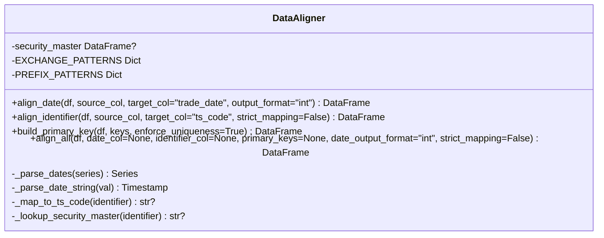
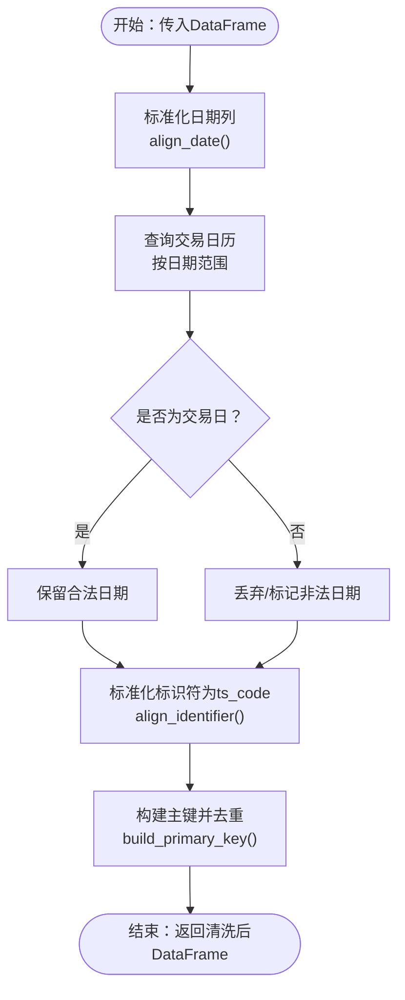
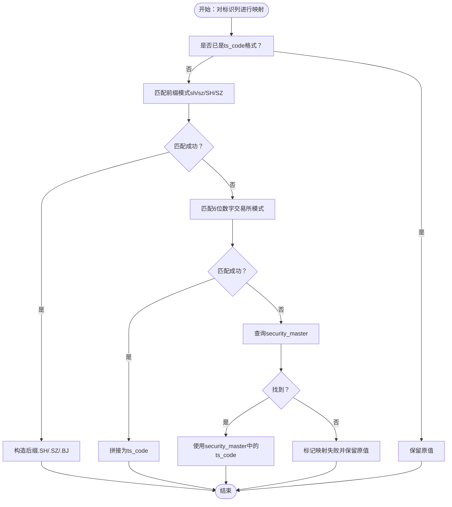
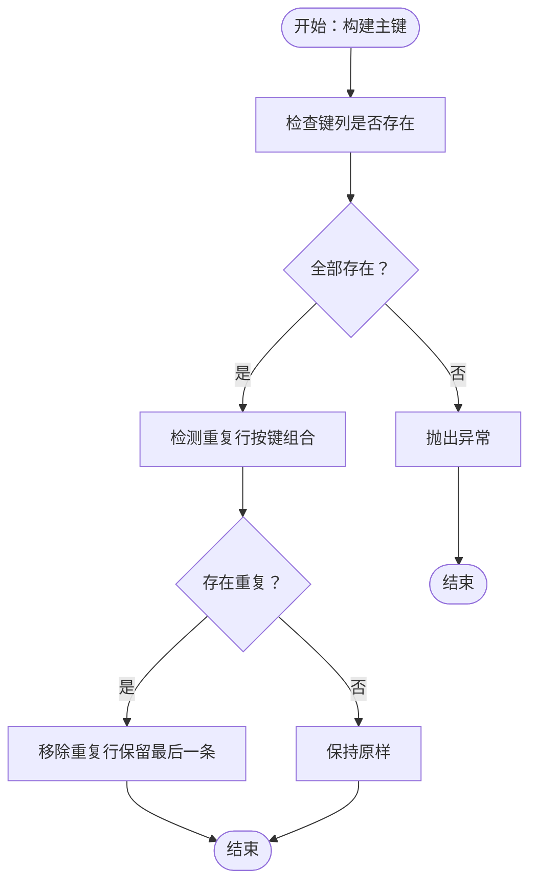
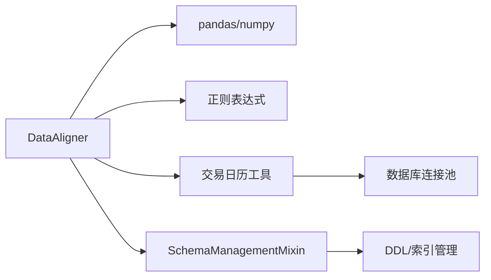

# 对齐器 (Aligner)

<cite>
**本文引用的文件**
- [alphahome/processors/clean/aligner.py](file://alphahome/processors/clean/aligner.py)
- [alphahome/processors/tests/test_clean_layer/test_aligner.py](file://alphahome/processors/tests/test_clean_layer/test_aligner.py)
- [alphahome/common/db_components/schema_management_mixin.py](file://alphahome/common/db_components/schema_management_mixin.py)
- [alphahome/processors/clean/schema.py](file://alphahome/processors/clean/schema.py)
- [alphahome/providers/_helpers.py](file://alphahome/providers/_helpers.py)
- [alphahome/fetchers/tools/calendar.py](file://alphahome/fetchers/tools/calendar.py)
- [alphahome/fetchers/tasks/others/tushare_others_hktradecal.py](file://alphahome/fetchers/tasks/others/tushare_others_hktradecal.py)
- [alphahome/processors/tasks/market/sector_aggregation_mv.py](file://alphahome/processors/tasks/market/sector_aggregation_mv.py)
- [alphahome/processors/tasks/block_processing_mixin.py](file://alphahome/processors/tasks/block_processing_mixin.py)
- [alphahome/common/planning/batch_planner.py](file://alphahome/common/planning/batch_planner.py)
- [alphahome/common/planning/extended_batch_planner.py](file://alphahome/common/planning/extended_batch_planner.py)
</cite>

## 目录
1. [简介](#简介)
2. [项目结构](#项目结构)
3. [核心组件](#核心组件)
4. [架构总览](#架构总览)
5. [详细组件分析](#详细组件分析)
6. [依赖分析](#依赖分析)
7. [性能考量](#性能考量)
8. [故障排查指南](#故障排查指南)
9. [结论](#结论)
10. [附录](#附录)

## 简介
本文件围绕“对齐器（Aligner）”展开，系统阐述其在多源金融数据清洗层中如何解决时间序列对齐问题，重点覆盖以下方面：
- trade_date 维度的标准化与对齐：将不同来源的日期格式统一为标准格式，并在必要时与数据库交易日历进行对齐。
- ts_code 维度的标准化与映射：将不同来源的股票标识符统一为 ts_code 格式，并通过安全回退策略保留原始值以便后续治理。
- 主键构建与唯一性约束：在清洗阶段即保证主键唯一性，降低后续写入与特征计算的歧义。
- 与数据库交易日历的协同：通过交易日历表过滤非法日期，确保时间序列完整性。
- 对后续特征计算的重要意义：统一的时间与标识为跨源拼接、滚动窗口、因子构建等提供稳定基础。
- 性能优化建议：批量处理、索引利用、内存分块与错误隔离，以应对大规模数据对齐挑战。

## 项目结构
对齐器位于清洗层（Clean Layer），与数据校验、写入、视图映射及批处理规划等模块协同工作。下图展示与对齐器直接相关的关键文件及其职责：

图表来源
- [alphahome/processors/clean/aligner.py](file://alphahome/processors/clean/aligner.py#L48-L118)
- [alphahome/processors/clean/schema.py](file://alphahome/processors/clean/schema.py#L16-L80)
- [alphahome/common/db_components/schema_management_mixin.py](file://alphahome/common/db_components/schema_management_mixin.py#L160-L330)
- [alphahome/fetchers/tools/calendar.py](file://alphahome/fetchers/tools/calendar.py#L216-L302)
- [alphahome/processors/tests/test_clean_layer/test_aligner.py](file://alphahome/processors/tests/test_clean_layer/test_aligner.py#L110-L174)
- [alphahome/processors/tasks/block_processing_mixin.py](file://alphahome/processors/tasks/block_processing_mixin.py#L70-L165)
- [alphahome/common/planning/batch_planner.py](file://alphahome/common/planning/batch_planner.py#L178-L234)
- [alphahome/common/planning/extended_batch_planner.py](file://alphahome/common/planning/extended_batch_planner.py#L319-L354)

章节来源
- [alphahome/processors/clean/aligner.py](file://alphahome/processors/clean/aligner.py#L48-L118)
- [alphahome/processors/tests/test_clean_layer/test_aligner.py](file://alphahome/processors/tests/test_clean_layer/test_aligner.py#L110-L174)

## 核心组件
- DataAligner：清洗层对齐器，负责日期标准化、标识符映射、主键构建与唯一性约束。
- TableSchema：清洗层表结构定义与校验，为对齐后的数据提供结构约束。
- SchemaManagementMixin：DDL/索引管理，为清洗层表自动创建日期索引与主键约束，提升查询与去重性能。
- 交易日历工具：提供从数据库读取交易日历的能力，支持缓存与类型转换，用于过滤非法日期。
- 测试用例：Property 7-9 覆盖日期标准化、标识符映射、主键唯一性等关键属性。
- 块处理混合器与批处理规划器：为大规模数据对齐提供分块与分批执行能力，配合错误隔离与统计。

章节来源
- [alphahome/processors/clean/aligner.py](file://alphahome/processors/clean/aligner.py#L48-L118)
- [alphahome/processors/clean/schema.py](file://alphahome/processors/clean/schema.py#L16-L80)
- [alphahome/common/db_components/schema_management_mixin.py](file://alphahome/common/db_components/schema_management_mixin.py#L160-L330)
- [alphahome/fetchers/tools/calendar.py](file://alphahome/fetchers/tools/calendar.py#L216-L302)
- [alphahome/processors/tests/test_clean_layer/test_aligner.py](file://alphahome/processors/tests/test_clean_layer/test_aligner.py#L110-L174)
- [alphahome/processors/tasks/block_processing_mixin.py](file://alphahome/processors/tasks/block_processing_mixin.py#L70-L165)
- [alphahome/common/planning/batch_planner.py](file://alphahome/common/planning/batch_planner.py#L178-L234)
- [alphahome/common/planning/extended_batch_planner.py](file://alphahome/common/planning/extended_batch_planner.py#L319-L354)

## 架构总览
下图展示对齐器在数据清洗流水线中的位置与交互关系：

图表来源
- [alphahome/processors/clean/aligner.py](file://alphahome/processors/clean/aligner.py#L119-L191)
- [alphahome/fetchers/tools/calendar.py](file://alphahome/fetchers/tools/calendar.py#L216-L302)
- [alphahome/providers/_helpers.py](file://alphahome/providers/_helpers.py#L166-L189)

## 详细组件分析

### DataAligner 组件
DataAligner 提供三类核心能力：
- 日期标准化：将多种日期输入格式统一为 trade_date（YYYYMMDD 整数或 datetime），并记录转换日志。
- 标识符映射：将 6 位数字、前缀 sh/sz/SH/SZ、ts_code 等格式映射为标准 ts_code；若映射失败，保留原值并在清洗层打上失败标记，便于后续治理。
- 主键构建与唯一性：基于一组键列构建复合主键，并在 enforce_uniqueness=True 时移除重复行（保留最后一条）。

图表来源
- [alphahome/processors/clean/aligner.py](file://alphahome/processors/clean/aligner.py#L119-L191)
- [alphahome/processors/clean/aligner.py](file://alphahome/processors/clean/aligner.py#L270-L358)
- [alphahome/processors/clean/aligner.py](file://alphahome/processors/clean/aligner.py#L430-L482)

章节来源
- [alphahome/processors/clean/aligner.py](file://alphahome/processors/clean/aligner.py#L119-L191)
- [alphahome/processors/clean/aligner.py](file://alphahome/processors/clean/aligner.py#L270-L358)
- [alphahome/processors/clean/aligner.py](file://alphahome/processors/clean/aligner.py#L430-L482)

### 日期对齐与交易日历协同
- 日期标准化：支持 YYYY-MM-DD、YYYYMMDD、datetime 等常见格式，输出可为整数 YYYYMMDD 或 pandas Timestamp。
- 交易日历对齐：通过交易日历工具按日期范围查询数据库中的交易日历表，过滤掉非交易日与缺失日期，确保时间序列连续性与合法性。
- 缓存与类型转换：交易日历工具对 is_open 字段进行 Int64 转换并缓存查询结果，减少重复 IO。

图表来源
- [alphahome/processors/clean/aligner.py](file://alphahome/processors/clean/aligner.py#L119-L191)
- [alphahome/fetchers/tools/calendar.py](file://alphahome/fetchers/tools/calendar.py#L216-L302)
- [alphahome/providers/_helpers.py](file://alphahome/providers/_helpers.py#L166-L189)

章节来源
- [alphahome/processors/clean/aligner.py](file://alphahome/processors/clean/aligner.py#L119-L191)
- [alphahome/fetchers/tools/calendar.py](file://alphahome/fetchers/tools/calendar.py#L216-L302)
- [alphahome/providers/_helpers.py](file://alphahome/providers/_helpers.py#L166-L189)

### 标识符映射与安全回退
- 支持的输入格式：6 位数字（自动推断交易所）、sh/sz/SH/SZ 前缀、已为 ts_code 格式的标识符。
- 映射失败策略：默认保留原值并在清洗层增加 _mapping_failed 标记；严格模式下直接抛出异常。
- 安全回退：可选加载“证券主表”（security_master）进行符号到 ts_code 的查找，增强跨源一致性。

图表来源
- [alphahome/processors/clean/aligner.py](file://alphahome/processors/clean/aligner.py#L270-L358)
- [alphahome/processors/clean/aligner.py](file://alphahome/processors/clean/aligner.py#L359-L429)

章节来源
- [alphahome/processors/clean/aligner.py](file://alphahome/processors/clean/aligner.py#L270-L358)
- [alphahome/processors/clean/aligner.py](file://alphahome/processors/clean/aligner.py#L359-L429)

### 主键构建与唯一性约束
- 复合主键：由 trade_date 与 ts_code 等列组成，确保每条记录在时间与标的上唯一。
- 去重策略：在 enforce_uniqueness=True 时移除重复行，保留最后出现的一条，避免写入阶段产生主键冲突。
- 错误处理：缺失键列时抛出异常，保证清洗层数据质量。

图表来源
- [alphahome/processors/clean/aligner.py](file://alphahome/processors/clean/aligner.py#L430-L482)

章节来源
- [alphahome/processors/clean/aligner.py](file://alphahome/processors/clean/aligner.py#L430-L482)

### 与数据库交易日历的集成
- 交易日历表结构：包含 exchange、cal_date、is_open、pretrade_date 等字段，索引包括 (exchange, cal_date)、is_open、pretrade_date 等，用于高效查询与过滤。
- 查询与缓存：按日期范围查询交易日历，支持缓存命中与未命中分支，最终将 is_open 转换为 Int64 类型，便于后续逻辑判断。
- 与清洗层协作：对齐器在日期标准化后，结合交易日历过滤非法日期，确保时间序列的合法性与连续性。

章节来源
- [alphahome/fetchers/tasks/others/tushare_others_hktradecal.py](file://alphahome/fetchers/tasks/others/tushare_others_hktradecal.py#L39-L73)
- [alphahome/fetchers/tools/calendar.py](file://alphahome/fetchers/tools/calendar.py#L216-L302)
- [alphahome/providers/_helpers.py](file://alphahome/providers/_helpers.py#L166-L189)

### 对后续特征计算的重要性
- 时间序列稳定性：统一的 trade_date 格式与交易日历过滤，确保滚动窗口、连涨/连跌、相对排名等特征计算的准确性。
- 跨源拼接一致性：标准化 ts_code 与主键唯一性，避免同一交易日同一标的在不同数据源中出现重复或不一致，保障多源拼接的正确性。
- 结构约束：TableSchema 与 SchemaManagementMixin 的索引/约束管理，为清洗层数据提供结构约束与查询优化，降低特征层的二次加工成本。

章节来源
- [alphahome/processors/clean/schema.py](file://alphahome/processors/clean/schema.py#L16-L80)
- [alphahome/common/db_components/schema_management_mixin.py](file://alphahome/common/db_components/schema_management_mixin.py#L160-L330)
- [alphahome/processors/tasks/market/sector_aggregation_mv.py](file://alphahome/processors/tasks/market/sector_aggregation_mv.py#L70-L102)

## 依赖分析
- 内部依赖
  - DataAligner 依赖 pandas/numpy 进行数据处理，依赖正则表达式进行标识符解析。
  - 交易日历工具依赖数据库连接池与 SQL 查询，返回标准化的日期与整型 is_open。
  - SchemaManagementMixin 负责自动建表、索引与注释，为清洗层表提供性能优化。
- 外部依赖
  - 数据库：交易日历表（tushare.others_calendar 等）。
  - 第三方库：pandas、numpy、pytest（测试）、hypothesis（属性测试）。

图表来源
- [alphahome/processors/clean/aligner.py](file://alphahome/processors/clean/aligner.py#L119-L191)
- [alphahome/fetchers/tools/calendar.py](file://alphahome/fetchers/tools/calendar.py#L216-L302)
- [alphahome/common/db_components/schema_management_mixin.py](file://alphahome/common/db_components/schema_management_mixin.py#L160-L330)

章节来源
- [alphahome/processors/clean/aligner.py](file://alphahome/processors/clean/aligner.py#L119-L191)
- [alphahome/fetchers/tools/calendar.py](file://alphahome/fetchers/tools/calendar.py#L216-L302)
- [alphahome/common/db_components/schema_management_mixin.py](file://alphahome/common/db_components/schema_management_mixin.py#L160-L330)

## 性能考量
- 批量处理与分块
  - 使用块处理混合器将大 DataFrame 分块处理，避免一次性加载导致内存溢出；支持 overlap_size 与 block_size 控制重叠与块大小。
  - 批处理规划器提供按时间/维度的智能分批策略，减少批次数量与 IO 次数。
- 索引利用
  - SchemaManagementMixin 自动为日期列与主键列创建索引，加速时间范围查询与去重。
- 内存与类型优化
  - 日期列输出为 Int64（可空整数）以节省内存；交易日历的 is_open 转换为 Int64，便于布尔/数值判断。
- 错误隔离与统计
  - 分块处理在失败时记录错误并可选择继续执行，避免整批失败；批处理规划器提供统计信息，便于优化批次策略。

章节来源
- [alphahome/processors/tasks/block_processing_mixin.py](file://alphahome/processors/tasks/block_processing_mixin.py#L70-L165)
- [alphahome/common/planning/batch_planner.py](file://alphahome/common/planning/batch_planner.py#L178-L234)
- [alphahome/common/planning/extended_batch_planner.py](file://alphahome/common/planning/extended_batch_planner.py#L319-L354)
- [alphahome/common/db_components/schema_management_mixin.py](file://alphahome/common/db_components/schema_management_mixin.py#L256-L330)

## 故障排查指南
- 日期标准化失败
  - 现象：部分日期无法解析，返回 NaN 或警告日志。
  - 排查：检查输入日期格式是否在支持集合内；确认 align_date 的 output_format 设置。
  - 参考路径：[日期标准化实现](file://alphahome/processors/clean/aligner.py#L119-L191)
- 标识符映射失败
  - 现象：_mapping_failed 列为 True，保留原值。
  - 排查：确认输入格式是否为 6 位数字、sh/sz 前缀或 ts_code；若依赖 security_master，请检查其加载是否成功。
  - 参考路径：[标识符映射实现](file://alphahome/processors/clean/aligner.py#L270-L358)
- 主键唯一性异常
  - 现象：抛出 AlignmentError，提示缺失键列；或日志提示移除了重复行。
  - 排查：确认 keys 列是否存在于 DataFrame；若 enforce_uniqueness=True，重复行会被移除。
  - 参考路径：[主键构建实现](file://alphahome/processors/clean/aligner.py#L430-L482)
- 交易日历查询异常
  - 现象：数据库连接池不可用或查询失败。
  - 排查：检查数据库连接状态与表结构；确认索引存在；查看 is_open 类型转换是否成功。
  - 参考路径：[交易日历查询](file://alphahome/fetchers/tools/calendar.py#L216-L302)

章节来源
- [alphahome/processors/clean/aligner.py](file://alphahome/processors/clean/aligner.py#L119-L191)
- [alphahome/processors/clean/aligner.py](file://alphahome/processors/clean/aligner.py#L270-L358)
- [alphahome/processors/clean/aligner.py](file://alphahome/processors/clean/aligner.py#L430-L482)
- [alphahome/fetchers/tools/calendar.py](file://alphahome/fetchers/tools/calendar.py#L216-L302)

## 结论
DataAligner 在清洗层承担了“多源金融数据对齐”的关键角色：通过标准化日期与标识符、构建主键并强制唯一性，为后续特征计算与模型训练提供了高质量、一致性的输入。结合交易日历的过滤与索引优化，能够在保证数据质量的同时显著提升性能。对于大规模数据，建议采用分块与分批策略，配合错误隔离与统计分析，持续优化批次规模与内存占用。

## 附录
- 测试用例覆盖
  - Property 7：日期格式标准化（YYYY-MM-DD、YYYYMMDD、datetime 等输入，统一输出为 YYYYMMDD 整数或 datetime）。
  - Property 8：标识符映射（6 位数字、sh/sz 前缀、ts_code 格式；严格/宽松模式）。
  - Property 9：主键唯一性（复合键去重、保留最后一条、缺失键列报错）。
- 参考路径
  - [日期标准化测试](file://alphahome/processors/tests/test_clean_layer/test_aligner.py#L116-L237)
  - [标识符映射测试](file://alphahome/processors/tests/test_clean_layer/test_aligner.py#L282-L455)
  - [主键唯一性测试](file://alphahome/processors/tests/test_clean_layer/test_aligner.py#L475-L665)