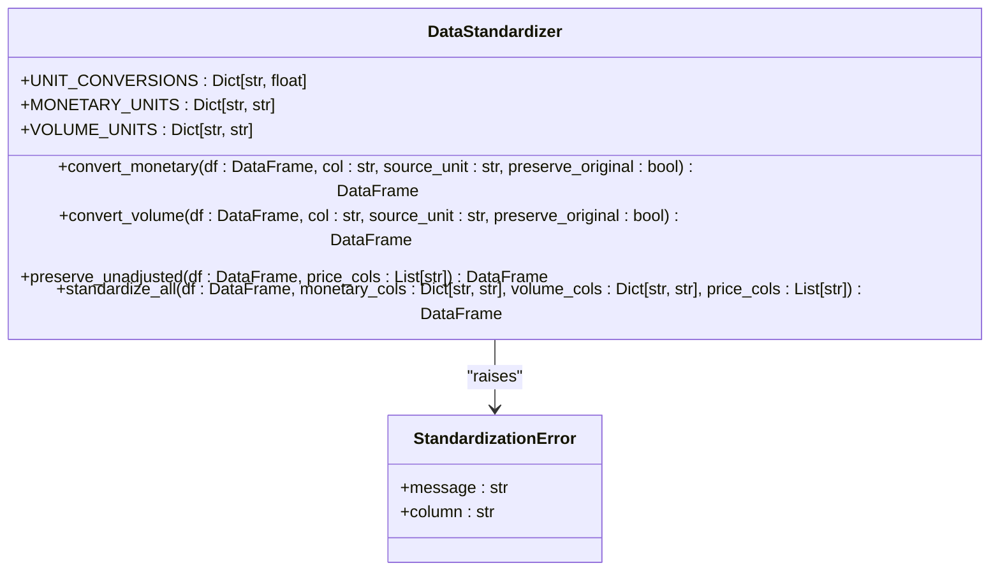
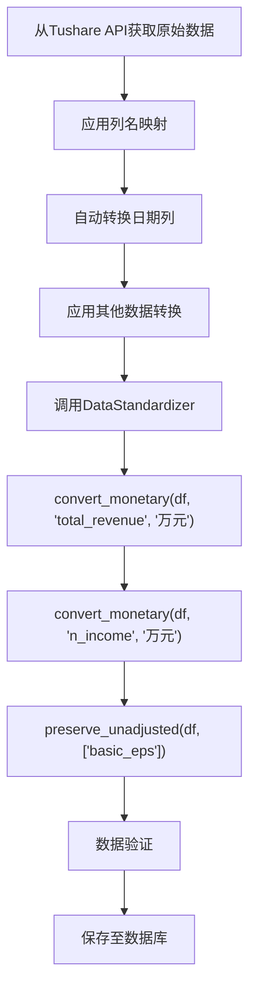

# 标准化器 (Standardizer)

<cite>
**本文档引用的文件**   
- [standardizer.py](file://alphahome/processors/clean/standardizer.py)
- [test_standardizer.py](file://alphahome/processors/tests/test_clean_layer/test_standardizer.py)
- [tushare_data_transformer.py](file://alphahome/fetchers/sources/tushare/tushare_data_transformer.py)
- [tushare_stock_daily.py](file://alphahome/fetchers/tasks/stock/tushare_stock_daily.py)
- [tushare_fina_income.py](file://alphahome/fetchers/tasks/finance/tushare_fina_income.py)
- [tushare_stock_adjfactor.py](file://alphahome/fetchers/tasks/stock/tushare_stock_adjfactor.py)
- [schema.py](file://alphahome/processors/clean/schema.py)
- [data_quality.md](file://docs/business/data_quality.md)
</cite>

## 目录
1. [引言](#引言)
2. [核心功能](#核心功能)
3. [标准化规则与实现](#标准化规则与实现)
4. [Tushare数据处理实例](#tushare数据处理实例)
5. [数据精度与应对策略](#数据精度与应对策略)
6. [结论](#结论)

## 引言
标准化器（Standardizer）是AlphaHome系统中数据清洗层（Clean Layer）的核心组件，负责统一来自不同数据源的数据口径。其主要目标是解决多源数据在单位、命名和精度上的不一致性，为后续的数据分析和模型计算提供一个标准化、高质量的数据基础。该组件通过读取任务定义中的schema规则，对财务数据、行情数据等进行批量标准化处理，确保了数据的可比性和准确性。

## 核心功能
标准化器（DataStandardizer）的核心功能围绕三个关键方面展开：金额单位的统一、价格复权因子的应用以及字段命名的规范化。这些功能共同构成了数据标准化的基石，确保了不同来源的数据能够无缝集成和比较。

### 金额单位转换
标准化器能够将不同货币单位的数值统一转换为标准单位“元”（CNY）。系统内置了常见的单位转换因子，如“万元”到“元”（乘以10,000）、“亿元”到“元”（乘以100,000,000）。在转换过程中，它会记录转换日志，并可选择性地保留原始值，以备追溯。

**Section sources**
- [standardizer.py](file://alphahome/processors/clean/standardizer.py#L67-L82)
- [standardizer.py](file://alphahome/processors/clean/standardizer.py#L98-L157)

### 价格复权与原始值保留
为了处理股票因分红、送股等事件导致的价格不连续问题，标准化器提供了`preserve_unadjusted`方法。该方法会在对价格进行任何调整（如复权）之前，将原始价格（如`close`）复制并重命名为`close_unadj`，从而确保原始行情数据的完整性，为后续的复权计算提供可靠依据。

**Section sources**
- [standardizer.py](file://alphahome/processors/clean/standardizer.py#L221-L270)
- [test_standardizer.py](file://alphahome/processors/tests/test_clean_layer/test_standardizer.py#L376-L590)

### 字段命名规范统一
虽然字段命名的直接映射通常在数据转换器（DataTransformer）中完成，但标准化器是整个标准化流程的一部分。它确保了在字段名称被统一（如将Tushare的`vol`映射为`volume`）后，其对应的数据值也遵循统一的单位和精度标准，从而实现了从“名”到“实”的全面统一。

**Section sources**
- [tushare_data_transformer.py](file://alphahome/fetchers/sources/tushare/tushare_data_transformer.py#L43-L77)
- [tushare_stock_daily.py](file://alphahome/fetchers/tasks/stock/tushare_stock_daily.py#L68-L69)

## 标准化规则与实现
标准化器的实现基于一个清晰的类结构，通过读取任务配置中的schema定义来批量应用标准化规则。其设计遵循了高内聚、低耦合的原则，确保了功能的可复用性和可测试性。

### 类结构与方法
`DataStandardizer`类提供了三个主要的公共方法：`convert_monetary`用于处理金额，`convert_volume`用于处理数量（如成交量），`preserve_unadjusted`用于保留原始价格。这些方法都接受一个Pandas DataFrame作为输入，并返回一个新的、经过标准化的DataFrame，保证了输入数据的不可变性。

**Diagram sources**
- [standardizer.py](file://alphahome/processors/clean/standardizer.py#L46-L333)

### 规则读取与批量应用
标准化器通过`standardize_all`这一便捷方法，实现了对多种标准化操作的批量应用。用户可以传入一个包含所有待处理列及其源单位的字典，标准化器会按顺序执行所有转换。这一设计使得在数据处理流水线中，只需一次调用即可完成复杂的标准化任务。

**Section sources**
- [standardizer.py](file://alphahome/processors/clean/standardizer.py#L272-L315)

## Tushare数据处理实例
以Tushare数据源为例，标准化器在处理财务和行情数据时，扮演着至关重要的角色。以下通过具体的任务配置来说明其应用。

### 财务数据标准化
在处理`TushareFinaIncomeTask`（利润表任务）时，数据中的“营业收入”（`total_revenue`）等指标通常以“万元”为单位。通过在任务的处理流程中调用标准化器，可以将这些字段批量转换为“元”，并保留原始值。

**Diagram sources**
- [tushare_fina_income.py](file://alphahome/fetchers/tasks/finance/tushare_fina_income.py#L127-L206)
- [tushare_data_transformer.py](file://alphahome/fetchers/sources/tushare/tushare_data_transformer.py#L199-L228)

### 行情数据标准化
对于`TushareStockDailyTask`（日线行情任务），标准化器处理的是成交量和成交额。Tushare的`vol`字段代表“手”，需要转换为“股”（乘以100）。同时，`amount`字段（成交额）也需从“元”保持为“元”（无转换，但需记录）。此外，开盘价、收盘价等均需通过`preserve_unadjusted`方法进行保护。

**Section sources**
- [tushare_stock_daily.py](file://alphahome/fetchers/tasks/stock/tushare_stock_daily.py#L56-L66)
- [tushare_stock_daily.py](file://alphahome/fetchers/tasks/stock/tushare_stock_daily.py#L68-L69)

## 数据精度与应对策略
在进行大规模数值转换时，浮点数的精度损失是一个潜在风险，尤其是在处理“亿元”级别的大额财务数据时。

### 精度损失问题
由于计算机使用二进制表示浮点数，某些十进制小数无法被精确表示，这可能导致在乘以大转换因子（如100,000,000）后产生微小的舍入误差。虽然这种误差在大多数金融分析中可以忽略不计，但对于需要极高精度的场景，仍需关注。

### 应对策略
1.  **使用高精度数据类型**：在数据库schema中，使用`NUMERIC(precision, scale)`类型（如`NUMERIC(20,4)`）而非`FLOAT`，以确保存储时的精度。
2.  **测试验证**：通过`test_standardizer.py`中的property-based tests，使用`numpy.isclose()`函数配合相对容差（`rtol`）和绝对容差（`atol`）来验证转换结果，允许在合理范围内的微小误差，从而保证了功能的鲁棒性。
3.  **保留原始值**：通过`preserve_original=True`参数，始终保留原始数据。这不仅满足了审计和追溯的需求，也为在必要时进行精确的反向计算提供了可能。

**Section sources**
- [standardizer.py](file://alphahome/processors/clean/standardizer.py#L136-L152)
- [test_standardizer.py](file://alphahome/processors/tests/test_clean_layer/test_standardizer.py#L70-L250)

## 结论
标准化器（Standardizer）是构建高质量、可信赖数据集的关键环节。它通过系统化地解决金额单位、价格复权和字段命名三大核心问题，有效消除了多源数据间的“方言”障碍。其设计紧密结合了任务的schema定义，实现了规则驱动的自动化批量处理。尽管存在浮点数精度的固有挑战，但通过高精度存储、严谨的测试和原始值保留策略，该组件为AlphaHome系统提供了坚实、可靠的数据基础，确保了后续所有分析和决策的准确性。