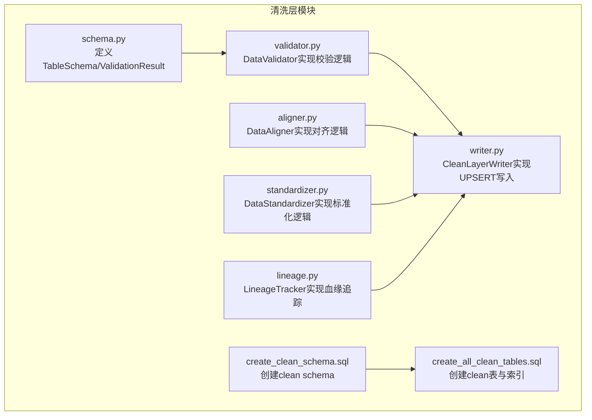
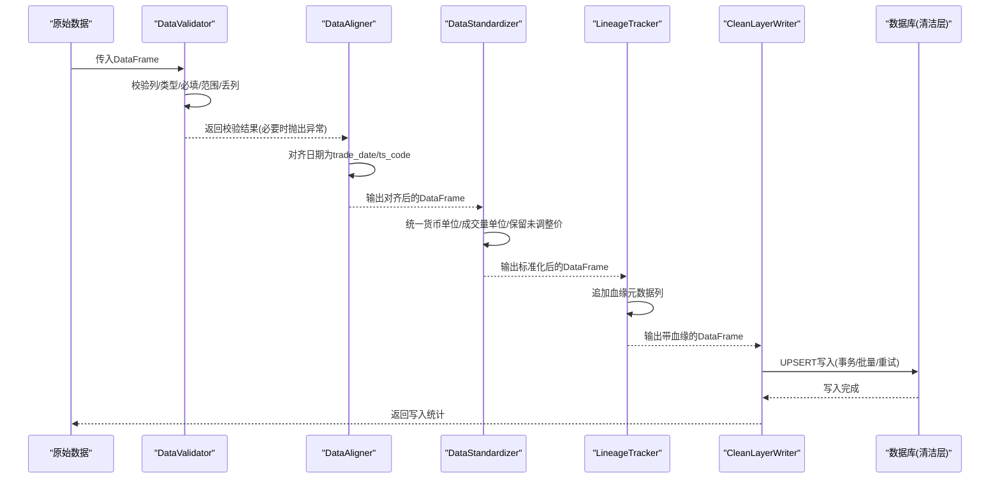
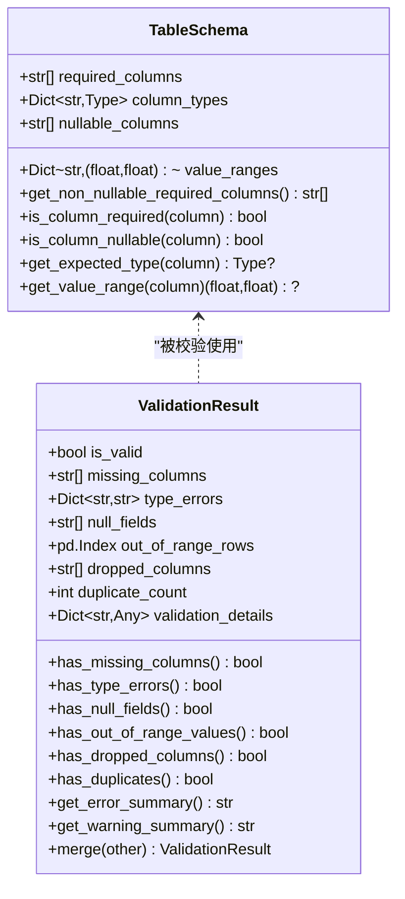
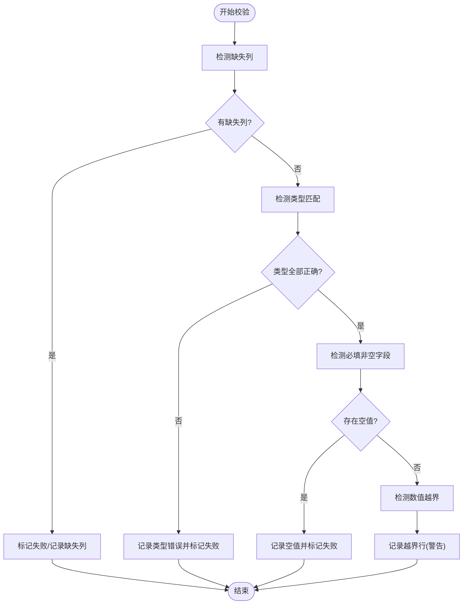
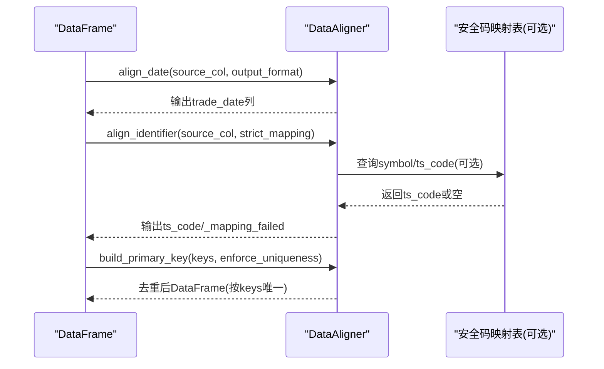
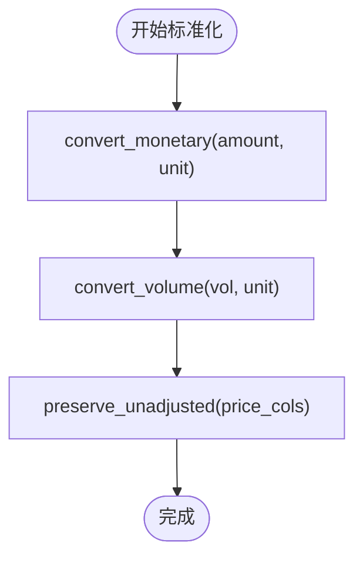
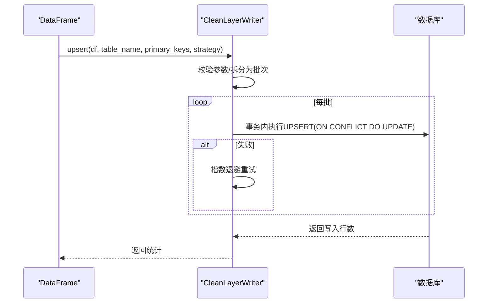
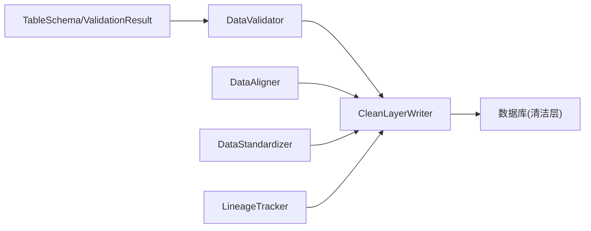

# 清洗层 (Clean Layer)

<cite>
**本文引用的文件列表**
- [schema.py](file://alphahome/processors/clean/schema.py)
- [validator.py](file://alphahome/processors/clean/validator.py)
- [aligner.py](file://alphahome/processors/clean/aligner.py)
- [standardizer.py](file://alphahome/processors/clean/standardizer.py)
- [create_clean_schema.sql](file://alphahome/processors/clean/database/create_clean_schema.sql)
- [create_all_clean_tables.sql](file://alphahome/processors/clean/database/create_all_clean_tables.sql)
- [writer.py](file://alphahome/processors/clean/writer.py)
- [lineage.py](file://alphahome/processors/clean/lineage.py)
- [test_validator.py](file://alphahome/processors/tests/test_clean_layer/test_validator.py)
- [test_aligner.py](file://alphahome/processors/tests/test_clean_layer/test_aligner.py)
- [test_standardizer.py](file://alphahome/processors/tests/test_clean_layer/test_standardizer.py)
</cite>

## 目录
1. [引言](#引言)
2. [项目结构](#项目结构)
3. [核心组件](#核心组件)
4. [架构总览](#架构总览)
5. [关键组件详解](#关键组件详解)
6. [依赖关系分析](#依赖关系分析)
7. [性能与可扩展性](#性能与可扩展性)
8. [故障排查指南](#故障排查指南)
9. [结论](#结论)
10. [附录](#附录)

## 引言
清洗层（Clean Layer）是数据处理流水线中面向统一、高质量、可审计数据输出的关键环节。它承接原始层（Raw Layer）的多源异构数据，通过“校验-对齐-标准化-写入”的流程，生成具备明确主键、统一单位与时间格式、可追溯血缘的干净数据集，供后续特征层与研究层稳定消费。本文围绕以下目标展开：
- 解释清洗层在Raw到Clean转换中的核心作用：数据校验、对齐与标准化。
- 深入解析TableSchema与ValidationResult数据类的设计，说明如何定义列类型、非空约束与值域范围。
- 解释Validator组件如何利用schema进行数据质量检查。
- 描述Aligner如何处理trade_date与ts_code的时间序列对齐，以及Standardizer如何统一金额单位与复权口径。
- 结合create_clean_schema.sql与create_all_clean_tables.sql，说明clean schema的数据库表结构设计原则与主键规范。

## 项目结构
清洗层相关代码集中在processors/clean目录下，包含数据校验、对齐、标准化、写入、血缘追踪与数据库脚本等模块，并配套单元测试覆盖关键属性。

图表来源
- [schema.py](file://alphahome/processors/clean/schema.py#L1-L229)
- [validator.py](file://alphahome/processors/clean/validator.py#L1-L379)
- [aligner.py](file://alphahome/processors/clean/aligner.py#L1-L526)
- [standardizer.py](file://alphahome/processors/clean/standardizer.py#L1-L333)
- [writer.py](file://alphahome/processors/clean/writer.py#L1-L500)
- [lineage.py](file://alphahome/processors/clean/lineage.py#L1-L291)
- [create_clean_schema.sql](file://alphahome/processors/clean/database/create_clean_schema.sql#L1-L16)
- [create_all_clean_tables.sql](file://alphahome/processors/clean/database/create_all_clean_tables.sql#L1-L154)

章节来源
- [schema.py](file://alphahome/processors/clean/schema.py#L1-L229)
- [validator.py](file://alphahome/processors/clean/validator.py#L1-L379)
- [aligner.py](file://alphahome/processors/clean/aligner.py#L1-L526)
- [standardizer.py](file://alphahome/processors/clean/standardizer.py#L1-L333)
- [writer.py](file://alphahome/processors/clean/writer.py#L1-L500)
- [lineage.py](file://alphahome/processors/clean/lineage.py#L1-L291)
- [create_clean_schema.sql](file://alphahome/processors/clean/database/create_clean_schema.sql#L1-L16)
- [create_all_clean_tables.sql](file://alphahome/processors/clean/database/create_all_clean_tables.sql#L1-L154)

## 核心组件
- 数据结构与规则
  - TableSchema：定义列清单、列类型、可空列、数值范围等约束。
  - ValidationResult：汇总缺失列、类型错误、空值、越界行、重复计数、丢列等信息，并提供合并与摘要方法。
- 校验器
  - DataValidator：基于TableSchema执行列存在性、类型匹配、必填非空、数值范围、丢列检测；支持去重与添加验证标记列。
- 对齐器
  - DataAligner：统一日期为trade_date（YYYYMMDD整型或datetime）、统一股票代码为ts_code格式、构建并强制主键唯一。
- 标准化器
  - DataStandardizer：统一货币单位至元、成交量单位至股，保留未调整价格列，记录转换日志。
- 写入器
  - CleanLayerWriter：以UPSERT语义写入clean schema，支持事务、批量、指数退避重试、冲突策略（默认替换）。
- 血缘追踪
  - LineageTracker：向DataFrame注入_source_table、_processed_at、_data_version、_ingest_job_id等血缘元数据列。

章节来源
- [schema.py](file://alphahome/processors/clean/schema.py#L16-L121)
- [validator.py](file://alphahome/processors/clean/validator.py#L39-L127)
- [aligner.py](file://alphahome/processors/clean/aligner.py#L48-L118)
- [standardizer.py](file://alphahome/processors/clean/standardizer.py#L46-L118)
- [writer.py](file://alphahome/processors/clean/writer.py#L47-L110)
- [lineage.py](file://alphahome/processors/clean/lineage.py#L37-L114)

## 架构总览
清洗层的端到端流程如下：从原始数据进入，先进行Schema校验，再做对齐与标准化，随后追加血缘元数据，最后以UPSERT写入clean schema，确保主键唯一与幂等。

图表来源
- [validator.py](file://alphahome/processors/clean/validator.py#L77-L127)
- [aligner.py](file://alphahome/processors/clean/aligner.py#L119-L191)
- [standardizer.py](file://alphahome/processors/clean/standardizer.py#L98-L158)
- [lineage.py](file://alphahome/processors/clean/lineage.py#L80-L138)
- [writer.py](file://alphahome/processors/clean/writer.py#L104-L171)

## 关键组件详解

### 数据结构：TableSchema 与 ValidationResult
- TableSchema
  - 字段含义
    - required_columns：必须存在的列名集合。
    - column_types：列名到期望类型的映射，支持str/int/float/bool与'datetime'。
    - nullable_columns：允许为空的列集合。
    - value_ranges：列名到(min, max)数值范围映射，仅对数值列生效。
  - 辅助方法
    - get_non_nullable_required_columns：返回必填且不可空的列集合。
    - is_column_required/is_column_nullable/get_expected_type/get_value_range：查询约束。
- ValidationResult
  - 字段含义
    - is_valid：整体是否通过（仅当缺失列、类型错误、空值、丢列为0时为真；越界与重复为警告）。
    - missing_columns/type_errors/null_fields/out_of_range_rows/dropped_columns/duplicate_count/validation_details：各类校验结果与详情。
  - 方法
    - has_*系列：快速判断某类问题是否存在。
    - get_error_summary/get_warning_summary：人类可读的错误/警告摘要。
    - merge：合并多个ValidationResult。

图表来源
- [schema.py](file://alphahome/processors/clean/schema.py#L16-L121)

章节来源
- [schema.py](file://alphahome/processors/clean/schema.py#L16-L121)

### 校验器：DataValidator
- 功能要点
  - validate：综合执行缺失列、类型、必填非空、越界检测；越界为警告，不改变is_valid。
  - validate_column_types：按schema类型逐一比对，返回“期望X，得到Y”格式的错误信息。
  - detect_missing_columns/detect_nulls/detect_out_of_range：分别检测缺失列、必填非空列中的空值、数值越界行索引。
  - detect_duplicates/deduplicate：检测并移除重复主键（默认保留最后一个）。
  - add_validation_flag：为越界行添加_validation_flag列。
  - detect_dropped_columns：对比输入/输出列集合，报告丢列（清洗层应保持列不被静默丢弃）。
- 错误类型
  - ValidationError：当出现缺失列或必填空值等致命错误时抛出，携带ValidationResult摘要。

图表来源
- [validator.py](file://alphahome/processors/clean/validator.py#L77-L127)
- [validator.py](file://alphahome/processors/clean/validator.py#L128-L263)

章节来源
- [validator.py](file://alphahome/processors/clean/validator.py#L39-L127)
- [validator.py](file://alphahome/processors/clean/validator.py#L128-L263)
- [test_validator.py](file://alphahome/processors/tests/test_clean_layer/test_validator.py#L1-L718)

### 对齐器：DataAligner
- 功能要点
  - align_date：将任意日期格式（字符串YYYY-MM-DD/YYYYMMDD、整数YYYYMMDD、datetime）统一为trade_date（整型YYYYMMDD或datetime），不改变行序。
  - align_identifier：将6位代码、前缀(sh/sz/SH/SZ)+6位、ts_code格式等映射为标准ts_code（如000001.SZ），失败时保留原值并在_mapping_failed列中标记。
  - build_primary_key：根据指定列构建复合主键，可选择强制去重（默认保留最后一个）。
  - align_all：一次性完成日期、标识符与主键构建。
- 失败策略
  - 缺失列/非法映射/缺失主键列等情况抛出AlignmentError，便于上层捕获与告警。

图表来源
- [aligner.py](file://alphahome/processors/clean/aligner.py#L119-L191)
- [aligner.py](file://alphahome/processors/clean/aligner.py#L270-L358)
- [aligner.py](file://alphahome/processors/clean/aligner.py#L430-L482)

章节来源
- [aligner.py](file://alphahome/processors/clean/aligner.py#L48-L118)
- [aligner.py](file://alphahome/processors/clean/aligner.py#L119-L191)
- [aligner.py](file://alphahome/processors/clean/aligner.py#L270-L358)
- [aligner.py](file://alphahome/processors/clean/aligner.py#L430-L482)
- [test_aligner.py](file://alphahome/processors/tests/test_clean_layer/test_aligner.py#L1-L665)

### 标准化器：DataStandardizer
- 功能要点
  - convert_monetary：将金额统一为元，支持万元/亿元/元，可选择保留原始列（带单位后缀）。
  - convert_volume：将成交量统一为股，支持手/股，可选择保留原始列（带单位后缀）。
  - preserve_unadjusted：为价格列添加_unadj后缀列，保留未调整值。
  - standardize_all：一次性完成货币、成交量与未调整价的标准化。
  - get_conversion_factor：计算单位换算因子。
- 日志与异常
  - 对未知单位发出警告；缺失列抛出StandardizationError；空DataFrame安全处理。

图表来源
- [standardizer.py](file://alphahome/processors/clean/standardizer.py#L98-L158)
- [standardizer.py](file://alphahome/processors/clean/standardizer.py#L159-L219)
- [standardizer.py](file://alphahome/processors/clean/standardizer.py#L221-L271)
- [standardizer.py](file://alphahome/processors/clean/standardizer.py#L272-L316)

章节来源
- [standardizer.py](file://alphahome/processors/clean/standardizer.py#L46-L118)
- [standardizer.py](file://alphahome/processors/clean/standardizer.py#L98-L158)
- [standardizer.py](file://alphahome/processors/clean/standardizer.py#L159-L219)
- [standardizer.py](file://alphahome/processors/clean/standardizer.py#L221-L271)
- [test_standardizer.py](file://alphahome/processors/tests/test_clean_layer/test_standardizer.py#L1-L610)

### 写入器：CleanLayerWriter
- 功能要点
  - upsert：以UPSERT语义写入clean schema，支持主键冲突策略（默认替换），事务保证原子性，批量写入，指数退避重试。
  - 输入校验：表名、主键列、冲突策略合法性检查。
  - 批量拆分：按batch_size切分，逐批写入。
  - 重试机制：失败自动重试，记录最后一次错误详情。
  - 列保留验证：verify_columns_preserved用于断言列不被静默丢弃（允许新增血缘/标志列）。
- 设计约束
  - 仅支持默认替换策略；合并策略需经审批并明确列级策略。

图表来源
- [writer.py](file://alphahome/processors/clean/writer.py#L104-L171)
- [writer.py](file://alphahome/processors/clean/writer.py#L230-L301)
- [writer.py](file://alphahome/processors/clean/writer.py#L303-L411)
- [writer.py](file://alphahome/processors/clean/writer.py#L452-L500)

章节来源
- [writer.py](file://alphahome/processors/clean/writer.py#L47-L110)
- [writer.py](file://alphahome/processors/clean/writer.py#L104-L171)
- [writer.py](file://alphahome/processors/clean/writer.py#L230-L301)
- [writer.py](file://alphahome/processors/clean/writer.py#L303-L411)
- [writer.py](file://alphahome/processors/clean/writer.py#L452-L500)

### 血缘追踪：LineageTracker
- 功能要点
  - add_lineage：为DataFrame添加_source_table、_processed_at、_data_version、_ingest_job_id四列，支持自动生成数据版本与UTC时间戳。
  - has_lineage_columns/get_missing_lineage_columns/validate_lineage_completeness：辅助检查血缘完整性。
  - generate_job_id：生成唯一任务ID。
- 设计约束
  - 输入DataFrame不被修改，返回副本；空DataFrame安全处理。

章节来源
- [lineage.py](file://alphahome/processors/clean/lineage.py#L37-L114)
- [lineage.py](file://alphahome/processors/clean/lineage.py#L139-L220)
- [lineage.py](file://alphahome/processors/clean/lineage.py#L221-L291)

## 依赖关系分析
- 组件耦合
  - DataValidator依赖TableSchema与ValidationResult，负责校验与产出ValidationResult。
  - DataAligner与DataStandardizer独立于数据库，但最终均服务于CleanLayerWriter的写入。
  - CleanLayerWriter依赖数据库连接接口，封装UPSERT、事务、重试与批量。
  - LineageTracker与Writer配合，确保每条入库数据具备完整血缘元数据。
- 外部依赖
  - pandas/numpy用于数据处理；pytest/hypothesis用于属性测试。

图表来源
- [schema.py](file://alphahome/processors/clean/schema.py#L16-L121)
- [validator.py](file://alphahome/processors/clean/validator.py#L39-L127)
- [aligner.py](file://alphahome/processors/clean/aligner.py#L48-L118)
- [standardizer.py](file://alphahome/processors/clean/standardizer.py#L46-L118)
- [writer.py](file://alphahome/processors/clean/writer.py#L47-L110)
- [lineage.py](file://alphahome/processors/clean/lineage.py#L37-L114)

## 性能与可扩展性
- 性能特性
  - DataValidator的类型检查、空值检测、越界检测均为向量化操作，适合大规模DataFrame。
  - DataAligner的日期解析与正则映射在Series级别循环，建议在上游控制输入规模与格式一致性以减少失败重试。
  - DataStandardizer的单位换算为纯标量乘法，开销极低。
  - CleanLayerWriter采用批量写入与指数退避，降低数据库压力并提升稳定性。
- 可扩展点
  - Schema扩展：可在TableSchema中增加更多约束（如枚举值、长度限制、正则表达式）。
  - 标准化扩展：可引入汇率/汇率时间序列以支持多币种统一。
  - 写入策略：未来可开放“合并策略”，但需严格的列级策略审批与测试。

[本节为通用指导，无需特定文件引用]

## 故障排查指南
- 校验失败
  - 缺失列/类型错误/必填空值：由DataValidator.validate返回的ValidationResult汇总，可通过get_error_summary定位。
  - 越界与重复：属于警告，可通过has_out_of_range_values/has_duplicates快速识别。
  - 丢列：detect_dropped_columns会报告被丢弃的列，清洗层应避免静默丢列。
- 对齐失败
  - 日期无法解析：align_date会记录转换数量，必要时检查输入格式。
  - 代码映射失败：align_identifier会标记_mapping_failed并保留原值，可切换strict_mapping严格模式。
  - 主键冲突：build_primary_key默认保留最后一个，若仍冲突，检查主键组合是否合理。
- 标准化失败
  - 未知单位：convert_monetary/convert_volume会发出警告；确认单位别名是否在映射表中。
  - 缺少列：抛出StandardizationError，检查列名拼写与来源。
- 写入失败
  - 参数错误：WriteError携带详细上下文；检查表名、主键列、冲突策略。
  - 重试耗尽：查看最后一次错误详情，定位数据库连接或权限问题。

章节来源
- [validator.py](file://alphahome/processors/clean/validator.py#L128-L263)
- [aligner.py](file://alphahome/processors/clean/aligner.py#L119-L191)
- [standardizer.py](file://alphahome/processors/clean/standardizer.py#L98-L158)
- [writer.py](file://alphahome/processors/clean/writer.py#L230-L301)

## 结论
清洗层通过Schema驱动的校验、对齐与标准化，实现了从Raw到Clean的高质量数据转换。TableSchema与ValidationResult提供了清晰的约束与反馈；DataValidator保障了数据质量；DataAligner与DataStandardizer统一了时间与标识、单位与口径；CleanLayerWriter以UPSERT确保幂等与主键唯一；LineageTracker为数据可追溯性提供支撑。结合数据库脚本，clean schema的表结构与主键规范进一步强化了数据一致性与查询效率。

[本节为总结性内容，无需特定文件引用]

## 附录

### clean schema 的表结构设计原则与主键规范
- 设计原则
  - 明确主键：每个表均定义复合主键，确保唯一性与幂等写入。
  - 统一时间：trade_date统一为整型YYYYMMDD，便于索引与范围查询。
  - 统一标识：ts_code统一为“6位数字+交易所后缀”的标准格式。
  - 血缘元数据：统一添加_source_table、_processed_at、_data_version、_ingest_job_id等列，便于溯源。
  - 质量标志：统一添加_validation_flag列，标记越界等警告行。
- 主键规范
  - 指数估值基础表：(trade_date, ts_code)
  - 指数波动率基础表：(trade_date, ts_code)
  - 行业指数基础表：(trade_date, ts_code)
  - 市场资金流基础表：(trade_date)
  - 市场技术指标基础表：(trade_date, ts_code)
- 索引建议
  - 在高频过滤列（如ts_code）建立二级索引，加速查询与JOIN。
  - 在_processed_at列建立索引，便于按处理时间回溯。

章节来源
- [create_clean_schema.sql](file://alphahome/processors/clean/database/create_clean_schema.sql#L1-L16)
- [create_all_clean_tables.sql](file://alphahome/processors/clean/database/create_all_clean_tables.sql#L29-L65)
- [create_all_clean_tables.sql](file://alphahome/processors/clean/database/create_all_clean_tables.sql#L78-L111)
- [create_all_clean_tables.sql](file://alphahome/processors/clean/database/create_all_clean_tables.sql#L122-L134)