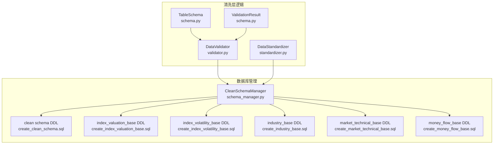
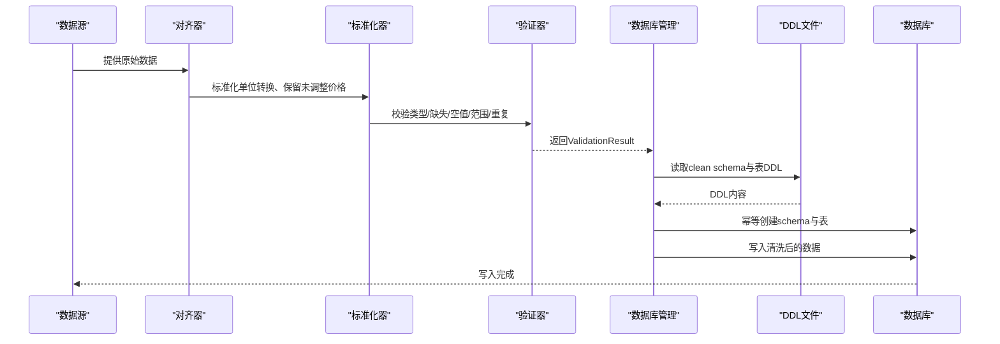
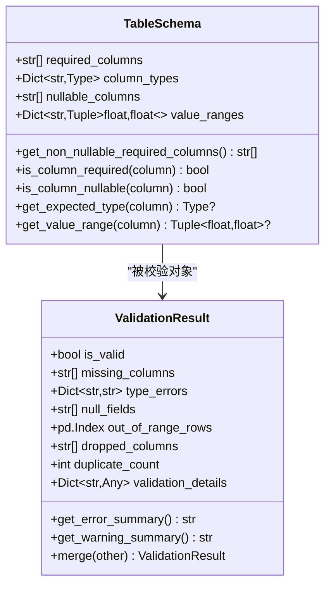
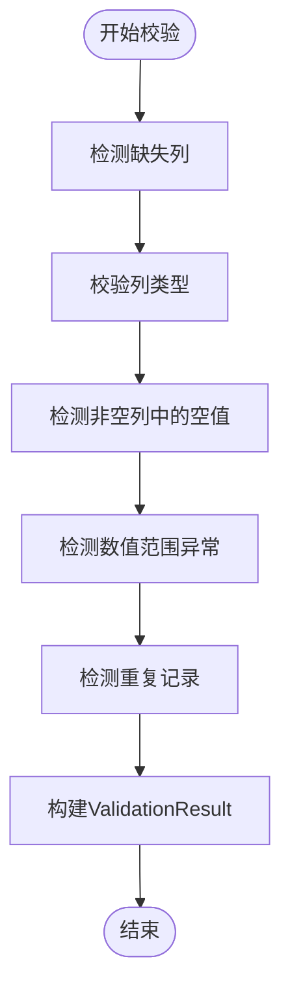
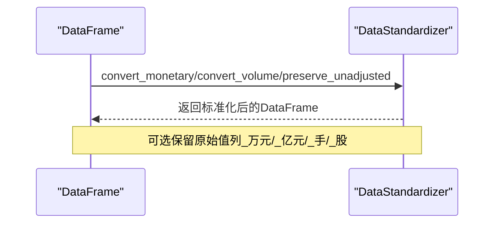
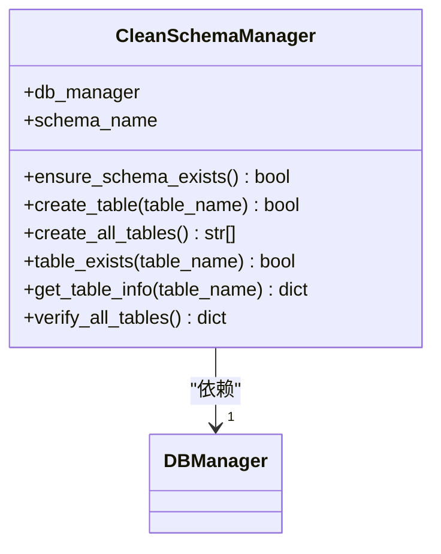
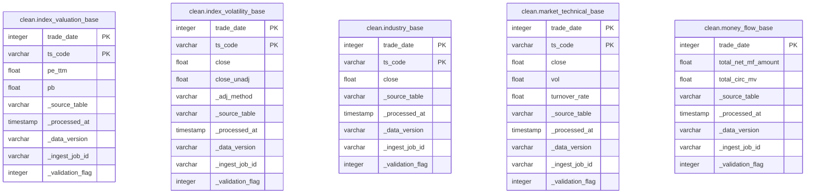
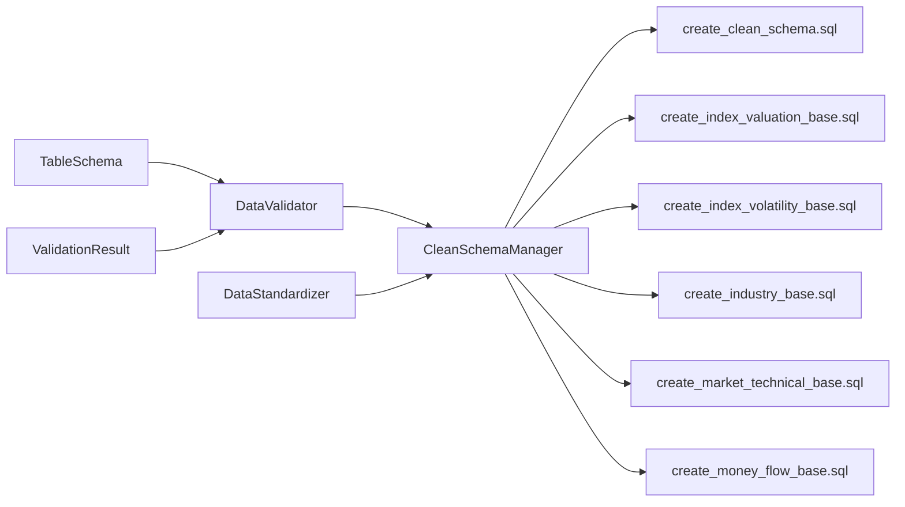

# 清洗层Schema设计

<cite>
**本文引用的文件**
- [schema.py](file://alphahome/processors/clean/schema.py)
- [validator.py](file://alphahome/processors/clean/validator.py)
- [standardizer.py](file://alphahome/processors/clean/standardizer.py)
- [schema_manager.py](file://alphahome/processors/clean/database/schema_manager.py)
- [create_clean_schema.sql](file://alphahome/processors/clean/database/create_clean_schema.sql)
- [create_index_valuation_base.sql](file://alphahome/processors/clean/database/create_index_valuation_base.sql)
- [create_index_volatility_base.sql](file://alphahome/processors/clean/database/create_index_volatility_base.sql)
- [create_industry_base.sql](file://alphahome/processors/clean/database/create_industry_base.sql)
- [create_market_technical_base.sql](file://alphahome/processors/clean/database/create_market_technical_base.sql)
- [create_money_flow_base.sql](file://alphahome/processors/clean/database/create_money_flow_base.sql)
- [test_validator.py](file://alphahome/processors/tests/test_clean_layer/test_validator.py)
- [test_standardizer.py](file://alphahome/processors/tests/test_clean_layer/test_standardizer.py)
</cite>

## 目录
1. [简介](#简介)
2. [项目结构](#项目结构)
3. [核心组件](#核心组件)
4. [架构总览](#架构总览)
5. [详细组件分析](#详细组件分析)
6. [依赖关系分析](#依赖关系分析)
7. [性能考量](#性能考量)
8. [故障排查指南](#故障排查指南)
9. [结论](#结论)

## 简介
本文件系统化梳理清洗层（Clean Layer）的Schema设计，围绕以下目标展开：
- 解析TableSchema类的字段定义、数据类型、约束条件与标准化规则的声明方式
- 结合create_clean_schema.sql与各表DDL，说明clean层数据库表的物理设计原则（主键、索引、分区等）
- 阐述逻辑schema与物理schema之间的映射关系
- 说明如何通过schema定义驱动清洗流程的自动化校验与转换

## 项目结构
清洗层Schema相关代码主要位于processors/clean目录，包含：
- 逻辑Schema定义与验证器：schema.py、validator.py
- 标准化器：standardizer.py
- 数据库Schema管理：database/schema_manager.py
- 各表DDL：database/create_*_base.sql
- 单元测试：processors/tests/test_clean_layer/test_validator.py、test_standardizer.py

图表来源
- [schema.py](file://alphahome/processors/clean/schema.py#L16-L121)
- [validator.py](file://alphahome/processors/clean/validator.py#L39-L127)
- [standardizer.py](file://alphahome/processors/clean/standardizer.py#L46-L118)
- [schema_manager.py](file://alphahome/processors/clean/database/schema_manager.py#L40-L89)
- [create_clean_schema.sql](file://alphahome/processors/clean/database/create_clean_schema.sql#L11-L15)
- [create_index_valuation_base.sql](file://alphahome/processors/clean/database/create_index_valuation_base.sql#L14-L32)
- [create_index_volatility_base.sql](file://alphahome/processors/clean/database/create_index_volatility_base.sql#L14-L32)
- [create_industry_base.sql](file://alphahome/processors/clean/database/create_industry_base.sql#L14-L31)
- [create_market_technical_base.sql](file://alphahome/processors/clean/database/create_market_technical_base.sql#L14-L33)
- [create_money_flow_base.sql](file://alphahome/processors/clean/database/create_money_flow_base.sql#L14-L31)

章节来源
- [schema.py](file://alphahome/processors/clean/schema.py#L16-L121)
- [validator.py](file://alphahome/processors/clean/validator.py#L39-L127)
- [standardizer.py](file://alphahome/processors/clean/standardizer.py#L46-L118)
- [schema_manager.py](file://alphahome/processors/clean/database/schema_manager.py#L40-L89)
- [create_clean_schema.sql](file://alphahome/processors/clean/database/create_clean_schema.sql#L11-L15)

## 核心组件
- TableSchema：定义DataFrame的期望结构与约束，包括必填列、类型、可空性、取值范围
- ValidationResult：封装校验结果，区分失败与警告，并提供汇总信息
- DataValidator：基于TableSchema对DataFrame进行类型、缺失、空值、范围、重复等校验
- DataStandardizer：统一货币单位（万元/亿元→元）、成交量单位（手→股），并保留未调整价格
- CleanSchemaManager：读取DDL文件，确保clean schema存在并创建各表，支持幂等操作与结构验证

章节来源
- [schema.py](file://alphahome/processors/clean/schema.py#L16-L121)
- [validator.py](file://alphahome/processors/clean/validator.py#L39-L127)
- [standardizer.py](file://alphahome/processors/clean/standardizer.py#L46-L118)
- [schema_manager.py](file://alphahome/processors/clean/database/schema_manager.py#L114-L166)

## 架构总览
清洗层的Schema设计由“逻辑Schema + 物理DDL”双轨驱动：
- 逻辑层：以TableSchema描述字段、类型、约束；DataValidator据此对入站数据进行严格校验
- 物理层：以clean schema及各表DDL定义主键、索引、注释等物理属性；CleanSchemaManager负责幂等创建与验证

图表来源
- [schema_manager.py](file://alphahome/processors/clean/database/schema_manager.py#L114-L166)
- [validator.py](file://alphahome/processors/clean/validator.py#L77-L127)
- [standardizer.py](file://alphahome/processors/clean/standardizer.py#L272-L316)
- [create_clean_schema.sql](file://alphahome/processors/clean/database/create_clean_schema.sql#L11-L15)
- [create_index_valuation_base.sql](file://alphahome/processors/clean/database/create_index_valuation_base.sql#L14-L32)

## 详细组件分析

### TableSchema类与ValidationResult类
- 字段与约束
  - required_columns：必填列清单
  - column_types：列到Python类型的映射（str/int/float/bool/datetime）
  - nullable_columns：允许为空的列清单
  - value_ranges：数值列的合法区间映射
- 计算属性与工具方法
  - get_non_nullable_required_columns：非空必填列
  - is_column_required/is_column_nullable/get_expected_type/get_value_range：查询便捷方法
- ValidationResult
  - is_valid：综合有效性（缺失列/类型错误/非空列中的空值才导致失败；范围异常与重复仅计警告）
  - 统计字段：missing_columns、type_errors、null_fields、out_of_range_rows、dropped_columns、duplicate_count
  - 摘要方法：get_error_summary/get_warning_summary
  - 合并：merge用于多步校验结果合并

图表来源
- [schema.py](file://alphahome/processors/clean/schema.py#L16-L121)

章节来源
- [schema.py](file://alphahome/processors/clean/schema.py#L16-L121)

### DataValidator：基于TableSchema的自动化校验
- 校验步骤
  - 缺失列检测：返回缺失列表
  - 类型校验：兼容pandas dtype与期望类型
  - 非空校验：针对非空必填列
  - 范围校验：仅对数值列生效，返回行索引集合（警告）
  - 重复检测：按主键识别重复行（可配合去重）
- 输出
  - ValidationResult：is_valid仅在关键失败项出现时为False
  - 可添加_validation_flag列标记异常行

图表来源
- [validator.py](file://alphahome/processors/clean/validator.py#L77-L127)
- [validator.py](file://alphahome/processors/clean/validator.py#L128-L263)

章节来源
- [validator.py](file://alphahome/processors/clean/validator.py#L77-L127)
- [validator.py](file://alphahome/processors/clean/validator.py#L128-L263)
- [test_validator.py](file://alphahome/processors/tests/test_clean_layer/test_validator.py#L1-L718)

### DataStandardizer：单位标准化与未调整价格保留
- 能力
  - convert_monetary：将货币从“万元/亿元/元”统一为“元”，可保留原值列（带单位后缀）
  - convert_volume：将成交量从“手/股”统一为“股”，可保留原值列（带单位后缀）
  - preserve_unadjusted：为价格列保留_unadj后缀副本，便于后续复权或回测
  - standardize_all：一次性执行上述全部标准化
- 异常
  - StandardizationError：列缺失、未知单位等场景抛出
- 日志
  - 记录转换因子与保留行为，便于审计

图表来源
- [standardizer.py](file://alphahome/processors/clean/standardizer.py#L98-L218)
- [standardizer.py](file://alphahome/processors/clean/standardizer.py#L221-L316)

章节来源
- [standardizer.py](file://alphahome/processors/clean/standardizer.py#L98-L218)
- [standardizer.py](file://alphahome/processors/clean/standardizer.py#L221-L316)
- [test_standardizer.py](file://alphahome/processors/tests/test_clean_layer/test_standardizer.py#L1-L610)

### CleanSchemaManager：物理Schema与表的幂等管理
- 功能
  - ensure_schema_exists：创建clean schema（幂等）
  - create_table：按表名映射DDL文件创建单表
  - create_all_tables：批量创建所有表
  - table_exists/get_table_info/verify_all_tables：结构验证与查询
- 映射关系
  - CLEAN_TABLES：表名到DDL文件的映射
  - SCHEMA_DDL_FILE：schema DDL文件
- 使用建议
  - 开发/预生产环境直接执行；生产环境需DBA审批

图表来源
- [schema_manager.py](file://alphahome/processors/clean/database/schema_manager.py#L114-L166)
- [schema_manager.py](file://alphahome/processors/clean/database/schema_manager.py#L167-L221)

章节来源
- [schema_manager.py](file://alphahome/processors/clean/database/schema_manager.py#L114-L166)
- [schema_manager.py](file://alphahome/processors/clean/database/schema_manager.py#L167-L221)

### 物理Schema与表设计原则
- clean schema
  - 通过create_clean_schema.sql创建，注释说明其作为清洗后统一输入的目标
- 各表DDL要点
  - 主键
    - index_valuation_base、index_volatility_base、industry_base、market_technical_base：(trade_date, ts_code)
    - money_flow_base：(trade_date)，因市场级无ts_code
  - 索引
    - ts_code：常用过滤维度
    - _processed_at：按处理时间过滤
  - 血缘追踪列
    - _source_table、_processed_at、_data_version、_ingest_job_id、_validation_flag
  - 分区
    - DDL注释建议按trade_date月分区（大数据量时启用）

图表来源
- [create_index_valuation_base.sql](file://alphahome/processors/clean/database/create_index_valuation_base.sql#L14-L32)
- [create_index_volatility_base.sql](file://alphahome/processors/clean/database/create_index_volatility_base.sql#L14-L32)
- [create_industry_base.sql](file://alphahome/processors/clean/database/create_industry_base.sql#L14-L31)
- [create_market_technical_base.sql](file://alphahome/processors/clean/database/create_market_technical_base.sql#L14-L33)
- [create_money_flow_base.sql](file://alphahome/processors/clean/database/create_money_flow_base.sql#L14-L31)

章节来源
- [create_clean_schema.sql](file://alphahome/processors/clean/database/create_clean_schema.sql#L11-L15)
- [create_index_valuation_base.sql](file://alphahome/processors/clean/database/create_index_valuation_base.sql#L14-L32)
- [create_index_volatility_base.sql](file://alphahome/processors/clean/database/create_index_volatility_base.sql#L14-L32)
- [create_industry_base.sql](file://alphahome/processors/clean/database/create_industry_base.sql#L14-L31)
- [create_market_technical_base.sql](file://alphahome/processors/clean/database/create_market_technical_base.sql#L14-L33)
- [create_money_flow_base.sql](file://alphahome/processors/clean/database/create_money_flow_base.sql#L14-L31)

## 依赖关系分析
- 逻辑层依赖
  - TableSchema/ValidationResult被DataValidator直接使用
  - DataValidator输出ValidationResult，供上层决策（抛错/标记/写入）
  - DataStandardizer独立于表结构，但与各表的字段命名（如close、vol、ts_code、trade_date）存在约定
- 物理层依赖
  - CleanSchemaManager读取DDL文件，确保schema与表存在且结构正确
  - 各表DDL中主键、索引、注释与血缘追踪列构成统一的物理契约
- 映射关系
  - 逻辑Schema（TableSchema）定义字段语义与约束
  - 物理DDL（各表）定义主键、索引、分区与列注释
  - 二者共同保证数据一致性与可维护性

图表来源
- [schema.py](file://alphahome/processors/clean/schema.py#L16-L121)
- [validator.py](file://alphahome/processors/clean/validator.py#L39-L127)
- [standardizer.py](file://alphahome/processors/clean/standardizer.py#L46-L118)
- [schema_manager.py](file://alphahome/processors/clean/database/schema_manager.py#L40-L89)
- [create_clean_schema.sql](file://alphahome/processors/clean/database/create_clean_schema.sql#L11-L15)
- [create_index_valuation_base.sql](file://alphahome/processors/clean/database/create_index_valuation_base.sql#L14-L32)
- [create_index_volatility_base.sql](file://alphahome/processors/clean/database/create_index_volatility_base.sql#L14-L32)
- [create_industry_base.sql](file://alphahome/processors/clean/database/create_industry_base.sql#L14-L31)
- [create_market_technical_base.sql](file://alphahome/processors/clean/database/create_market_technical_base.sql#L14-L33)
- [create_money_flow_base.sql](file://alphahome/processors/clean/database/create_money_flow_base.sql#L14-L31)

章节来源
- [schema_manager.py](file://alphahome/processors/clean/database/schema_manager.py#L40-L89)

## 性能考量
- 主键与索引
  - 主键采用(ts_code, trade_date)或(trade_date)组合，有利于按标识符与日期快速定位
  - 对ts_code与_processed_at建立二级索引，提升过滤与排序效率
- 分区策略
  - DDL注释建议按trade_date月分区，适合时间序列数据的增量更新与裁剪
- 标准化成本
  - convert_monetary/convert_volume与preserve_unadjusted均为向量化操作，批处理友好
- 校验开销
  - validate_column_types/detect_nulls/detect_out_of_range均基于pandas内置能力，复杂度与数据规模线性相关

[本节为通用指导，无需列出具体文件来源]

## 故障排查指南
- 校验失败
  - 缺失列：检查required_columns是否完整；必要时在上游任务补齐
  - 类型不符：确认column_types与实际dtype兼容；注意datetime类型需使用datetime64_any_dtype
  - 非空列含空值：核对nullable_columns配置；必要时在上游清洗空值
  - 范围异常：查看out_of_range_rows索引，结合业务阈值调整value_ranges
  - 重复记录：使用detect_duplicates定位重复行，再调用deduplicate去重
- 标准化异常
  - 列缺失：convert_monetary/convert_volume/preserve_unadjusted会抛出StandardizationError
  - 未知单位：日志会提示未识别单位，确认上游单位标注是否规范
- 物理层问题
  - schema或表不存在：使用ensure_schema_exists/create_all_tables幂等重建
  - 结构不一致：使用verify_all_tables/get_table_info比对列数与存在性

章节来源
- [validator.py](file://alphahome/processors/clean/validator.py#L176-L263)
- [validator.py](file://alphahome/processors/clean/validator.py#L264-L379)
- [standardizer.py](file://alphahome/processors/clean/standardizer.py#L98-L218)
- [schema_manager.py](file://alphahome/processors/clean/database/schema_manager.py#L114-L166)
- [schema_manager.py](file://alphahome/processors/clean/database/schema_manager.py#L167-L221)

## 结论
清洗层Schema设计通过“逻辑Schema + 物理DDL”的双轨机制，实现了：
- 以TableSchema明确字段语义与约束，保障入站数据质量
- 以CleanSchemaManager与各表DDL定义主键、索引、注释与血缘追踪，形成统一的物理契约
- 以DataValidator与DataStandardizer驱动自动化校验与转换，确保数据一致性与可追溯性

该设计既满足了工程上的可维护性与可扩展性，也为后续特征层与研究层提供了稳定可靠的数据基础。