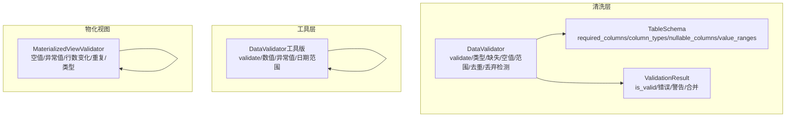
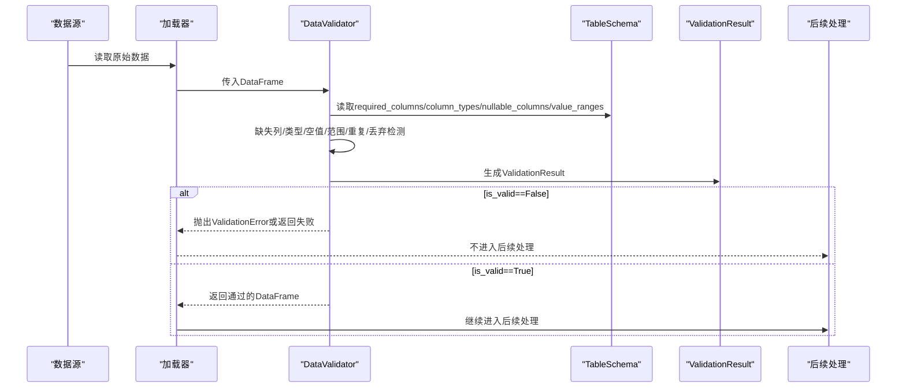
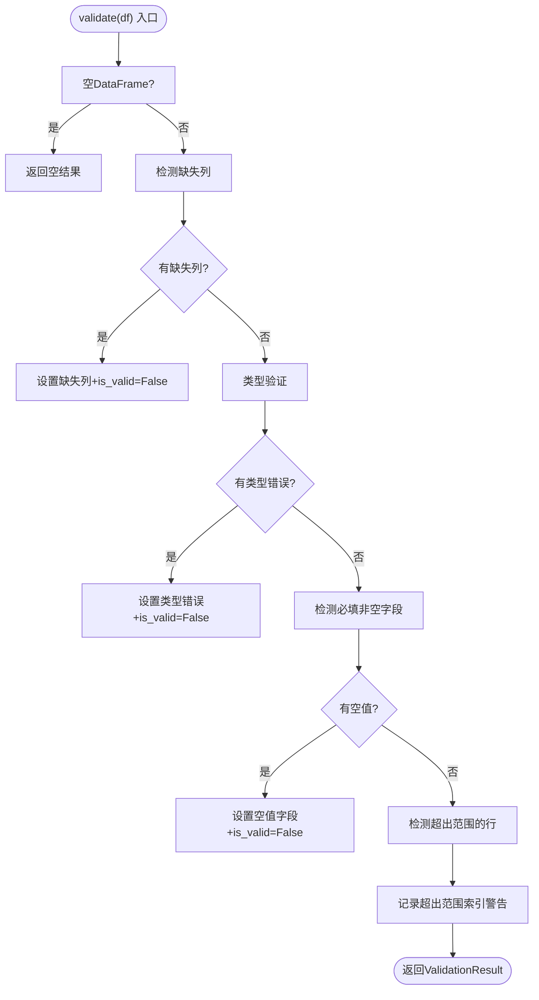
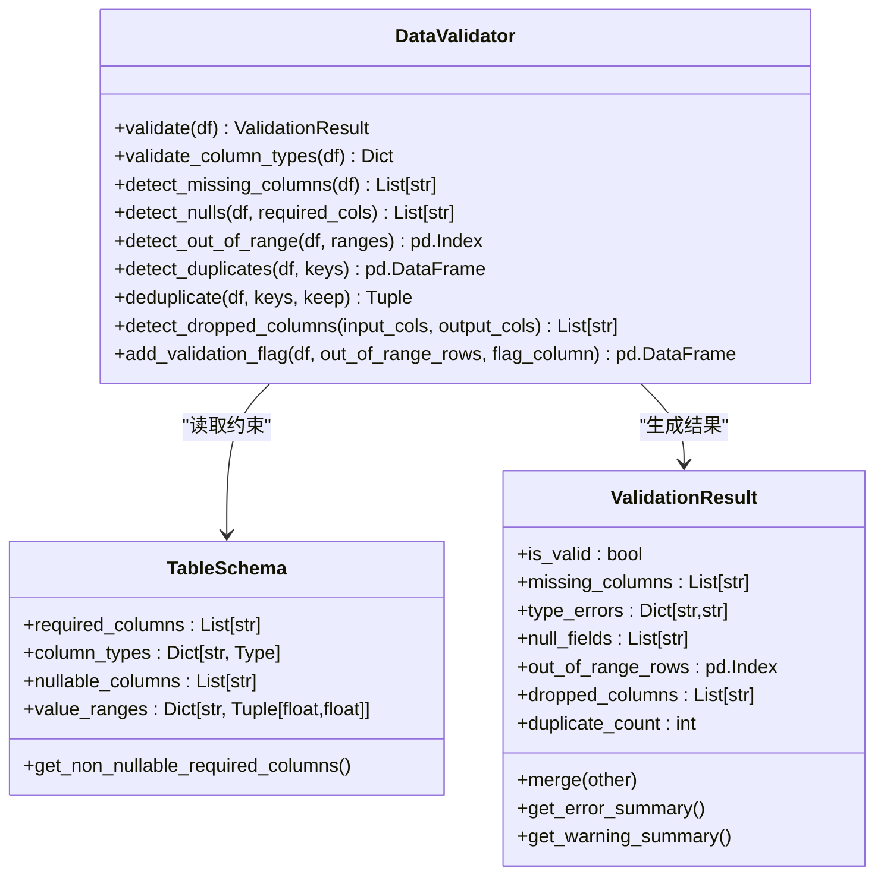

# 验证器（Validator）

<cite>
**本文引用的文件**
- [alphahome/processors/clean/validator.py](file://alphahome/processors/clean/validator.py)
- [alphahome/processors/clean/schema.py](file://alphahome/processors/clean/schema.py)
- [alphahome/processors/tests/test_clean_layer/test_validator.py](file://alphahome/processors/tests/test_clean_layer/test_validator.py)
- [alphahome/processors/utils/data_validator.py](file://alphahome/processors/utils/data_validator.py)
- [alphahome/processors/materialized_views/validator.py](file://alphahome/processors/materialized_views/validator.py)
- [alphahome/processors/tests/test_materialized_views/test_materialized_view_validator.py](file://alphahome/processors/tests/test_materialized_views/test_materialized_view_validator.py)
</cite>

## 目录
1. [简介](#简介)
2. [项目结构](#项目结构)
3. [核心组件](#核心组件)
4. [架构总览](#架构总览)
5. [详细组件分析](#详细组件分析)
6. [依赖关系分析](#依赖关系分析)
7. [性能考量](#性能考量)
8. [故障排查指南](#故障排查指南)
9. [结论](#结论)
10. [附录](#附录)

## 简介
本文件围绕“验证器（Validator）”组件展开，重点说明其如何基于 TableSchema 定义对数据进行质量校验，覆盖列存在性检查、数据类型验证、非空约束与值域范围校验；并通过 validate 方法生成 ValidationResult 对象，汇总错误与警告信息；阐述其在数据处理流水线中的作用，确保只有符合 schema 规范的数据才能进入后续处理阶段；最后给出扩展验证规则的方法与校验失败的处理策略建议。

## 项目结构
Validator 组件主要分布在以下模块：
- 清洗层验证器：DataValidator 与 TableSchema/ValidationResult
- 工具层通用验证器：DataValidator（工具版）
- 物化视图验证器：MaterializedViewValidator（异步检查集）

图表来源
- [alphahome/processors/clean/validator.py](file://alphahome/processors/clean/validator.py#L39-L379)
- [alphahome/processors/clean/schema.py](file://alphahome/processors/clean/schema.py#L16-L229)
- [alphahome/processors/utils/data_validator.py](file://alphahome/processors/utils/data_validator.py#L1-L324)
- [alphahome/processors/materialized_views/validator.py](file://alphahome/processors/materialized_views/validator.py#L1-L513)

章节来源
- [alphahome/processors/clean/validator.py](file://alphahome/processors/clean/validator.py#L39-L379)
- [alphahome/processors/clean/schema.py](file://alphahome/processors/clean/schema.py#L16-L229)
- [alphahome/processors/utils/data_validator.py](file://alphahome/processors/utils/data_validator.py#L1-L324)
- [alphahome/processors/materialized_views/validator.py](file://alphahome/processors/materialized_views/validator.py#L1-L513)

## 核心组件
- DataValidator（清洗层）
  - 基于 TableSchema 执行列存在性、类型、非空、值域范围、重复、丢弃检测等校验
  - 生成 ValidationResult 并维护 is_valid 状态
- TableSchema/ValidationResult
  - 定义表结构与约束，以及验证结果的数据结构与汇总能力
- DataValidator（工具版）
  - 提供更通用的列级验证与转换能力（类型、范围、可选值、默认值、异常值标记/裁剪/移除）
- MaterializedViewValidator（物化视图）
  - 异步执行空值、异常值、行数变化、重复、类型等检查，返回标准化的结果字典

章节来源
- [alphahome/processors/clean/validator.py](file://alphahome/processors/clean/validator.py#L39-L379)
- [alphahome/processors/clean/schema.py](file://alphahome/processors/clean/schema.py#L16-L229)
- [alphahome/processors/utils/data_validator.py](file://alphahome/processors/utils/data_validator.py#L1-L324)
- [alphahome/processors/materialized_views/validator.py](file://alphahome/processors/materialized_views/validator.py#L1-L513)

## 架构总览
Validator 在数据处理流水线中的位置如下：
- 输入：从数据源读取的 DataFrame
- 校验：DataValidator/工具版 DataValidator/MaterializedViewValidator
- 输出：通过 is_valid 或检查结果 status 决定是否继续处理或阻断
- 后续：清洗、特征工程、存储等

图表来源
- [alphahome/processors/clean/validator.py](file://alphahome/processors/clean/validator.py#L77-L127)
- [alphahome/processors/clean/schema.py](file://alphahome/processors/clean/schema.py#L16-L80)
- [alphahome/processors/clean/schema.py](file://alphahome/processors/clean/schema.py#L82-L229)

## 详细组件分析

### 清洗层 DataValidator 与 TableSchema/ValidationResult
- 设计目标
  - 不静默丢弃/重命名列
  - 严格按 TableSchema 执行校验
  - 通过 ValidationResult 汇总错误与警告
- 关键能力
  - 缺失列检测：detect_missing_columns
  - 类型验证：validate_column_types（兼容 pandas dtype 与期望类型）
  - 非空约束：detect_nulls（仅针对非空必填列）
  - 值域范围：detect_out_of_range（仅对数值列生效）
  - 重复检测与去重：detect_duplicates/deduplicate
  - 丢弃列检测：detect_dropped_columns
  - 警示标记：add_validation_flag（为超出范围的记录添加标志列）
- validate 流程
  - 依次执行缺失列、类型、空值、范围检查
  - 范围检查作为警告不改变 is_valid
  - 返回 ValidationResult

图表来源
- [alphahome/processors/clean/validator.py](file://alphahome/processors/clean/validator.py#L77-L127)
- [alphahome/processors/clean/validator.py](file://alphahome/processors/clean/validator.py#L128-L263)
- [alphahome/processors/clean/schema.py](file://alphahome/processors/clean/schema.py#L82-L229)

章节来源
- [alphahome/processors/clean/validator.py](file://alphahome/processors/clean/validator.py#L39-L379)
- [alphahome/processors/clean/schema.py](file://alphahome/processors/clean/schema.py#L16-L229)
- [alphahome/processors/tests/test_clean_layer/test_validator.py](file://alphahome/processors/tests/test_clean_layer/test_validator.py#L107-L718)

### 工具版 DataValidator（通用验证与转换）
- 能力范围
  - 列存在性、必填、类型、最小/最大、可选值、默认值、转换函数
  - 数值列负值处理、缺失值处理（忽略/删除/填充零）、异常值检测与处理（标记/移除/裁剪）
  - 日期列范围检查
- 适用场景
  - 快速构建列级校验与清洗流水线，适合通用数据准备阶段

章节来源
- [alphahome/processors/utils/data_validator.py](file://alphahome/processors/utils/data_validator.py#L1-L324)

### 物化视图 MaterializedViewValidator（异步质量检查）
- 能力范围
  - 空值检查（阈值控制）
  - 异常值检查（IQR/Z-score/百分位）
  - 行数变化检查（阈值控制）
  - 重复检查（主键/复合键）
  - 类型检查（列到期望 dtype 的映射）
- 结果约定
  - 每个检查返回包含 check_name/status/message/details 的字典
  - status 为 pass/warning/error

章节来源
- [alphahome/processors/materialized_views/validator.py](file://alphahome/processors/materialized_views/validator.py#L1-L513)
- [alphahome/processors/tests/test_materialized_views/test_materialized_view_validator.py](file://alphahome/processors/tests/test_materialized_views/test_materialized_view_validator.py#L1-L598)

## 依赖关系分析
- DataValidator 依赖 TableSchema/ValidationResult
- ValidationResult 提供 is_valid 自动更新与汇总能力
- 工具版 DataValidator 与清洗层 DataValidator 功能互补
- 物化视图 Validator 与清洗层 Validator 分别服务于不同层级的质量保障

图表来源
- [alphahome/processors/clean/schema.py](file://alphahome/processors/clean/schema.py#L16-L229)
- [alphahome/processors/clean/validator.py](file://alphahome/processors/clean/validator.py#L39-L379)

章节来源
- [alphahome/processors/clean/schema.py](file://alphahome/processors/clean/schema.py#L16-L229)
- [alphahome/processors/clean/validator.py](file://alphahome/processors/clean/validator.py#L39-L379)

## 性能考量
- 类型兼容判断使用 pandas dtype 检测，避免逐行遍历，复杂度接近 O(C)（C 为存在列数）
- 缺失列/空值/范围检查均基于向量化操作，适合大数据规模
- 重复检测与去重使用 pandas 接口，注意在超大规模数据上可能带来内存压力
- 物化视图 Validator 采用异步接口，便于在流水线中并行执行多项检查

[本节为通用指导，无需列出具体文件来源]

## 故障排查指南
- 常见问题定位
  - 缺失列：查看 ValidationResult.missing_columns
  - 类型错误：查看 ValidationResult.type_errors
  - 必填字段空值：查看 ValidationResult.null_fields
  - 范围外记录：查看 ValidationResult.out_of_range_rows
  - 重复记录：使用 detect_duplicates 或 deduplicate
  - 丢弃列：使用 detect_dropped_columns
- 处理策略建议
  - 缺失列：补充列或调整 schema；必要时使用工具版 DataValidator 的默认值注入
  - 类型错误：统一转换或修正上游数据源；必要时在工具版 DataValidator 中使用 transform
  - 必填字段空值：拒绝批次并回溯上游；或在工具版 DataValidator 中使用默认值/填充
  - 范围外记录：标记后人工复核；或使用工具版 DataValidator 的裁剪/移除策略
  - 重复记录：在清洗层去重，或在物化视图层以错误级别阻断
- 异常传播
  - 清洗层 DataValidator 在关键失败（缺失列/必填空值）时抛出 ValidationError，调用方可据此中断流程

章节来源
- [alphahome/processors/clean/validator.py](file://alphahome/processors/clean/validator.py#L19-L37)
- [alphahome/processors/clean/validator.py](file://alphahome/processors/clean/validator.py#L77-L127)
- [alphahome/processors/clean/schema.py](file://alphahome/processors/clean/schema.py#L82-L229)
- [alphahome/processors/tests/test_clean_layer/test_validator.py](file://alphahome/processors/tests/test_clean_layer/test_validator.py#L313-L329)

## 结论
Validator 组件通过 TableSchema 将数据质量要求显式化，借助 ValidationResult 实现错误与警告的集中管理。清洗层 DataValidator 保证 schema 一致性与数据完整性，工具版 DataValidator 提供灵活的列级验证与转换，物化视图 Validator 则在下游提供异步质量监控。三者协同可在数据处理流水线中形成“前置校验—清洗转换—质量监控”的闭环，显著提升数据可靠性与可维护性。

[本节为总结性内容，无需列出具体文件来源]

## 附录

### validate 方法执行流程（代码路径参考）
- validate 入口与流程
  - [validate 方法](file://alphahome/processors/clean/validator.py#L77-L127)
- 类型验证
  - [validate_column_types](file://alphahome/processors/clean/validator.py#L128-L157)
  - [_is_type_compatible/_type_name](file://alphahome/processors/clean/validator.py#L337-L379)
- 缺失列检测
  - [detect_missing_columns](file://alphahome/processors/clean/validator.py#L158-L175)
- 空值检测
  - [detect_nulls](file://alphahome/processors/clean/validator.py#L203-L227)
- 范围外检测与标记
  - [detect_out_of_range](file://alphahome/processors/clean/validator.py#L228-L263)
  - [add_validation_flag](file://alphahome/processors/clean/validator.py#L315-L336)
- 重复检测与去重
  - [detect_duplicates](file://alphahome/processors/clean/validator.py#L176-L202)
  - [deduplicate](file://alphahome/processors/clean/validator.py#L289-L314)
- 丢弃列检测
  - [detect_dropped_columns](file://alphahome/processors/clean/validator.py#L264-L288)
- ValidationResult 汇总与判定
  - [ValidationResult](file://alphahome/processors/clean/schema.py#L82-L229)

### 自定义校验规则扩展建议
- 清洗层 DataValidator
  - 在 validate 中增加新的检查步骤，如唯一性、格式校验（正则/枚举），并将结果写入 ValidationResult
  - 通过 TableSchema 扩展约束（如新增 value_ranges 或 nullable_columns）
- 工具版 DataValidator
  - 在 validate 中为列定义 transform 函数，实现复杂转换
  - 使用 detect_outliers 的“裁剪/移除/标记”策略处理异常值
- 物化视图 Validator
  - 通过配置项扩展检查阈值与方法，或新增检查类型（如分布稳定性、单调性等）

[本节为方法路径指引，已在上方以文件路径标注]