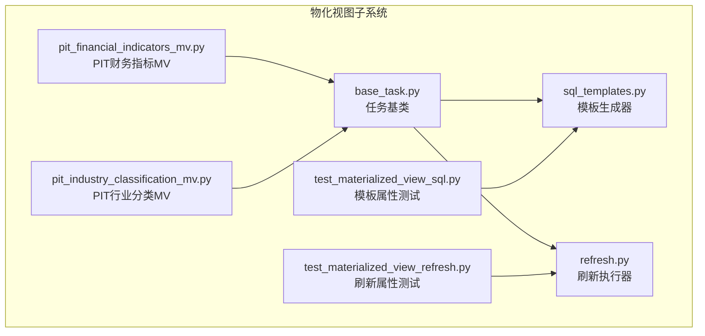
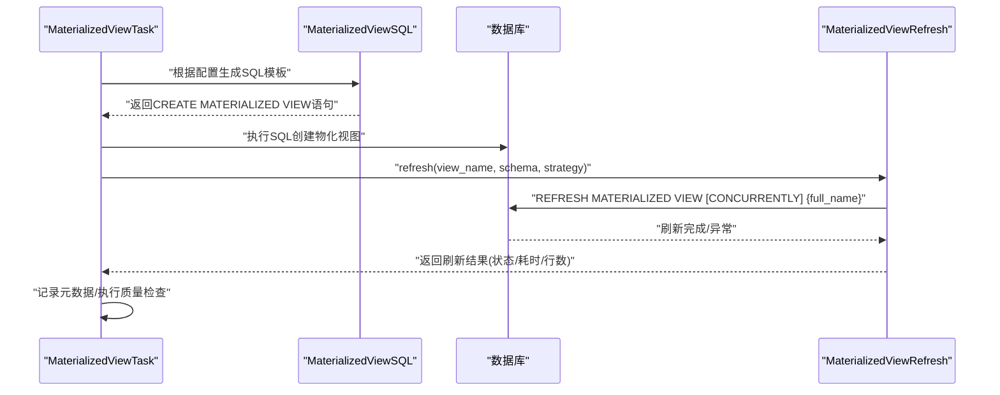
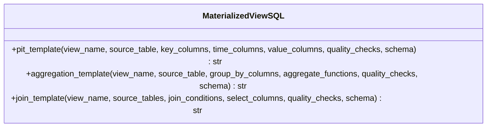
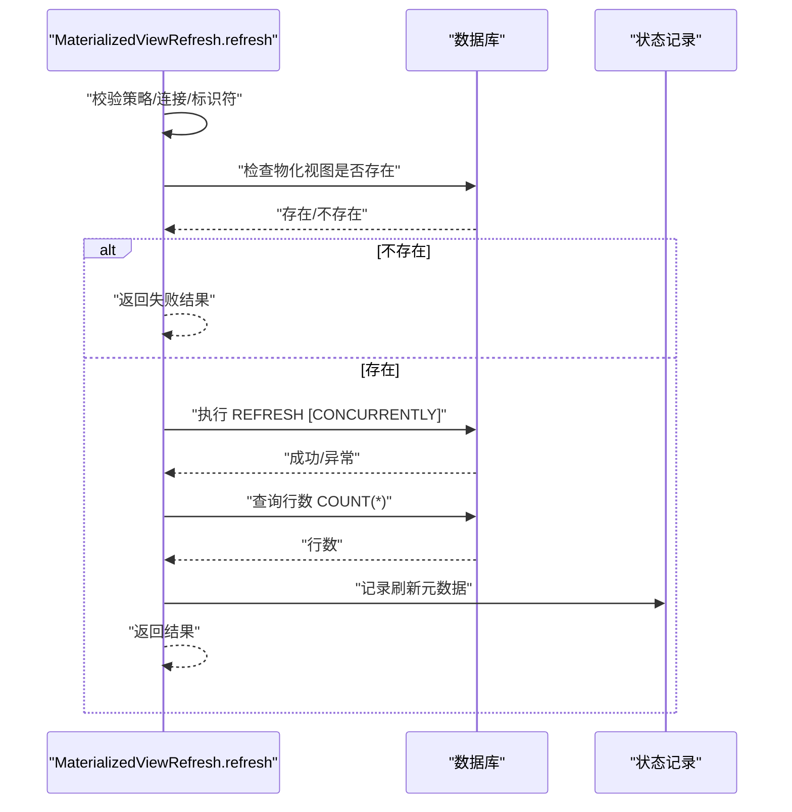
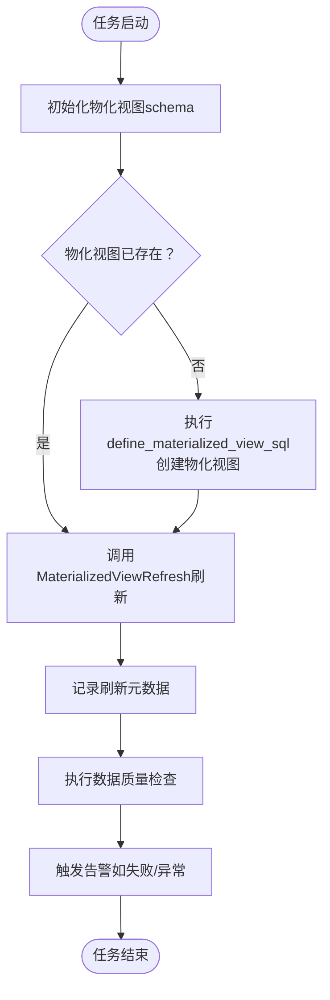
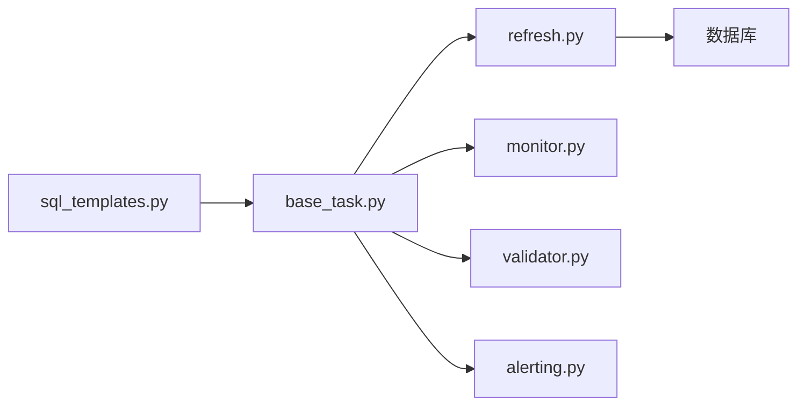

# 动态SQL模板引擎

<cite>
**本文引用的文件**
- [sql_templates.py](file://alphahome/processors/materialized_views/sql_templates.py)
- [refresh.py](file://alphahome/processors/materialized_views/refresh.py)
- [base_task.py](file://alphahome/processors/materialized_views/base_task.py)
- [pit_financial_indicators_mv.py](file://alphahome/processors/tasks/pit/pit_financial_indicators_mv.py)
- [pit_industry_classification_mv.py](file://alphahome/processors/tasks/pit/pit_industry_classification_mv.py)
- [test_materialized_view_sql.py](file://alphahome/processors/tests/test_materialized_views/test_materialized_view_sql.py)
- [test_materialized_view_refresh.py](file://alphahome/processors/tests/test_materialized_views/test_materialized_view_refresh.py)
</cite>

## 目录
1. [简介](#简介)
2. [项目结构](#项目结构)
3. [核心组件](#核心组件)
4. [架构总览](#架构总览)
5. [详细组件分析](#详细组件分析)
6. [依赖关系分析](#依赖关系分析)
7. [性能与安全考量](#性能与安全考量)
8. [故障排查指南](#故障排查指南)
9. [结论](#结论)
10. [附录](#附录)

## 简介
本文件深入解析动态SQL模板引擎在物化视图系统中的应用，重点围绕 sql_templates.py 中的 MaterializedViewSQL 类，说明其如何通过模板化方式构建复杂的物化视图刷新语句；并结合 refresh.py 的实际调用场景，展示如何利用模板生成全量刷新、并发刷新以及依赖重建等不同类型的SQL命令。同时分析该设计对代码可维护性与扩展性的提升作用。

## 项目结构
物化视图子系统位于 processors/materialized_views 目录下，包含模板生成、刷新执行、任务编排、监控与告警等模块。核心文件如下：
- sql_templates.py：定义三种物化视图模板（PIT、聚合、JOIN），统一生成 CREATE MATERIALIZED VIEW 语句
- refresh.py：封装 REFRESH MATERIALIZED VIEW 的执行流程，支持 full 与 concurrent 策略
- base_task.py：物化视图任务基类，负责运行生命周期、刷新、质量检查与元数据记录
- pit_*_mv.py：具体物化视图任务示例，演示如何在 define_materialized_view_sql 中使用模板或直接编写SQL
- 测试文件：覆盖模板正确性、刷新幂等性与策略行为

图表来源
- [sql_templates.py](file://alphahome/processors/materialized_views/sql_templates.py#L1-L344)
- [refresh.py](file://alphahome/processors/materialized_views/refresh.py#L1-L364)
- [base_task.py](file://alphahome/processors/materialized_views/base_task.py#L1-L377)
- [pit_financial_indicators_mv.py](file://alphahome/processors/tasks/pit/pit_financial_indicators_mv.py#L1-L140)
- [pit_industry_classification_mv.py](file://alphahome/processors/tasks/pit/pit_industry_classification_mv.py#L1-L157)
- [test_materialized_view_sql.py](file://alphahome/processors/tests/test_materialized_views/test_materialized_view_sql.py#L1-L606)
- [test_materialized_view_refresh.py](file://alphahome/processors/tests/test_materialized_views/test_materialized_view_refresh.py#L1-L593)

章节来源
- [sql_templates.py](file://alphahome/processors/materialized_views/sql_templates.py#L1-L344)
- [refresh.py](file://alphahome/processors/materialized_views/refresh.py#L1-L364)
- [base_task.py](file://alphahome/processors/materialized_views/base_task.py#L1-L377)

## 核心组件
- MaterializedViewSQL：提供三类模板方法，分别面向PIT时间序列展开、横截面聚合与多表JOIN，统一生成带血缘元数据与数据校验的物化视图SQL
- MaterializedViewRefresh：封装物化视图刷新流程，支持 full 与 concurrent 策略，自动回退与状态记录
- MaterializedViewTask：任务基类，协调创建/刷新/质量检查/监控/告警，统一入口 run()

章节来源
- [sql_templates.py](file://alphahome/processors/materialized_views/sql_templates.py#L18-L344)
- [refresh.py](file://alphahome/processors/materialized_views/refresh.py#L22-L364)
- [base_task.py](file://alphahome/processors/materialized_views/base_task.py#L17-L377)

## 架构总览
动态SQL模板引擎与刷新执行器协同工作，形成“模板生成SQL -> 执行刷新 -> 记录元数据 -> 质量检查”的闭环。

图表来源
- [base_task.py](file://alphahome/processors/materialized_views/base_task.py#L83-L114)
- [refresh.py](file://alphahome/processors/materialized_views/refresh.py#L62-L199)
- [sql_templates.py](file://alphahome/processors/materialized_views/sql_templates.py#L34-L149)

## 详细组件分析

### MaterializedViewSQL 模板引擎
- 设计理念
  - 将物化视图构建拆解为固定步骤：数据对齐、数据标准化、业务逻辑（模板内）、血缘元数据、数据校验
  - 通过参数化输入（键列、时间列、数值列、聚合函数、JOIN条件等）拼接SQL片段，保证一致性与可维护性
- 关键能力
  - PIT模板：时间序列展开（query_start_date/query_end_date），数值列CAST为DECIMAL，内置OUTLIER范围检查
  - 聚合模板：支持SUM/AVG/COUNT/MIN/MAX/STDDEV，自动生成GROUP BY与ORDER BY
  - JOIN模板：支持多表INNER JOIN，自动注入血缘元数据（_source_tables）
- 安全与健壮性
  - 对输入参数进行严格校验（空集合抛出异常），避免无效模板
  - 使用文本缩进工具规范化输出，确保可读性与一致性

图表来源
- [sql_templates.py](file://alphahome/processors/materialized_views/sql_templates.py#L34-L344)

章节来源
- [sql_templates.py](file://alphahome/processors/materialized_views/sql_templates.py#L34-L344)

### MaterializedViewRefresh 刷新执行器
- 刷新策略
  - full：REFRESH MATERIALIZED VIEW（阻塞查询）
  - concurrent：REFRESH MATERIALIZED VIEW CONCURRENTLY（非阻塞，失败则回退至full）
- 安全与健壮性
  - 对schema与view_name进行标识符白名单校验，防止SQL注入
  - 自动检查物化视图是否存在，不存在则返回失败并记录错误
  - 记录刷新元数据（状态、耗时、行数、策略、错误信息），便于监控与告警
- 可观测性
  - 提供 get_refresh_status 获取最近一次刷新状态
  - 内部维护 _refresh_status 字典，便于跨流程共享

图表来源
- [refresh.py](file://alphahome/processors/materialized_views/refresh.py#L62-L199)

章节来源
- [refresh.py](file://alphahome/processors/materialized_views/refresh.py#L22-L364)

### MaterializedViewTask 任务编排
- 生命周期
  - 确保元数据表存在
  - 若物化视图不存在则创建（执行 define_materialized_view_sql 返回的SQL）
  - 刷新物化视图（调用 MaterializedViewRefresh）
  - 记录刷新元数据
  - 执行数据质量检查（基于样本与配置）
  - 告警与结果归档
- 与模板的关系
  - 任务可通过 define_materialized_view_sql 直接返回SQL，也可委托 MaterializedViewSQL 生成模板SQL
  - 统一的刷新策略与质量检查配置贯穿整个生命周期

图表来源
- [base_task.py](file://alphahome/processors/materialized_views/base_task.py#L210-L327)

章节来源
- [base_task.py](file://alphahome/processors/materialized_views/base_task.py#L17-L377)

### 实际调用场景与模板使用
- PIT财务指标物化视图
  - 在 define_materialized_view_sql 中返回完整SQL，包含数据对齐、时间序列展开、数值标准化与血缘元数据
  - 任务基类负责创建/刷新/质量检查与监控
- PIT行业分类物化视图
  - 同样通过 define_materialized_view_sql 返回SQL，强调行业分类字段的标准化与时间序列展开
- 模板化SQL生成
  - 对于通用模式，可在任务中调用 MaterializedViewSQL 的模板方法生成SQL，减少手写SQL的重复与错误
  - 测试用例覆盖了模板生成的正确性（语法、组件完整性、元数据、校验条件）

章节来源
- [pit_financial_indicators_mv.py](file://alphahome/processors/tasks/pit/pit_financial_indicators_mv.py#L58-L130)
- [pit_industry_classification_mv.py](file://alphahome/processors/tasks/pit/pit_industry_classification_mv.py#L58-L147)
- [test_materialized_view_sql.py](file://alphahome/processors/tests/test_materialized_views/test_materialized_view_sql.py#L140-L606)

## 依赖关系分析
- 模块耦合
  - base_task 依赖 refresh 与 validator/monitor/alerting，形成任务生命周期闭环
  - sql_templates 与 base_task 解耦，通过 define_materialized_view_sql 接口对接
  - refresh 仅依赖数据库连接抽象，具备良好的可测试性
- 外部依赖
  - PostgreSQL 物化视图语法（CREATE/REFRESH/CONCURRENTLY）
  - 异步数据库访问接口（execute/fetch_val）

图表来源
- [base_task.py](file://alphahome/processors/materialized_views/base_task.py#L17-L377)
- [refresh.py](file://alphahome/processors/materialized_views/refresh.py#L22-L364)

章节来源
- [base_task.py](file://alphahome/processors/materialized_views/base_task.py#L17-L377)
- [refresh.py](file://alphahome/processors/materialized_views/refresh.py#L22-L364)

## 性能与安全考量
- 性能
  - 使用物化视图预计算，显著降低查询时延
  - concurrent 刷新在满足前置条件（如唯一索引）时可避免阻塞查询
  - 聚合模板自动添加 GROUP BY 与 ORDER BY，利于后续查询优化
- 安全
  - 刷新执行器对标识符进行白名单校验，防止SQL注入
  - 模板生成器对输入参数进行严格校验，避免构造无效SQL
- 可维护性
  - 模板化统一了物化视图构建步骤，减少重复逻辑
  - 任务基类封装了创建/刷新/质量检查/监控/告警，职责清晰
  - 测试用例覆盖模板正确性与刷新幂等性，保障稳定性

[本节为通用指导，无需列出章节来源]

## 故障排查指南
- 刷新失败
  - 检查物化视图是否存在；若不存在，先创建再刷新
  - concurrent 刷新失败会自动回退至 full；关注日志中的回退提示
  - 检查数据库连接是否可用，确认 execute/fetch_val 接口可用
- SQL生成异常
  - 确认传入参数（键列、时间列、数值列、聚合函数、JOIN条件）非空且合法
  - 校验模板生成的SQL是否包含必需关键字（CREATE/SELECT/FROM/WHERE/GROUP BY/ORDER BY）
- 质量检查
  - 通过任务基类的质量检查流程，定位缺失值、异常值、行数变化等问题
  - 结合监控与告警记录，快速定位问题根因

章节来源
- [refresh.py](file://alphahome/processors/materialized_views/refresh.py#L111-L199)
- [test_materialized_view_refresh.py](file://alphahome/processors/tests/test_materialized_views/test_materialized_view_refresh.py#L253-L360)
- [test_materialized_view_sql.py](file://alphahome/processors/tests/test_materialized_views/test_materialized_view_sql.py#L140-L210)

## 结论
动态SQL模板引擎通过参数化与模板化的方式，将物化视图构建的通用步骤固化为可复用的模板，显著提升了代码的一致性与可维护性。结合刷新执行器的策略选择与安全校验，以及任务基类的生命周期编排，形成了从模板生成、创建、刷新、监控到告警的完整闭环。该设计既满足了复杂业务场景下的SQL定制需求，又通过严格的测试与安全措施保障了系统的可靠性与安全性。

[本节为总结性内容，无需列出章节来源]

## 附录
- 模板类型与适用场景
  - PIT模板：适用于时间序列展开（query_start_date/query_end_date）
  - 聚合模板：适用于横截面统计与分组聚合
  - JOIN模板：适用于多表关联的物化视图
- 刷新策略选择建议
  - 生产环境优先考虑 concurrent（满足前置条件），以降低对在线查询的影响
  - 首次创建或依赖重建时使用 full，确保一致性

[本节为补充说明，无需列出章节来源]