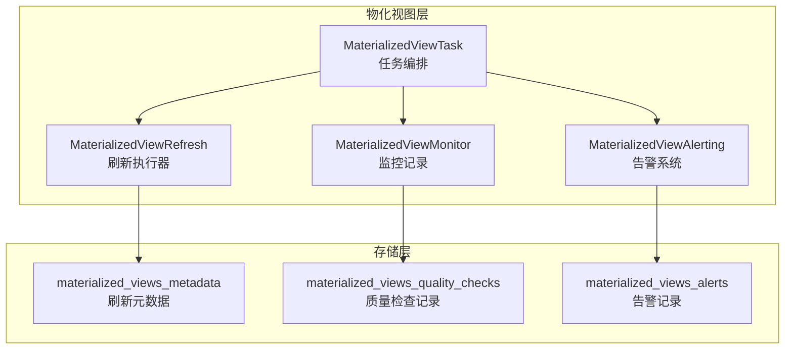
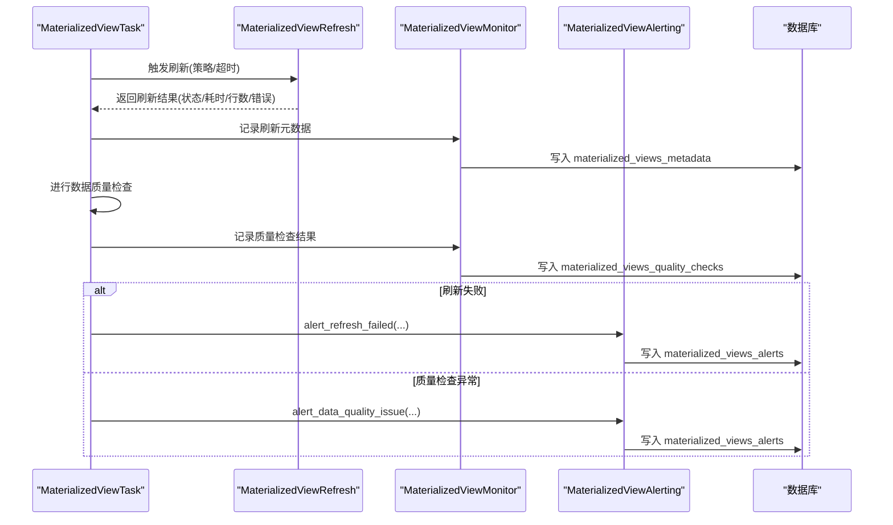
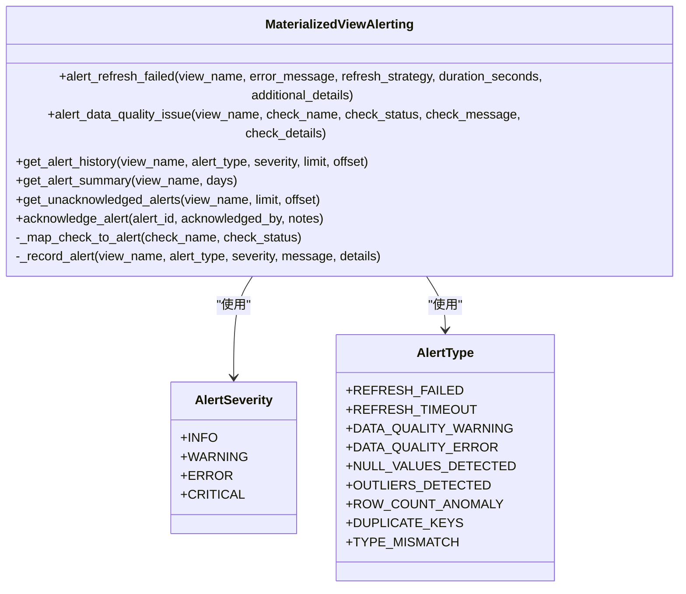
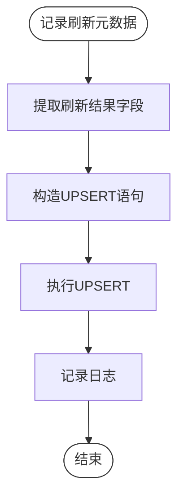
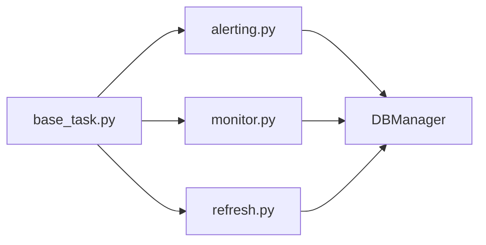
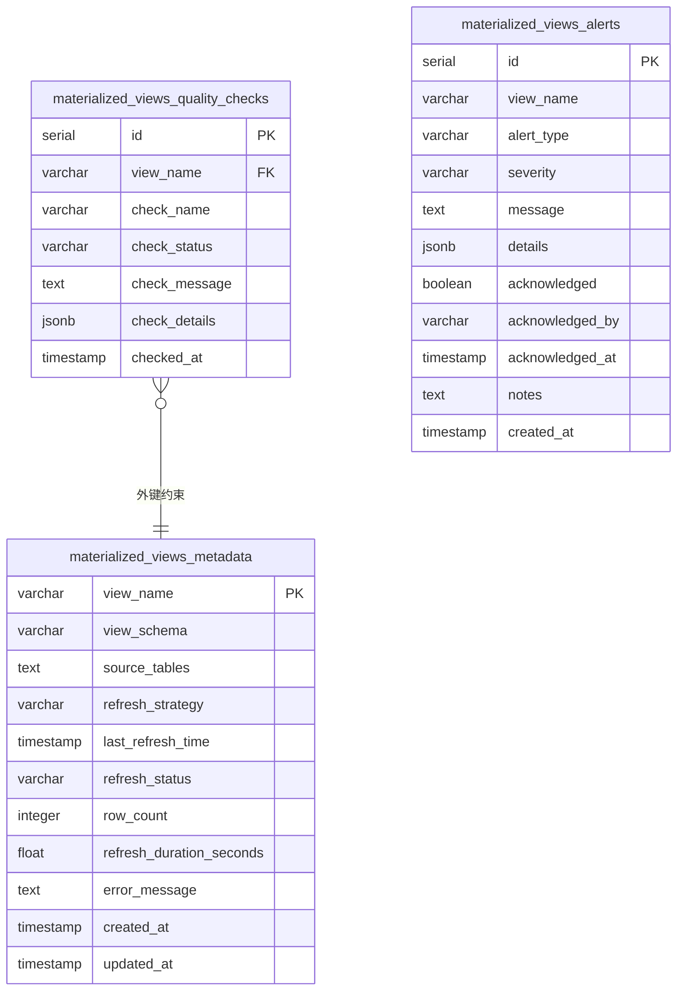

# 告警与通知机制

<cite>
**本文引用的文件**
- [alerting.py](file://alphahome/processors/materialized_views/alerting.py)
- [monitor.py](file://alphahome/processors/materialized_views/monitor.py)
- [database_init.py](file://alphahome/processors/materialized_views/database_init.py)
- [refresh.py](file://alphahome/processors/materialized_views/refresh.py)
- [base_task.py](file://alphahome/processors/materialized_views/base_task.py)
- [test_materialized_view_alerting.py](file://alphahome/processors/tests/test_materialized_views/test_materialized_view_alerting.py)
- [test_materialized_view_monitor.py](file://alphahome/processors/tests/test_materialized_views/test_materialized_view_monitor.py)
</cite>

## 目录
1. [简介](#简介)
2. [项目结构](#项目结构)
3. [核心组件](#核心组件)
4. [架构总览](#架构总览)
5. [详细组件分析](#详细组件分析)
6. [依赖关系分析](#依赖关系分析)
7. [性能考量](#性能考量)
8. [故障排查指南](#故障排查指南)
9. [结论](#结论)
10. [附录](#附录)

## 简介
本文件系统性阐述基于物化视图的告警与通知机制，重点说明告警系统如何依托 monitor 模块采集的监控数据触发异常告警；如何通过阈值与规则映射实现告警级别划分（如延迟过高、刷新失败等）；以及如何与外部通知系统集成，确保关键问题能及时传达给运维团队。文档同时给出告警事件的生成、去重与发送流程，并提供可视化图示帮助理解。

## 项目结构
告警与通知机制位于 processors/materialized_views 子模块，围绕以下文件协同工作：
- alerting.py：告警生成、查询与确认
- monitor.py：刷新元数据与数据质量检查记录
- database_init.py：物化视图表结构初始化（含告警表）
- refresh.py：刷新执行器，产出刷新元数据
- base_task.py：物化视图任务封装，串联刷新与告警
- 测试文件：验证告警行为与查询接口

图表来源
- [base_task.py](file://alphahome/processors/materialized_views/base_task.py#L280-L326)
- [refresh.py](file://alphahome/processors/materialized_views/refresh.py#L63-L200)
- [monitor.py](file://alphahome/processors/materialized_views/monitor.py#L39-L121)
- [alerting.py](file://alphahome/processors/materialized_views/alerting.py#L141-L207)
- [database_init.py](file://alphahome/processors/materialized_views/database_init.py#L218-L287)

章节来源
- [alerting.py](file://alphahome/processors/materialized_views/alerting.py#L1-L380)
- [monitor.py](file://alphahome/processors/materialized_views/monitor.py#L1-L407)
- [database_init.py](file://alphahome/processors/materialized_views/database_init.py#L218-L287)
- [refresh.py](file://alphahome/processors/materialized_views/refresh.py#L63-L200)
- [base_task.py](file://alphahome/processors/materialized_views/base_task.py#L280-L326)

## 核心组件
- 告警系统（MaterializedViewAlerting）
  - 刷新失败告警：根据错误信息判定超时或失败，记录告警并写入告警表
  - 数据质量告警：将检查名称映射为告警类型，按状态映射严重级别，记录告警
  - 历史查询与统计：支持按视图名、告警类型、严重级别过滤，支持未确认告警查询与确认
- 监控器（MaterializedViewMonitor）
  - 刷新元数据记录：记录刷新时间、耗时、行数、错误信息等
  - 质量检查记录：记录检查名称、状态、消息与详情
- 刷新执行器（MaterializedViewRefresh）
  - 执行 REFRESH MATERIALIZED VIEW（FULL/CONCURRENT），产出刷新结果
- 任务编排（MaterializedViewTask）
  - 在刷新后进行数据质量检查，调用 monitor 记录检查结果，并触发 alerting 发出告警

章节来源
- [alerting.py](file://alphahome/processors/materialized_views/alerting.py#L50-L140)
- [monitor.py](file://alphahome/processors/materialized_views/monitor.py#L39-L121)
- [refresh.py](file://alphahome/processors/materialized_views/refresh.py#L63-L200)
- [base_task.py](file://alphahome/processors/materialized_views/base_task.py#L280-L326)

## 架构总览
告警系统围绕“刷新—检查—告警”闭环构建，数据流如下：
- 刷新执行器完成刷新并返回结果
- 监控器记录刷新元数据与质量检查结果
- 告警系统根据刷新结果与检查结果生成告警
- 历史查询与统计用于运维复盘与确认

图表来源
- [base_task.py](file://alphahome/processors/materialized_views/base_task.py#L280-L326)
- [refresh.py](file://alphahome/processors/materialized_views/refresh.py#L63-L200)
- [monitor.py](file://alphahome/processors/materialized_views/monitor.py#L39-L121)
- [alerting.py](file://alphahome/processors/materialized_views/alerting.py#L50-L140)
- [database_init.py](file://alphahome/processors/materialized_views/database_init.py#L218-L287)

## 详细组件分析

### 告警系统（MaterializedViewAlerting）
- 告警类型与严重级别
  - 类型：刷新失败、刷新超时、数据质量警告/错误、空值检测、离群点检测、行数异常、重复键、类型不匹配
  - 级别：info、warning、error、critical
- 刷新失败告警
  - 依据错误信息是否包含“timeout”判定为超时告警，否则为失败告警
  - 记录刷新策略、耗时与附加详情
- 数据质量告警
  - 将检查名称映射为具体告警类型
  - 检查状态为 warning 映射为 warning，error 映射为 error
  - 记录检查名称、状态、消息与详情
- 历史与统计
  - 支持按视图名、告警类型、严重级别过滤查询
  - 支持未确认告警查询与确认（更新 acknowledged、确认人、确认时间、备注）

图表来源
- [alerting.py](file://alphahome/processors/materialized_views/alerting.py#L20-L41)
- [alerting.py](file://alphahome/processors/materialized_views/alerting.py#L50-L140)
- [alerting.py](file://alphahome/processors/materialized_views/alerting.py#L141-L207)
- [alerting.py](file://alphahome/processors/materialized_views/alerting.py#L209-L255)
- [alerting.py](file://alphahome/processors/materialized_views/alerting.py#L256-L321)
- [alerting.py](file://alphahome/processors/materialized_views/alerting.py#L322-L339)
- [alerting.py](file://alphahome/processors/materialized_views/alerting.py#L340-L356)
- [alerting.py](file://alphahome/processors/materialized_views/alerting.py#L357-L380)

章节来源
- [alerting.py](file://alphahome/processors/materialized_views/alerting.py#L20-L41)
- [alerting.py](file://alphahome/processors/materialized_views/alerting.py#L50-L140)
- [alerting.py](file://alphahome/processors/materialized_views/alerting.py#L141-L207)
- [alerting.py](file://alphahome/processors/materialized_views/alerting.py#L209-L255)
- [alerting.py](file://alphahome/processors/materialized_views/alerting.py#L256-L321)
- [alerting.py](file://alphahome/processors/materialized_views/alerting.py#L322-L339)
- [alerting.py](file://alphahome/processors/materialized_views/alerting.py#L340-L356)
- [alerting.py](file://alphahome/processors/materialized_views/alerting.py#L357-L380)

### 监控器（MaterializedViewMonitor）
- 刷新元数据记录
  - 记录视图名称、schema、源表、刷新策略、最后刷新时间、状态、行数、耗时、错误信息
  - 使用 UPSERT 保证幂等更新
- 质量检查记录
  - 记录检查名称、状态、消息与详情（JSON）
- 历史查询
  - 刷新历史、最新刷新状态、质量检查历史

图表来源
- [monitor.py](file://alphahome/processors/materialized_views/monitor.py#L39-L121)

章节来源
- [monitor.py](file://alphahome/processors/materialized_views/monitor.py#L39-L121)
- [monitor.py](file://alphahome/processors/materialized_views/monitor.py#L129-L199)
- [monitor.py](file://alphahome/processors/materialized_views/monitor.py#L207-L266)
- [monitor.py](file://alphahome/processors/materialized_views/monitor.py#L267-L331)
- [monitor.py](file://alphahome/processors/materialized_views/monitor.py#L339-L407)

### 刷新执行器（MaterializedViewRefresh）
- 支持 FULL 与 CONCURRENT 两种刷新策略
- 自动回退：CONCURRENT 失败时回退至 FULL
- 返回刷新结果（状态、耗时、行数、错误信息等）

章节来源
- [refresh.py](file://alphahome/processors/materialized_views/refresh.py#L63-L200)
- [refresh.py](file://alphahome/processors/materialized_views/refresh.py#L267-L308)
- [refresh.py](file://alphahome/processors/materialized_views/refresh.py#L309-L364)

### 任务编排（MaterializedViewTask）
- 在刷新后执行数据质量检查
- 调用 monitor 记录质量检查结果
- 调用 alerting 发出告警（失败或检查异常）

章节来源
- [base_task.py](file://alphahome/processors/materialized_views/base_task.py#L280-L326)

## 依赖关系分析
- 组件耦合
  - MaterializedViewTask 依赖 MaterializedViewRefresh、MaterializedViewMonitor、MaterializedViewAlerting
  - MaterializedViewAlerting 依赖数据库管理器（DBManager）写入告警表
  - MaterializedViewMonitor 依赖数据库管理器写入元数据与质量检查表
- 外部依赖
  - 数据库：materialized_views_metadata、materialized_views_quality_checks、materialized_views_alerts
- 可能的循环依赖
  - 无直接循环依赖，各模块职责清晰

图表来源
- [base_task.py](file://alphahome/processors/materialized_views/base_task.py#L280-L326)
- [alerting.py](file://alphahome/processors/materialized_views/alerting.py#L46-L56)
- [monitor.py](file://alphahome/processors/materialized_views/monitor.py#L29-L37)
- [refresh.py](file://alphahome/processors/materialized_views/refresh.py#L37-L47)

章节来源
- [base_task.py](file://alphahome/processors/materialized_views/base_task.py#L280-L326)
- [alerting.py](file://alphahome/processors/materialized_views/alerting.py#L46-L56)
- [monitor.py](file://alphahome/processors/materialized_views/monitor.py#L29-L37)
- [refresh.py](file://alphahome/processors/materialized_views/refresh.py#L37-L47)

## 性能考量
- 告警写入
  - 告警记录采用单条 INSERT，JSON 序列化 details，建议控制详情大小，避免过大 JSON 影响写入性能
- 查询优化
  - 告警表已建立多索引（视图名+时间、严重级别+时间、未确认+时间、告警类型+时间），有利于历史查询与统计
- 刷新与检查
  - 刷新执行器支持并发刷新回退，减少长时间锁等待；质量检查在刷新后进行，避免重复扫描

章节来源
- [alerting.py](file://alphahome/processors/materialized_views/alerting.py#L357-L380)
- [database_init.py](file://alphahome/processors/materialized_views/database_init.py#L264-L287)
- [database_init.py](file://alphahome/processors/materialized_views/database_init.py#L289-L324)
- [refresh.py](file://alphahome/processors/materialized_views/refresh.py#L286-L308)

## 故障排查指南
- 刷新失败告警
  - 若错误信息包含“timeout”，将被标记为刷新超时；否则为刷新失败
  - 建议检查数据库连接、网络与查询超时设置
- 数据质量告警
  - 检查名称映射到具体告警类型，状态为 warning 映射为 warning，error 映射为 error
  - 建议核对质量检查阈值与样本规模
- 历史与统计
  - 使用 get_alert_history 与 get_alert_summary 排查近期告警趋势
  - 使用 get_unacknowledged_alerts 快速定位未处理告警
- 确认告警
  - 使用 acknowledge_alert 标记已处理，便于后续统计与复盘

章节来源
- [alerting.py](file://alphahome/processors/materialized_views/alerting.py#L50-L140)
- [alerting.py](file://alphahome/processors/materialized_views/alerting.py#L141-L207)
- [alerting.py](file://alphahome/processors/materialized_views/alerting.py#L209-L255)
- [alerting.py](file://alphahome/processors/materialized_views/alerting.py#L256-L321)
- [alerting.py](file://alphahome/processors/materialized_views/alerting.py#L322-L339)

## 结论
该告警系统通过 monitor 模块采集刷新元数据与质量检查结果，再由 alerting 模块进行规则映射与告警生成，形成“刷新—检查—告警”的闭环。系统具备完善的查询与统计能力，并通过数据库索引提升查询效率。当前实现聚焦于记录与查询，未内建外部通知通道（如邮件、消息队列），但可通过扩展 alerting 的 _record_alert 或引入外部调度器对接通知系统来实现。

## 附录

### 告警阈值与规则映射
- 刷新失败/超时
  - 超时判定：错误信息包含“timeout”
  - 失败与超时分别映射为不同告警类型
- 数据质量检查
  - 检查名称映射为具体告警类型（空值、离群点、行数异常、重复键、类型不匹配）
  - 检查状态映射为严重级别（warning/error）

章节来源
- [alerting.py](file://alphahome/processors/materialized_views/alerting.py#L50-L140)
- [alerting.py](file://alphahome/processors/materialized_views/alerting.py#L340-L356)

### 告警事件生成、去重与发送流程
- 生成：刷新失败或质量检查异常时触发
- 去重：数据库层通过唯一索引与 UPSERT 保证刷新元数据幂等；告警表按时间排序，查询时可按条件过滤
- 发送：当前实现仅记录到数据库；建议通过外部调度器或监听器读取未确认告警并推送至邮件/消息队列

章节来源
- [monitor.py](file://alphahome/processors/materialized_views/monitor.py#L39-L121)
- [database_init.py](file://alphahome/processors/materialized_views/database_init.py#L218-L287)
- [alerting.py](file://alphahome/processors/materialized_views/alerting.py#L256-L321)

### 与外部通知系统集成建议
- 方案一：在告警记录后，由外部服务轮询未确认告警并发送通知
- 方案二：在 _record_alert 内部增加通知调用（需谨慎处理失败重试与幂等）
- 方案三：引入消息队列，将告警事件发布到队列，由消费者异步发送通知

章节来源
- [alerting.py](file://alphahome/processors/materialized_views/alerting.py#L357-L380)
- [alerting.py](file://alphahome/processors/materialized_views/alerting.py#L256-L321)

### 数据模型概览

图表来源
- [database_init.py](file://alphahome/processors/materialized_views/database_init.py#L218-L287)