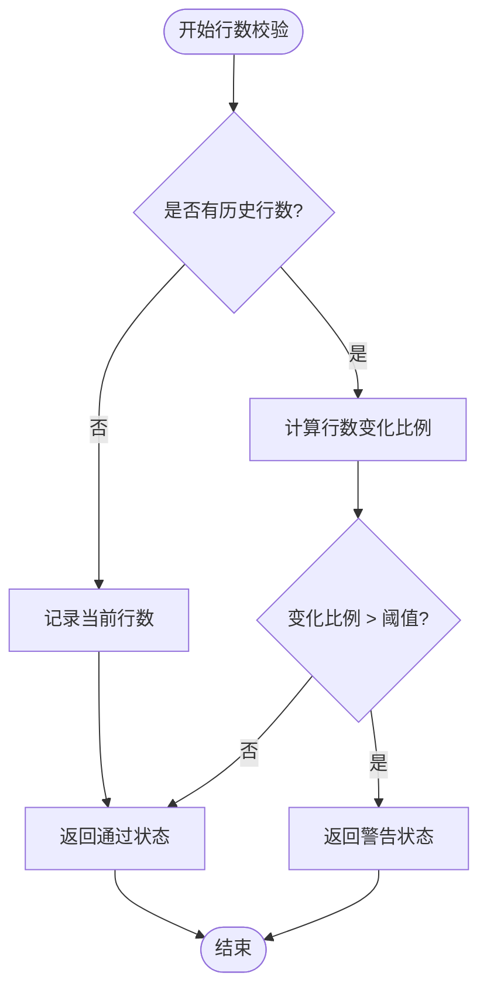
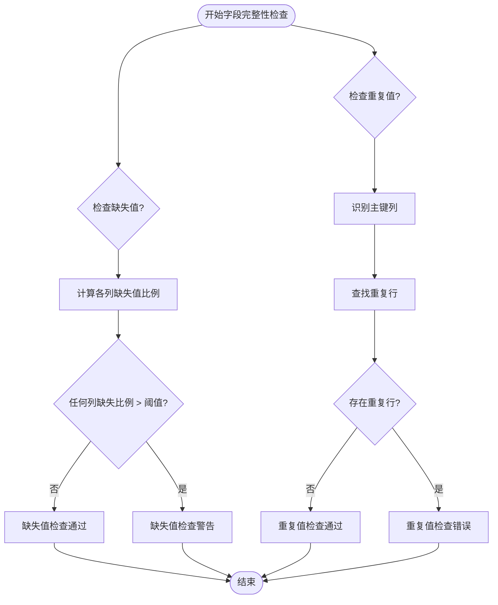
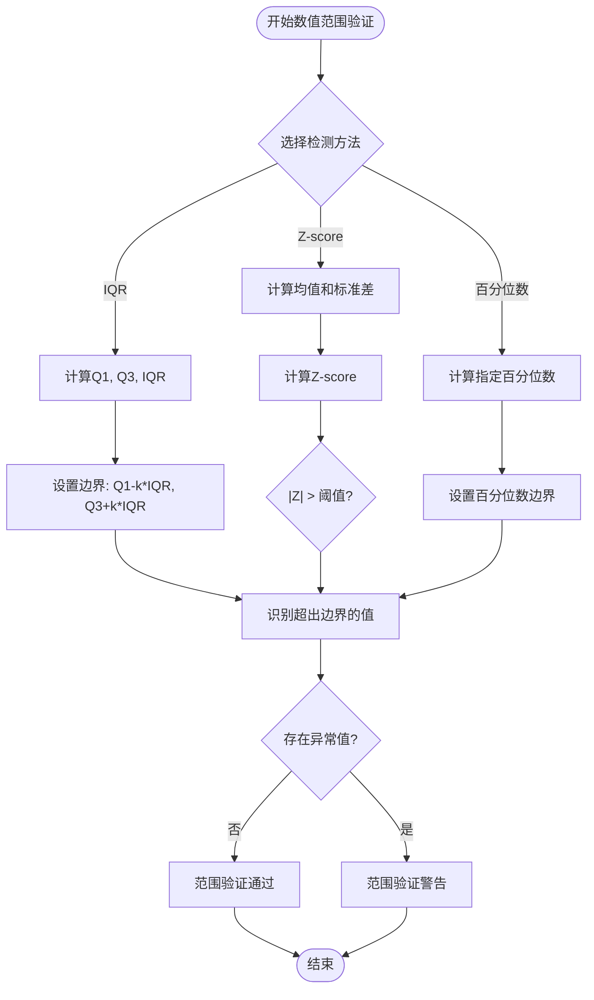
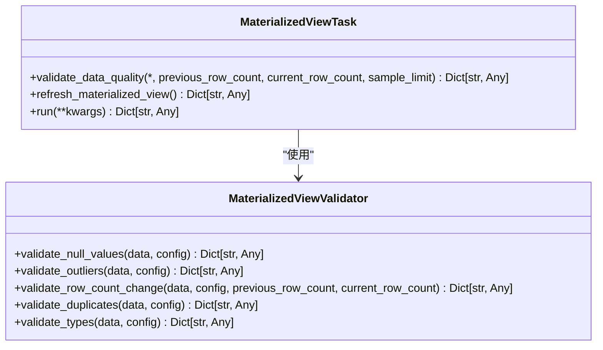
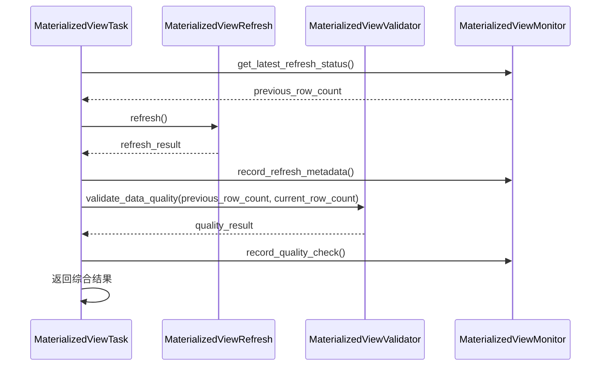
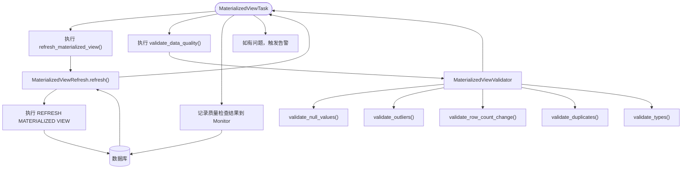
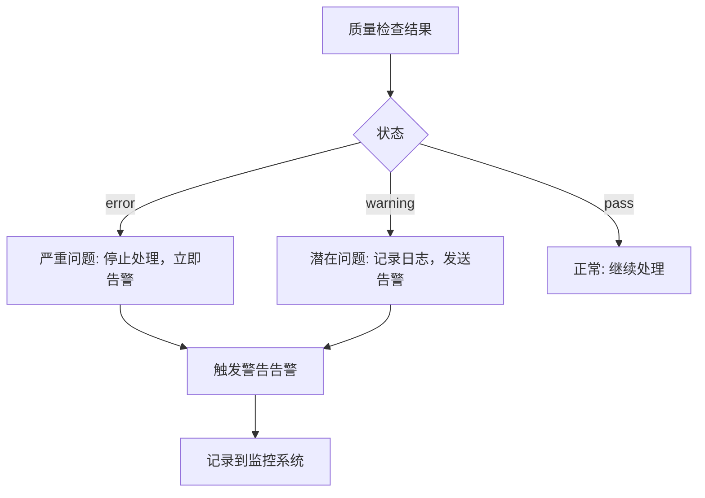

# 数据验证与质量保障

<cite>
**本文档引用的文件**   
- [validator.py](file://alphahome\processors\materialized_views\validator.py)
- [refresh.py](file://alphahome\processors\materialized_views\refresh.py)
- [base_task.py](file://alphahome\processors\materialized_views\base_task.py)
- [test_materialized_view_validator.py](file://alphahome\processors\tests\test_materialized_views\test_materialized_view_validator.py)
- [test_materialized_view_task.py](file://alphahome\processors\tests\test_materialized_views\test_materialized_view_task.py)
</cite>

## 目录
1. [引言](#引言)
2. [数据验证机制](#数据验证机制)
3. [验证器实现逻辑](#验证器实现逻辑)
4. [与刷新模块的协同工作](#与刷新模块的协同工作)
5. [验证失败处理策略](#验证失败处理策略)
6. [对数据管道的影响](#对数据管道的影响)
7. [结论](#结论)

## 引言

本系统通过物化视图（Materialized View）技术实现数据的预计算和缓存，以提高查询性能。为了确保物化视图数据的准确性和一致性，系统实现了全面的数据验证机制。这些验证在物化视图刷新前后自动执行，作为数据质量保障的关键环节。

物化视图数据验证器（MaterializedViewValidator）负责执行多种数据质量检查，包括缺失值检查、异常值检查、行数变化检查、重复值检查和类型检查。这些检查确保了物化视图数据的完整性、一致性和可靠性。验证过程与刷新模块紧密集成，形成了一个完整的数据质量保障闭环。

## 数据验证机制

物化视图数据验证系统实现了多种数据质量检查机制，确保数据的准确性和一致性。这些机制包括行数校验、字段完整性检查和数值范围验证等。

### 行数校验

行数变化检查是数据验证的重要组成部分，用于检测物化视图行数的异常变化。`validate_row_count_change`方法通过比较当前行数与上次刷新的行数，计算变化比例。如果变化比例超过预设阈值（默认0.5），则返回警告状态。

该方法利用实例变量`previous_row_count`来存储上次刷新的行数，实现了跨次刷新的连续性检查。当没有历史行数数据时，方法会记录当前行数并返回通过状态，为后续检查建立基准。

**图示来源**
- [validator.py](file://alphahome\processors\materialized_views\validator.py#L213-L298)

### 字段完整性检查

字段完整性检查包括缺失值检查和重复值检查，确保数据的完整性和唯一性。

缺失值检查（`validate_null_values`）针对指定列计算缺失值比例。如果任何列的缺失值比例超过配置的阈值，检查返回警告状态，并提供详细的列级缺失信息。

重复值检查（`validate_duplicates`）基于指定的主键列检测重复行。如果发现重复行，检查返回错误状态，因为物化视图中不应存在重复数据。该检查对于维护数据的唯一性至关重要。

**图示来源**
- [validator.py](file://alphahome\processors\materialized_views\validator.py#L43-L373)

### 数值范围验证

数值范围验证通过异常值检查实现，使用多种统计方法检测超出正常范围的数值。系统支持三种异常值检测方法：IQR（四分位距）、Z-score和百分位数。

IQR方法计算第一四分位数（Q1）和第三四分位数（Q3），并使用IQR倍数作为阈值确定异常值边界。Z-score方法计算数据点与均值的标准差距离，超过阈值标准差的数据点被视为异常值。百分位数方法使用指定百分位数（如5%和95%）作为边界。

**图示来源**
- [validator.py](file://alphahome\processors\materialized_views\validator.py#L116-L211)

## 验证器实现逻辑

物化视图验证器的实现逻辑围绕`MaterializedViewValidator`类展开，该类提供了多种异步验证方法，可独立或组合使用。

### validate_view 函数实现

虽然代码中没有直接名为`validate_view`的函数，但`validate_data_quality`方法实现了类似功能。该方法在`MaterializedViewTask`基类中定义，协调执行所有配置的数据质量检查。

`validate_data_quality`方法首先从物化视图中获取样本数据（默认限制10,000行），然后根据任务配置的质量检查项依次执行各项检查。检查结果被收集并汇总为整体状态。

**图示来源**
- [base_task.py](file://alphahome\processors\materialized_views\base_task.py#L116-L196)
- [validator.py](file://alphahome\processors\materialized_views\validator.py#L24-L449)

### validate_all_views 函数实现

系统通过`run`方法实现了对所有物化视图的验证。在`MaterializedViewTask`的`run`方法中，验证过程是刷新流程的一部分：

1. 获取上次刷新的行数作为历史基准
2. 执行物化视图刷新
3. 记录刷新元数据
4. 执行数据质量检查，传入当前和之前的行数

这种设计确保了每次刷新后都会自动执行验证，形成了完整的数据质量保障流程。

**图示来源**
- [base_task.py](file://alphahome\processors\materialized_views\base_task.py#L198-L326)

## 与刷新模块的协同工作

数据验证器与刷新模块紧密集成，形成了一个完整的数据更新和质量保障流程。这种协同工作确保了物化视图数据的准确性和一致性。

### 刷新前后的验证流程

验证主要在刷新后执行，但依赖刷新前的状态信息。具体流程如下：

1. **刷新前**：获取上次刷新的行数作为历史基准
2. **执行刷新**：调用`refresh`方法更新物化视图
3. **刷新后**：执行所有配置的数据质量检查

这种设计模式确保了验证能够检测到刷新过程中的数据变化，同时避免了在刷新过程中阻塞其他操作。

### 协同工作流程

物化视图任务、刷新器和验证器之间的协同工作流程如下：

**图示来源**
- [base_task.py](file://alphahome\processors\materialized_views\base_task.py#L198-L326)
- [refresh.py](file://alphahome\processors\materialized_views\refresh.py#L62-L200)
- [validator.py](file://alphahome\processors\materialized_views\validator.py#L24-L449)

## 验证失败处理策略

系统对验证失败采用了分层处理策略，根据问题的严重性采取不同的响应措施。

### 不同检查类型的处理

不同类型的验证检查具有不同的严重性级别：

- **错误级别（Error）**：重复值检查和类型检查返回错误状态，表示严重数据质量问题
- **警告级别（Warning）**：缺失值检查、异常值检查和行数变化检查返回警告状态，表示潜在问题

**图示来源**
- [validator.py](file://alphahome\processors\materialized_views\validator.py#L300-L367)
- [base_task.py](file://alphahome\processors\materialized_views\base_task.py#L304-L324)

### 告警机制

当验证失败时，系统通过`MaterializedViewAlerting`组件触发告警。在`MaterializedViewTask`的`run`方法中，无论刷新成功与否，都会尝试发送相应的告警：

- 刷新失败时，调用`alert_refresh_failed`
- 质量检查发现问题时，调用`alert_data_quality_issue`

这种设计确保了所有数据质量问题都能被及时发现和处理，即使告警发送本身失败，系统也会记录警告日志并继续执行。

## 对整体数据管道的影响

数据验证机制对整体数据管道产生了深远影响，提升了数据质量和系统可靠性。

### 数据质量提升

通过在物化视图刷新后自动执行验证，系统能够及时发现和报告数据质量问题。这包括：

- 检测意外的数据丢失（行数大幅减少）
- 发现异常数据模式（异常值）
- 确保数据完整性（缺失值检查）
- 维护数据一致性（重复值和类型检查）

这些检查共同构成了一个多层次的数据质量防线。

### 系统可靠性增强

验证机制增强了系统的整体可靠性：

1. **早期问题发现**：在数据进入下游系统前发现质量问题
2. **问题可追溯性**：通过记录验证结果，提供了问题排查的依据
3. **自动化监控**：无需人工干预即可持续监控数据质量

### 潜在影响

尽管验证机制带来了诸多好处，但也可能对系统性能产生一定影响：

- **性能开销**：验证过程需要额外的计算资源
- **延迟增加**：验证步骤增加了物化视图刷新的总时间
- **误报可能**：过于严格的阈值可能导致频繁的警告

系统通过限制样本大小（默认10,000行）和异步执行验证来平衡数据质量和性能。

## 结论

物化视图数据验证系统通过行数校验、字段完整性检查和数值范围验证等多种机制，确保了数据的准确性和一致性。验证器在物化视图刷新前后自动执行，与刷新模块紧密协同工作，形成了完整的数据质量保障流程。

`validate_data_quality`方法（相当于`validate_view`）和`run`方法（相当于`validate_all_views`）的实现逻辑清晰，通过异步执行和结果汇总提供了全面的数据质量反馈。当验证失败时，系统采用分层处理策略，根据问题严重性触发相应级别的告警。

这一验证机制显著提升了整体数据管道的数据质量和系统可靠性，为下游应用提供了可信的数据基础。通过合理的配置和监控，可以在保证数据质量的同时，最小化对系统性能的影响。