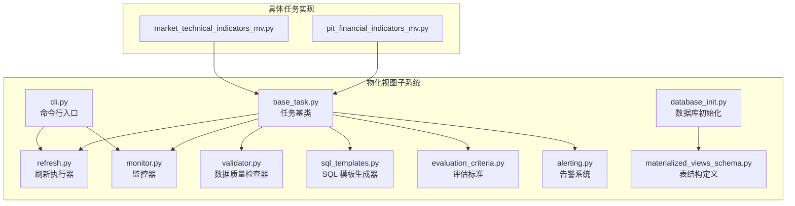
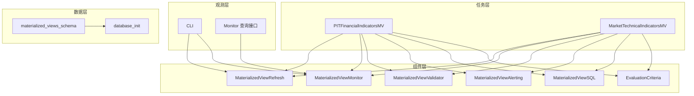
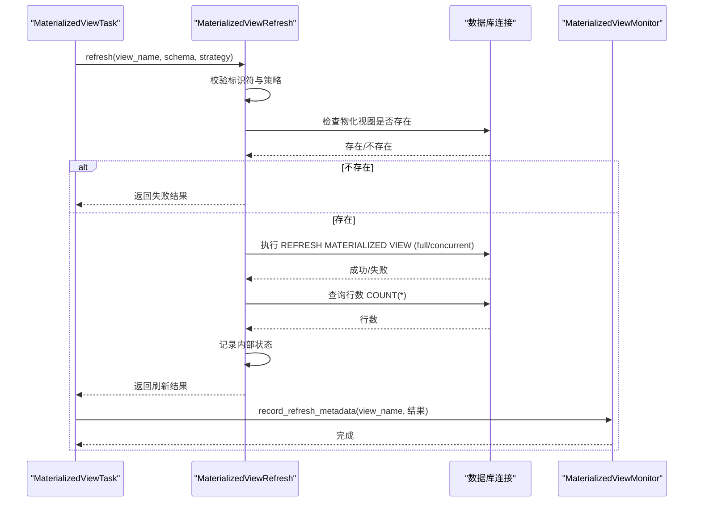
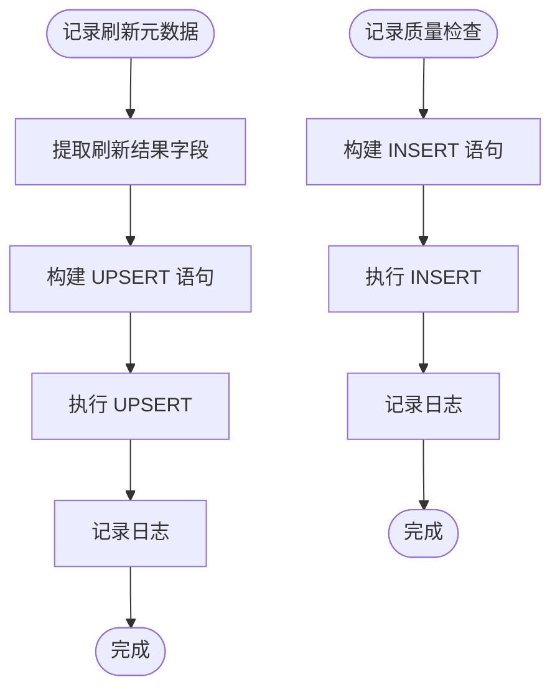
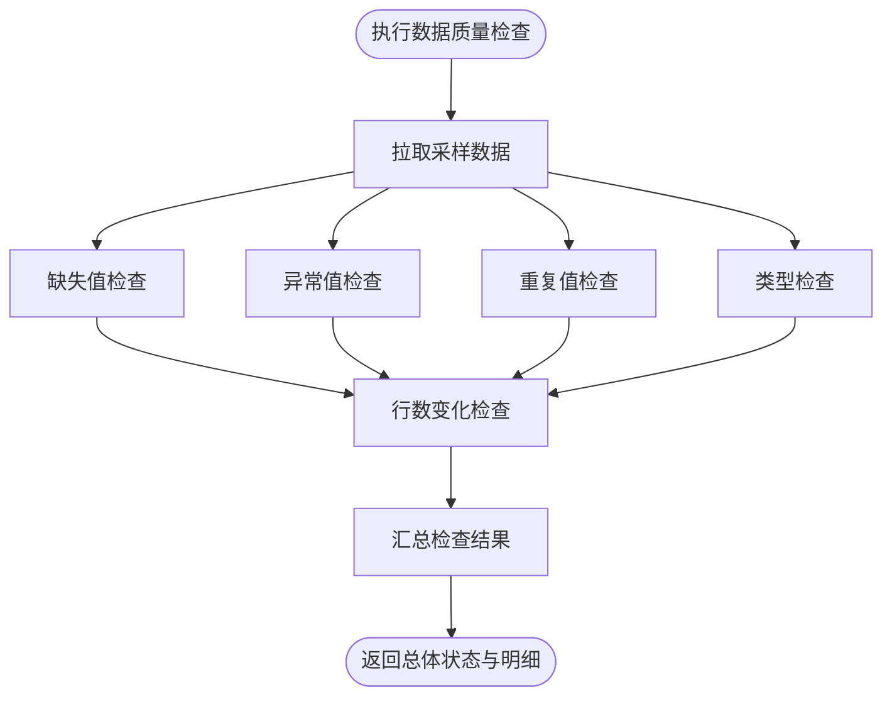
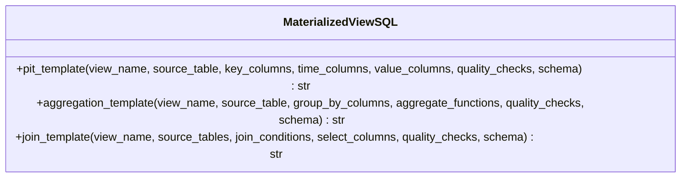
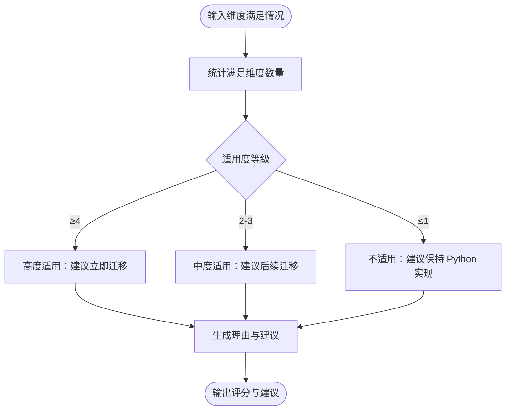
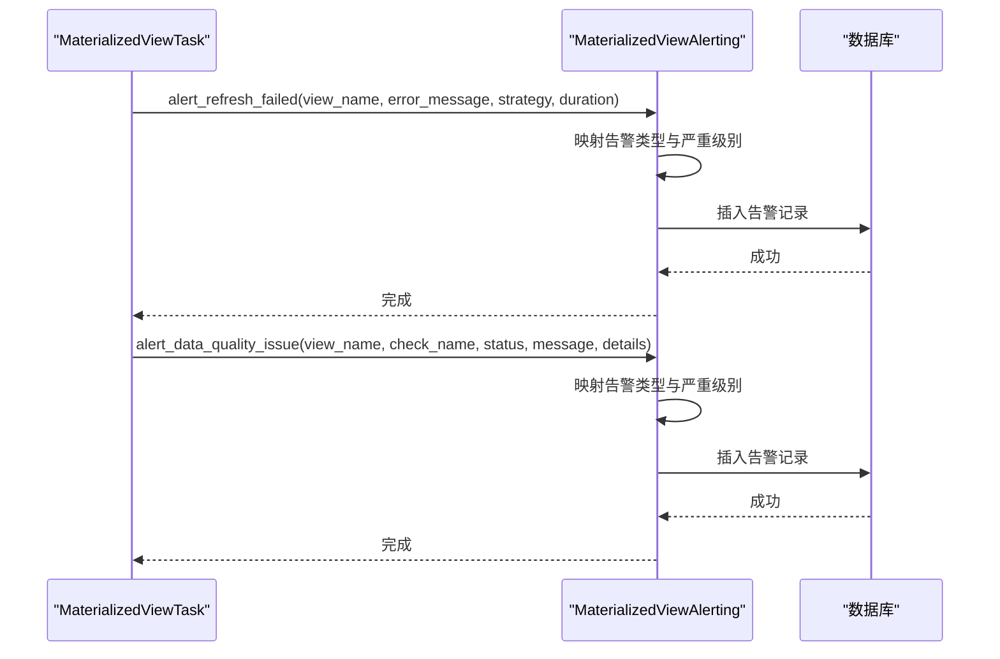
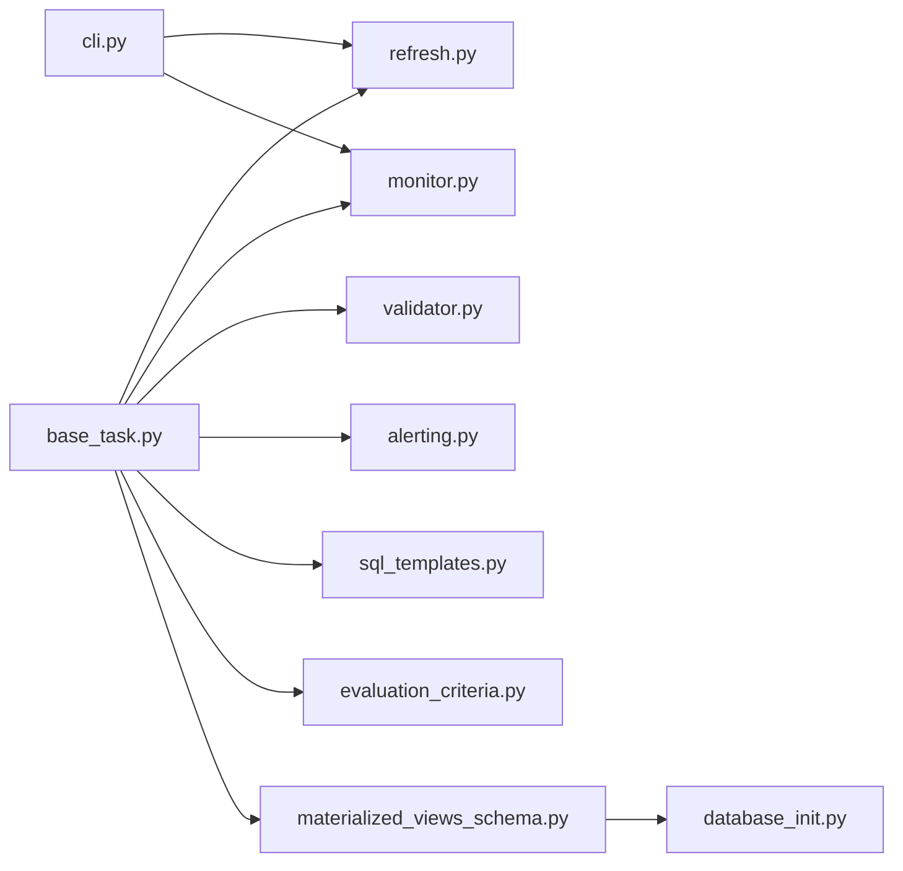

# 物化视图 (Materialized Views)

<cite>
**本文引用的文件**
- [__init__.py](file://alphahome/processors/materialized_views/__init__.py)
- [base_task.py](file://alphahome/processors/materialized_views/base_task.py)
- [refresh.py](file://alphahome/processors/materialized_views/refresh.py)
- [monitor.py](file://alphahome/processors/materialized_views/monitor.py)
- [validator.py](file://alphahome/processors/materialized_views/validator.py)
- [sql_templates.py](file://alphahome/processors/materialized_views/sql_templates.py)
- [evaluation_criteria.py](file://alphahome/processors/materialized_views/evaluation_criteria.py)
- [alerting.py](file://alphahome/processors/materialized_views/alerting.py)
- [cli.py](file://alphahome/processors/materialized_views/cli.py)
- [database_init.py](file://alphahome/processors/materialized_views/database_init.py)
- [materialized_views_schema.py](file://alphahome/common/db_components/materialized_views_schema.py)
- [pit_financial_indicators_mv.py](file://alphahome/processors/tasks/pit/pit_financial_indicators_mv.py)
- [market_technical_indicators_mv.py](file://alphahome/processors/tasks/market/market_technical_indicators_mv.py)
</cite>

## 目录
1. [简介](#简介)
2. [项目结构](#项目结构)
3. [核心组件](#核心组件)
4. [架构总览](#架构总览)
5. [详细组件分析](#详细组件分析)
6. [依赖关系分析](#依赖关系分析)
7. [性能考量](#性能考量)
8. [故障排查指南](#故障排查指南)
9. [结论](#结论)
10. [附录](#附录)

## 简介
本文件面向“物化视图子系统”的架构文档，目标是帮助读者理解该子系统如何以高性能特征服务层的形式，管理预计算的复杂查询视图。系统围绕三大能力展开：
- 刷新能力：通过 refresh 模块实现视图的全量与并发增量刷新策略，并记录刷新元数据。
- 监控能力：通过 monitor 模块记录刷新历史与数据质量检查结果，支撑健康状态与延迟追踪。
- 质量保障：通过 validator 模块进行缺失值、异常值、行数变化、重复值、类型等基础质量检查。
- 动态 SQL：通过 sql_templates.py 提供 PIT、聚合、JOIN 三类模板，统一“数据对齐—标准化—业务逻辑—血缘—校验”的生成流程。
- 评估与触发：通过 evaluation_criteria.py 定义适用性评估维度，指导何时将任务迁移为物化视图；结合 Processor Engine 的任务调度与 CLI 工具，形成端到端的刷新与观测闭环。

## 项目结构
物化视图子系统位于 processors/materialized_views 目录，采用“任务基类 + 组件模块 + 任务实现 + CLI + 数据库初始化”的分层组织方式。典型目录与职责如下：
- 基础设施与导出：__init__.py 汇总导出核心类与枚举，便于上层统一引用。
- 任务基类：base_task.py 定义 MaterializedViewTask 抽象与完整执行流（创建/刷新/记录/检查/告警）。
- 刷新模块：refresh.py 实现全量与并发刷新、状态记录与错误回退。
- 监控模块：monitor.py 记录刷新元数据、质量检查历史与查询历史。
- 质量检查：validator.py 提供缺失值、异常值、行数变化、重复值、类型等检查。
- SQL 模板：sql_templates.py 提供 PIT、聚合、JOIN 三类模板，统一生成物化视图 SQL。
- 评估标准：evaluation_criteria.py 定义七维评估标准，辅助决策是否迁移为物化视图。
- 告警系统：alerting.py 记录刷新失败与数据质量告警，支持查询与确认。
- CLI：cli.py 提供命令行入口，支持单视图/批量刷新、状态查询、历史查询。
- 数据库初始化：database_init.py 与 materialized_views_schema.py 提供表结构定义与初始化脚本。

图表来源
- [base_task.py](file://alphahome/processors/materialized_views/base_task.py#L1-L377)
- [refresh.py](file://alphahome/processors/materialized_views/refresh.py#L1-L364)
- [monitor.py](file://alphahome/processors/materialized_views/monitor.py#L1-L407)
- [validator.py](file://alphahome/processors/materialized_views/validator.py#L1-L513)
- [sql_templates.py](file://alphahome/processors/materialized_views/sql_templates.py#L1-L344)
- [evaluation_criteria.py](file://alphahome/processors/materialized_views/evaluation_criteria.py#L1-L186)
- [alerting.py](file://alphahome/processors/materialized_views/alerting.py#L1-L380)
- [cli.py](file://alphahome/processors/materialized_views/cli.py#L1-L654)
- [database_init.py](file://alphahome/processors/materialized_views/database_init.py#L1-L556)
- [materialized_views_schema.py](file://alphahome/common/db_components/materialized_views_schema.py#L1-L203)
- [pit_financial_indicators_mv.py](file://alphahome/processors/tasks/pit/pit_financial_indicators_mv.py#L1-L140)
- [market_technical_indicators_mv.py](file://alphahome/processors/tasks/market/market_technical_indicators_mv.py#L1-L210)

章节来源
- [__init__.py](file://alphahome/processors/materialized_views/__init__.py#L1-L43)
- [base_task.py](file://alphahome/processors/materialized_views/base_task.py#L1-L377)
- [cli.py](file://alphahome/processors/materialized_views/cli.py#L1-L654)

## 核心组件
- MaterializedViewTask：物化视图任务基类，封装“创建物化视图 → 刷新 → 记录元数据 → 质量检查 → 告警”的完整流程。
- MaterializedViewRefresh：刷新执行器，支持 full 与 concurrent 刷新策略，自动回退与状态记录。
- MaterializedViewMonitor：监控器，记录刷新元数据与质量检查历史，提供查询接口。
- MaterializedViewValidator：数据质量检查器，提供缺失值、异常值、行数变化、重复值、类型检查。
- MaterializedViewSQL：SQL 模板生成器，提供 PIT、聚合、JOIN 三类模板，统一生成物化视图 SQL。
- EvaluationCriteria：评估标准，定义七维评估维度，辅助判断任务是否适合迁移到物化视图。
- MaterializedViewAlerting：告警系统，记录刷新失败与数据质量告警，支持查询与确认。
- CLI：命令行工具，支持单视图/批量刷新、状态查询、历史查询。
- 数据库初始化：提供表结构定义与初始化脚本，确保 schema 与元数据表存在。

章节来源
- [base_task.py](file://alphahome/processors/materialized_views/base_task.py#L1-L377)
- [refresh.py](file://alphahome/processors/materialized_views/refresh.py#L1-L364)
- [monitor.py](file://alphahome/processors/materialized_views/monitor.py#L1-L407)
- [validator.py](file://alphahome/processors/materialized_views/validator.py#L1-L513)
- [sql_templates.py](file://alphahome/processors/materialized_views/sql_templates.py#L1-L344)
- [evaluation_criteria.py](file://alphahome/processors/materialized_views/evaluation_criteria.py#L1-L186)
- [alerting.py](file://alphahome/processors/materialized_views/alerting.py#L1-L380)
- [cli.py](file://alphahome/processors/materialized_views/cli.py#L1-L654)
- [database_init.py](file://alphahome/processors/materialized_views/database_init.py#L1-L556)
- [materialized_views_schema.py](file://alphahome/common/db_components/materialized_views_schema.py#L1-L203)

## 架构总览
物化视图子系统以“任务驱动 + 组件协作”的方式工作：
- 任务层：具体任务（如 PIT 财务指标、市场技术指标）继承自 MaterializedViewTask，定义 SQL 与质量检查配置。
- 组件层：refresh、monitor、validator、alerting、sql_templates、evaluation_criteria 协同工作。
- 观测层：CLI 与监控器共同提供状态与历史查询能力。
- 数据层：materialized_views_schema 与 database_init 负责 schema 与元数据表的创建与维护。

图表来源
- [base_task.py](file://alphahome/processors/materialized_views/base_task.py#L1-L377)
- [refresh.py](file://alphahome/processors/materialized_views/refresh.py#L1-L364)
- [monitor.py](file://alphahome/processors/materialized_views/monitor.py#L1-L407)
- [validator.py](file://alphahome/processors/materialized_views/validator.py#L1-L513)
- [sql_templates.py](file://alphahome/processors/materialized_views/sql_templates.py#L1-L344)
- [evaluation_criteria.py](file://alphahome/processors/materialized_views/evaluation_criteria.py#L1-L186)
- [alerting.py](file://alphahome/processors/materialized_views/alerting.py#L1-L380)
- [cli.py](file://alphahome/processors/materialized_views/cli.py#L1-L654)
- [materialized_views_schema.py](file://alphahome/common/db_components/materialized_views_schema.py#L1-L203)
- [database_init.py](file://alphahome/processors/materialized_views/database_init.py#L1-L556)
- [pit_financial_indicators_mv.py](file://alphahome/processors/tasks/pit/pit_financial_indicators_mv.py#L1-L140)
- [market_technical_indicators_mv.py](file://alphahome/processors/tasks/market/market_technical_indicators_mv.py#L1-L210)

## 详细组件分析

### 刷新模块（MaterializedViewRefresh）
- 职责
  - 执行 REFRESH MATERIALIZED VIEW 命令，支持 full 与 concurrent 两种策略。
  - 自动回退：当 concurrent 刷新失败（如缺少唯一索引）时回退到 full 刷新。
  - 记录刷新元数据：包括视图名称、刷新时间、耗时、行数、错误信息等。
  - 提供刷新状态查询接口。
- 关键点
  - 输入校验：对 schema 与视图名进行标识符安全校验，防止注入。
  - 异步数据库访问：通过 db_connection 的异步接口执行 SQL。
  - 内部状态缓存：维护最近一次刷新结果，便于快速查询。

图表来源
- [refresh.py](file://alphahome/processors/materialized_views/refresh.py#L1-L364)
- [base_task.py](file://alphahome/processors/materialized_views/base_task.py#L1-L377)
- [monitor.py](file://alphahome/processors/materialized_views/monitor.py#L1-L407)

章节来源
- [refresh.py](file://alphahome/processors/materialized_views/refresh.py#L1-L364)
- [base_task.py](file://alphahome/processors/materialized_views/base_task.py#L1-L377)

### 监控模块（MaterializedViewMonitor）
- 职责
  - 记录刷新元数据：UPSERT 到 materialized_views_metadata 表，包含视图名、schema、数据源、刷新策略、最后刷新时间、状态、行数、耗时、错误信息等。
  - 查询刷新历史与最新状态：支持按视图名查询历史记录与最新记录。
  - 记录数据质量检查结果：将检查名称、状态、消息、详情写入 materialized_views_quality_checks 表。
  - 查询质量检查历史：支持按视图名查询历史记录。
- 关键点
  - JSON 字段：source_tables 与 check_details 以 JSON 存储，便于灵活扩展。
  - 异常处理：捕获并记录异常，保证监控流程的健壮性。

图表来源
- [monitor.py](file://alphahome/processors/materialized_views/monitor.py#L1-L407)

章节来源
- [monitor.py](file://alphahome/processors/materialized_views/monitor.py#L1-L407)

### 质量检查模块（MaterializedViewValidator）
- 职责
  - 缺失值检查：对指定列进行缺失比例检查，支持阈值控制。
  - 异常值检查：支持 IQR、Z-score、百分位三种方法，针对数值列进行检测。
  - 行数变化检查：比较当前与上次刷新的行数变化比例，支持阈值控制。
  - 重复值检查：基于主键列组合检测重复行。
  - 类型检查：检查列的实际类型与期望类型是否一致。
- 关键点
  - 非破坏性：只记录问题，不修改或掩盖数据。
  - 样本驱动：对列级检查（缺失、异常、重复、类型）使用采样数据，避免全量扫描。

图表来源
- [validator.py](file://alphahome/processors/materialized_views/validator.py#L1-L513)
- [base_task.py](file://alphahome/processors/materialized_views/base_task.py#L1-L377)

章节来源
- [validator.py](file://alphahome/processors/materialized_views/validator.py#L1-L513)
- [base_task.py](file://alphahome/processors/materialized_views/base_task.py#L1-L377)

### SQL 模板模块（MaterializedViewSQL）
- 职责
  - 提供三类模板：PIT（时间序列展开）、聚合（横截面统计）、JOIN（多表关联）。
  - 统一生成物化视图 SQL，包含数据对齐、标准化、业务逻辑、血缘元数据与基础校验。
- 关键点
  - PIT 模板：将公告日期与数据日期展开为查询起止日期，支持数值列标准化与范围过滤。
  - 聚合模板：支持 sum、avg、count、min、max、stddev 等聚合函数，自动去重计数。
  - JOIN 模板：支持多表关联，生成 SELECT 列与 WHERE 非空校验。

图表来源
- [sql_templates.py](file://alphahome/processors/materialized_views/sql_templates.py#L1-L344)

章节来源
- [sql_templates.py](file://alphahome/processors/materialized_views/sql_templates.py#L1-L344)

### 评估标准（EvaluationCriteria）
- 职责
  - 定义七维评估维度：数据源简洁性、转换逻辑复杂度、计算复杂度、输出数据量、更新频率、查询复杂度、复用度。
  - 提供评分与建议：根据维度满足情况给出高度适用、中度适用、不适用的建议。
- 关键点
  - 评分规则：维度满足数量决定适用度等级与迁移建议。
  - 可扩展性：维度列表与权重可按需调整。

图表来源
- [evaluation_criteria.py](file://alphahome/processors/materialized_views/evaluation_criteria.py#L1-L186)

章节来源
- [evaluation_criteria.py](file://alphahome/processors/materialized_views/evaluation_criteria.py#L1-L186)

### 告警系统（MaterializedViewAlerting）
- 职责
  - 刷新失败告警：区分超时与一般失败，记录严重级别与详情。
  - 数据质量告警：将检查结果映射为告警类型与严重级别，记录消息与详情。
  - 历史查询与统计：支持按视图、类型、严重级别查询，支持未确认告警查询与确认。
- 关键点
  - JSON 详情：details 字段存储结构化信息，便于后续分析。
  - 确认机制：支持确认、备注与确认人信息。

图表来源
- [alerting.py](file://alphahome/processors/materialized_views/alerting.py#L1-L380)
- [base_task.py](file://alphahome/processors/materialized_views/base_task.py#L1-L377)

章节来源
- [alerting.py](file://alphahome/processors/materialized_views/alerting.py#L1-L380)
- [base_task.py](file://alphahome/processors/materialized_views/base_task.py#L1-L377)

### CLI 工具
- 能力
  - 单视图刷新：支持指定策略（full/concurrent）。
  - 批量刷新：遍历注册的视图集合执行刷新。
  - 状态查询：获取单视图或全部视图的最新刷新状态。
  - 历史查询：按视图名查询刷新历史。
- 关键点
  - 连接管理：从环境变量、配置文件或显式参数获取数据库连接字符串。
  - 输出格式：支持文本与 JSON 两种输出格式。

章节来源
- [cli.py](file://alphahome/processors/materialized_views/cli.py#L1-L654)

### 数据库初始化与表结构
- 能力
  - 初始化：确保 schema 存在，并创建元数据表、质量检查表、告警表及其索引。
  - 表结构：定义 materialized_views_metadata、materialized_views_quality_checks、materialized_views_alerts 的字段与约束。
  - 任务内初始化：在任务运行前调用初始化函数，保证表存在。
- 关键点
  - 级联删除：质量检查表外键指向元数据表，删除元数据时级联删除检查记录。
  - 索引优化：为常用查询字段建立索引，提升查询效率。

章节来源
- [materialized_views_schema.py](file://alphahome/common/db_components/materialized_views_schema.py#L1-L203)
- [database_init.py](file://alphahome/processors/materialized_views/database_init.py#L1-L556)
- [base_task.py](file://alphahome/processors/materialized_views/base_task.py#L1-L377)

## 依赖关系分析
- 组件耦合
  - MaterializedViewTask 依赖 refresh、monitor、validator、alerting、sql_templates、evaluation_criteria。
  - CLI 依赖 refresh、monitor 与具体任务类。
  - 数据库层由 materialized_views_schema 与 database_init 提供统一初始化。
- 外部依赖
  - 异步数据库连接：通过 db_connection 的异步接口执行 SQL。
  - JSON 存储：source_tables、check_details、details 以 JSON 字段存储。
- 循环依赖
  - 未发现循环依赖；各模块职责清晰，通过接口与方法调用交互。

图表来源
- [base_task.py](file://alphahome/processors/materialized_views/base_task.py#L1-L377)
- [refresh.py](file://alphahome/processors/materialized_views/refresh.py#L1-L364)
- [monitor.py](file://alphahome/processors/materialized_views/monitor.py#L1-L407)
- [validator.py](file://alphahome/processors/materialized_views/validator.py#L1-L513)
- [alerting.py](file://alphahome/processors/materialized_views/alerting.py#L1-L380)
- [sql_templates.py](file://alphahome/processors/materialized_views/sql_templates.py#L1-L344)
- [evaluation_criteria.py](file://alphahome/processors/materialized_views/evaluation_criteria.py#L1-L186)
- [cli.py](file://alphahome/processors/materialized_views/cli.py#L1-L654)
- [materialized_views_schema.py](file://alphahome/common/db_components/materialized_views_schema.py#L1-L203)
- [database_init.py](file://alphahome/processors/materialized_views/database_init.py#L1-L556)

章节来源
- [base_task.py](file://alphahome/processors/materialized_views/base_task.py#L1-L377)
- [cli.py](file://alphahome/processors/materialized_views/cli.py#L1-L654)
- [materialized_views_schema.py](file://alphahome/common/db_components/materialized_views_schema.py#L1-L203)

## 性能考量
- 刷新策略选择
  - concurrent 刷新在不阻塞查询的前提下进行，适合对在线查询影响敏感的场景；若失败则回退至 full 刷新。
  - full 刷新会阻塞查询，但稳定性更高，适合数据量较大或并发刷新失败的场景。
- 行数与索引
  - 在物化视图上建立合适的索引（如时间范围、主键组合）可显著提升查询性能。
  - database_init 与 materialized_views_schema 提供常见索引建议，可在任务实现中复用。
- 数据质量检查
  - 列级检查使用采样数据，避免全量扫描；行数变化检查使用明确的当前/上次行数，减少不必要的全表扫描。
- 监控与告警
  - 元数据表与告警表建立索引，有助于历史查询与统计分析。
- 评估标准
  - 通过评估维度筛选适合物化视图的任务，避免将不适合的任务迁移到物化视图，从而降低维护成本与风险。

[本节为通用性能建议，无需特定文件引用]

## 故障排查指南
- 刷新失败
  - 检查数据库连接是否可用，确认视图是否存在。
  - 查看刷新历史与错误信息，定位失败原因（如权限、语法、数据异常）。
  - 若为 concurrent 刷新失败，查看是否缺少唯一索引；必要时改为 full 刷新。
- 数据质量告警
  - 根据告警类型与严重级别，检查缺失值、异常值、重复值、类型不一致等问题。
  - 使用 monitor 的质量检查历史接口核对问题发生时间与范围。
- CLI 使用
  - 确认 DATABASE_URL 或配置文件设置正确；使用 status/status-all/history 命令核对状态。
  - 使用 --format=json 获取结构化输出，便于自动化处理。
- 数据库初始化
  - 确认 schema 与表已创建；若缺失，调用初始化函数或执行 database_init 脚本。

章节来源
- [refresh.py](file://alphahome/processors/materialized_views/refresh.py#L1-L364)
- [monitor.py](file://alphahome/processors/materialized_views/monitor.py#L1-L407)
- [alerting.py](file://alphahome/processors/materialized_views/alerting.py#L1-L380)
- [cli.py](file://alphahome/processors/materialized_views/cli.py#L1-L654)
- [materialized_views_schema.py](file://alphahome/common/db_components/materialized_views_schema.py#L1-L203)
- [database_init.py](file://alphahome/processors/materialized_views/database_init.py#L1-L556)

## 结论
物化视图子系统通过“任务基类 + 组件模块 + CLI + 数据库初始化”的架构设计，实现了高性能特征服务层的关键能力：
- 刷新：支持 full 与 concurrent 策略，具备自动回退与状态记录。
- 监控：统一记录刷新元数据与质量检查历史，支撑健康状态与延迟追踪。
- 质量：提供基础数据质量检查，非破坏性地暴露问题。
- SQL：提供三类模板，统一生成物化视图 SQL，确保一致性与可维护性。
- 评估：通过七维评估标准，指导任务迁移决策，平衡数据时效性与系统性能。

该体系既满足日常运维需求，也为未来扩展（如更多评估维度、更丰富的 SQL 模板、更细粒度的告警与可视化）提供了良好基础。

[本节为总结性内容，无需特定文件引用]

## 附录
- 典型使用流程
  - 任务实现：继承 MaterializedViewTask，定义 define_materialized_view_sql 与 quality_checks。
  - 初始化：调用 initialize_materialized_views_schema 或执行 database_init。
  - 刷新：通过 CLI 或直接调用 refresh 接口执行刷新。
  - 观测：使用 CLI status/history 或 monitor 查询接口获取状态与历史。
  - 告警：根据 alerting 的历史与统计接口进行问题定位与处理。

章节来源
- [base_task.py](file://alphahome/processors/materialized_views/base_task.py#L1-L377)
- [cli.py](file://alphahome/processors/materialized_views/cli.py#L1-L654)
- [materialized_views_schema.py](file://alphahome/common/db_components/materialized_views_schema.py#L1-L203)
- [database_init.py](file://alphahome/processors/materialized_views/database_init.py#L1-L556)