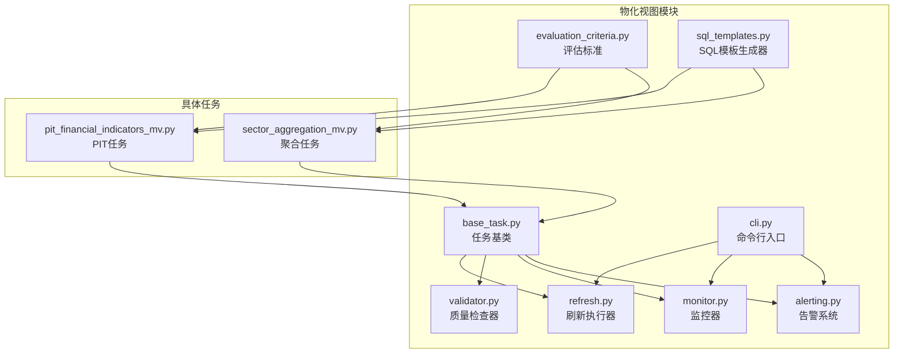
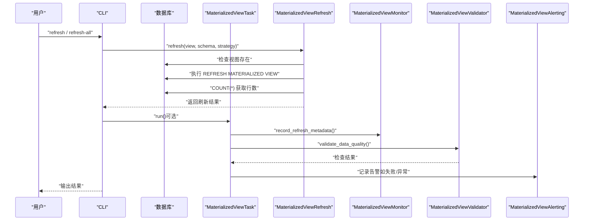
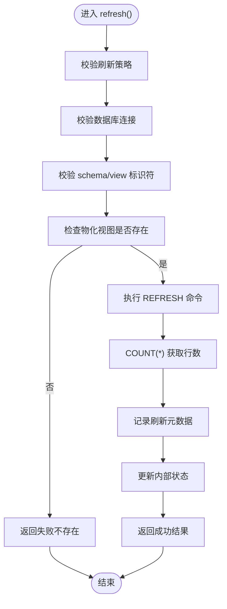
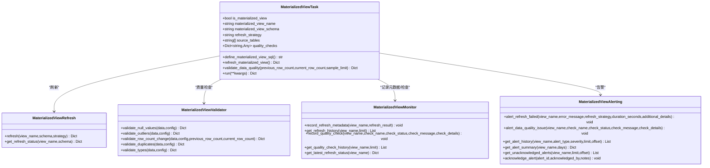
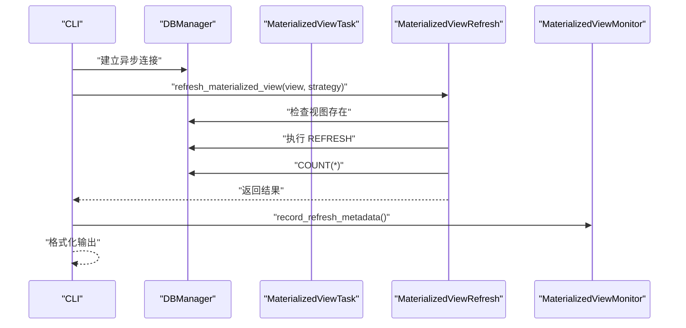
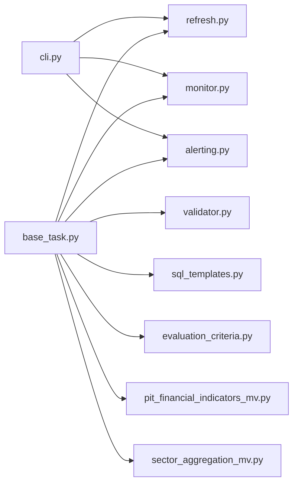

# 物化视图刷新机制

<cite>
**本文引用的文件**
- [refresh.py](file://alphahome/processors/materialized_views/refresh.py)
- [evaluation_criteria.py](file://alphahome/processors/materialized_views/evaluation_criteria.py)
- [sql_templates.py](file://alphahome/processors/materialized_views/sql_templates.py)
- [base_task.py](file://alphahome/processors/materialized_views/base_task.py)
- [validator.py](file://alphahome/processors/materialized_views/validator.py)
- [monitor.py](file://alphahome/processors/materialized_views/monitor.py)
- [alerting.py](file://alphahome/processors/materialized_views/alerting.py)
- [cli.py](file://alphahome/processors/materialized_views/cli.py)
- [pit_financial_indicators_mv.py](file://alphahome/processors/tasks/pit/pit_financial_indicators_mv.py)
- [sector_aggregation_mv.py](file://alphahome/processors/tasks/market/sector_aggregation_mv.py)
- [test_materialized_view_refresh.py](file://alphahome/processors/tests/test_materialized_views/test_materialized_view_refresh.py)
- [test_cli.py](file://alphahome/processors/tests/test_materialized_views/test_cli.py)
</cite>

## 目录
1. [简介](#简介)
2. [项目结构](#项目结构)
3. [核心组件](#核心组件)
4. [架构总览](#架构总览)
5. [详细组件分析](#详细组件分析)
6. [依赖关系分析](#依赖关系分析)
7. [性能考虑](#性能考虑)
8. [故障排查指南](#故障排查指南)
9. [结论](#结论)
10. [附录](#附录)

## 简介
本文件系统性阐述物化视图刷新机制，覆盖全量刷新与并发刷新的实现逻辑；解释 refresh.py 如何依据 evaluation_criteria.py 的评估维度判断是否适合物化视图；说明 refresh 模块如何调度异步任务执行 SQL 刷新操作；并总结 refresh 模块在依赖关系、事务控制与错误回滚方面如何保障数据一致性。同时结合测试用例与任务实现，分析 refresh_view 与 refresh_all_views 等核心函数的调用流程，并讨论批量处理与性能优化的设计考量。

## 项目结构
物化视图刷新相关代码集中在 processors/materialized_views 目录，围绕“定义 SQL → 刷新执行 → 质量检查 → 监控与告警”的闭环展开，并通过 CLI 提供统一入口。

图表来源
- [refresh.py](file://alphahome/processors/materialized_views/refresh.py#L1-L364)
- [evaluation_criteria.py](file://alphahome/processors/materialized_views/evaluation_criteria.py#L1-L186)
- [sql_templates.py](file://alphahome/processors/materialized_views/sql_templates.py#L1-L344)
- [base_task.py](file://alphahome/processors/materialized_views/base_task.py#L1-L377)
- [validator.py](file://alphahome/processors/materialized_views/validator.py#L1-L513)
- [monitor.py](file://alphahome/processors/materialized_views/monitor.py#L1-L407)
- [alerting.py](file://alphahome/processors/materialized_views/alerting.py#L1-L380)
- [cli.py](file://alphahome/processors/materialized_views/cli.py#L1-L654)
- [pit_financial_indicators_mv.py](file://alphahome/processors/tasks/pit/pit_financial_indicators_mv.py#L1-L140)
- [sector_aggregation_mv.py](file://alphahome/processors/tasks/market/sector_aggregation_mv.py#L1-L255)

章节来源
- [refresh.py](file://alphahome/processors/materialized_views/refresh.py#L1-L364)
- [cli.py](file://alphahome/processors/materialized_views/cli.py#L1-L654)

## 核心组件
- 刷新执行器：MaterializedViewRefresh，负责执行 REFRESH MATERIALIZED VIEW 命令、记录元数据、获取行数、返回结果。
- 任务基类：MaterializedViewTask，封装 SQL 定义、刷新、质量检查、元数据记录与告警。
- 质量检查器：MaterializedViewValidator，提供缺失值、异常值、行数变化、重复值、类型检查。
- 监控器：MaterializedViewMonitor，记录刷新元数据、质量检查结果，查询历史与最新状态。
- 告警系统：MaterializedViewAlerting，记录刷新失败与数据质量告警，支持查询与确认。
- SQL 模板生成器：MaterializedViewSQL，提供 PIT、聚合、JOIN 三类模板，保证数据对齐、标准化、血缘元数据与质量检查。
- 评估标准：EvaluationCriteria，定义七维评估维度，用于判断任务是否适合迁移到物化视图。

章节来源
- [refresh.py](file://alphahome/processors/materialized_views/refresh.py#L22-L364)
- [base_task.py](file://alphahome/processors/materialized_views/base_task.py#L17-L377)
- [validator.py](file://alphahome/processors/materialized_views/validator.py#L24-L513)
- [monitor.py](file://alphahome/processors/materialized_views/monitor.py#L14-L407)
- [alerting.py](file://alphahome/processors/materialized_views/alerting.py#L1-L380)
- [sql_templates.py](file://alphahome/processors/materialized_views/sql_templates.py#L18-L344)
- [evaluation_criteria.py](file://alphahome/processors/materialized_views/evaluation_criteria.py#L62-L186)

## 架构总览
物化视图刷新的整体流程如下：
- CLI 接收用户请求，解析策略（full/concurrent），调用 refresh_materialized_view 或 refresh_all_materialized_views。
- 对于单个视图，CLI 创建 MaterializedViewRefresh 并执行刷新；对于全部视图，CLI 遍历注册的任务集合，逐个刷新并汇总结果。
- 刷新成功后，MaterializedViewTask 调用 Monitor 记录元数据；随后执行 Validator 进行质量检查；若失败则通过 Alerting 记录告警。
- 评估标准 EvaluationCriteria 用于指导何时将任务迁移到物化视图，SQL 模板生成器保证 SQL 结构一致且包含质量检查与血缘元数据。

图表来源
- [cli.py](file://alphahome/processors/materialized_views/cli.py#L74-L211)
- [refresh.py](file://alphahome/processors/materialized_views/refresh.py#L62-L200)
- [base_task.py](file://alphahome/processors/materialized_views/base_task.py#L198-L327)
- [monitor.py](file://alphahome/processors/materialized_views/monitor.py#L39-L121)
- [validator.py](file://alphahome/processors/materialized_views/validator.py#L24-L115)
- [alerting.py](file://alphahome/processors/materialized_views/alerting.py#L50-L139)

## 详细组件分析

### 刷新执行器：MaterializedViewRefresh
- 功能要点
  - 支持 full 与 concurrent 两种刷新策略；concurrent 刷新失败时自动回退到 full。
  - 执行前校验视图存在性；执行后统计行数并记录刷新元数据。
  - 内部维护最近一次刷新状态，便于查询。
  - 对数据库连接进行抽象，支持 execute/fetch_val/fetch_one 等异步接口。
- 关键流程
  - refresh(view_name, schema, strategy)：参数校验、标识符安全校验、检查视图存在、执行 REFRESH、计数、记录状态并返回结果。
  - _execute_refresh(strategy)：根据策略拼接 SQL，先尝试 CONCURRENTLY，失败则回退 FULL。
  - _execute/_fetch_val：封装数据库访问，统一错误日志。
- 错误处理
  - 视图不存在：返回失败状态并记录错误信息。
  - SQL 执行异常：捕获并记录，返回失败状态。
  - 连接不可用：抛出运行时错误，由上层处理。

图表来源
- [refresh.py](file://alphahome/processors/materialized_views/refresh.py#L62-L200)
- [refresh.py](file://alphahome/processors/materialized_views/refresh.py#L234-L364)

章节来源
- [refresh.py](file://alphahome/processors/materialized_views/refresh.py#L22-L364)
- [test_materialized_view_refresh.py](file://alphahome/processors/tests/test_materialized_views/test_materialized_view_refresh.py#L75-L592)

### 任务基类：MaterializedViewTask
- 功能要点
  - define_materialized_view_sql：子类实现 SQL 定义，遵循“数据对齐→标准化→业务逻辑→血缘元数据→质量检查”五步。
  - refresh_materialized_view：委托 MaterializedViewRefresh 执行刷新，规范化返回字段。
  - validate_data_quality：按配置执行多项检查，记录检查结果并触发告警。
  - run：完整生命周期入口，包含元数据表初始化、视图存在性检查与创建、刷新、记录元数据、质量检查、告警。
- 依赖关系
  - 依赖 MaterializedViewRefresh、MaterializedViewValidator、MaterializedViewMonitor、MaterializedViewAlerting。
  - 通过 DBManager 抽象数据库访问。

图表来源
- [base_task.py](file://alphahome/processors/materialized_views/base_task.py#L17-L377)
- [refresh.py](file://alphahome/processors/materialized_views/refresh.py#L62-L200)
- [validator.py](file://alphahome/processors/materialized_views/validator.py#L24-L115)
- [monitor.py](file://alphahome/processors/materialized_views/monitor.py#L39-L121)
- [alerting.py](file://alphahome/processors/materialized_views/alerting.py#L50-L139)

章节来源
- [base_task.py](file://alphahome/processors/materialized_views/base_task.py#L17-L377)

### SQL 模板与评估标准
- SQL 模板生成器
  - pit_template：PIT 时间序列展开，包含数据对齐、时间列展开、数值标准化、血缘元数据与基础质量检查。
  - aggregation_template：横截面统计，支持多种聚合函数，包含分组列与聚合列的非空检查。
  - join_template：多表关联，支持 INNER JOIN，包含选择列的非空检查与血缘元数据。
- 评估标准
  - seven-dimension framework：数据源简洁性、转换逻辑复杂度、计算复杂度、输出数据量、更新频率、查询复杂度、复用度。
  - evaluate：根据维度得分映射到适用度等级与迁移建议。

章节来源
- [sql_templates.py](file://alphahome/processors/materialized_views/sql_templates.py#L18-L344)
- [evaluation_criteria.py](file://alphahome/processors/materialized_views/evaluation_criteria.py#L62-L186)

### CLI 与批量刷新
- 单视图刷新：refresh_materialized_view，封装策略与连接，返回标准结果。
- 全量刷新：refresh_all_materialized_views，遍历注册视图集合，逐个刷新并汇总统计（成功/失败数量、各视图结果）。
- 状态与历史：get_materialized_view_status/get_all_materialized_views_status/get_materialized_view_history，查询最新状态与历史记录。
- 注册中心：MATERIALIZED_VIEWS，集中管理可刷新的物化视图任务类。

图表来源
- [cli.py](file://alphahome/processors/materialized_views/cli.py#L74-L211)
- [cli.py](file://alphahome/processors/materialized_views/cli.py#L213-L304)
- [cli.py](file://alphahome/processors/materialized_views/cli.py#L451-L654)

章节来源
- [cli.py](file://alphahome/processors/materialized_views/cli.py#L1-L654)
- [test_cli.py](file://alphahome/processors/tests/test_materialized_views/test_cli.py#L193-L232)

### 具体任务示例
- PIT 财务指标物化视图：定义 SQL，包含数据对齐、时间序列展开、数值标准化与血缘元数据。
- 行业板块聚合物化视图：定义 SQL，包含行业映射、横截面统计、比率计算与血缘元数据。

章节来源
- [pit_financial_indicators_mv.py](file://alphahome/processors/tasks/pit/pit_financial_indicators_mv.py#L1-L140)
- [sector_aggregation_mv.py](file://alphahome/processors/tasks/market/sector_aggregation_mv.py#L1-L255)

## 依赖关系分析
- 组件耦合
  - MaterializedViewTask 依赖 MaterializedViewRefresh、MaterializedViewValidator、MaterializedViewMonitor、MaterializedViewAlerting，形成“刷新—检查—记录—告警”的闭环。
  - CLI 与 DBManager 解耦，通过传入 db_connection 实现测试与生产环境切换。
- 外部依赖
  - 数据库访问通过 DBManager 抽象，支持 execute/fetch_val/fetch_one 等异步接口。
  - 日志系统统一使用 logging，便于运维追踪。
- 循环依赖
  - 未发现循环导入；各模块职责清晰，接口边界明确。

图表来源
- [cli.py](file://alphahome/processors/materialized_views/cli.py#L1-L654)
- [base_task.py](file://alphahome/processors/materialized_views/base_task.py#L1-L377)
- [refresh.py](file://alphahome/processors/materialized_views/refresh.py#L1-L364)
- [validator.py](file://alphahome/processors/materialized_views/validator.py#L1-L513)
- [monitor.py](file://alphahome/processors/materialized_views/monitor.py#L1-L407)
- [alerting.py](file://alphahome/processors/materialized_views/alerting.py#L1-L380)
- [sql_templates.py](file://alphahome/processors/materialized_views/sql_templates.py#L1-L344)
- [evaluation_criteria.py](file://alphahome/processors/materialized_views/evaluation_criteria.py#L1-L186)
- [pit_financial_indicators_mv.py](file://alphahome/processors/tasks/pit/pit_financial_indicators_mv.py#L1-L140)
- [sector_aggregation_mv.py](file://alphahome/processors/tasks/market/sector_aggregation_mv.py#L1-L255)

## 性能考虑
- 刷新策略
  - concurrent 刷新在不阻塞查询的前提下提升可用性；当无唯一索引导致失败时自动回退 full，兼顾稳定性。
- 批量刷新
  - CLI refresh_all_materialized_views 顺序遍历，当前未实现并发批量；可在保持幂等与错误隔离的前提下引入并发池以提升吞吐。
- 行数统计
  - 刷新后执行 COUNT(*) 获取行数，对超大数据集可能带来额外开销；可考虑采样统计或缓存策略。
- 质量检查
  - validate_data_quality 采用有限样本抽样，避免全量扫描；阈值与方法可按视图规模调整。
- 日志与监控
  - 统一日志与监控记录，便于定位热点视图与慢刷新任务。

[本节为通用性能讨论，无需特定文件来源]

## 故障排查指南
- 常见问题
  - 视图不存在：refresh 返回失败，检查 schema 与视图名；可通过任务 run 自动创建。
  - concurrent 刷新失败：检查是否具备唯一索引；系统会自动回退 full。
  - 数据质量异常：告警系统记录警告/错误；检查 null_check、outlier_check、row_count_change、duplicate_check、type_check 配置。
  - 数据库连接异常：检查 DBManager 连接字符串与权限。
- 定位手段
  - CLI 输出格式化结果；history/status/status-all 查询历史与状态。
  - monitor.get_refresh_history/get_quality_check_history 获取详细记录。
  - alerting.get_alert_history/get_unacknowledged_alerts 获取告警明细。

章节来源
- [refresh.py](file://alphahome/processors/materialized_views/refresh.py#L118-L200)
- [base_task.py](file://alphahome/processors/materialized_views/base_task.py#L228-L327)
- [monitor.py](file://alphahome/processors/materialized_views/monitor.py#L129-L206)
- [alerting.py](file://alphahome/processors/materialized_views/alerting.py#L141-L208)

## 结论
该物化视图刷新体系以 MaterializedViewRefresh 为核心，结合 MaterializedViewTask 的完整生命周期，实现了“定义 SQL—刷新—质量检查—记录—告警”的闭环。refresh.py 在策略选择、错误回退与状态记录方面设计稳健；CLI 提供统一入口与批量能力；SQL 模板与评估标准确保 SQL 结构一致性与迁移决策的科学性。未来可在批量刷新并发化、采样统计与告警确认流程等方面进一步优化。

[本节为总结性内容，无需特定文件来源]

## 附录
- refresh_view 与 refresh_all_views 的调用流程
  - refresh_view：CLI 调用 refresh_materialized_view，内部构造 MaterializedViewRefresh 并执行 refresh。
  - refresh_all_views：CLI 遍历 MATERIALIZED_VIEWS 注册表，逐个调用 refresh_materialized_view 并汇总结果。
- 事务与一致性
  - 刷新操作为单条 SQL 命令；MaterializedViewRefresh 未显式开启事务，但通过“存在性检查—刷新—计数—记录”的顺序保证幂等与可观测性。
  - Monitor 使用 UPSERT 记录元数据，具备冲突处理能力；Alerting 与 Validator 仅读写各自表，不改变物化视图数据。

章节来源
- [cli.py](file://alphahome/processors/materialized_views/cli.py#L74-L211)
- [cli.py](file://alphahome/processors/materialized_views/cli.py#L213-L304)
- [refresh.py](file://alphahome/processors/materialized_views/refresh.py#L62-L200)
- [monitor.py](file://alphahome/processors/materialized_views/monitor.py#L39-L121)