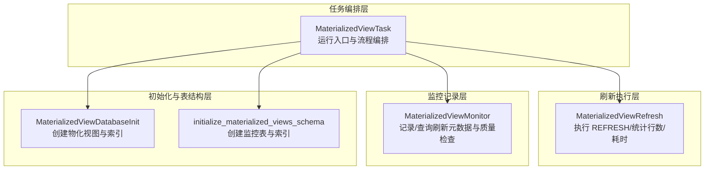
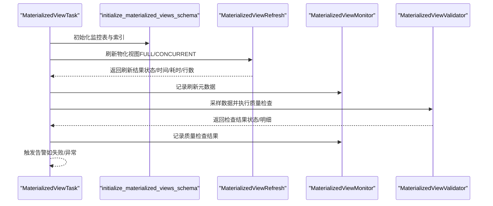
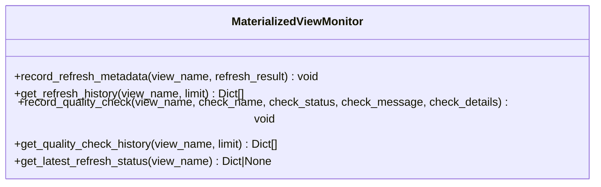
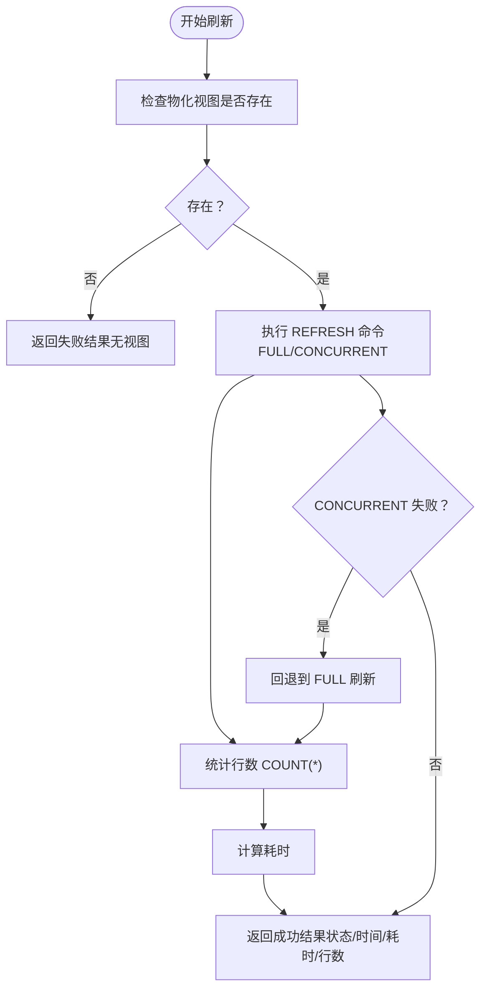
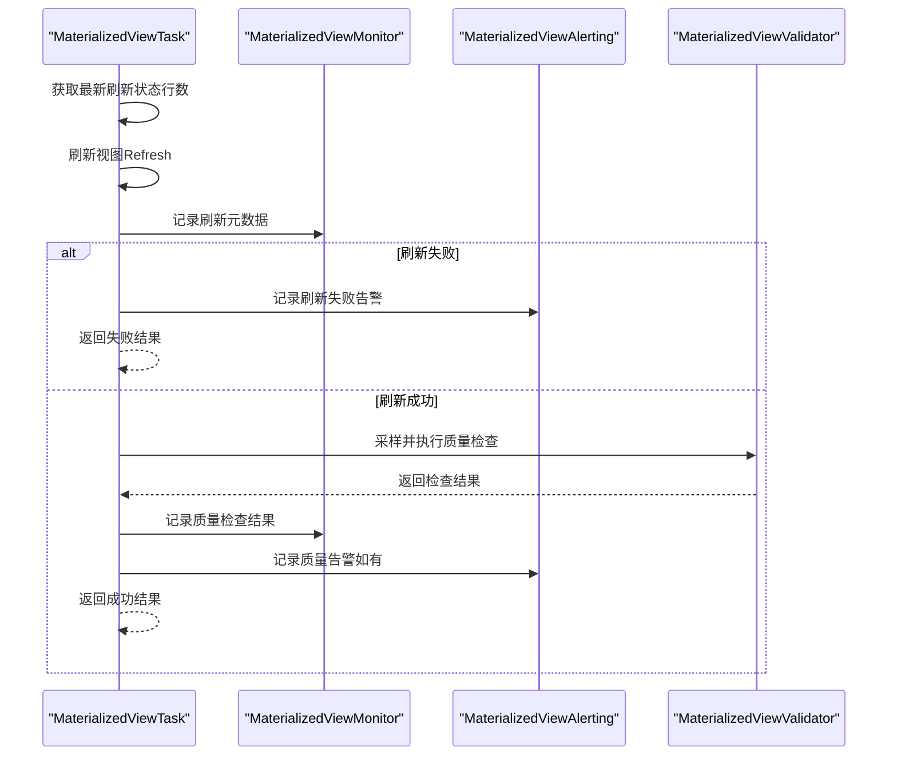
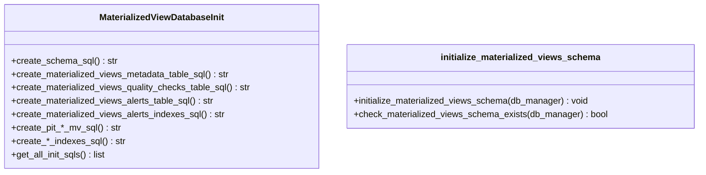
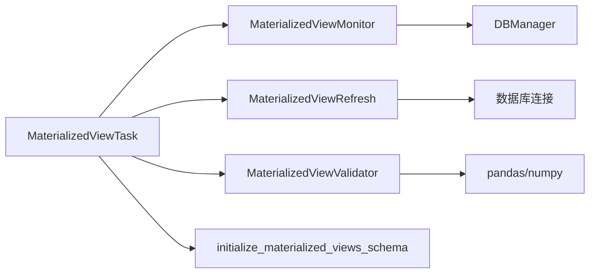

# 物化视图监控系统

<cite>
**本文引用的文件**
- [monitor.py](file://alphahome/processors/materialized_views/monitor.py)
- [database_init.py](file://alphahome/processors/materialized_views/database_init.py)
- [base_task.py](file://alphahome/processors/materialized_views/base_task.py)
- [refresh.py](file://alphahome/processors/materialized_views/refresh.py)
- [validator.py](file://alphahome/processors/materialized_views/validator.py)
- [materialized_views_schema.py](file://alphahome/common/db_components/materialized_views_schema.py)
- [sql_templates.py](file://alphahome/processors/materialized_views/sql_templates.py)
- [test_materialized_view_monitor.py](file://alphahome/processors/tests/test_materialized_views/test_materialized_view_monitor.py)
- [test_materialized_view_task.py](file://alphahome/processors/tests/test_materialized_views/test_materialized_view_task.py)
</cite>

## 目录
1. [简介](#简介)
2. [项目结构](#项目结构)
3. [核心组件](#核心组件)
4. [架构总览](#架构总览)
5. [详细组件分析](#详细组件分析)
6. [依赖分析](#依赖分析)
7. [性能考量](#性能考量)
8. [故障排查指南](#故障排查指南)
9. [结论](#结论)
10. [附录](#附录)

## 简介
本文件深入解析物化视图健康监控体系，围绕 monitor.py 的实现，阐述其如何定期检查各视图的 last_refresh_time、数据行数变化及刷新耗时等关键指标；说明监控器与 database_init.py 中的初始化逻辑如何协同工作，确保监控表结构的正确性；并提供实际使用示例，展示如何通过监控数据识别性能瓶颈或刷新失败问题，以及监控结果的存储格式与查询方式，帮助运维人员快速诊断系统状态。

## 项目结构
物化视图监控体系由“任务编排层”“刷新执行层”“监控记录层”“初始化与表结构层”四部分组成：
- 任务编排层：MaterializedViewTask 负责定义 SQL、刷新视图、质量检查、记录元数据与告警。
- 刷新执行层：MaterializedViewRefresh 负责执行 REFRESH 命令、统计行数与耗时。
- 监控记录层：MaterializedViewMonitor 负责记录刷新元数据与质量检查结果，并提供查询接口。
- 初始化与表结构层：database_init.py 与 materialized_views_schema.py 负责创建 schema 与监控表（元数据、质量检查、告警）。

图表来源
- [base_task.py](file://alphahome/processors/materialized_views/base_task.py#L1-L377)
- [refresh.py](file://alphahome/processors/materialized_views/refresh.py#L1-L364)
- [monitor.py](file://alphahome/processors/materialized_views/monitor.py#L1-L407)
- [database_init.py](file://alphahome/processors/materialized_views/database_init.py#L1-L556)
- [materialized_views_schema.py](file://alphahome/common/db_components/materialized_views_schema.py#L1-L203)

章节来源
- [base_task.py](file://alphahome/processors/materialized_views/base_task.py#L1-L377)
- [refresh.py](file://alphahome/processors/materialized_views/refresh.py#L1-L364)
- [monitor.py](file://alphahome/processors/materialized_views/monitor.py#L1-L407)
- [database_init.py](file://alphahome/processors/materialized_views/database_init.py#L1-L556)
- [materialized_views_schema.py](file://alphahome/common/db_components/materialized_views_schema.py#L1-L203)

## 核心组件
- MaterializedViewMonitor：提供记录刷新元数据、查询刷新历史、记录质量检查、查询质量检查历史、获取最新刷新状态等能力。
- MaterializedViewRefresh：封装 REFRESH MATERIALIZED VIEW 的执行，支持 FULL 与 CONCURRENT 策略，统计行数与耗时。
- MaterializedViewTask：任务入口，串联初始化、刷新、监控、质量检查与告警。
- MaterializedViewDatabaseInit 与 initialize_materialized_views_schema：负责创建 schema 与监控表（元数据、质量检查、告警）及其索引。

章节来源
- [monitor.py](file://alphahome/processors/materialized_views/monitor.py#L1-L407)
- [refresh.py](file://alphahome/processors/materialized_views/refresh.py#L1-L364)
- [base_task.py](file://alphahome/processors/materialized_views/base_task.py#L1-L377)
- [database_init.py](file://alphahome/processors/materialized_views/database_init.py#L1-L556)
- [materialized_views_schema.py](file://alphahome/common/db_components/materialized_views_schema.py#L1-L203)

## 架构总览
监控体系的关键流程如下：
- 任务启动：MaterializedViewTask 在运行前调用 initialize_materialized_views_schema，确保监控表存在。
- 刷新执行：MaterializedViewRefresh 执行 REFRESH 命令，统计行数与耗时。
- 元数据记录：MaterializedViewMonitor 记录刷新元数据（last_refresh_time、row_count、refresh_duration_seconds、error_message 等）。
- 质量检查：MaterializedViewValidator 对样本数据进行缺失值、异常值、行数变化、重复值、类型检查，并通过 Monitor 记录质量检查结果。
- 历史查询：Monitor 提供查询接口，支持按视图名查询刷新历史与质量检查历史，以及获取最新刷新状态。

图表来源
- [base_task.py](file://alphahome/processors/materialized_views/base_task.py#L1-L377)
- [refresh.py](file://alphahome/processors/materialized_views/refresh.py#L1-L364)
- [monitor.py](file://alphahome/processors/materialized_views/monitor.py#L1-L407)
- [validator.py](file://alphahome/processors/materialized_views/validator.py#L1-L513)
- [materialized_views_schema.py](file://alphahome/common/db_components/materialized_views_schema.py#L1-L203)

## 详细组件分析

### 组件一：监控器 MaterializedViewMonitor
职责与能力
- 记录刷新元数据：包含视图名、schema、数据源表、刷新策略、最后刷新时间、状态、行数、耗时、错误信息等。
- 查询刷新历史：按视图名查询最近若干条刷新记录。
- 记录质量检查：记录检查名称、状态、消息与详情（JSON）。
- 查询质量检查历史：按视图名查询最近若干条检查记录。
- 获取最新刷新状态：返回最新一次刷新的完整状态。

关键实现要点
- 使用 UPSERT（INSERT … ON CONFLICT）更新元数据，避免重复插入。
- source_tables 与 check_details 以 JSON 文本形式存储，便于灵活扩展。
- 查询时将 JSON 字段还原为 Python 结构，保证对外接口一致。

图表来源
- [monitor.py](file://alphahome/processors/materialized_views/monitor.py#L1-L407)

章节来源
- [monitor.py](file://alphahome/processors/materialized_views/monitor.py#L1-L407)

### 组件二：刷新执行器 MaterializedViewRefresh
职责与能力
- 执行 REFRESH MATERIALIZED VIEW 命令，支持 FULL 与 CONCURRENT 策略。
- 自动回退：当 CONCURRENT 刷新失败（如缺少唯一索引）时自动回退到 FULL 刷新。
- 统计行数与耗时：刷新完成后查询 COUNT(*) 并计算耗时。
- 返回标准刷新结果：包含状态、视图全名、刷新时间、耗时、行数、错误信息等。

图表来源
- [refresh.py](file://alphahome/processors/materialized_views/refresh.py#L1-L364)

章节来源
- [refresh.py](file://alphahome/processors/materialized_views/refresh.py#L1-L364)

### 组件三：任务编排 MaterializedViewTask
职责与能力
- 定义物化视图 SQL（清洗、标准化、业务逻辑、血缘元数据、数据校验）。
- 刷新视图并记录刷新元数据。
- 进行数据质量检查并记录检查结果。
- 获取最新刷新状态，辅助行数变化检查。
- 触发告警（刷新失败或质量异常）。

关键流程
- 运行前确保监控表存在（initialize_materialized_views_schema）。
- 若视图不存在且允许创建，则先创建视图再刷新。
- 刷新成功后记录元数据与质量检查结果，并触发告警（如有）。

图表来源
- [base_task.py](file://alphahome/processors/materialized_views/base_task.py#L1-L377)
- [monitor.py](file://alphahome/processors/materialized_views/monitor.py#L1-L407)
- [validator.py](file://alphahome/processors/materialized_views/validator.py#L1-L513)

章节来源
- [base_task.py](file://alphahome/processors/materialized_views/base_task.py#L1-L377)

### 组件四：初始化与表结构
- database_init.py：提供创建物化视图、索引与监控表（元数据、质量检查、告警）的 SQL 生成器。
- materialized_views_schema.py：提供 initialize_materialized_views_schema，确保 schema 存在并创建监控表与索引。

图表来源
- [database_init.py](file://alphahome/processors/materialized_views/database_init.py#L1-L556)
- [materialized_views_schema.py](file://alphahome/common/db_components/materialized_views_schema.py#L1-L203)

章节来源
- [database_init.py](file://alphahome/processors/materialized_views/database_init.py#L1-L556)
- [materialized_views_schema.py](file://alphahome/common/db_components/materialized_views_schema.py#L1-L203)

## 依赖分析
- 组件耦合
  - MaterializedViewTask 依赖 MaterializedViewMonitor、MaterializedViewRefresh、MaterializedViewValidator、initialize_materialized_views_schema。
  - MaterializedViewMonitor 依赖 DBManager（异步执行/查询）。
  - database_init.py 与 materialized_views_schema.py 共同保障监控表结构的一致性。
- 外部依赖
  - PostgreSQL 物化视图与 REFRESH 命令。
  - JSON 字段用于存储 source_tables 与 check_details，便于灵活扩展。

图表来源
- [base_task.py](file://alphahome/processors/materialized_views/base_task.py#L1-L377)
- [monitor.py](file://alphahome/processors/materialized_views/monitor.py#L1-L407)
- [refresh.py](file://alphahome/processors/materialized_views/refresh.py#L1-L364)
- [validator.py](file://alphahome/processors/materialized_views/validator.py#L1-L513)
- [materialized_views_schema.py](file://alphahome/common/db_components/materialized_views_schema.py#L1-L203)

章节来源
- [base_task.py](file://alphahome/processors/materialized_views/base_task.py#L1-L377)
- [monitor.py](file://alphahome/processors/materialized_views/monitor.py#L1-L407)
- [refresh.py](file://alphahome/processors/materialized_views/refresh.py#L1-L364)
- [validator.py](file://alphahome/processors/materialized_views/validator.py#L1-L513)
- [materialized_views_schema.py](file://alphahome/common/db_components/materialized_views_schema.py#L1-L203)

## 性能考量
- 刷新策略选择
  - CONCURRENT 刷新在无唯一索引时会回退到 FULL 刷新，避免阻塞查询但可能失败。建议为高频刷新视图建立合适索引。
- 行数统计
  - 刷新后执行 COUNT(*) 统计行数，对于超大视图可能带来额外开销。可在任务配置中控制采样大小与频率。
- 监控表索引
  - 元数据与质量检查表均具备常用查询字段索引，有助于加速历史查询与告警检索。
- JSON 字段
  - source_tables 与 check_details 采用 JSON 文本存储，便于灵活扩展，但查询时需注意 JSON 解析成本。

[本节为通用指导，无需列出具体文件来源]

## 故障排查指南
常见问题与定位思路
- 刷新失败
  - 检查最新刷新状态与错误信息；若为 CONCURRENT 刷新失败，确认是否存在唯一索引；必要时回退到 FULL 刷新。
  - 参考路径：[refresh.py](file://alphahome/processors/materialized_views/refresh.py#L1-L364)
- 行数异常波动
  - 使用 get_latest_refresh_status 获取最新行数，结合 get_refresh_history 查看历史行数变化趋势；若波动超过阈值，进一步查看 row_count_change 检查详情。
  - 参考路径：[monitor.py](file://alphahome/processors/materialized_views/monitor.py#L1-L407)、[validator.py](file://alphahome/processors/materialized_views/validator.py#L1-L513)
- 质量检查告警
  - 通过 get_quality_check_history 获取最近检查记录，定位具体列与阈值；根据 check_details 与 message 定位问题。
  - 参考路径：[monitor.py](file://alphahome/processors/materialized_views/monitor.py#L1-L407)、[validator.py](file://alphahome/processors/materialized_views/validator.py#L1-L513)
- 监控表缺失或结构不一致
  - 使用 initialize_materialized_views_schema 确保监控表存在；或使用 database_init.py 生成初始化 SQL 并执行。
  - 参考路径：[materialized_views_schema.py](file://alphahome/common/db_components/materialized_views_schema.py#L1-L203)、[database_init.py](file://alphahome/processors/materialized_views/database_init.py#L1-L556)

章节来源
- [refresh.py](file://alphahome/processors/materialized_views/refresh.py#L1-L364)
- [monitor.py](file://alphahome/processors/materialized_views/monitor.py#L1-L407)
- [validator.py](file://alphahome/processors/materialized_views/validator.py#L1-L513)
- [materialized_views_schema.py](file://alphahome/common/db_components/materialized_views_schema.py#L1-L203)
- [database_init.py](file://alphahome/processors/materialized_views/database_init.py#L1-L556)

## 结论
物化视图健康监控体系通过“任务编排—刷新执行—监控记录—初始化与表结构”的协同，实现了对刷新状态、行数变化与刷新耗时的全面观测，并以 JSON 字段承载灵活的元数据与检查详情。配合初始化脚本与索引设计，运维人员可以快速定位刷新失败、性能瓶颈与数据质量问题，保障物化视图服务的稳定性与可观测性。

[本节为总结性内容，无需列出具体文件来源]

## 附录

### 实际使用示例（基于测试与实现的路径指引）
- 记录刷新元数据并查询历史
  - 路径参考：[monitor.py](file://alphahome/processors/materialized_views/monitor.py#L1-L407)
  - 测试参考：[test_materialized_view_monitor.py](file://alphahome/processors/tests/test_materialized_views/test_materialized_view_monitor.py#L1-L543)
- 刷新视图并记录元数据
  - 路径参考：[base_task.py](file://alphahome/processors/materialized_views/base_task.py#L1-L377)、[refresh.py](file://alphahome/processors/materialized_views/refresh.py#L1-L364)
  - 测试参考：[test_materialized_view_task.py](file://alphahome/processors/tests/test_materialized_views/test_materialized_view_task.py#L1-L462)
- 质量检查与记录
  - 路径参考：[validator.py](file://alphahome/processors/materialized_views/validator.py#L1-L513)、[monitor.py](file://alphahome/processors/materialized_views/monitor.py#L1-L407)
- 初始化监控表结构
  - 路径参考：[materialized_views_schema.py](file://alphahome/common/db_components/materialized_views_schema.py#L1-L203)、[database_init.py](file://alphahome/processors/materialized_views/database_init.py#L1-L556)

章节来源
- [monitor.py](file://alphahome/processors/materialized_views/monitor.py#L1-L407)
- [refresh.py](file://alphahome/processors/materialized_views/refresh.py#L1-L364)
- [base_task.py](file://alphahome/processors/materialized_views/base_task.py#L1-L377)
- [validator.py](file://alphahome/processors/materialized_views/validator.py#L1-L513)
- [materialized_views_schema.py](file://alphahome/common/db_components/materialized_views_schema.py#L1-L203)
- [database_init.py](file://alphahome/processors/materialized_views/database_init.py#L1-L556)
- [test_materialized_view_monitor.py](file://alphahome/processors/tests/test_materialized_views/test_materialized_view_monitor.py#L1-L543)
- [test_materialized_view_task.py](file://alphahome/processors/tests/test_materialized_views/test_materialized_view_task.py#L1-L462)