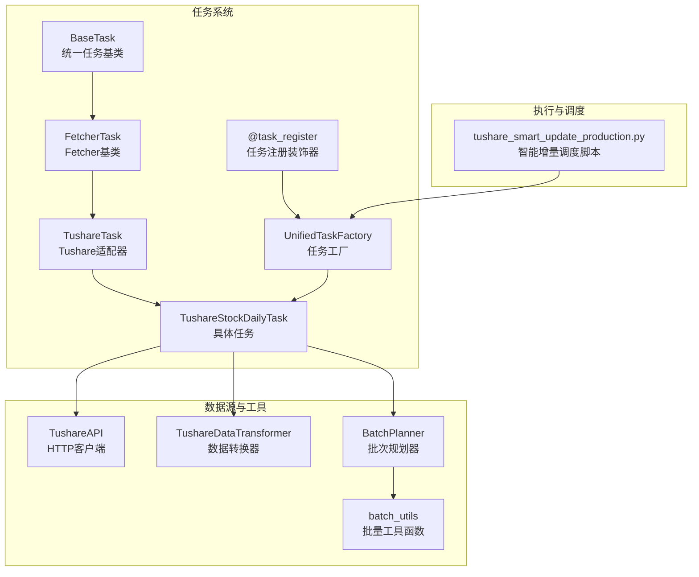
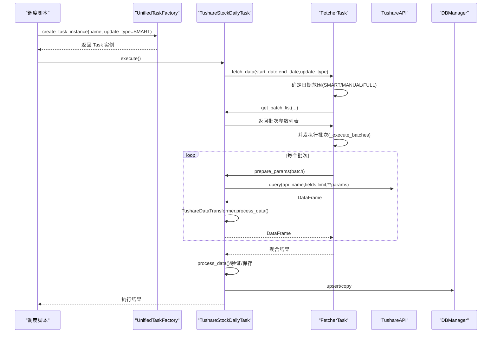
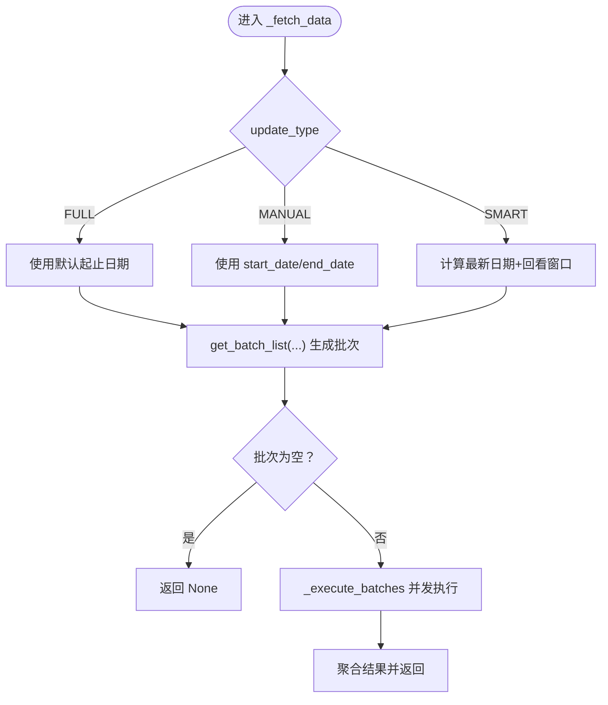
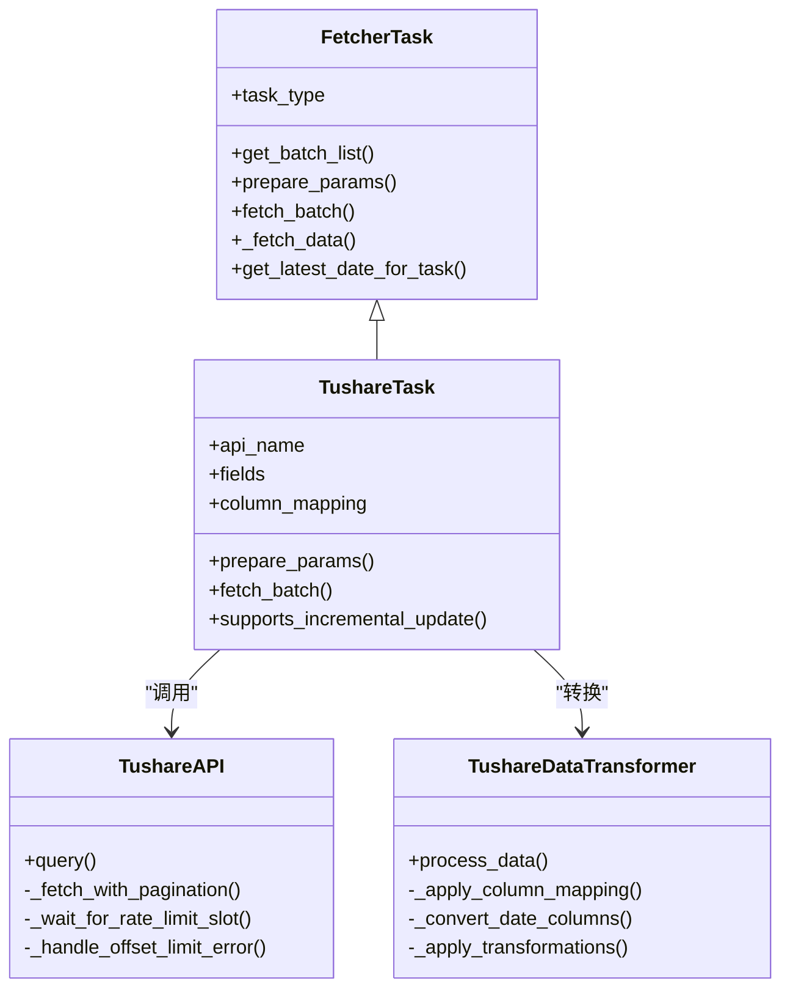
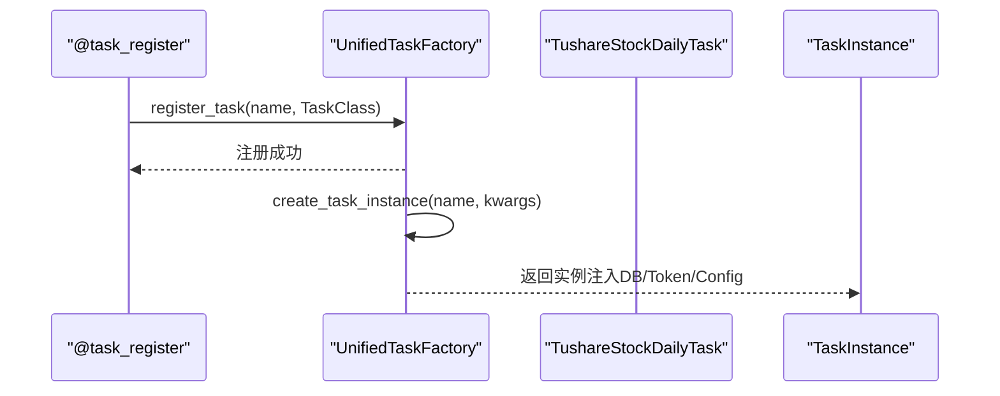
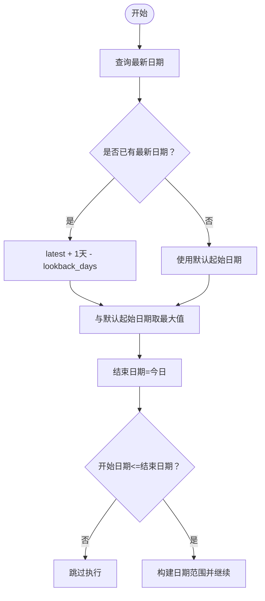
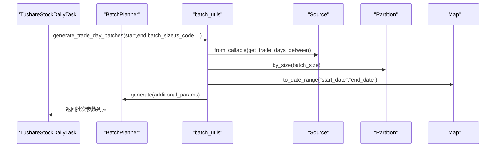
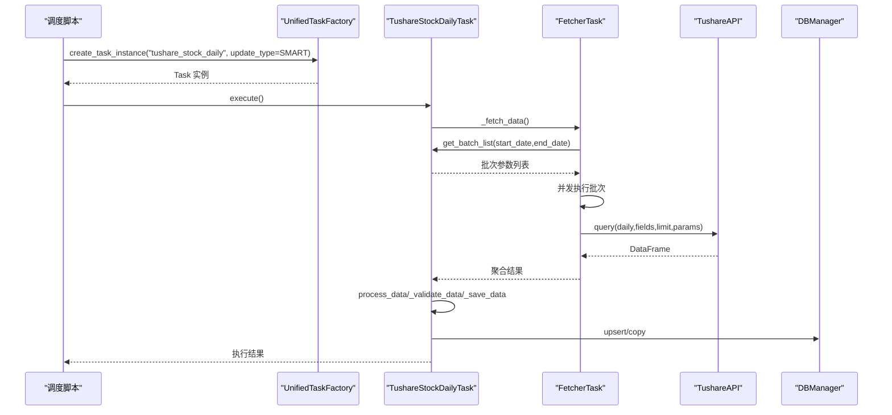
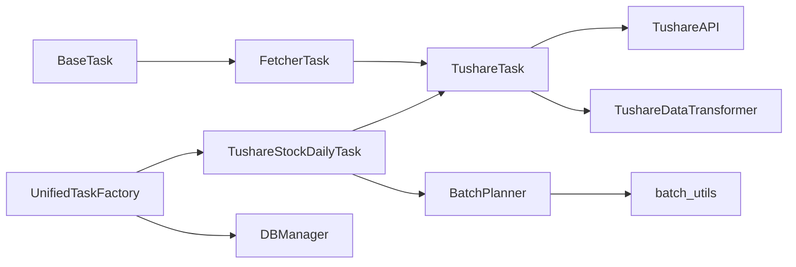

# 数据获取模块 (Fetchers)

<cite>
**本文引用的文件**
- [fetcher_task.py](file://alphahome/fetchers/base/fetcher_task.py)
- [tushare_task.py](file://alphahome/fetchers/sources/tushare/tushare_task.py)
- [tushare_stock_daily.py](file://alphahome/fetchers/tasks/stock/tushare_stock_daily.py)
- [tushare_api.py](file://alphahome/fetchers/sources/tushare/tushare_api.py)
- [tushare_data_transformer.py](file://alphahome/fetchers/sources/tushare/tushare_data_transformer.py)
- [batch_utils.py](file://alphahome/fetchers/sources/tushare/batch_utils.py)
- [batch_planner.py](file://alphahome/common/planning/batch_planner.py)
- [base_task.py](file://alphahome/common/task_system/base_task.py)
- [task_decorator.py](file://alphahome/common/task_system/task_decorator.py)
- [task_factory.py](file://alphahome/common/task_system/task_factory.py)
- [tushare_smart_update_production.py](file://scripts/production/data_updaters/tushare/tushare_smart_update_production.py)
</cite>

## 目录
1. [简介](#简介)
2. [项目结构](#项目结构)
3. [核心组件](#核心组件)
4. [架构总览](#架构总览)
5. [详细组件分析](#详细组件分析)
6. [依赖关系分析](#依赖关系分析)
7. [性能考量](#性能考量)
8. [故障排查指南](#故障排查指南)
9. [结论](#结论)

## 简介
本文件深入解析 AlphaHome 的 Fetchers 模块，聚焦于从 Tushare、AkShare、PyTDX 等外部金融数据源抓取原始数据的体系。重点涵盖：
- FetcherTask 基类的设计与职责
- 各数据源适配器（以 tushare_task.py 为例）如何继承并实现具体抓取逻辑
- 任务注册机制（@task_register 装饰器）与工厂（UnifiedTaskFactory）
- 智能更新策略（全量、增量、智能更新）的实现原理
- 批量任务调度（batch_utils 与 planning）在 Tushare 场景下的作用
- API 配额限制与网络异常的处理策略
- 典型任务（如 tushare_stock_daily）从触发到落库的完整流程
- 常见问题排查与最佳实践

## 项目结构
Fetchers 模块围绕“任务基类 + 数据源适配器 + 任务注册与工厂 + 批量规划 + API 客户端”的分层组织：
- base/fetcher_task.py：FetcherTask 抽象基类，定义 fetch 生命周期、并发与重试、日期范围确定、批量执行等
- sources/tushare/*：Tushare 专属实现，包括 API 客户端、数据转换器、任务适配器与批量工具
- tasks/stock/tushare_stock_daily.py：具体任务示例，演示如何继承 TushareTask 并实现 get_batch_list
- common/planning/batch_planner.py：通用的批次规划器，提供 Source/Partition/Map 策略
- common/task_system/*：任务装饰器与工厂，负责任务注册、实例化与配置注入
- scripts/production/data_updaters/tushare/tushare_smart_update_production.py：生产侧智能增量更新脚本示例

图表来源
- [base_task.py](file://alphahome/common/task_system/base_task.py#L1-L120)
- [fetcher_task.py](file://alphahome/fetchers/base/fetcher_task.py#L1-L120)
- [tushare_task.py](file://alphahome/fetchers/sources/tushare/tushare_task.py#L1-L120)
- [tushare_stock_daily.py](file://alphahome/fetchers/tasks/stock/tushare_stock_daily.py#L1-L120)
- [tushare_api.py](file://alphahome/fetchers/sources/tushare/tushare_api.py#L1-L120)
- [tushare_data_transformer.py](file://alphahome/fetchers/sources/tushare/tushare_data_transformer.py#L1-L120)
- [batch_planner.py](file://alphahome/common/planning/batch_planner.py#L1-L120)
- [batch_utils.py](file://alphahome/fetchers/sources/tushare/batch_utils.py#L1-L120)
- [task_decorator.py](file://alphahome/common/task_system/task_decorator.py#L1-L77)
- [task_factory.py](file://alphahome/common/task_system/task_factory.py#L1-L120)
- [tushare_smart_update_production.py](file://scripts/production/data_updaters/tushare/tushare_smart_update_production.py#L133-L165)

章节来源
- [fetcher_task.py](file://alphahome/fetchers/base/fetcher_task.py#L1-L120)
- [tushare_task.py](file://alphahome/fetchers/sources/tushare/tushare_task.py#L1-L120)
- [tushare_stock_daily.py](file://alphahome/fetchers/tasks/stock/tushare_stock_daily.py#L1-L120)
- [batch_planner.py](file://alphahome/common/planning/batch_planner.py#L1-L120)
- [batch_utils.py](file://alphahome/fetchers/sources/tushare/batch_utils.py#L1-L120)
- [task_decorator.py](file://alphahome/common/task_system/task_decorator.py#L1-L77)
- [task_factory.py](file://alphahome/common/task_system/task_factory.py#L1-L120)
- [tushare_smart_update_production.py](file://scripts/production/data_updaters/tushare/tushare_smart_update_production.py#L133-L165)

## 核心组件
- FetcherTask：定义 fetch 生命周期的抽象基类，封装日期范围确定、批次生成、并发执行与重试、结果聚合等
- TushareTask：面向 Tushare 的适配器，统一 prepare_params 与 fetch_batch，将 API 调用与数据转换解耦
- TushareAPI：Tushare HTTP 客户端，内置速率限制与并发控制、分页与智能时间拆分、错误处理
- TushareDataTransformer：在 fetch 阶段进行列名映射、日期列转换与基础转换
- BatchPlanner 与 batch_utils：提供交易日/自然日/季度/月份等多策略的批次生成工具
- BaseTask：统一任务基类，提供 execute 生命周期、数据验证、保存策略、视图创建等
- @task_register 与 UnifiedTaskFactory：任务注册与实例化，自动注入 DB 连接、API Token 与任务配置

章节来源
- [fetcher_task.py](file://alphahome/fetchers/base/fetcher_task.py#L1-L120)
- [tushare_task.py](file://alphahome/fetchers/sources/tushare/tushare_task.py#L1-L120)
- [tushare_api.py](file://alphahome/fetchers/sources/tushare/tushare_api.py#L1-L120)
- [tushare_data_transformer.py](file://alphahome/fetchers/sources/tushare/tushare_data_transformer.py#L1-L120)
- [batch_planner.py](file://alphahome/common/planning/batch_planner.py#L1-L120)
- [batch_utils.py](file://alphahome/fetchers/sources/tushare/batch_utils.py#L1-L120)
- [base_task.py](file://alphahome/common/task_system/base_task.py#L1-L120)
- [task_decorator.py](file://alphahome/common/task_system/task_decorator.py#L1-L77)
- [task_factory.py](file://alphahome/common/task_system/task_factory.py#L1-L120)

## 架构总览
Fetchers 的整体流程如下：
- 任务注册：使用 @task_register 将任务类注册到 UnifiedTaskFactory
- 任务实例化：工厂注入 DB 连接、API Token 与任务配置，创建具体任务实例
- 执行生命周期：BaseTask.execute 调用 _fetch_data（FetcherTask 实现），随后 process_data、验证、保存
- 数据抓取：FetcherTask._fetch_data 决策更新类型，生成批次，使用信号量并发执行，重试失败批次
- API 调用：TushareTask.fetch_batch 通过 TushareAPI.query，自动分页、速率限制与智能拆分
- 数据转换：TushareDataTransformer 在 fetch 阶段做列名映射与基础转换；业务转换在 BaseTask.process_data
- 批量规划：batch_utils 与 BatchPlanner 提供多种日期/代码切分策略，生成批次参数

图表来源
- [tushare_smart_update_production.py](file://scripts/production/data_updaters/tushare/tushare_smart_update_production.py#L133-L165)
- [task_factory.py](file://alphahome/common/task_system/task_factory.py#L220-L272)
- [base_task.py](file://alphahome/common/task_system/base_task.py#L138-L239)
- [fetcher_task.py](file://alphahome/fetchers/base/fetcher_task.py#L211-L288)
- [tushare_stock_daily.py](file://alphahome/fetchers/tasks/stock/tushare_stock_daily.py#L108-L177)
- [tushare_task.py](file://alphahome/fetchers/sources/tushare/tushare_task.py#L98-L145)
- [tushare_api.py](file://alphahome/fetchers/sources/tushare/tushare_api.py#L192-L416)
- [tushare_data_transformer.py](file://alphahome/fetchers/sources/tushare/tushare_data_transformer.py#L199-L229)

## 详细组件分析

### FetcherTask 基类设计与职责
- 更新类型决策：支持 MANUAL、SMART、FULL 三种模式，分别由传参、智能回看与默认范围决定日期范围
- 批次生成：get_batch_list 由子类实现，返回批次参数列表
- 并发与重试：使用 asyncio.Semaphore 控制并发，max_retries 与 retry_delay 控制重试策略
- 结果聚合：将各批次返回的 DataFrame 合并，空结果时返回 None
- 日期查询：提供 get_latest_date_for_task 与 get_latest_date，便于智能增量判断

图表来源
- [fetcher_task.py](file://alphahome/fetchers/base/fetcher_task.py#L118-L288)

章节来源
- [fetcher_task.py](file://alphahome/fetchers/base/fetcher_task.py#L118-L288)

### TushareTask 适配器与 TushareAPI
- TushareTask
  - 统一 prepare_params 与 fetch_batch，屏蔽 Tushare API 细节
  - 通过 TushareAPI.query 与 TushareDataTransformer.process_data 完成数据抓取与初步转换
  - 支持智能增量更新开关与跳过原因说明
- TushareAPI
  - 速率限制：基于滑动窗口与并发信号量双重控制
  - 分页与智能拆分：处理 offset 限制（50101）时自动按时间拆分
  - 错误处理：识别 40203（速率限制）、50101（offset 限制）等并给出策略
  - 超时与取消：支持 stop_event，优雅取消

图表来源
- [fetcher_task.py](file://alphahome/fetchers/base/fetcher_task.py#L1-L120)
- [tushare_task.py](file://alphahome/fetchers/sources/tushare/tushare_task.py#L1-L120)
- [tushare_api.py](file://alphahome/fetchers/sources/tushare/tushare_api.py#L192-L416)
- [tushare_data_transformer.py](file://alphahome/fetchers/sources/tushare/tushare_data_transformer.py#L199-L229)

章节来源
- [tushare_task.py](file://alphahome/fetchers/sources/tushare/tushare_task.py#L1-L184)
- [tushare_api.py](file://alphahome/fetchers/sources/tushare/tushare_api.py#L192-L416)
- [tushare_data_transformer.py](file://alphahome/fetchers/sources/tushare/tushare_data_transformer.py#L1-L233)

### 任务注册机制与工厂
- @task_register：装饰器将任务类注册到 UnifiedTaskFactory，支持直接使用类或带名称的装饰器形式
- UnifiedTaskFactory：
  - initialize/reload_config/shutdown 管理数据库连接
  - create_task_instance/get_task 注入 db_connection、api_token、task_config
  - get_tasks_by_type/get_task_names_by_type 获取任务集合与名称

图表来源
- [task_decorator.py](file://alphahome/common/task_system/task_decorator.py#L18-L70)
- [task_factory.py](file://alphahome/common/task_system/task_factory.py#L220-L272)

章节来源
- [task_decorator.py](file://alphahome/common/task_system/task_decorator.py#L18-L70)
- [task_factory.py](file://alphahome/common/task_system/task_factory.py#L1-L120)

### 智能更新策略（SMART）实现原理
- SMART 模式：通过 get_latest_date_for_task 获取表中最新日期，结合回看天数与默认起始日期，动态确定更新区间
- 若最新日期为空（首次运行）或区间无效（开始日期晚于结束），智能更新将跳过
- 生产脚本中可通过 update_type=SMART 强制使用智能增量

图表来源
- [fetcher_task.py](file://alphahome/fetchers/base/fetcher_task.py#L118-L153)
- [base_task.py](file://alphahome/common/task_system/base_task.py#L786-L794)
- [tushare_smart_update_production.py](file://scripts/production/data_updaters/tushare/tushare_smart_update_production.py#L133-L165)

章节来源
- [fetcher_task.py](file://alphahome/fetchers/base/fetcher_task.py#L118-L153)
- [base_task.py](file://alphahome/common/task_system/base_task.py#L786-L794)
- [tushare_smart_update_production.py](file://scripts/production/data_updaters/tushare/tushare_smart_update_production.py#L133-L165)

### 批量任务调度（batch_utils 与 planning）
- BatchPlanner：提供 Source/Partition/Map 三要素，支持 by_size、by_month、by_quarter 等分区策略，以及 to_date_range、to_dict、custom_func 映射策略
- batch_utils：提供 generate_trade_day_batches、generate_natural_day_batches、generate_month_range_batches、generate_quarter_range_batches、generate_single_date_batches、generate_stock_code_batches 等常用批次生成函数
- TushareStockDailyTask：在 get_batch_list 中调用 generate_trade_day_batches，按交易日切分，支持单股票与全市场不同批次大小

图表来源
- [tushare_stock_daily.py](file://alphahome/fetchers/tasks/stock/tushare_stock_daily.py#L108-L177)
- [batch_utils.py](file://alphahome/fetchers/sources/tushare/batch_utils.py#L66-L129)
- [batch_planner.py](file://alphahome/common/planning/batch_planner.py#L178-L234)

章节来源
- [batch_planner.py](file://alphahome/common/planning/batch_planner.py#L1-L234)
- [batch_utils.py](file://alphahome/fetchers/sources/tushare/batch_utils.py#L1-L200)
- [tushare_stock_daily.py](file://alphahome/fetchers/tasks/stock/tushare_stock_daily.py#L108-L177)

### 典型任务：tushare_stock_daily 的完整流程
- 任务定义：继承 TushareTask，设置 domain/name/table_name/primary_keys/date_column/default_start_date/smart_lookback_days 等
- 批次生成：get_batch_list 使用 generate_trade_day_batches，按单股票或全市场选择不同 batch_size
- 数据抓取：FetcherTask._fetch_data 调用 get_batch_list，_execute_batches 并发执行，TushareTask.fetch_batch 通过 TushareAPI.query 获取数据并转换
- 数据处理：TushareDataTransformer.process_data 做列名映射与日期转换；BaseTask.process_data 做业务转换；BaseTask._validate_data 做统一验证
- 数据保存：BaseTask._save_data 支持去重、主键空值过滤、分批保存与 UPSERT/INSERT 模式

图表来源
- [tushare_stock_daily.py](file://alphahome/fetchers/tasks/stock/tushare_stock_daily.py#L1-L177)
- [fetcher_task.py](file://alphahome/fetchers/base/fetcher_task.py#L211-L288)
- [tushare_task.py](file://alphahome/fetchers/sources/tushare/tushare_task.py#L98-L145)
- [tushare_api.py](file://alphahome/fetchers/sources/tushare/tushare_api.py#L192-L416)
- [base_task.py](file://alphahome/common/task_system/base_task.py#L138-L239)

章节来源
- [tushare_stock_daily.py](file://alphahome/fetchers/tasks/stock/tushare_stock_daily.py#L1-L177)
- [fetcher_task.py](file://alphahome/fetchers/base/fetcher_task.py#L211-L288)
- [tushare_task.py](file://alphahome/fetchers/sources/tushare/tushare_task.py#L98-L145)
- [tushare_api.py](file://alphahome/fetchers/sources/tushare/tushare_api.py#L192-L416)
- [base_task.py](file://alphahome/common/task_system/base_task.py#L138-L239)

## 依赖关系分析
- 组件耦合
  - FetcherTask 依赖 BaseTask 的执行生命周期与保存策略
  - TushareTask 依赖 TushareAPI 与 TushareDataTransformer
  - 具体任务（如 TushareStockDailyTask）依赖 batch_utils 与 BatchPlanner
  - 工厂（UnifiedTaskFactory）依赖配置管理与 DBManager
- 外部依赖
  - aiohttp、aiolimiter、pandas、numpy、asyncio
- 潜在循环依赖
  - TushareDataTransformer 通过类型提示避免循环导入
  - 任务类通过装饰器与工厂间接耦合，避免直接循环引用

图表来源
- [base_task.py](file://alphahome/common/task_system/base_task.py#L1-L120)
- [fetcher_task.py](file://alphahome/fetchers/base/fetcher_task.py#L1-L120)
- [tushare_task.py](file://alphahome/fetchers/sources/tushare/tushare_task.py#L1-L120)
- [tushare_api.py](file://alphahome/fetchers/sources/tushare/tushare_api.py#L1-L120)
- [tushare_data_transformer.py](file://alphahome/fetchers/sources/tushare/tushare_data_transformer.py#L1-L120)
- [batch_planner.py](file://alphahome/common/planning/batch_planner.py#L1-L120)
- [batch_utils.py](file://alphahome/fetchers/sources/tushare/batch_utils.py#L1-L120)
- [task_factory.py](file://alphahome/common/task_system/task_factory.py#L1-L120)

章节来源
- [task_factory.py](file://alphahome/common/task_system/task_factory.py#L1-L120)
- [tushare_stock_daily.py](file://alphahome/fetchers/tasks/stock/tushare_stock_daily.py#L1-L120)

## 性能考量
- 并发与限速
  - FetcherTask 使用 asyncio.Semaphore 控制批次并发，避免过度占用网络与数据库
  - TushareAPI 使用滑动窗口与并发信号量双重限速，减少 40203 与 50101 错误
- 分页与智能拆分
  - 自动分页与智能时间拆分（50101）提升吞吐与稳定性
- 批次大小
  - save_batch_size 与 page_size 可配置，平衡内存与 IO
- 去重与主键校验
  - 保存前去重与主键空值过滤，减少重复写入与脏数据

[本节为通用指导，不直接分析具体文件]

## 故障排查指南
- 数据获取失败
  - 检查 Tushare Token 是否正确注入（工厂会自动注入）
  - 查看 TushareAPI 的错误码与响应内容，关注 40203（速率限制）、50101（offset 限制）
  - 若出现 50101，确认批次时间跨度是否过大，必要时缩小 batch_size 或启用智能拆分
- 字段缺失
  - 确认 TushareTask.fields 与 column_mapping 是否匹配目标表结构
  - 检查 TushareDataTransformer 的列名映射与日期转换是否生效
- 主键冲突与重复
  - 若使用 UPSERT，确认 primary_keys 是否正确；若使用 INSERT 模式，注意重复数据
- 验证失败
  - 检查 BaseTask._validate_data 的规则与 validation_mode（report/filter）
- 取消与超时
  - 确保 stop_event 正确传递，避免长时间阻塞
  - 调整 aiohttp.ClientTimeout 与重试间隔

章节来源
- [task_factory.py](file://alphahome/common/task_system/task_factory.py#L220-L272)
- [tushare_api.py](file://alphahome/fetchers/sources/tushare/tushare_api.py#L288-L416)
- [tushare_data_transformer.py](file://alphahome/fetchers/sources/tushare/tushare_data_transformer.py#L199-L229)
- [base_task.py](file://alphahome/common/task_system/base_task.py#L374-L554)

## 结论
Fetchers 模块通过“任务基类 + 适配器 + 工厂 + 批量规划 + API 客户端”的清晰分层，实现了对多数据源的统一接入与高效执行。SMART 智能更新策略显著降低了 API 配额消耗与数据库压力；并发与限速机制保障了稳定性；批量规划工具提供了灵活的切分策略。配合统一的任务注册与工厂注入，使得新增任务与维护变得简单可靠。