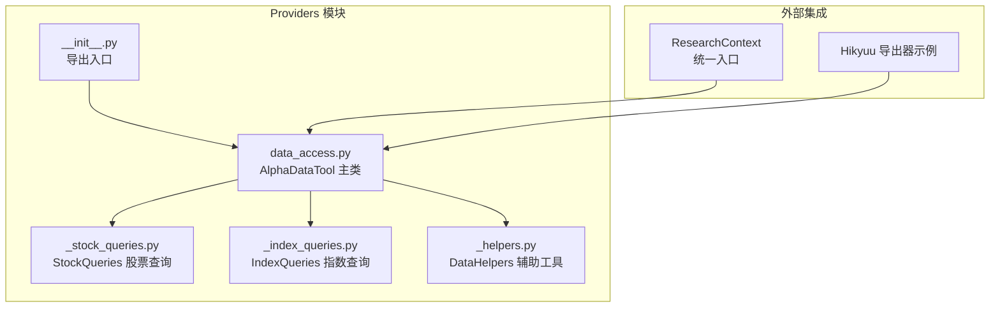
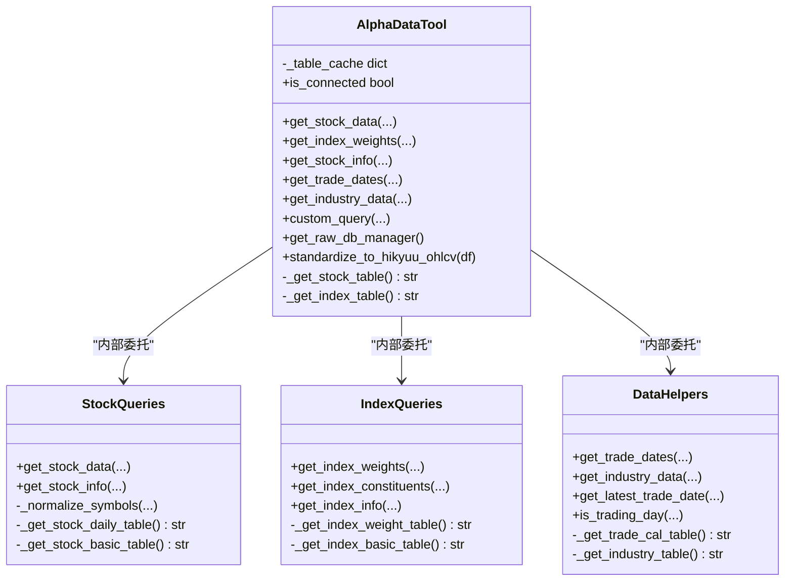
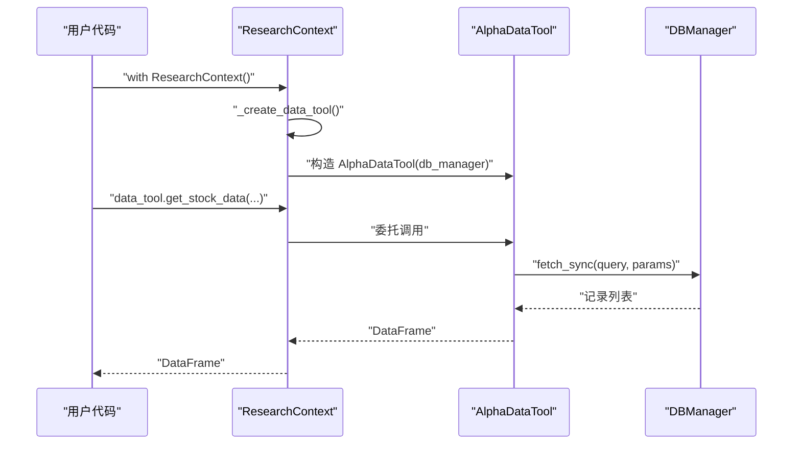
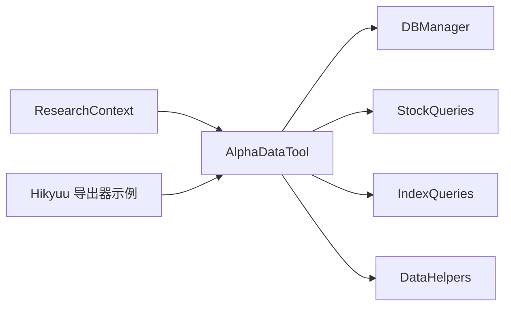

# 数据访问模块（Providers）

<cite>
**本文引用的文件**
- [alphahome/providers/__init__.py](file://alphahome/providers/__init__.py)
- [alphahome/providers/data_access.py](file://alphahome/providers/data_access.py)
- [alphahome/providers/_stock_queries.py](file://alphahome/providers/_stock_queries.py)
- [alphahome/providers/_index_queries.py](file://alphahome/providers/_index_queries.py)
- [alphahome/providers/_helpers.py](file://alphahome/providers/_helpers.py)
- [alphahome/providers/README.md](file://alphahome/providers/README.md)
- [alphahome/providers/examples/usage_example.py](file://alphahome/providers/examples/usage_example.py)
- [alphahome/providers/examples/hikyuu_exporter_example.py](file://alphahome/providers/examples/hikyuu_exporter_example.py)
- [research/tools/context.py](file://research/tools/context.py)
</cite>

## 目录
1. [简介](#简介)
2. [项目结构](#项目结构)
3. [核心组件](#核心组件)
4. [架构总览](#架构总览)
5. [详细组件分析](#详细组件分析)
6. [依赖关系分析](#依赖关系分析)
7. [性能考量](#性能考量)
8. [故障排查指南](#故障排查指南)
9. [结论](#结论)
10. [附录](#附录)

## 简介
本文件系统化文档化 AlphaHome 的 Providers 模块，面向外部系统（尤其是 Hikyuu 回测框架）提供统一、高效的数据查询接口。重点围绕 AlphaDataTool 主类的设计理念与核心能力，剖析内部模块化设计（_stock_queries.py、_index_queries.py），说明其智能特性（自动表名检测、数据类型转换、错误处理、缓存机制），并给出与 ResearchContext 集成的完整示例，强调向后兼容性。最后依据 README 中的扩展策略，列出候选扩展功能及触发条件。

## 项目结构
Providers 模块采用“对外统一入口 + 内部模块化”的设计，对外仅暴露 AlphaDataTool 与少量工具函数，内部按领域拆分为股票、指数、辅助工具三类查询模块，便于维护与扩展。

图表来源
- [alphahome/providers/data_access.py](file://alphahome/providers/data_access.py#L52-L629)
- [alphahome/providers/_stock_queries.py](file://alphahome/providers/_stock_queries.py#L1-L323)
- [alphahome/providers/_index_queries.py](file://alphahome/providers/_index_queries.py#L1-L380)
- [alphahome/providers/_helpers.py](file://alphahome/providers/_helpers.py#L1-L449)
- [alphahome/providers/__init__.py](file://alphahome/providers/__init__.py#L1-L22)
- [research/tools/context.py](file://research/tools/context.py#L338-L407)
- [alphahome/providers/examples/hikyuu_exporter_example.py](file://alphahome/providers/examples/hikyuu_exporter_example.py#L1-L53)

章节来源
- [alphahome/providers/README.md](file://alphahome/providers/README.md#L183-L209)
- [alphahome/providers/__init__.py](file://alphahome/providers/__init__.py#L1-L22)

## 核心组件
- AlphaDataTool：统一数据访问工具，提供 5 个核心方法（股票行情、指数权重、股票信息、交易日历、行业分类）与 2 个灵活接口（自定义查询、原始数据库管理器）。具备智能表名检测、数据类型转换、错误处理与连接状态检查等能力。
- StockQueries：内部模块化实现，封装股票行情、基本信息与复权处理的查询逻辑，支持表名检测、参数化查询与数据清洗。
- IndexQueries：内部模块化实现，封装指数权重、成分股与基本信息的查询逻辑，支持表名检测、月末过滤与数据清洗。
- DataHelpers：内部模块化实现，封装交易日历、行业分类与常用过滤器，支持表名检测、缓存与格式标准化。
- ResearchContext：统一入口，自动装配 db_manager 与 data_tool，提供便捷方法与向后兼容能力。

章节来源
- [alphahome/providers/data_access.py](file://alphahome/providers/data_access.py#L52-L629)
- [alphahome/providers/_stock_queries.py](file://alphahome/providers/_stock_queries.py#L1-L323)
- [alphahome/providers/_index_queries.py](file://alphahome/providers/_index_queries.py#L1-L380)
- [alphahome/providers/_helpers.py](file://alphahome/providers/_helpers.py#L1-L449)
- [research/tools/context.py](file://research/tools/context.py#L338-L407)

## 架构总览
AlphaDataTool 作为对外统一入口，内部通过私有方法与缓存表名检测，结合 StockQueries/IndexQueries/DataHelpers 的模块化职责，形成清晰的分层与职责分离。ResearchContext 作为上层集成入口，自动创建 AlphaDataTool 并提供便捷方法。

图表来源
- [alphahome/providers/data_access.py](file://alphahome/providers/data_access.py#L52-L629)
- [alphahome/providers/_stock_queries.py](file://alphahome/providers/_stock_queries.py#L1-L323)
- [alphahome/providers/_index_queries.py](file://alphahome/providers/_index_queries.py#L1-L380)
- [alphahome/providers/_helpers.py](file://alphahome/providers/_helpers.py#L1-L449)

## 详细组件分析

### AlphaDataTool 主类
- 设计理念与目标：遵循 80/20 原则，核心方法覆盖 80% 需求；灵活接口满足 20% 特殊需求；单一职责、统一同步 API、内联查询逻辑、最小化验证与错误处理。
- 核心方法
  - get_stock_data：获取股票行情数据，自动表名检测、参数化查询、数据类型转换、空结果告警。
  - get_index_weights：获取指数权重数据，支持月末过滤、参数化查询、数据类型转换。
  - get_stock_info：获取股票基本信息，支持上市状态筛选与日期列转换。
  - get_trade_dates：获取交易日历，支持交易所过滤与数值转换。
  - get_industry_data：获取行业分类数据，支持上市状态筛选。
- 灵活接口
  - custom_query：自定义 SQL 查询，支持字典或 DataFrame 返回。
  - get_raw_db_manager：返回底层 DBManager 实例，用于高级操作。
- 智能特性
  - 自动表名检测：通过缓存与候选表名探测，减少硬编码依赖。
  - 数据类型转换：统一将日期列转为 datetime，数值列转为数值型。
  - 错误处理：捕获异常并抛出统一的 DataAccessError/ValidationError/CacheError。
  - 连接状态检查：is_connected 属性用于快速判断连接有效性。
- Hikyuu 集成支持
  - standardize_to_hikyuu_ohlcv：将 OHLCV 列标准化为 Hikyuu 期望的列顺序与类型。
- 向后兼容性
  - 保留对原始 db_manager 的完全访问权限，现有方法继续可用，不破坏任何现有代码。

章节来源
- [alphahome/providers/data_access.py](file://alphahome/providers/data_access.py#L52-L629)
- [alphahome/providers/README.md](file://alphahome/providers/README.md#L238-L261)

### StockQueries 内部模块
- 职责：股票行情、股票基本信息、复权处理与代码标准化。
- 智能特性
  - 表名检测：优先使用带 schema 的表名，若不可用则降级为默认表名。
  - 参数化查询：防止 SQL 注入，支持同步/异步模式。
  - 数据清洗：统一日期与数值类型转换。
- 方法概览
  - get_stock_data：按 ts_code 与日期范围查询日线行情。
  - get_stock_info：按上市状态与可选 ts_code 列表查询基本信息。

章节来源
- [alphahome/providers/_stock_queries.py](file://alphahome/providers/_stock_queries.py#L1-L323)

### IndexQueries 内部模块
- 职责：指数权重、成分股、基本信息与历史变更查询。
- 智能特性
  - 表名检测：优先使用带 schema 的表名，若不可用则降级为默认表名。
  - 月末过滤：通过窗口函数提取月末最后一日的权重。
  - 参数化查询：支持同步/异步模式。
  - 数据清洗：统一日期与数值类型转换。
- 方法概览
  - get_index_weights：按指数代码与日期范围查询权重，支持 monthly 过滤。
  - get_index_constituents：查询最新或指定日期的成分股。
  - get_index_info：查询指数基本信息。

章节来源
- [alphahome/providers/_index_queries.py](file://alphahome/providers/_index_queries.py#L1-L380)

### DataHelpers 辅助模块
- 职责：交易日历、行业分类、常用过滤器与格式转换。
- 智能特性
  - 表名检测：多候选表名探测，支持 schema 前缀。
  - 缓存机制：缓存常用静态数据，限制缓存大小。
  - 格式标准化：统一日期与数值类型转换。
- 方法概览
  - get_trade_dates：按日期范围与交易所查询交易日历。
  - get_industry_data：从 stock_basic 表获取行业信息并标准化。
  - get_latest_trade_date / is_trading_day：辅助判断与查询。

章节来源
- [alphahome/providers/_helpers.py](file://alphahome/providers/_helpers.py#L1-L449)

### 与 ResearchContext 集成示例
- ResearchContext 自动创建 AlphaDataTool 实例，并提供便捷方法（如 get_stock_data、get_index_weights、get_industry_data、get_trading_dates）。
- 示例脚本展示了如何在 with 语句中使用 ResearchContext 访问 data_tool，并演示 80/20 覆盖场景与灵活接口使用。

图表来源
- [research/tools/context.py](file://research/tools/context.py#L338-L407)
- [alphahome/providers/data_access.py](file://alphahome/providers/data_access.py#L93-L163)

章节来源
- [research/tools/context.py](file://research/tools/context.py#L338-L407)
- [alphahome/providers/examples/usage_example.py](file://alphahome/providers/examples/usage_example.py#L1-L319)

### Hikyuu 导出集成要点
- 使用 AlphaDataTool.standardize_to_hikyuu_ohlcv 对 OHLCV 数据进行列标准化。
- 通过 ResearchContext 获取数据工具，再导出 CSV 文件至 Hikyuu 数据目录。
- 提供示例脚本，展示如何从数据库读取日线数据并按股票拆分导出。

章节来源
- [alphahome/providers/examples/hikyuu_exporter_example.py](file://alphahome/providers/examples/hikyuu_exporter_example.py#L1-L53)
- [alphahome/providers/data_access.py](file://alphahome/providers/data_access.py#L531-L553)

## 依赖关系分析
- AlphaDataTool 依赖 DBManager（通过 fetch_sync/query_dataframe 等接口）执行查询。
- 内部模块（StockQueries/IndexQueries/DataHelpers）均依赖 DBManager，实现各自领域的查询逻辑。
- ResearchContext 依赖 AlphaDataTool，提供统一入口与便捷方法。
- 导出器示例依赖 AlphaDataTool 与映射函数 map_ts_code_to_hikyuu。

图表来源
- [research/tools/context.py](file://research/tools/context.py#L338-L407)
- [alphahome/providers/data_access.py](file://alphahome/providers/data_access.py#L52-L629)
- [alphahome/providers/_stock_queries.py](file://alphahome/providers/_stock_queries.py#L1-L323)
- [alphahome/providers/_index_queries.py](file://alphahome/providers/_index_queries.py#L1-L380)
- [alphahome/providers/_helpers.py](file://alphahome/providers/_helpers.py#L1-L449)
- [alphahome/providers/examples/hikyuu_exporter_example.py](file://alphahome/providers/examples/hikyuu_exporter_example.py#L1-L53)

## 性能考量
- 查询优化
  - 使用参数化查询，避免拼接与 SQL 注入风险，同时利于数据库计划缓存。
  - 通过表名缓存减少重复探测开销。
- 数据处理
  - 在内存中进行类型转换与列重排，尽量减少不必要的列与行。
- 缓存策略
  - DataHelpers 对交易日历与行业数据进行有限缓存，降低重复查询成本。
- I/O 与并发
  - 当前为同步 API，适合研究与批处理场景；如需异步，可通过 DBManager 的异步接口扩展。

[本节为通用指导，不直接分析具体文件]

## 故障排查指南
- 连接与表名
  - 使用 is_connected 快速判断连接状态。
  - 若查询不到数据，检查表名检测逻辑与候选表名是否匹配实际数据库结构。
- 数据类型
  - 确认日期列与数值列是否正确转换；必要时在上游或下游补充转换逻辑。
- 错误处理
  - 捕获 DataAccessError/ValidationError/CacheError 并记录详细日志。
- 缓存问题
  - 清理 DataHelpers 的缓存键或等待缓存过期，避免脏数据影响。
- 导出问题
  - 确认 HIKYUU_DATA_DIR 配置正确，导出 CSV 的列顺序与命名符合 Hikyuu 要求。

章节来源
- [alphahome/providers/data_access.py](file://alphahome/providers/data_access.py#L583-L595)
- [alphahome/providers/_helpers.py](file://alphahome/providers/_helpers.py#L1-L449)

## 结论
Providers 模块以 AlphaDataTool 为核心，通过内部模块化设计实现了高内聚、低耦合的数据访问层。其智能特性（表名检测、类型转换、错误处理、缓存）与简洁 API（5 核心方法 + 2 灵活接口）有效覆盖了研究场景的 80% 需求，并通过 ResearchContext 与 Hikyuu 导出器实现无缝集成。向后兼容性保障现有代码不受影响，扩展策略明确了候选功能与触发条件，确保模块持续演进的可控性与稳定性。

[本节为总结性内容，不直接分析具体文件]

## 附录

### 与 ResearchContext 集成的完整流程
- 初始化 ResearchContext，自动创建 db_manager 与 data_tool。
- 使用 data_tool 的 5 个核心方法完成日常数据查询。
- 如需高级操作，使用 get_raw_db_manager 获取底层 DBManager。
- 通过便捷方法（如 get_stock_data、get_index_weights、get_industry_data、get_trading_dates）快速完成常见任务。

章节来源
- [research/tools/context.py](file://research/tools/context.py#L338-L407)
- [alphahome/providers/examples/usage_example.py](file://alphahome/providers/examples/usage_example.py#L1-L319)

### 扩展策略与候选功能
- 触发条件
  - 使用频率 ≥ 30%
  - 代码重复 ≥ 5 次
  - 用户请求 ≥ 3 个
  - 覆盖 ≥ 2 个研究场景
- 边界控制
  - 核心方法最多 5 个
  - 扩展方法最多 3 个
  - 高级方法最多 2 个
- 候选扩展功能
  - get_futures_data（期货数据，使用率 40%）
  - get_financial_data（财务数据，使用率 35%）
  - get_macro_data（宏观数据，使用率 25%）

章节来源
- [alphahome/providers/README.md](file://alphahome/providers/README.md#L210-L227)