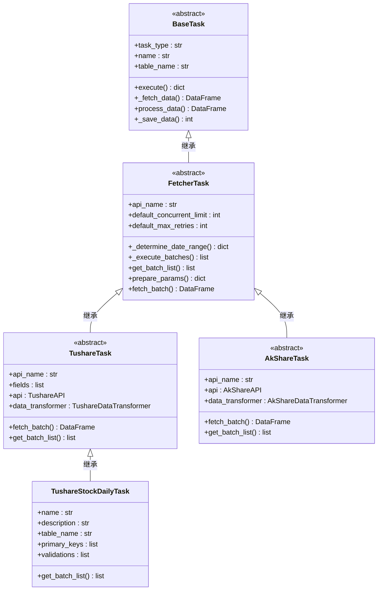
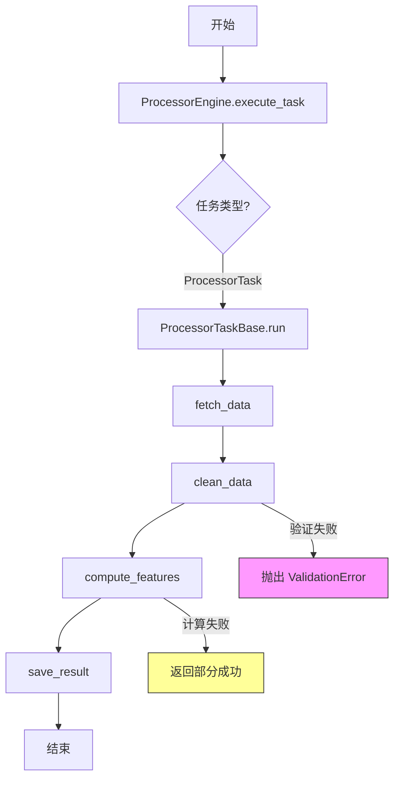
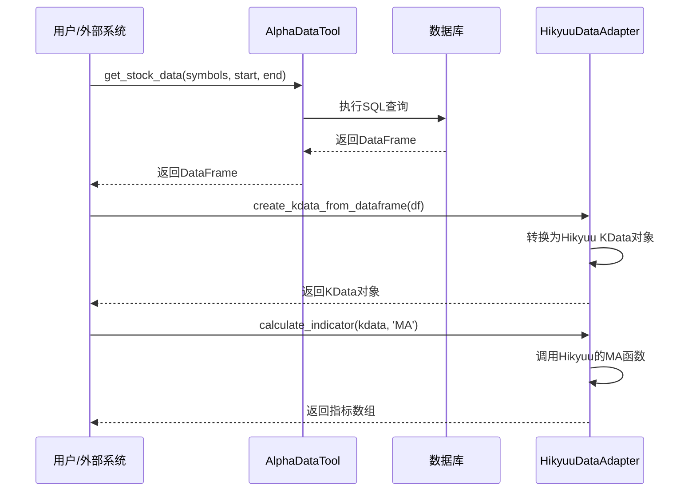

# 核心模块

<cite>
**本文档引用的文件**   
- [fetcher_task.py](file://alphahome\fetchers\base\fetcher_task.py)
- [tushare_task.py](file://alphahome\fetchers\sources\tushare\tushare_task.py)
- [akshare_task.py](file://alphahome\fetchers\sources\akshare\akshare_task.py)
- [tushare_stock_daily.py](file://alphahome\fetchers\tasks\stock\tushare_stock_daily.py)
- [processor_engine.py](file://alphahome\processors\engine\processor_engine.py)
- [base_task.py](file://alphahome\processors\tasks\base_task.py)
- [market_technical.py](file://alphahome\processors\tasks\market\market_technical.py)
- [data_access.py](file://alphahome\providers\data_access.py)
- [hikyuu_data_adapter.py](file://alphahome\providers\tools\hikyuu_data_adapter.py)
</cite>

## 目录
1. [数据获取模块 (Fetchers)](#数据获取模块-fetchers)
2. [数据处理模块 (Processors)](#数据处理模块-processors)
3. [数据访问模块 (Providers)](#数据访问模块-providers)

## 数据获取模块 (Fetchers)

AlphaHome的`fetchers`模块负责从外部数据源获取原始数据，其核心设计是基于一个统一的异步任务框架。该模块通过`sources/`目录下的适配器（如tushare, akshare）与外部API进行交互，并通过`tasks/`目录中的具体任务实现来定义数据获取的逻辑。

### 核心架构与职责

`fetchers`模块的核心是一个名为`FetcherTask`的抽象基类（位于`fetchers/base/fetcher_task.py`）。它继承自`common.task_system`中的`BaseTask`，并为所有数据获取任务提供了通用的执行流程和配置。其主要职责包括：
*   **统一执行流程**：封装了从确定日期范围、生成批处理列表、并发获取数据到聚合结果的完整流程。
*   **更新策略管理**：支持多种更新类型（`manual`, `smart`, `full`），其中`smart`模式能智能地根据数据库中的最新日期增量更新数据。
*   **并发与重试**：内置了并发控制（`concurrent_limit`）和失败重试机制（`max_retries`, `retry_delay`），以提高数据获取的效率和鲁棒性。
*   **数据聚合**：将所有批次获取的原始数据合并成一个`pandas.DataFrame`。

`FetcherTask`本身不直接与API交互，而是定义了三个抽象方法，强制其子类必须实现：
*   `get_batch_list`：根据日期范围等参数，生成一个批次列表。每个批次代表一次API调用的参数。
*   `prepare_params`：为给定的批次准备最终的API请求参数。
*   `fetch_batch`：执行单个批次的数据获取，调用具体的API并返回原始数据。

**Section sources**
- [fetcher_task.py](file://alphahome\fetchers\base\fetcher_task.py#L1-L315)

### 适配器实现 (Sources)

为了支持不同的数据源，`fetchers/sources/`目录下提供了多个适配器，每个适配器都封装了特定API的调用细节。

#### Tushare 适配器
`sources/tushare/`目录下的`TushareTask`类（位于`tushare_task.py`）是所有Tushare相关任务的基类。它实现了`fetch_batch`方法，通过`TushareAPI`客户端调用Tushare的API，并利用`TushareDataTransformer`进行数据转换。`TushareTask`还定义了`api_name`和`fields`等属性，这些属性由具体任务（如`TushareStockDailyTask`）来指定，从而实现了对不同Tushare接口的统一调用。

#### AkShare 适配器
`sources/akshare/`目录下的`AkShareTask`类（位于`akshare_task.py`）是所有AkShare相关任务的基类。它的设计与`TushareTask`类似，但处理了AkShare特有的数据特点，例如中文表头和宽表格式。它通过`AkShareDataTransformer`来处理这些差异，确保输出的数据格式统一。

**Section sources**
- [tushare_task.py](file://alphahome\fetchers\sources\tushare\tushare_task.py#L1-L184)
- [akshare_task.py](file://alphahome\fetchers\sources\akshare\akshare_task.py#L1-L289)

### 具体任务实现 (Tasks)

`fetchers/tasks/`目录包含了具体的数据获取任务，这些任务通过`@task_register()`装饰器注册到系统中，使其可以被任务引擎发现和执行。

以`tasks/stock/tushare_stock_daily.py`中的`TushareStockDailyTask`为例，它继承自`TushareTask`，并定义了获取股票日线数据所需的所有具体信息：
*   **元数据**：`name`, `description`, `table_name`等。
*   **数据源配置**：`api_name = "daily"`指定了Tushare的接口。
*   **字段映射**：`fields`列表定义了需要获取的字段，`column_mapping`将API返回的`vol`字段映射为更通用的`volume`。
*   **数据验证**：`validations`列表定义了数据质量检查规则，例如确保收盘价为正数、成交量不为负等。
*   **批处理逻辑**：`get_batch_list`方法实现了根据日期范围生成批处理参数的逻辑，支持按交易日分批，以优化API调用。

**Diagram sources **
- [fetcher_task.py](file://alphahome\fetchers\base\fetcher_task.py#L1-L315)
- [tushare_task.py](file://alphahome\fetchers\sources\tushare\tushare_task.py#L1-L184)
- [akshare_task.py](file://alphahome\fetchers\sources\akshare\akshare_task.py#L1-L289)
- [tushare_stock_daily.py](file://alphahome\fetchers\tasks\stock\tushare_stock_daily.py#L1-L178)

## 数据处理模块 (Processors)

AlphaHome的`processors`模块负责对`fetchers`模块获取的原始数据进行清洗、转换和计算，生成可供分析使用的特征数据。该模块采用分层架构设计，核心是`ProcessorEngine`，它负责协调和执行具体的处理任务。

### 数据分层架构

`processors`模块的核心是其数据分层架构，主要分为两个层次：
*   **Clean Layer (清洗层)**：位于`processors/clean/`目录，负责对原始数据进行标准化处理。其主要工作包括：
    *   **数据校验 (Validation)**：使用`DataValidator`检查数据的完整性、类型和范围。
    *   **数据对齐 (Alignment)**：使用`DataAligner`将不同来源的数据统一到相同的日期和标的格式。
    *   **数据标准化 (Standardization)**：使用`DataStandardizer`将数据单位（如货币、成交量）转换为统一标准。
    *   **血缘追踪 (Lineage)**：使用`LineageTracker`记录数据的来源和处理过程。
*   **Feature Layer (特征层)**：位于`processors/tasks/`目录，负责计算复杂的业务特征。这些任务通常基于`ProcessorTaskBase`构建，通过编排`Operation`操作来实现。

### 处理引擎 (Processor Engine)

`processors/engine/processor_engine.py`中的`ProcessorEngine`是整个处理模块的调度中心。它负责：
*   **任务调度**：接收任务执行请求，管理任务的生命周期。
*   **并发控制**：通过`asyncio.Semaphore`限制并发任务的数量，防止资源耗尽。
*   **执行监控**：跟踪每个任务的执行状态、耗时和结果，并提供统计信息。
*   **依赖管理**：虽然当前依赖检查功能尚未完全实现，但引擎已预留了接口，未来可支持任务间的依赖关系。

### 处理任务 (Processor Tasks)

`processors/tasks/`目录下的任务继承自`ProcessorTaskBase`（位于`base_task.py`），并遵循`fetch → clean → feature → save`的处理流程。

以`tasks/market/market_technical.py`中的`MarketTechnicalTask`为例，它展示了如何实现一个复杂的特征计算任务：
*   **数据获取 (`fetch_data`)**：通过一个复杂的SQL查询，从`tushare_stock_factor_pro`表中一次性获取计算所需的所有原始数据，并在数据库层面计算了动量、波动率等基础指标。
*   **数据处理 (`process_data`)**：在Python层面，对SQL查询结果进行进一步处理，计算衍生特征，如滚动Z-Score和历史分位数。
*   **结果保存 (`save_result`)**：将处理后的特征数据保存到`processor_market_technical`表中。

**Diagram sources **
- [processor_engine.py](file://alphahome\processors\engine\processor_engine.py#L1-L597)
- [base_task.py](file://alphahome\processors\tasks\base_task.py#L1-L686)
- [market_technical.py](file://alphahome\processors\tasks\market\market_technical.py#L1-L384)

**Section sources**
- [processor_engine.py](file://alphahome\processors\engine\processor_engine.py#L1-L597)
- [base_task.py](file://alphahome\processors\tasks\base_task.py#L1-L686)
- [market_technical.py](file://alphahome\processors\tasks\market\market_technical.py#L1-L384)

## 数据访问模块 (Providers)

AlphaHome的`providers`模块负责为外部系统（如Hikyuu）提供统一的数据查询服务。其核心是`data_access.py`中的`AlphaDataTool`类，它提供了一个简洁、同步的API接口。

### 核心功能与设计

`AlphaDataTool`的设计遵循“简单优于复杂”的原则，旨在降低使用复杂度。其主要特点包括：
*   **单一入口**：所有数据查询都通过`AlphaDataTool`这个单一类完成。
*   **同步API**：只提供同步方法，简化了调用逻辑，避免了异步编程的复杂性。
*   **智能容错**：能够自动检测和处理表名变化，提高了系统的健壮性。
*   **核心方法**：提供了`get_stock_data`, `get_index_weights`, `get_stock_info`, `get_trade_dates`等覆盖80%需求的核心方法。

### 与Hikyuu的集成

`providers/tools/`目录下的`hikyuu_data_adapter.py`是专门为Hikyuu设计的适配器。它实现了`HikyuuDataAdapter`类，能够将`AlphaDataTool`获取的`pandas.DataFrame`数据实时转换为Hikyuu所需的内存对象（如`KData`），从而实现无缝集成。该适配器还支持在Hikyuu环境中直接计算技术指标和生成交易信号。

**Diagram sources **
- [data_access.py](file://alphahome\providers\data_access.py#L1-L629)
- [hikyuu_data_adapter.py](file://alphahome\providers\tools\hikyuu_data_adapter.py#L1-L653)

**Section sources**
- [data_access.py](file://alphahome\providers\data_access.py#L1-L629)
- [hikyuu_data_adapter.py](file://alphahome\providers\tools\hikyuu_data_adapter.py#L1-L653)