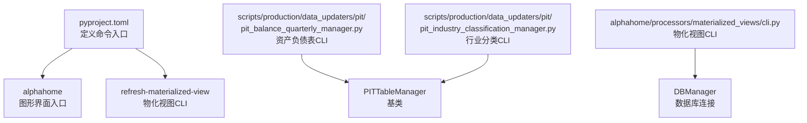
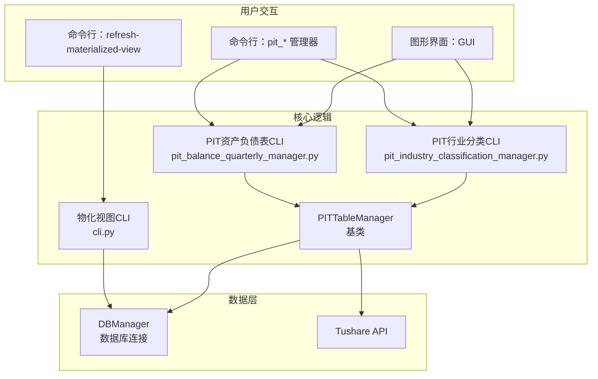
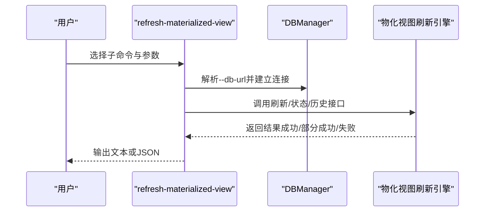
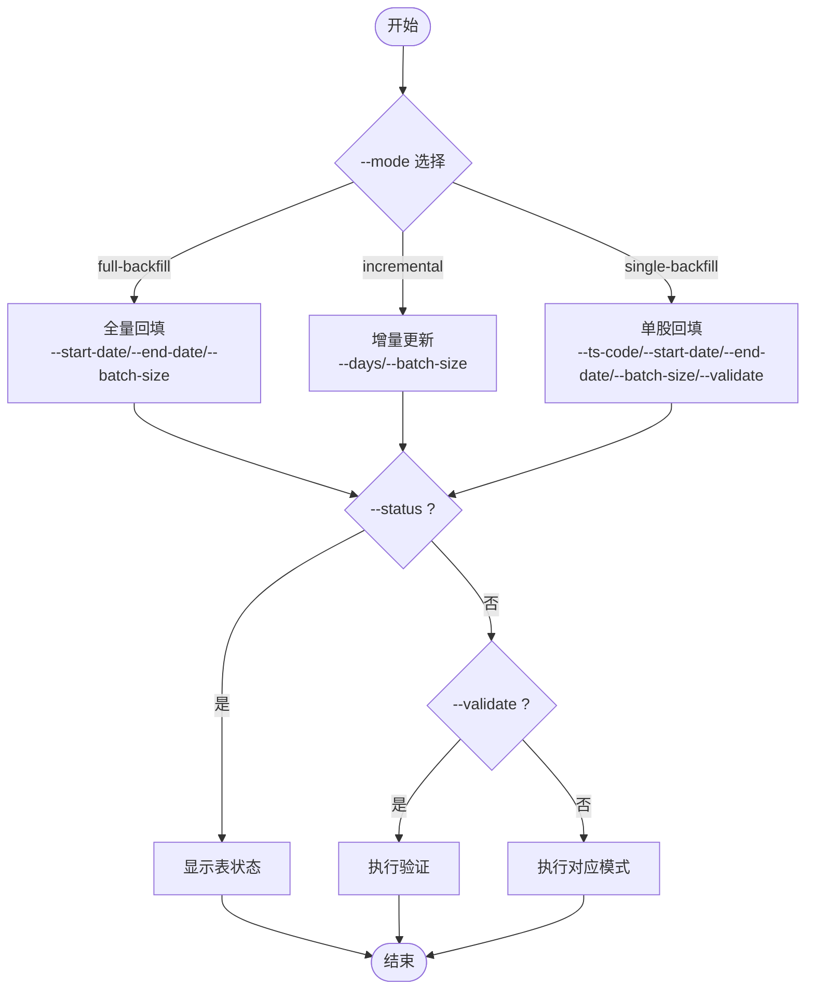
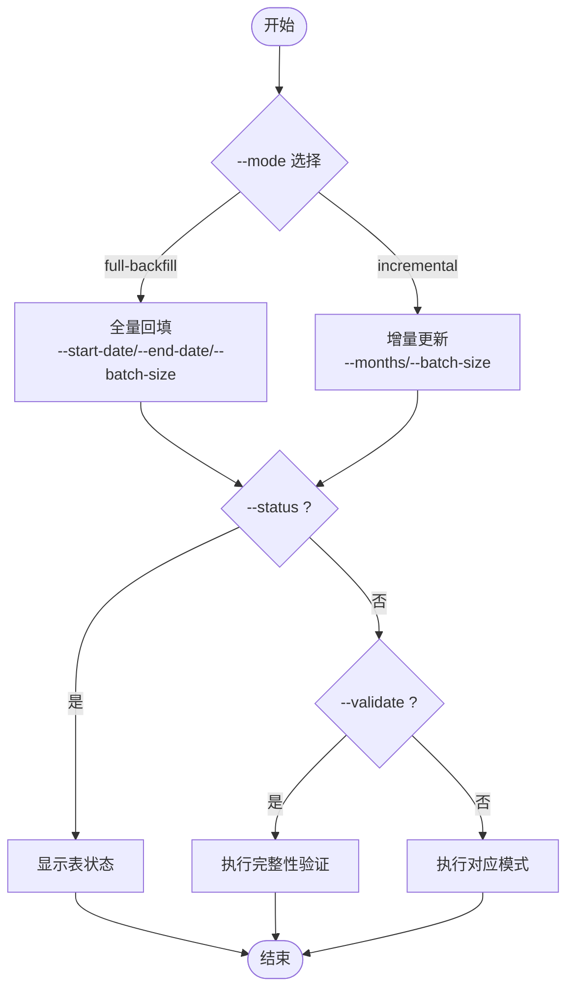
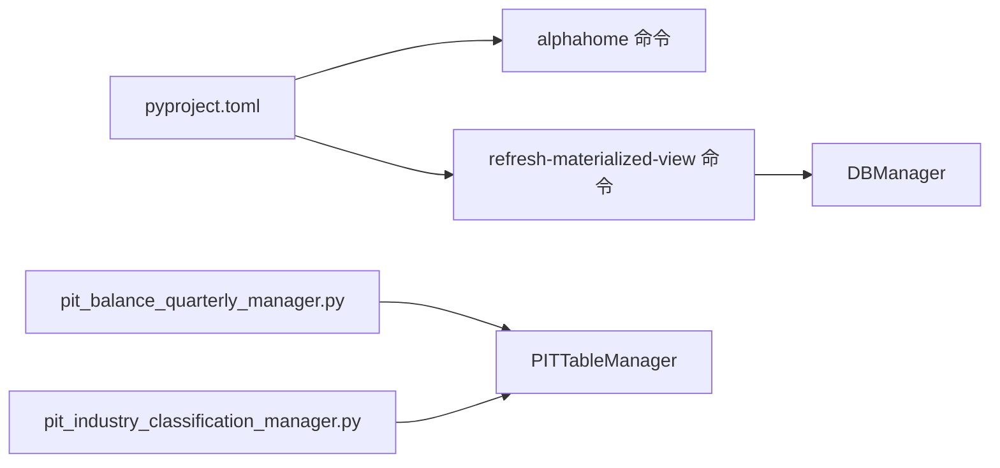

# 命令行工具（CLI）

<cite>
**本文引用的文件**
- [pyproject.toml](file://pyproject.toml)
- [pit_balance_quarterly_manager.py](file://scripts/production/data_updaters/pit/pit_balance_quarterly_manager.py)
- [pit_industry_classification_manager.py](file://scripts/production/data_updaters/pit/pit_industry_classification_manager.py)
- [cli.py](file://alphahome/processors/materialized_views/cli.py)
- [pit_table_manager.py](file://scripts/production/data_updaters/pit/base/pit_table_manager.py)
</cite>

## 目录
1. [简介](#简介)
2. [项目结构](#项目结构)
3. [核心组件](#核心组件)
4. [架构总览](#架构总览)
5. [详细组件分析](#详细组件分析)
6. [依赖分析](#依赖分析)
7. [性能考虑](#性能考虑)
8. [故障排查指南](#故障排查指南)
9. [结论](#结论)
10. [附录](#附录)

## 简介
本指南面向使用命令行工具（CLI）的用户，系统讲解如何通过命令行执行以下两类数据更新任务：
- alphahome（图形界面入口）
- refresh-materialized-view（物化视图刷新）

重点解析两个命令的参数与行为：
- alphahome：图形界面入口（非本文重点，但与CLI工具共享同一套核心逻辑）
- refresh-materialized-view：物化视图管理CLI，支持刷新单个或全部视图、查看状态与历史

同时，深入分析并对比两个PIT数据管理器的CLI参数与使用场景：
- pit_balance_quarterly_manager.py：资产负债表（PIT）数据的全量回填、增量更新、单股回填与状态/验证
- pit_industry_classification_manager.py：行业分类（PIT）数据的全量回填、增量更新与状态/验证

本指南还解释CLI工具与GUI后台服务在底层逻辑上的一致性，帮助用户理解两种交互方式操作的是同一套核心逻辑。

## 项目结构
- CLI入口由项目元数据定义，其中包含两个命令：
  - alphahome：启动图形界面
  - refresh-materialized-view：物化视图管理CLI
- PIT数据管理器位于 scripts/production/data_updaters/pit 下，分别提供资产负债表与行业分类的CLI入口
- 物化视图CLI位于 alphahome/processors/materialized_views/cli.py

图表来源
- [pyproject.toml](file://pyproject.toml#L44-L46)
- [pit_balance_quarterly_manager.py](file://scripts/production/data_updaters/pit/pit_balance_quarterly_manager.py#L1070-L1147)
- [pit_industry_classification_manager.py](file://scripts/production/data_updaters/pit/pit_industry_classification_manager.py#L499-L526)
- [cli.py](file://alphahome/processors/materialized_views/cli.py#L450-L649)
- [pit_table_manager.py](file://scripts/production/data_updaters/pit/base/pit_table_manager.py#L1-L50)

章节来源
- [pyproject.toml](file://pyproject.toml#L44-L46)

## 核心组件
- alphahome（图形界面入口）
  - 通过命令入口启动GUI，GUI内部调用后台服务执行数据更新与物化视图刷新等任务。CLI与GUI共享同一套核心逻辑与数据流。
- refresh-materialized-view（物化视图CLI）
  - 子命令：refresh、refresh-all、status、status-all、history
  - 参数：--db-url、--log-level、--strategy、--format、--limit
  - 输出：文本或JSON格式
- pit_balance_quarterly_manager.py（资产负债表CLI）
  - 子命令：--mode（full-backfill、incremental、single-backfill）
  - 参数：--start-date、--end-date、--days、--batch-size、--ts-code、--status、--validate
- pit_industry_classification_manager.py（行业分类CLI）
  - 子命令：--mode（full-backfill、incremental）
  - 参数：--start-date、--end-date、--months、--batch-size、--status、--validate

章节来源
- [pyproject.toml](file://pyproject.toml#L44-L46)
- [pit_balance_quarterly_manager.py](file://scripts/production/data_updaters/pit/pit_balance_quarterly_manager.py#L1070-L1147)
- [pit_industry_classification_manager.py](file://scripts/production/data_updaters/pit/pit_industry_classification_manager.py#L499-L526)
- [cli.py](file://alphahome/processors/materialized_views/cli.py#L450-L649)

## 架构总览
CLI与GUI在底层共享相同的数据处理与存储逻辑：
- GUI通过控制器/服务层调用后台任务执行器，最终调用与CLI相同的管理器类
- CLI直接调用管理器类，二者在数据源、数据转换、批量写入、验证与状态查询等方面保持一致

图表来源
- [cli.py](file://alphahome/processors/materialized_views/cli.py#L450-L649)
- [pit_balance_quarterly_manager.py](file://scripts/production/data_updaters/pit/pit_balance_quarterly_manager.py#L1070-L1147)
- [pit_industry_classification_manager.py](file://scripts/production/data_updaters/pit/pit_industry_classification_manager.py#L499-L526)
- [pit_table_manager.py](file://scripts/production/data_updaters/pit/base/pit_table_manager.py#L1-L50)

## 详细组件分析

### alphahome（图形界面入口）
- 作用：通过命令入口启动GUI，GUI内部通过服务层调度后台任务，实现与CLI一致的核心逻辑
- 与CLI的关系：GUI与CLI共享同一套数据处理流程与数据库访问，二者在功能与数据一致性上保持一致

章节来源
- [pyproject.toml](file://pyproject.toml#L44-L46)

### refresh-materialized-view（物化视图CLI）
- 子命令
  - refresh：刷新单个物化视图
  - refresh-all：刷新全部物化视图
  - status：查询单个视图状态
  - status-all：查询全部视图状态
  - history：查询单个视图刷新历史
- 关键参数
  - --db-url：数据库连接URL（默认从环境变量或配置文件读取）
  - --log-level：日志级别（DEBUG/INFO/WARNING/ERROR）
  - refresh/refresh-all：--strategy（full/concurrent）、--format（text/json）
  - history：--limit（默认10）
- 输出
  - text/json格式输出，便于自动化集成

图表来源
- [cli.py](file://alphahome/processors/materialized_views/cli.py#L450-L649)

章节来源
- [cli.py](file://alphahome/processors/materialized_views/cli.py#L450-L649)

### pit_balance_quarterly_manager.py（资产负债表CLI）
- --mode（必选）
  - full-backfill：全量回填（历史区间）
  - incremental：增量更新（最近N天）
  - single-backfill：单股票历史回填
- --start-date/--end-date：日期范围（YYYY-MM-DD）
- --days：增量更新天数
- --batch-size：批量大小
- --ts-code：单股回填时的股票代码
- --status：显示表状态
- --validate：执行数据完整性验证或单股回填后的轻量验证

图表来源
- [pit_balance_quarterly_manager.py](file://scripts/production/data_updaters/pit/pit_balance_quarterly_manager.py#L1070-L1147)

章节来源
- [pit_balance_quarterly_manager.py](file://scripts/production/data_updaters/pit/pit_balance_quarterly_manager.py#L1070-L1147)

### pit_industry_classification_manager.py（行业分类CLI）
- --mode（必选）
  - full-backfill：生成历史月度快照（按月回填）
  - incremental：检测行业变更并更新受影响月份的快照
- --start-date/--end-date：日期范围（YYYY-MM-DD）
- --months：增量更新检查月数
- --batch-size：批次大小（月份数）
- --status：显示表状态
- --validate：验证数据完整性

图表来源
- [pit_industry_classification_manager.py](file://scripts/production/data_updaters/pit/pit_industry_classification_manager.py#L499-L526)

章节来源
- [pit_industry_classification_manager.py](file://scripts/production/data_updaters/pit/pit_industry_classification_manager.py#L499-L526)

## 依赖分析
- alphahome命令入口
  - 通过 [pyproject.toml](file://pyproject.toml#L44-L46) 定义 alphahome 与 refresh-materialized-view 的命令入口
- PIT管理器依赖
  - pit_balance_quarterly_manager.py 与 pit_industry_classification_manager.py 均继承自 PITTableManager（基类）
  - 基类负责表名校验、表配置加载、批量大小、上下文与日志初始化等通用能力
- 物化视图CLI依赖
  - 通过 DBManager 进行数据库连接与事务管理
  - 支持异步执行与日志级别配置

图表来源
- [pyproject.toml](file://pyproject.toml#L44-L46)
- [pit_balance_quarterly_manager.py](file://scripts/production/data_updaters/pit/pit_balance_quarterly_manager.py#L1070-L1147)
- [pit_industry_classification_manager.py](file://scripts/production/data_updaters/pit/pit_industry_classification_manager.py#L499-L526)
- [cli.py](file://alphahome/processors/materialized_views/cli.py#L450-L649)
- [pit_table_manager.py](file://scripts/production/data_updaters/pit/base/pit_table_manager.py#L1-L50)

章节来源
- [pyproject.toml](file://pyproject.toml#L44-L46)
- [pit_table_manager.py](file://scripts/production/data_updaters/pit/base/pit_table_manager.py#L1-L50)

## 性能考虑
- 批量大小（--batch-size/--batch-size）：合理设置可提升吞吐，避免单次写入过大导致锁争用或内存压力
- 增量更新（--days/--months）：仅处理近期数据，减少I/O与计算开销
- 并发策略（物化视图CLI --strategy）：在满足数据一致性的前提下，可选择并发策略以缩短刷新时间
- 日志级别（--log-level）：生产环境建议使用INFO或WARNING，避免过多DEBUG日志影响性能

## 故障排查指南
- 数据库连接
  - 物化视图CLI可通过 --db-url 指定连接串；若未指定，将尝试从环境变量或配置文件读取
- 参数冲突
  - pit_balance_quarterly_manager.py 中 --mode 为必选项，且 single-backfill 需要 --ts-code
  - pit_industry_classification_manager.py 中 --mode 为必选项
- 输出格式
  - 物化视图CLI支持 --format=text/json，便于自动化脚本解析
- 日志
  - CLI均支持 --log-level 控制日志级别，便于定位问题

章节来源
- [cli.py](file://alphahome/processors/materialized_views/cli.py#L450-L649)
- [pit_balance_quarterly_manager.py](file://scripts/production/data_updaters/pit/pit_balance_quarterly_manager.py#L1070-L1147)
- [pit_industry_classification_manager.py](file://scripts/production/data_updaters/pit/pit_industry_classification_manager.py#L499-L526)

## 结论
- alphahome 与 refresh-materialized-view 以及 PIT 数据管理器的CLI共同构成完整的数据更新与维护体系
- CLI与GUI在底层逻辑上保持一致，用户可根据场景选择命令行或图形界面进行操作
- 正确理解各参数的含义与使用场景，有助于高效、稳定地完成全量回填、增量更新、状态查询与数据验证

## 附录

### 实用示例（不含具体代码片段）
- 刷新单个物化视图（物化视图CLI）
  - 使用 refresh 子命令，指定视图名称与刷新策略（full/concurrent），并选择输出格式（text/json）
  - 可通过 --db-url 指定数据库连接串，--log-level 调整日志级别
- 刷新全部物化视图（物化视图CLI）
  - 使用 refresh-all 子命令，选择刷新策略与输出格式
- 查询物化视图状态（物化视图CLI）
  - 使用 status/status-all 子命令，查看单个或全部视图的刷新状态与历史
- 全量回填资产负债表（PIT CLI）
  - 使用 --mode=full-backfill，并提供 --start-date 与 --end-date；可选 --batch-size
  - 如需查看表状态或执行验证，可添加 --status 或 --validate
- 增量更新资产负债表（PIT CLI）
  - 使用 --mode=incremental，并提供 --days；可选 --batch-size
  - 可选 --status 或 --validate
- 单股回填资产负债表（PIT CLI）
  - 使用 --mode=single-backfill，并提供 --ts-code；可选 --start-date/--end-date/--batch-size/--validate
- 全量回填行业分类（PIT CLI）
  - 使用 --mode=full-backfill，并提供 --start-date 与 --end-date；可选 --batch-size
  - 可选 --status 或 --validate
- 增量更新行业分类（PIT CLI）
  - 使用 --mode=incremental，并提供 --months；可选 --batch-size
  - 可选 --status 或 --validate

章节来源
- [cli.py](file://alphahome/processors/materialized_views/cli.py#L450-L649)
- [pit_balance_quarterly_manager.py](file://scripts/production/data_updaters/pit/pit_balance_quarterly_manager.py#L1070-L1147)
- [pit_industry_classification_manager.py](file://scripts/production/data_updaters/pit/pit_industry_classification_manager.py#L499-L526)