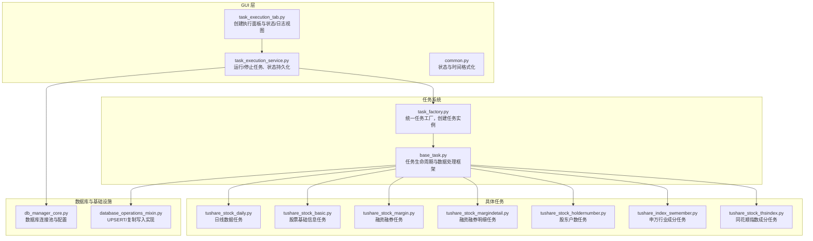
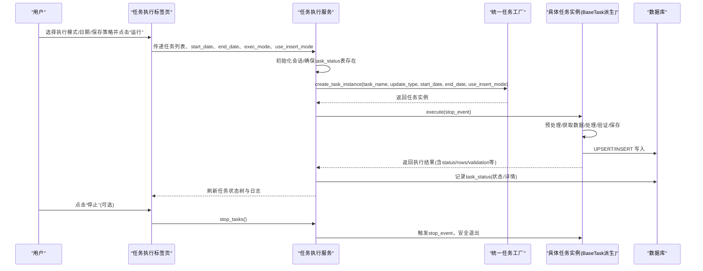
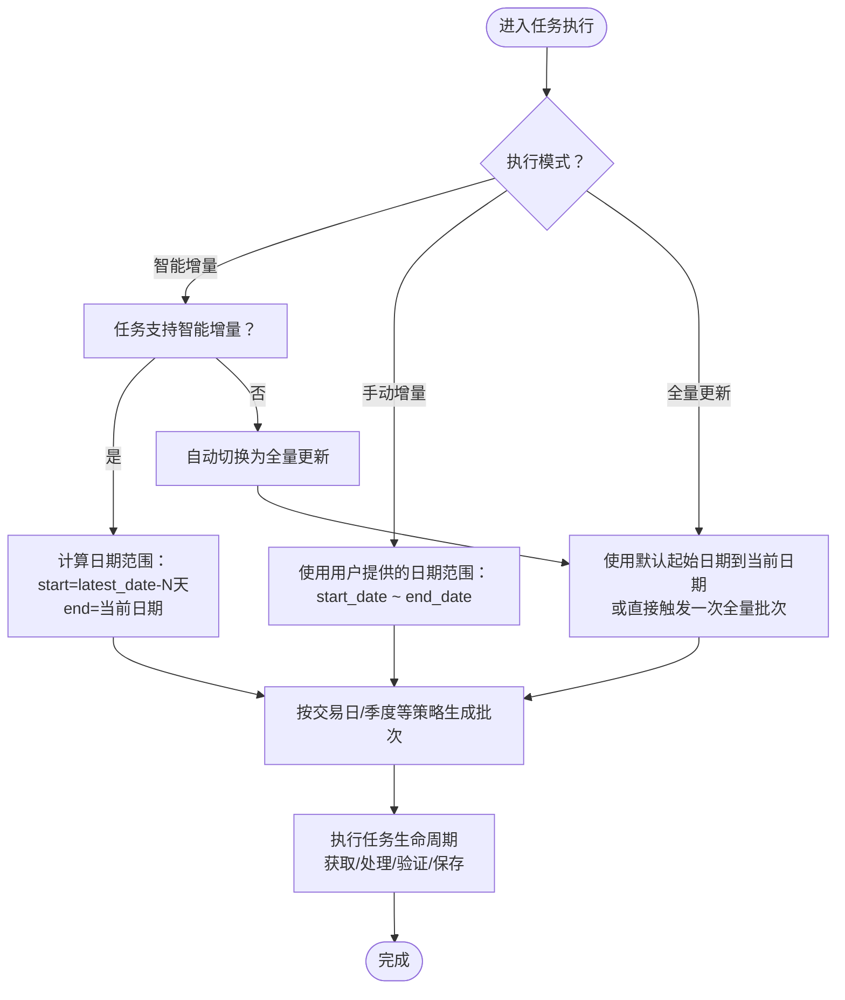
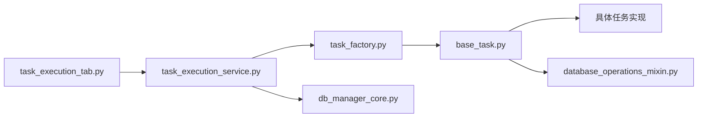

# 任务执行与状态监控

<cite>
**本文引用的文件**
- [alphahome/common/task_system/base_task.py](file://alphahome/common/task_system/base_task.py)
- [alphahome/common/task_system/task_factory.py](file://alphahome/common/task_system/task_factory.py)
- [alphahome/common/constants.py](file://alphahome/common/constants.py)
- [alphahome/gui/ui/task_execution_tab.py](file://alphahome/gui/ui/task_execution_tab.py)
- [alphahome/gui/services/task_execution_service.py](file://alphahome/gui/services/task_execution_service.py)
- [alphahome/gui/utils/common.py](file://alphahome/gui/utils/common.py)
- [alphahome/fetchers/tasks/stock/tushare_stock_daily.py](file://alphahome/fetchers/tasks/stock/tushare_stock_daily.py)
- [alphahome/fetchers/tasks/stock/tushare_stock_basic.py](file://alphahome/fetchers/tasks/stock/tushare_stock_basic.py)
- [alphahome/fetchers/tasks/stock/tushare_stock_margin.py](file://alphahome/fetchers/tasks/stock/tushare_stock_margin.py)
- [alphahome/fetchers/tasks/stock/tushare_stock_margindetail.py](file://alphahome/fetchers/tasks/stock/tushare_stock_margindetail.py)
- [alphahome/fetchers/tasks/stock/tushare_stock_holdernumber.py](file://alphahome/fetchers/tasks/stock/tushare_stock_holdernumber.py)
- [alphahome/fetchers/tasks/index/tushare_index_swmember.py](file://alphahome/fetchers/tasks/index/tushare_index_swmember.py)
- [alphahome/fetchers/tasks/stock/tushare_stock_thsindex.py](file://alphahome/fetchers/tasks/stock/tushare_stock_thsindex.py)
- [alphahome/common/db_components/database_operations_mixin.py](file://alphahome/common/db_components/database_operations_mixin.py)
- [alphahome/common/db_components/db_manager_core.py](file://alphahome/common/db_components/db_manager_core.py)
- [alphahome/gui/services/configuration_service.py](file://alphahome/gui/services/configuration_service.py)
- [scripts/production/data_updaters/tushare/tushare_smart_update_production.py](file://scripts/production/data_updaters/tushare/tushare_smart_update_production.py)
</cite>

## 目录
1. [简介](#简介)
2. [项目结构](#项目结构)
3. [核心组件](#核心组件)
4. [架构总览](#架构总览)
5. [详细组件分析](#详细组件分析)
6. [依赖关系分析](#依赖关系分析)
7. [性能考量](#性能考量)
8. [故障排查指南](#故障排查指南)
9. [结论](#结论)
10. [附录](#附录)

## 简介
本文件围绕“任务执行标签页”的三种更新模式——智能增量、手动增量与全量导入，系统阐述其工作原理、适用场景与实现差异；重点解析在不同模式下任务如何确定日期范围（尤其是与 BaseTask 中日期范围判定逻辑的关系），并说明用户如何配置执行参数、启动任务队列、监控实时执行状态。同时给出任务状态码（如运行中、成功、失败、取消、部分成功）的含义说明，并提供典型错误（如网络超时、数据库连接失败）的排查步骤与建议截图位置。

## 项目结构
任务执行标签页由 GUI 层负责呈现与交互，服务层负责执行与状态持久化，工厂层负责任务实例创建，任务基类提供统一生命周期与数据处理能力，具体任务实现决定日期范围与批处理策略。

图表来源
- [alphahome/gui/ui/task_execution_tab.py](file://alphahome/gui/ui/task_execution_tab.py#L1-L234)
- [alphahome/gui/services/task_execution_service.py](file://alphahome/gui/services/task_execution_service.py#L1-L397)
- [alphahome/common/task_system/task_factory.py](file://alphahome/common/task_system/task_factory.py#L1-L354)
- [alphahome/common/task_system/base_task.py](file://alphahome/common/task_system/base_task.py#L1-L825)
- [alphahome/common/db_components/db_manager_core.py](file://alphahome/common/db_components/db_manager_core.py#L384-L409)
- [alphahome/common/db_components/database_operations_mixin.py](file://alphahome/common/db_components/database_operations_mixin.py#L632-L651)

章节来源
- [alphahome/gui/ui/task_execution_tab.py](file://alphahome/gui/ui/task_execution_tab.py#L1-L234)
- [alphahome/gui/services/task_execution_service.py](file://alphahome/gui/services/task_execution_service.py#L1-L397)
- [alphahome/common/task_system/base_task.py](file://alphahome/common/task_system/base_task.py#L1-L825)
- [alphahome/common/task_system/task_factory.py](file://alphahome/common/task_system/task_factory.py#L1-L354)

## 核心组件
- 任务基类 BaseTask：定义任务生命周期（预处理、获取数据、处理、验证、保存）、错误处理、数据去重与空值过滤、分批保存、UPSERT/INSERT 写入策略等。
- 统一任务工厂 UnifiedTaskFactory：负责创建任务实例、注入数据库连接与任务配置、按任务类型/名称检索。
- 执行服务 task_execution_service：接收用户选择的任务与执行参数，按模式创建任务实例并执行，记录状态到数据库，支持停止事件。
- UI 标签页 task_execution_tab：提供执行模式选择（智能增量/手动增量/全量更新）、日期输入（手动增量）、保存策略（INSERT/UPSERT）、运行/停止按钮、任务状态树与日志视图。
- 常量 UpdateTypes：定义 SMART/MANUAL/FULL 三种更新类型及显示文本。
- 数据库层：连接池配置、UPSERT 写入（含时间戳列的智能更新逻辑）。

章节来源
- [alphahome/common/task_system/base_task.py](file://alphahome/common/task_system/base_task.py#L1-L825)
- [alphahome/common/task_system/task_factory.py](file://alphahome/common/task_system/task_factory.py#L1-L354)
- [alphahome/gui/services/task_execution_service.py](file://alphahome/gui/services/task_execution_service.py#L1-L397)
- [alphahome/gui/ui/task_execution_tab.py](file://alphahome/gui/ui/task_execution_tab.py#L1-L234)
- [alphahome/common/constants.py](file://alphahome/common/constants.py#L1-L23)
- [alphahome/common/db_components/database_operations_mixin.py](file://alphahome/common/db_components/database_operations_mixin.py#L632-L651)
- [alphahome/common/db_components/db_manager_core.py](file://alphahome/common/db_components/db_manager_core.py#L384-L409)

## 架构总览
下面的序列图展示了从 UI 选择执行模式到任务执行与状态记录的完整流程。

图表来源
- [alphahome/gui/ui/task_execution_tab.py](file://alphahome/gui/ui/task_execution_tab.py#L1-L234)
- [alphahome/gui/services/task_execution_service.py](file://alphahome/gui/services/task_execution_service.py#L124-L303)
- [alphahome/common/task_system/task_factory.py](file://alphahome/common/task_system/task_factory.py#L220-L272)
- [alphahome/common/task_system/base_task.py](file://alphahome/common/task_system/base_task.py#L138-L239)
- [alphahome/common/db_components/database_operations_mixin.py](file://alphahome/common/db_components/database_operations_mixin.py#L632-L651)

## 详细组件分析

### 三种更新模式的工作原理与适用场景
- 智能增量（SMART）
  - 适用：支持按日期增量更新的任务，通常具备 date_column 与主键 primary_keys，能从数据库最新日期回看若干天以覆盖遗漏数据。
  - 行为特征：在具体任务中，若任务声明支持智能增量，则会计算“从数据库最新日期前N天到当前日期”的范围；若任务不支持智能增量，执行服务会自动切换为全量更新。
  - 示例：股票日线、融资融券、股东户数等任务在智能增量模式下会回看固定天数并按交易日分批拉取。
- 手动增量（MANUAL）
  - 适用：需要精确控制日期范围的场景，如修复某段历史数据或补录。
  - 行为特征：UI 提供日期输入框，执行服务将 start_date/end_date 注入任务实例，任务据此生成批次列表。
- 全量导入（FULL）
  - 适用：首次运行、数据结构变更、需要重建全量快照、或某些任务不支持增量（仅支持全量）。
  - 行为特征：任务使用默认起始日期到当前日期的范围，或直接触发一次全量批次（如某些指数成分任务）。

章节来源
- [alphahome/gui/services/task_execution_service.py](file://alphahome/gui/services/task_execution_service.py#L167-L215)
- [alphahome/common/constants.py](file://alphahome/common/constants.py#L1-L23)
- [alphahome/fetchers/tasks/stock/tushare_stock_daily.py](file://alphahome/fetchers/tasks/stock/tushare_stock_daily.py#L108-L178)
- [alphahome/fetchers/tasks/stock/tushare_stock_margin.py](file://alphahome/fetchers/tasks/stock/tushare_stock_margin.py#L154-L175)
- [alphahome/fetchers/tasks/stock/tushare_stock_margindetail.py](file://alphahome/fetchers/tasks/stock/tushare_stock_margindetail.py#L160-L182)
- [alphahome/fetchers/tasks/stock/tushare_stock_holdernumber.py](file://alphahome/fetchers/tasks/stock/tushare_stock_holdernumber.py#L159-L183)
- [alphahome/fetchers/tasks/index/tushare_index_swmember.py](file://alphahome/fetchers/tasks/index/tushare_index_swmember.py#L107-L135)
- [alphahome/fetchers/tasks/stock/tushare_stock_thsindex.py](file://alphahome/fetchers/tasks/stock/tushare_stock_thsindex.py#L108-L138)

### _determine_date_range 的行为差异（结合 BaseTask 与具体任务）
- BaseTask 的日期范围判定逻辑
  - BaseTask 在执行流程中并不直接实现“确定日期范围”的方法，而是通过任务实例的 get_batch_list 或内部逻辑决定 start_date/end_date。
  - 若任务未提供日期范围，BaseTask 的派生类通常会使用默认起始日期与当前日期，或在智能增量模式下回看 N 天。
- 具体任务中的日期范围确定
  - 股票日线任务：若未提供日期范围，使用默认起始日期与当前日期；若 start_date > end_date 则跳过。
  - 融资融券/明细任务：智能增量模式下从数据库最新日期前N天到当前日期；手动模式下使用用户提供的日期范围。
  - 股东户数任务：根据时间跨度选择单批次或季度分批。
  - 指数成分任务：智能增量模式下判断是否满足“超过1个月未更新且当天为非交易日”条件，满足则转为全量；否则跳过。
- 结论
  - “_determine_date_range”并非 BaseTask 的公开方法，其行为由各任务的 get_batch_list 或内部逻辑决定。智能增量与手动增量的区别体现在任务内部如何计算 start_date/end_date，而非 BaseTask 的统一方法。

章节来源
- [alphahome/common/task_system/base_task.py](file://alphahome/common/task_system/base_task.py#L138-L239)
- [alphahome/fetchers/tasks/stock/tushare_stock_daily.py](file://alphahome/fetchers/tasks/stock/tushare_stock_daily.py#L108-L178)
- [alphahome/fetchers/tasks/stock/tushare_stock_margin.py](file://alphahome/fetchers/tasks/stock/tushare_stock_margin.py#L154-L175)
- [alphahome/fetchers/tasks/stock/tushare_stock_margindetail.py](file://alphahome/fetchers/tasks/stock/tushare_stock_margindetail.py#L160-L182)
- [alphahome/fetchers/tasks/stock/tushare_stock_holdernumber.py](file://alphahome/fetchers/tasks/stock/tushare_stock_holdernumber.py#L159-L183)
- [alphahome/fetchers/tasks/index/tushare_index_swmember.py](file://alphahome/fetchers/tasks/index/tushare_index_swmember.py#L107-L135)
- [alphahome/fetchers/tasks/stock/tushare_stock_thsindex.py](file://alphahome/fetchers/tasks/stock/tushare_stock_thsindex.py#L108-L138)

### 执行参数配置与启动流程
- UI 配置
  - 执行模式：智能增量/手动增量/全量更新（radiobutton）。
  - 日期范围：仅在“手动增量”模式下显示（DateEntry 或 Entry）。
  - 保存策略：勾选“使用INSERT模式”可跳过重复数据检查，提高速度但可能产生重复。
  - 运行/停止：点击“运行任务”启动队列；点击“停止任务”发送全局停止事件。
- 服务端启动
  - 服务根据 exec_mode 设置 update_type，并在手动增量模式下注入 start_date/end_date。
  - 对于智能增量任务，若任务不支持智能增量，自动切换为全量更新。
  - 通过 UnifiedTaskFactory 创建任务实例并调用 execute，记录状态到 task_status 表。
- 生产脚本示例
  - 生产脚本中可直接以 SMART 模式创建任务实例并执行，若不支持智能增量则跳过。

章节来源
- [alphahome/gui/ui/task_execution_tab.py](file://alphahome/gui/ui/task_execution_tab.py#L21-L120)
- [alphahome/gui/services/task_execution_service.py](file://alphahome/gui/services/task_execution_service.py#L167-L215)
- [alphahome/common/task_system/task_factory.py](file://alphahome/common/task_system/task_factory.py#L220-L272)
- [scripts/production/data_updaters/tushare/tushare_smart_update_production.py](file://scripts/production/data_updaters/tushare/tushare_smart_update_production.py#L133-L165)

### 实时状态监控
- 任务状态树：展示任务名称、最后状态、更新时间、详情。
- 日志视图：滚动显示执行日志，支持 INFO/WARNING/ERROR 等级别。
- 状态持久化：服务端维护 task_status 表，记录 RUNNING/SUCCESS/ERROR/CANCELLED 等状态。
- 状态显示映射：服务端将英文状态映射为中文显示（如 RUNNING→运行中）。

章节来源
- [alphahome/gui/ui/task_execution_tab.py](file://alphahome/gui/ui/task_execution_tab.py#L148-L234)
- [alphahome/gui/services/task_execution_service.py](file://alphahome/gui/services/task_execution_service.py#L57-L123)
- [alphahome/gui/utils/common.py](file://alphahome/gui/utils/common.py#L12-L21)

### 任务状态码含义
- PENDING：排队中（UI 层映射为“排队中”）
- RUNNING：运行中（UI 层映射为“运行中”）
- SUCCESS：成功（UI 层映射为“成功”）
- ERROR：失败（UI 层映射为“失败”）
- CANCELLED：已取消（UI 层映射为“已取消”）
- SKIPPED：已跳过（UI 层映射为“已跳过”）
- WARNING：部分成功（UI 层映射为“部分成功”，来自 BaseTask 验证未完全通过）

章节来源
- [alphahome/gui/utils/common.py](file://alphahome/gui/utils/common.py#L12-L21)
- [alphahome/common/task_system/base_task.py](file://alphahome/common/task_system/base_task.py#L216-L239)
- [alphahome/gui/services/task_execution_service.py](file://alphahome/gui/services/task_execution_service.py#L248-L277)

### 三种模式下的日期范围决策流程（算法流）

图表来源
- [alphahome/gui/services/task_execution_service.py](file://alphahome/gui/services/task_execution_service.py#L167-L215)
- [alphahome/fetchers/tasks/stock/tushare_stock_daily.py](file://alphahome/fetchers/tasks/stock/tushare_stock_daily.py#L108-L178)
- [alphahome/fetchers/tasks/stock/tushare_stock_margin.py](file://alphahome/fetchers/tasks/stock/tushare_stock_margin.py#L154-L175)
- [alphahome/fetchers/tasks/stock/tushare_stock_holdernumber.py](file://alphahome/fetchers/tasks/stock/tushare_stock_holdernumber.py#L159-L183)
- [alphahome/fetchers/tasks/index/tushare_index_swmember.py](file://alphahome/fetchers/tasks/index/tushare_index_swmember.py#L107-L135)

## 依赖关系分析
- UI 依赖服务层回调接口以刷新状态与日志。
- 服务层依赖工厂创建任务实例，依赖数据库管理器进行状态记录与数据写入。
- 任务实例依赖 BaseTask 的统一生命周期与数据处理框架，具体任务实现各自日期范围与批处理策略。
- 数据库层提供连接池与 UPSERT 写入能力，支持时间戳列的智能更新逻辑。

图表来源
- [alphahome/gui/ui/task_execution_tab.py](file://alphahome/gui/ui/task_execution_tab.py#L1-L234)
- [alphahome/gui/services/task_execution_service.py](file://alphahome/gui/services/task_execution_service.py#L1-L397)
- [alphahome/common/task_system/task_factory.py](file://alphahome/common/task_system/task_factory.py#L1-L354)
- [alphahome/common/task_system/base_task.py](file://alphahome/common/task_system/base_task.py#L1-L825)
- [alphahome/common/db_components/db_manager_core.py](file://alphahome/common/db_components/db_manager_core.py#L384-L409)
- [alphahome/common/db_components/database_operations_mixin.py](file://alphahome/common/db_components/database_operations_mixin.py#L632-L651)

## 性能考量
- 分批保存：当数据量大于 save_batch_size 时自动分批写入，减少内存占用与事务压力。
- UPSERT 与 INSERT：默认使用 UPSERT（基于主键冲突更新），可选 INSERT 模式跳过重复检查以提升速度，但需确保数据源无重复。
- 并发与批策略：部分任务按交易日/季度分批，降低单次请求压力。
- 数据库连接池：优化的连接池参数与超时设置有助于稳定高并发场景。

章节来源
- [alphahome/common/task_system/base_task.py](file://alphahome/common/task_system/base_task.py#L555-L654)
- [alphahome/common/db_components/database_operations_mixin.py](file://alphahome/common/db_components/database_operations_mixin.py#L632-L651)
- [alphahome/common/db_components/db_manager_core.py](file://alphahome/common/db_components/db_manager_core.py#L384-L409)
- [alphahome/fetchers/tasks/stock/tushare_stock_daily.py](file://alphahome/fetchers/tasks/stock/tushare_stock_daily.py#L108-L178)
- [alphahome/fetchers/tasks/stock/tushare_stock_holdernumber.py](file://alphahome/fetchers/tasks/stock/tushare_stock_holdernumber.py#L159-L183)

## 故障排查指南
- 网络超时/接口限流
  - 现象：任务执行过程中出现超时或返回异常。
  - 排查：检查任务实现中的重试与分批策略；适当增大命令超时；确认 API Token 有效。
  - 建议截图位置：日志视图中定位超时/重试相关条目。
- 数据库连接失败
  - 现象：无法连接数据库或连接池初始化失败。
  - 排查：使用配置服务测试数据库连接；检查数据库 URL、凭据与网络连通性；查看连接池参数。
  - 建议截图位置：配置服务测试连接的结果提示与日志。
- 任务实例创建失败
  - 现象：工厂无法创建任务实例或任务未注册。
  - 排查：确认任务已注册；检查任务配置与 API Token 注入；查看工厂初始化日志。
- 任务被取消
  - 现象：状态为 CANCELLED。
  - 排查：确认用户是否点击“停止任务”；检查 stop_event 是否被设置。
- 部分成功/验证未通过
  - 现象：状态为 WARNING（部分成功）。
  - 排查：查看验证详情与失败规则；检查数据转换与空值处理；必要时切换为报告模式或过滤模式。

章节来源
- [alphahome/gui/services/configuration_service.py](file://alphahome/gui/services/configuration_service.py#L99-L135)
- [alphahome/common/db_components/db_manager_core.py](file://alphahome/common/db_components/db_manager_core.py#L384-L409)
- [alphahome/gui/services/task_execution_service.py](file://alphahome/gui/services/task_execution_service.py#L124-L194)
- [alphahome/common/task_system/base_task.py](file://alphahome/common/task_system/base_task.py#L138-L239)

## 结论
- 智能增量适用于可按日期增量更新的任务，通过回看 N 天确保覆盖遗漏数据；不支持智能增量的任务会自动降级为全量更新。
- 手动增量适合需要精确控制日期范围的场景；全量更新适合首次运行或需要重建快照。
- UI 提供直观的执行参数配置与实时状态监控；服务层负责统一的任务生命周期与状态持久化。
- 建议在生产环境中优先使用智能增量以降低数据量与网络压力，同时关注验证与去重策略，确保数据质量。

## 附录
- 操作截图建议位置
  - 执行模式选择与日期输入：任务执行标签页左侧面板。
  - 任务状态树与日志视图：右侧主显示区域上方与下方。
  - 停止任务按钮：左侧面板运行控制框架。
  - 配置服务测试数据库连接：配置相关页面（如存储设置标签页）。