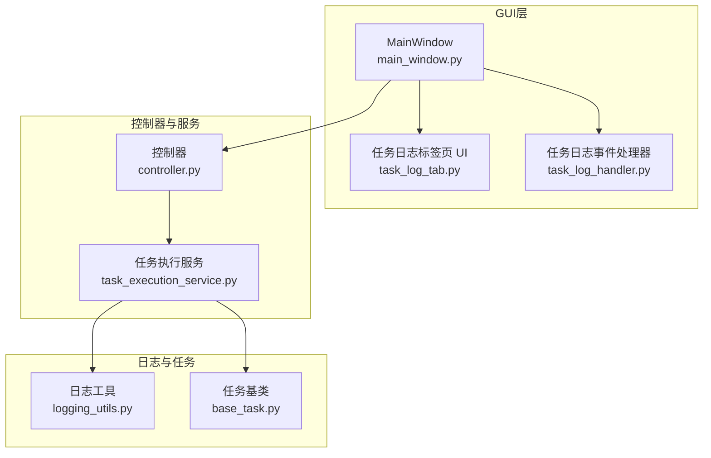
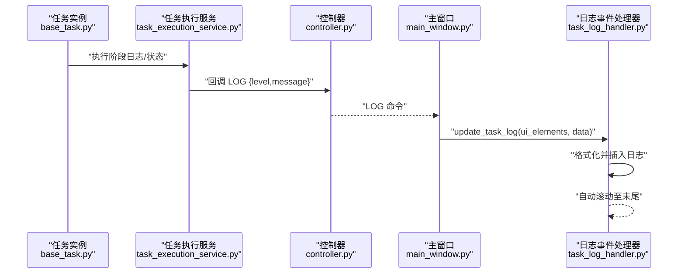
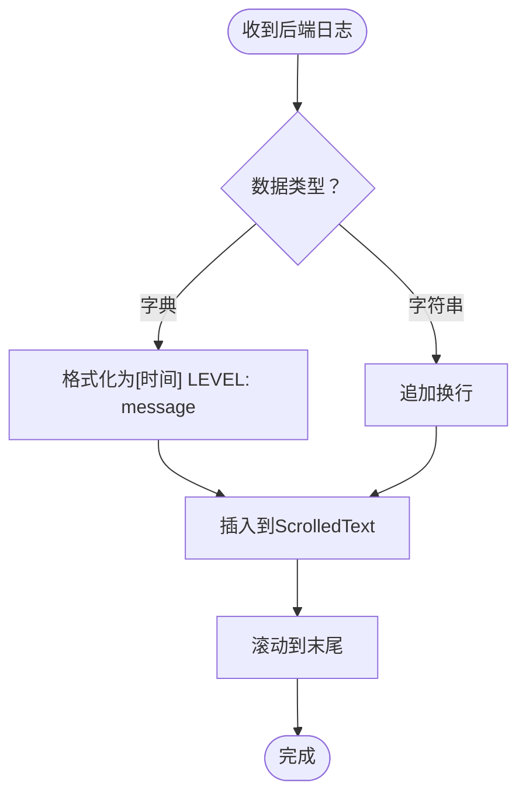
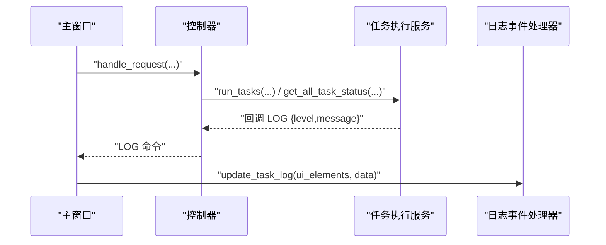
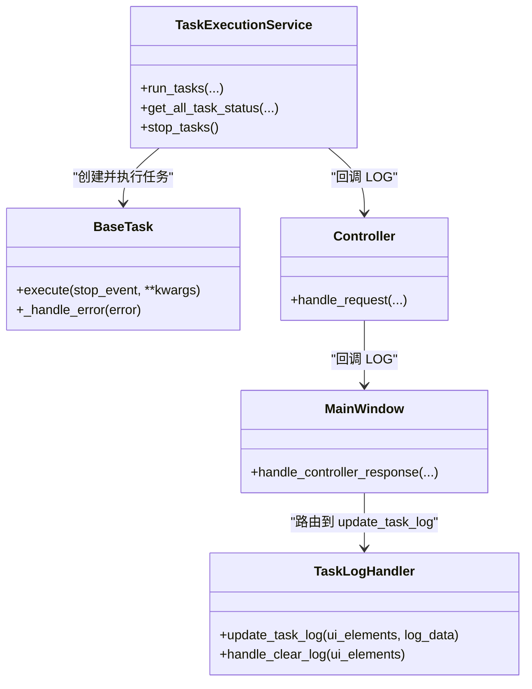
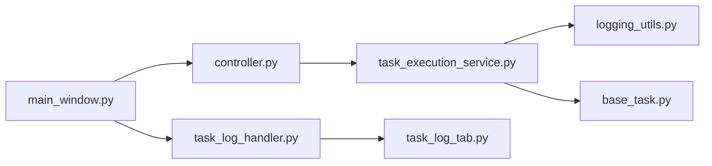

# 任务日志查看器

<cite>
**本文引用的文件**
- [logging_utils.py](file://alphahome/common/logging_utils.py)
- [task_log_tab.py](file://alphahome/gui/ui/task_log_tab.py)
- [task_log_handler.py](file://alphahome/gui/handlers/task_log_handler.py)
- [controller.py](file://alphahome/gui/controller.py)
- [task_execution_service.py](file://alphahome/gui/services/task_execution_service.py)
- [main_window.py](file://alphahome/gui/main_window.py)
- [base_task.py](file://alphahome/common/task_system/base_task.py)
</cite>

## 目录
1. [简介](#简介)
2. [项目结构](#项目结构)
3. [核心组件](#核心组件)
4. [架构总览](#架构总览)
5. [详细组件分析](#详细组件分析)
6. [依赖关系分析](#依赖关系分析)
7. [性能与实时性考虑](#性能与实时性考虑)
8. [故障排查指南](#故障排查指南)
9. [结论](#结论)
10. [附录](#附录)

## 简介
本文件面向“任务日志查看器”的使用与维护，聚焦于任务运行时日志的实时滚动显示机制，涵盖日志级别过滤、关键字搜索与自动刷新频率控制。文档说明日志来源（logging_utils.py）与GUI之间的异步通信方式，以及通过controller.py订阅任务运行时日志流的路径。同时解释错误日志的结构化输出格式，帮助用户快速定位异常堆栈；提供日志导出操作步骤与关键日志事件监控策略建议，如数据获取失败或处理中断。

## 项目结构
任务日志查看器位于GUI层，围绕以下模块协同工作：
- 日志基础设施：common/logging_utils.py 提供统一日志配置与获取
- GUI标签页：gui/ui/task_log_tab.py 负责创建日志显示区域与控制按钮
- UI事件处理器：gui/handlers/task_log_handler.py 负责将后端日志流写入ScrolledText并实现清屏
- 控制器：gui/controller.py 作为前后端通信中枢，接收后端响应并通过回调分发到UI
- 任务执行服务：gui/services/task_execution_service.py 在任务执行过程中产生日志并写入数据库，同时通过回调向UI推送
- 主窗口：gui/main_window.py 建立统一的响应分发通道，将“LOG”命令路由到task_log_handler
- 任务基类：common/task_system/base_task.py 为具体任务提供标准执行流程与日志记录

图表来源
- [main_window.py](file://alphahome/gui/main_window.py#L221-L289)
- [task_log_tab.py](file://alphahome/gui/ui/task_log_tab.py#L12-L52)
- [task_log_handler.py](file://alphahome/gui/handlers/task_log_handler.py#L16-L64)
- [controller.py](file://alphahome/gui/controller.py#L198-L319)
- [task_execution_service.py](file://alphahome/gui/services/task_execution_service.py#L1-L123)
- [logging_utils.py](file://alphahome/common/logging_utils.py#L48-L132)
- [base_task.py](file://alphahome/common/task_system/base_task.py#L138-L248)

章节来源
- [main_window.py](file://alphahome/gui/main_window.py#L221-L289)
- [task_log_tab.py](file://alphahome/gui/ui/task_log_tab.py#L12-L52)
- [task_log_handler.py](file://alphahome/gui/handlers/task_log_handler.py#L16-L64)
- [controller.py](file://alphahome/gui/controller.py#L198-L319)
- [task_execution_service.py](file://alphahome/gui/services/task_execution_service.py#L1-L123)
- [logging_utils.py](file://alphahome/common/logging_utils.py#L48-L132)
- [base_task.py](file://alphahome/common/task_system/base_task.py#L138-L248)

## 核心组件
- 日志工具（logging_utils.py）
  - 提供setup_logging与get_logger，统一配置根日志器、控制台处理器与可选文件处理器，保证日志格式与编码一致性
  - 为任务基类提供logger命名空间“task.<name>”，便于区分任务来源
- 任务日志标签页（task_log_tab.py）
  - 创建ScrolledText用于日志展示，禁用编辑状态，字体等宽便于对齐
  - 提供“清屏”按钮事件处理器
- 任务日志事件处理器（task_log_handler.py）
  - update_task_log：将后端日志流追加到ScrolledText，自动滚动至末尾
  - handle_clear_log：清空日志文本
- 控制器（controller.py）
  - 统一请求分发，将“LOG”命令通过响应回调转发给UI
- 任务执行服务（task_execution_service.py）
  - 在任务执行前后、状态变更、错误与取消等关键节点，通过回调发送结构化日志消息
  - 维护任务状态表task_status，支持历史/当前会话模式
- 主窗口（main_window.py）
  - 建立handle_controller_response，将“LOG”命令路由到task_log_handler.update_task_log
- 任务基类（base_task.py）
  - execute模板方法在获取数据、处理、保存等阶段记录日志，异常时返回结构化错误结果

章节来源
- [logging_utils.py](file://alphahome/common/logging_utils.py#L48-L132)
- [task_log_tab.py](file://alphahome/gui/ui/task_log_tab.py#L12-L52)
- [task_log_handler.py](file://alphahome/gui/handlers/task_log_handler.py#L16-L64)
- [controller.py](file://alphahome/gui/controller.py#L198-L319)
- [task_execution_service.py](file://alphahome/gui/services/task_execution_service.py#L1-L123)
- [main_window.py](file://alphahome/gui/main_window.py#L221-L289)
- [base_task.py](file://alphahome/common/task_system/base_task.py#L138-L248)

## 架构总览
任务日志从“任务执行服务”产生，经“控制器”统一回调，最终由“主窗口”分发到“日志事件处理器”，写入“ScrolledText”。日志级别与消息体通过“LOG”命令传递，UI侧不直接解析日志级别，而是按统一格式展示。

图表来源
- [base_task.py](file://alphahome/common/task_system/base_task.py#L138-L248)
- [task_execution_service.py](file://alphahome/gui/services/task_execution_service.py#L241-L298)
- [controller.py](file://alphahome/gui/controller.py#L224-L282)
- [main_window.py](file://alphahome/gui/main_window.py#L221-L289)
- [task_log_handler.py](file://alphahome/gui/handlers/task_log_handler.py#L16-L44)

## 详细组件分析

### 日志实时滚动显示机制
- 实时性保障
  - UI侧采用ScrolledText并禁用编辑状态，插入新日志后调用“滚动到末尾”以实现自动滚动
  - 事件处理器在插入前临时启用控件，插入后恢复禁用状态，避免UI闪烁与并发问题
- 日志格式
  - 字典形式日志：包含level与message字段，处理器会格式化为“[时间] LEVEL: message”
  - 字符串形式日志：直接追加换行
- 关键路径
  - 任务执行服务在关键节点（开始、取消、成功、失败、停止信号）通过回调发送“LOG”命令
  - 主窗口将“LOG”命令路由到task_log_handler.update_task_log
  - 事件处理器将格式化后的日志写入ScrolledText并滚动到底部

图表来源
- [task_log_handler.py](file://alphahome/gui/handlers/task_log_handler.py#L16-L44)

章节来源
- [task_log_handler.py](file://alphahome/gui/handlers/task_log_handler.py#L16-L64)
- [task_execution_service.py](file://alphahome/gui/services/task_execution_service.py#L241-L298)
- [main_window.py](file://alphahome/gui/main_window.py#L221-L289)

### 日志级别过滤、关键字搜索与自动刷新频率控制
- 日志级别过滤
  - UI侧不直接过滤日志级别；建议在“LOG”消息到达前由后端服务按级别筛选并下发
  - 若需在UI侧过滤，可在task_log_handler.update_task_log中增加level白名单判断
- 关键字搜索
  - UI未内置搜索功能；可在ScrolledText上扩展搜索面板，使用文本查找API定位匹配行
- 自动刷新频率控制
  - 任务状态刷新由任务执行服务控制，可通过调整“刷新间隔”参数或减少刷新频率降低UI压力
  - 日志流为实时推送，无需额外定时器

章节来源
- [task_execution_service.py](file://alphahome/gui/services/task_execution_service.py#L57-L123)
- [task_log_handler.py](file://alphahome/gui/handlers/task_log_handler.py#L16-L44)

### 日志来源与异步通信
- 日志来源
  - 任务基类在execute模板方法的关键阶段记录日志（开始、获取数据、处理、保存、异常、取消）
  - 任务执行服务在任务启动、停止、状态变更、错误与取消时也通过回调发送日志
- 异步通信
  - 主窗口通过handle_controller_response将“LOG”命令分发到task_log_handler.update_task_log
  - 控制器在处理请求时，遇到异常会通过回调发送“LOG”错误消息
  - 任务执行服务在任务执行前后通过回调发送状态与日志

图表来源
- [main_window.py](file://alphahome/gui/main_window.py#L221-L289)
- [controller.py](file://alphahome/gui/controller.py#L198-L319)
- [task_execution_service.py](file://alphahome/gui/services/task_execution_service.py#L124-L303)

章节来源
- [main_window.py](file://alphahome/gui/main_window.py#L221-L289)
- [controller.py](file://alphahome/gui/controller.py#L198-L319)
- [task_execution_service.py](file://alphahome/gui/services/task_execution_service.py#L124-L303)

### 错误日志的结构化输出格式
- 错误结果结构
  - 任务基类在异常时返回包含“status: error”、“error: 错误信息”、“task: 任务名”的字典
  - 取消时返回“status: cancelled”
- 日志消息结构
  - 任务执行服务回调发送的“LOG”消息包含“level”和“message”
  - UI侧将字典消息格式化为“[时间] LEVEL: message”，便于阅读
- 堆栈定位
  - 任务基类在异常时记录exc_info，便于定位异常堆栈
  - 建议在UI侧保留原始“LOG”消息，必要时显示原始错误详情

图表来源
- [base_task.py](file://alphahome/common/task_system/base_task.py#L138-L248)
- [task_execution_service.py](file://alphahome/gui/services/task_execution_service.py#L124-L303)
- [controller.py](file://alphahome/gui/controller.py#L198-L319)
- [main_window.py](file://alphahome/gui/main_window.py#L221-L289)
- [task_log_handler.py](file://alphahome/gui/handlers/task_log_handler.py#L16-L64)

章节来源
- [base_task.py](file://alphahome/common/task_system/base_task.py#L138-L248)
- [task_execution_service.py](file://alphahome/gui/services/task_execution_service.py#L241-L298)
- [task_log_handler.py](file://alphahome/gui/handlers/task_log_handler.py#L16-L44)

### 日志导出操作步骤
- 当前实现
  - UI未提供直接导出按钮；ScrolledText支持复制粘贴
- 建议步骤
  1) 在“任务日志”标签页中，选中并复制ScrolledText中的日志内容
  2) 打开文本编辑器或日志分析工具，粘贴并另存为文本文件
  3) 如需结构化导出，可在后端服务中扩展“LOG”消息到文件写入逻辑（例如在setup_logging中启用文件输出）

章节来源
- [task_log_tab.py](file://alphahome/gui/ui/task_log_tab.py#L12-L52)
- [logging_utils.py](file://alphahome/common/logging_utils.py#L114-L132)

### 关键日志事件监控策略
- 数据获取失败
  - 触发条件：任务执行服务在创建任务实例失败或fetch阶段无数据时发送“LOG error”
  - 建议：在UI侧对“error”级别日志高亮显示，并记录时间戳与任务名
- 处理中断
  - 触发条件：用户点击“停止任务”后发送“LOG warning”，并在任务基类中记录取消
  - 建议：在状态栏或日志中显示“停止信号已发送，任务将在安全点停止”
- 成功完成
  - 触发条件：任务执行成功后发送“LOG info”，并在任务状态表记录成功
  - 建议：在UI侧显示“处理完成 (行数: N)”等统计信息

章节来源
- [task_execution_service.py](file://alphahome/gui/services/task_execution_service.py#L148-L303)
- [base_task.py](file://alphahome/common/task_system/base_task.py#L241-L248)

## 依赖关系分析
- 组件耦合
  - 主窗口与控制器：通过handle_controller_response解耦UI与后端
  - 控制器与任务执行服务：通过回调统一响应
  - 任务执行服务与日志工具：通过get_logger与exc_info记录日志
- 外部依赖
  - logging模块：统一日志格式与编码
  - tkinter：ScrolledText用于日志展示
  - asyncio：异步任务与事件驱动

图表来源
- [main_window.py](file://alphahome/gui/main_window.py#L221-L289)
- [controller.py](file://alphahome/gui/controller.py#L198-L319)
- [task_execution_service.py](file://alphahome/gui/services/task_execution_service.py#L1-L123)
- [logging_utils.py](file://alphahome/common/logging_utils.py#L48-L132)
- [base_task.py](file://alphahome/common/task_system/base_task.py#L138-L248)
- [task_log_handler.py](file://alphahome/gui/handlers/task_log_handler.py#L16-L64)
- [task_log_tab.py](file://alphahome/gui/ui/task_log_tab.py#L12-L52)

章节来源
- [main_window.py](file://alphahome/gui/main_window.py#L221-L289)
- [controller.py](file://alphahome/gui/controller.py#L198-L319)
- [task_execution_service.py](file://alphahome/gui/services/task_execution_service.py#L1-L123)
- [logging_utils.py](file://alphahome/common/logging_utils.py#L48-L132)
- [base_task.py](file://alphahome/common/task_system/base_task.py#L138-L248)
- [task_log_handler.py](file://alphahome/gui/handlers/task_log_handler.py#L16-L64)
- [task_log_tab.py](file://alphahome/gui/ui/task_log_tab.py#L12-L52)

## 性能与实时性考虑
- UI渲染
  - ScrolledText频繁插入大量日志可能造成卡顿；建议限制最大行数或启用虚拟化
- 日志级别
  - 在高频场景下，可仅推送“info/warning/error”三类日志，减少UI压力
- 刷新频率
  - 任务状态刷新频率应与任务数量和UI性能平衡；避免过于频繁的轮询

[本节为通用指导，不直接分析具体文件]

## 故障排查指南
- 日志未显示
  - 检查主窗口handle_controller_response是否正确路由“LOG”命令
  - 确认task_log_handler.update_task_log是否被调用
- 日志乱码
  - 确认setup_logging使用UTF-8编码与合适的日期格式
- 任务执行异常
  - 查看任务基类异常分支返回的“error”字段与exc_info堆栈
  - 检查任务执行服务回调是否发送“LOG error”

章节来源
- [main_window.py](file://alphahome/gui/main_window.py#L221-L289)
- [task_log_handler.py](file://alphahome/gui/handlers/task_log_handler.py#L16-L64)
- [logging_utils.py](file://alphahome/common/logging_utils.py#L48-L132)
- [base_task.py](file://alphahome/common/task_system/base_task.py#L241-L248)

## 结论
任务日志查看器通过统一的“LOG”命令实现日志流的实时推送与滚动显示。日志来源覆盖任务执行全过程，错误日志具备结构化输出与堆栈信息，便于快速定位问题。UI层提供清屏与自动滚动能力，建议在高频日志场景下优化UI渲染与日志级别过滤。未来可扩展关键字搜索与日志导出功能，进一步提升可观测性与可运维性。

[本节为总结性内容，不直接分析具体文件]

## 附录
- 日志级别与消息体约定
  - level: "info"/"warning"/"error"
  - message: 文本描述
- 常见命令
  - “LOG”: 日志推送
  - “TASK_STATUS_UPDATE”: 任务状态刷新

[本节为概览性内容，不直接分析具体文件]