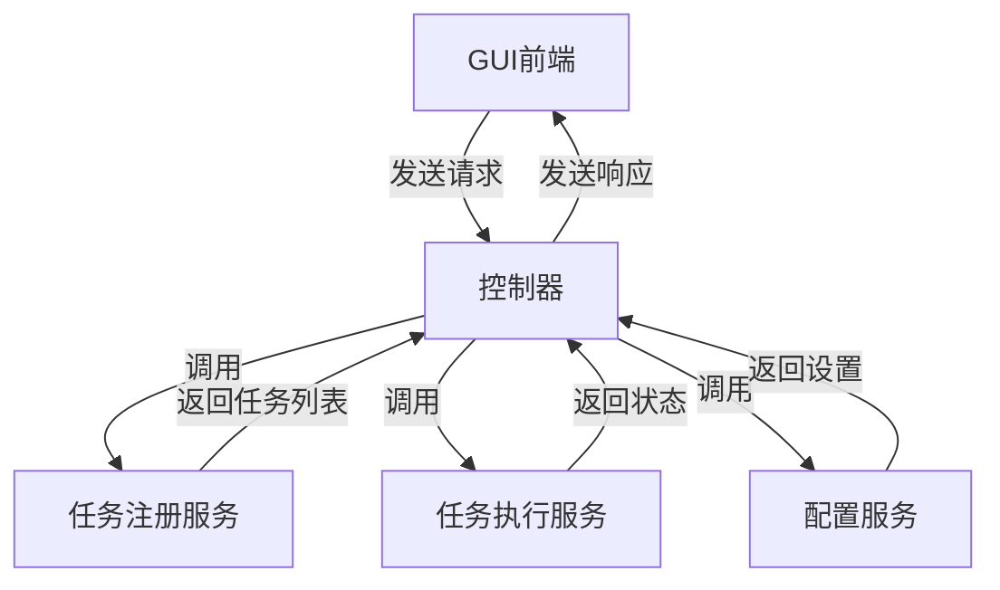
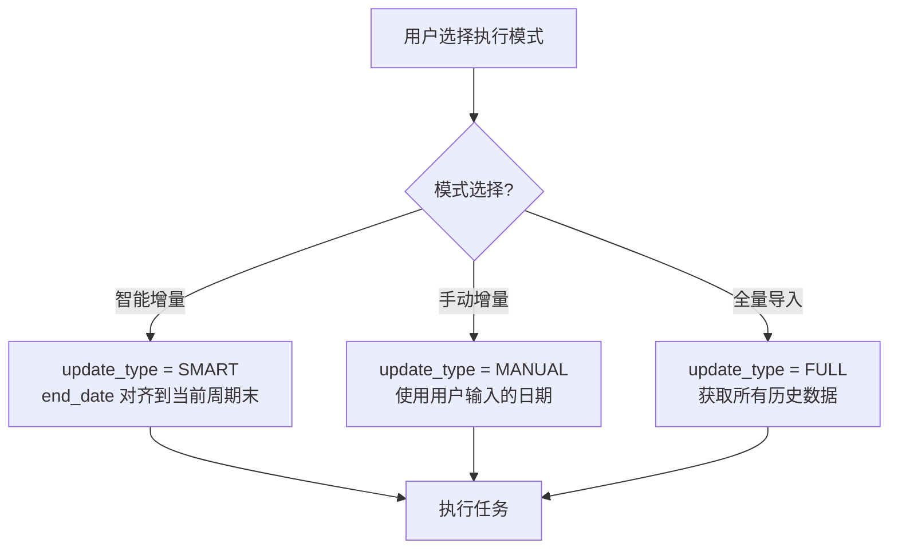
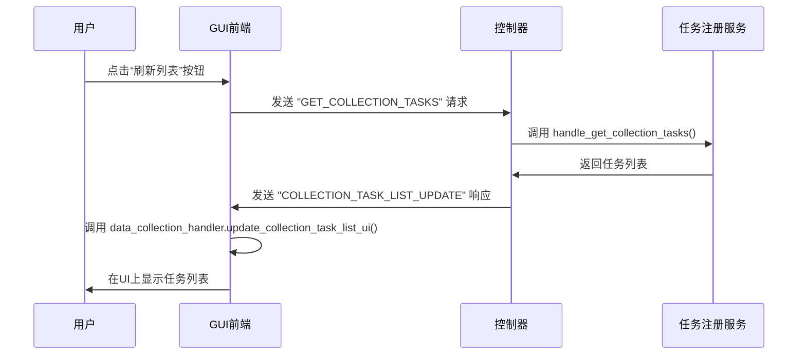

# 图形用户界面 (GUI)

<cite>
**本文档引用的文件**
- [main_window.py](file://alphahome/gui/main_window.py)
- [controller.py](file://alphahome/gui/controller.py)
- [data_collection_tab.py](file://alphahome/gui/ui/data_collection_tab.py)
- [data_processing_tab.py](file://alphahome/gui/ui/data_processing_tab.py)
- [task_execution_tab.py](file://alphahome/gui/ui/task_execution_tab.py)
- [storage_settings_tab.py](file://alphahome/gui/ui/storage_settings_tab.py)
- [task_log_tab.py](file://alphahome/gui/ui/task_log_tab.py)
- [data_collection_handler.py](file://alphahome/gui/handlers/data_collection_handler.py)
- [data_processing_handler.py](file://alphahome/gui/handlers/data_processing_handler.py)
- [task_execution_handler.py](file://alphahome/gui/handlers/task_execution_handler.py)
- [storage_settings_handler.py](file://alphahome/gui/handlers/storage_settings_handler.py)
- [configuration_service.py](file://alphahome/gui/services/configuration_service.py)
- [constants.py](file://alphahome/common/constants.py)
</cite>

## 目录
1. [简介](#简介)
2. [主窗口与控制器](#主窗口与控制器)
3. [数据采集标签页](#数据采集标签页)
4. [数据处理标签页](#数据处理标签页)
5. [任务执行标签页](#任务执行标签页)
6. [存储设置标签页](#存储设置标签页)
7. [任务日志标签页](#任务日志标签页)
8. [前后端交互流程](#前后端交互流程)
9. [常见工作流指南](#常见工作流指南)
10. [错误处理与提示](#错误处理与提示)

## 简介

AlphaHome智能量化投研系统的图形用户界面（GUI）是一个功能全面的桌面应用程序，旨在为用户提供一个直观、高效的数据管理和分析环境。GUI通过多个标签页组织功能，包括数据采集、数据处理、任务执行、存储设置和任务日志，实现了从数据获取到处理的完整工作流。

本指南将详细介绍每个标签页的功能、操作流程和用户交互细节，帮助用户充分利用系统功能。系统采用模块化设计，前端（GUI）与后端（业务逻辑）通过`controller.py`进行通信，确保了系统的稳定性和可维护性。

**Section sources**
- [main_window.py](file://alphahome/gui/main_window.py#L1-L412)

## 主窗口与控制器

主窗口`main_window.py`是整个GUI应用的入口点和核心协调者。它负责初始化用户界面、管理异步事件循环，并作为前后端通信的桥梁。主窗口通过继承多个Mixin类（`WindowEventsMixin`, `WindowDpiMixin`, `WindowLayoutMixin`）来分离关注点，分别处理事件绑定、DPI感知和UI布局。

`controller.py`是GUI与后端服务之间的中间层。它接收来自GUI的请求，分发给相应的服务模块（如`task_registry_service`, `task_execution_service`, `configuration_service`），并处理响应。这种设计模式实现了清晰的职责分离，使得GUI只关注用户交互，而复杂的业务逻辑由后端服务处理。

**Diagram sources**
- [main_window.py](file://alphahome/gui/main_window.py#L1-L412)
- [controller.py](file://alphahome/gui/controller.py#L1-L319)

**Section sources**
- [main_window.py](file://alphahome/gui/main_window.py#L1-L412)
- [controller.py](file://alphahome/gui/controller.py#L1-L319)

## 数据采集标签页

数据采集标签页（`data_collection_tab.py`）允许用户选择和管理从不同数据源（如Tushare, AkShare）获取原始数据的任务。该标签页的核心功能是任务选择与过滤机制。

### 任务选择与过滤机制

用户可以通过以下方式与任务列表交互：
- **选择任务**：点击任务列表中“选择”列的单元格，可以切换单个任务的选中状态。
- **全选/取消全选**：使用“全选”和“取消全选”按钮可以批量操作所有任务。
- **过滤任务**：提供三种过滤器：
  - **名称过滤**：输入任务名称中的关键字进行搜索。
  - **数据源过滤**：从下拉框中选择特定的数据源（如Tushare）。
  - **类型过滤**：从下拉框中选择任务类型（如股票、基金）。

这些过滤器是动态的，当用户更改过滤条件时，任务列表会实时更新，显示符合所有条件的任务。排序功能也已实现，用户可以点击表头对任务列表进行升序或降序排列。

**Section sources**
- [data_collection_tab.py](file://alphahome/gui/ui/data_collection_tab.py#L1-L130)
- [data_collection_handler.py](file://alphahome/gui/handlers/data_collection_handler.py#L1-L232)

## 数据处理标签页

数据处理标签页（`data_processing_tab.py`）用于管理对已采集数据进行加工、转换和聚合的任务。与数据采集标签页类似，它也提供了任务选择功能。

### 任务依赖管理

该标签页本身不直接管理任务依赖，但它是任务依赖链中的关键一环。数据处理任务通常依赖于数据采集任务的成功执行。例如，一个计算股票技术指标的任务必须在股票日线数据采集任务完成后才能运行。这种依赖关系是在后端任务系统中定义的，而本标签页为用户提供了执行这些处理任务的界面。

用户可以通过“全选”和“取消全选”按钮快速选择所有处理任务，然后在“任务执行”标签页中运行它们。

**Section sources**
- [data_processing_tab.py](file://alphahome/gui/ui/data_processing_tab.py#L1-L82)
- [data_processing_handler.py](file://alphahome/gui/handlers/data_processing_handler.py#L1-L150)

## 任务执行标签页

任务执行标签页（`task_execution_tab.py`）是用户启动和监控任务的核心界面。它提供了三种执行模式，每种模式对任务的日期范围确定逻辑（`_determine_date_range`方法）有不同的影响。

### 三种执行模式及其对`_determine_date_range`方法的影响

| 执行模式 | 描述 | 对`_determine_date_range`的影响 |
| :--- | :--- | :--- |
| **智能增量** | 系统自动确定日期范围，从上次更新的日期开始，到当前日期结束。 | `update_type`被设为`SMART`。对于股票日线等任务，`end_date`会自动对齐到当前月末或周日。`start_date`通常为数据库中最新数据日期的前几天，以确保数据完整性。 |
| **手动增量** | 用户手动指定日期范围。 | `update_type`被设为`MANUAL`。`start_date`和`end_date`直接使用用户在UI中输入的值。此模式下不会自动对齐日期。 |
| **全量导入** | 重新获取所有历史数据。 | `update_type`被设为`FULL`。`_determine_date_range`方法会返回一个空的日期范围，表示需要获取所有数据，或者使用任务的`default_start_date`到当前日期。 |

**Diagram sources**
- [task_execution_tab.py](file://alphahome/gui/ui/task_execution_tab.py#L1-L234)
- [task_execution_handler.py](file://alphahome/gui/handlers/task_execution_handler.py#L1-L332)
- [constants.py](file://alphahome/common/constants.py#L3-L14)

**Section sources**
- [task_execution_tab.py](file://alphahome/gui/ui/task_execution_tab.py#L1-L234)
- [task_execution_handler.py](file://alphahome/gui/handlers/task_execution_handler.py#L1-L332)

## 存储设置标签页

存储设置标签页（`storage_settings_tab.py`）用于配置系统的数据存储选项，包括数据库连接和API密钥。

### Tushare Token的保存逻辑

该标签页的设计遵循一个关键原则：**仅修改`config.json`中的token字段**。具体逻辑如下：
1. **加载设置**：当标签页初始化时，`configuration_service.py`会从`~/.alphahome/config.json`文件中读取配置。
2. **显示设置**：读取到的配置会填充到UI中。数据库连接信息是只读的，仅用于展示。
3. **保存设置**：当用户点击“保存设置”按钮时，`storage_settings_handler.py`会从UI中提取Tushare Token，并构建一个包含`database`和`api`字段的完整配置字典。
4. **写入文件**：`configuration_service.py`将这个完整的配置字典写回`config.json`文件，覆盖原有内容。这确保了Token的更新，同时保留了数据库配置。

**Section sources**
- [storage_settings_tab.py](file://alphahome/gui/ui/storage_settings_tab.py#L1-L158)
- [storage_settings_handler.py](file://alphahome/gui/handlers/storage_settings_handler.py#L1-L119)
- [configuration_service.py](file://alphahome/gui/services/configuration_service.py#L1-L135)

## 任务日志标签页

任务日志标签页（`task_log_tab.py`）提供了一个实时的日志查看器，用于监控任务执行过程中的详细信息。

### 日志实时滚动功能

该功能通过以下方式实现：
- **日志视图**：使用`scrolledtext.ScrolledText`组件作为日志显示区域。
- **状态更新**：当后端控制器发送`LOG`命令时，`main_window.py`会调用`task_log_handler.update_task_log`。
- **自动滚动**：在`task_execution_handler.add_log_entry`函数中，每次向`log_view`插入新日志后，都会调用`log_view.see(tk.END)`方法，强制滚动条移动到文本的末尾，从而实现日志的实时滚动效果。

**Section sources**
- [task_log_tab.py](file://alphahome/gui/ui/task_log_tab.py#L1-L52)
- [task_execution_handler.py](file://alphahome/gui/handlers/task_execution_handler.py#L62-L86)

## 前后端交互流程

前后端的交互通过`controller.py`中的命令模式进行。以获取数据采集任务列表为例，其流程如下：

**Diagram sources**
- [main_window.py](file://alphahome/gui/main_window.py#L231-L288)
- [controller.py](file://alphahome/gui/controller.py#L179-L240)
- [data_collection_handler.py](file://alphahome/gui/handlers/data_collection_handler.py#L118-L146)

**Section sources**
- [main_window.py](file://alphahome/gui/main_window.py#L231-L288)
- [controller.py](file://alphahome/gui/controller.py#L179-L240)

## 常见工作流指南

### 工作流1：首次配置与全量数据导入

1.  **配置Tushare Token**：
    *   导航到“存储设置”标签页。
    *   在“Tushare Token”输入框中粘贴您的Token。
    *   点击“保存设置”按钮。
    *   **截图建议**：保存设置后的成功提示对话框。
2.  **选择全量导入任务**：
    *   切换到“数据采集”标签页。
    *   点击“全选”按钮，选择所有数据采集任务。
3.  **执行全量导入**：
    *   切换到“任务执行”标签页。
    *   选择“全量更新”执行模式。
    *   点击“▶ 运行任务”按钮。
    *   **错误提示**：如果Token无效，日志中会显示“数据库连接失败”或“API请求失败”。
4.  **监控进度**：
    *   在“任务执行”标签页的“任务状态”和“运行日志”区域监控任务进度。

### 工作流2：日常增量更新

1.  **选择任务**：
    *   在“数据采集”和/或“数据处理”标签页中，选择需要更新的任务。
2.  **执行智能增量**：
    *   切换到“任务执行”标签页。
    *   选择“智能增量”执行模式。
    *   点击“▶ 运行任务”按钮。
    *   **截图建议**：任务状态从“运行中”变为“成功”的过程。

**Section sources**
- [storage_settings_tab.py](file://alphahome/gui/ui/storage_settings_tab.py#L1-L158)
- [data_collection_tab.py](file://alphahome/gui/ui/data_collection_tab.py#L1-L130)
- [task_execution_tab.py](file://alphahome/gui/ui/task_execution_tab.py#L1-L234)

## 错误处理与提示

系统在多个层面提供了错误处理和用户提示：
- **数据库连接失败**：在“存储设置”标签页点击“测试数据库连接”时，会弹出消息框显示成功或失败信息。
- **任务执行错误**：任何任务执行过程中的错误都会被记录在“任务日志”标签页中，并以红色文字高亮显示。
- **参数验证错误**：在“手动增量”模式下，如果用户输入的日期格式不正确（非YYYY-MM-DD），系统会在日志中添加一条红色的错误日志。
- **Token无效**：如果Tushare Token无效，相关的数据采集任务会失败，日志中会包含API认证失败的详细信息。

**Section sources**
- [storage_settings_handler.py](file://alphahome/gui/handlers/storage_settings_handler.py#L73-L91)
- [task_execution_handler.py](file://alphahome/gui/handlers/task_execution_handler.py#L277-L280)
- [common.py](file://alphahome/gui/utils/common.py#L45-L54)