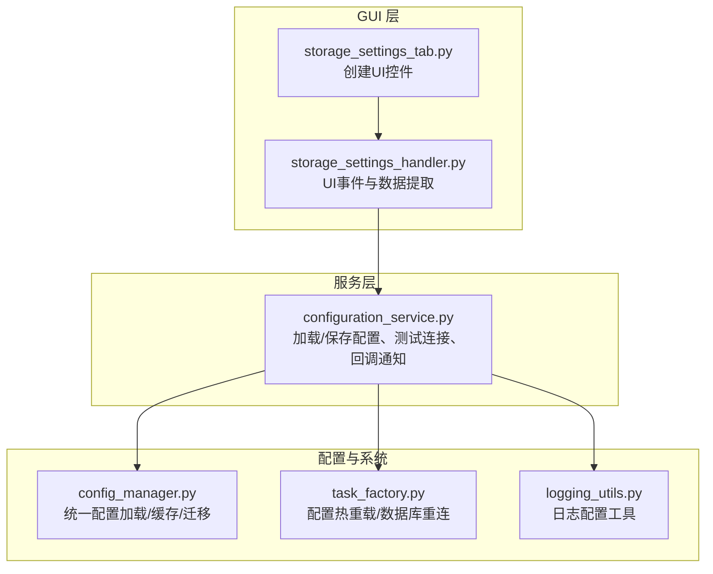
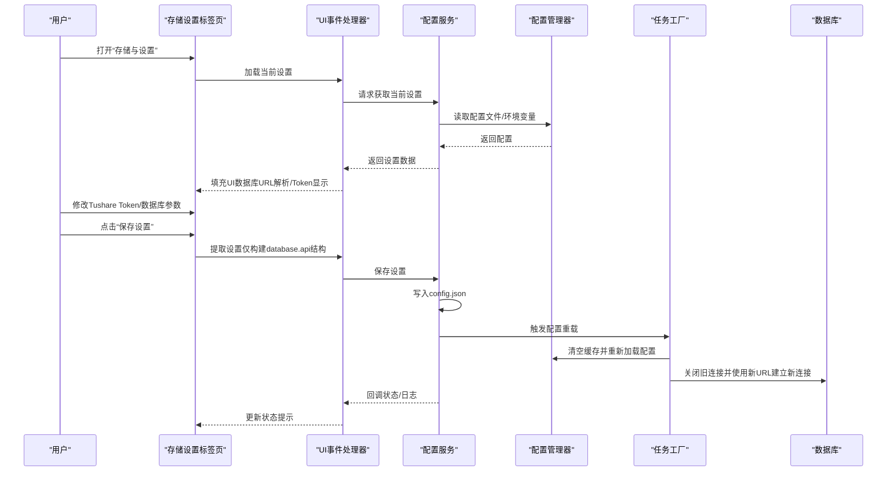
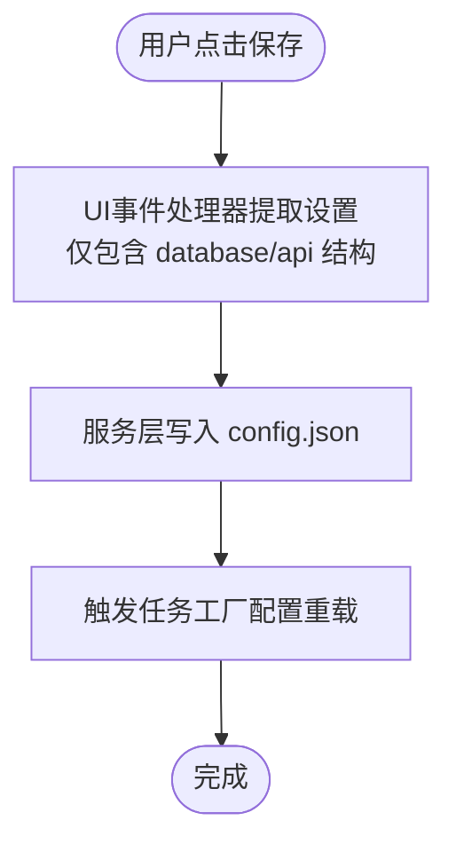
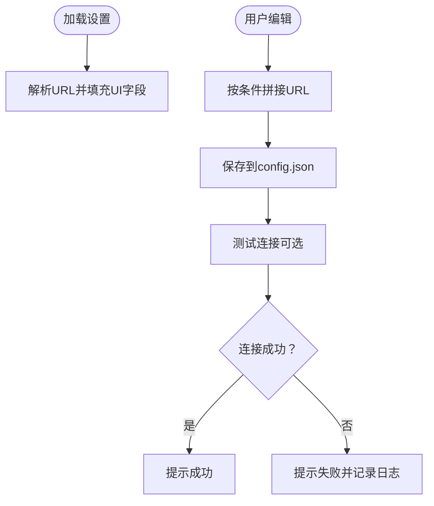
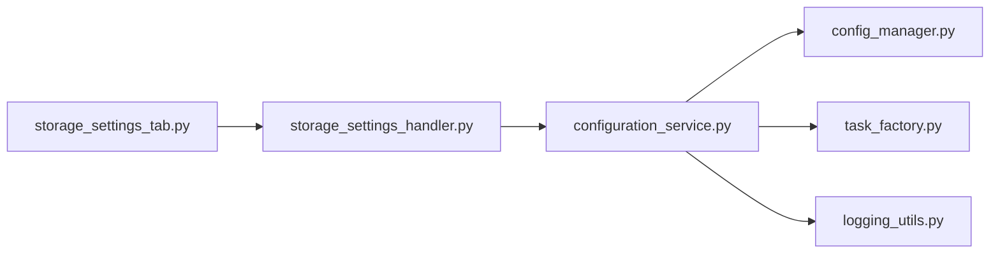

# 存储与设置

<cite>
**本文引用的文件**
- [config.example.json](file://config.example.json)
- [config_manager.py](file://alphahome/common/config_manager.py)
- [configuration_service.py](file://alphahome/gui/services/configuration_service.py)
- [storage_settings_tab.py](file://alphahome/gui/ui/storage_settings_tab.py)
- [storage_settings_handler.py](file://alphahome/gui/handlers/storage_settings_handler.py)
- [logging_utils.py](file://alphahome/common/logging_utils.py)
- [task_factory.py](file://alphahome/common/task_system/task_factory.py)
- [configuration.md](file://docs/setup/configuration.md)
</cite>

## 目录
1. [简介](#简介)
2. [项目结构](#项目结构)
3. [核心组件](#核心组件)
4. [架构总览](#架构总览)
5. [详细组件分析](#详细组件分析)
6. [依赖分析](#依赖分析)
7. [性能考量](#性能考量)
8. [故障排查指南](#故障排查指南)
9. [结论](#结论)
10. [附录](#附录)

## 简介
本章节聚焦“存储与设置”标签页的配置功能，围绕以下目标展开：
- Tushare Token 的输入与保存机制，强调仅更新 config.json 中的 token 字段而不影响其他配置项的安全设计
- 数据库连接参数的显示与修改方式，以及如何验证配置的有效性
- 日志级别设置、数据存储路径配置及其对系统行为的影响
- 配置文件备份与恢复的最佳实践，以及 config.example.json 作为模板的作用
- 权限管理与敏感信息保护建议

## 项目结构
“存储与设置”标签页由 GUI 层负责呈现与交互，服务层负责读取/保存配置与触发重载，底层配置管理器负责统一加载与缓存配置，任务工厂负责在配置变更后进行热重载。

图表来源
- [storage_settings_tab.py](file://alphahome/gui/ui/storage_settings_tab.py#L1-L158)
- [storage_settings_handler.py](file://alphahome/gui/handlers/storage_settings_handler.py#L1-L119)
- [configuration_service.py](file://alphahome/gui/services/configuration_service.py#L1-L135)
- [config_manager.py](file://alphahome/common/config_manager.py#L1-L265)
- [task_factory.py](file://alphahome/common/task_system/task_factory.py#L30-L121)
- [logging_utils.py](file://alphahome/common/logging_utils.py#L1-L190)

章节来源
- [storage_settings_tab.py](file://alphahome/gui/ui/storage_settings_tab.py#L1-L158)
- [storage_settings_handler.py](file://alphahome/gui/handlers/storage_settings_handler.py#L1-L119)
- [configuration_service.py](file://alphahome/gui/services/configuration_service.py#L1-L135)
- [config_manager.py](file://alphahome/common/config_manager.py#L1-L265)
- [task_factory.py](file://alphahome/common/task_system/task_factory.py#L30-L121)
- [logging_utils.py](file://alphahome/common/logging_utils.py#L1-L190)

## 核心组件
- 配置管理器（ConfigManager）：负责加载/缓存/迁移配置，支持环境变量回退；提供数据库URL与Tushare Token读取接口
- 存储设置服务（configuration_service）：负责读取/保存 config.json，触发任务工厂热重载，测试数据库连接
- 存储设置UI（storage_settings_tab + storage_settings_handler）：负责渲染数据库与Tushare Token输入框、显示只读数据库信息、测试连接、保存设置
- 日志工具（logging_utils）：提供统一日志初始化与查询能力
- 任务工厂（task_factory）：在配置变更后关闭旧连接、重新加载配置并建立新连接

章节来源
- [config_manager.py](file://alphahome/common/config_manager.py#L1-L265)
- [configuration_service.py](file://alphahome/gui/services/configuration_service.py#L1-L135)
- [storage_settings_tab.py](file://alphahome/gui/ui/storage_settings_tab.py#L1-L158)
- [storage_settings_handler.py](file://alphahome/gui/handlers/storage_settings_handler.py#L1-L119)
- [logging_utils.py](file://alphahome/common/logging_utils.py#L1-L190)
- [task_factory.py](file://alphahome/common/task_system/task_factory.py#L30-L121)

## 架构总览
下图展示了“存储与设置”标签页从 UI 到服务再到系统配置的完整流程。

图表来源
- [storage_settings_tab.py](file://alphahome/gui/ui/storage_settings_tab.py#L1-L158)
- [storage_settings_handler.py](file://alphahome/gui/handlers/storage_settings_handler.py#L1-L119)
- [configuration_service.py](file://alphahome/gui/services/configuration_service.py#L1-L135)
- [config_manager.py](file://alphahome/common/config_manager.py#L1-L265)
- [task_factory.py](file://alphahome/common/task_system/task_factory.py#L30-L121)

## 详细组件分析

### Tushare Token 输入与保存机制
- UI 展示：标签页提供“Tushare Token”输入框，用户可直接编辑
- 数据提取：UI 事件处理器仅从 UI 收集数据库参数与 Token，并组装为包含 database 与 api 两个顶级键的对象
- 保存策略：服务层将该对象整体写入 config.json，不改变其他顶级键（如 tasks、performance、backtesting 等）
- 读取策略：配置管理器提供 get_tushare_token 接口，优先从配置文件读取，缺失时回退到环境变量
- 安全设计：仅更新 token 字段，其他配置项不受影响，避免误改导致系统不稳定

图表来源
- [storage_settings_handler.py](file://alphahome/gui/handlers/storage_settings_handler.py#L40-L72)
- [configuration_service.py](file://alphahome/gui/services/configuration_service.py#L69-L96)
- [config_manager.py](file://alphahome/common/config_manager.py#L168-L175)

章节来源
- [storage_settings_tab.py](file://alphahome/gui/ui/storage_settings_tab.py#L37-L48)
- [storage_settings_handler.py](file://alphahome/gui/handlers/storage_settings_handler.py#L40-L72)
- [configuration_service.py](file://alphahome/gui/services/configuration_service.py#L69-L96)
- [config_manager.py](file://alphahome/common/config_manager.py#L168-L175)

### 数据库连接参数的显示与修改
- 显示方式：UI 以明文显示数据库URL各部分（主机、端口、数据库名、用户名、密码），但密码输入框使用掩码显示
- 修改方式：UI 事件处理器从 UI 组装数据库URL，仅在主机、数据库名、用户名均非空时才生成URL
- 保存方式：服务层将包含 database.url 的对象写入 config.json
- 只读提示：UI 明确提示“数据库设置当前为只读，用于展示从配置文件加载的信息”，强调保存仅更新 Token
- 测试连接：UI 提供“测试数据库连接”按钮，服务层使用临时数据库管理器进行连接测试并返回结果

图表来源
- [storage_settings_tab.py](file://alphahome/gui/ui/storage_settings_tab.py#L17-L36)
- [storage_settings_handler.py](file://alphahome/gui/handlers/storage_settings_handler.py#L93-L114)
- [storage_settings_handler.py](file://alphahome/gui/handlers/storage_settings_handler.py#L73-L92)
- [configuration_service.py](file://alphahome/gui/services/configuration_service.py#L99-L135)

章节来源
- [storage_settings_tab.py](file://alphahome/gui/ui/storage_settings_tab.py#L17-L36)
- [storage_settings_handler.py](file://alphahome/gui/handlers/storage_settings_handler.py#L73-L114)
- [configuration_service.py](file://alphahome/gui/services/configuration_service.py#L99-L135)

### 配置有效性验证
- 配置文件加载：服务层从 config.json 读取，支持 UTF-8 与 GBK 编码回退
- 环境变量回退：数据库URL与 Tushare Token 可通过环境变量注入
- 任务工厂热重载：保存后立即触发 UnifiedTaskFactory.reload_config，关闭旧连接、重新加载配置并建立新连接
- 日志记录：服务层与任务工厂在关键步骤输出日志，便于排障

章节来源
- [configuration_service.py](file://alphahome/gui/services/configuration_service.py#L51-L67)
- [config_manager.py](file://alphahome/common/config_manager.py#L45-L112)
- [task_factory.py](file://alphahome/common/task_system/task_factory.py#L67-L121)

### 日志级别设置与数据存储路径
- 日志级别：可通过日志工具统一设置日志级别、格式、输出位置等
- 数据存储路径：系统通过配置文件中的 database.url 与任务配置决定数据存储位置；回测相关路径可在 backtesting 配置中设置
- 行为影响：日志级别提升有助于定位配置问题；数据存储路径错误会导致连接失败或数据写入异常

章节来源
- [logging_utils.py](file://alphahome/common/logging_utils.py#L48-L131)
- [config.example.json](file://config.example.json#L1-L63)
- [configuration.md](file://docs/setup/configuration.md#L159-L179)

### 配置文件备份与恢复最佳实践
- 备份：保存前建议先备份当前 config.json，使用时间戳命名，便于回溯
- 恢复：从备份文件恢复到 config.json，然后触发配置重载
- 版本管理：文档提供了热重载与版本管理的命令示例

章节来源
- [configuration.md](file://docs/setup/configuration.md#L293-L311)

### config.example.json 作为模板的作用
- 模板内容：包含 database、api、performance、tasks、backtesting 等完整结构示例
- 使用方式：将模板复制到用户配置目录并按需填写，作为初始配置参考
- 与实际配置的关系：实际运行时以用户目录下的 config.json 为准，模板用于对照与校验

章节来源
- [config.example.json](file://config.example.json#L1-L63)

### 权限管理与敏感信息保护建议
- 敏感信息：数据库密码、Tushare Token 等应尽量通过环境变量注入，避免硬编码到配置文件
- 文件权限：限制 config.json 的文件权限，防止被非授权用户读取
- 轮换策略：定期轮换 API 令牌，降低泄露风险
- 日志脱敏：避免在日志中打印敏感信息，必要时进行脱敏处理

章节来源
- [configuration.md](file://docs/setup/configuration.md#L181-L200)
- [configuration.md](file://docs/setup/configuration.md#L283-L287)

## 依赖分析
- UI 与服务层：UI 控件与事件处理器通过服务层间接访问配置文件与系统能力
- 服务层与配置层：服务层依赖配置管理器读取/写入配置，并在保存后触发任务工厂热重载
- 任务工厂与配置层：任务工厂在配置变更后重新加载并重建数据库连接
- 日志工具：服务层与任务工厂均使用日志工具输出状态与错误信息

图表来源
- [storage_settings_tab.py](file://alphahome/gui/ui/storage_settings_tab.py#L1-L158)
- [storage_settings_handler.py](file://alphahome/gui/handlers/storage_settings_handler.py#L1-L119)
- [configuration_service.py](file://alphahome/gui/services/configuration_service.py#L1-L135)
- [config_manager.py](file://alphahome/common/config_manager.py#L1-L265)
- [task_factory.py](file://alphahome/common/task_system/task_factory.py#L30-L121)
- [logging_utils.py](file://alphahome/common/logging_utils.py#L1-L190)

章节来源
- [storage_settings_tab.py](file://alphahome/gui/ui/storage_settings_tab.py#L1-L158)
- [storage_settings_handler.py](file://alphahome/gui/handlers/storage_settings_handler.py#L1-L119)
- [configuration_service.py](file://alphahome/gui/services/configuration_service.py#L1-L135)
- [config_manager.py](file://alphahome/common/config_manager.py#L1-L265)
- [task_factory.py](file://alphahome/common/task_system/task_factory.py#L30-L121)
- [logging_utils.py](file://alphahome/common/logging_utils.py#L1-L190)

## 性能考量
- 连接池与批处理：合理设置数据库连接池大小与批处理大小，有助于提升数据写入效率
- 并发与重试：根据任务特性设置并发限制与重试策略，避免过度占用资源
- 缓存与监控：启用必要的缓存与性能监控，有助于定位瓶颈

章节来源
- [configuration.md](file://docs/setup/configuration.md#L273-L282)
- [config.example.json](file://config.example.json#L1-L63)

## 故障排查指南
- 数据库连接失败
  - 检查 URL 格式与凭据
  - 使用“测试数据库连接”按钮快速验证
  - 查看日志输出定位具体错误
- API 调用失败
  - 校验 Tushare Token 有效性
  - 检查网络与配额
- 配置未生效
  - 确认保存后触发了配置重载
  - 若重载失败，按提示重启应用以确保完全生效

章节来源
- [configuration_service.py](file://alphahome/gui/services/configuration_service.py#L99-L135)
- [configuration.md](file://docs/setup/configuration.md#L312-L340)

## 结论
“存储与设置”标签页通过清晰的 UI 分层与严格的服务层封装，实现了对 Tushare Token 的安全更新与数据库连接参数的可控修改。服务层在保存配置后主动触发任务工厂热重载，确保系统在不重启的情况下应用新配置。配合日志工具与配置模板，用户可以高效地完成配置管理、验证与故障排查。

## 附录
- 配置文件位置与结构参考：见配置文档与示例模板
- 环境变量支持：数据库URL与 Tushare Token 可通过环境变量注入
- 热重载与版本管理：文档提供了热重载与备份/恢复命令示例

章节来源
- [configuration.md](file://docs/setup/configuration.md#L1-L345)
- [config.example.json](file://config.example.json#L1-L63)