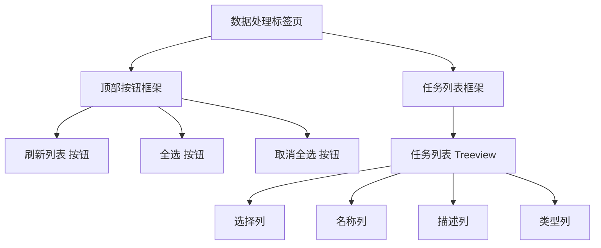
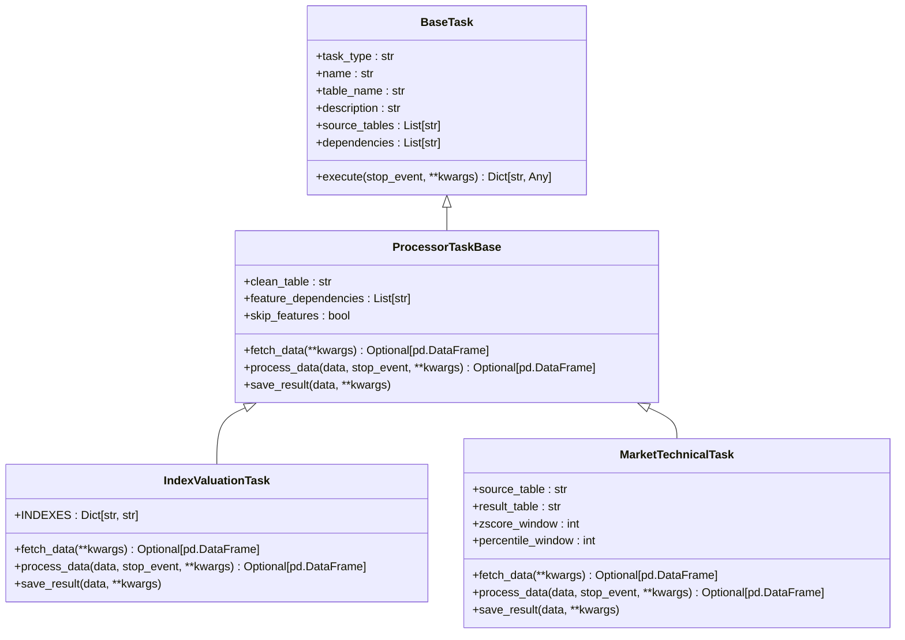
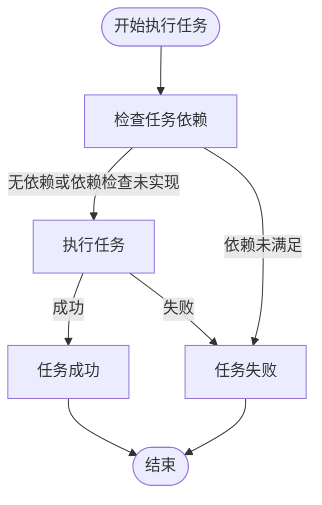
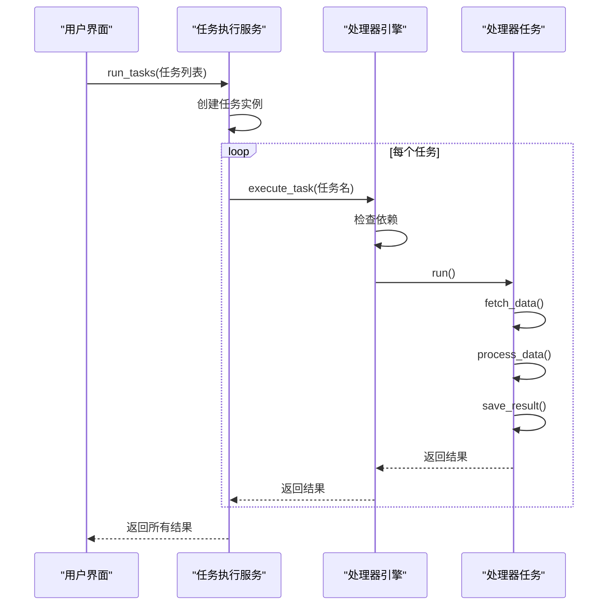

# 数据处理标签页

<cite>
**本文档引用的文件**   
- [data_processing_tab.py](file://alphahome/gui/ui/data_processing_tab.py)
- [processor_engine.py](file://alphahome/processors/engine/processor_engine.py)
- [task_execution_service.py](file://alphahome/gui/services/task_execution_service.py)
- [index_valuation.py](file://alphahome/processors/tasks/index/index_valuation.py)
- [market_technical.py](file://alphahome/processors/tasks/market/market_technical.py)
- [base_task.py](file://alphahome/common/task_system/base_task.py)
- [task_factory.py](file://alphahome/common/task_system/task_factory.py)
- [task_decorator.py](file://alphahome/common/task_system/task_decorator.py)
</cite>

## 目录
1. [简介](#简介)
2. [数据处理标签页用户界面](#数据处理标签页用户界面)
3. [处理器任务组织结构](#处理器任务组织结构)
4. [任务依赖关系与执行顺序](#任务依赖关系与执行顺序)
5. [任务调度流程](#任务调度流程)
6. [操作示例：运行指数估值任务](#操作示例运行指数估值任务)
7. [错误处理与进度反馈](#错误处理与进度反馈)

## 简介
数据处理标签页是系统中用于执行和管理数据处理任务的核心界面。它允许用户选择特定的处理任务（如指数估值、市场技术指标等），并触发其执行。系统通过`ProcessorEngine`协调任务的执行，负责任务的调度、并发控制、执行监控和资源管理。该标签页与任务执行服务和处理器引擎紧密集成，为用户提供了一个直观的界面来管理和监控数据处理流程。

## 数据处理标签页用户界面

数据处理标签页的用户界面由`data_processing_tab.py`文件定义，使用Tkinter框架构建。该界面提供了一个表格视图，用于展示所有可用的处理器任务，并允许用户进行选择和操作。

**Diagram sources**
- [data_processing_tab.py](file://alphahome/gui/ui/data_processing_tab.py#L1-L82)

**Section sources**
- [data_processing_tab.py](file://alphahome/gui/ui/data_processing_tab.py#L1-L82)

## 处理器任务组织结构

处理器任务是系统中执行具体数据处理逻辑的单元。它们被组织在`alphahome/processors/tasks`目录下，按业务领域（如`index`、`market`）进行分类。每个任务都是一个继承自`ProcessorTaskBase`的类，并通过`@task_register()`装饰器进行注册。

### 任务基类与注册机制
所有处理器任务都继承自`ProcessorTaskBase`类，该类定义了任务的通用接口和属性。关键属性包括：
- `name`: 任务的唯一标识符。
- `table_name`: 处理结果将要保存的目标表名。
- `description`: 任务的描述信息。
- `source_tables`: 任务依赖的源数据表列表，用于数据血缘追踪。
- `dependencies`: 任务依赖的其他任务列表。

任务通过`@task_register()`装饰器自动注册到`UnifiedTaskFactory`中。该工厂负责管理所有任务的生命周期，包括实例化和配置。

**Diagram sources**
- [base_task.py](file://alphahome/common/task_system/base_task.py#L14-825)
- [task_decorator.py](file://alphahome/common/task_system/task_decorator.py#L1-77)
- [index_valuation.py](file://alphahome/processors/tasks/index/index_valuation.py#L1-L177)
- [market_technical.py](file://alphahome/processors/tasks/market/market_technical.py#L1-L384)

**Section sources**
- [base_task.py](file://alphahome/common/task_system/base_task.py#L14-825)
- [task_decorator.py](file://alphahome/common/task_system/task_decorator.py#L1-77)

## 任务依赖关系与执行顺序

系统支持任务间的依赖关系管理。任务的`dependencies`属性定义了其前置依赖任务。在任务执行前，系统会检查这些依赖是否已成功完成。

### 依赖关系解析
`ProcessorEngine`类中的`_check_dependencies`方法负责检查任务依赖。目前，该功能的实现框架已存在，但具体的依赖验证逻辑尚未完全实现。它会记录日志并发出警告，提示依赖检查功能尚未激活。

**Diagram sources**
- [processor_engine.py](file://alphahome/processors/engine/processor_engine.py#L325-L361)

**Section sources**
- [processor_engine.py](file://alphahome/processors/engine/processor_engine.py#L325-L361)

## 任务调度流程

当用户在数据处理标签页上选择任务并点击执行时，系统会启动一个复杂的调度流程，该流程由`task_execution_service.py`和`processor_engine.py`协同完成。

### 调度流程详解
1.  **用户触发**: 用户在UI上选择任务并点击“执行”按钮。
2.  **服务层处理**: `task_execution_service.run_tasks`方法被调用，它会为每个选中的任务创建一个任务实例。
3.  **实例化**: 通过`UnifiedTaskFactory.create_task_instance`方法，根据任务名称创建一个干净的任务实例，并注入数据库连接和配置参数。
4.  **引擎调度**: `ProcessorEngine.execute_tasks`方法被调用，根据用户选择的模式（并行或顺序）来调度任务的执行。
5.  **任务执行**: 对于每个任务，`ProcessorEngine.execute_task`方法会调用任务的`run`方法，执行完整的处理流程（获取数据、处理数据、保存结果）。
6.  **结果返回**: 执行结果被收集并返回给服务层，最终反馈给UI。

**Diagram sources**
- [task_execution_service.py](file://alphahome/gui/services/task_execution_service.py#L124-L302)
- [processor_engine.py](file://alphahome/processors/engine/processor_engine.py#L141-L242)

**Section sources**
- [task_execution_service.py](file://alphahome/gui/services/task_execution_service.py#L124-L302)
- [processor_engine.py](file://alphahome/processors/engine/processor_engine.py#L141-L242)

## 操作示例：运行指数估值任务

以运行`index_valuation`任务为例，说明用户如何通过数据处理标签页执行一个具体的处理任务。

1.  **选择任务**: 用户在数据处理标签页的任务列表中找到名为“核心指数估值与ERP”的任务（其`name`为`index_valuation`），并勾选其前面的复选框。
2.  **配置参数**: 用户可以选择执行模式（如“智能增量”、“全量更新”）和日期范围。
3.  **触发执行**: 用户点击“执行”按钮。
4.  **系统响应**: 系统调用`ProcessorEngine`，传入`index_valuation`作为任务名。
5.  **数据获取**: `IndexValuationTask.fetch_data`方法被调用，从`tushare.index_dailybasic`和`akshare.macro_bond_rate`表中获取原始数据。
6.  **数据处理**: `IndexValuationTask.process_data`方法被调用，计算PE/PB的滚动分位数和ERP。
7.  **结果保存**: `IndexValuationTask.save_result`方法被调用，将计算结果保存到`processor_index_valuation`表中。
8.  **反馈结果**: 执行结果（成功、失败、处理行数等）通过日志和状态更新反馈给用户。

**Section sources**
- [index_valuation.py](file://alphahome/processors/tasks/index/index_valuation.py#L1-L177)

## 错误处理与进度反馈

系统提供了完善的错误处理和进度反馈机制，确保用户能够及时了解任务的执行状态。

### 错误处理
-   **任务级错误**: 如果任务执行失败（如数据库查询错误、计算逻辑异常），`ProcessorEngine`会捕获异常，将任务状态标记为“失败”，并记录详细的错误信息。
-   **引擎级错误**: 引擎本身会进行错误处理，例如在任务执行超时时抛出异常。
-   **依赖检查**: 虽然依赖检查功能尚未完全实现，但其框架已存在，未来将能阻止依赖未满足的任务执行。

### 进度反馈
-   **日志输出**: 系统通过`_send_response_callback`将详细的执行日志（如“开始执行任务”、“任务执行完成”）实时发送到UI，显示在日志区域。
-   **状态更新**: 任务的执行状态（运行中、成功、失败、已取消）会被记录到数据库的`task_status`表中，并实时刷新到UI的任务列表中，让用户一目了然。
-   **统计信息**: `ProcessorEngine`会维护执行统计信息，如总任务数、成功任务数、平均执行时间等，可用于生成执行报告。

**Section sources**
- [processor_engine.py](file://alphahome/processors/engine/processor_engine.py#L178-L242)
- [task_execution_service.py](file://alphahome/gui/services/task_execution_service.py#L119-L123)