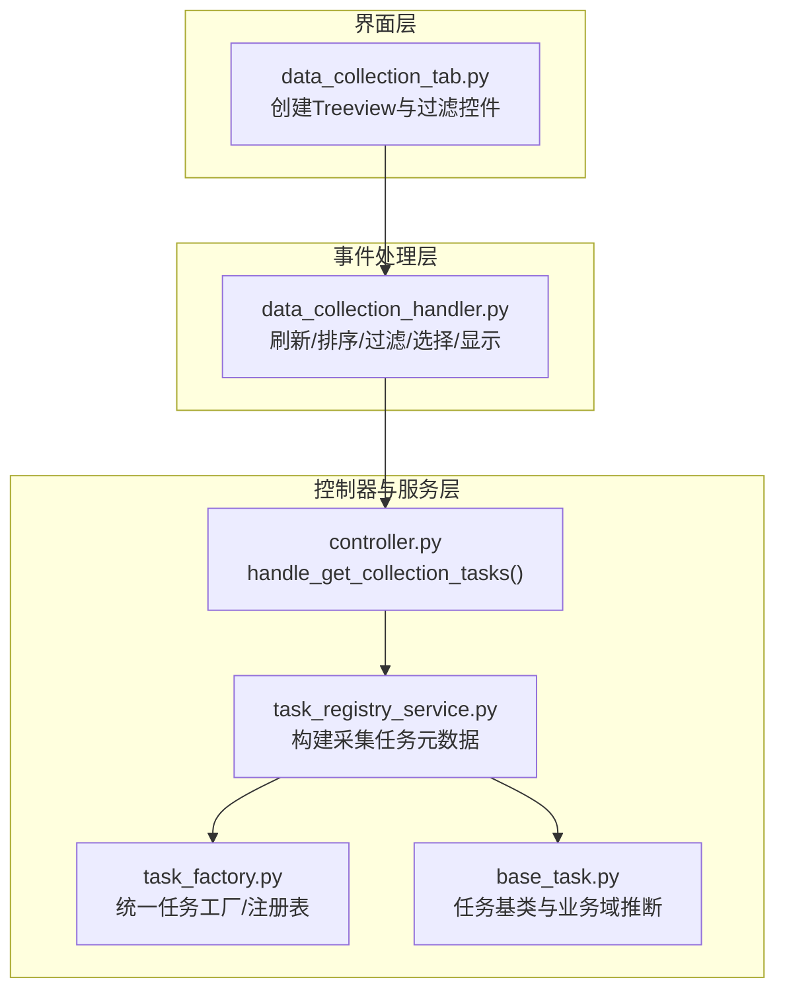
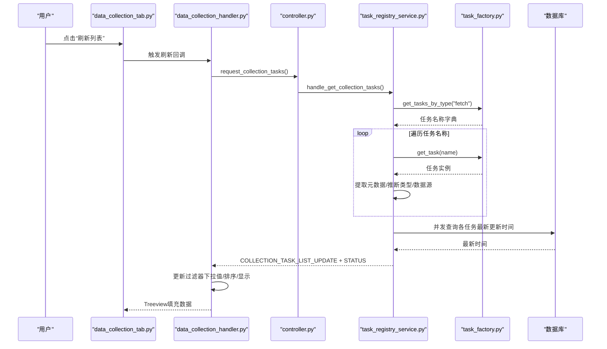
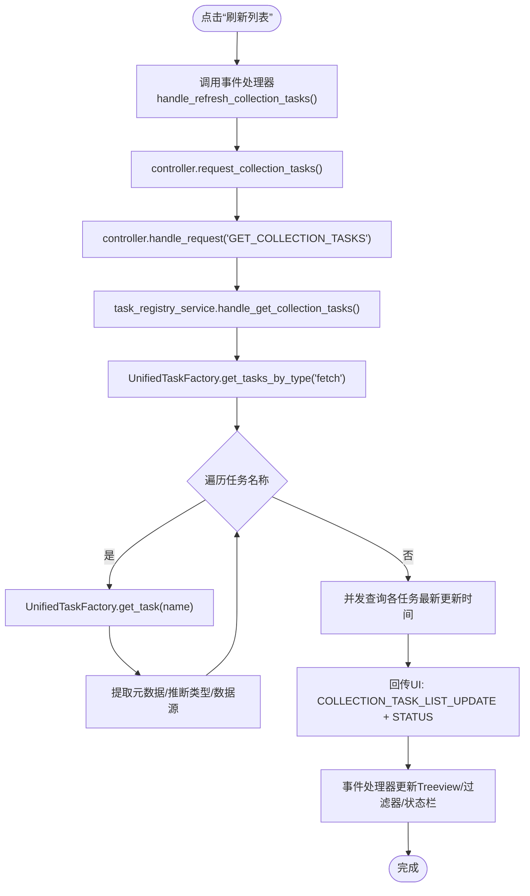
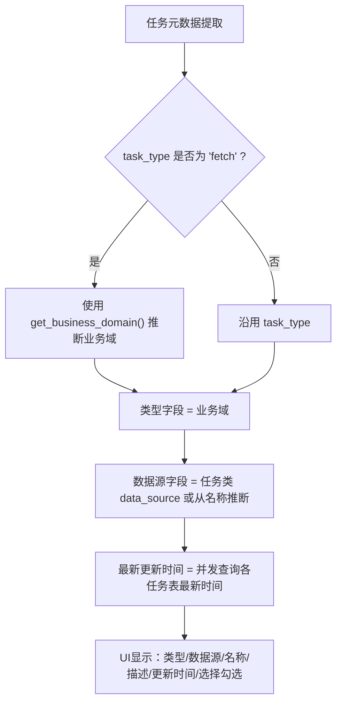
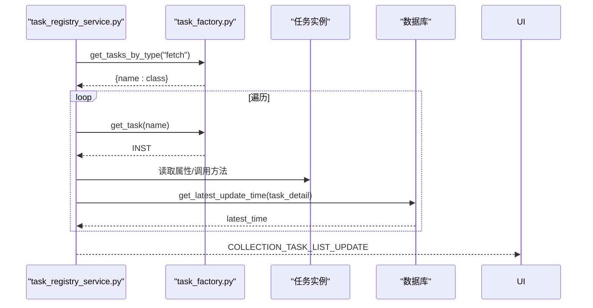
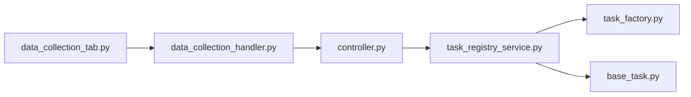

# 数据采集标签页

<cite>
**本文引用的文件**
- [data_collection_tab.py](file://alphahome/gui/ui/data_collection_tab.py)
- [data_collection_handler.py](file://alphahome/gui/handlers/data_collection_handler.py)
- [controller.py](file://alphahome/gui/controller.py)
- [task_registry_service.py](file://alphahome/gui/services/task_registry_service.py)
- [base_task.py](file://alphahome/common/task_system/base_task.py)
- [task_factory.py](file://alphahome/common/task_system/task_factory.py)
- [tushare_stock_basic.py](file://alphahome/fetchers/tasks/stock/tushare_stock_basic.py)
- [tushare_fund_basic.py](file://alphahome/fetchers/tasks/fund/tushare_fund_basic.py)
- [tushare_index_basic.py](file://alphahome/fetchers/tasks/index/tushare_index_basic.py)
</cite>

## 目录
1. [简介](#简介)
2. [项目结构](#项目结构)
3. [核心组件](#核心组件)
4. [架构总览](#架构总览)
5. [详细组件分析](#详细组件分析)
6. [依赖关系分析](#依赖关系分析)
7. [性能考量](#性能考量)
8. [故障排查指南](#故障排查指南)
9. [结论](#结论)

## 简介
本章节面向“数据采集标签页”的使用与实现，重点说明：
- 任务列表的动态加载机制与触发流程
- 如何通过控制器方法获取可用采集任务
- 任务分类（如股票、基金、指数等）与状态显示逻辑
- 任务过滤与搜索功能的实现方式
- 用户如何选择多个任务进行批量提交
- 任务元数据的获取流程与来源
- 常见问题排查（如任务列表为空）

## 项目结构
数据采集标签页由三层协作构成：
- UI 层：负责界面布局与交互控件
- 事件处理器层：负责响应用户操作并驱动数据更新
- 控制器与服务层：负责与任务注册服务、任务工厂、数据库交互，组装任务元数据并回传UI

图表来源
- [data_collection_tab.py](file://alphahome/gui/ui/data_collection_tab.py#L1-L130)
- [data_collection_handler.py](file://alphahome/gui/handlers/data_collection_handler.py#L1-L232)
- [controller.py](file://alphahome/gui/controller.py#L180-L206)
- [task_registry_service.py](file://alphahome/gui/services/task_registry_service.py#L65-L127)
- [task_factory.py](file://alphahome/common/task_system/task_factory.py#L140-L184)
- [base_task.py](file://alphahome/common/task_system/base_task.py#L84-L111)

章节来源
- [data_collection_tab.py](file://alphahome/gui/ui/data_collection_tab.py#L1-L130)
- [data_collection_handler.py](file://alphahome/gui/handlers/data_collection_handler.py#L1-L232)
- [controller.py](file://alphahome/gui/controller.py#L180-L206)
- [task_registry_service.py](file://alphahome/gui/services/task_registry_service.py#L65-L127)
- [task_factory.py](file://alphahome/common/task_system/task_factory.py#L140-L184)
- [base_task.py](file://alphahome/common/task_system/base_task.py#L84-L111)

## 核心组件
- 数据采集标签页UI：创建Treeview表格、过滤控件（名称、数据源、类型），并提供“刷新列表”“全选/取消全选”等按钮。
- 事件处理器：负责刷新任务列表、全选/取消全选、点击切换选择、排序、过滤、更新状态栏与UI显示。
- 控制器：对外暴露异步请求入口，委派给任务注册服务获取采集任务。
- 任务注册服务：从任务工厂获取任务集合，提取元数据（名称、类型、数据源、描述、表名等），并发查询每个任务的最新更新时间，回传UI。
- 任务工厂与基类：提供任务注册表、按类型检索、实例化能力；基类提供业务域推断逻辑，用于更准确的任务分类。

章节来源
- [data_collection_tab.py](file://alphahome/gui/ui/data_collection_tab.py#L1-L130)
- [data_collection_handler.py](file://alphahome/gui/handlers/data_collection_handler.py#L1-L232)
- [controller.py](file://alphahome/gui/controller.py#L180-L206)
- [task_registry_service.py](file://alphahome/gui/services/task_registry_service.py#L65-L127)
- [task_factory.py](file://alphahome/common/task_system/task_factory.py#L140-L184)
- [base_task.py](file://alphahome/common/task_system/base_task.py#L84-L111)

## 架构总览
下面的序列图展示了“刷新任务列表”的完整调用链路，从UI按钮到最终UI渲染。

图表来源
- [data_collection_tab.py](file://alphahome/gui/ui/data_collection_tab.py#L24-L129)
- [data_collection_handler.py](file://alphahome/gui/handlers/data_collection_handler.py#L31-L146)
- [controller.py](file://alphahome/gui/controller.py#L286-L310)
- [task_registry_service.py](file://alphahome/gui/services/task_registry_service.py#L65-L127)
- [task_factory.py](file://alphahome/common/task_system/task_factory.py#L151-L184)

## 详细组件分析

### 1) 任务列表动态加载与刷新
- 触发入口：UI中的“刷新列表”按钮绑定到事件处理器，事件处理器调用控制器的请求函数。
- 控制器委派：控制器将“获取采集任务”请求委派给任务注册服务。
- 服务组装：服务从任务工厂按类型获取任务集合，逐个实例化以提取元数据；随后并发查询每个任务的最新更新时间。
- 回调渲染：服务通过响应回调将任务列表与状态消息回传至UI，事件处理器更新Treeview与过滤器选项。

图表来源
- [data_collection_handler.py](file://alphahome/gui/handlers/data_collection_handler.py#L31-L146)
- [controller.py](file://alphahome/gui/controller.py#L286-L310)
- [task_registry_service.py](file://alphahome/gui/services/task_registry_service.py#L65-L127)
- [task_factory.py](file://alphahome/common/task_system/task_factory.py#L151-L184)

章节来源
- [data_collection_handler.py](file://alphahome/gui/handlers/data_collection_handler.py#L31-L146)
- [controller.py](file://alphahome/gui/controller.py#L286-L310)
- [task_registry_service.py](file://alphahome/gui/services/task_registry_service.py#L65-L127)
- [task_factory.py](file://alphahome/common/task_system/task_factory.py#L151-L184)

### 2) 任务分类与状态显示逻辑
- 分类依据：
  - 任务类型：来源于任务类的task_type属性，若为“fetch”，进一步使用业务域推断。
  - 业务域推断：优先使用任务实例的domain属性；若未定义，则从任务名称按约定推断（第二段为业务域）；最后回退到数据源。
- 状态显示：
  - 最新更新时间：服务并发查询每个任务对应的表的最新更新时间，并格式化显示；若无对应表或查询失败，显示相应提示。
  - 选择状态：用户点击“选择”列时切换任务的selected标记，事件处理器即时刷新显示。
  - 排序：支持按类型、名称、描述、数据源、更新时间等列排序，点击列头切换升/降序。

图表来源
- [task_registry_service.py](file://alphahome/gui/services/task_registry_service.py#L83-L111)
- [base_task.py](file://alphahome/common/task_system/base_task.py#L84-L111)
- [task_registry_service.py](file://alphahome/gui/services/task_registry_service.py#L259-L307)

章节来源
- [task_registry_service.py](file://alphahome/gui/services/task_registry_service.py#L83-L111)
- [base_task.py](file://alphahome/common/task_system/base_task.py#L84-L111)
- [task_registry_service.py](file://alphahome/gui/services/task_registry_service.py#L259-L307)
- [data_collection_handler.py](file://alphahome/gui/handlers/data_collection_handler.py#L84-L105)

### 3) 任务过滤与搜索功能
- 过滤器：
  - 数据源过滤：从任务列表中收集唯一数据源，填充下拉框；选择后仅显示匹配数据源的任务。
  - 类型过滤：从任务列表中收集唯一类型（业务域），填充下拉框；选择后仅显示匹配类型的任务。
  - 名称过滤：输入框支持模糊匹配任务名称（忽略大小写）。
- 排序：
  - 点击列头切换排序方向；UI将列标题附加箭头指示当前排序方向。
- 刷新后自动恢复过滤状态，保证用户操作连续性。

章节来源
- [data_collection_tab.py](file://alphahome/gui/ui/data_collection_tab.py#L45-L84)
- [data_collection_handler.py](file://alphahome/gui/handlers/data_collection_handler.py#L106-L146)
- [data_collection_handler.py](file://alphahome/gui/handlers/data_collection_handler.py#L148-L204)

### 4) 用户批量选择与提交
- 选择方式：
  - 点击“全选/取消全选”按钮，事件处理器遍历Treeview中的所有任务，切换其selected标记并刷新显示。
  - 点击“选择”列单元格，切换该任务的selected标记并刷新显示。
- 选择结果：
  - 事件处理器提供导出接口，返回当前选中的任务列表（包含任务名、类型、描述、数据源等字段），供后续“运行任务”流程使用。

章节来源
- [data_collection_handler.py](file://alphahome/gui/handlers/data_collection_handler.py#L39-L57)
- [data_collection_handler.py](file://alphahome/gui/handlers/data_collection_handler.py#L58-L83)
- [data_collection_handler.py](file://alphahome/gui/handlers/data_collection_handler.py#L216-L232)

### 5) 任务元数据获取流程
- 来源与组成：
  - 名称：任务类名
  - 类型：若task_type为“fetch”，使用业务域推断；否则沿用task_type
  - 数据源：任务类data_source，若未定义则从任务名推断
  - 描述：任务类description
  - 表名：任务类table_name
  - 选择状态：初始为false，随用户操作切换
- 获取路径：
  - 通过任务工厂按类型获取任务名称集合
  - 逐个实例化任务，提取上述字段
  - 并发查询每个任务表的最新更新时间，格式化后回填

图表来源
- [task_registry_service.py](file://alphahome/gui/services/task_registry_service.py#L65-L127)
- [task_factory.py](file://alphahome/common/task_system/task_factory.py#L151-L184)
- [task_registry_service.py](file://alphahome/gui/services/task_registry_service.py#L259-L307)

章节来源
- [task_registry_service.py](file://alphahome/gui/services/task_registry_service.py#L65-L127)
- [task_factory.py](file://alphahome/common/task_system/task_factory.py#L151-L184)
- [task_registry_service.py](file://alphahome/gui/services/task_registry_service.py#L259-L307)

### 6) 任务分类示例（股票/基金/指数）
- 股票：任务类定义domain为“stock”，名称形如“tushare_stock_basic”，类型显示为“stock”。
- 基金：任务类定义domain为“fund”，名称形如“tushare_fund_basic”，类型显示为“fund”。
- 指数：任务类定义domain为“index”，名称形如“tushare_index_basic”，类型显示为“index”。

章节来源
- [tushare_stock_basic.py](file://alphahome/fetchers/tasks/stock/tushare_stock_basic.py#L24-L36)
- [tushare_fund_basic.py](file://alphahome/fetchers/tasks/fund/tushare_fund_basic.py#L23-L36)
- [tushare_index_basic.py](file://alphahome/fetchers/tasks/index/tushare_index_basic.py#L26-L39)

## 依赖关系分析
- UI层依赖事件处理器提供的回调函数，事件处理器再依赖控制器请求函数。
- 控制器依赖任务注册服务，任务注册服务依赖任务工厂与数据库管理器。
- 任务工厂依赖任务注册表与配置管理，任务基类提供业务域推断与执行生命周期。

图表来源
- [data_collection_tab.py](file://alphahome/gui/ui/data_collection_tab.py#L1-L130)
- [data_collection_handler.py](file://alphahome/gui/handlers/data_collection_handler.py#L1-L232)
- [controller.py](file://alphahome/gui/controller.py#L180-L206)
- [task_registry_service.py](file://alphahome/gui/services/task_registry_service.py#L65-L127)
- [task_factory.py](file://alphahome/common/task_system/task_factory.py#L140-L184)
- [base_task.py](file://alphahome/common/task_system/base_task.py#L84-L111)

章节来源
- [data_collection_tab.py](file://alphahome/gui/ui/data_collection_tab.py#L1-L130)
- [data_collection_handler.py](file://alphahome/gui/handlers/data_collection_handler.py#L1-L232)
- [controller.py](file://alphahome/gui/controller.py#L180-L206)
- [task_registry_service.py](file://alphahome/gui/services/task_registry_service.py#L65-L127)
- [task_factory.py](file://alphahome/common/task_system/task_factory.py#L140-L184)
- [base_task.py](file://alphahome/common/task_system/base_task.py#L84-L111)

## 性能考量
- 并发查询最新更新时间：服务对每个任务单独发起查询，使用并发聚合以缩短总耗时；对耗时超过阈值的任务记录调试日志。
- UI渲染优化：事件处理器在刷新前清空Treeview，按当前过滤/排序条件一次性插入数据，避免多次重绘。
- 任务实例缓存：任务工厂对任务实例进行缓存，减少重复实例化成本；刷新任务列表时仅重建元数据缓存。

章节来源
- [task_registry_service.py](file://alphahome/gui/services/task_registry_service.py#L302-L306)
- [data_collection_handler.py](file://alphahome/gui/handlers/data_collection_handler.py#L167-L203)
- [task_factory.py](file://alphahome/common/task_system/task_factory.py#L273-L310)

## 故障排查指南
- 任务列表为空
  - 检查数据库连接：控制器在未初始化数据库管理器时会向UI发送错误日志，确认“数据库未连接”提示。
  - 检查任务注册：确认任务工厂已正确注册任务类，且任务名称符合约定格式。
  - 检查任务类型：仅“fetch”类型任务会出现在采集任务列表中。
  - 检查数据源/类型过滤：若选择了特定数据源或类型，可能仅显示匹配项；尝试选择“所有类型”或清除过滤器。
- 最新更新时间显示异常
  - 若无对应表：显示“无对应表”。
  - 若查询失败：显示“查询失败”，并记录警告日志。
  - 若数据库不可用：显示“N/A (DB Error)”。
- 选择状态不同步
  - 确认点击的是“选择”列单元格，而非其他列。
  - 刷新后选择状态会保留，若出现异常，尝试重新刷新列表。
- 性能问题
  - 若任务数量较多，刷新耗时可能增加；可适当减少并发或优化网络环境。

章节来源
- [controller.py](file://alphahome/gui/controller.py#L132-L138)
- [task_registry_service.py](file://alphahome/gui/services/task_registry_service.py#L260-L307)
- [data_collection_handler.py](file://alphahome/gui/handlers/data_collection_handler.py#L170-L203)

## 结论
数据采集标签页通过清晰的分层设计实现了高效、直观的任务管理体验：
- 动态加载：一键刷新即可获取最新采集任务列表与状态
- 精准分类：基于业务域的类型推断，确保筛选与显示准确
- 便捷操作：支持名称/数据源/类型三类过滤与排序，支持批量选择
- 稳健回传：服务并发查询最新时间并统一格式化，异常场景具备明确提示
- 易于扩展：任务工厂与基类提供统一接口，新增任务只需遵循命名与属性约定