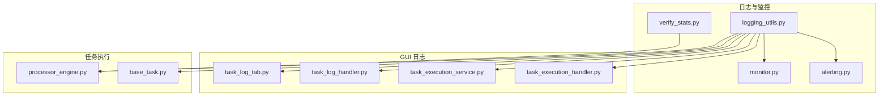
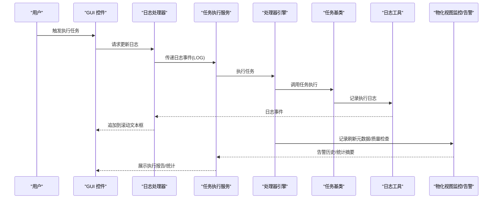
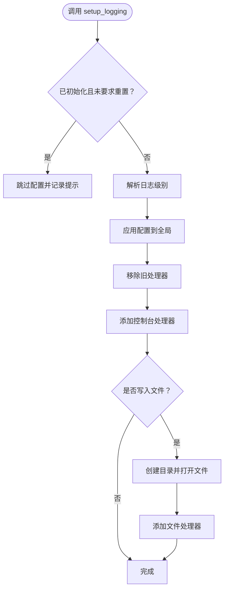
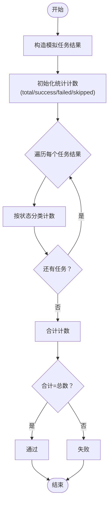
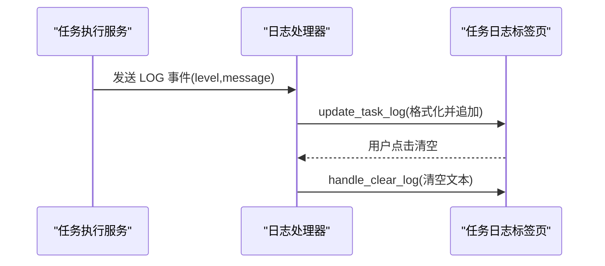
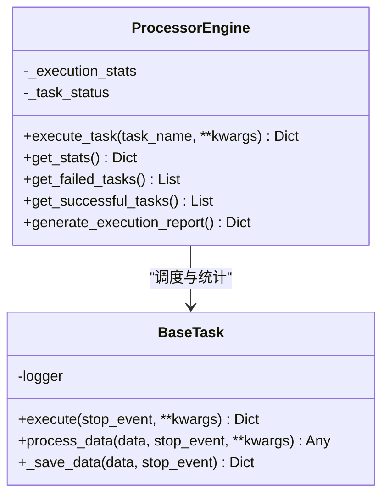
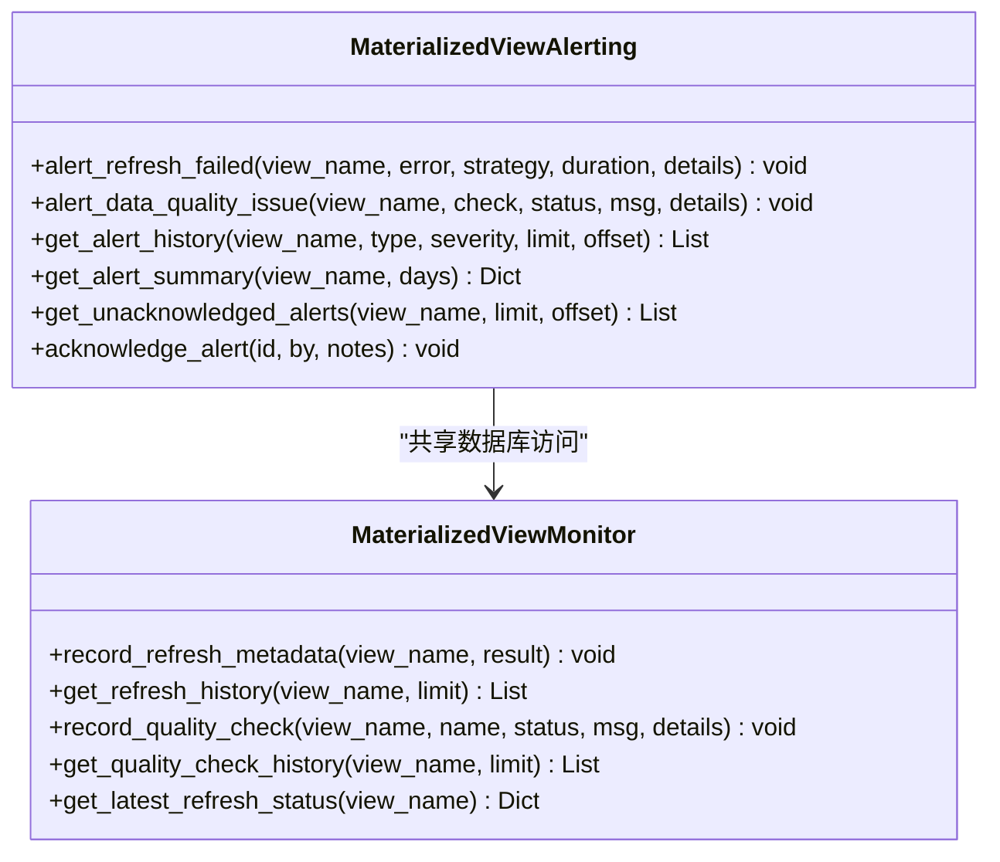
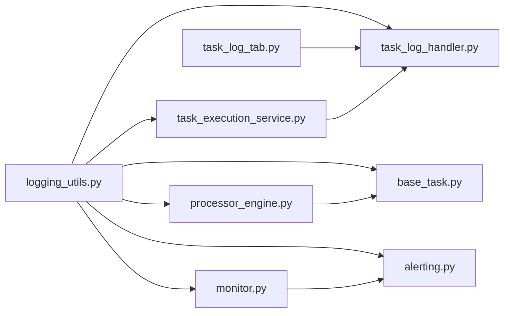

# 监控与日志

<cite>
**本文引用的文件**
- [logging_utils.py](file://alphahome/common/logging_utils.py)
- [verify_stats.py](file://scripts/production/shared/verify_stats.py)
- [task_log_handler.py](file://alphahome/gui/handlers/task_log_handler.py)
- [task_execution_service.py](file://alphahome/gui/services/task_execution_service.py)
- [task_execution_handler.py](file://alphahome/gui/handlers/task_execution_handler.py)
- [task_log_tab.py](file://alphahome/gui/ui/task_log_tab.py)
- [processor_engine.py](file://alphahome/processors/engine/processor_engine.py)
- [base_task.py](file://alphahome/common/task_system/base_task.py)
- [monitor.py](file://alphahome/processors/materialized_views/monitor.py)
- [alerting.py](file://alphahome/processors/materialized_views/alerting.py)
</cite>

## 目录
1. [简介](#简介)
2. [项目结构](#项目结构)
3. [核心组件](#核心组件)
4. [架构总览](#架构总览)
5. [详细组件分析](#详细组件分析)
6. [依赖关系分析](#依赖关系分析)
7. [性能考量](#性能考量)
8. [故障排查指南](#故障排查指南)
9. [结论](#结论)

## 简介
本文件面向运维人员，系统性梳理项目中的监控与日志体系，重点围绕以下目标展开：
- 解释 verify_stats.py 的用途与数据完整性校验逻辑
- 说明 logging_utils.py 的日志级别、输出格式与文件管理策略
- 讲解 GUI 日志处理模块如何捕获与展示任务执行日志
- 提供关键监控指标（任务执行时长、数据更新量、API 调用频率）的采集方法
- 基于日志与数据库记录进行性能瓶颈分析与异常预警机制

## 项目结构
监控与日志相关的关键位置如下：
- 通用日志工具：alphahome/common/logging_utils.py
- 数据完整性校验脚本：scripts/production/shared/verify_stats.py
- GUI 日志展示：alphahome/gui/ui/task_log_tab.py、alphahome/gui/handlers/task_log_handler.py、alphahome/gui/services/task_execution_service.py、alphahome/gui/handlers/task_execution_handler.py
- 处理器引擎与任务系统：alphahome/processors/engine/processor_engine.py、alphahome/common/task_system/base_task.py
- 物化视图监控与告警：alphahome/processors/materialized_views/monitor.py、alphahome/processors/materialized_views/alerting.py

图表来源
- [logging_utils.py](file://alphahome/common/logging_utils.py#L1-L190)
- [verify_stats.py](file://scripts/production/shared/verify_stats.py#L1-L67)
- [task_log_tab.py](file://alphahome/gui/ui/task_log_tab.py#L1-L52)
- [task_log_handler.py](file://alphahome/gui/handlers/task_log_handler.py#L1-L64)
- [task_execution_service.py](file://alphahome/gui/services/task_execution_service.py#L1-L355)
- [task_execution_handler.py](file://alphahome/gui/handlers/task_execution_handler.py#L82-L119)
- [processor_engine.py](file://alphahome/processors/engine/processor_engine.py#L143-L572)
- [base_task.py](file://alphahome/common/task_system/base_task.py#L1-L800)
- [monitor.py](file://alphahome/processors/materialized_views/monitor.py#L1-L407)
- [alerting.py](file://alphahome/processors/materialized_views/alerting.py#L1-L380)

章节来源
- [logging_utils.py](file://alphahome/common/logging_utils.py#L1-L190)
- [verify_stats.py](file://scripts/production/shared/verify_stats.py#L1-L67)
- [task_log_tab.py](file://alphahome/gui/ui/task_log_tab.py#L1-L52)
- [task_log_handler.py](file://alphahome/gui/handlers/task_log_handler.py#L1-L64)
- [task_execution_service.py](file://alphahome/gui/services/task_execution_service.py#L1-L355)
- [task_execution_handler.py](file://alphahome/gui/handlers/task_execution_handler.py#L82-L119)
- [processor_engine.py](file://alphahome/processors/engine/processor_engine.py#L143-L572)
- [base_task.py](file://alphahome/common/task_system/base_task.py#L1-L800)
- [monitor.py](file://alphahome/processors/materialized_views/monitor.py#L1-L407)
- [alerting.py](file://alphahome/processors/materialized_views/alerting.py#L1-L380)

## 核心组件
- 通用日志工具：提供统一的 setup_logging/get_logger 接口，支持控制台与文件输出、格式化、级别管理与配置缓存，避免重复初始化。
- 数据完整性校验脚本：对任务执行结果进行统计与汇总，验证“总数=成功+失败+跳过”的一致性，便于快速定位统计偏差。
- GUI 日志处理：将任务执行产生的日志事件（包含级别与消息）实时追加到界面滚动文本框，支持清空与自动滚动。
- 处理器引擎与任务系统：记录任务执行统计（总任务数、成功/失败/跳过、成功率、平均时长），并提供失败任务与成功任务列表查询。
- 物化视图监控与告警：记录刷新元数据与质量检查结果；提供告警历史、统计摘要、未确认告警与确认流程，支撑异常预警。

章节来源
- [logging_utils.py](file://alphahome/common/logging_utils.py#L1-L190)
- [verify_stats.py](file://scripts/production/shared/verify_stats.py#L1-L67)
- [task_log_handler.py](file://alphahome/gui/handlers/task_log_handler.py#L1-L64)
- [task_execution_service.py](file://alphahome/gui/services/task_execution_service.py#L1-L355)
- [processor_engine.py](file://alphahome/processors/engine/processor_engine.py#L143-L572)
- [monitor.py](file://alphahome/processors/materialized_views/monitor.py#L1-L407)
- [alerting.py](file://alphahome/processors/materialized_views/alerting.py#L1-L380)

## 架构总览
下图展示了从任务执行到日志展示与监控告警的整体链路。

图表来源
- [task_log_tab.py](file://alphahome/gui/ui/task_log_tab.py#L1-L52)
- [task_log_handler.py](file://alphahome/gui/handlers/task_log_handler.py#L1-L64)
- [task_execution_service.py](file://alphahome/gui/services/task_execution_service.py#L1-L355)
- [processor_engine.py](file://alphahome/processors/engine/processor_engine.py#L143-L572)
- [base_task.py](file://alphahome/common/task_system/base_task.py#L1-L800)
- [monitor.py](file://alphahome/processors/materialized_views/monitor.py#L1-L407)
- [alerting.py](file://alphahome/processors/materialized_views/alerting.py#L1-L380)

## 详细组件分析

### 通用日志工具（logging_utils.py）
- 功能要点
  - 初始化：setup_logging 支持设置日志级别、格式、日期格式、是否落盘、日志目录与文件名；避免重复初始化；自动清理旧处理器并按需添加文件处理器。
  - 获取：get_logger 返回带层级继承的 logger，若未初始化则自动采用默认配置。
  - 兼容：提供 log_info/log_warning/log_error/log_exception 辅助函数，便于向后兼容。
- 日志级别与格式
  - 默认级别：INFO
  - 默认格式：包含时间、模块名、级别、消息
  - 日期格式：YYYY-MM-DD HH:MM:SS
- 文件管理策略
  - 可开启文件输出，按日期生成文件名 app_YYYYMMDD.log，默认目录 logs
  - 控制台编码适配（Windows UTF-8）

图表来源
- [logging_utils.py](file://alphahome/common/logging_utils.py#L48-L132)

章节来源
- [logging_utils.py](file://alphahome/common/logging_utils.py#L1-L190)

### verify_stats.py：数据完整性与一致性验证
- 目标：验证任务执行统计逻辑的正确性，确保“总数=成功+失败+跳过”。
- 关键逻辑
  - 输入：模拟任务结果集合（包含任务名、状态、执行时长/错误/消息等）
  - 统计：按状态分类计数（兼容旧状态“completed_with_warnings”归类为成功）
  - 校验：比较计数总和与总数，输出统计摘要与结论
- 使用建议
  - 在生产脚本逻辑变更后，运行该脚本进行回归验证
  - 将统计口径与生产脚本保持一致，避免误判

图表来源
- [verify_stats.py](file://scripts/production/shared/verify_stats.py#L1-L67)

章节来源
- [verify_stats.py](file://scripts/production/shared/verify_stats.py#L1-L67)

### GUI 日志处理模块
- UI 组件
  - 任务日志标签页：ScrolledText 用于展示日志，按钮用于清空
- 事件处理
  - update_task_log：接收日志事件（字符串或字典），格式化为“时间戳+级别+消息”，追加到文本框并自动滚动
  - handle_clear_log：清空日志内容
- 与服务层集成
  - 任务执行服务在关键节点通过回调发送 LOG 事件，驱动 UI 实时更新

图表来源
- [task_log_tab.py](file://alphahome/gui/ui/task_log_tab.py#L1-L52)
- [task_log_handler.py](file://alphahome/gui/handlers/task_log_handler.py#L1-L64)
- [task_execution_service.py](file://alphahome/gui/services/task_execution_service.py#L1-L355)

章节来源
- [task_log_tab.py](file://alphahome/gui/ui/task_log_tab.py#L1-L52)
- [task_log_handler.py](file://alphahome/gui/handlers/task_log_handler.py#L1-L64)
- [task_execution_service.py](file://alphahome/gui/services/task_execution_service.py#L1-L355)
- [task_execution_handler.py](file://alphahome/gui/handlers/task_execution_handler.py#L82-L119)

### 处理器引擎与任务系统（统计与状态）
- 统计指标
  - 总任务数、成功任务数、失败任务数、跳过任务数
  - 成功率 = 成功/总任务
  - 平均执行时长 = 总执行时长/总任务
- 状态追踪
  - 记录每个任务的开始时间、结束时间、状态、错误信息
  - 提供失败/成功任务列表查询
- 关键实现位置
  - 执行单任务：记录开始时间、状态 RUNNING，结束后计算执行时长并更新统计
  - 生成执行报告：汇总统计与失败任务详情

图表来源
- [processor_engine.py](file://alphahome/processors/engine/processor_engine.py#L143-L572)
- [base_task.py](file://alphahome/common/task_system/base_task.py#L1-L800)

章节来源
- [processor_engine.py](file://alphahome/processors/engine/processor_engine.py#L143-L572)
- [base_task.py](file://alphahome/common/task_system/base_task.py#L1-L800)

### 物化视图监控与告警
- 监控
  - 记录刷新元数据（状态、耗时、行数、错误、数据源、策略等）
  - 查询刷新历史与最新状态
  - 记录数据质量检查结果（通过/警告/错误）
  - 查询质量检查历史
- 告警
  - 告警类型与严重级别枚举
  - 刷新失败/超时、数据质量异常、空值/离群/重复/类型不匹配等告警
  - 告警历史查询、统计摘要、未确认告警、确认流程

图表来源
- [monitor.py](file://alphahome/processors/materialized_views/monitor.py#L1-L407)
- [alerting.py](file://alphahome/processors/materialized_views/alerting.py#L1-L380)

章节来源
- [monitor.py](file://alphahome/processors/materialized_views/monitor.py#L1-L407)
- [alerting.py](file://alphahome/processors/materialized_views/alerting.py#L1-L380)

## 依赖关系分析
- 日志工具被广泛使用：GUI 事件处理器、任务执行服务、处理器引擎、任务基类、监控与告警模块均通过 get_logger 记录日志，形成统一的可观测性基础。
- GUI 与服务层耦合：服务层通过回调将日志事件传递给 UI，UI 通过处理器更新文本框，职责清晰。
- 引擎与任务系统：引擎负责统计与状态，任务基类负责执行生命周期与数据处理，二者通过日志与返回结果协同。
- 监控与告警：监控模块记录刷新与质量检查，告警模块将异常转化为结构化告警并持久化，便于运维检索与确认。

图表来源
- [logging_utils.py](file://alphahome/common/logging_utils.py#L1-L190)
- [task_log_tab.py](file://alphahome/gui/ui/task_log_tab.py#L1-L52)
- [task_log_handler.py](file://alphahome/gui/handlers/task_log_handler.py#L1-L64)
- [task_execution_service.py](file://alphahome/gui/services/task_execution_service.py#L1-L355)
- [processor_engine.py](file://alphahome/processors/engine/processor_engine.py#L143-L572)
- [base_task.py](file://alphahome/common/task_system/base_task.py#L1-L800)
- [monitor.py](file://alphahome/processors/materialized_views/monitor.py#L1-L407)
- [alerting.py](file://alphahome/processors/materialized_views/alerting.py#L1-L380)

章节来源
- [logging_utils.py](file://alphahome/common/logging_utils.py#L1-L190)
- [task_log_tab.py](file://alphahome/gui/ui/task_log_tab.py#L1-L52)
- [task_log_handler.py](file://alphahome/gui/handlers/task_log_handler.py#L1-L64)
- [task_execution_service.py](file://alphahome/gui/services/task_execution_service.py#L1-L355)
- [processor_engine.py](file://alphahome/processors/engine/processor_engine.py#L143-L572)
- [base_task.py](file://alphahome/common/task_system/base_task.py#L1-L800)
- [monitor.py](file://alphahome/processors/materialized_views/monitor.py#L1-L407)
- [alerting.py](file://alphahome/processors/materialized_views/alerting.py#L1-L380)

## 性能考量
- 任务执行时长
  - 引擎在执行任务前后记录时间，计算单任务耗时与平均时长，可用于识别慢任务与批次瓶颈
  - 建议：定期导出执行报告，关注平均时长与失败率趋势
- 数据更新量
  - 任务保存阶段记录受影响行数，可用于评估单任务数据产出规模
  - 建议：结合批次大小与去重策略，监控重复与空值过滤的影响
- API 调用频率
  - 采集类任务在执行生命周期中会触发外部 API 获取数据，日志中包含请求参数与状态
  - 建议：结合外部 API 限流策略与重试机制，观察错误与降级日志，必要时调整并发与重试策略
- 物化视图刷新
  - 监控模块记录刷新耗时与行数，告警模块记录异常类型与严重级别，便于定位性能退化与数据异常

章节来源
- [processor_engine.py](file://alphahome/processors/engine/processor_engine.py#L143-L572)
- [base_task.py](file://alphahome/common/task_system/base_task.py#L1-L800)
- [monitor.py](file://alphahome/processors/materialized_views/monitor.py#L1-L407)
- [alerting.py](file://alphahome/processors/materialized_views/alerting.py#L1-L380)

## 故障排查指南
- 日志级别与输出
  - 若日志缺失或重复，检查 setup_logging 是否正确调用且 reset 参数是否合适
  - 控制台中文乱码问题可通过工具内部的编码适配修复
- GUI 日志未显示
  - 确认 UI 文本框状态为 DISABLED 时已临时启用编辑再恢复
  - 检查回调是否正确传递 LOG 事件
- 统计不一致
  - 使用 verify_stats.py 对比模拟结果与生产统计口径，核对状态分类与计数逻辑
- 失败任务定位
  - 通过引擎的失败任务列表与执行报告，结合任务日志定位错误原因
- 告警与异常
  - 使用告警历史与未确认告警查询，按严重级别与类型筛选
  - 结合监控模块的刷新历史与质量检查历史，复核异常发生的时间窗口与影响范围

章节来源
- [logging_utils.py](file://alphahome/common/logging_utils.py#L1-L190)
- [task_log_handler.py](file://alphahome/gui/handlers/task_log_handler.py#L1-L64)
- [task_execution_service.py](file://alphahome/gui/services/task_execution_service.py#L1-L355)
- [verify_stats.py](file://scripts/production/shared/verify_stats.py#L1-L67)
- [processor_engine.py](file://alphahome/processors/engine/processor_engine.py#L440-L572)
- [alerting.py](file://alphahome/processors/materialized_views/alerting.py#L141-L380)
- [monitor.py](file://alphahome/processors/materialized_views/monitor.py#L129-L407)

## 结论
本项目通过统一的日志工具、GUI 实时日志展示、任务执行统计与物化视图监控告警，构建了完整的监控与日志体系。运维人员可借助 verify_stats.py 快速验证统计逻辑，利用引擎统计与告警历史进行性能瓶颈分析与异常预警，结合 GUI 日志实现实时可观测与快速响应。