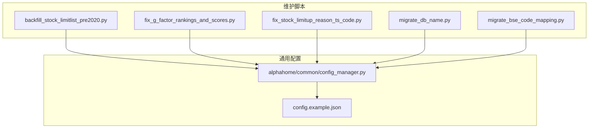
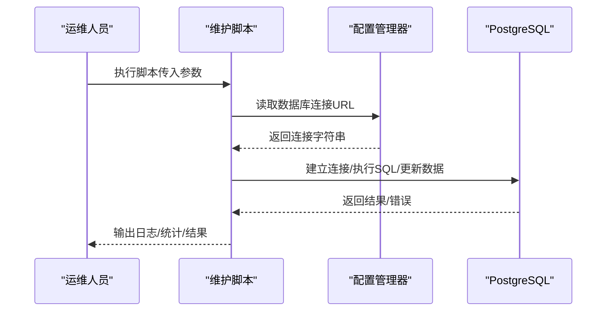
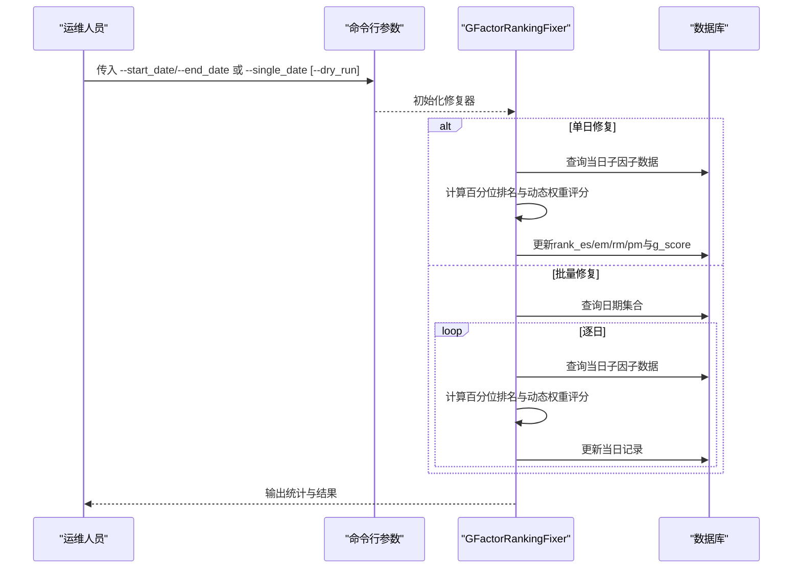
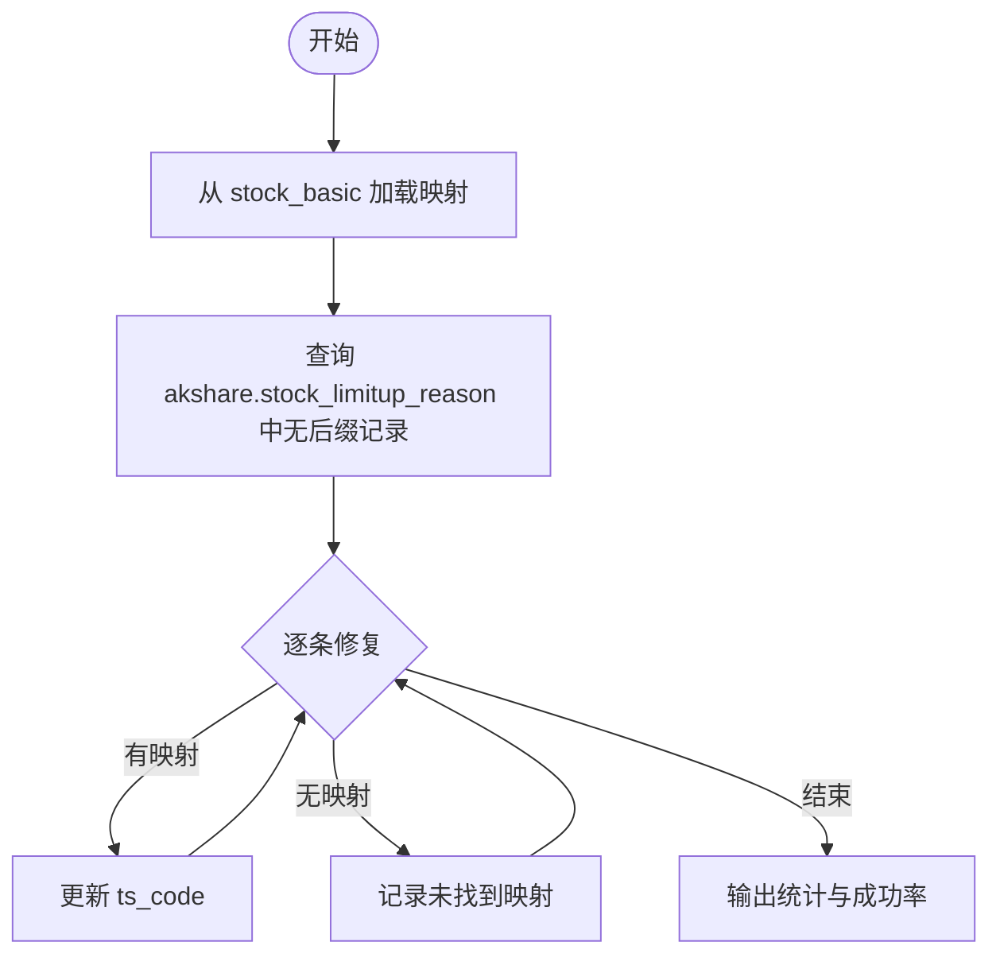
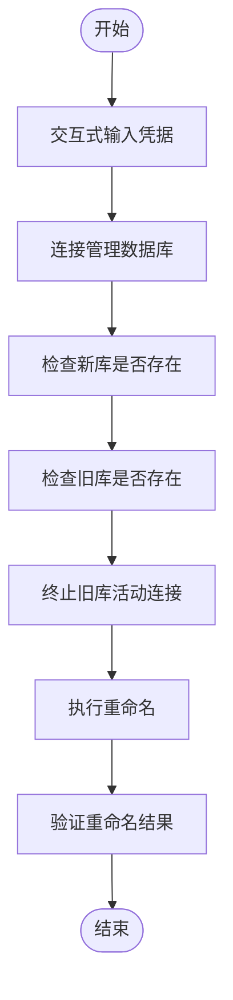
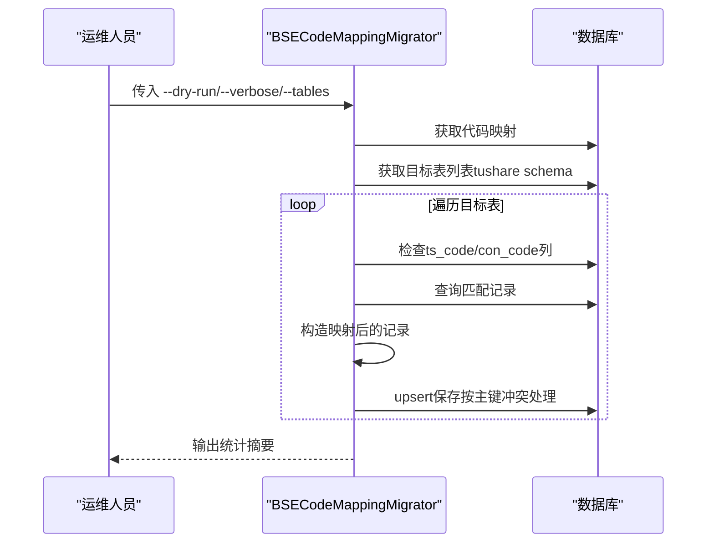
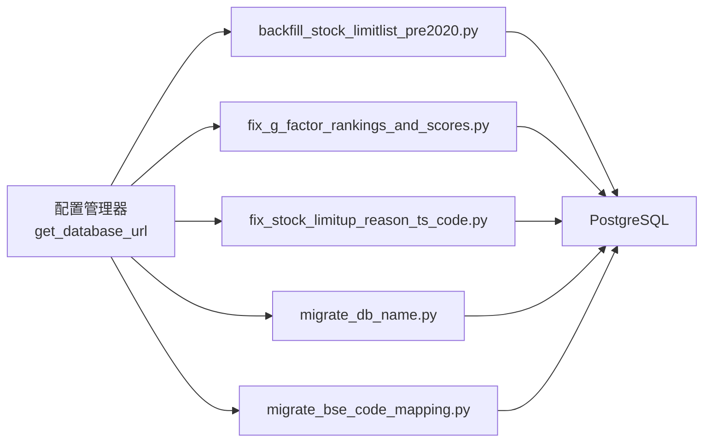

# 维护脚本

<cite>
**本文引用的文件**
- [scripts/maintenance/README_G_FACTOR_FIX.md](file://scripts/maintenance/README_G_FACTOR_FIX.md)
- [scripts/maintenance/backfill_stock_limitlist_pre2020.py](file://scripts/maintenance/backfill_stock_limitlist_pre2020.py)
- [scripts/maintenance/fix_g_factor_rankings_and_scores.py](file://scripts/maintenance/fix_g_factor_rankings_and_scores.py)
- [scripts/maintenance/fix_stock_limitup_reason_ts_code.py](file://scripts/maintenance/fix_stock_limitup_reason_ts_code.py)
- [scripts/maintenance/migrate_db_name.py](file://scripts/maintenance/migrate_db_name.py)
- [scripts/production/database/migrate_bse_code_mapping.py](file://scripts/production/database/migrate_bse_code_mapping.py)
- [alphahome/common/config_manager.py](file://alphahome/common/config_manager.py)
- [config.example.json](file://config.example.json)
</cite>

## 目录
1. [简介](#简介)
2. [项目结构](#项目结构)
3. [核心组件](#核心组件)
4. [架构总览](#架构总览)
5. [详细组件分析](#详细组件分析)
6. [依赖分析](#依赖分析)
7. [性能考量](#性能考量)
8. [故障排查指南](#故障排查指南)
9. [结论](#结论)
10. [附录](#附录)

## 简介
本手册面向运维与数据工程师，系统化介绍五类维护脚本的功能、执行场景、命令行参数、执行顺序、预期输出与回滚方案，并结合“G因子修复”专项文档，给出复杂数据修复任务的完整操作流程与注意事项。涉及的任务包括：
- 历史数据回填：补全2007-2019年涨跌停列表
- G因子排名与评分修复：修正空值因子参与排名与动态权重计算
- 股票代码映射修复：修正涨停原因表中的ts_code格式
- 数据库重命名：将数据库从旧名安全重命名为新名
- 北交所代码映射迁移：将tushare schema下多表的旧代码映射为新代码

## 项目结构
维护脚本主要位于 scripts/maintenance 与 scripts/production/database 两个目录，分别承担数据修复与结构迁移职责；数据库连接配置由通用配置管理器提供，连接字符串来自用户配置文件。



图表来源
- [scripts/maintenance/backfill_stock_limitlist_pre2020.py](file://scripts/maintenance/backfill_stock_limitlist_pre2020.py#L1-L259)
- [scripts/maintenance/fix_g_factor_rankings_and_scores.py](file://scripts/maintenance/fix_g_factor_rankings_and_scores.py#L1-L436)
- [scripts/maintenance/fix_stock_limitup_reason_ts_code.py](file://scripts/maintenance/fix_stock_limitup_reason_ts_code.py#L1-L254)
- [scripts/maintenance/migrate_db_name.py](file://scripts/maintenance/migrate_db_name.py#L1-L125)
- [scripts/production/database/migrate_bse_code_mapping.py](file://scripts/production/database/migrate_bse_code_mapping.py#L1-L592)
- [alphahome/common/config_manager.py](file://alphahome/common/config_manager.py#L168-L175)
- [config.example.json](file://config.example.json#L1-L63)

章节来源
- [scripts/maintenance/backfill_stock_limitlist_pre2020.py](file://scripts/maintenance/backfill_stock_limitlist_pre2020.py#L1-L259)
- [scripts/maintenance/fix_g_factor_rankings_and_scores.py](file://scripts/maintenance/fix_g_factor_rankings_and_scores.py#L1-L436)
- [scripts/maintenance/fix_stock_limitup_reason_ts_code.py](file://scripts/maintenance/fix_stock_limitup_reason_ts_code.py#L1-L254)
- [scripts/maintenance/migrate_db_name.py](file://scripts/maintenance/migrate_db_name.py#L1-L125)
- [scripts/production/database/migrate_bse_code_mapping.py](file://scripts/production/database/migrate_bse_code_mapping.py#L1-L592)
- [alphahome/common/config_manager.py](file://alphahome/common/config_manager.py#L168-L175)
- [config.example.json](file://config.example.json#L1-L63)

## 核心组件
- 历史数据回填脚本：基于现有价格与基础表，推导并插入2007-2019年的涨跌停列表，避免重复、幂等处理。
- G因子修复脚本：按日期批量重算子因子排名与G评分，采用动态权重与百分位排名，支持单日与批量修复，支持试运行。
- 股票代码映射修复脚本：从基础表加载映射，修复涨停原因表中缺失后缀的ts_code，支持试运行。
- 数据库重命名脚本：交互式获取管理员凭据，终止旧库连接，安全重命名数据库，并提示更新配置。
- 北交所代码映射迁移脚本：扫描tushare schema下stock_与fina_前缀表，按映射关系进行upsert迁移，支持dry-run与指定表。

章节来源
- [scripts/maintenance/backfill_stock_limitlist_pre2020.py](file://scripts/maintenance/backfill_stock_limitlist_pre2020.py#L1-L259)
- [scripts/maintenance/fix_g_factor_rankings_and_scores.py](file://scripts/maintenance/fix_g_factor_rankings_and_scores.py#L1-L436)
- [scripts/maintenance/fix_stock_limitup_reason_ts_code.py](file://scripts/maintenance/fix_stock_limitup_reason_ts_code.py#L1-L254)
- [scripts/maintenance/migrate_db_name.py](file://scripts/maintenance/migrate_db_name.py#L1-L125)
- [scripts/production/database/migrate_bse_code_mapping.py](file://scripts/production/database/migrate_bse_code_mapping.py#L1-L592)

## 架构总览
五个脚本均通过通用配置管理器获取数据库连接字符串，确保连接一致性与安全性；部分脚本依赖ResearchContext或DBManager进行数据库操作。



图表来源
- [alphahome/common/config_manager.py](file://alphahome/common/config_manager.py#L168-L175)
- [config.example.json](file://config.example.json#L1-L63)

## 详细组件分析

### 历史数据回填：backfill_stock_limitlist_pre2020.py
- 功能概述
  - 在2007-01-01至2019-12-31区间，基于现有价格与基础表推导并插入tushare.stock_limitlist。
  - 使用价格与涨跌停幅度的相对误差阈值判断涨停/跌停，过滤ST股票，避免重复插入。
- 关键参数
  - --year：仅回填指定年份；未指定则回填2007-2019全区间。
- 执行流程
  - 解析参数，获取数据库URL并建立异步连接。
  - 按年分段处理，裁剪到[2007, 2019]范围。
  - 执行数据库端SQL：连接limitprice/daily/dailybasic/basic/st，推导limit标记，插入到stock_limitlist，ON CONFLICT忽略。
- 预期输出
  - 控制台输出处理日期区间、错误与完成信息。
  - 成功插入记录数取决于满足条件且未重复的记录。
- 回滚方案
  - 由于INSERT使用ON CONFLICT DO NOTHING，幂等性保证；如需回滚，可基于trade_date/ts_code删除对应记录（需谨慎评估）。
- 注意事项
  - 仅处理2020年前数据，SQL中再次限定。
  - 依赖stock_st表与涨跌停幅度特征识别ST日。
  - 若数据库连接失败或配置缺失，脚本会打印错误并退出。

```mermaid
flowchart TD
Start(["开始"]) --> Parse["解析参数<br/>--year 可选"]
Parse --> GetURL["获取数据库URL"]
GetURL --> Connect["建立异步连接"]
Connect --> YearLoop{"遍历年份"}
YearLoop --> |裁剪到[2007,2019]| SQL["执行数据库端SQL<br/>推导limit并插入"]
SQL --> Done["输出统计/完成"]
YearLoop --> |结束| Done
```

图表来源
- [scripts/maintenance/backfill_stock_limitlist_pre2020.py](file://scripts/maintenance/backfill_stock_limitlist_pre2020.py#L204-L259)

章节来源
- [scripts/maintenance/backfill_stock_limitlist_pre2020.py](file://scripts/maintenance/backfill_stock_limitlist_pre2020.py#L1-L259)

### G因子排名与评分修复：fix_g_factor_rankings_and_scores.py
- 功能概述
  - 修复G因子排名与评分计算问题：空值因子不参与排名，动态权重按有效因子数量调整，避免固定权重导致的不合理评分。
- 关键参数
  - --start_date/--end_date：批量修复日期范围。
  - --single_date：单日修复。
  - --dry_run：试运行模式，不更新数据库。
- 执行流程
  - 初始化ResearchContext与GFactorRankingFixer。
  - 单日修复：按日期查询子因子数据，计算百分位排名与动态加权评分，批量更新。
  - 批量修复：查询日期集合，逐日处理并汇总统计。
- 预期输出
  - 控制台输出处理进度、总记录数、更新记录数、成功率与耗时。
  - 修复前后对比：空值因子保持NaN，评分不再受空值影响。
- 回滚方案
  - 试运行模式不写入数据库；正式模式可基于calc_date/ts_code回滚更新。
- 注意事项
  - 需要对pgs_factors.g_factor表有更新权限。
  - 建议运行前备份相关数据。



图表来源
- [scripts/maintenance/fix_g_factor_rankings_and_scores.py](file://scripts/maintenance/fix_g_factor_rankings_and_scores.py#L1-L436)
- [scripts/maintenance/README_G_FACTOR_FIX.md](file://scripts/maintenance/README_G_FACTOR_FIX.md#L1-L149)

章节来源
- [scripts/maintenance/fix_g_factor_rankings_and_scores.py](file://scripts/maintenance/fix_g_factor_rankings_and_scores.py#L1-L436)
- [scripts/maintenance/README_G_FACTOR_FIX.md](file://scripts/maintenance/README_G_FACTOR_FIX.md#L1-L149)

### 股票代码映射修复：fix_stock_limitup_reason_ts_code.py
- 功能概述
  - 修复akshare.stock_limitup_reason表中ts_code缺失后缀的问题，通过tushare.stock_basic表加载映射，将6位数字代码补全为标准格式。
- 关键参数
  - --dry_run：试运行模式，不实际更新数据库。
- 执行流程
  - 初始化ResearchContext与StockLimitupReasonTsCodeFixer。
  - 从tushare.stock_basic加载映射（6位->完整ts_code）。
  - 查询akshare.stock_limitup_reason中无后缀的记录，逐条修复并统计结果。
- 预期输出
  - 控制台输出映射加载数量、待修复记录数、成功修复数、未找到映射数、失败数与成功率。
- 回滚方案
  - 试运行模式不写入数据库；正式模式可基于trade_date/ts_code回滚更新。
- 注意事项
  - 若部分6位代码在stock_basic中找不到映射，脚本会统计并提示。



图表来源
- [scripts/maintenance/fix_stock_limitup_reason_ts_code.py](file://scripts/maintenance/fix_stock_limitup_reason_ts_code.py#L1-L254)

章节来源
- [scripts/maintenance/fix_stock_limitup_reason_ts_code.py](file://scripts/maintenance/fix_stock_limitup_reason_ts_code.py#L1-L254)

### 数据库重命名：migrate_db_name.py
- 功能概述
  - 将PostgreSQL数据库从旧名重命名为新名，自动终止旧库连接，提供错误处理与验证。
- 关键参数
  - 无命令行参数，交互式输入管理员凭据（主机、端口、用户名、密码）。
- 执行流程
  - 获取凭据并连接管理数据库（postgres）。
  - 检查新库是否存在与旧库是否存在。
  - 终止旧库活动连接，执行重命名，验证结果并提示更新配置文件。
- 预期输出
  - 控制台输出连接状态、检查结果、重命名过程与最终验证信息。
- 回滚方案
  - 如需回滚，需手动将数据库重命名为旧名（需具备足够权限）。
- 注意事项
  - 需要psycopg2-binary库；需具备数据库管理员权限；重命名后需更新配置文件中的数据库名。



图表来源
- [scripts/maintenance/migrate_db_name.py](file://scripts/maintenance/migrate_db_name.py#L1-L125)

章节来源
- [scripts/maintenance/migrate_db_name.py](file://scripts/maintenance/migrate_db_name.py#L1-L125)

### 北交所代码映射迁移：migrate_bse_code_mapping.py
- 功能概述
  - 从tushare.stock_code_mapping表获取北交所代码切换映射，对tushare schema下stock_与fina_前缀表进行upsert迁移，支持dry-run与指定表。
- 关键参数
  - --dry-run：模拟模式，不实际修改数据。
  - --verbose：显示详细信息。
  - --tables：指定要迁移的表（多个表名）。
- 执行流程
  - 初始化数据库连接，获取映射关系与目标表列表。
  - 对每个表检查ts_code/con_code列，查询匹配记录并映射为新代码。
  - 使用upsert模式保存到原表，按主键冲突处理，支持分批处理大表。
- 预期输出
  - 控制台输出映射数量、目标表数、找到记录数、迁移记录数与耗时统计。
- 回滚方案
  - dry-run模式不写入数据库；正式模式可基于主键回滚（需具备相应权限与备份）。
- 注意事项
  - 排除stock_basic与stock_code_mapping表；对大表自动分批处理。



图表来源
- [scripts/production/database/migrate_bse_code_mapping.py](file://scripts/production/database/migrate_bse_code_mapping.py#L1-L592)

章节来源
- [scripts/production/database/migrate_bse_code_mapping.py](file://scripts/production/database/migrate_bse_code_mapping.py#L1-L592)

## 依赖分析
- 配置依赖
  - 所有脚本通过通用配置管理器读取数据库URL，确保连接字符串一致。
- 外部依赖
  - 数据库重命名脚本依赖psycopg2-binary。
  - 其余脚本依赖项目内DBManager/ResearchContext等组件。
- 脚本耦合
  - backfill与fix_g_factor_rankings_and_scores依赖pgs_factors.g_factor表结构。
  - fix_stock_limitup_reason_ts_code依赖akshare.stock_limitup_reason与tushare.stock_basic。
  - migrate_bse_code_mapping依赖tushare.stock_code_mapping与tushare schema下多表。



图表来源
- [alphahome/common/config_manager.py](file://alphahome/common/config_manager.py#L168-L175)
- [config.example.json](file://config.example.json#L1-L63)

章节来源
- [alphahome/common/config_manager.py](file://alphahome/common/config_manager.py#L168-L175)
- [config.example.json](file://config.example.json#L1-L63)

## 性能考量
- 分批处理：历史回填与G因子修复按年/按日期分段处理，避免单次窗口过大。
- upsert与幂等：北交所迁移使用upsert按主键冲突处理，避免重复；历史回填使用ON CONFLICT DO NOTHING保证幂等。
- 大表分批：北交所迁移对大表自动分批（默认批次大小），降低内存与事务压力。
- 连接池：通用配置管理器提供连接池配置，建议在批量任务中合理设置池大小与超时。

[本节为通用指导，不直接分析具体文件]

## 故障排查指南
- 数据库连接失败
  - 检查配置文件中的数据库URL与连接参数；确认服务运行与网络可达。
- 权限不足
  - 数据库重命名与G因子更新需要相应权限；迁移脚本需对目标表有upsert权限。
- 试运行模式
  - 以上脚本均支持试运行模式，可在正式执行前验证逻辑与输出。
- 日志与统计
  - 脚本输出详细日志与统计信息，便于定位问题与评估效果。
- 回滚建议
  - 试运行模式不写入数据库；正式模式建议先备份，再按需回滚。

章节来源
- [scripts/maintenance/README_G_FACTOR_FIX.md](file://scripts/maintenance/README_G_FACTOR_FIX.md#L124-L149)
- [scripts/maintenance/migrate_db_name.py](file://scripts/maintenance/migrate_db_name.py#L107-L123)
- [scripts/production/database/migrate_bse_code_mapping.py](file://scripts/production/database/migrate_bse_code_mapping.py#L511-L530)

## 结论
上述五个维护脚本覆盖了历史数据回填、因子评分修复、代码映射修复、数据库重命名与跨schema代码迁移等关键运维场景。通过试运行模式、分批处理与幂等设计，显著降低了风险；配合统一的配置管理与日志输出，便于在生产环境中安全高效地执行。

[本节为总结性内容，不直接分析具体文件]

## 附录

### 执行顺序建议
- 数据库重命名（如需）→ 北交所代码映射迁移 → 历史数据回填 → G因子修复 → 股票代码映射修复
- 说明：数据库重命名通常在最前；迁移完成后进行数据修复与校验；最后修复代码映射问题。

[本节为通用建议，不直接分析具体文件]

### 命令行参数速查
- backfill_stock_limitlist_pre2020.py
  - --year：仅回填指定年份
- fix_g_factor_rankings_and_scores.py
  - --start_date/--end_date：批量修复日期范围
  - --single_date：单日修复
  - --dry_run：试运行模式
- fix_stock_limitup_reason_ts_code.py
  - --dry_run：试运行模式
- migrate_db_name.py
  - 无命令行参数，交互式输入凭据
- migrate_bse_code_mapping.py
  - --dry-run：模拟模式
  - --verbose：详细输出
  - --tables：指定表名列表

章节来源
- [scripts/maintenance/backfill_stock_limitlist_pre2020.py](file://scripts/maintenance/backfill_stock_limitlist_pre2020.py#L204-L259)
- [scripts/maintenance/fix_g_factor_rankings_and_scores.py](file://scripts/maintenance/fix_g_factor_rankings_and_scores.py#L354-L436)
- [scripts/maintenance/fix_stock_limitup_reason_ts_code.py](file://scripts/maintenance/fix_stock_limitup_reason_ts_code.py#L180-L254)
- [scripts/maintenance/migrate_db_name.py](file://scripts/maintenance/migrate_db_name.py#L1-L125)
- [scripts/production/database/migrate_bse_code_mapping.py](file://scripts/production/database/migrate_bse_code_mapping.py#L538-L592)