# 运维与维护

<cite>
**本文档引用文件**  
- [start_pit_data_update.bat](file://scripts/production/data_updaters/pit/start_pit_data_update.bat)
- [pit_data_update_production.py](file://scripts/production/data_updaters/pit/pit_data_update_production.py)
- [tushare_smart_update_production.py](file://scripts/production/data_updaters/tushare/tushare_smart_update_production.py)
- [start_tushare_smart_update.bat](file://scripts/production/data_updaters/tushare/start_tushare_smart_update.bat)
- [production_p_factor_calculator.py](file://scripts/production/factor_calculators/p_factor/production_p_factor_calculator.py)
- [start_parallel_p_factor_calculation.py](file://scripts/production/factor_calculators/p_factor/start_parallel_p_factor_calculation.py)
- [start_parallel_p_factor_calculation.bat](file://scripts/production/factor_calculators/p_factor/start_parallel_p_factor_calculation.bat)
- [start_parallel_g_factor_calculation.py](file://scripts/production/factor_calculators/g_factor/start_parallel_g_factor_calculation.py)
- [start_parallel_g_factor_calculation.bat](file://scripts/production/factor_calculators/g_factor/start_parallel_g_factor_calculation.bat)
- [migrate_db_name.py](file://scripts/maintenance/migrate_db_name.py)
- [fix_g_factor_rankings.py](file://scripts/maintenance/fix_g_factor_rankings.py)
- [tushare_update_config.yaml](file://scripts/production/config/tushare_update_config.yaml)
- [config.example.json](file://config.example.json)
- [db_manager_core.py](file://alphahome/common/db_components/db_manager_core.py)
- [db_manager.py](file://alphahome/common/db_manager.py)
</cite>

## 目录
1. [生产环境部署配置](#生产环境部署配置)
2. [定时任务设置](#定时任务设置)
3. [生产脚本详解](#生产脚本详解)
4. [维护脚本详解](#维护脚本详解)
5. [监控与日志分析](#监控与日志分析)
6. [常见故障排查](#常见故障排查)

## 生产环境部署配置

生产环境的部署配置主要涉及数据库连接、API密钥和性能参数的设置。系统通过`config.json`文件进行核心配置管理，该文件应从`config.example.json`复制并根据实际环境进行修改。

**数据库配置**：数据库连接通过PostgreSQL URL格式进行配置，包含主机、端口、用户名、密码和数据库名称。连接池配置优化了批量数据操作的性能，包括最小连接数（5）、最大连接数（25）、命令超时时间（180秒）等参数。这些配置确保了在高并发场景下的稳定连接和高效数据处理。

**API配置**：系统依赖Tushare和iFind等数据源，需要在配置文件中提供相应的API令牌。Tushare的`token`和iFind的`refresh_token`是访问数据服务的必要凭证，必须正确配置以确保数据获取功能正常。

**性能监控**：系统内置性能监控功能，可记录慢速操作（执行时间超过10秒）并进行历史记录管理。通过`enable_monitoring`开关控制监控功能的启用状态，`log_slow_operations`控制是否记录慢速操作日志。

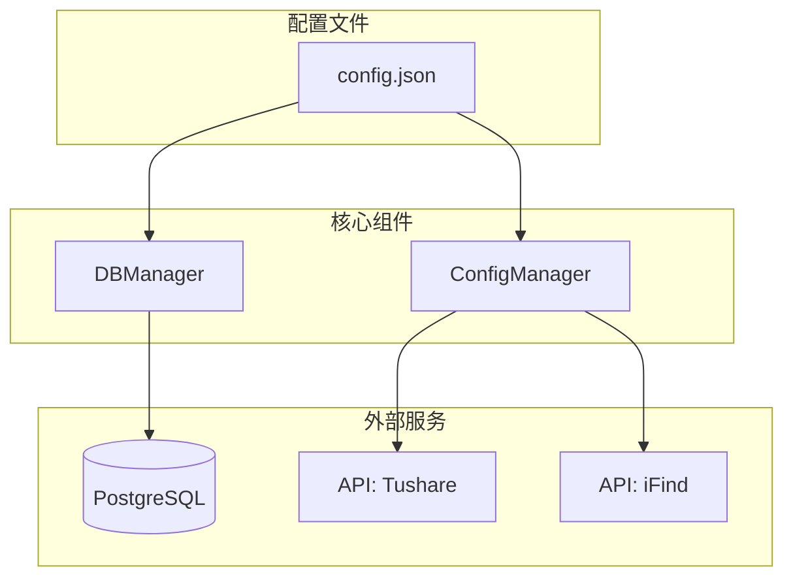

**配置来源**
- [config.example.json](file://config.example.json#L1-L63)
- [db_manager_core.py](file://alphahome/common/db_components/db_manager_core.py#L267-L327)
- [db_manager.py](file://alphahome/common/db_manager.py#L1-L40)

## 定时任务设置

系统的定时任务（cron jobs）通过Windows批处理文件和Python脚本的组合来实现。主要的定时任务包括PIT数据更新、Tushare数据智能更新、G因子和P因子的并行计算。

**任务调度机制**：使用Windows任务计划程序（Task Scheduler）来定期执行批处理文件。批处理文件作为启动器，负责设置环境变量、验证Python环境并调用相应的Python脚本。这种分层设计使得任务配置更加灵活，便于参数调整和错误处理。

**执行频率建议**：
- **PIT数据更新**：每周五执行，用于更新财务指标数据
- **Tushare数据更新**：每日执行，确保市场数据的及时性
- **G因子计算**：每月执行，进行年度数据的并行计算
- **P因子计算**：每周执行，基于最新财务数据计算评分

**参数传递**：批处理文件支持命令行参数传递，允许在不修改脚本的情况下调整执行参数。例如，并发进程数、重试次数、日志级别等都可以通过参数进行动态配置。

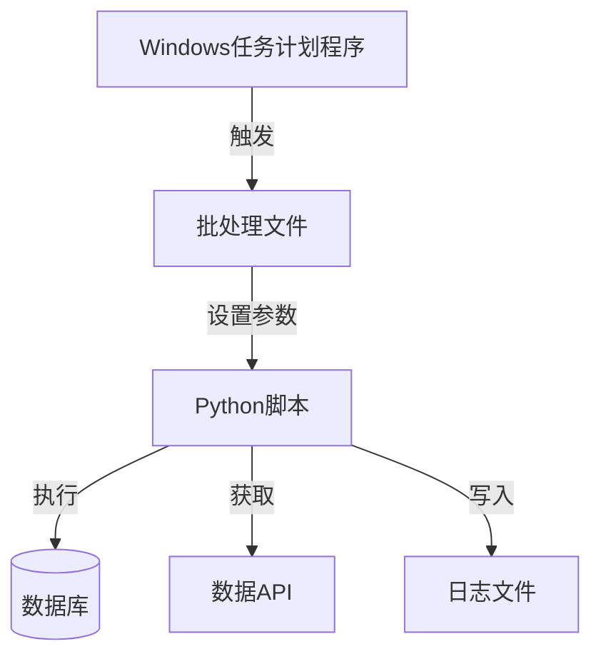

**定时任务来源**
- [start_pit_data_update.bat](file://scripts/production/data_updaters/pit/start_pit_data_update.bat#L1-L63)
- [start_tushare_smart_update.bat](file://scripts/production/data_updaters/tushare/start_tushare_smart_update.bat#L1-L116)
- [start_parallel_g_factor_calculation.bat](file://scripts/production/factor_calculators/g_factor/start_parallel_g_factor_calculation.bat#L1-L29)
- [start_parallel_p_factor_calculation.bat](file://scripts/production/factor_calculators/p_factor/start_parallel_p_factor_calculation.bat#L1-L13)

## 生产脚本详解

### PIT数据更新脚本

`pit_data_update_production.py`脚本负责更新PIT（Point-in-Time）财务指标数据，确保数据的历史一致性和准确性。该脚本通过`start_pit_data_update.bat`批处理文件启动，支持多种参数配置。

**执行参数**：
- **target**：指定要更新的数据类型，可选值包括`balance`（资产负债表）、`income`（利润表）、`financial_indicators`（财务指标）、`industry_classification`（行业分类）或`all`（全部）
- **mode**：更新模式，`incremental`（增量更新）或`full`（全量更新）
- **parallel**：是否并行执行，`true`或`false`

**执行流程**：
1. 解析命令行参数，设置默认值
2. 配置Python路径，确保模块正确导入
3. 根据目标类型调用相应的管理器类进行数据更新
4. 记录执行日志，输出执行结果

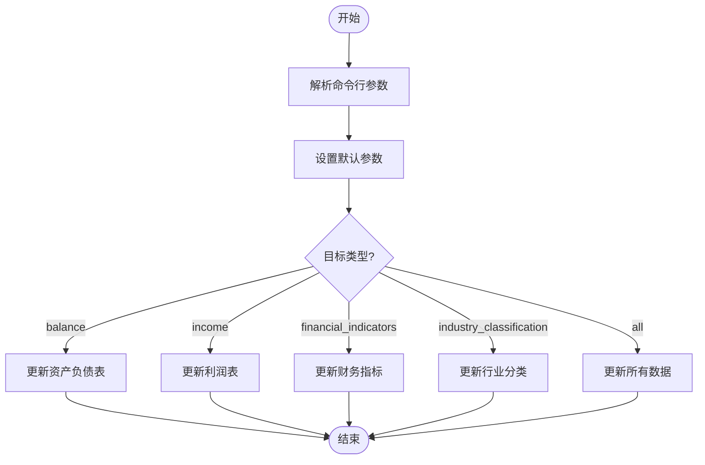

**PIT数据更新脚本来源**
- [start_pit_data_update.bat](file://scripts/production/data_updaters/pit/start_pit_data_update.bat#L1-L63)
- [pit_data_update_production.py](file://scripts/production/data_updaters/pit/pit_data_update_production.py)

### Tushare数据智能更新脚本

`tushare_smart_update_production.py`脚本实现了Tushare数据源的智能增量更新功能。该脚本通过`start_tushare_smart_update.bat`启动，支持灵活的并发控制和错误处理。

**核心功能**：
- **智能增量更新**：自动检测数据变化，只更新发生变化的数据，减少API调用次数
- **并发控制**：通过`max_workers`参数控制最大并发进程数，避免API配额耗尽
- **重试机制**：失败任务自动重试，最多重试`max_retries`次，每次间隔`retry_delay`秒
- **性能监控**：记录任务执行时间，支持性能分析和优化

**配置文件**：`tushare_update_config.yaml`文件定义了生产环境的参数配置，包括并发数、重试次数、日志级别、告警阈值等。配置文件支持环境覆盖，可以为开发和生产环境设置不同的参数。

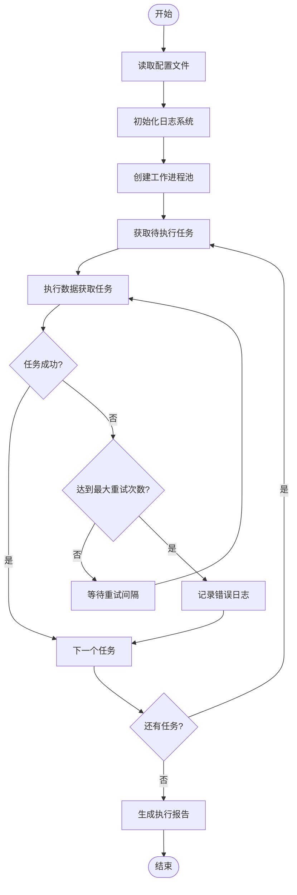

**Tushare更新脚本来源**
- [start_tushare_smart_update.bat](file://scripts/production/data_updaters/tushare/start_tushare_smart_update.bat#L1-L116)
- [tushare_smart_update_production.py](file://scripts/production/data_updaters/tushare/tushare_smart_update_production.py)
- [tushare_update_config.yaml](file://scripts/production/config/tushare_update_config.yaml#L1-L60)

### 因子计算脚本

系统提供了G因子和P因子的并行计算脚本，用于大规模数据的高效处理。这些脚本采用分布式计算模式，将计算任务分配到多个工作进程中并行执行。

**G因子并行计算**：`start_parallel_g_factor_calculation.py`脚本将年度计算任务分配到多个工作进程中，每个进程负责不同年份的计算。脚本实现了智能年份分配算法，确保计算负载均衡。

**P因子生产级计算**：`production_p_factor_calculator.py`脚本实现了基于PIT原则的P因子计算，严格遵循时点数据可见性规则。计算过程包括财务指标标准化、连续评分制应用和行业特殊处理。

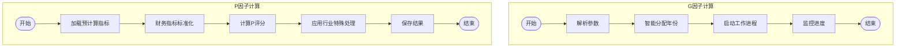

**因子计算脚本来源**
- [start_parallel_g_factor_calculation.py](file://scripts/production/factor_calculators/g_factor/start_parallel_g_factor_calculation.py#L1-L175)
- [start_parallel_g_factor_calculation.bat](file://scripts/production/factor_calculators/g_factor/start_parallel_g_factor_calculation.bat#L1-L29)
- [production_p_factor_calculator.py](file://scripts/production/factor_calculators/p_factor/production_p_factor_calculator.py#L1-L800)
- [start_parallel_p_factor_calculation.py](file://scripts/production/factor_calculators/p_factor/start_parallel_p_factor_calculation.py)
- [start_parallel_p_factor_calculation.bat](file://scripts/production/factor_calculators/p_factor/start_parallel_p_factor_calculation.bat#L1-L13)

## 维护脚本详解

### 数据库迁移脚本

`migrate_db_name.py`脚本用于将PostgreSQL数据库从`tusharedb`重命名为`alphadb`。该脚本提供了安全的数据库重命名功能，包括连接终止、存在性检查和权限验证。

**执行步骤**：
1. 提示用户输入数据库管理员凭据
2. 检查目标数据库名称是否已存在
3. 检查源数据库是否存在
4. 终止所有到源数据库的活动连接
5. 执行数据库重命名操作
6. 验证重命名结果

**安全特性**：
- **连接终止**：自动终止所有到源数据库的活动连接，确保重命名操作可以顺利进行
- **存在性检查**：在执行重命名前检查目标数据库是否已存在，避免数据覆盖
- **错误处理**：详细的错误信息和操作建议，帮助用户解决常见问题
- **凭据保护**：使用`getpass`模块安全地获取密码，避免密码在命令行中暴露

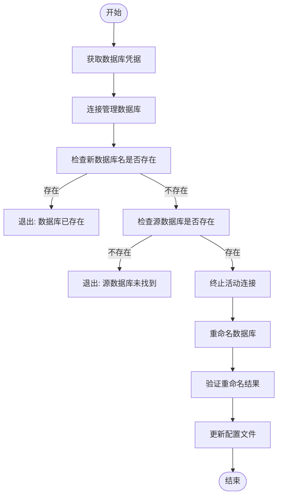

**数据库迁移脚本来源**
- [migrate_db_name.py](file://scripts/maintenance/migrate_db_name.py#L1-L125)

### 数据修复脚本

系统提供了一系列数据修复脚本，用于解决特定的数据质量问题。这些脚本位于`scripts/maintenance/`目录下，针对不同的数据问题提供专门的修复功能。

**G因子排名修复**：`fix_g_factor_rankings.py`脚本用于修复G因子计算中的排名问题。该脚本重新计算G因子排名，确保评分的准确性和一致性。

**股票涨停原因修复**：`fix_stock_limitup_reason_ts_code.py`脚本用于修复股票涨停原因数据中的代码格式问题，确保数据的一致性和可用性。

**数据回填**：`backfill_stock_limitlist_pre2020.py`脚本用于回填2020年之前的股票涨停列表数据，补充历史数据缺失。

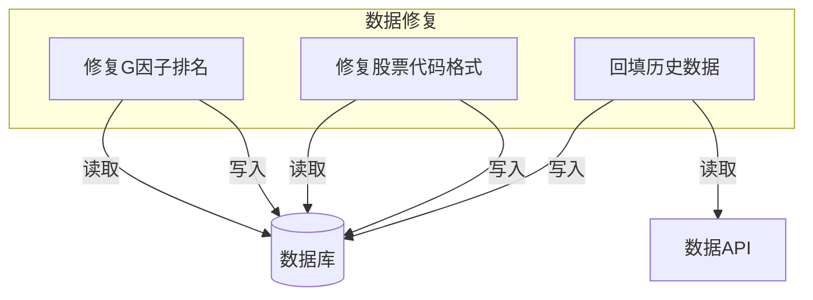

**数据修复脚本来源**
- [fix_g_factor_rankings.py](file://scripts/maintenance/fix_g_factor_rankings.py)
- [fix_stock_limitup_reason_ts_code.py](file://scripts/maintenance/fix_stock_limitup_reason_ts_code.py)
- [backfill_stock_limitlist_pre2020.py](file://scripts/maintenance/backfill_stock_limitlist_pre2020.py)

## 监控与日志分析

### 监控策略

系统的监控策略分为性能监控、任务状态监控和数据质量监控三个层面。

**性能监控**：通过`enable_performance_log`配置项启用性能日志，记录每个任务的执行时间。设置`max_execution_time`告警阈值（默认3600秒），当任务执行时间超过阈值时触发告警。

**任务状态监控**：启用`enable_task_status_log`记录任务状态日志，跟踪每个任务的执行状态（成功、失败、跳过）。设置`success_rate`告警阈值（默认80%），当成功率低于阈值时发出警告。

**数据质量监控**：通过数据验证脚本定期检查关键数据表的完整性、一致性和准确性。例如，验证财务指标数据的PIT原则遵守情况，检查因子评分的分布合理性。

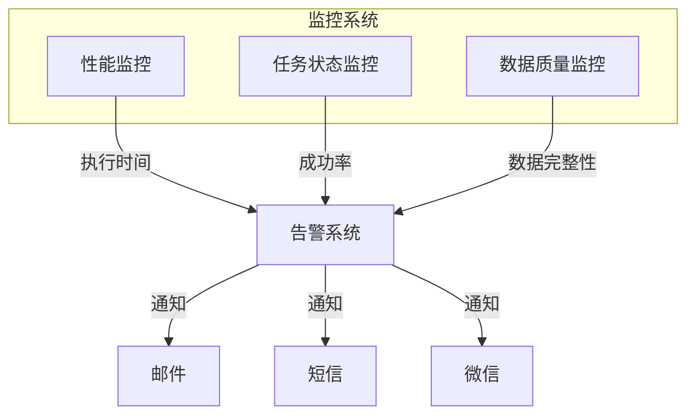

**监控策略来源**
- [tushare_update_config.yaml](file://scripts/production/config/tushare_update_config.yaml#L29-L38)
- [production_p_factor_calculator.py](file://scripts/production/factor_calculators/p_factor/production_p_factor_calculator.py#L80-L85)

### 日志分析方法

系统的日志分析主要关注错误日志、性能日志和执行报告三个方面。

**错误日志分析**：重点关注`ERROR`和`WARNING`级别的日志，识别API调用失败、数据库连接问题和数据处理异常。通过日志中的错误码和详细信息定位问题根源。

**性能日志分析**：分析任务执行时间分布，识别性能瓶颈。重点关注执行时间超过平均值2倍的任务，分析其数据量、并发度和资源消耗。

**执行报告分析**：每日生成任务执行报告，汇总成功、失败和跳过任务的数量。通过趋势分析识别系统稳定性变化，及时发现潜在问题。

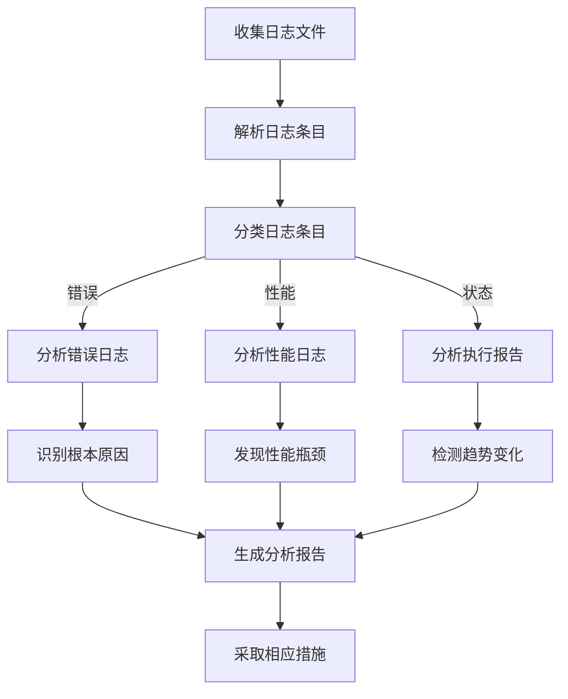

**日志分析来源**
- [tushare_update_config.yaml](file://scripts/production/config/tushare_update_config.yaml#L11-L14)
- [production_p_factor_calculator.py](file://scripts/production/factor_calculators/p_factor/production_p_factor_calculator.py#L87-L91)
- [verify_stats.py](file://scripts/production/shared/verify_stats.py#L1-L67)

## 常见故障排查

### API配额耗尽

**问题现象**：数据更新任务频繁失败，日志中出现"API rate limit exceeded"或类似错误信息。

**排查步骤**：
1. 检查`tushare_update_config.yaml`中的`max_workers`和`max_concurrent_requests`配置，确保并发数在API配额范围内
2. 查看`retry_delay`配置，确保重试间隔足够长，避免短时间内大量重试
3. 检查Tushare账户的API配额使用情况，确认是否已达到每日限额
4. 查看日志中的具体错误信息，确认是速率限制还是其他API错误

**解决方案**：
- 降低`max_workers`值，减少并发进程数
- 增加`retry_delay`值，延长重试间隔
- 考虑升级Tushare账户，获取更高的API配额
- 实现更智能的退避算法，根据API响应动态调整请求频率

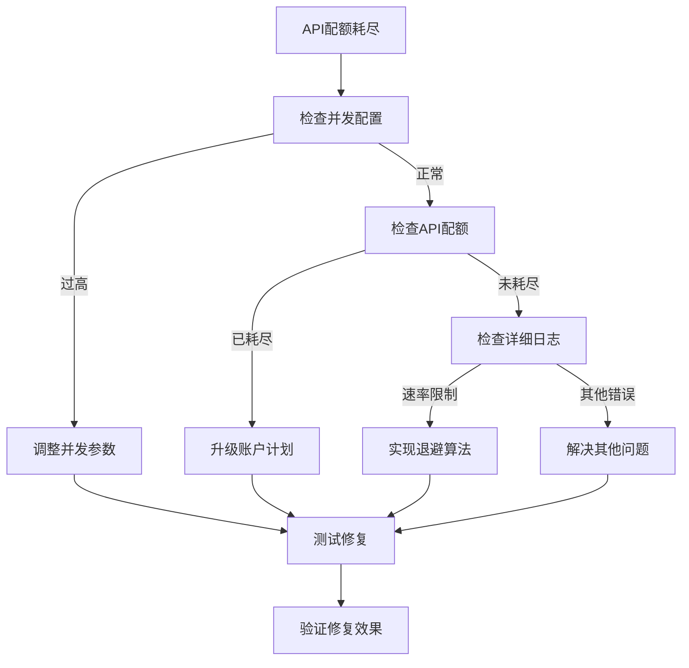

**API配额问题来源**
- [tushare_update_config.yaml](file://scripts/production/config/tushare_update_config.yaml#L6-L9)
- [tushare_update_config.yaml](file://scripts/production/config/tushare_update_config.yaml#L45-L48)

### 数据库连接失败

**问题现象**：系统无法连接到数据库，日志中出现"connection failed"、"timeout"或"authentication failed"等错误。

**排查步骤**：
1. 检查`config.json`中的数据库URL配置，确认主机、端口、用户名、密码和数据库名称正确
2. 验证数据库服务是否正在运行，可以通过`psql`命令行工具测试连接
3. 检查网络连接，确保应用程序服务器可以访问数据库服务器
4. 查看数据库日志，确认是否有认证失败或连接数超限的记录
5. 检查连接池配置，确认`max_size`设置合理，避免连接数耗尽

**解决方案**：
- 修正`config.json`中的数据库连接信息
- 启动数据库服务，确保其正常运行
- 调整防火墙设置，允许应用程序服务器访问数据库端口
- 增加数据库的最大连接数限制
- 优化连接池配置，合理设置`min_size`和`max_size`

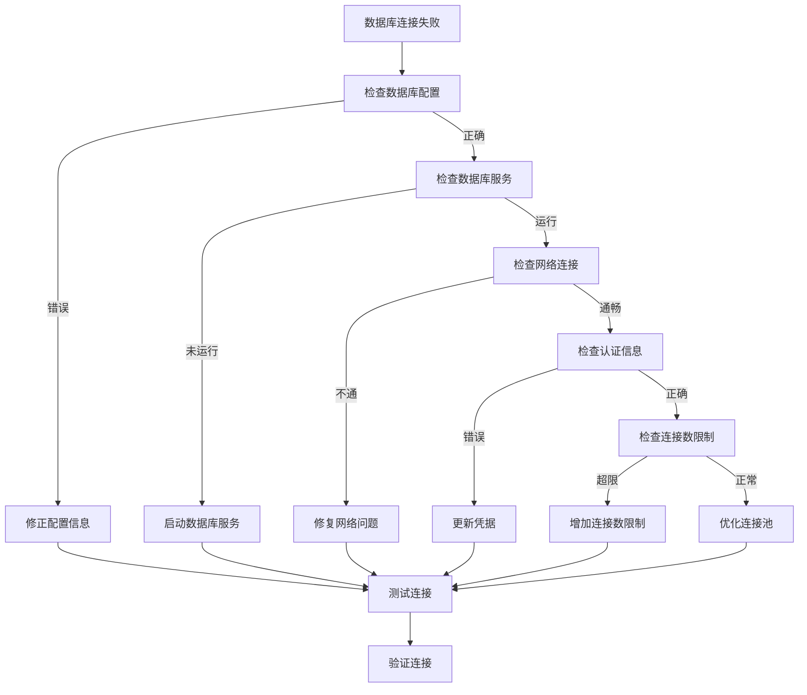

**数据库连接问题来源**
- [config.example.json](file://config.example.json#L3-L5)
- [db_manager_core.py](file://alphahome/common/db_components/db_manager_core.py#L175-L192)
- [db_manager_core.py](file://alphahome/common/db_components/db_manager_core.py#L267-L327)