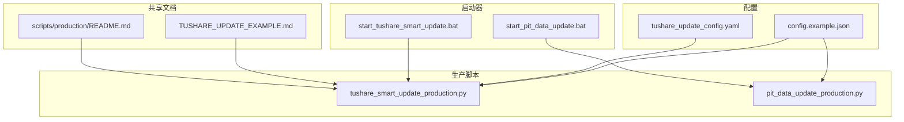
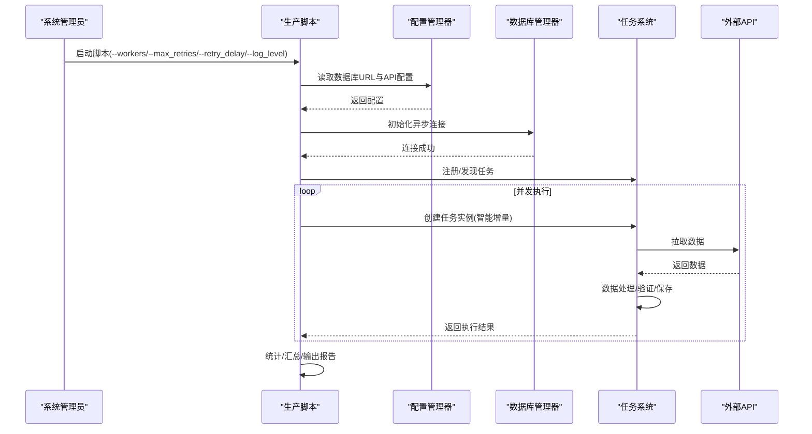
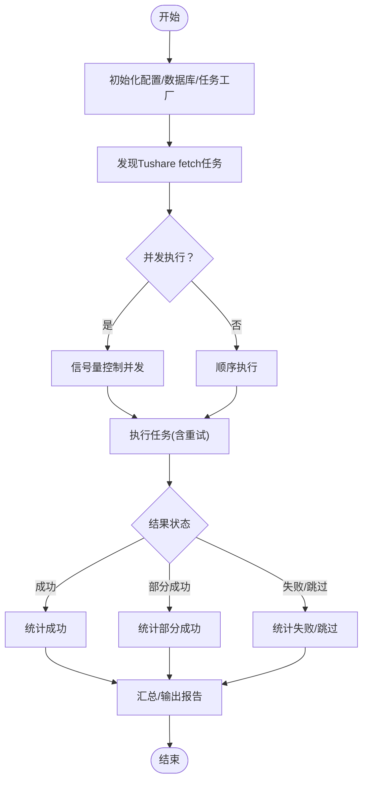
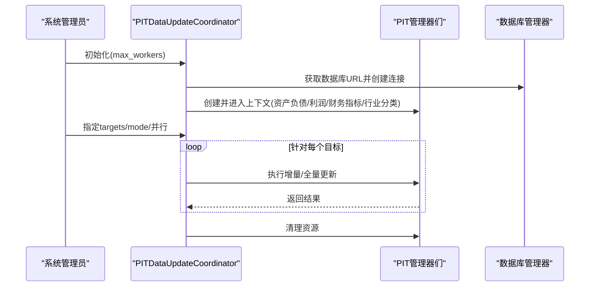
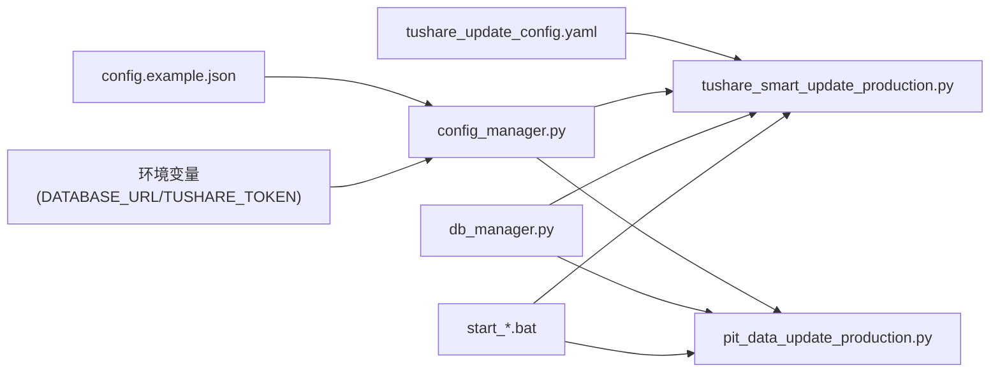

# 部署与配置

<cite>
**本文引用的文件**
- [config.example.json](file://config.example.json)
- [tushare_update_config.yaml](file://scripts/production/config/tushare_update_config.yaml)
- [tushare_smart_update_production.py](file://scripts/production/data_updaters/tushare/tushare_smart_update_production.py)
- [pit_data_update_production.py](file://scripts/production/data_updaters/pit/pit_data_update_production.py)
- [start_tushare_smart_update.bat](file://scripts/production/data_updaters/tushare/start_tushare_smart_update.bat)
- [start_pit_data_update.bat](file://scripts/production/data_updaters/pit/start_pit_data_update.bat)
- [TUSHARE_UPDATE_EXAMPLE.md](file://scripts/production/shared/TUSHARE_UPDATE_EXAMPLE.md)
- [scripts/production/README.md](file://scripts/production/README.md)
- [config_manager.py](file://alphahome/common/config_manager.py)
- [db_manager.py](file://alphahome/common/db_manager.py)
- [base_task.py](file://alphahome/common/task_system/base_task.py)
</cite>

## 目录
1. [简介](#简介)
2. [项目结构](#项目结构)
3. [核心组件](#核心组件)
4. [架构总览](#架构总览)
5. [详细组件分析](#详细组件分析)
6. [依赖关系分析](#依赖关系分析)
7. [性能与资源优化](#性能与资源优化)
8. [故障排查指南](#故障排查指南)
9. [结论](#结论)
10. [附录](#附录)

## 简介
本指南面向系统管理员，提供生产环境部署与配置的完整方案，涵盖：
- 如何根据 config.example.json 配置数据库连接与API密钥
- 如何使用 scripts/production/config/tushare_update_config.yaml 进行任务调度配置
- tushare_smart_update_production.py 与 pit_data_update_production.py 两个核心生产脚本的运行机制、依赖环境与启动方式
- Python虚拟环境设置、异步任务调度、资源监控建议以及多任务并行执行的配置优化
- 实际部署示例与常见配置错误排查方法

## 项目结构
生产相关文件集中在 scripts/production 目录，分为三类：
- 配置文件：scripts/production/config/tushare_update_config.yaml
- 数据更新器：scripts/production/data_updaters/{tushare,pit}
- 批处理启动器：scripts/production/data_updaters/{tushare,pit}/start_*.bat
- 共享文档：scripts/production/shared/TUSHARE_UPDATE_EXAMPLE.md
- 生产脚本说明：scripts/production/README.md

图表来源
- [tushare_smart_update_production.py](file://scripts/production/data_updaters/tushare/tushare_smart_update_production.py#L1-L419)
- [pit_data_update_production.py](file://scripts/production/data_updaters/pit/pit_data_update_production.py#L1-L255)
- [config.example.json](file://config.example.json#L1-L63)
- [tushare_update_config.yaml](file://scripts/production/config/tushare_update_config.yaml#L1-L60)
- [start_tushare_smart_update.bat](file://scripts/production/data_updaters/tushare/start_tushare_smart_update.bat#L1-L116)
- [start_pit_data_update.bat](file://scripts/production/data_updaters/pit/start_pit_data_update.bat#L1-L63)
- [TUSHARE_UPDATE_EXAMPLE.md](file://scripts/production/shared/TUSHARE_UPDATE_EXAMPLE.md#L1-L228)
- [scripts/production/README.md](file://scripts/production/README.md#L1-L423)

章节来源
- [scripts/production/README.md](file://scripts/production/README.md#L1-L120)

## 核心组件
- 配置管理器：统一加载用户配置目录下的 config.json，支持环境变量回退；提供数据库URL、API Token、任务特定配置等便捷接口。
- 数据库管理器：提供异步/同步数据库连接管理，封装连接池、表结构管理、数据保存等能力。
- 任务系统：统一的任务基类，定义 fetch/processor 生命周期、数据验证、保存策略、UPSERT/INSERT 等。
- 生产脚本：Tushare 智能增量更新脚本与 PIT 数据统一更新脚本，均采用异步并发执行与重试机制。

章节来源
- [config_manager.py](file://alphahome/common/config_manager.py#L1-L265)
- [db_manager.py](file://alphahome/common/db_manager.py#L1-L145)
- [base_task.py](file://alphahome/common/task_system/base_task.py#L1-L200)

## 架构总览
生产脚本通过统一配置与数据库管理器进行初始化，随后自动发现任务并并行执行，支持重试与状态汇总。

图表来源
- [tushare_smart_update_production.py](file://scripts/production/data_updaters/tushare/tushare_smart_update_production.py#L311-L415)
- [config_manager.py](file://alphahome/common/config_manager.py#L168-L208)
- [db_manager.py](file://alphahome/common/db_manager.py#L75-L107)
- [base_task.py](file://alphahome/common/task_system/base_task.py#L138-L239)

## 详细组件分析

### 配置文件与环境准备
- 数据库连接
  - 在 config.example.json 中设置 database.url 为 PostgreSQL 连接串；可配置连接池大小、超时、服务器设置等。
  - 生产脚本通过配置管理器读取数据库URL，若未找到则回退至环境变量 DATABASE_URL。
- API密钥
  - 在 config.example.json 中设置 api.tushare_token；也可通过环境变量 TUSHARE_TOKEN 注入。
- 任务特定配置
  - 在 config.example.json 的 tasks 节点下可覆盖单个任务的 save_batch_size、concurrent_limit、max_retries 等参数。
- Python虚拟环境
  - 建议使用隔离的虚拟环境，安装项目依赖（如 asyncpg、psycopg2、aiohttp、pandas、numpy 等）。
  - Windows批处理启动器会自动切换到项目根目录并执行脚本，注意确保 Python 已加入 PATH。

章节来源
- [config.example.json](file://config.example.json#L1-L63)
- [config_manager.py](file://alphahome/common/config_manager.py#L88-L113)
- [scripts/production/README.md](file://scripts/production/README.md#L41-L115)
- [start_tushare_smart_update.bat](file://scripts/production/data_updaters/tushare/start_tushare_smart_update.bat#L1-L76)

### Tushare 智能增量更新脚本（tushare_smart_update_production.py）
- 运行机制
  - 初始化：读取数据库URL并创建异步数据库管理器；初始化任务工厂。
  - 任务发现：扫描所有已注册任务，筛选 data_source 为 tushare 且 task_type 为 fetch 的任务。
  - 并行执行：使用信号量控制最大并发；每个任务支持重试与干运行模式。
  - 结果汇总：统计成功/失败/跳过/部分成功数量，输出执行摘要与建议。
- 关键参数
  - --workers：最大并发进程数（建议不超过 Tushare API 并发限制的一半）
  - --max_retries：单任务最大重试次数
  - --retry_delay：重试间隔秒数
  - --log_level：日志级别
  - --dry-run：干运行模式（仅展示将要执行的任务）
- 并发与API限制
  - 脚本内注释明确 Tushare API 默认并发限制与不同API的限制差异，建议将脚本并发数设置为 Tushare API 限制的 1/2 左右。
- 日志与监控
  - 默认日志文件：logs/tushare_production_update.log
  - 支持性能日志与任务状态日志开关
- 启动方式
  - 直接运行 Python 脚本或使用 Windows 批处理启动器（start_tushare_smart_update.bat）

图表来源
- [tushare_smart_update_production.py](file://scripts/production/data_updaters/tushare/tushare_smart_update_production.py#L91-L170)
- [tushare_smart_update_production.py](file://scripts/production/data_updaters/tushare/tushare_smart_update_production.py#L214-L249)
- [tushare_smart_update_production.py](file://scripts/production/data_updaters/tushare/tushare_smart_update_production.py#L311-L366)

章节来源
- [tushare_smart_update_production.py](file://scripts/production/data_updaters/tushare/tushare_smart_update_production.py#L1-L419)
- [TUSHARE_UPDATE_EXAMPLE.md](file://scripts/production/shared/TUSHARE_UPDATE_EXAMPLE.md#L1-L120)

### PIT 数据统一更新脚本（pit_data_update_production.py）
- 运行机制
  - 初始化：通过统一配置系统获取数据库URL并创建异步数据库管理器。
  - 协调器：集中管理四个PIT数据类型的更新器（资产负债表、利润表、财务指标、行业分类），支持增量/全量更新与并行执行。
  - 资源清理：确保在退出时正确释放管理器资源。
- 关键参数
  - --target：balance/income/financial_indicators/industry_classification/all
  - --mode：incremental/full
  - --parallel：是否并行执行
  - --workers：最大并发进程数
  - --log-level：日志级别
- 启动方式
  - 直接运行 Python 脚本或使用 Windows 批处理启动器（start_pit_data_update.bat）

图表来源
- [pit_data_update_production.py](file://scripts/production/data_updaters/pit/pit_data_update_production.py#L62-L110)
- [pit_data_update_production.py](file://scripts/production/data_updaters/pit/pit_data_update_production.py#L178-L210)

章节来源
- [pit_data_update_production.py](file://scripts/production/data_updaters/pit/pit_data_update_production.py#L1-L255)
- [scripts/production/README.md](file://scripts/production/README.md#L80-L128)

### 任务调度配置（tushare_update_config.yaml）
- 基本配置
  - production.max_workers：最大并发进程数
  - production.max_retries：单任务最大重试次数
  - production.retry_delay：重试间隔秒数
  - production.log_level：日志级别
  - production.timeout_minutes：单次执行超时时间
  - production.enable_dry_run：是否启用试运行模式
- 任务筛选
  - task_filter.include_sources：只执行 tushare 数据源的任务
  - task_filter.include_types：只执行 fetch 类型任务
  - task_filter.exclude_tasks：排除特定任务列表
- 性能监控
  - monitoring.enable_performance_log：启用性能日志
  - monitoring.enable_task_status_log：启用任务状态日志
  - monitoring.alert_thresholds.success_rate：成功率告警阈值
  - monitoring.alert_thresholds.max_execution_time：单任务最大执行时间
- 数据库与网络
  - database.connection_pool_size：数据库连接池大小
  - database.connection_timeout：连接超时时间
  - network.request_timeout：HTTP 请求超时时间
  - network.max_concurrent_requests：最大并发请求数
- 环境覆盖
  - development：开发环境配置（覆盖基本配置）
  - production_override：生产环境配置（覆盖基本配置）

章节来源
- [tushare_update_config.yaml](file://scripts/production/config/tushare_update_config.yaml#L1-L60)

### 批处理启动器
- start_tushare_smart_update.bat
  - 自动检查 Python 环境、切换到项目根目录、执行主脚本并传入参数（workers/retries/delay/log_level）。
- start_pit_data_update.bat
  - 设置 PYTHONPATH，构建并执行 Python 命令，支持 target/mode/parallel 参数。

章节来源
- [start_tushare_smart_update.bat](file://scripts/production/data_updaters/tushare/start_tushare_smart_update.bat#L1-L116)
- [start_pit_data_update.bat](file://scripts/production/data_updaters/pit/start_pit_data_update.bat#L1-L63)

## 依赖关系分析
- 配置层
  - config.example.json 与环境变量共同决定数据库URL与API密钥。
  - tushare_update_config.yaml 为 Tushare 更新提供额外的调度与监控配置。
- 执行层
  - 生产脚本依赖配置管理器获取数据库URL，依赖数据库管理器创建异步连接。
  - 任务系统提供统一的 fetch/processor 生命周期与数据保存策略。
- 外部依赖
  - PostgreSQL 数据库
  - Tushare API（受并发限制约束）
  - Python 运行时与第三方库（asyncpg、psycopg2、aiohttp、pandas、numpy 等）

图表来源
- [config_manager.py](file://alphahome/common/config_manager.py#L88-L113)
- [db_manager.py](file://alphahome/common/db_manager.py#L75-L107)
- [tushare_smart_update_production.py](file://scripts/production/data_updaters/tushare/tushare_smart_update_production.py#L72-L90)
- [pit_data_update_production.py](file://scripts/production/data_updaters/pit/pit_data_update_production.py#L89-L109)
- [tushare_update_config.yaml](file://scripts/production/config/tushare_update_config.yaml#L1-L60)

章节来源
- [config_manager.py](file://alphahome/common/config_manager.py#L1-L265)
- [db_manager.py](file://alphahome/common/db_manager.py#L1-L145)

## 性能与资源优化
- 并发控制
  - Tushare API 默认并发限制较高，建议将脚本并发数设置为 Tushare API 限制的 1/2 左右，避免被限流或触发风控。
  - 对于 PIT 更新，建议根据数据量与数据库性能设置合理的 --workers。
- 连接池与数据库
  - 在 config.example.json 中合理设置数据库连接池大小与超时，避免连接池耗尽。
  - 监控数据库连接数与慢查询，必要时调整 pool_config.server_settings。
- 网络与超时
  - 适当增大 retry_delay 与 request_timeout，缓解网络抖动。
  - 控制 network.max_concurrent_requests，避免对上游API造成过大压力。
- 日志与监控
  - 生产环境建议降低日志级别，减少I/O开销。
  - 启用性能日志与任务状态日志，结合告警阈值及时发现问题。
- 批处理与内存
  - 任务系统支持分批保存，避免一次性大批量数据导致内存压力。
  - 对于大规模任务，建议分批执行或在非高峰期运行。

章节来源
- [scripts/production/README.md](file://scripts/production/README.md#L197-L220)
- [config.example.json](file://config.example.json#L1-L63)
- [tushare_update_config.yaml](file://scripts/production/config/tushare_update_config.yaml#L1-L60)
- [base_task.py](file://alphahome/common/task_system/base_task.py#L555-L655)

## 故障排查指南
- 数据库连接失败
  - 检查 config.example.json 中 database.url 是否正确，或通过环境变量 DATABASE_URL 注入。
  - 使用数据库客户端连接测试连通性与权限。
- API 连接超时/限流
  - 降低并发数与重试间隔，检查网络连通性与 Tushare API 状态。
  - 若部分任务失败，检查该任务对应的 API 并发限制。
- 内存不足
  - 降低并发数或分批执行任务；关注日志中的大数据量提示与分批保存行为。
- 执行时间过长
  - 检查网络带宽与数据库性能；适当调整超时与重试策略。
- 干运行模式
  - 使用 --dry-run 参数进行安全测试，确认任务发现与筛选逻辑正确。
- 日志定位
  - 查看默认日志文件 logs/tushare_production_update.log，结合执行摘要中的失败/跳过详情定位问题。

章节来源
- [TUSHARE_UPDATE_EXAMPLE.md](file://scripts/production/shared/TUSHARE_UPDATE_EXAMPLE.md#L133-L206)
- [scripts/production/README.md](file://scripts/production/README.md#L348-L423)
- [tushare_smart_update_production.py](file://scripts/production/data_updaters/tushare/tushare_smart_update_production.py#L251-L310)

## 结论
通过统一的配置管理、规范化的数据库连接与任务系统，生产脚本实现了高可靠、可监控、可扩展的数据更新能力。建议在生产环境中：
- 使用隔离的虚拟环境与严格的配置校验
- 基于 API 限制与系统资源合理设置并发
- 启用性能日志与告警，建立定期维护与巡检机制
- 使用批处理启动器简化运维与定时任务配置

## 附录
- 实际部署示例
  - Tushare 智能增量更新：使用 start_tushare_smart_update.bat 传入 workers/retries/delay/log_level 参数，或直接运行 Python 脚本。
  - PIT 数据统一更新：使用 start_pit_data_update.bat 指定 target/mode/parallel 参数，或直接运行 Python 脚本。
- 定时任务建议
  - Linux Crontab：每日固定时间执行 Tushare 智能增量更新；每周固定时间执行 PIT 全量更新。
  - Windows 任务计划程序：配置触发器与操作，指向 Python 可执行文件与脚本路径。

章节来源
- [scripts/production/README.md](file://scripts/production/README.md#L207-L228)
- [start_tushare_smart_update.bat](file://scripts/production/data_updaters/tushare/start_tushare_smart_update.bat#L78-L116)
- [start_pit_data_update.bat](file://scripts/production/data_updaters/pit/start_pit_data_update.bat#L1-L63)