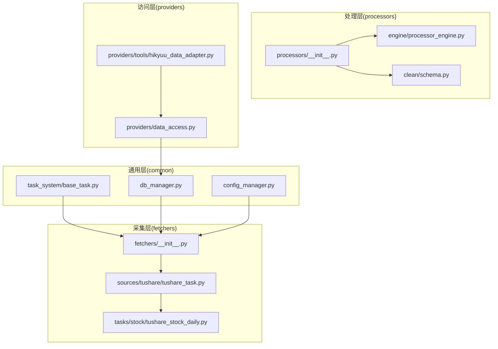
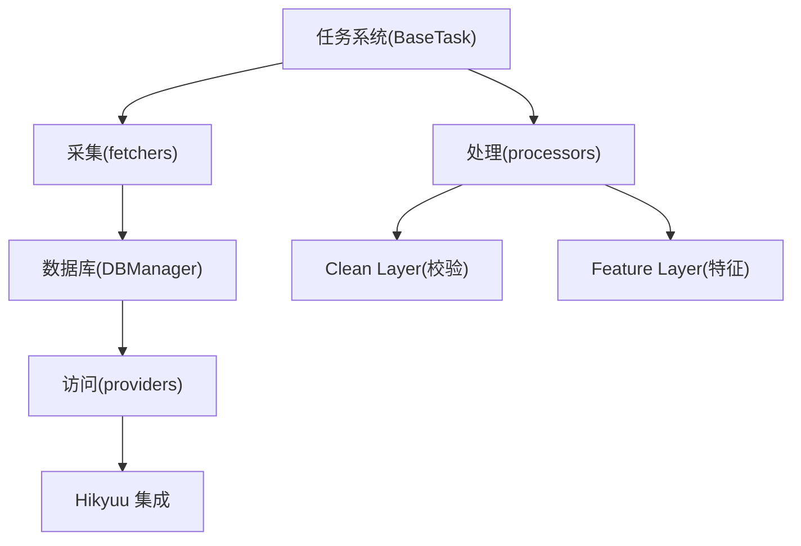
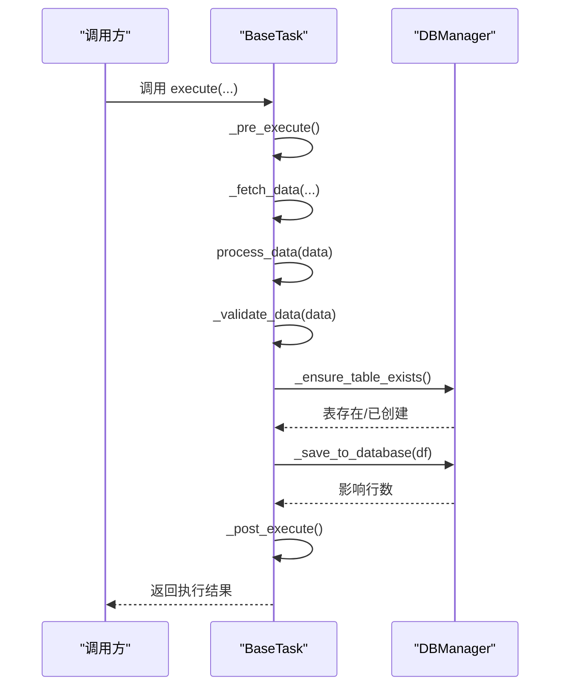
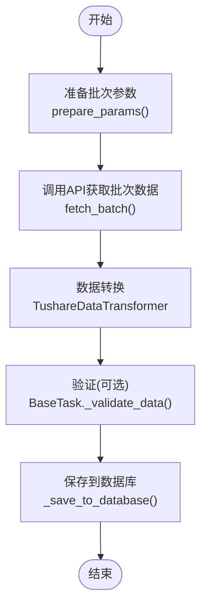
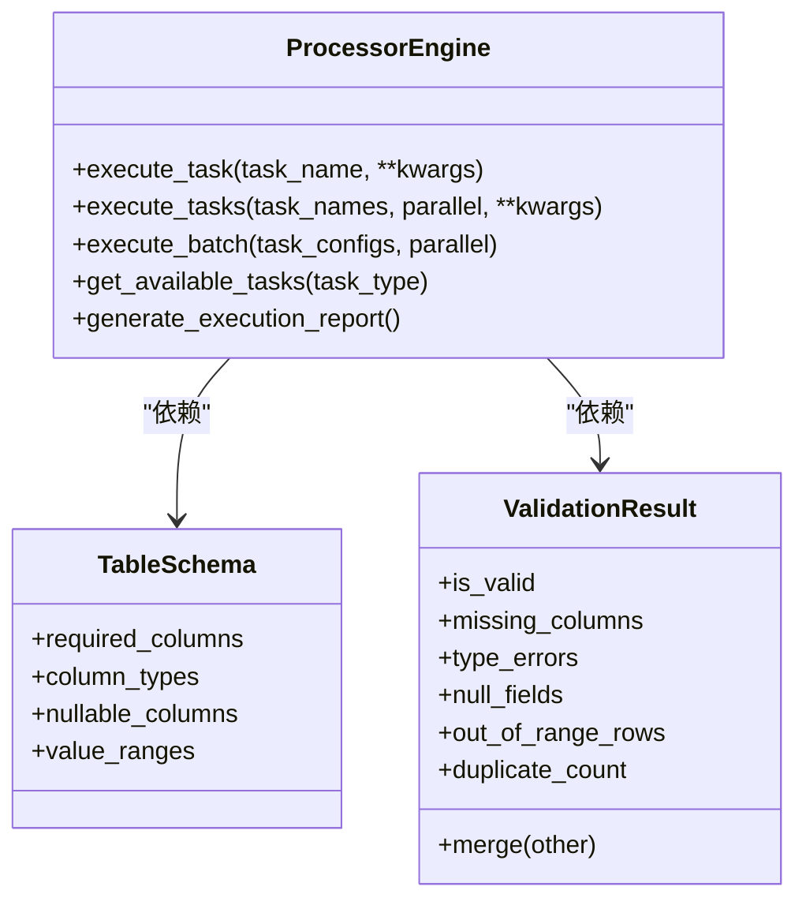
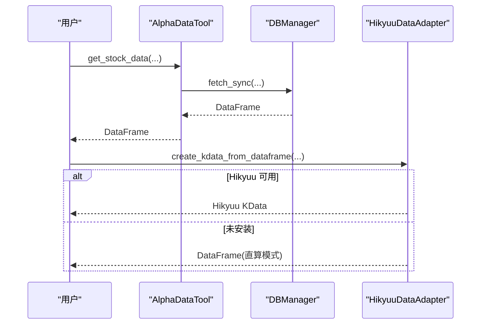
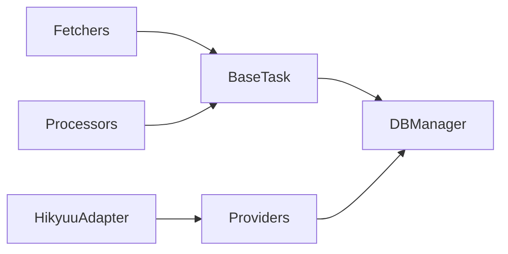

# 项目概述

<cite>
**本文引用的文件**
- [README.md](file://README.md)
- [alphahome/__init__.py](file://alphahome/__init__.py)
- [alphahome/common/__init__.py](file://alphahome/common/__init__.py)
- [alphahome/common/task_system/base_task.py](file://alphahome/common/task_system/base_task.py)
- [alphahome/common/db_manager.py](file://alphahome/common/db_manager.py)
- [alphahome/common/config_manager.py](file://alphahome/common/config_manager.py)
- [alphahome/fetchers/__init__.py](file://alphahome/fetchers/__init__.py)
- [alphahome/fetchers/sources/tushare/tushare_task.py](file://alphahome/fetchers/sources/tushare/tushare_task.py)
- [alphahome/fetchers/tasks/stock/tushare_stock_daily.py](file://alphahome/fetchers/tasks/stock/tushare_stock_daily.py)
- [alphahome/processors/__init__.py](file://alphahome/processors/__init__.py)
- [alphahome/processors/engine/processor_engine.py](file://alphahome/processors/engine/processor_engine.py)
- [alphahome/processors/clean/schema.py](file://alphahome/processors/clean/schema.py)
- [alphahome/providers/data_access.py](file://alphahome/providers/data_access.py)
- [alphahome/providers/tools/hikyuu_data_adapter.py](file://alphahome/providers/tools/hikyuu_data_adapter.py)
</cite>

## 目录
1. [简介](#简介)
2. [项目结构](#项目结构)
3. [核心组件](#核心组件)
4. [架构总览](#架构总览)
5. [详细组件分析](#详细组件分析)
6. [依赖分析](#依赖分析)
7. [性能考虑](#性能考虑)
8. [故障排查指南](#故障排查指南)
9. [结论](#结论)
10. [附录](#附录)

## 简介
AlphaHome 是一个面向量化金融数据的基础设施平台，定位为“数据获取—清洗—存储—访问”的一体化流水线。项目当前以 fetchers 模块为核心可用能力，提供多数据源（Tushare、AkShare、PyTDX 等）的统一任务框架与数据采集；同时，处理器（processors）模块已完成数据分层架构（Clean/Feature/Task）与任务编排引擎，具备可扩展的处理管线能力；providers 模块提供简化的数据访问接口，并内置与 Hikyuu 的数据适配与信号生成能力，便于研究与回测场景对接。

AlphaHome 的目标是为量化研究与工程实践提供稳定、可扩展、可维护的数据基础设施，强调：
- 任务驱动的统一执行模型
- 数据分层（Raw/Clean/Feature）与可验证的处理流程
- 模块化设计与清晰的边界划分
- 与 Hikyuu 等生态工具的集成

## 项目结构
项目采用按功能域分层的组织方式，核心模块包括：
- common：通用工具（任务系统、数据库、配置、日志、迁移等）
- fetchers：数据采集模块，统一任务框架与多数据源实现
- processors：数据处理模块，分层架构与任务引擎
- providers：数据访问与适配模块，包含 Hikyuu 集成
- gui：图形界面（开发中）
- docs/scripts/tests：文档、脚本与测试

图表来源
- [alphahome/common/task_system/base_task.py](file://alphahome/common/task_system/base_task.py#L1-L120)
- [alphahome/common/db_manager.py](file://alphahome/common/db_manager.py#L1-L120)
- [alphahome/common/config_manager.py](file://alphahome/common/config_manager.py#L1-L120)
- [alphahome/fetchers/__init__.py](file://alphahome/fetchers/__init__.py#L1-L37)
- [alphahome/fetchers/sources/tushare/tushare_task.py](file://alphahome/fetchers/sources/tushare/tushare_task.py#L1-L80)
- [alphahome/fetchers/tasks/stock/tushare_stock_daily.py](file://alphahome/fetchers/tasks/stock/tushare_stock_daily.py#L1-L60)
- [alphahome/processors/__init__.py](file://alphahome/processors/__init__.py#L1-L76)
- [alphahome/processors/engine/processor_engine.py](file://alphahome/processors/engine/processor_engine.py#L1-L120)
- [alphahome/processors/clean/schema.py](file://alphahome/processors/clean/schema.py#L1-L80)
- [alphahome/providers/data_access.py](file://alphahome/providers/data_access.py#L1-L80)
- [alphahome/providers/tools/hikyuu_data_adapter.py](file://alphahome/providers/tools/hikyuu_data_adapter.py#L1-L60)

章节来源
- [README.md](file://README.md#L1-L144)
- [alphahome/__init__.py](file://alphahome/__init__.py#L1-L13)

## 核心组件
- 任务系统（BaseTask）：统一 fetcher/processor 的生命周期与执行模板，提供 fetch/process/validate/save 的标准流程，支持异步/同步、验证模式、去重与 UPSERT 等能力。
- 数据库管理（DBManager）：整合 v2.0 架构，支持 async/sync 模式，封装表结构管理、COPY/UPSERT 等操作。
- 配置管理（ConfigManager）：集中式配置加载与迁移，支持用户目录、环境变量回退与任务级配置。
- 数据采集（Fetchers）：以 TushareTask 为例，统一参数准备、批次生成、API 调用与数据转换。
- 数据处理（Processors）：引擎层（ProcessorEngine）负责并发调度与依赖检查扩展点；Clean 层以 TableSchema/ValidationResult 定义校验契约。
- 数据访问（Providers）：AlphaDataTool 提供股票、指数、复权因子、交易日历、行业等常用查询接口；内置 Hikyuu 适配器，支持指标与信号生成。
- Hikyuu 集成：HikyuuDataAdapter/HikyuuSignalGenerator 将 AlphaHome 数据标准化为 Hikyuu 可用格式，或在未安装 Hikyuu 时回退到 DataFrame 直算模式。

章节来源
- [alphahome/common/task_system/base_task.py](file://alphahome/common/task_system/base_task.py#L1-L240)
- [alphahome/common/db_manager.py](file://alphahome/common/db_manager.py#L1-L120)
- [alphahome/common/config_manager.py](file://alphahome/common/config_manager.py#L1-L120)
- [alphahome/fetchers/sources/tushare/tushare_task.py](file://alphahome/fetchers/sources/tushare/tushare_task.py#L1-L120)
- [alphahome/fetchers/tasks/stock/tushare_stock_daily.py](file://alphahome/fetchers/tasks/stock/tushare_stock_daily.py#L1-L120)
- [alphahome/processors/engine/processor_engine.py](file://alphahome/processors/engine/processor_engine.py#L1-L200)
- [alphahome/processors/clean/schema.py](file://alphahome/processors/clean/schema.py#L1-L120)
- [alphahome/providers/data_access.py](file://alphahome/providers/data_access.py#L1-L120)
- [alphahome/providers/tools/hikyuu_data_adapter.py](file://alphahome/providers/tools/hikyuu_data_adapter.py#L1-L120)

## 架构总览
AlphaHome 采用“任务驱动 + 数据分层 + 模块化”的总体架构：
- 采集阶段：FetcherTask/TushareTask 通过统一任务框架生成批次参数，调用 API 获取原始数据，经 Transformer 标准化后进入保存阶段。
- 处理阶段：ProcessorEngine 调度任务，支持并发与超时控制；Clean Layer 以 TableSchema/ValidationResult 契约保障数据质量；Feature Layer 通过纯函数接口产出特征。
- 访问阶段：AlphaDataTool 提供高频查询接口；HikyuuDataAdapter 将 OHLCV 数据标准化为 Hikyuu 可用对象或回退直算。

图表来源
- [alphahome/common/task_system/base_task.py](file://alphahome/common/task_system/base_task.py#L120-L240)
- [alphahome/common/db_manager.py](file://alphahome/common/db_manager.py#L1-L120)
- [alphahome/providers/data_access.py](file://alphahome/providers/data_access.py#L1-L120)
- [alphahome/providers/tools/hikyuu_data_adapter.py](file://alphahome/providers/tools/hikyuu_data_adapter.py#L1-L120)
- [alphahome/processors/engine/processor_engine.py](file://alphahome/processors/engine/processor_engine.py#L1-L120)
- [alphahome/processors/clean/schema.py](file://alphahome/processors/clean/schema.py#L1-L120)

## 详细组件分析

### 任务系统与执行流程（BaseTask）
- 生命周期模板：_fetch_data → process_data → _validate_data → _save_data，支持异步/同步兼容，提供预/后处理钩子与错误处理。
- 数据验证：支持 report/filter 两种模式，可对 DataFrame/非 DataFrame 进行规则校验，输出详细验证摘要。
- 保存策略：支持主键去重、空值过滤、NaN 处理、分批保存与 UPSERT/INSERT 模式切换。
- rawdata 视图：根据数据源优先级自动创建/更新 rawdata 视图，确保多源数据的统一访问。

图表来源
- [alphahome/common/task_system/base_task.py](file://alphahome/common/task_system/base_task.py#L138-L239)
- [alphahome/common/db_manager.py](file://alphahome/common/db_manager.py#L1-L120)

章节来源
- [alphahome/common/task_system/base_task.py](file://alphahome/common/task_system/base_task.py#L138-L239)

### 数据库管理（DBManager v2.0）
- 架构整合：DatabaseOperationsMixin + SchemaManagementMixin + UtilityMixin + DBManagerCore，提供统一的数据库操作能力。
- 模式支持：async（asyncpg）与 sync（psycopg2）双模式，满足不同运行环境需求。
- 功能覆盖：表结构管理、数据写入（COPY/UPSERT）、查询、连接测试等。

章节来源
- [alphahome/common/db_manager.py](file://alphahome/common/db_manager.py#L1-L120)

### 配置管理（ConfigManager）
- 用户目录配置：~/.alphahome/config.json，支持迁移与环境变量回退（DATABASE_URL、TUSHARE_TOKEN、HIKYUU_DATA_DIR）。
- 任务级配置：按任务名读取独立配置，便于差异化参数控制。

章节来源
- [alphahome/common/config_manager.py](file://alphahome/common/config_manager.py#L1-L120)

### 数据采集（Fetchers：以 TushareTask 为例）
- 统一参数准备与批次生成：prepare_params/fetch_batch/get_batch_list，屏蔽具体 API 细节。
- 数据转换：TushareDataTransformer 在采集阶段完成列映射、类型转换等，避免重复处理。
- 智能更新：支持增量/全量/智能更新策略，结合交易日历与最新日期判断。

图表来源
- [alphahome/fetchers/sources/tushare/tushare_task.py](file://alphahome/fetchers/sources/tushare/tushare_task.py#L98-L145)
- [alphahome/fetchers/tasks/stock/tushare_stock_daily.py](file://alphahome/fetchers/tasks/stock/tushare_stock_daily.py#L108-L177)
- [alphahome/common/task_system/base_task.py](file://alphahome/common/task_system/base_task.py#L348-L555)

章节来源
- [alphahome/fetchers/sources/tushare/tushare_task.py](file://alphahome/fetchers/sources/tushare/tushare_task.py#L1-L184)
- [alphahome/fetchers/tasks/stock/tushare_stock_daily.py](file://alphahome/fetchers/tasks/stock/tushare_stock_daily.py#L1-L178)

### 数据处理（Processors：ProcessorEngine 与 Clean Layer）
- 引擎层：ProcessorEngine 支持单任务/批量任务执行、并行/串行、超时控制、依赖检查扩展点、执行统计与报告。
- Clean Layer：TableSchema/ValidationResult 定义列级约束、类型、空值与数值范围，支持合并与汇总输出，为 Feature Layer 提供高质量输入。

图表来源
- [alphahome/processors/engine/processor_engine.py](file://alphahome/processors/engine/processor_engine.py#L1-L200)
- [alphahome/processors/clean/schema.py](file://alphahome/processors/clean/schema.py#L1-L120)

章节来源
- [alphahome/processors/engine/processor_engine.py](file://alphahome/processors/engine/processor_engine.py#L1-L200)
- [alphahome/processors/clean/schema.py](file://alphahome/processors/clean/schema.py#L1-L120)

### 数据访问与 Hikyuu 集成（Providers）
- AlphaDataTool：提供 get_stock_data、get_index_weights、get_adj_factor_data、get_stock_info、get_trade_dates、get_industry_data 等高频查询；支持自定义 SQL 与原始 DB 访问。
- Hikyuu 适配：HikyuuDataAdapter 将 OHLCV 数据标准化为 Hikyuu KData/Stock 对象，或在未安装 Hikyuu 时回退到 DataFrame 直算；支持指标与信号生成。

图表来源
- [alphahome/providers/data_access.py](file://alphahome/providers/data_access.py#L90-L200)
- [alphahome/providers/tools/hikyuu_data_adapter.py](file://alphahome/providers/tools/hikyuu_data_adapter.py#L1-L120)

章节来源
- [alphahome/providers/data_access.py](file://alphahome/providers/data_access.py#L1-L200)
- [alphahome/providers/tools/hikyuu_data_adapter.py](file://alphahome/providers/tools/hikyuu_data_adapter.py#L1-L120)

## 依赖分析
- 组件耦合与内聚
  - BaseTask 与 DBManager：通过统一接口创建表、UPSER/INSERT、查询最新日期等，形成稳定的 IO 依赖。
  - Fetchers 与 TaskSystem：通过统一任务注册与工厂，实现任务发现与实例化。
  - Processors 与 TaskSystem：通过统一工厂与任务类型过滤，实现任务发现与执行。
  - Providers 与 DBManager：直接依赖 DBManager 的同步查询能力。
  - Hikyuu 集成：可选依赖，未安装时回退直算模式，避免阻断主流程。
- 外部依赖与集成点
  - Tushare API：通过 TushareTask 统一接入，支持速率限制与参数定制。
  - Hikyuu：通过适配器桥接，支持指标与信号生成。
- 潜在循环依赖
  - 通过模块化拆分与延迟导入（如 providers/_helpers）降低循环风险。

图表来源
- [alphahome/common/task_system/base_task.py](file://alphahome/common/task_system/base_task.py#L1-L120)
- [alphahome/common/db_manager.py](file://alphahome/common/db_manager.py#L1-L120)
- [alphahome/providers/data_access.py](file://alphahome/providers/data_access.py#L1-L120)
- [alphahome/providers/tools/hikyuu_data_adapter.py](file://alphahome/providers/tools/hikyuu_data_adapter.py#L1-L120)

章节来源
- [alphahome/common/task_system/base_task.py](file://alphahome/common/task_system/base_task.py#L1-L120)
- [alphahome/common/db_manager.py](file://alphahome/common/db_manager.py#L1-L120)
- [alphahome/providers/data_access.py](file://alphahome/providers/data_access.py#L1-L120)
- [alphahome/providers/tools/hikyuu_data_adapter.py](file://alphahome/providers/tools/hikyuu_data_adapter.py#L1-L120)

## 性能考虑
- 并发与限流
  - Fetchers：TushareTask 支持 page_size/rate_limit_delay 配置，避免 API 限流。
  - Processors：ProcessorEngine 使用 asyncio.Semaphore 控制并发，return_exceptions 确保单任务失败不影响整体。
- 批量写入
  - BaseTask 支持分批保存与 UPSERT，减少重复数据与事务开销。
- 数据类型与索引
  - 任务定义中明确 schema_def 与 indexes，有助于查询性能与数据完整性。
- 直算回退
  - Hikyuu 未安装时回退 DataFrame 直算，避免外部依赖导致的性能瓶颈。

## 故障排查指南
- 配置问题
  - 检查 ~/.alphahome/config.json 是否存在，或 DATABASE_URL/TUSHARE_TOKEN/回测目录等环境变量是否设置。
- 数据库连接
  - 使用 DBManager.test_connection() 或 AlphaDataTool.is_connected() 检查连通性。
- 任务执行
  - 查看 ProcessorEngine.generate_execution_report() 获取失败任务与耗时统计。
- 数据验证
  - 关注 BaseTask._validate_data() 输出的验证详情，定位类型/空值/范围等问题。
- Hikyuu 适配
  - 若 Hikyuu 未安装，适配器会回退直算模式；可通过 get_raw_db_manager() 直接查询数据库。

章节来源
- [alphahome/common/config_manager.py](file://alphahome/common/config_manager.py#L160-L265)
- [alphahome/providers/data_access.py](file://alphahome/providers/data_access.py#L580-L629)
- [alphahome/processors/engine/processor_engine.py](file://alphahome/processors/engine/processor_engine.py#L548-L597)
- [alphahome/common/task_system/base_task.py](file://alphahome/common/task_system/base_task.py#L374-L555)
- [alphahome/providers/tools/hikyuu_data_adapter.py](file://alphahome/providers/tools/hikyuu_data_adapter.py#L558-L653)

## 结论
AlphaHome 以任务驱动为核心，构建了从数据采集、清洗、存储到访问的完整闭环，并通过 Clean/Feature 分层与模块化设计，提供了高内聚、低耦合的可扩展架构。fetchers 模块已成熟可用，processors 模块完成数据分层与引擎设计，providers 模块提供简洁易用的数据访问与 Hikyuu 集成能力。建议在生产环境中优先使用 fetchers 完成数据采集，逐步引入 processors 的 Clean/Feature 流程，并结合 providers 的访问接口开展研究与回测。

## 附录
- 快速开始与安装参考：README 中的安装与使用说明。
- 任务示例：命令行运行 tushare_stock_daily 等任务。
- 配置参考：~/.alphahome/config.json 的数据库与 API 配置。

章节来源
- [README.md](file://README.md#L62-L121)