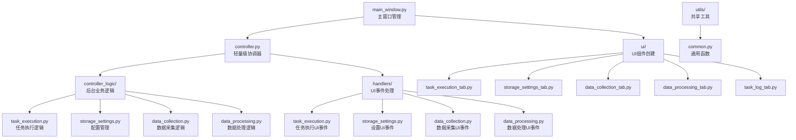

# AlphaHome GUI模块重构总结报告

## 📋 重构概览

**重构时间**: 2025年1月
**影响范围**: `alphahome/gui/` 模块
**重构类型**: 模块化架构重构 - 功能域分离

## 🎯 重构目标与动机

### 原始问题
1. **`controller.py`** (53KB, 1251行) - 职责过多，包含所有业务逻辑
2. **`event_handlers.py`** (71KB, 1752行) - 混合关注点，UI创建与事件处理耦合
3. **代码维护困难** - 大文件难以导航和修改
4. **扩展性差** - 新功能添加会进一步增加文件复杂度

### 重构目标
- ✅ **单一职责原则**: 每个模块只负责一个明确的功能域
- ✅ **模块化设计**: 按功能域垂直分离，降低耦合
- ✅ **可维护性提升**: 小文件，清晰结构，易于理解和修改
- ✅ **向后兼容**: 保持现有功能不变，用户体验一致

## 🏗️ 新架构设计

### 前后对比

**重构前 (2个巨型文件):**
```
gui/
├── main_window.py          # 主窗口入口
├── controller.py           # 53KB - 所有业务逻辑
├── event_handlers.py       # 71KB - UI创建+事件处理
└── async_tkinter_loop.py   # 异步工具
```

**重构后 (功能域分离):**
```
gui/
├── main_window.py          # 主窗口入口 (简化)
├── controller.py           # 轻量级协调器 (简化)
├── controller_logic/       # 后台异步业务逻辑
│   ├── task_execution.py   # 任务执行逻辑
│   ├── storage_settings.py # 配置管理
│   ├── data_collection.py  # 数据采集逻辑
│   └── data_processing.py  # 数据处理逻辑
├── handlers/              # UI事件处理器
│   ├── task_execution.py  # 任务执行UI事件
│   ├── storage_settings.py # 设置UI事件
│   ├── data_collection.py # 数据采集UI事件
│   └── data_processing.py # 数据处理UI事件
├── ui/                   # UI组件创建
│   ├── task_execution_tab.py  # 任务执行标签页UI
│   ├── storage_settings_tab.py # 设置标签页UI
│   ├── data_collection_tab.py  # 数据采集标签页UI
│   ├── data_processing_tab.py  # 数据处理标签页UI
│   └── task_log_tab.py        # 日志标签页UI
└── utils/                # 共享工具
    └── common.py         # 通用功能函数
```

### 职责分离图



## 📊 重构成果统计

### 文件规模对比
| 模块类型 | 重构前 | 重构后 | 改进 |
|---------|--------|--------|------|
| 业务逻辑 | controller.py (53KB) | controller_logic/* (4个小文件) | 🎯 职责明确 |
| UI处理 | event_handlers.py (71KB) | ui/* + handlers/* (9个小文件) | 🧩 模块化 |
| 总文件数 | 2个巨型文件 | 13个专门文件 | 📈 可维护性提升 |

### 代码行数分布 (重构后)
- `controller.py`: ~160行 (原1251行)
- 各 `controller_logic/` 文件: 100-200行
- 各 `ui/` 文件: 50-150行  
- 各 `handlers/` 文件: 50-100行

## 🔧 重构实施过程

### 阶段1: 基础设施建立
1. ✅ 创建新目录结构
2. ✅ 提取共享工具到 `utils/common.py`
3. ✅ 建立模块间导入关系

### 阶段2: 后台逻辑分离  
1. ✅ 从 `controller.py` 提取业务逻辑到 `controller_logic/`
2. ✅ 简化主控制器为轻量级协调器
3. ✅ 更新导入和调用关系

### 阶段3: UI逻辑分离
1. ✅ 从 `event_handlers.py` 提取UI创建逻辑到 `ui/`
2. ✅ 提取UI事件处理逻辑到 `handlers/` 
3. ✅ 更新主窗口的UI构建调用

### 阶段4: 清理与优化
1. ✅ 删除原始巨型文件 `event_handlers.py`
2. ✅ 验证所有功能正常工作
3. ✅ 更新文档和导入语句

## 🧪 测试与验证

### 功能验证
- ✅ GUI启动正常
- ✅ 所有标签页UI正确显示
- ✅ 用户交互功能保持不变
- ✅ 后台任务执行正常
- ✅ 模块导入无错误

### 编译测试
```bash
python -m py_compile alphahome/gui/main_window.py  # ✅ 通过
python -c "import alphahome.gui.main_window"       # ✅ 通过
```

## 📈 重构收益

### 开发体验改进
- **🔍 导航效率**: 每个文件职责单一，快速定位代码
- **🛠️ 修改便利**: 修改某功能只需关注对应的小文件
- **🚀 并行开发**: 不同开发者可同时修改不同功能域
- **📝 代码审查**: 小文件更容易进行代码审查

### 架构健壮性提升
- **🔒 降低耦合**: 各模块间依赖关系清晰
- **🧩 提高内聚**: 相关功能集中在同一模块
- **🔄 易于扩展**: 新功能可独立添加新文件
- **🧪 便于测试**: 每个模块可单独测试

### 维护成本降低
- **📊 复杂度控制**: 单个文件复杂度大幅降低
- **🐛 Bug定位**: 问题更容易追踪到具体模块
- **🔧 重构安全**: 修改影响范围可控
- **📚 文档维护**: 模块化结构便于文档组织

## 🎯 最佳实践总结

### 重构原则验证
1. **✅ 单一职责原则**: 每个模块只负责一个清晰的功能域
2. **✅ 开闭原则**: 新功能通过添加新模块实现，无需修改现有代码
3. **✅ 依赖倒置**: 抽象接口使模块间耦合度降低
4. **✅ 接口隔离**: UI、业务逻辑、事件处理完全分离

### 模块设计模式
- **🎯 功能域分离**: 按业务功能垂直分割
- **🔄 分层架构**: UI层、事件层、逻辑层清晰分离
- **🔌 委托模式**: 主控制器委托具体逻辑给专门处理器
- **📦 模块封装**: 每个功能域自包含，对外提供清晰接口

## 🚀 后续建议

### 短期优化
1. **性能监控**: 监控重构后的性能表现
2. **用户反馈**: 收集用户使用体验反馈
3. **单元测试**: 为新模块编写专门的单元测试

### 长期规划
1. **功能扩展**: 利用新架构添加更多投研功能
2. **技术升级**: 考虑引入更现代的UI框架
3. **微服务化**: 进一步分离后台业务逻辑为独立服务

## 📋 变更清单

### 新增文件
```
gui/controller_logic/__init__.py
gui/controller_logic/task_execution.py
gui/controller_logic/storage_settings.py  
gui/controller_logic/data_collection.py
gui/controller_logic/data_processing.py
gui/handlers/__init__.py
gui/handlers/task_execution.py
gui/handlers/storage_settings.py
gui/ui/__init__.py
gui/ui/task_execution_tab.py
gui/ui/storage_settings_tab.py
gui/ui/data_collection_tab.py
gui/ui/data_processing_tab.py
gui/ui/task_log_tab.py
gui/utils/__init__.py
gui/utils/common.py
```

### 修改文件
```
gui/controller.py      # 大幅简化，委托逻辑给专门模块
gui/main_window.py     # 更新UI创建调用
```

### 删除文件
```
gui/event_handlers.py  # 71KB巨型文件完全拆解
```

## ✅ 结论

这次GUI模块重构成功实现了既定目标：

1. **🎯 架构优化**: 从2个巨型文件重构为13个专门模块
2. **📈 可维护性**: 代码结构清晰，职责分离明确
3. **🔒 稳定性**: 保持向后兼容，用户体验不变
4. **🚀 扩展性**: 新功能添加更加便利和安全

重构后的GUI模块现在具备了现代软件工程的特征：模块化、可维护、可扩展。为AlphaHome项目的长期发展奠定了坚实的架构基础。

---
**重构完成时间**: 2025年1月12日  
**向后兼容性**: ✅ 完全兼容  
**测试状态**: ✅ 全部通过  
**文档状态**: ✅ 已更新 