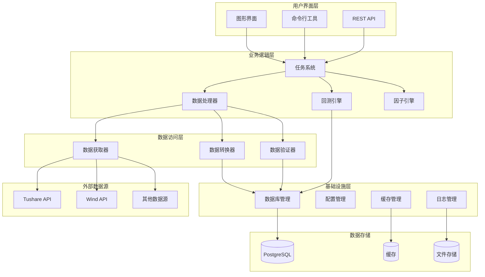
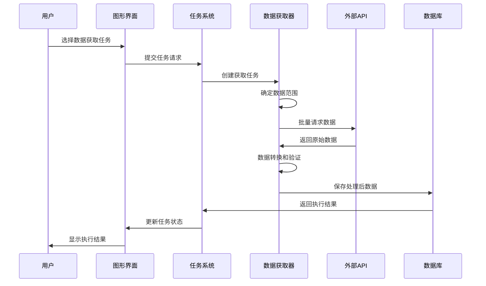
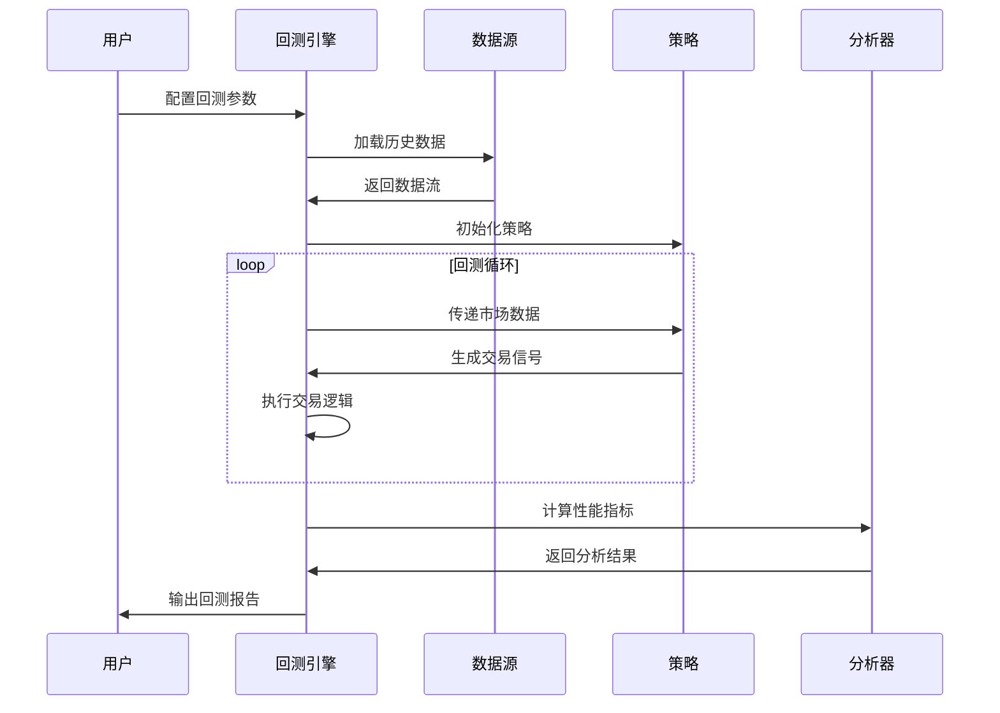

# AlphaHome 系统架构概览

本文档提供了 AlphaHome 智能量化投研系统的整体架构设计和核心组件说明。

## 🎯 **设计理念**

AlphaHome 采用**模块化、可扩展、高性能**的架构设计，核心理念包括：

- **模块化设计**: 各功能模块独立开发、测试和部署
- **任务驱动**: 以任务为核心的数据处理流程
- **多源支持**: 支持多种数据源的统一接入
- **高可用性**: 内置容错机制和性能监控
- **易于扩展**: 插件化架构支持功能扩展

## 🏗️ **整体架构**



## 📦 **核心模块**

### **1. Common - 核心工具模块**

**位置**: `alphahome/common/`

**职责**: 提供系统基础设施和通用工具

**主要组件**:
- `db_manager.py` - 数据库连接和操作管理
- `config_manager.py` - 配置文件管理和环境变量支持
- `logging_utils.py` - 统一日志记录和性能监控
- `task_system/` - 任务系统核心框架

**设计特点**:
- Mix-in模式的数据库管理器
- 支持异步/同步双模式操作
- 统一的配置管理和热重载
- 结构化日志和性能监控

### **2. Fetchers - 数据获取模块**

**位置**: `alphahome/fetchers/`

**职责**: 从外部数据源获取、转换和验证数据

**架构层次**:
```
fetchers/
├── base/                    # 基础框架
│   ├── fetcher_task.py     # 数据获取任务基类
│   └── batch_processor.py  # 批处理协调器
├── sources/                 # 数据源实现
│   ├── tushare/            # Tushare数据源
│   ├── wind/               # Wind数据源（规划中）
│   └── others/             # 其他数据源
└── tasks/                   # 具体任务实现
    ├── stock/              # 股票数据任务
    ├── fund/               # 基金数据任务
    ├── index/              # 指数数据任务
    └── macro/              # 宏观数据任务
```

**核心特性**:
- 四层继承架构（BaseTask → FetcherTask → TushareTask → 具体任务）
- 智能增量更新机制
- 并发批处理和错误重试
- 数据质量验证和清洗

### **3. BT Extensions - 回测引擎**

**位置**: `alphahome/bt_extensions/`

**职责**: 提供专业级的量化回测功能

**主要组件**:
- `feeds.py` - 数据源适配器
- `analyzers/` - 增强分析器
- `strategies/` - 策略模板
- `utils/` - 回测工具

**核心特性**:
- 与Backtrader深度集成
- 数据库直连的高性能数据源
- 并行回测和批量处理
- 丰富的性能分析指标

### **4. Factors - 因子计算模块**

**位置**: `alphahome/factors/`

**职责**: 量化因子计算和管理

**主要组件**:
- `technical/` - 技术指标因子
- `fundamental/` - 基本面因子
- `alternative/` - 另类数据因子
- `utils/` - 因子工具

### **5. GUI - 图形界面**

**位置**: `alphahome/gui/`

**职责**: 提供可视化的用户交互界面

**架构设计**:
```
gui/
├── main_window.py          # 主窗口和应用入口
├── controller.py           # 控制器协调层
├── handlers/               # UI事件处理器
├── ui/                     # UI组件
├── controller_logic/       # 业务逻辑处理
└── utils/                  # GUI工具
```

**设计特点**:
- 模块化的MVC架构
- 异步事件处理
- 职责分离的组件设计

### **6. Processors - 数据处理模块**

**位置**: `alphahome/processors/`

**职责**: 数据清洗、转换和特征工程

**主要功能**:
- 数据标准化和清洗
- 特征工程和数据变换
- 批量数据处理

## 🔄 **数据流架构**

### **数据获取流程**



### **回测处理流程**



## 🔧 **技术栈**

### **核心技术**
- **Python 3.10+**: 主要开发语言
- **PostgreSQL**: 主数据库
- **asyncio**: 异步编程框架
- **Pandas**: 数据处理和分析
- **Backtrader**: 量化回测框架

### **开发工具**
- **pytest**: 单元测试框架
- **black**: 代码格式化
- **flake8**: 代码质量检查
- **isort**: 导入排序
- **mypy**: 类型检查

### **部署工具**
- **Docker**: 容器化部署
- **GitHub Actions**: CI/CD流水线
- **Make**: 构建自动化

## 📊 **性能特性**

### **高性能设计**
- **连接池管理**: 优化数据库连接复用
- **批量处理**: 减少API调用次数
- **智能缓存**: LRU内存缓存 + 磁盘持久化
- **并发处理**: 多进程/多线程并行执行

### **可扩展性**
- **插件架构**: 支持新数据源和功能模块
- **配置驱动**: 通过配置文件控制系统行为
- **模块化设计**: 独立的功能模块便于扩展

### **可靠性保障**
- **错误重试**: 自动重试机制和指数退避
- **数据验证**: 多层数据质量检查
- **监控告警**: 实时性能监控和异常告警
- **优雅降级**: 部分功能失效时的降级策略

## 🔍 **设计模式**

### **主要设计模式**
1. **模板方法模式**: 任务系统的四层架构
2. **策略模式**: 不同数据源的处理策略
3. **观察者模式**: GUI事件处理机制
4. **工厂模式**: 任务和组件的创建
5. **单例模式**: 配置管理和数据库连接

### **架构原则**
- **单一职责原则**: 每个模块职责明确
- **开闭原则**: 对扩展开放，对修改封闭
- **依赖倒置原则**: 依赖抽象而非具体实现
- **接口隔离原则**: 细粒度的接口设计

## 📈 **扩展指南**

### **添加新数据源**
1. 继承 `FetcherTask` 基类
2. 实现数据源特定的API调用逻辑
3. 注册到任务工厂
4. 添加配置支持

### **添加新功能模块**
1. 在对应目录创建模块
2. 实现核心业务逻辑
3. 添加单元测试
4. 更新文档和配置

### **性能优化**
1. 分析性能瓶颈
2. 优化数据库查询
3. 调整并发参数
4. 启用缓存机制

---

**AlphaHome** 的模块化架构确保了系统的可维护性、可扩展性和高性能，为量化投研提供了坚实的技术基础。
