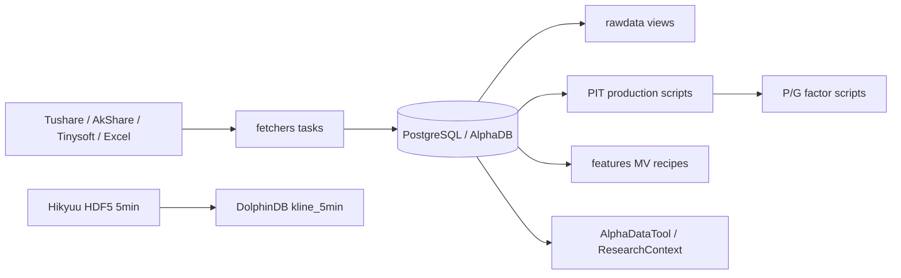

# AlphaHome 系统架构概览

## 定位

AlphaHome 当前定位为离线金融数据和特征生产平台：

- 采集多源数据并写入 AlphaDB/PostgreSQL。
- 维护 rawdata 视图、PIT 表和离线 features。
- 为研究侧提供 `ResearchContext` / `AlphaDataTool`。
- 通过 `scripts/production/` 支持日常更新、回填、修复和因子补算。

统一运维 CLI 已下线，当前入口是 GUI、脚本和 `python -m` 模块。

## 模块边界

```text
alphahome/
├── common/
│   ├── config_manager.py      # ~/.alphahome/config.json + 环境变量
│   ├── db_manager.py          # PostgreSQL 同步/异步管理
│   ├── task_system/           # BaseTask、注册、工厂
│   └── planning/              # BatchPlanner / ExtendedBatchPlanner
├── fetchers/
│   ├── base/                  # FetcherTask
│   ├── sources/               # tushare / akshare / tinysoft / excel
│   └── tasks/                 # 具体采集任务
├── features/
│   ├── cards/                 # feature card YAML
│   ├── recipes/               # MV/Python recipes
│   └── storage/               # MV 初始化、刷新、校验
├── integrations/
│   └── dolphindb/             # Hikyuu 5min -> DolphinDB
├── providers/                 # AlphaDataTool
└── gui/                       # Tkinter GUI
```

## 数据流


```mermaid
flowchart LR
    Sources[Tushare / AkShare / Tinysoft / Excel] --> Fetchers[fetchers tasks]
    Fetchers --> AlphaDB[(PostgreSQL / AlphaDB)]
    AlphaDB --> Rawdata[rawdata views]
    AlphaDB --> PIT[PIT production scripts]
    PIT --> FactorPG[P/G factor scripts]
    AlphaDB --> Features[features MV recipes]
    AlphaDB --> Providers[AlphaDataTool / ResearchContext]
    Hikyuu[Hikyuu HDF5 5min] --> DDB[DolphinDB kline_5min]
```

## 任务系统

所有任务通过 `BaseTask.execute()` 进入统一生命周期：

```text
_pre_execute -> _fetch_data -> process_data -> _validate_data -> _save_data -> _post_execute
```

采集任务的继承层次：

```text
BaseTask
└── FetcherTask
    ├── TushareTask
    ├── AkShareTask
    ├── TinySoftTask
    └── ExcelTask
```

`UnifiedTaskFactory` 负责注册任务、初始化数据库连接、注入 token/config，并为 GUI 和脚本创建任务实例。

## 存储

| 层 | 说明 |
| --- | --- |
| 源 schema | `tushare`、`akshare`、`tinysoft` 等，保存原始或标准化后的采集数据 |
| `rawdata` | 由任务保存流程自动创建/更新的统一视图层，Tushare 同名表优先 |
| `features` | 离线特征 MV 输出 schema |
| `pgs_factors` | PIT 表和 P/G 因子结果 |
| DolphinDB | 5 分钟 K 线高速查询层，当前表为 `kline_5min` |

## 生产脚本

| 目录 | 用途 |
| --- | --- |
| `scripts/production/data_updaters/tushare/` | 所有 fetch 任务的生产级智能更新 |
| `scripts/production/data_updaters/pit/` | PIT 表更新与财务指标计算 |
| `scripts/production/factor_calculators/` | P/G 因子补算和并行计算 |
| `scripts/production/database/` | 北交所代码映射等数据库维护 |
| `scripts/database/` | AlphaDB 到 NAS 的逻辑同步/恢复 |
| `scripts/maintenance/` | 一次性数据修复 |

## 已下线组件

- `alphahome.processors` 已删除。
- `ah` / `alphahome-cli` / `refresh-materialized-view` 不再安装。
- `alphahome.cli` 仅保留兼容空壳，不作为当前入口。

历史设计和验收记录保留在 `docs/development/archive/`、`docs/tasks/` 和 `PHASE*_COMPLETION_REPORT.md`。
