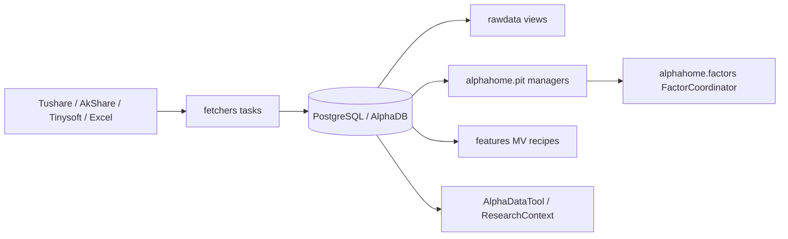

# AlphaHome 系统架构概览

## 定位

AlphaHome 当前定位为离线金融数据和特征生产平台：

- 采集多源数据并写入 AlphaDB/PostgreSQL。
- 维护 rawdata 视图、PIT 表和离线 features。
- 为研究侧提供 `ResearchContext` / `AlphaDataTool`。
- 通过 `scripts/production/` 支持日常更新、回填、修复和因子补算。

统一运维 CLI 已下线，当前入口是 GUI、脚本和 `python -m` 模块。

## 模块边界

```text
alphahome/
├── common/
│   ├── config_manager.py      # ~/.alphahome/config.json + 环境变量
│   ├── db_manager.py          # PostgreSQL 同步/异步管理
│   ├── task_system/           # BaseTask、注册、工厂
│   └── planning/              # BatchPlanner / ExtendedBatchPlanner
├── fetchers/
│   ├── base/                  # FetcherTask
│   ├── sources/               # tushare / akshare / tinysoft / excel
│   └── tasks/                 # 具体采集任务
├── factors/
│   ├── base/                  # FactorTask / FactorTaskContract
│   ├── core/                  # P/G 只读仓库、纯计算与兼容 calculator
│   ├── tasks/                 # task_type="factor" 的 P/G 注册入口
│   ├── coordinator.py         # 依赖、周五日期、脏传播和唯一生产入口
│   ├── persistence.py         # staging/COPY/锁/单事务日期替换
│   ├── audit_service.py       # 缺口、覆盖率、日期与单股诊断
│   └── repair.py              # repair_id 归档、修复和原子回滚
├── features/
│   ├── cards/                 # feature card YAML
│   ├── recipes/               # MV/Python recipes
│   └── storage/               # MV 初始化、刷新、校验
├── pit/
│   ├── base/                  # PITConfig / PITTableManager / PITTask
│   ├── calculators/           # 财务指标 calculator
│   ├── tasks/                 # task_type="pit" 的统一任务注册入口
│   ├── audit_service.py       # 覆盖率、缺口、单股诊断和审计快照
│   └── database/              # PIT DDL SQL
├── integrations/              # 外部系统集成预留
├── providers/                 # AlphaDataTool
└── gui/                       # Tkinter GUI
```

## 数据流


```mermaid
flowchart LR
    Sources[Tushare / AkShare / Tinysoft / Excel] --> Fetchers[fetchers tasks]
    Fetchers --> AlphaDB[(PostgreSQL / AlphaDB)]
    AlphaDB --> Rawdata[rawdata views]
    AlphaDB --> PIT[alphahome.pit managers]
    PIT --> FactorPG[alphahome.factors FactorCoordinator]
    AlphaDB --> Features[features MV recipes]
    AlphaDB --> Providers[AlphaDataTool / ResearchContext]
```

## 任务系统

所有任务通过 `BaseTask.execute()` 进入统一生命周期：

```text
_pre_execute -> _fetch_data -> process_data -> _validate_data -> _save_data -> _post_execute
```

采集任务的继承层次：

```text
BaseTask
└── FetcherTask
    ├── TushareTask
    ├── AkShareTask
    ├── TinySoftTask
    └── ExcelTask
```

`UnifiedTaskFactory` 负责注册任务、初始化数据库连接、注入 token/config，并为 GUI 和脚本创建任务实例。

PIT 任务也是统一任务系统的一部分，`task_type="pit"`。`PITTask` 只负责把统一执行模式映射到现有 PIT manager：

| GUI/CLI 模式 | PIT 内部动作 |
| --- | --- |
| 智能增量 | `incremental_update` |
| 全量更新 | `full_backfill` |
| 手动增量 | 指定日期范围的 `full_backfill`，支持单股配置时走 `single_backfill` |
| 只审计 | `PITAuditService.audit_task`，不写业务 PIT 表 |

P/G 因子以 `task_type="factor"` 注册。选择 G 会在因子域内展开 P；选择 P
只校验 PIT 来源就绪状态，不触发 PIT 计算或修复。P/G 业务表与 PIT 原始事实保持
schema 隔离。

## 存储

| 层 | 说明 |
| --- | --- |
| 源 schema | `tushare`、`akshare`、`tinysoft` 等，保存原始或标准化后的采集数据 |
| `rawdata` | 由任务保存流程自动创建/更新的统一视图层，Tushare 同名表优先 |
| `features` | 离线特征 MV 输出 schema |
| `pit` | 规范化 PIT 会计层、行业快照等时点数据 |
| `factors` | P/G 等因子计算结果 |
| `pgs_factors` | 旧 schema 兼容视图层，不作为新数据落库位置 |

`pgs_factors` 的分拆迁移脚本是 `scripts/database/split_pgs_factors_schema.py`，可重复执行；它会把 PIT 基表迁入 `pit`，把 P/G 因子迁入 `factors`，并重建旧 schema 的兼容视图。

## 生产脚本

| 目录 | 用途 |
| --- | --- |
| `scripts/production/data_updaters/tushare/` | 所有 fetch 任务的生产级智能更新 |
| `scripts/production/data_updaters/pit/` | PIT 表更新与财务指标计算的兼容入口，真实实现位于 `alphahome.pit` |
| `scripts/production/factor_calculators/` | P/G 因子补算和并行计算的兼容入口，真实实现位于 `alphahome.factors` |
| `scripts/database/` | AlphaDB 到 NAS 的逻辑同步/恢复 |

## PIT 管理

`pit` schema 是标准 PIT 落库层，当前一等任务包括：

- `pit_income_quarterly`
- `pit_balance_quarterly`
- `pit_cashflow_quarterly`
- `pit_financial_indicators`
- `pit_industry_classification`

PIT 审计结果写入 `pit.pit_audit_snapshot`。GUI 的 `PIT 管理` 页签负责刷新任务状态、执行增量/全量、只审计、查看覆盖缺口和单股诊断；常规运行状态仍复用 `任务运行与状态` 页，不引入第二套日志系统。

`features` 和 `factors` 消费 PIT 输出，不直接承担 PIT 口径治理；`pgs_factors` 只保留旧查询兼容视图。

## 因子管理

P v2.0 与 G v1.1 的生产快照日期是自然周五，包含节假日周五。自动运行只处理
运行日前最近一个完整周五；非周五生产写入会被应用校验和数据库约束同时拒绝。

`FactorCoordinator` 是唯一生产编排入口，支持 `smart`、`manual`、`full`、`audit`。
`smart` 计算缺失日期和来源变脏日期：P 从 PIT 水位传播，G 从变化的 P 日期向后
传播最多 730 天。自动任务单项超过 26 个日期时返回
`needs_manual_backfill`，不做部分写入。

GUI 在 `PIT 管理` 与 `特征更新` 之间提供独立的 `因子管理` 页。选择状态不与 PIT
共享；页面提供预检、智能增量、指定日期回补、全量回算、只审计、日期缺口、
日期诊断和单股诊断。执行记录在 `factors.factor_run*`，审计记录在
`factors.factor_audit_snapshot`，两类时间不混用。

统一命令入口为：

```powershell
python -m alphahome.factors run --tasks p g --mode smart --dry-run
python -m alphahome.factors audit --tasks p g
python -m alphahome.factors diagnose --task p --date 2026-09-11
python -m alphahome.factors repair
```

周六 08:00 的 Windows 计划任务安装器默认只预览，必须显式传入 `-Apply` 才会
注册 `AlphaHome-Factor-Weekly`；周任务不运行 PIT。

## 已下线组件

- `alphahome.processors` 已删除。
- 旧外部分钟线加速集成已删除。
- `ah` / `alphahome-cli` / `refresh-materialized-view` 不再安装。
- `alphahome.cli` 仅保留兼容空壳，不作为当前入口。

历史设计和验收记录保留在 `docs/development/archive/`、`docs/tasks/` 和 `PHASE*_COMPLETION_REPORT.md`。
