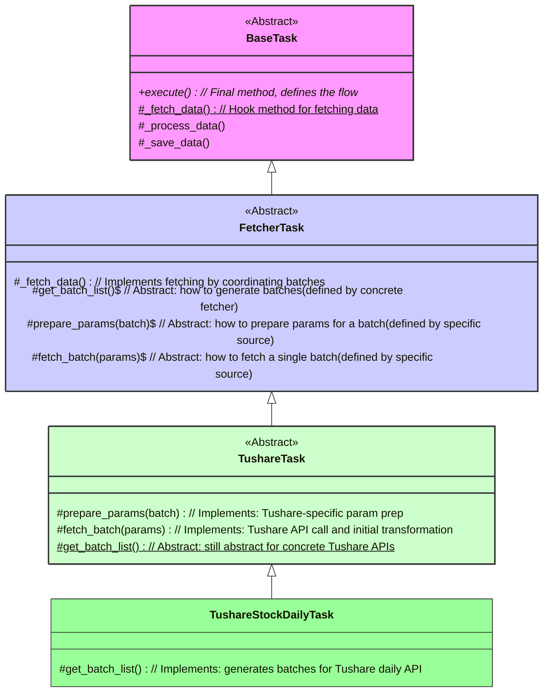

# RIPER-5 任务体系四层架构设计方案

## 概述

本项目任务体系旨在构建一个清晰、可维护、可扩展的四层继承结构，以有效管理从通用任务生命周期到特定数据源API调用的复杂性。核心思想是采用**模板方法模式（Template Method Pattern）**，确保每层职责单一且边界清晰。

## 当前架构问题回顾

在初步分析 `BaseTask`、`FetcherTask` 和 `TushareTask` 后，我们发现了一些关键问题：

1.  **`BaseTask` (任务基类)**: 包含了特定数据采集任务（Fetcher）才关心的抽象方法（如`get_batch_list`、`fetch_batch`），使得基类的抽象不够纯粹。
2.  **`FetcherTask` (采集基类)**: 引入了独立的执行入口 `run()`，绕过了父类 `BaseTask` 的 `execute()` 生命周期，导致了平行的执行路径和模糊的调用关系。
3.  **`TushareTask` (Tushare任务类)**: 包含了大量与 `FetcherTask` 重复的通用执行和调度逻辑（如 `execute` 和 `smart_incremental_update`），违反了 DRY 原则，且其本身并非具体执行层。
4.  **未充分利用 `TushareStockDailyTask` 等具体任务类**: 这些类才是真正定义特定API业务逻辑的地方，但其在旧架构中的职责边界不明确。

**核心问题**: 职责边界模糊和执行路径混乱。

## 新设计方案 (INNOVATE 阶段)

我们推荐采用多层模板方法模式，将职责清晰地划分为以下四层：

1.  **`BaseTask` (模板引擎)**:
    *   **职责**: 定义所有任务**唯一**的、**最终的**执行入口 `execute()`。它提供了一个不可重写的"模板流程"，包括准备 -> 获取数据 -> 处理数据 -> 验证数据 -> 保存数据 -> 清理。
    *   **动作**: `execute` 方法将调用一系列受保护的"钩子"方法（如 `_fetch_data`、`_process_data` 等），由子类具体实现这些钩子。从此类中移除所有特定于数据采集的概念。

2.  **`FetcherTask` (并发批处理协调器)**:
    *   **职责**: 作为所有数据采集任务的通用协调器。它实现 `BaseTask` 的 `_fetch_data` 钩子方法，其核心功能是：确定数据获取范围 -> 生成批次列表 -> 使用并发和重试机制执行这些批次 -> 合并批次结果。
    *   **动作**: 定义**三个新的抽象方法**供其子类实现：
        *   `get_batch_list()`: 如何生成数据批次（业务层定义）。
        *   `prepare_params(batch)`: 如何准备单个批次的API请求参数（技术层定义）。
        *   `fetch_batch(params)`: 如何获取单个批次的数据（技术层定义）。

3.  **`TushareTask` (Tushare技术专家)**:
    *   **职责**: 作为一个**抽象类**，它专注于与 Tushare API 打交道的所有技术细节。它知道**如何统一地调用 Tushare API**。
    *   **动作**: 它将**实现** `FetcherTask` 的 `prepare_params` 和 `fetch_batch` 方法，因为所有 Tushare API 的参数准备和实际调用方式是相似的。然而，它不知道每个具体 Tushare API 的批处理逻辑，因此将 `get_batch_list` **继续声明为抽象方法**，强制其子类实现。

4.  **`TushareStockDailyTask` (具体业务执行者)**:
    *   **职责**: 作为最终的具体实现者，它只关心特定 Tushare API（例如 `daily` 接口）的业务逻辑。
    *   **动作**: 它唯一需要做的事情是**实现 `TushareTask` 的 `get_batch_list` 方法**，定义如何为 `daily` 接口生成批次。所有其他通用或技术性的任务都由其父类处理。

### 设计优势

*   **单一入口，清晰流向**: 所有任务都通过 `task.execute()` 启动，调用链明确。
*   **职责分明，高度解耦**: 每层职责单一，修改某一层不会轻易影响其他层。
*   **极致的代码复用**: 通用流程 (`BaseTask`)、并发获取 (`FetcherTask`) 和 Tushare API 交互 (`TushareTask`) 的逻辑都能被最大化复用。
*   **极强的可维护性和扩展性**: 
    *   增加新数据源（如 `WindTask`），只需继承 `FetcherTask` 并实现少量方法。
    *   增加新 Tushare API 接口（如 `TushareFinaIncomeTask`），只需继承 `TushareTask` 并实现 `get_batch_list` 方法。

### UML 类图

## 实施计划 (PLAN 阶段)

我们将按照以下详细的、分步的清单进行重构。

**修订后的实施检查清单:**

**第一部分: 重构 `BaseTask` (`alphahome/common/task_system/base_task.py`)**
1.  [ ] 将 `execute()` 方法内部调用的 `fetch_data`, `process_data`, `validate_data`, `save_data` 等方法重命名为 `_fetch_data`, `_process_data` 等（添加前导下划线），以表明它们是模板内部的"钩子"方法。
2.  [ ] 将这些方法的定义也同步重命名（例如 `async def fetch_data` -> `async def _fetch_data`），并确保 `_fetch_data` 保持为抽象方法。
3.  [ ] 从 `BaseTask` 的定义中彻底移除 `get_batch_list` 和 `fetch_batch` 这两个抽象方法，因为它们不属于通用任务。

**第二部分: 重构 `FetcherTask` (`alphahome/fetchers/base/fetcher_task.py`)**
1.  [ ] **实现** `BaseTask` 的 `_fetch_data` 钩子方法。这个方法将负责协调批处理的生命周期。
2.  [ ] 将现有 `run()` 方法的全部逻辑（包括生成批次、并发执行、合并结果）移动到新的 `_fetch_data` 方法内部。
3.  [ ] **删除**独立的 `run()` 方法。
4.  [ ] **删除** `FetcherTask` 中原有的 `get_latest_date` 方法。在 `_fetch_data` 内部，需要获取最新日期时，应调用**继承自 `BaseTask` 的 `self.get_latest_date_for_task()` 方法**，以统一最新日期的获取方式。
5.  [ ] **重要**: `_fetch_data` 方法的最终返回值应是合并所有批次结果后的 `pandas.DataFrame`。它不应再处理 `process_data`, `validate_data`, `save_data` 的调用，这些将由 `BaseTask.execute` 统一调度。
6.  [ ] 将 `get_batch_list`, `prepare_params`, `fetch_batch` **重新定义为抽象方法**，强制其子类实现。这意味着 `FetcherTask` 明确要求它的子类来定义如何生成批次、如何准备参数以及如何获取单个批次的数据。

**第三部分: 重构 `TushareTask` (`alphahome/fetchers/sources/tushare/tushare_task.py`)**
1.  [ ] 确保 `TushareTask` 继承自重构后的 `FetcherTask`。
2.  [ ] **实现** `FetcherTask` 的 `prepare_params` 方法。这将包含Tushare API请求参数的通用准备逻辑。
3.  [ ] **实现** `FetcherTask` 的 `fetch_batch` 方法。这部分将包含调用 `self.api.query` 进行数据获取和 `self.data_transformer.process_data` 进行数据转换的逻辑。
4.  [ ] 将 `TushareTask` 中原有的 `get_batch_list` 方法**再次声明为抽象方法**。由于 `TushareTask` 只是一个Tushare的抽象基类，它并不知道每个具体Tushare接口的批处理策略，这个职责将下放给 `TushareStockDailyTask` 等具体的子类。
5.  [ ] **大规模清理**: 删除 `TushareTask` 中所有旧的、冗余的执行逻辑，包括：
    *   `execute` 方法
    *   `smart_incremental_update` 方法
    *   `run` 兼容方法
    *   `_aggregate_batch_results` 辅助方法
    *   `_build_final_result` 辅助方法
    *   `fetch_data` 兼容方法
    *   `_ensure_table_exists` 方法 (由 `BaseTask` 统一处理)
    *   `get_latest_date` 方法 (由 `BaseTask` 统一处理)

**第四部分: 验证 `TushareStockDailyTask` (`alphahome/fetchers/tasks/stock/tushare_stock_daily.py`)**
1.  [ ] 确认该文件无需进行任何修改。它的 `get_batch_list` 实现已经符合新架构的要求，因为现在 `TushareTask` 将 `get_batch_list` 声明为抽象方法，正是由 `TushareStockDailyTask` 来实现这个具体业务逻辑。 